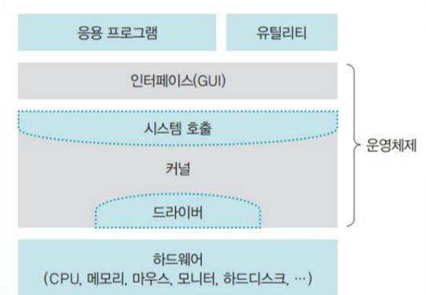
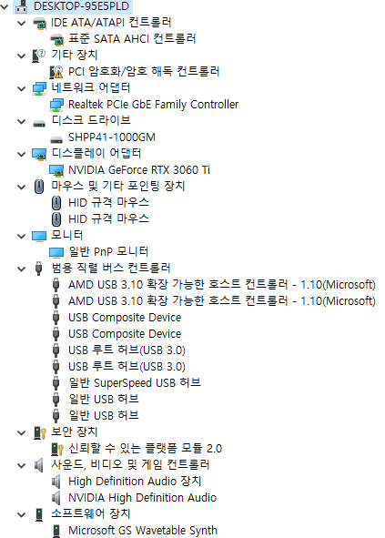
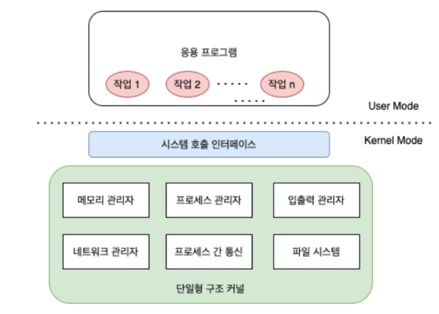
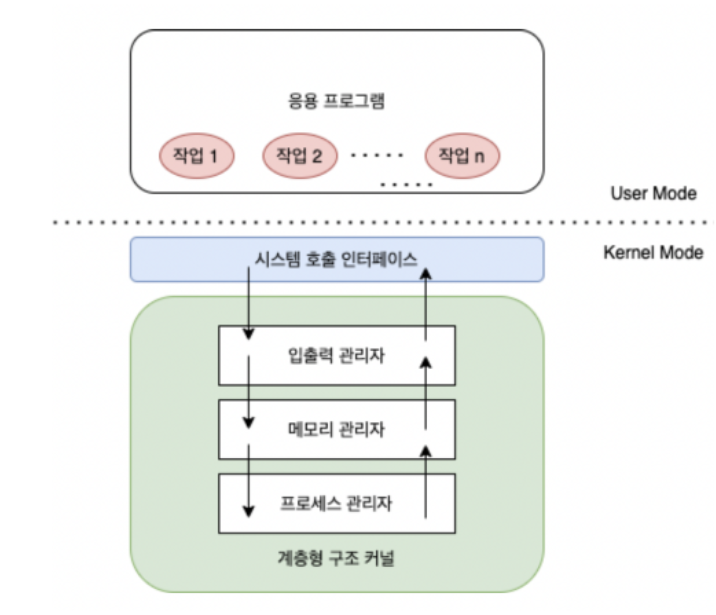
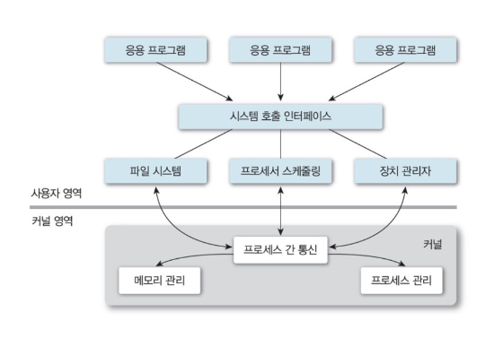

# CHAPTER1 운영체제의 개요

## 1. 운영체제 소개
### 운영체제란?
- OS(Operating System)이라고 불리는 운영체제는 컴퓨터 시스템의 핵심 소프트웨어로, 컴퓨터 하드웨어와 응용 프로그램 간의 상호작용을 관리하고 제어하는 역할을 함
- 대표적인 예는 개인용 컴퓨터에서 사용하는 윈도우와 Mac OS, 대형 컴퓨터에서 사용하는 Unix, Linux 등
- 작은 시스템에 내장하도록 만든 운영체제는 임베디드 운영체제 또는 임베디드 시스템이라고 함. 해당 운영체제도 운영체제 중 하나이나 CPU의 성능이 낮고 메모리 크기가 낮은 기계에 설치되어 다른 운영체제보다 기능이 빠져있음

<br>

### 운영체제의 필요성
- 컴퓨터는 운영체제 없이도 작동할 수 있으나 '애니악'은 매번 새로운 기능을 구현하려면 매번 회로를 변경해야하고 복잡한 기능은 구현하기 어려웠음
- 운영체제가 없는 기계는 당시 구현한 기능 외에 다른 기능을 추가하거나 성능을 향상할 수 없음
- 반면에 운영체제가 있는 기계는 기능의 추가나 성능의 변경이 가능하므로 성능 및 효율성의 향상을 꾀할 수 있어 이러한 기계는 프로그램이 가능한 기계라고 부름
- 운영체제의 중요성은 성능 향상뿐 아니라 자원 관리(resource management)의 중요한 역할도 수행함. 우리가 컴퓨터를 사용할 때 여러 소프트웨어를 동시에 사용하는데 이를 응용 프로그램(application program)이라고 함
- 여기서 많은 응용 프로그램이 존재하는데 해당 프로그램들이 사용하는 하드웨어 장치(CPU, 키보드, 마우스 등)는 제한적인데 모든 응용 프로그램에서 사용하는데 있어 운영체제는 해당 강력한 중재자로 하드웨어 사용을 결정하고 컴퓨터 자원을 보호하는 역할도 함
    - 기술이 발달하면서 메모리크기가 커지면서 하드디스크, 마우스, 그래픽카드 등등 다양한 주변 장치가 생기게 되었고 이렇게 컴퓨터에 부착된 모든 장치를 컴퓨터 자원(computer resource)이라고 함
    - 운영체제는 자원을 보호한다고 했는데 악의적인 사용자가 데이터를 지우거나 덮어쓰는 일이 발생하는 것을 방지하기 위해 운영체제는 알아서 적당한 위치에 저장해주고 응용 프로그램과 사용자에게 모든 자원을 숨긴다 (사용자가 직접 자원에 접근하는 것을 막기위함)
    - 운영체제는 숨어있는 자원을 직접 접근하지 못하도록 하는 대신 자원을 이용할 수 있는 여러가지 방법을 제공함. 이와같이 사용자가 컴퓨터를 사용할 수 있게 해주고 그 결과를 알려주는 것을 인터페이스(interface)라고 함 

<br>

#### 인터페이스란?


- 운영체제는 응용 프로그램이나 사용자에게 컴퓨터 자원을 사용할 수 있는 인터페이스를 제공한다
- 여기서 인터페이스는 커널에 사용자의 명령을 전달하고 실행 결과를 사용자에게 알려주는 역할을 하는데 사용자가 컴퓨터 자원을 쉽게 이용하도록 제공하는 것이며 책에서는 차에서 핸들, 계기판을 예시로 이야기하였음

<br>

### 운영 체제의 역할
|역할|목표|
|:---:|:---:|
|자원 관리|효율성|
|자원 보호|안전성|
|하드웨어 인터페이스 제공|확장성|
|사용자 인터페이스 제공|편리성|

<br>

#### 자원 관리
- 위에서 말했던 내용처럼 컴퓨터 자원을 사용하는데 이러한 자원을 응용 프로그램에 나누어주어 사용자가 원할하게 작업할 수 있도록 도움
- 여러개라면 적당한 순서로 자원을 배분하고 적절한 시점에 자원을 회수하여 다른 응용 프로그램에 나누어줌

<br>

#### 자원 보호
- 위의 내용처럼 비정상적인 작업으로부터 컴퓨터 자원을 숨겨 자원을 지킴

<br>

#### 하드웨어 인터페이스 제공
- 우리는 다양한 하드웨어를 사용하는데 운영체제는 복잡한 과정 없이 다양한 장치를 사용할 수 있도록 해주는 하드웨어 인터페이스를 제공
- 운영체제는 다양한 하드웨어를 일관된 방법으로 사용할 수 있도록 지원하기 때문에 우리가 어떤 회사에서 만든 하드웨어 인지 신경쓸 필요가 없음
- 하지만 하드웨어 인터페이스 지원은 드라이버를 컴퓨터에 설치해야 가능한데 드라이버는 하드웨어 장치와 상호작용하기 위해 만들어진 컴퓨터 프로그램으로 장치 드라이버, 디바이스 드라이버, 장치 제어기, 소프트웨어 드라이버라고도 부름. 해당 드라이버는 운영체제를 설치할 때 자동으로 설치되어 하드웨어 종류에 상관없이 사용할수 있게해주지만 일부 하드웨어의 경우 따로 설치해야함

<br>


- 윈도우 드라이버 확인을 위한 장치 관리자

<br>

#### 사용자 인터페이스 제공
- 하드웨어 인터페이스가 다양한 부품을 사용하기 위한 것이라면 사용자 인터페이스는 사용자가 운영체제를 편리하게 사용하도록 지원하기 위한 것
- 과거 유닉스, MS-DOS의 경우 마우스 없이 키보드만 사용했기 때문에 (CLI: Command-Line Interface) 일반인이 배우기 쉽지 않았음
- 그러나 사용자 인터페이스 (GUI: Graphical User Interface)를 제공하여 컴퓨터보다 편리한 인터페이스를 제공

<br>

## 2. 운영체제의 역사

|구분|시기|주요 기술|특징|
|:---:|:---:|:---:|:---:|
|0기|1940년대|없음|진공관(0과1) 사용|
|1기|1950년대|카드 리더, 라인 프린터|일괄작업 시스템, 운영체제의 등장|
|2기|1960년대 초반|키보드, 모니터|대화형 시스템|
|3기|1960년대 후반|C 언어|다중 프로그래밍 기술 개발, 시분할 시스템|
|4기|1970년대|PC|개인용 컴퓨터의 등장, 분산 시스템|
|5기|1990년대|웹|클라이언트/서버 시스템|
|6기|2000년대|스마트폰|P2P 시스템, 그리드 컴퓨팅, 클라우드 컴퓨팅, 사물 인터넷|

<br>

### 1. 초창기 컴퓨터 (1940년대)
- 전선을 잭에 꼽아 회로를 연결하여 구성한 '에니악은' 30톤 규모의 거대한 계산기로 미사일 탄도를 계산하기 위해 제작
    - 전선을 연결하여 논리회로를 구성하는 것을 '하드와이어링' 방식이라고 함
- 백열 전구 같은 모양의 진공관이라는 소자를 사용하여 진공관이 켜지면 1, 꺼지면 0이라고 판단하였는데 이는 컴퓨터가 2진법을 사용하는 계기가 되었음
- 초창기의 컴퓨터에는 운영체제가 없이 미사일 탄도 계산만을 위해 만들어짐

<br>

### 2. 일괄 작업 시스템 (1950년대)
- 진공관에서 IC(Integrated Circuit)라는 칩으로 만들어지게 되었는데 이칩은 진공관과 전선으로 만들어진 논리회로를 아주 작은 크기로 구현한 것으로 이를 이용해 현대적인 컴퓨터가 탄생
- 이 때의 컴퓨터에는 미약하지만 중앙처리장치인 CPU와 메인 메모리가 있었으나 입출력장치가 없어 천공카드 리더를 입력장치로, 라인 프린터를 출력장치로 사용하였음
    - 천공카드 리더 : OMR의 원조격으로 특수한 펜으로 표시하는 대신 구멍을 뚫어 문자나 숫자를 표현했음
    - 라인 프린터 : 문자만 출력하는 프린터로 한 번에 한 줄씩 출력하여 라인 프린터라는 이름이 붙었음
- 해당 시기의 컴퓨터는 한번에 하나의 작업만이 가능하고 모든 작업을 한꺼번에 처리해야 했는데 이를 일괄 작업 시스템(batch job system) 또는 일괄 처리 시스템(batch processing system)이라고 부름

<br>

### 3. 대화형 시스템 (1960년대 초반)
- 키보드와 모니터가 등장하였음. 입출력 장치는 일괄 작업 시스템에서 작업 중간에 사용자가 입력을 하거나 사용자에게 중간 결과값을 보여줄 수 있게 되었음
- 프로그램이 진행되는 도중에 사용자로부터 입력을 받을 수 있어 입력값에 따라 작업의 흐름을 바꾸는 것도 가능해졌는데 컴퓨터와 사용자가 대화를 통해 작업이 이루어져 대화형 시스템(interactive system)이라고 일컫게 되었음
- 대화형 시스템 등장으로 응용 프로그램을 만들 수 있게 되었으나 입력과 출력이 얼마 만에 완료될지 모르고 사용자가 언제 반응 할지 예상하지 못하는 문제가 생겼음

<br>

### 4. 시분할 시스템 (1960년대 후반)
- 컴퓨터의 크기는 작아지고 계산 능력이 향상되면서 값비싼 기계로 한 번에 하나의 작업만 수행하는 것은 낭비라 생각되어 효율적으로 사용하기 위해 다중 프로그래밍(multiprogramming) 기술이 개발됨
    - 다중 프로그래밍 : 하나의 CPU로 여러 작업을 동시에 실행하는 기술
- 다중 프로그래밍이 구현된 방법은 여러 작업이 하나의 CPU를 공동으로 사용할 때 작업이 끊겨 보일 테지만 다중 프로그래밍 시스템에는 시간을 잘게잘게 분할하는 시분할 시스템을 통해 동시에 실행되는 것처럼 보임
- 이때 모든 작업이 잘게 나뉜 시간 한 조각을 타임 슬라이스 또는 타임 퀀텀이라고 하며 오늘날의 컴퓨터에는 대부분 시분할 시스템이 사용됨
- 시분할 시스템의 단점은 여러 작업을 동시에 처리하기 위한 추가 작업이 필요하다는 것으로 많은 양의 작업이 공존할 경우 일정 시간안에 끝나는 것을 보장받지 못하였음

<br>

#### 다중 사용자 시스템
```
- 멀티프로그래밍 수준이란 시분할 시스템에서 동시에 실행되는 작업의 개수인데 여러 작업을 동시에 실행할 수 있다는 것을 의미
- 또한 한 사람이 여러 프로그램을 동시에 실행할 수 있다는 의미이기도 하고 여러 사람이 동시에 작업할 수 있다는 의미이기도 한데 시분할 시스템은 이러한 다중 사용자 시스템을 가능하게 만들어주었음
- 해당 환경을 바탕으로 C언어로 유닉스를 개발하게 되었음
```

<br>

### 5. 분산 시스템 (1970년대 후반)
- 스티브 잡스가 최초로 개인용 컴퓨터를 발표하고 소프트웨어가 급속도로 발전하며 인터넷이 등장한 시기이기도 함
- 서로 호환되지 않는 LAN(Local Area Network)들을 하나로 묶기 위해 아르파넷이 만들어졌고 이후 대중에게 개발되고 컴퓨터 간의 네트워킹을 위한 TCP/IP 프로토콜을 정의하였음
- 개인용 컴퓨터가 보급되면서 값이 싸고 작은 컴퓨터들을 하나로 묶어 대형 컴퓨터에 버금가는 분산 시스템(distributed system)이라는 새로운 컴퓨팅 환경이 조성됨

<br>

### 6. 클라이언트/서버 시스템 (1990년대 ~ 현재)
- 분산 시스템은 모든 컴퓨터가 동일한 지위로 컴퓨터가 고장나면 작업을 분배하고 결과를 모으기 어려움
- 작업을 요청하는 클라이언트와 거기에 응답하여 요청받은 작업을 처리하는 서버의 이중 구조로 나뉨
- 모든 요청이 서버로 집중되어 서버 과부하가 문제가 됨
- 웹 시스템의 보급 이후 클라이언트/서버 구조가 알려지게 됨

<br>

### 7. P2P 시스템 (2000년대 초반 ~ 현재)
- 클라이언트/서버 시스템의 서버과부하로 서버 부하를 줄일 수 있는 새로운 시스템인 P2P 시스템(Peer-to-Peer system) 등장
- peer는 말단 노드로 사용자의 컴퓨터를 가리키며 서버를 거치지 않고 사용자와 사용자를 직접 연결한다는 의미로 서버가 파일 탐색만 맡고 사용자 간에 파일 전송이 이루어지는 것이 장점
- 서버가 있는 P2P 시스템과 서버가 없는 P2P 시스템이 있는데 서버가 있는 경우는 사용자 인증과 출석 정보, 과거 데이터 보관 등의 기능을 가지고 서버가 없는 P2P 시스템의 경우 비트코인이나 블록체인을 꼽을 수 있음
    - 블록체인용형 네트워크는 거래 장부도 중앙에 집중 되는 것이 아니라 P2P 시스템 전체에 분산하여 하나의 장부가 조작되거나 유실되더라도 거래에 영향을 미치지 않음

<br>


### 8. 기타 컴퓨팅 환경 (2000년대 초반 ~ 현재)
#### 그리드 컴퓨팅
- 필요한 기간동안 특정 기능을 구현하기 위해 한 기간만 컴퓨터를 사용하고 비용을 지불할 수 있는 그리드 컴퓨팅
- 서로 다른 기종의 컴퓨터들을 묶어 대용량의 컴퓨터 풀을 구성하고 이를 원격지와 연결하여 대용량 연산을 수행하는 컴퓨팅 환경
- 대용량의 데이터 연산은 소규모 연산으로 나누어 분산시킨다는 점에서 분산 시스템이라고 볼 수 있음
- 그리드 컴퓨팅이 하드웨어적인 컴퓨팅 환경의 통합이고 반면 필요한 기능을 모아 서비스를 제공하는 SaaS(Software as a Service)는 사용자가 필요할 때 소프트웨어 기능을 이용하고 그만큼의 비용을 지불하는 개념

<br>

#### 클라우드 컴퓨팅
- 언제 어디서나 응용 프로그램과 데이터를 자유롭게 사용할 수 있는 컴퓨터 환경
- 그리드 컴퓨팅과 SaaS를 합쳐놓은 형태로 하드웨어를 포함한 시스템이 구름에 가려진것 처럼 사용자에게 보이지 않아 클라우드 컴퓨팅이라는 명칭이 붙음
- 클라우드 컴퓨팅 환경에서는 클라우드 서버에 회사 홈페이지를 올려놓고 사용한 만큼 비용을 지불하면 되어 서버 관리와 네트워크 관리를 클라우드 서버 제공자가 알아서 해주기 때문에 편리

<br>

#### 사물 인터넷
- 사물 인터넷(IoT : Internet of Things)은 사물에 센서와 통신 기능을 내장하여 인터넷에 연결하는 기술
- 인터넷에 연결된 사물들이 데이터를 주고 받아 스스로 분석하고 학습한 정보를 사용자에게 제공하거나 새로운 서비스를 창출함

<br>

## 3. 운영체제의 구조
### 커널과 인터페이스
- 운영체제는 크게 인터페이스와 커널로 분리
- 인터페이스는 커널에 명령을 전달하고 실행 결과를 사용자와 응용 프로그램에 돌려주는 것
- 커널(Kernel)은 프로세스 관리, 메모리 관리, 저장장치 관리 등의 운영체제의 핵심적인 기능을 모아둔 것
    - 프로세스 관리 : 프로세스에 CPU를 배분하고 작업에 필요한 제반 환경을 제공
    - 메모리 관리 : 프로세스에 작업 공간을 배치하고 실제 메모리보다 큰 가상공간을 제공한다
    - 파일 시스템 관리 : 데이터를 저장하고 접근할 수 있는 인터페이스를 제공
    - 입출력 관리 : 필요한 입력과 출력 서비스를 제공
    - 프로세스간 통신 관리 : 공동 작업을 위한 각 프로세스 간 통신 환경을 지원

<br>

### 시스템호출과 디바이스 드라이버
- 위의 사진처럼 커널은 시스템 호출과 드라이버가 포함되어 있음
    - 시스템 호출 : 시스템 호출(system call)은 커널이 자신을 보호하기 위해 만든 인터페이스로 응용 프로그램이나 사용자로부터 컴퓨터 자원에 직접 접근하는 것을 차단
    - 드라이버 : 하드웨어의 인터페이스는 드라이버가 담당. 컴퓨터 하드웨어는 종류가 많은데 운영체제가 많은 하드웨어를 다 사용할 수 있는 환경을 제공하려면 각 하드웨어에 맞는 프로그램을 직접 개발해야함. 커널이 실행될때 같이 실행되는 하드웨어 제작자가 만든 소프트웨어를 디바이스 드라이버라고 부름

<br>

### 커널의 구성


#### 단일형 구조 커널
- 단일형 구조 커널은 초창기의 운영체제 구조로 커널의 핵심 기능을 구현하는 모듈들이 구분 없이 하나로 구성되어 있음
- 단일형 구조를 프로그램에 비유하면 함수를 거의 사용하지 않고 main()에 모든 기능을 구현한 형태와 같음
- 모듈이 거의 분리되지 않아 모듈 간 통신 비용이 줄어들어 효율적인 운영이 가능한 장점
- 그러나 모든 모듈이 하나로 묶여 있어 버그나 오류 처리가 어렵고, 서로 연결되어 있어 상호 의존성이 높아 작은 결함이 시스템 전체로 확산, 다양한 환경의 시스템에 적용하기 어려워 이식성이 낮은 단점들을 가지고 있음
- 대표적인 운영체제는 MS-DOS, 초기의 유닉스

<br>



#### 계층형 구조 커널
- 계층형 구조 커널은 비슷한 기능을 가진 모듈을 묶어서 하나의 계층으로 만들고 계층 간의 통신을 통해 운영체제를 구현하는 방식
- 비슷한 기능을 모듈화하여 버그나 오류를 쉽게 처리할 수 있고 디버깅하기도 쉬워 윈도우를 비롯해 오늘날의 운영체제는 대부분 해당 구조로 이루어져 있음

<br>



#### 마이크로 구조 커널
- 계층과 기능이 계속 추가되면서 커널의 크기가 커지고 필요한 하드웨어의 용량이 늘어나면서 오류를 잡기 어려워졌는데 이러한 계층형 구조의 접근 방식과 반대로 개발된 커널이 마이크로 구조 커널
- 해당 커널의 운영체제는 프로세스 관리, 메모리 관리, 프로세스 간 통신 관리 등 가장 기본적인 기능만 제공하고 다른 커널에 비해 운영체제의 많은 부분을 사용자 영역에 구현되어 있음
- 커널은 메모리 관리와 프로세스 간 동기화 서비스를 제공하며 프로세스 간 통신으로 연결되어 있어 각 모듈은 세분화되어 존재하고 모듈 간의 정보 교환은 프로세스 간 통신을 이용하여 이루어짐
- 마이크로 구조에서 각 모듈은 독립적으로 작동하기 때문에 하나의 모듈이 실패하더라도 전체 운영체제가 멈추지 않음. 또한 많은 컴퓨터에 이식하기 쉽고 커널이 가벼워 CPU 용량이 작은 시스템에도 적용이 가능함

<br>

#### 가상 머신
- 각각의 언어로 만든 커널은 다른 운영체제에서 작동하지 않는 호환성 문제를 Java가 해결하였는데 Java는 운영체제 위에 가상 머신(virtual machine)을 만들고 그 위에서 응용 프로그램이 작동하게 하였음
- 가상머신을 설치하면 응용 프로그램이 모두 동일한 환경에서 작동하는 것처럼 보임
- 가상머신은 다양한 곳에서 사용되며 가상머신을 사용하면 호환성이 높아지지만 응용 프로그램이 가상머신을 통해서만 작동하기 때문에 느려진다는 단점이 존재

<br>

### 연습문제

#### 1. 시분할 시스템과 분산 시스템의 차이는?

<br>

#### 2. 데이터베이스 서버나 게임 서버 같은 경우는 어떤 시스템을 사용하는 것이 좋을지?

<br>

#### 3. 그리드 컴퓨팅과 클라우드 컴퓨팅의 차이는?

<br>

#### 4.

<br>

#### 5.

<br>

### 정답
1.
2.
3.
4.
5.

<br>

