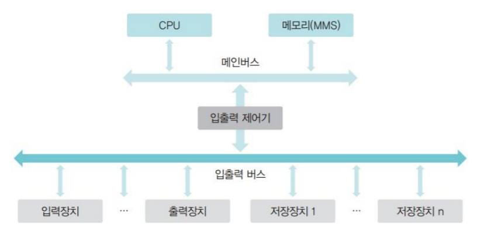
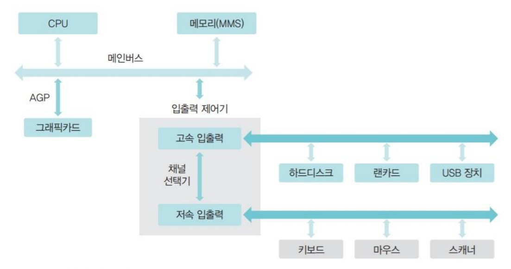

# CHAPTER 10 입출력 시스템과 저장장치

## 1. 입출력 시스템

### 입출력장치와 채널
- 주변장치는 데이터 전송 속도에 따라 저속 주변장치와 고속 주변장치로 구분
    - 저속 주변장치 : 메모리와 주변장치 사이에 오고 가는 데이터의 양이 적어 데이터 전송률이 낮은 장치 (그래픽카드, 하드디스크, USB 메모리)
    - 고속 주변장치 : 메모리와 주변장치 사이에 대용량의 데이터가 오고 가므로 데이터 전송률이 높은 장치 (프린터, 키보드, 마우스)
- 여러 주변장치는 메인보드 내의 버스로 연결되지만 버스에는 많은 종류의 장치가 연결되어 있으므로 버스를 1개만 쓰면 병목현상 발생
- 여러 개의 버스를 묶어서 사용하고 데이터가 지나가는 통로를 채널이라고 함
    - 채널 공유 : 주변장치마다 데이터 전송 속도가 달라 채널을 주변기기가 쓸 수 있게 모두 공유하면 데이터 전송 속도가 느려짐
    - 채널 분리 : 여러 채널을 효율적으로 사용하기 위해 속도가 비슷한 장치끼리 묶음

 

### 입출력버스의 구조
- 초기에는 주변장치가 많지 않아 모든 장치가 하나의 버스로 연결되었음
    - 폴링(polling) : CPU가 작업을 진행하다 입출력 명령을 만나면 직접 입출력 장치에서 데이터를 가져오는 방식
- 폴링 방식을 적용하면 입출력이 끝날 때까지 CPU가 다른 작업을 하지 못함
- 폴링 방식의 단점을 개선하기 위해 입출력 제어기를 사용하여 입출력을 맡김

 

- 하지만 여전히 저속 주변 장치 때문에 고속 주변장치의 데이터 전송이 느려지는 문제가 생겨 이를 해결하기 위해 입출력 버스를 고속 입출력 버스와 저속 입출력 버스로 분리
    - 두 버스 사이의 데이터 전송은 채널 선택기(channel selector)가 관리

 

### 직접 메모리 접근
- 직접 메모리 접근(DMA)은 CPU의 도움 없이도 메모리에 접근할 수 있도록 입출력 제어기에 부여된 권한
- 입출력 제어기는 직접 메모리에 접근하기 위한 DMA 제어기가 마련되어 있음
    - 여기서 입출력 제어기는 여러 채널에서 전송된 데이터 중 어떤 것을 메모리로 보낼지 결정하고 해당 데이터는 DMA 제어기를 거쳐 메모리에 올라감
- 이전 DMA 제이거가 전송하는 데이터를 입출력 메모리라는 별도의 메모리로 보고나했으나 입출력 메모리에서 메인메모리로 데이터를 옮기는 불필요한 작업을 수반했음
- 현재의 입출력 시스템에서는 메인메모리 내부에 입출력 메모리 공간이 분리되어 운영되고 이를 '메모리 맵 입출력'이라고 부름
    - 메모리 맵 입출력에서는 메인 메모리의 주소 중 일부를 DMA 제어기에 할당하여 작업 공간이 겹치는 것을 막음

 

### 인터럽트
- 입출력 제어기는 입출력 데이터가 DMA 제어기 작업이 마친 후 CPU에 인터럽트를 보냄
- 인터럽트란 주변 장치의 입출력 요구나 하드웨어의 이상 현상을 CPU에 알려주는 역할을 하는 신호로 각 장치에는 고유의 인터럽트 번호인 IRQ가 부여
    - 인터럽트 발생시 CPU는 IRQ를 보고 어떤 장치에서 인터럽트가 발생했는지 파악
- 현재까지 설명한 인터럽트는 외부 인터럽트며 인터럽트 종류는 다음과 같음
    - 외부 인터럽트 : 입출력 장치로부터 오는 인터럽트뿐 아니라 전원 이상이나 기계적인 오류 때문에 발생하는 인터럽트를 포함
    - 내부 인터럽트 : 프로세스의 잘못이나 예상치 못한 문제 때문에 발생하는 인터럽트로 예외 상황(exception) 인터럽트라고도 부름
    - 시그널 : 사용자가 직접 발생시키는 인터럽트로 자발적 인터럽트라고도 부름

 

|종류|인터럽트 번호|비고|
|:---:|:---:|:---:|
|내부 인터럽트|0~31|0~19번까지만 정의됨|
|외부 인터럽트|32~47|주변장치의 수에 따라 유동적으로 할당|
|시그널|128|시그널 번호를 따로 기재|

 

#### 인터럽트 벡터와 인터럽트 핸들러
- 여러 인터럽트 중 어떤 인터럽트가 발생했는지 파악하기 위해 사용하는 자료 구조
    - 값이 1이라면 발생한 것으로 0이라면 미발생
- 인터럽트는 종류만큼이나 처리 방법도 다양하고 인터럽트 핸들러는 인터럽트 처리 방법을 함수 형태로 만들어둔 것
- 인터럽트가 발생하면 운영체제는 인터럽트 핸들러를 호출하여 작업을 하고 인터럽트 벡터에는 해당 인터럽트 핸들러를 호출할 수 있도록 인터럽트 핸들러가 저장된 메모리의 주소가 포인터 형태로 등록되어 있음

 

### 버퍼링
- 버퍼는 속도가 다른 두 장치의 속도 차이를 완화하는 역할
    - 데이터를 각각 보내는 것보다 한번에 담아 보내는 것이 효율적이므로 느린 장치를 통해 들어오는 데이터를 버퍼에 모아 한꺼번에 이동하면 효율적
    - 하드디스크나 CD-ROM 등 대부분 입출력장치는 버퍼를 사용해 느린속도를 보완
    - 커널도 입출력장치로 보내야할 데이터를 버퍼를 사용
- 단일 버퍼 : 데이터를 버퍼에 담는 작업과 데이터를 퍼 가는 작업을 동시에 하기 어려움
- 이중 버퍼 : 한 버퍼는 데이터를 담는 용도로, 한 버퍼는 데이터를 가져오는 용도로 사용할 수 있어 유용
- 버퍼 운용시 더퍼에 데이터가 꽉차있지 않아 데이터를 전송하지 않으면 문제를 일으키기도 함. 해당 경우 버퍼 안의 데이터가 오래동안 저장이 되지 않는 상태로 있는데 이상태에서 저장장치를 제거하면 문제가 발생
- 이러한 특성 때문에 윈도우에서는 외부 저장장치를 제거할 때 하드웨어 안전 제거를 사용할 것을 권고함
    - 하드웨어 안전 제거 : 버퍼가 다 차지 않아도 강제로 버퍼의 내용이 저장장치로 옮겨지는데 이를 플러시(flush)라고 함

 

## 2. 디스크 장치
### 디스크 장치 종류
#### 1. 하드디스크
- 원반을 사용한 저장장치로, 맨 앞에 있는 데이터나 맨 뒤에 있는 데이터에 접근하는 속도가 거의 비슷
- 하드디스크는 스핀들(spindle)이라는 원통 축에 여러 개의 플래터가 달려 있으며 구조는 플래터, 섹터와 블록, 트랙과 실린더, 헤드와 플래터로 구성
- 플래터(platter)
    - 데이터를 저장하는 원형 판
    - 표면에 자성체가 발려 있어 자기를 이용하여 0과 1의 데이터를 저장할 수 있음
- 섹터와 블록
    - 섹터 : 하드디스크의 가장 작은 저장 단위
    - 블록 : 하드디스크와 컴퓨터 사이에 데이터를 전송하는 논리적인 저장 단위 중 가장 작은 단위로 여러개의 섹터로 구성됨
- 트랙과 실린더
    - 트랙 : 플래터에서 회전축을 중심으로 데이터가 기록되는 동심원
    - 실린더 : 개념적으로 여러 개의 플래터에 있는 같은 트랙의 집합
- 헤드와 플래터
    - 하드디스크에서 데이터를 읽거나 쓸 때는 읽기/쓰기 헤드를 사용
    - 플래터가 회전을 시작하면 표면에 약한 바람이 일어나는데 헤드는 이 바람에 의해 표면에서 약간 떠 있는 형태로 작동
    - 만약 헤드가 플래터에 붙으면 고속으로 회전하는 플래터 표면에 상처가 생길 수 있고 이렇게 플래터 표면에 생긴 상처는 데이터를 저장할 수 없는 배드 섹터가 됨
    - 컴퓨터가 종료될때 헤드가 플래터의 표면에 흠집을 내지 않도록 하드디스크는 헤드를 데이터가 저장되지 않는 플래터의 맨 바깥쪽으로 이동하는데 이를 파킹(parking)이라 함

 

#### 2. CD
- 휴대할 수 있는 소형 원반에 데이터를 저장
- 하드디스크와 마찬가지로 트랙과 섹터로 구성되며 수평으로 움직이는 헤드가 트랙 사이를 움직이면서 데이터를 읽음
    - CD는 표면에 미세한 홈이 파여있어 헤드에서 발사된 레이저가 홈에 들어가 반사되지 않으면 0, 반사되어 돌아오면 1으로 인식
    - CD를 굽는다는 표현은 레이저를 쏘아 표면을 테워서 미세한 홈을 만드는 방식으로 데이터를 저장하기 때문

 

#### 하드디스크와 CD 비교
- 하드디스크의 각속도 일정 방식
    - 하드디스크 플래터는 항상 일정한 속도로 회전하여 바깥쪽 트랙의 속도가 안쪽 트랙의 속도보다 훨씬 빠름
    - 그러므로 가장 바깥쪽 트랙의 속도가 안쪽 트랙의 속도보다 훨씬 빠름
    - 일정한 시간동안 이동한 각도가 같아 각속도 일정이라고 함
- CD의 선속도 일정 방식 회전
    - CD 의 선속도 일정 방식은 어느 트랙에서나 단위 시간단 디스크의 이동 거리가 같음
    - 이를 구현하려면 헤드가 안쪽 트랙에 있을때는 디스크 회전속도를 빠르게, 바깥쪽 트랙으로 이동했을 때는 디스크의 회전속도를 느리게 해야함
- 하드디스크는 'rpm'으로 회전하는 속도를 측정
- CD는 트랙마다 회전하는 속도가 달라 '배속'으로 속도를 측정

 

### 디스크 장치의 데이터 전송 시간
> 데이터 전송 시간 = 탐색 시간 + 회전 지연 시간 + 전송 시간

 

### 디스크 장치 관리
- 디스크 장치를 사용하는 데에는 관리 기법이 필요
- 파티션 : 디스크를 논리적으로 분할하는 작업. 하나의 파티션은 하나의 하드디스크로 보임
    - 유닉스 운영체제에서 여러 개의 파티션을 하나로 통합하는 기능을 마운트(mount)라고 함
- 포매팅 : 디스크에 파일 시스템을 탑재하고 디스크 표면을 초기화하는 작업으로 사용할 수 있게함
    - 저장장치도 저장된 파일의 위치와 크기 정보를 담고 있는 파일 테이블을 사용하는데 빈 저장장치에 파일 테이블을 탑재하는 것이 포매팅
- 조각모음 : 디스크에 파일을 저장했다가 지우기를 반복함으로써 중간중간에 생긴 빈 공간을 하나로 모으는 작업
    - 조각화 혹은 단편화로 생긴 빈 공간을 합침

 

### 네트워크 저장장치
- 여러 저장장치의 흩어져 있는 파일을 하나로 모아 관리하여 데이터의 중복을 방지하고 파일 관리를 편하게 할 수 있음
- 이렇게 네트워크를 사용하는 저장장치는 어떻게 구성하냐에 따라 DAS, NAS, SAN으로 구분됨
- DAS(Direct Attached Storage) : 서버와 같은 컴퓨터에 직접 연결된 저장장치
- NAS(Network Attached Storage) : 기존의 저장 장치를 LAN이나 WAN에 붙여서 사용하는 방식
- SAN(Storage Area Network) : 데이터 서버, 백업 서버, RAID 등의 장치를 네트워크로 묶고 데이터 접근을 위한 서버를 두는 형태

 

## 3. 디스크 스케줄링
- 디스크는 매우 느리지만 자주 사용되는 저장장치로 이를 해결하기위해 디스크 스케줄링은 트랙의 이동을 최소화하여 이 탐색 시간을 줄이는 데 목적

### FCFS 디스크 스케줄링
- 가장 단순한 방식으로서, 요청이 들어온 순서대로 서비스

 

### SSTF 디스크 스케줄링
- 현재 헤드가 있는 위치에서 가장 가까운 트랙부터 서비스
- 효율성은 좋으나 헤드 주변의 위치의 서비스만 진행하다보면 아사현상이 발생할 수 있음

 

### 블록 SSTF 디스크 스케줄링
- 큐에 있는 트랙 요청을 일정한 블록 형태로 묶고 각 블록 안에서 SSTF 스케줄링 방식으로 동작
- SSTF 공평성 위배를 보완한 방식
- FCFS와 비슷할 정도로 성능이 좋지는 않음

 

### SCAN 디스크 스케줄링
- 헤드가 움직인 방향으로 맨 마지막 트랙에 도착할 때까지 되돌아가지 않고 계속 앞으로만 전진하면서 요청받은 트랙을 서비스
    - 이러한 특징으로 엘리케이터 기법이라고도 함
- SSTF 공평성 위배를 완화한 방식으로 성능도 FCFS보다는 우수
- 해당 기법도 동일한 트랙이나 실린더 요청이 연속적으로 발생하면 헤드가 더 이상 나아가지 못하고 제자리에 머물게 되어 바깥쪽 트랙이 아사 현상을 겪는 문제 발생

 

### C-SCAN 디스크 스케줄링
- 헤드가 한쪽 방향으로 움직일 때는 요청받은 트랙을 서비스 하고 반대 방향으로 돌아올 때는 서비스 하지 않고 이동만 하고 다시 같은 방향으로만 서비스
- SCAN의 공평성 위배를 완화하기 위한 방법
- 하지만 작업 없이 헤드를 옮기는 것은 비효율적이며 동일한 트랙 요청이 연속적으로 발생하면 SCAN과 마찬가지로 아사 현상이 발생하여 잘 사용되지 않음

 

### LOOK 디스크 스케줄링
- SCAN 디스크 스케줄링에서 불필요한 부분을 제거하여 효율을 높인 기법
- SCAN은 마지막 트랙에 도착한 후에나 방향을 바꾸지만 LOOK 디스크 스케줄링은 더 이상 서비스할 트랙이 없으면 중간에서 방향을 바꿈
- SCAN 디스크 스케줄링보다 많이 사용됨

 

### C-LOCK 디스크 스케줄링
- C-SCAN 디스크 스케줄링의 LOOK 버전으로 한쪽 방향으로 서비스하며 마지막 헤드에서 다시 헤드를 시작지점으로 옮기고 서비스 진행

 

### SLTF 디스크 스케줄링
- 최소 지연 우선 기법이라고도 하며 드럼을 사용하여, 헤드 지지대를 고정하고 모든 트랙을 읽을 수 있는 여러 개의 헤드를 지지대에 부착
- 트랙이 아닌 같은 섹터에 서비스 요청 순서만 신경쓰면 됨
- 디스크가 회전하는 방향에 맞추어 요청 순서 다시 정렬한 후 서비스
- 하지만 헤드가 고정된 저장장치에 적용되는 SLTF 스케줄링은 매우 고가라 많이 사용되지 않음

 

## 4. RAID
- RAID(Redundant Array of Independent Disks)는 자동으로 백업을 하고 장애가 발생하면 이를 복구하는 시스템
- 메모리가 아닌 값싼 디스크를 사용하여 이런 이름이 붙었으며 RAID는 동일한 규격의 디스크를 여러 개 모아 구성하여 장애가 발생했을 때 데이터를 복구하는데 사용
- 하드디스크 가격이 저렴해지면서 복잡한 연산을 필요로 하는 RAID 2, 3, 4, 5는 잘 사용하지 않게 됨

 

 

### 연습문제
#### 1. 버퍼와 버퍼링의 차이 및 버퍼가 사용되는 이유

정답

- 버퍼 : 데이터를 임시로 저장하는 메모리 영역
- 버퍼링 : 데이터 전송이나 처리의 불규칙성을 조절하기 위해 버퍼를 사용하는 과정을 의미
- 즉 버퍼링은 데이터를 버퍼에 저장하고 조절하는 과정을 의미하는데 데이터를 버퍼에 보관하고 한번에 전송하거나 처리하여 효율성을 높임

- 주로 사용처는 다음과 같음
    - 네트워크 통신 : 네트워크 통신에서는 데이터를 전송할 때 속도 차이나 대역폭 제한 등으로 인해 버퍼를 사용하여 데이터를 일시적으로 저장하고 전송. 데이터 량을 일정량씩 전송할 수도 있음
    - 파일 입출력 : 파일 입출력에서도 버퍼를 사용하여 읽은 데이터나 쓰는 데이터를 일시적으로 저장하고 관리
    - 데이터베이스 통신 : 버퍼를 사용하여 쿼리 결과나 수정된 데이터를 일시적으로 저장하고 처리, 대용량 데이터를 처리하거나 다량의 요청을 동시에 처리할 때 버퍼를 사용하여 성능 최적화
    - 스트리밍 서비스 : 비디오 스트리밍이나 오디오 스트리밍에서는 버퍼를 사용하여 데이터를 일정량씩 미리 저장하여 사용자에게 끊김 없는 스트리밍 서비스를 제공

 

#### 캐시와 버퍼?
- 캐시는 데이터 또는 명령을 미리 저장하여 나중에 필요할 때 빠르게 액세스할 수 있도록 함. 자주 액세스하는 데이터를 캐시에 저장하여 사용
- 버퍼는 주로 데이터를 주변 장치와 상호 작용하기 위해 사용되며 데이터를 일시적으로 보관하기위해 사용. 데이터 전송의 효율성

 

#### 2. RAID를 사용하는 목적 및 주로 RAID 5나 6을 사용하는 이유

정답

- 목적 : 장애가 발생했을 경우 백업을하고 복구하기 위한 시스템으로 동일한 규격의 디스크를 여러 개 모아 장애가 발생하였을 때 데이터를 복구하는데 사용. 또한 여러 디스크에 데이터를 동시에 저장하여 동시에 읽고 쓸 수 있어 입출력 속도를 높이기도 함

 

- 분산 패리티를 사용하여 데이터의 내결함성을 확보하고, 하나의 디스크가 고장 나더라도 시스템이 정상적으로 동작할 수 있어서
- raid 0이나 raid1 같은 경우는 각각 데이터 안전성, 저장공간 확장 되지 않아 혼용해서 사용하기도 하며 디스크의 가격을 저렴하여 여러개의 디스크를 사용하기는 쉽지만 raid 2, 3, 4는  계산량이 많아져 효율적이지 못함
- 디스크의 데이터를 보호하기 위한 백업 방법이 될 수도 있고 여러개의 디스크를 분산 저장하는데에도 사용할 수 있어 저장공간을 효율적으로 활용할 수 있음

 

- 

