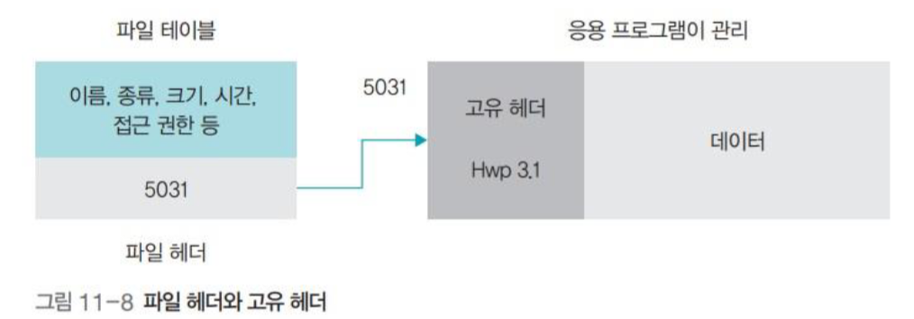
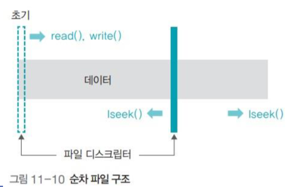
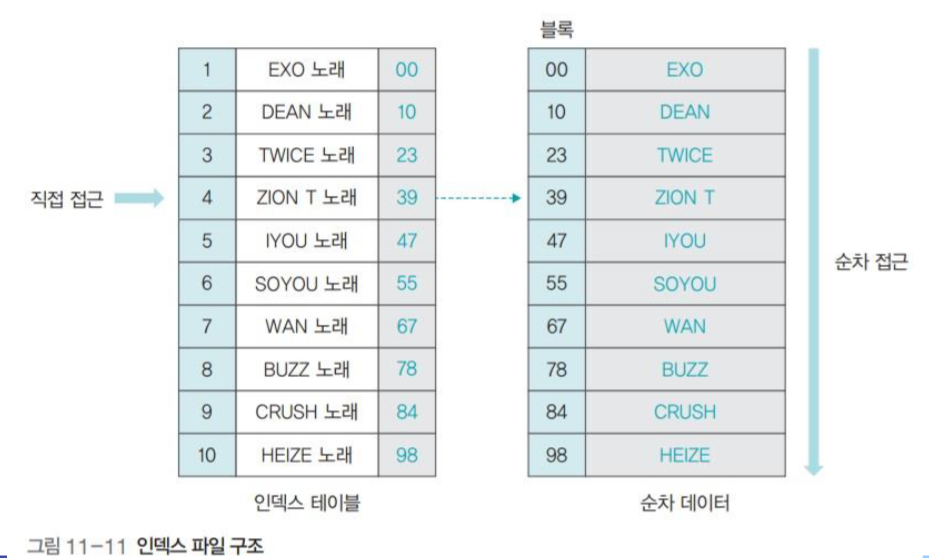
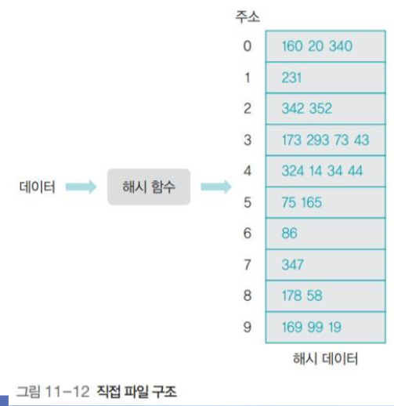
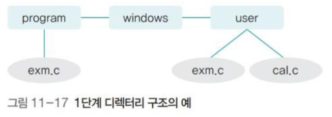
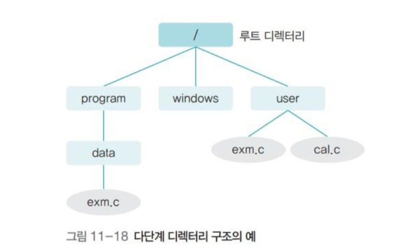
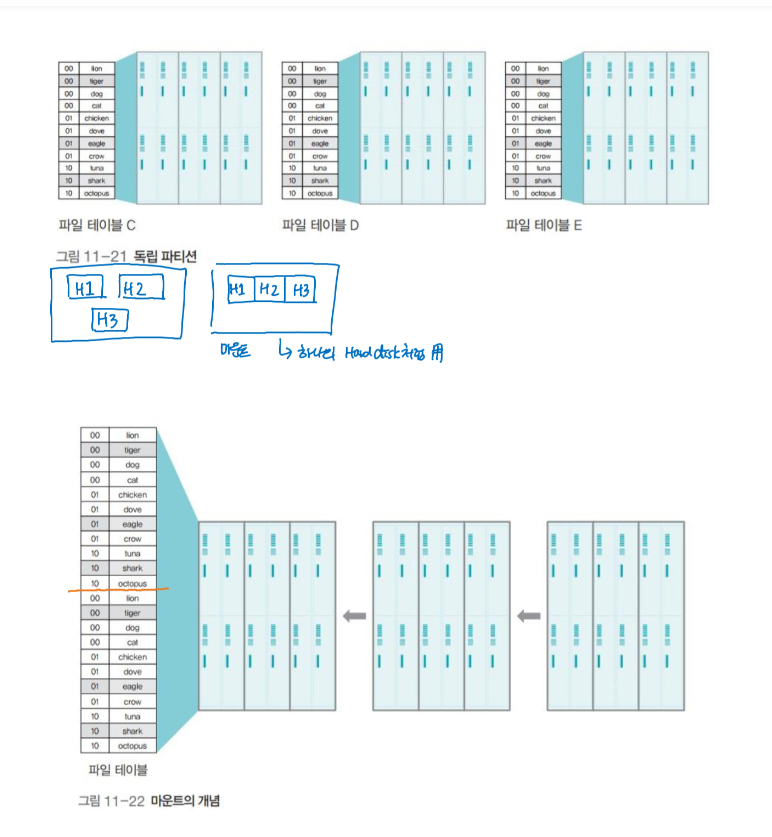
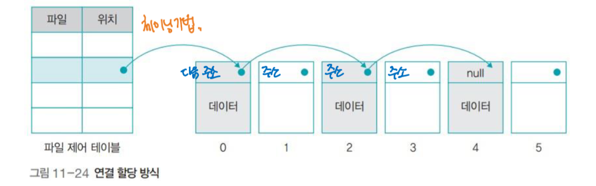
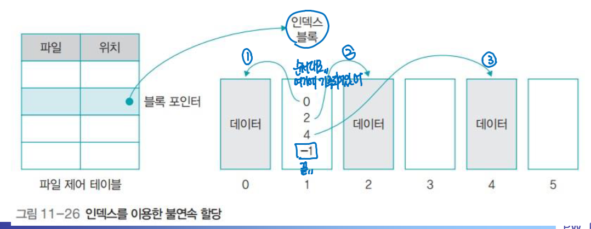
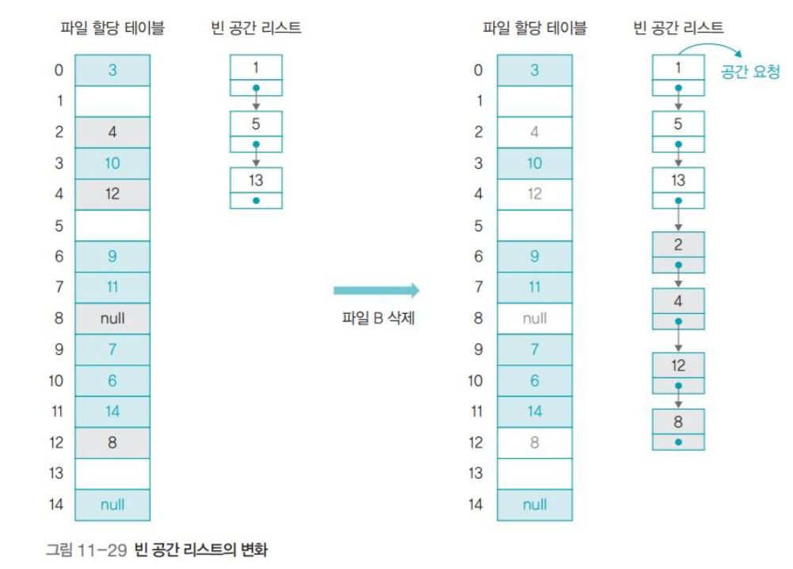

# CHAPTER11 파일시스템

## 1. 파일과 파일시스템
### 파일 시스템
- 대신 파일을 보관하고 관리하는 파일 관리자를 두어 저장장치의 전체 관리를 하는 시스템
- 컴퓨터 시스템에는 다양한 종류의 파일이 있으며 이러한 파일은 저장장치에 보관되는데 저장과정에서 사용자가 직접 개입하면 파일을 훼손하거나 저장장치 내부를 어지럽혀 문제가 발생할 수 있음 -> 파일 관리자를 두어 관리

<br>

### 파일 관리자
- 가상 메모리에서 메모리 관리자가 메모리 매핑 테이블을 사용하여 가상 주소를 물리 주소로 변환하는 것과 마찬가지로 저장장치에서는 파일 관리자가 파일 테이블을 사용하여 파일을 관리
- 파일 테이블을 사용하여 파일의 생성, 수정, 삭제 등을 수행
- 사용자가 파일을 사용하고자 할 때 읽기, 쓰기, 실행과 같은 다양한 접근 방법을 제공
- 사용자가 특정 파일에 접근하려면 접근 권한을 획득하여야 하는데 이를 파일 디스크 립터(file descriptor)라고 함
    - 파일 디스크 립터는 파일 관리자로부터 파일에 접근할 수 있는 권한임
<br>

### 파일 시스템의 기능
- OS마다 다른 파일 테이블을 가지고 있음
- Window -> FAT/NTFS 파일 테이블 유지, Unix -> I-node 파일 테이블 유지
- 파일 테이블의 구성은 운영체제마다 다른데 사용자가 파일을 생성하고, 파일을 편리하게 관리할 수 있도록 디렉토리 구조를 제공함
- 여러 종류의 파일을 구분하기 위해 파일 이름과 확장자를 만들어 관리함
    - 파일 이름, 파일 크기, 생성 날짜 등 다양한 파일 정보는 파일 헤더에 저장하여 관리

<br>

|기능|설명|
|:---:|:---:|
|파일 구성|사용자의 요구에 따라 파일과 디렉터리를 만듬|
|파일 관리|파일 생성, 수정, 삭제 등의 관리를하고 수시로 조각 모음을 하여 사용자가 파일에 빨리 접근할 수 있도록 함|
|접근 권한 관리|다른 사용자로부터 파일을 보호하기 위해 접근 권한을 관리|
|접근 방법 제공|파일을 읽고 쓰고 실행할 수 있도록 사용자에게 접근 방법을 제공|
|무결성 보장|파일의 내용이 손상되지 않도록 무결성을 보장|
|백업과 복구|사고로부터 파일을 보호하기 위해 백업과 복구 작업을 함|
|암호화|파일을 암호화하여 악의적인 접근으로부터 파일을 보호|

<br>

### 블록과 파일 테이블
- 데이터는 운영체제와 저장장치 간에 블록 단위로 전송됨
- 하드디스크의 물리적인 구조상 가장 작은 저장 단위는 섹터이고, 섹터마다 주소 부여시 너무 많은 양의 주소가 필요하기 때문에 메모리에 다 넣을 수 없음
- 그렇기 떄문에 파일 관리자는 여러 섹터를 묶어 하나의 블록으로 만들고 블록 하나에 주소 하나가 할당됨
- 블록의 크기는 시스템 마다 다르기 때문에 블록 크기를 작게 설정하면 내부 단편화 현상이 줄어들어 저장장치를 효율적으로 쓸 수 있지만 파일이 여러 블록으로 나뉘어 파일 입출력 속도가 느려지기 때문에 큰 파일을 많이 사용하는 경우에는 블록 크기를 크게 잡는 것이 좋음
- 포맷을 하면 각 블록에 번호가 매겨지고 파일 테이블에는 파일이 어떤 블록에 있는지 명시됨. 사용자가 파일 A를 요청하면 해당 블록을 읽어 사용자에게 돌려줌

<br>

### 파일 분류와 확장자
- 파일은 논리적인 데이터의 집합으로 하드디스크나 CD같은 제2 저장장치에 저장됨
- 모든 파일은 0과 1의 비트 패턴으로 이루어지며 운영체제 입장에서는 크게 실행 파일과 데이터 파일로 나뉨
- 실행 파일
    - 운영체제가 메모리로 가져와 CPU를 이용하여 작업을 하는 파일로 사용자의 요청으로 프로세스가 된 파일을 말함
- 데이터 파일
    - 실행 파일이 작업하는데 필요한 데이터를 모아놓은 파일
    - 데이터 파일은 스스로 프로세스가 될 수 없고 운영체제가 전송하거나 보관만 할 뿐 특별하게 다루지 않음
    - 컴퓨터에는 다양한 종류의 데이터 파일이 존재해 이러한 파일을 구분하기 위해 파일에는 헤더가 달려있음. 파일헤더에는 파일의 이름, 버전, 크기, 만든 날짜, 접근 권한 등의 정보가 저장됨
    - 모든 파일 이름에는 확장자가 붙는데 파일에 확장자를 붙이면 파일의 성격을 알 수 있음

<br>

### 파일 이름과 연결 프로그램
- 대부분의 파일 이름은 '파일 이름.확장자'의 형태로 구성 되고 파일 이름에 관련해서 유의할 점은 다음과 같음
    - 초창기엔 확장자명의 길이가 3글자로 제한되었지만, 최근에는 4자나 5자인 확장자 존재
    - 마침표 여러개 일시, 마지막 마침표의 뒤가 확장자로 인식 됨
    - 파일 이름은 현재 경로 이름을 포함하여 최대 255자로 할 수 있음
    - 파일 이름에는 주로 영문자, 숫자, 언더바(_), 마침표를 주로 사용
        - 윈도우에서는 파일 이름에 스페이스바, &, ~의 특수문자를 사용할 수 있고 \, /, :, *, ?, ", <, >, | 등의 특수문자를 사용할 수 없고 또한 대문자와 소문자를 구분하지 않음
        - 유닉스는 스페이스바를 포함하여 대부분의 특수문자를 사용할 수 없음
    - 파일 이름에 * / ? 를 넣을 수 없는 경우가 많은데, 이는 파일을 검색 할 떄 사용되는 특수 기호이기 때문이다
    - 파일을 더블 클릭하면, 파일에 연결된 응용 프로그램이 실행 됨
    - 데이터 파일을 더블 클릭하면 연결된 응용 프로그램이 실행 되는것. 연결된 응용 프로그램을 바꾸고 싶으면 연결 프로그램을 '속성'메뉴를 이용하여 변경
    - 확장자를 바꾼다고 해서 파일 내용이 바뀌지는 않음. 잘못된 확장자로 바꾸면 해당 파일을 인식하지 못해 실행되지 않을 수 있음

<br>

|속성|특징|
|:---:|:---:|
|name|파일의 이름|
|type|파일의 종류|
|size|파일의 크기|
|time|파일의 접근 시간|
|location|파일의 위치|
|accessibility|파일의 접근 권한|
|owner|파일의 소유자|

<br>



### 파일 속성
- 대부분의 파일은 위의 표의 속성을 가지고 있음
- 운영체제가 관리하는 파일 헤더 외에 데이터 파일마다 자신에게 필요한 파일 속성을 따로 정의하여 사용하기도 하는데, 이는 파일의 고유 헤더에 기록됨
    - 예를 들어 사진 파일은 카메라 기종, 셔터 속도, 조리개 값 등을 저장
- 파일 헤더
    - 파일 테이블에서 관리하며 파일의 이름, 종류, 크기, 시간, 접근 권한 등과 같은 일반적인 내용이 담겨 있음
    - 파일이 저장장치의 몇 번째 블록에 있는지에 대한 정보도 가지고 있음
- 고유 헤더
    - 데이터 파일에는 응용 프로그램이 필요로 하는 고유 헤더가 따로 달려있음
    - 고유 헤더에는 파일의 버전 번호, 크기, 특수 정보 등 응용 프로그램이 필요로 하는 정보가 담겨있음
    - 고유헤더는 파일을 복구할 때 유용하게 사용됨. 빠른 포맷을 하면 파일 테이블에 있는 파일 헤더는 사라지지만 실제데이터를 지우는 것은 아니기 때문에 데이터 파일의 고유헤더는 저장장치에 남아 있음
    - 파일 복구 시스템은 모든 블록을 찾아다니면서 고유 헤더에 있는 정보를 이용하여 파일을 원래 상태로 복원함

<br>

### 파일 작업의 유형
- 파일을 지우거나 이름을 바꾸는 것과 같이 파일을 변경하는 것을 파일 작업 또는 파일 연산이라고 함
- 파일 작업은 크게 파일 자체를 변경하는 작업과 파일 내용을 변경하는 작업으로 나눌 수 있음
    - 파일 자체를 변경하는 작업
        |작업|설명|
        |:---:|:---:|
        |open|파일을 엶|
        |close|파일을 닫음|
        |create|새로운 파일 생성|
        |remove|파일을 이동|
        |copy|파일을 복사|
        |rename|파일의 이름 변경|
        |list|파일을 나열|
        |search|파일을 찾음|

    - 파일 내용을 변경하는 작업
        |작업|설명|
        |:---:|:---:|
        |open()|파일을 엶|
        |create()|새로운 파일 생성|
        |close()|파일을 닫음|
        |read()|파일 내용을 읽음|
        |write()|파일에 새로운 내용을 씀|
        |update()|파일의 내용 중 일부를 변경|
        |insert()|파일에 새로운 내용을 추가|
        |delete()|파일 내용 중 일부를 지움|

<br>

### 파일의 구조
- 파일은 하나의 데이터 덩어리 인데 파일 구조는 파일을 어떻게 구성하느냐에 따라 나눌 수 있음

<br>


#### 1. 순차 파일 구조 (sequential file structure)
- 카세트 테이프처럼 파일 내용이 하나의 긴 줄로 늘어선 형태
- 사용자가 파일 작업을 하려면 open(), create() 명령을 사용하여 운영체제로부터 권한(파일 디스크립터)를 얻어야 함
- 순차적인 접근 방식에서는 파일 디스크립터가 앞에서 부터 뒤로 계속 전진하며, 작업을 하다가 특정 위치로 파일 디스크립터를 옮겨야 할 때에는 beek() 명령어를 사용하여 뒤로 전진
- 순서대로 기록하여 저장공간에 낭비되는 부분이 없고 구조가 단순함
- 순서대로 데이터를 읽거나 저장할 때 빠르게 처리
- 새로운 데이터를 삽입/삭제 시 오랜 시간이 걸림
- 파일 작업을 할 때 앞에서 뒤까지 순차적인 접근만 가능하여 특정데이터로 직접 접근이 어렵워 데이터 검색에 부적합함
<br>


#### 2. 인덱스 파일 구조 (index file structure)
- 음악 CD 처럼 순차 파일 구조에 인덱스 테이블을 추가하여 순차 접근/직접 접근이 가능한 형태
    - 인덱스 테이블에는 파일의 인덱스와 파일이 존재하고 있는 블록이 기입되어 있음
    - 저장 -> 순차 파일 구조
    - 접근 -> 인덱스 테이블
- 음악 CD는 처음부터 끝까지 순차적으로 재생할 수도 있고, 특정 곡으로 바로 이동할 수도 있음
- 특정 인덱스로 접근 시 해당 파일이 존재하고 있는 블록에 직접 접근을 할 수 있도록 해줌
- 인덱스 파일 테이블을 여러개 만들어 다양한 접근이 가능하기도 함
- 현대의 파일 시스템에서 많이 사용됨

<br>


#### 3. 직접 파일 구조 (direct file structure)
- 데이터의 특정 값에 어떤 관계를 정의하여 물리적인 주소로 바로 변환하는 구조
- 해시 테이블같은 경우와 유사
- 해시 함수 -> 직접 파일 구조에서 데이터와 주소에 대한 관계를 지정해주는 함수
- 데이터 접근이 매우 빠르나 전체 데이터가 고르게 저장되는 해시 함수를 찾기 어려워 해시 함수의 선정이 매우 중요
- 해시 함수 계산이 복잡할 수 있고, 저장공간 낭비 문제 발생

<br>

## 2. 디렉터리의 구조
### 디렉터리의 개념
- 디렉터리는 관련 있는 파일을 하나로 모아놓은 곳
- 디렉터리는 1개 이상의 자식 디렉터리를 가질 수 있고, 또한 1개 이상의 파일을 가질 수 있음
- 하나의 디렉터리는 여러개의 파일과 자식 디렉터리가 존재
- 루트 디렉터리는 '/'로 표기

<br>

### 디렉터리 파일
- 디렉터리도 하나의 파일으로 일반 파일에는 데이터가 담겨있으나 디렉터리에는 파일 정보가 담겨 있음
- 파일과 마찬가지로 헤더를 가지며 디렉터리의 이름, 만든 시간, 권한 등의 정보가 담겨 있음
- 마침표 하나는 자기 자신의 디렉터리이며 마침표 두개는 상위 디렉터리를 가르킴

<br>

### 디렉터리 경로
- 파일이 전체 디렉터리 중 어디에 있는지를 나타내는 정보
- 서로 다른 디렉터리에는 이름이 같은 파일이 존재 가능하지만, 경로가 같은 곳에서는 이름이 같은 파일이 존재할 수는 없음
- 절대 경로
    - 루트 디렉터리를 기준으로 파일의 위치를 나타내는 방식
    - 루트 디렉터리에서 시작하는 절대적인 위치를 나타냄
    - /program/data/example의 형태로 표기
- 상대 경로
    - 현재 있는 위치를 기준으로 파일의 위치를 나타내는 방식
    - ../user/examplefile의 형태로 표기
- 절대경로나 상대경로 모두 cd 명령어(change directory)를 통해 디렉터리를 이동

<br>

### 디렉터리 구조


#### 1. 1단계 디렉터리 구조
- 초기 파일 시스템의 디렉터리는 1단계 구조로 당시에는 파일이 많지 않아 많은 디렉토리가 필요하지 않아 구조가 단순 했음
- 디렉터리 안에 자식 디렉터리가 존재하지 않음
<br>


#### 2. 다단계 디렉터리 구조
- 디렉터리 안에 디렉터리와 파일 저장 가능
- 루티 디렉터리를 기준으로 가지처럼 있어 트리 디렉터리 구조라고도 함
- 자료구조 상으로는 트리는 순환이 없는 그래프 형태인데 현재 파일 시스템에서 다단계 디렉터리 구조는 링크 때문에 순환이 생길 수 있음 (즉, 디렉터리는 트리가 아닌 그래프 구조)

<br>



### 마운트
- 여러개의 파티션, 디스크를 통합하는 명령어로 여러개의 데이터 파일 그룹을 하나인 것처럼 사용
- 윈도우의 초기 개발 시에 FAT16 파일 시스템의 최대 디스크 크기가 32GB 였기때문에 최대 디스크 크기를 넘는 경우 파티션으로 분리하고 각 파티션마다 파일 시스템을 구축했어야 했음
    - FAT의 최대 크기 문제를 해결한 파일 시스템이 NTFS 라고 함
- 유닉스의 경우에는 서버용으로 만들어진 운영체제이므로 파일 테이블의 크기에 제한이 없어 하나의 파일 테이블로 여러개의 디스크, 파티션을 통합하여 관리할 수 있음
- 마운트를 사용하면 파티션이 몇개라도 하나로 통합할 수 있고, 또한 CD-ROM, USB 같은 외부 저장장치도 마운트로 파티션에 붙이고 마운트 해체(un-mount)로 분리할 수 있음
- 보통 유닉스 운영체제에서는 /dev 아래에 외부 저장장치를 마운트해서 사용함

<br>

## 3. 디스크 파일 할당

### 연속 할당과 불연속 할당
- 파일 시스템은 기본적으로 메인메모리 시스템과 유사한데 전체 디스크 공간을 같은 크기로 나누고 각 공간에 주소를 붙여서 관리
- 일반적으로 하나의 파일은 여러 개의 블록을 사용하는데 여러개의 블록을 어떻게 연결하는 방식에 따라 연속 할당 방식과 불연속 할당 방식으로 나뉨
- 연속 할당(contiguous allocation)
    - 파일을 구성하는 데이터를 디스크 상에 연속적으로 배열하는 간단한 방식
    - 연속 할당 방식에서는 파일의 시작 블록만 알면 전체 파일을 찾을 수 있으나 실제로는 사용되지 않음
    - 저장하거나 삭제하면 빈 공간이 생기고 맞는 공간이 없으면 연속 할당이 불가능함
- 불연속 할당(non-contiguous allocation)
    - 비어 있는 블록에 데이터를 분산 저장하고 이에 관한 정보를 파일 시스템이 관리하는 방식
    - 대표적인 불연속 할당 방식으로는 연결리스트를 이용한 연결할당과 인덱스를 이용한 인덱스 할당이 있음

<br>


#### 연결 할당(linked allocation)
- 파일에 속한 데이터를 연결 리스트(Linked List)로 관리하는 방식
- 연결 할당 방식은 체인으로 연결한 것처럼 보여서 체인 할당(chain allocation)이라고도 함
- 파일 테이블에는 시작 블록에 대한 정보만 저장하고, 나머지 데이터는 시작 블록부터 연결하여 저장
- 파일의 맨끝에 해당하는 블록에는 링크 대신 널을 삽입
- 테이블 형태로 관리하는데 윈도우의 FAT 방식이 이에 해당
```
FAT
- 파티션 전체 블록에 대한 정보를 가진 테이블이며, 행의 개수가 그 파티션에 존재하는 블록의 개수와 동일
- 파일 테이블에는 파일의 정보와 함께, 파일의 시작 블록 정보를 갖고 있음
- FAT에는, 해당 블록 다음에 연결된 블록에 대한 주소 정보가 저장 되어 있음
- 따라서 파일 테이블에서 시작 주소 정보를 기반으로 FAT에서 연결된 블록을 쫒아가면, 해당 데이터를 모두 가져 올 수 있음
- 종류로 FAT 12 / 16 / 32 가 있는데, 각 숫자는 파일 할당 주소의 최대 크기를 나타 냄
- 따라서, 하나의 파티션이 사용 할 수 있는 디스크 용량이 테이블 주소 크기로 제한 됨
- 또, FAT 32인 경우 8TB까지 지원하지만, 파일 하나의 크기가 4GB로 한정 됨
- 따라서, FAT 32로 포매팅된 저장 장치에, 4GB 이상의 파일을 저장하기 위해서는 NTFS 파일 시스템으로 변경 해 주어야 함
```

<br>


#### 인덱스 할당(index allocation)
- FAT의 최대 할당 크기에 제한이 있다는 단점을 해결하기 위한 방식
- 테이블의 블록 포인터가 데이터 블록을 연결하는 것이 아니라 데이터의 인덱스를 담고 있는 인덱스 블록을 연결
- 인덱스 블록은 실제 데이터의 위치에 대한 정보를 순서대로 보관하고 있음
- 인덱스 블록이 꽉 차면, 인덱스 블록을 연결하는 간접 인덱스 블록을 만들어 무한히 확장할 수 있음
- 위와 같은 파일 시스템으로 유닉스의 I-node가 존재
```
I-node table 구성

- 파일 제어 블록 : 파일 소유자와, 각종 속성을 나타내는 블록. 파일에 대한 모든 권한의 정보를 포함 하고 있음. 슈퍼블록이라고도 칭함
- 블록 포인터 : 데이터가 있는 블록의 위치를 직접 연결하는 포인터
- 인덱스 블록 : 실제 데이터의 위치에 대한 정보를 순서대로 보관하고 있는 블록
- 간접 포인터 : 크기가 작은 파일은, 데이터와 직접 연결된 블록 포인터로 빠르게 접근 할 수 있음. 블록 포인터가 다 차면, 인덱스 블록을 생성 한 후 간접 포인터를 생성하여 인덱스 블록과 데이터를 연결하는 블록을 생성
- 이중 / 삼중 간접 포인터 : 인덱스 블록 하나로 데이터를 다 연결할 수 없는 경우, 인덱브 블록을 연결하는 다중의 인덱스 블록을 생성하여 연결. 즉, 파일 크기가 작은 경우 블록을 직접 연결. 파일 크기가 큰 경우 인덱스 블록과 이를 연결하는 간접 포인터를 이용하여 확장
```

<br>


### 디스크의 빈 공간 관리
- 디스크 블록의 크기는 파일 시스템마다 유저가 정할 수 있음
- 디스크 블록의 크기를 크게 잡으면, 적은 주소로 많은 양의 데이터를 관리 할 수 있으나 낭비 되는 공간(내부 단편화)이 생김
- 디스크 블록의 크기를 작게 잡으면, 많은 주소라 적은 양의 데이터를 관리해야 해서 많은 양의 블록 포인터가 필요함
- 디스크에 파일을 저장 할 때 마다, 빈 공간을 찾는 것은 비효율적이기 때문에, 빈 블록의 정보만 모아놓은 빈 공간 리스트를 유지 하고 관리함
- 파일을 삭제 할 때는, 실제 데이터를 지우는 것 보다는 해당 파일이 있던 블록이 빈 공간 리스트에 더해지는 경우가 많음
- 이때, 빈 공간 리스트에 등록 되면 해당 블록은 빈 공간이라고 간주
- 따라서 해당 블록에 다시 데이터가 쓰이지 않으면, 데이터를 복구 할 수 있는 여지가 생김
- 갑작스럽게 컴퓨터가 종료 된 경우, 데이터를 저장 했으나 블록 포인터가 사라져서 데이터가 없어진 것 처럼 보일 수 있음

<br>

## 4. 유닉스 파일의 특징
- 유닉스 파일 시스템 에서는, 파일에 접근 할 수 있는 권한, 형태에 관해 기술된 접근 패턴이 존재
- X XXX XXX XXX 형태
    - 첫번째 자리 ( X )는, 파일의 종류를 나타 냄 ( - : 일반 파일, d : 디렉터리, l : 링크 )
    - 나머지 아홉개를 세개씩 묶은 덩어리 ( 한덩어리 : XXX )는 RWX ( Read, Write, Execute ) 권한을 나타냄
- 첫번째 덩어리는 파일의 소유자, 두번쨰 덩어리는 소유자가 속한 그룹, 세번째 덩어리는 소유자도 아니고 같은 그룹도 아닌 제3자의 권한을 나타 냄
    - Read → 100 / Write → 010 / Execute → 001 의 형태로 나타 냄
- 덩어리의 권한이 10진법 7로 주어지면 이진수 111의 의미가 되므로 RWX 모두 가능한 형태
    - chmode 777 이라고 하면, 세덩어리 모두 7의 권한을 주어 소유자, 그룹, 제3자 모두 RWX가 모두 가능한 상태


-------

<br>

### 연습문제
#### 1. FAT란 무엇인가?

<details>
<summary>정답</summary>

- FAT(File Allocation Table) 파일 시스템은 하나의 파티션에서 사용할 수 있는 디스크 용량을 효과적으로 관리하기 위해 사용되는 파일 테이블
    - 파티션 내의 블록에 대한 정보를 가진 테이블로, 각 블록을 사용하는 파일에 대한 정보와 함께 연결된 블록에 대한 주소 정보를 저장
- 파일테이블에 파일 및 디렉터리 같은 정보가 저장되고 파일 시스템을 통하여 파일을 생성 및 디렉토리로 관리하는 등 사용됨
- FAT 뒤에 붙은 숫자는 비트를 통해 파일 할당 주소를 표현하여 FAT32는 2^32 byte를 사용하여 큰 용량을 지원함
- 하지만 FAT 파일 시스템 디자인 결정으로 인해 파일 크기는 4GB로 제한됨
- 4GB 이상의 파일을 저장하려면 NTFS(New Technology File System) 파일 시스템을 사용하여 더 큰 파일 크기와 더 큰 파티션 크기를 지원함

</details>

<br>

#### 2. 인덱스 파일 구조에서 B트리를 사용하는데 해당 트리가 무엇이고 주로 어디서 사용하는지?

<details>
<summary>정답</summary>

- 데이터를 효율적으로 저장하고 검색하기 위한 자료구조로, 대용량의 데이터를 다루는 인덱스 파일이나 데이터베이스 시스템에서 주로 사용됨
- B 트리는 모든 리프 노드는 왼쪽에서 오른쪽으로 순서대로 연결되어 있으므로, 트리를 순회하면 정렬된 데이터를 얻을 수 있는 균형 잡힌 트리 구조
    - 모든 리프 노드가 동일한 깊이에 위치
- 노드안의 데이터는 정렬되어 있으며 자료는 중복되지 않음
- 이진 트리를 확장해 하나의 노드가 가질 수 있는 자식 노드의 최대 숫자가 2보다 큰 트리 구조

</details>

<br>

## Reference
- https://kangraemin.github.io/operation%20system/2021/03/14/file-system/
- https://velog.io/@tnwls2/12.-파일시스템