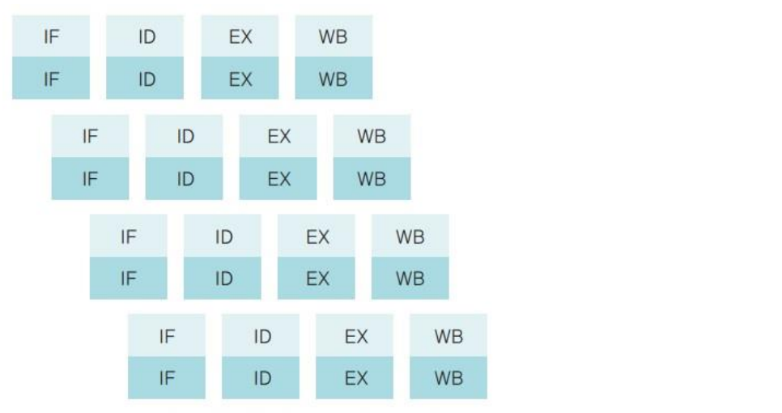

# CHAPTER2 컴퓨터의 구조와 성능 향상

## 1. 컴퓨터의 기본 구성
### 1-1. 하드웨어 구성
- 컴퓨터는 중앙처리장치(CPU), 메인메모리, 입력장치, 출력장치, 저장장치로 구성
- 메인메모리는 전력이 끊기면 데이터를 잃어버리기 때문에 하드디스크나 USB 메모리가 필요. 메인메모리를 제1 저장장치, 하드디스크나 USB메모리를 제2 저장장치 또는 보조 저장장치라고 부름
- CPU는 명령어를 해석하여 실행하는 장치
- 메모리는 작업이 필요한 프로그램과 데이터를 저장하는 장소
- 입출력 장치를 통해 데이터를 입력/출력
- 저장장치의 경우 메모리는 전자의 이동으로 빠르지만 하드디스크나 CD 같은 경우 물리적인 동작으로 속도가 느림
    - 메모리는 빠르지만 비싸고 용량이 적음. 휘발성 데이터
    - 보조저장장치는 느리지만 싸고 용량이 큼. 비휘발성 데이터
- 메인보드는 다양한 부품을 연결하는 커다란 판이며 메인보드로 가는 선들은 '버스'라고 부름
    - 버스 : 데이터, 주소 및 제어 신호를 전달하는 통로 또는 통신 경로를 의미하며 각 장치를 연결하는 선의 집합

```
저장장치 HDD, SSD

HDD
- HDD는 회전하는 원판에 자료를 기록하고 읽어오는 방식으로 동작
- HDD는 특정 위치로 움직이는 시간이 필요하며, 데이터에 접근하기 위해 원판을 회전시켜야 함
- 구동 기계 부품에 결함이 생길 경우 내구성 문제 발생할 수 있음
- 저렴하고 대용량


SSD
- 플래시 메모리 칩에 데이터를 저장하고 읽어오는데, 이는 물리적으로 움직이는 부품이 없어서 더 빠르게 데이터에 접근
- 특정 데이터의 위치로 직접 접근할 수 있기 때문에 더 빠름
- 전기식으로 손상 가능성이 적음
- HDD보다 비쌈
```

<br>

### 1-2. 폰노이만 구조
- 오늘날의 컴퓨터는 대부분 폰노이만 구조를 따름
- CPU, 메모리, 입출력장치, 저장장치가 버스로 연결되어 있는 구조를 말함
    - 이전의 컴퓨터는 전선을 연결하여 회로를 구성하는 하드와이어링 형태로 다른 용도로 사용하려면 전선의 연결을 바꾸어야 했음
- 존 폰노이만은 메모리를 이용하여 프로그래밍이 가능한 컴퓨터 구조, 하드웨어는 그대로 둔채 작업을 위한 프로그램만 교체하여 메모리에 올리는 방식을 제안하고 현재까지 사용

<br>

### 1-3. 요리사 모형
- 모든 프로그램은 메모리에 올라와야 실행할 수 있는데 해당 책은 요리사를 빗대어 표현하였음
- CPU는 요리사, 도마는 메모리, 보관장치는 저장장치, 재료를 옮겨주는 주방보조, 채소나 고기를 다듬는 보조 요리사가 존재
- 요리를 하기 위해서는 우선 음식을 도마로 올려야 함 -> 저장장치에서 메모리로
- 요리 방법을 결정하는 것은 요리사 -> CPU가 작업을 진행 (프로세스 관리)
- 도마 위의 재료를 정리하는 것 -> 여러 프로그램이 사용하는 메모리를 관리하는 것
- 보관 장고의 재료를 정리하는 것 -> 저장장치 관리
- 도마가 클수록 한번에 요리할 수 있는 재료가 많아 빠름 -> 메모리가 클수록 많은 데이터 배치 가능. 적으면 데이터 이동 시간에 시간 소요. 하지만 너무 큰 경우는 작업 속도 크게 차이 나지 않음

<br>

### 1-4. 하드웨어 사양 관련 용어
- 클록 (clock) : CPU 속도와 관련된 단위. 클록이 일정 간격으로 틱을 만듬. 틱은 펄스 또는 클록틱이라고도 부르며 메인 보드의 클록이 틱을 보낼 때마다 데이터를 보내거나 받음
- 헤르츠 (Hz) : 클록틱이 발생하는 속도를 나타내는 단위. 1초에 클록틱이 몇 번 발생하는 지를 나타냄
- 시스템 버스 : 메모리와 주변 장치를 연결하는 버스로 FSB(Front Side Bus : 전면 버스)라고도 함
- CPU 내부 버스 : CPU 내부에 있는 장치를 연결하는 버스로 BSB(Back Side Bus : 후면 버스)라고도 함
    - CPU는 CPU 내부 버스의 속도로 작동하고 메모리는 시스템 버스의 속도로 작동하기 때문에 두 버스의 속도 차이로 인해 작업이 지연되는 문제가 있음

<br>

## 2. CPU와 메모리
### 2-1. CPU의 구성과 동작
- CPU는 명령어를 해석하여 실행하는 장치로 요리사에 해당하며 산술논리 연산장치, 제어장치, 레지스터로 구성
    - 산술논리 연산장치(ALU) : 요리사가 재료를 삶거나 찌거나 볶듯이 데이터를 연산하는 장치가 산술논리 연산장치(ALU)로 산술 연산과 AND, OR 같은 논리 연산 수행
    - 제어장치 : 요리사의 지시에 따라 요리가 만들어지는데 이처럼 CPU에서 작업을 지시하는 부분을 제어장치라고 함
    - 레지스터 : 재료를 미리 손질해두었다면 요리를 할 때 필요한 만큼 넣는데 재료를 필요한 만큼 쥐고 있는 것처럼 CPU 내에 데이터를 임시로 보관하는 곳을 레지스터라고 함
- CPU는 필요한 데이터를 메모리에서 가져와 레지스터에 저장하고 산술논리 연산장치를 이용하여 연산한 후 결과를 레지스터로 저장했다가 메모리로 옮기는데 이떄 사용되는 레지스터는 데이터 레지스터와 주소레지스터를 사용하며 해당 레지스터들은 사용자 프로그램에 의해 변경되어 사용자 가시 레지스터라고 부름
    - 데이터 레지스터 (DR) : 메모리에서 가져온 데이터를 임시로 보관할 때 사용
    - 주소 레지스터 (AR) : 데이터 또는 명령어가 저장된 메모리의 주소를 저장
- 그 외 특별한 용도로 사용되는 레지스터도 있는데 이를 특수 레지스터라고 하며 사용자 임의로 변경할 수 없어 사용자 불가시 레지스터라고 부름
    - 프로그램 카운터 (PC) : CPU는 다음에 어떤 명령어를 처리해야 할지 알아야 함. 프로그램 카운터는 다음에 실행할 명령어의 주소를 기억하고 있다가 제어장치에 알려주는데 실행할 명령어의 주소를 가르켜 프로그램 카운터를 명령어 포인터라고도 함
    - 명령어 레지스터 (IR) : 현재 실행 중인 명령어를 저장. 제어장치는 명령어 레지스터에 있는 명령을 해석한 후 외부 장치에 적절한 제어 신호를 보냄
    - 메모리 주소 레지스터 (MAR) : 메모리에서 데이터를 가져오거나 반대로 메모리로 데이터를 보낼 때 주소를 지정하기 위해 사용
    - 메모리 버퍼 레지스터 (MBR) : 메모리에서 가져온 데이터나 메모리로 옮겨 갈 데이터를 임시로 저장. 항상 메모리 주소 레지스터와 함께 동작함
    - 그 외에도 CPU에는 다양한 레지스터가 존재
- 버스는 CPU와 메모리, 주변장치 간에 데이터를 주고받을 때 사용한다고 했는데 제어 버스, 주소 버스, 데이터 버스가 존재
    - 제어 버스 : 다음에 어떤 작업을 할지 지시하는 제어 신호가 오고 감. 메모리에서 데이터를 가져올지, 처리한 데이터를 옮겨놓을지 등으로 모두 제어 버스를 통해 CPU로 전달되므로 제어 버스의 신호는 CPU, 메모리, 주변장치와 양방향으로 오고감
    - 주소 버스 : 메모리의 데이터를 읽거나 쓸 때 어느 위치에서 작업할 것인지 알려주는 위치 정보가 오고 감. 주소 버스는 메모리 주소 레지스터와 연결되어 있으며 단반향으로 감
    - 데이터 버스 : 데이터를 목적지까지 이동시킴. 데이터 버스는 메모리 버퍼 레지스터와 연결되어 있으며 양방향으로 오고감
- 해당 동작 과정은 [해당 블로그](https://hongong.hanbit.co.kr/컴퓨터의-4가지-핵심-부품cpu-메모리-보조기억장/)를 통해 확인하면 좋을 것 같음C

<br>


<br>


<br>


<br>

### 2-2. 메모리의 종류와 부팅
- 컴퓨터가 발전함에 따라 많은 종류의 메모리가 개발되었음. 메모리는 읽거나 쓸 수 있는 램(RAM : Random Access Memory)와 읽기만 가능한 롬(ROM: Read Only Memory)로 구분
    - 램은 무작위로 데이터를 읽어도 저장된 위치와 상관없이 같은 속도로 데이터를 읽을 수 있다는 의미에서 붙은 이름이라고 함
- 램은 전력이 끊기면 데이터가 사라지는 휘발성 메모리와 데이터를 보관할 수 있는 비휘발성 메모리로 나뉨
- 휘발성 램
    - DRAM
    - SRAM
    - SDRAM
- 비휘발성 램
    - 플래시 메모리
    - FRAM
    - PRAM
- 롬은 전력이 끊겨도 데이터를 보관하는 것이 장점이지만 데이터를 한 번 저장하면 바꿀 수 없음. 이러한 특성 때문에 바이오스를 롬에 저장함

<br>

- 현대의 운영체제는 시분할 기법을 사용하여 여러 프로그램을 동시에 실행하므로 사용자 영역이 여러 개의 작업 공간으로 나뉘어 있음. 이러한 상황에서 메모리 보호는 중요한 문제
- 운영 체제도 소프트웨어 중 하나로 사용자 작업이 진행되는 동안 운영체제의 작업이 잠시 중단되는데 중단된 상태에서 사용자의 작업으로부터 메모리를 보호하려면 하드웨어의 도움이 필요
- 메모리를 보호하기 위해 CPU는 현재 진행 중인 작업의 메모리 시작 주소를 경계 레지스터에 저장한 후 작업을 함. 또한 현재 진행 중인 작업이 차지하고 있는 메모리의 크기, 즉 마지막 주소까지의 차이를 한계 레지스터에 저장함
    - 경계 레지스터 : 레지스터 시작 주소값
    - 한계 레지스터 : 메모리의 크기 (레지스터 마지막 주소 값 - 레지스터 시작 주소 값)

<br>

- 운영체제도 소프트웨어이기 때문에 메모리에 올려서 실행해야 함. 컴퓨터를 켰을 때 운영체제를 메모리에 올리는 과정을 부팅이라고 하며 과정은 다음과 같음
    1. 컴퓨터 전원을 키면 롬에 저장된 바이오스 실행
    2. 이상이 없으면 하드디스크의 마스터 부트 레코드(MBR)에 저장된 작은 프로그램을 메모리에 가져와 실행

<br>

## 3. 컴퓨터 성능 향상 기술
- 현대 컴퓨터 구조의 가장 큰 문제는 CPU와 메모리, 주변장치의 작업속도가 모두 다르다는 것
    - 위에 내용처럼 메모리의 속도는 시스템 버스의 속도와 같고 CPU의 속도는 CPU 내부 버스의 속도와 같은데 CPU 내부 버스 속도가 더 빨라 메모리를 비롯한 주변장치의 속도가 CPU의 속도를 따라가지 못함
- 해당 속도차이를 극복하기 위해 버퍼, 캐시, 계층구조, 인터럽트들을 설명할 예정

<br>

### 3-1. 버퍼 (buffer)
- 속도가 차이가 있는 두 장치 사이에서 그 차이를 완화하는 역할
- 도마에 재료를 하나씩 가져오는 것이아니라 재료를 바구니에 담아 여러개를 가지고 옴
- 위의 예시처럼 일정량의 데이터를 모아 한꺼번에 전송하면 적은 노력으로도 많은 양의 데이터를 옮길 수 있음
- 하드디스크에도 버퍼가 있지만 소프트웨어적으로도 버퍼가 존재. 대표적인 버퍼의 예는 동영상 스트리밍
- 버퍼와 유사한 개념으로 스풀(SPOOL)은 CPU와 입출력장치가 독립적으로 동작하도록 고안된 소프트웨어적인 버퍼로 출력 명령을 내린 프로그램과 독립적으로 동작
    - 워드에서 작업하고 프린터로 출력하는 경우 스풀러가 없다면 모든 출력을 알아서 처리해야하지만 스풀러를 사용하면 인쇄할 내용을 하드디스크의 스풀러 공간에 저장하고 워드는 다른 작업을 할 수 있음
    - 스풀러는 버퍼의 일종이지만 버퍼의 경우 어떤 프로그램이 사용하는 데이터든 버퍼가 차면 이동이 시작하지만 (프로그램들이 버퍼를 공유) 스풀러는 한 인쇄물이 완료될 때 까지 다른 인쇄물이 끼어들수 없으므로 프로그램 간에 배타적

<br>

### 3-2 캐시(cache)
- 캐시는 메모리와 CPU 간의 속도 차이를 완화하기 위해 메모리의 데이터를 미리 가져와 저장해두는 임시 저장소
- 캐시는 필요한 데이터를 모아 한꺼번에 전달하는 버퍼의 일종으로 CPU가 앞으로 사용할 것으로 예상되는 데이터를 미리 가져다 놓음
    - 이렇게 미리 가져오는 작업을 '미리 가져오기(prefetch)'라고 함
- 캐시는 메모리의 내용 중 일부를 미리 가져오고 CPU는 메모리에 접근하기 전에 캐시를 먼저 방문하여 원하는 데이터가 있는지 확인함
    - 원하는 데이터를 찾았다면 캐시 히트(cache hit)
    - 원하는 데이터를 찾지못했다면 캐시 미스(cache miss)
- 컴퓨터의 성능을 향상시키려면 캐시 적중률이 높아야 하는데 캐시의 경우 가격이 매우 비싸 적중률을 높이는 방법으로 '지역성 이론'이 있음
    - 지역성 이론 (locality) : 현재 위치에 가까운 데이터가 멀리 있는 데이터보다 사용될 확률이 높다는 이론

<br>

- 캐시에 있는 데이터가 변경되는 경우 변경사항을 반영해야 하는데 캐시의 변경된 데이터를 메모리에 반영하는 데에는 즉시 쓰기 방식과 지연 쓰기 방식이 있음
    - 즉시 쓰기 : 캐시에 있는 데이터가 변경되면 즉시 메모리에 반영하는 방식. 메모리와의 빈번한 데이터 전송으로 성능이 느려지지만 메모리에는 항상 최신값이 유지
    - 지연 쓰기 : 캐시에 있는 데이터가 변경되면 변경된 내용을 모아서 주기적으로 반영하는 방식으로 '카피백'이라고도 함. 성능을 향상할 수 있으나 메모리와 캐시 데이터 사이 불일치가 발생할 수 있음

<br>

- 프로그램 명령어는 크게 명령어 부분과 데이터 부분으로 나뉘는데 캐시는 구분 없이 모든 자료를 가져오는 일반 캐시, 데이터를 구분하는 특수 캐시라는 두 가지 레벌로 구분됨
- 명령어 캐시나 데이터 캐시는 CPU 레지스터에 직접 연결되기 때문에 L1 캐시라고 부름
- 일반 캐시는 메모리와 연결되기 때문에 L2 캐시라고 부름


<br>

### 3-3. 저장 장치의 계층 구조
- 가격과 컴퓨터 성능 사이의 타협적으로 저장장치의 계층 구조가 존재하는데 저장장치의 계층 구조는 속도가 빠르고 값이 비싼 저장장치를 CPU에 가까운 쪽으로 두고 값이 싸고 용량이 큰 저장장치를 반대쪽에 배치하여 빠른속도와 큰 용량을 얻는 방법
- 한편 저장장치의 계층 구조는 중복되는 데이터의 일관성을 유지하는 것이 문제가 될 수 있음 (지연 쓰기나 협업 중이나 전원 종료로 인한 데이터를 유실)

<br>

### 3-4. 인터럽트 (interrupt)
- 초반 컴퓨터의 경우 주변장치가 많지 않아 CPU가 직접 입출력장치에서 데이터를 가져오거나 내보냈는데 이러한 방식을 '폴링(polling)'이라고 함
- 폴링 방식은 CPU가 명령어 해석과 실행이라는 본래 역할 외에 모든 입출력 까지 관여하게 되어 작업 효율이 떨어짐
- 오늘날의 컴퓨터는 많은 주변장치가 있는데 작업효율이 떨어지는 문제를 해결하기 위해 등장한 것이 '인터럽트' 방식
    - 맨 처음 이야기했던 주방 보조의 역할으로 CPU의 지시를 받아 데이터를 메모리로 이동시키고 준비 되었다고 CPU에게 알려주어 데이터 이동이 독립적이고 입출력이 이루어지는 동안 CPU가 다른 작업을 할 수 있어 작업 효율이 좋음
- 인터럽트 방식의 동작과정은 다음과 같으며 CPU에 보내는 완료 신호를 인터럽트라고 함
    - CPU가 입출력 관리자에게 입출력 명령을 보냄
    - 입출력 관리자는 명령받은 데이터를 메모리에 가져다 놓거나 메모리에 있는 데이터를 저장장치로 옮김
    - 데이터 전송이 완료되면 완료신호를 CPU에 보냄
- 인터럽트 방식에는 많은 주변장치 중 어떤 것의 작업이 끝났는지 CPU에 알려주기 위해 '인터럽트 번호'를 사용하고 인터럽트 번호는 장치의 고유번호로 운영체제마다 다름
- CPU는 입출력 관리자에게 여러 개의 입출력 작업을 동시에 시킬 수 있는데 그 때마다 인터럽트를 사용하는 것은 매우 비효율적으로 여러 개의 인터럽트를 하나의 배열로 만든 '인터럽트 벡터'를 사용함

<br>

- 과거 운영체제는 CPU가 메모리나 주변장치에 대한 모든 권한을 가지고 있었으나 현재 메모리는 CPU만 접근 권한을 가진 작업 공간으로 접근이 불가능함
- 이를 위해 입출력 관리자에게는 CPU 허락 없이 메모리에 접근할 수 있는 권한이 필요한데 이러한 권한을 '직접 메모리 접근(DMA)'이라고 함


<br>

- 직접 메모리 접근은 인터럽트 방식의 시스템을 구성하는데 필수적이나 그러나 사용하면 메모리가 복잡해짐. 메모리에는 CPU가 사용하는 데이터와 입출력 장치가 사용하는 데이터가 섞여있기 때문
- 이를 해결하기 위해 CPU가 사용하는 메모리 공간과 직접 메모리 접근을 통한 데이터 공간을 분리하는 방식을 사용하는데 해당 기법을 '메모리 매핑 입출력(MMIO)' 라고 함
- CPU와 직접 메모리 접근이 동시에 접근한다면 누군가 양보해야 하는데 입출력 장치의 속도가 느리기 때문에 직접 메모리 방식에 양보하는데 이를 '사이클 훔치기'라고 부름


<br>

## 4. 병렬 처리
### 병렬 처리의 개념
- 병렬 처리는 동시에 여러 개의 명령을 처리하여 작업의 능률을 올리는 방식
- 한 주방에서 여러 개의 볶음밥을 동시에 조리하는 것은 하나의 코어에 여러 개의 '스레드'를 이용하는 방식과 같음
- 여기서 스레드는 CPU가 처리할 수 있는 작업의 단위를 나타내며 여러 개의 스레드를 동시에 처리하는 방법을 'CPU 멀티스레드' 라고 함
- 병렬 처리는 파이프라인 기법, 슈퍼스칼라 기법이 있음
    - 파이프라인 기법 : 여러개의 스레드를 이용하는 방식
    - 슈퍼스칼라 기법 : 여러개의 시설을 갖추어 동시에 처리하는 방식

<br>

### 병렬 처리 시 고려 사항
- 상호 의존성이 없어야 병렬 처리가 가능 : 각 명령이 서로 독립적이고 앞의 결과가 뒤의 명령에 미치지 않아야 함
- 각 단계의 시간을 거의 일정하게 맞춰야 병렬 처리가 원만하게 이루어짐 : 각 단계의 처리 시간이 다르면 앞의 작업이 먼저 끝나도 가장 긴 시간이 걸리는 단계에서 병목 현상 발생
- 전체 작업 시간을 몇 단계로 나눌지 잘 따져보아야 함 : 병렬 처리에서 작업을 N개로 쪼갰을 때 N을 병렬 처리의 깊이라고 하는데 N에 따라 동시에 처리할 수 있는 작업의 개수를 의미

<br>

### 병렬 처리 기법
- CPU에서 명령어가 실행되는 과정은 4단계로 나뉘는데 병렬 처리 기법은 이를 하나의 코어에서 작업을 나누어 병렬로 처리하는 파이프라인 기법과 여러 개의 코어를 사용하여 동시에 작업하는 슈퍼 스칼라 기법으로 나뉨
    1. 명령어 패치 : 다음에 실행할 명령어를 명령어 레지스터에 저장
    2. 명령어 해석 : 명령어를 해석
    3. 실행 : 해석된 결과를 토대로 명령어를 실행
    4. 쓰기 : 실행된 결과를 메모리에 저장

<br>

-  파이프라인 기법
    - 하나의 코어에 여러 개의 스레드를 이용하는 방식


<br>

- 슈퍼스칼라 기법
    - 파이프라인을 처리할 수 있는 코어를 여러개 구성하여 복수의 명령어가 동시에 실행되도록 하는 방식으로 코어를 2개 구성하여 각 단계에서 동시에 실행하는 명령어가 2개


<br>

- 슈퍼 파이프라인 기법
    - 파이프라인의 각 단계를 세분하여 한 클록 내에 여러 명령어를 처리


<br>

- 슈퍼 파이프라인 슈퍼스칼라 기법
    - 슈퍼파이프라인 기법을 여러 개의 코어에서 동시에 수행하는 방식


<br>

## 5. 무어의 법칙과 암달의 법칙

<br>

### 면접 문제

1. 

<br>

2.

<br>

3.

<br>

### Reference
- https://hongong.hanbit.co.kr/컴퓨터의-4가지-핵심-부품cpu-메모리-보조기억장/
- https://math-coding.tistory.com/88
- https://velog.io/@gwichanlee/OS-멀티-프로세싱