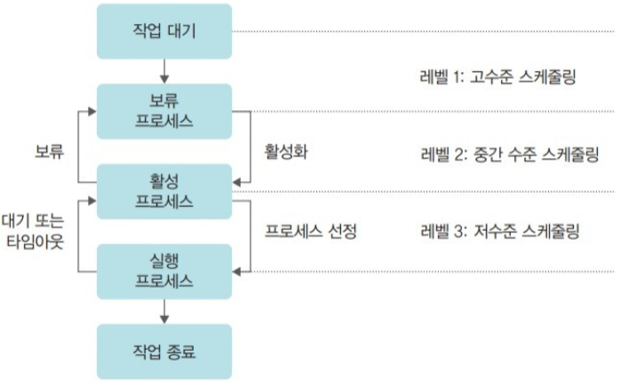
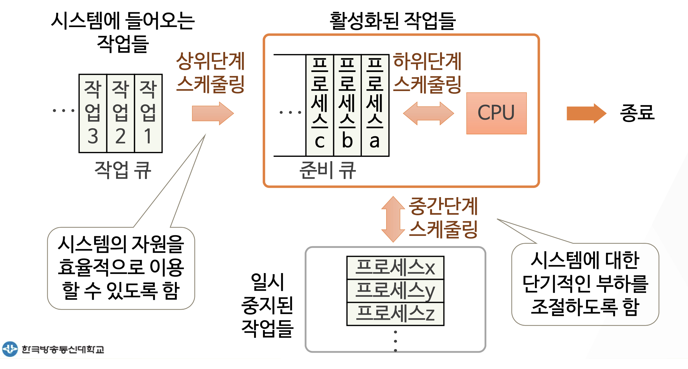
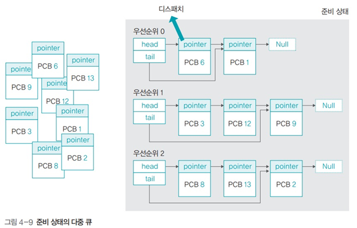
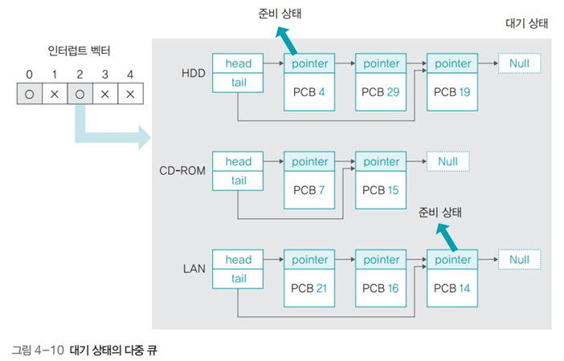

# CHAPTER3 CPU 스케줄링

## 1. 스케줄링의 개요
### 1-1. CPU 스케줄링
- CPU 스케줄러는 프로세서 스케줄러라고도 하며 프로세스가 생성된 후 종료될 때까지 모든 상태 변화를 조정하는 일을 함
- 해당 책에서는 스케줄링을 요리사 모형에서 식당 관리자로 설명해주고 있음
    - 요리가사 요리에 집중할 수 있도록 식당 메니저는 예약 관리, 좌석 관리, 주문 관리, 조리 순서 관리 등 외부적인 요소를 처리
    - 식당 매니저는 예약손님을 우선하거나 손님의 요청사항 변경 등에 대처하여 순서를 결정

 

### 1-2. 스케줄링 단계
- 스케줄링의 단계는 고수준 스케줄링, 중간 수준 스케줄링, 저수준 스케줄링이 존재
- CPU 스케줄링을 고수준 스케줄링 또는 장기 스케줄링, 작업 스케줄링이라고 함
- 고수준 스케줄링의 경우는 많은 작업을 동시에 하면 시스템에 과부하가 걸려 작업이 원할하게 이루어지지 않아 시스템 내의 전체 작업 수를 조절하는 것을 의미
- 고수준 스케줄링 단계에서는 어떤 작업을 시스템이 받아들일지 또는 거부할지 결정
    - 일단 작업이 시작하면 기존 작업에 영향을 끼침
    - 운영체제에서 가장 다루는 일의 큰 단위인 프로세스를 단위로 이루어짐
- 저수준 스케줄링의 경우는 CPU 스케줄러 입장에서 어떤 프로세스에 CPU를 할당할지, 어떤 프로세스를 대기 상태로 보낼지 등을 결정
- 중간 수준 스케줄링은 고수준 스케줄링과 저수준 스케줄링 사이에 일어나며 프로세스가 과부하가 걸리는 경우를 중지와 활성화로 전체 시스템의 활성화된 프로세스를 조절하여 과부하를 막음
    - 이는 프로세스의 상태 중 보류 상태에 해당하며 저수준 스케줄링이 원만하게 이루어지도록 완충하는 역할을 함

 

 

 

### 1-3. 스케줄링의 목적
- CPU 스케줄링의 원래 목적은 모든 프로세스가 공평하게 작업하도록 하는 것으로 목적들은 다음과 같음
    - 공평성 : 모든 프로세스가 자원을 공평하게 배정받아야 하며 자원 배정 과정에서 특정 프로세스가 배제되어서는 안된다
    - 효율성 : 시스템 자원이 유휴 시간 없이 사용되도록 스케줄링을 하고 유휴 자원을 사용하려는 프로세스에는 우선권을 주어야 함
    - 안정성 : 우선순위를 사용하여 중요 프로세스가 먼저 작동학도록 배정함으로써 시스템 자원을 점유하거나 파괴하는 프로세스로부터 자원을 보호해야 함
    - 확장성 : 프로세스가 증가해도 시스템이 안정적으로 작동하도록 조치해야함. 또한 시스템 자원이 늘어나는 경우 시스템에 반영되도록 해야함
    - 반응 시간 보장 : 응답이 없는 경우 사용자는 시스템이 멈춘 것으로 가정하기 때문에 시스템은 적절한 시간 안에 프로세스의 요구에 반응해야함
    - 무한 연기 방지 : 특정 프로세스의 작업이 무한히 연기되어서는 안됨
- 보통은 모든 프로세스가 공평하게 CPU를 할당받아야 하나 시스템의 안정성과 효율성을 높이기 위해 우선순위의 프로세스가 존재하므로 CPU 스케줄러는 일정 부분 공평성을 희생함
- 일반적으로 운영체제 프로세스는 일반 프로세스보다 우선순위가 높고 일반 프로세스 간에도 우선순위가 존재

 

## 2. 스케줄링 시 고려 사항
### 2-1. 선점형 스케줄링과 비선점형 스케줄링
- CPU 할당을 빼앗을 수 있는 선점형과 뺏을 수 없는 비선점형 스케줄링이 존재
    - 선점형 스케줄링 : 어떤 프로세스가 CPU를 할당받아 실행 중이더라도 운영체제가 CPU를 강제로 빼앗을 수 있는 스케줄링 방식
    - 비선점형 스케줄링 : 어떤 프로세스가 CPU를 점유하면 다른 프로세스가 이를 빼앗을 수 없는 스케줄링 방식
- 선점형 스케줄링은 하나의 프로세스가 CPU를 독점할 수 없어 빠른 응답 시간을 요구하는 대화형 시스템이나 시분할 시스템에 적합하며 대부분의 저수준 스케줄러는 선점형 스케줄링 방식을 사용
- 선점형 스케줄링은 문맥 교환(Context Swiching)같은 부가적인 작업으로 낭비가 생기는 것이 단점
- 비선점형 스케줄링은 문맥 교환이 없어 작업량이 적고 낭비가 적다
- 비선점형 스케줄링은 사용시간이 긴 프로세스의 경우 짧은 여러 프로세스들이 기다리게 되어 전체 시스템의 처리율이 떨어지게되어 과거 일괄 작업 시스템에 사용하던 방식임

 

### 2-2. 프로세스 우선순위
- 프로세스간 중요도를 구분하기 위해 우선순위를 정하게되고 프로세스는 크게 커널 프로세스와 일반 프로세스로 나뉨
- 커널 프로세스는 일반 프로세스보다 우선순위가 높아 커널에 관련된 중요한 프로세스 작업을 처리함
- 우선순위가 높다는 것은 더 빨리 자주 실행된다는 의미로 일반 프로세스 또한 중요도가 다르기 때문에 우선순위가 존재
- 우선순위가 적당하지 못하고 지나치게 높다면 다른 프로세스보다 먼저 실행해야 하기 때문에 다른 프로세스의 실행속도에도 영향을 끼쳐 작업이 원할하게 이루어지지 않음

 

### 2-3. CPU 집중 프로세스와 입출력 집중 프로세스
- 프로세스는 생성 된 후 준비, 실행, 대기 상태를 거쳐 실행되는데 준비상태는 CPU를 할당받기 위해 기다리는 상태이므로 실제 작업이 일어나는 것은 실행 상태와 대기상태가 됨
- 실행 상태와 대기 상태 사이에서 CPU를 받아 실행하는 것을 CPU 버스트, 입출력 작업을 입출력 버스트라고 함
- 위의 작업 형태에 따라 CPU 집중 프로세스와 입출력 집중 프로세스로 나뉘게 됨
    - CPU 집중 프로세스 : 수학 연산과 같이 CPU를 많이 사용하는 프로세스. 즉 CPU 버스트가 많은 프로세스
    - 입출력 집중 프로세스 : 저장장치에서 데이터를 복사하는 일과 같이 입출력을 많이 사용하는 프로세스. 즉 입출력 버스트가 많은 프로세스
- 주로 해당 프로세스가 동시에 있을 경우 입출력 집중 프로세스를 먼저 실행 상태로 옮기는 것이 효율적인데 입출력 요구에 의해 대기 상태로 옮겨지므로 다른 프로세스가 CPU를 사용할 수 있기 때문
- 만약 CPU 집중 프로세스가 먼저 들어간다면 타임 슬라이스를 다 쓸 때까지 다른 프로세스가 실행되지 못함
- 그렇기 때문에 입출력 집중 프로세스가 우선순위가 높게하는 것이 좋고 해당 프로세스가 CPU 집중 프로세스보다 실행 상태에 먼저 들어가는 경우를 사이클 훔치기라고 함

 

### 2-4. 전면 프로세스와 후면 프로세스
- 주로 사용자의 입력같이 상호작용이 필요한 전면 프로세스와 입력이 필요없는 후면 프로세스로 구분된다
    - 전면 프로세스 : GUI를 사용하는 운영체제에서 화면의 맨 앞에 놓인 프로세스. 현재 입력과 출력을 사용하는 프로세스로 사용자와 상호작용이 가능하여 상호작용 프로세스라고도 함
    - 후면 프로세스 : 사용자와 상호작용이 없는 프로세스. 압축 프로그램처럼 사용자의 입력 없이 작동하기 때문에 일괄 작업 프로세스라고도 함
- 전면 프로세스는 사용자의 요구에 즉각 반응해야하지만 후면 프로세스는 상호작용이 없어 전면 프로세스의 우선순위가 더 높음

 

### 정리

|우선순위 높음|우선순위 낮음|
|:---:|:---:|
|커널 프로세스|일반 프로세스|
|전면 프로세스|후면 프로세스|
|대화형 프로세스|일괄 처리 프로세스|
|입출력 집중 프로세스|CPU 집중 프로세스|

 

## 3. 다중 큐
### 3-1 준비 상태의 다중 큐
- 프로세스는 저마다 중요도가 다르며 프로세스의 중요도는 프로세스 제어 블록에 표시됨. 하지만 매번 프로세스 제어 블록을 방문하는 것은 비효율적이기 때문에 다중 큐를 사용하여 검색하는 것이 좋다
- 준비 상태의 다중 큐를 만들어 우선순위 별로 정리하여 사용함
    - 프로세스가 준비 상태로 무작위로 들어올 때 자신의 우선순위에 해당하는 큐를 찾아 해당 큐의 마지막에 삽입됨
    - 우선순위별로 큐에 담아 우선순위의 프로세스부터 디스패치
- 프로세스의 우선순위를 배정하는 방식에는 고정 우선순위 방식과 변동 우선순위 방식이 있음
    - 고정 우선순위 방식 : 운영체제가 프로세스에 우선순위를 부여하면 프로세스가 끝날 때까지 바뀌지 않는 방식. 구현하기 쉽지만 시스템의 변화에 대응하기 어려움
    - 변동 우선순위 방식 : 프로세스 생성 시 부여받은 우선순위가 프로세스 작업 중간에 변하는 방식. 구현하기 어렵지만 시스템의 효율성을 높일 수 있음
    - 반전 우선순위 : 프로세스의 낮은 우선순위를 높은 우선순위로 바꾸는 것

 

 

### 3-2 대기 상태의 다중 큐
- 대기 상태에서도 다중 큐를 사용하는데 입출력이 완료되기를 기다리는 프로세스들이 존재하는 상태였음
- 시스템 내에는 다양한 종류의 입출력장치가 있기 때문에 대기 상태의 프로세스를 한 곳에 모아놓으면 관리하기 어려움
- 해당 시스템 효율을 향상시키기 위해 대기 상태에서는 같은 입출력을 기다리는 프로세스끼리 모아둠

 

 

## 4. 스케줄링 알고리즘
### 4-1 스케줄링 알고리즘 선택 기준
- 스케줄링 알고리즘은 크게 비선점형과 선점형으로 나뉨
- 스케줄링 알고리즘의 효율성 파악을 위한 평가기준은 다음과 같음
    - CPU 사용률 : 전체 시스템의 동작 시간 중 CPU가 사용된 시간을 측정하는 방법. 실제로는 여러 이유로 90%를 못넘김
    - 처리량 : 시스템이 정상적으로 작동한다면 일정 시간 후 작업이 끝나는데 단위 시간당 작업을 마친 프로세스의 수
    - 대기 시간 : 작업을 요청하고 실제 작업이 이루어지기 전까지 걸리는 시간
    - 응답 시간 : 프로세스 시작 후 첫 번째 출력 혹은 반응이 나올 때까지 걸리는 시간
    - 반환 시간 : 프로세스가 종료되어 사용하는 자원을 모두 반홚하는데까지 걸리는 시간
    - 실행 시간 : 프로세스 작업이 시작된 후 종료되기까지의 시간
- CPU 알고리즘의 효율성을 평가할 때 사용률과 처리량은 계산하기 어려움으로 주로 대기 시간, 응답 시간, 반환 시간을 계산
- 스케줄링 알고리즘의 성능을 비교할 때는 주로 평균 대기 시간을 보는데 이는 프로세스의 대기 시간을 모두 더하고 프로세스 수를 나눈 평균 값
    - 작업 패턴을 바꾸면 평균 대기 시간이 역전되기도 하므로 평균 대기 시간은 알고리즘의 절대적인 성능을 보여주는 지표는 아니며 어떻게 작동하는지 파악하는 도구정도로 생각하는 것이 좋음
    - 내가 생각하는 이유는 면접문제로 작성해 두었음

 

### 4-2 비선점형 스케줄링
#### 1. FCFS (First Come First Serverd) 스케줄링
- 준비 큐에 도착한 순서대로 CPU를 할당하는 비선점 방식으로 선입선출 스케줄링이라고도 함
- 초기의 일괄 작업 시스템에서 사용하던 방식으로 우선순위가 없음
- 처리 시간이 긴 프로세스가 먼저 CPU를 차지하면 다른 프로세스는 하염없이 기다려 시스템 효율성이 떨어지는 콘보이 효과(convoy effect)또는 호위 효과가 발생

 

#### 2. SJF (Shortest Job First) 스케줄링
- 준비 큐에 있는 프로세스 중에서 실행 시간이 가장 짧은 작업부터 CPU를 할당하는 방식으로 최단 작업 우선 스케줄링이라고도 함
- 콘보이 효과를 완화하는 것이 목적이고 성능은 좋음
- 하지만 해당 이유들로 사용하기가 힘듬
    - 운영체제가 프로세스의 종료 시간을 정확하게 예측하기 어려움 : 현대의 프로세스는 사용자의 입력을 기다리는 상호작용이 빈번히 발생하여 종료시간을 파악하기 어려워 최단 작업 프로세스를 구분하기 어렵다
    - 공평하지 못함 : 알고리즘으로 인해 특정 프로세스가 CPU를 계속 할당받지 못하는 상태가 생기는 아사현상 혹은 무한 봉쇄 현상이 발생함. 공평성을 위반

 

#### 3. HRN (Highest Response Ratio Next) 스케줄링
- SLF 에서 아사 현상을 해결하기 위한 알고리즘
- 우선순위를 사용하는데 해당 우선순위는 ( CPU 사용 시간 + 대기 시간 ) / CPU 사용 시간 으로 우선순위를 결정
- 대기 시간을 우선순위로 사용하므로 아사 현상을 완화하나 여전히 공평성이 위배되어 많이 사용되지 않음

 

### 4-3 선점형 스케줄링
#### 1. 라운드 로빈 스케줄링
- '순환 순서 방식'으로 번역되는 라운드 로빈 스케줄링은 한 프로세스가 할당받은 시간(타임 슬라이스)동안 작업을 하다가 작업을 완료하지 못하면 준비 큐의 맨 뒤로 가서 차례를 기다리는 방식
- 타임 슬라이스 동안만 작업을 진행하고 작업이 끝나지 않으면 큐의 뒤쪽에 다시 삽입되어 다시 CPU가 할당되기를 기다림
- 해당 방식은 타임 슬라이스를 적당히 사용하는 것이 제일 중요
    - 타임 슬라이스가 큰 경우 : 타임 슬라이스가 너무 큰 경우 하나의 작업이 끝난 뒤 다음 작업이 시작되는 것 처럼 보임. 해당 경우는 FCFS 스케줄링과 다를게 없으며 여러개의 작업이 어려움
    - 타임 슬라이스가 작은 경우 : 여러 프로그램이 동시에 실행되는 것 처럼 느낄 수 있음. 하지만 잦은 문맥 교환으로 인해 시스템 전반적인 성능이 감소

 

#### 2. SRT (Shortest Remaining Time) 우선 스케줄링
- SRT 스케줄링은 SJF와 라운드 로빈 스케줄링을 혼합한 방식으로 최소 잔류 시간 우선 스케줄링이라고도 함
- 라운드 로빈 스케줄링을 사용하지만 CPU를 할당 받을 프로세스를 선택할 때 남아 있는 작업 시간이 가장 적은 프로세스를 선택함
- 하지만 마찬가지로 현재 실행 중인 프로세스와 큐에 있는 프로세스의 남은 시간을 주기적으로 계산하고 남은 시간이 더 적은 프로세스와 문맥 교환을 해야하므로 SJF에는 없는 작업이 추가됨
- 게다가 SJF 스케줄링에서의 프로세스의 종료 시간 예측이 어렵고 아사 현상이 일어나 잘 사용하지 않음

 

#### 3. 다단계 큐 스케줄링
- 우선 순위에 따라 준비 큐를 여러개 사용하는 방식으로 프로세스는 운영체제로부터 부여받은 우선순위에 따라 해당 우선순위의 큐에 삽입
- 큐는 우선순위로 나뉘어 있어 삽입하는 것만으로 우선순위가 결정되며 라운드 로빈 방식으로 우선순위의 프로세스를 작업 진행
- 프로세스의 우선순위와 작업 형태를 고려하여 스케줄링을 할 수 있으나 우선순위가 낮은 프로세스는 여전히 CPU를 할당 받지 못하는 아사 현상이 발생한다

 

#### 4. 다단계 피드백 큐 스케줄링
- 다단게 큐 스케줄링의 단점을 보완한 스케줄링 방식으로 해당 방식에서 CPU를 사용하고 난 프로세스의 우선순위를 낮게하여 큐에 넣는 방식을 사용
- 해당 방식을 통하여 우선순위가 낮은 프로세스의 실행이 연기되는 문제를 완화함. 하지만 당연하게도 커널 프로세스의 경우는 우선순위가 낮아지지 않음
- 해당 스케줄링의 또 다른 특징은 우선순위가 낮은 프로세스는 실행되는 주기가 적으므로 우선순위가 낮을 수록 타임 슬라이스를 크게 설정하는 것이 특징
- 결국 다단계 피드백 큐 스케줄링에서 마지막 큐에 있는 프로세스는 무한대의 타임 슬라이스를 얻음
- 다단계 피드백 큐 스케줄링은 오늘날 운영체제가 CPU 스케줄링을 위해 일반적으로 사용하는 방식으로 변동 우선순위 알고리즘의 전형적인 예

 

### 면접 문제

1. 중간 수준 스케줄러와 저수준 스케줄러에서 실제로 작업이 일어나는 이유

2. 스케줄링 알고리즘에서 구분하는 방법을 주로 평균 대기 시간으로 보는 이유

3. 동기적 인터럽트와 비동기적 인터럽트의 주요 차이점

 