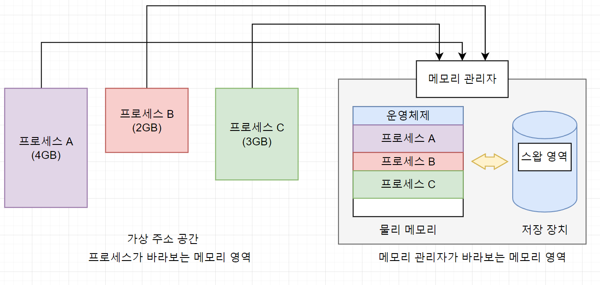
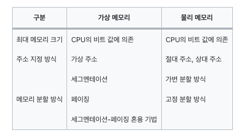
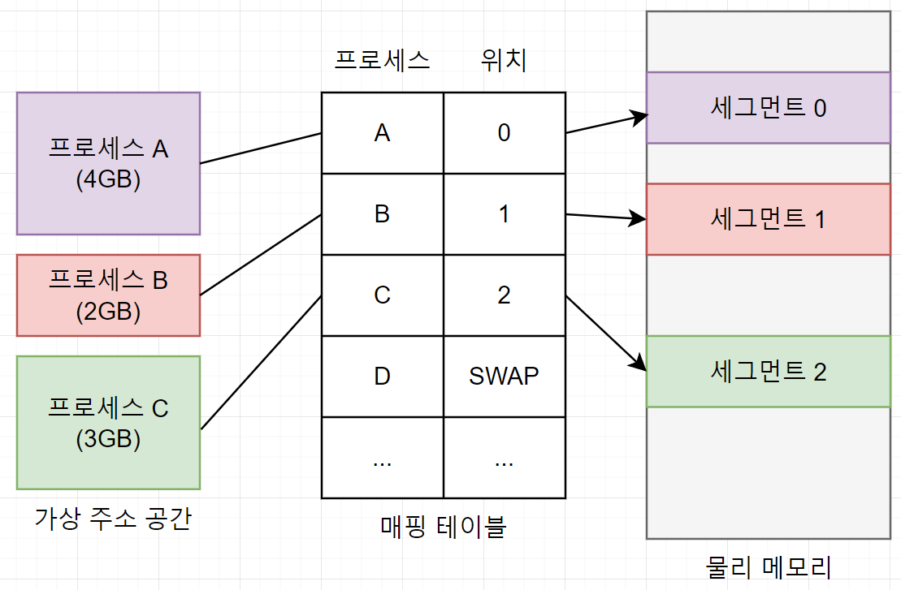
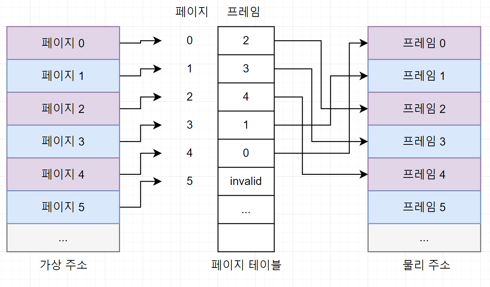
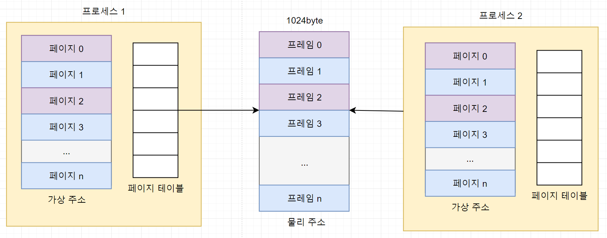
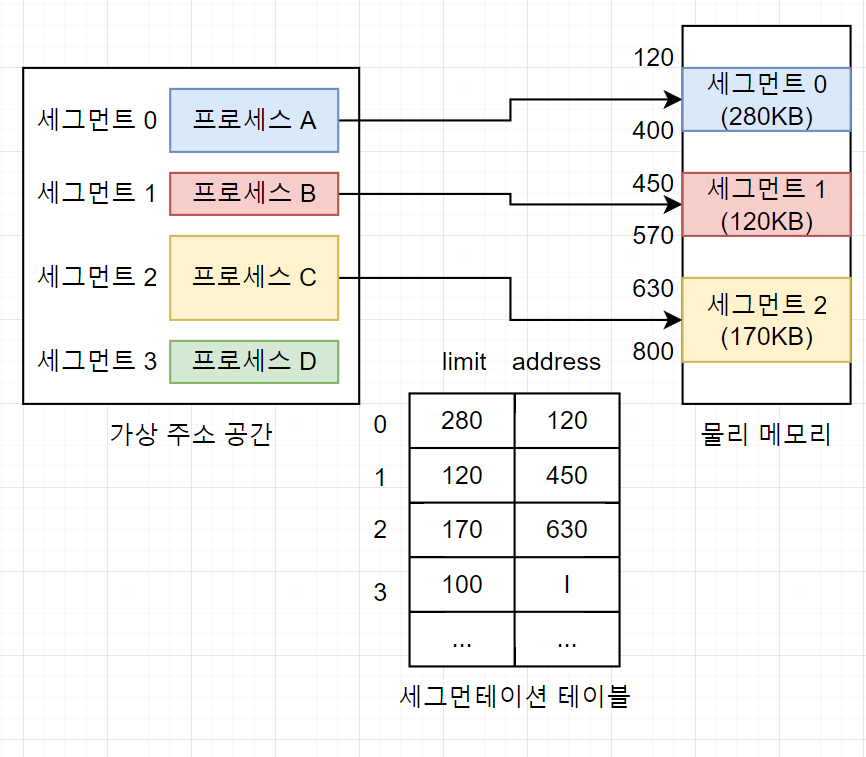
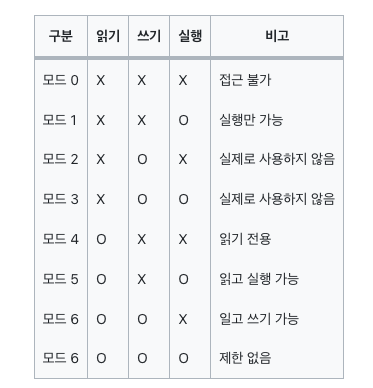

# CHAPTER 8 가상 메모리의 기초

## 1. 가상 메모리의 개요
- 컴퓨터마다 물리 메모리, 즉 실제 메모리의 크기가 다른데 가상 메모리(virtual memory)는 크기가 다른 물리 메모리에서 일관되게 프로세스를 실행할 수 있는 기술

### 가상 메모리 시스템
- 메모리의 크기는 컴퓨터마다 다른데 운영체제가 물리 메모리의 크기에만 의존한다면 2GB의 메모리에서 동작하는 프로그램이 1GB의 메모리에서는 동작하지 않을 수 있음
- 또한 프로그래머 또한 메모리 크기에 맞는 응용 프로그램만 개발해야하는데 실제로 메모리 크기를 고려하여 프로그래밍하기는 매우 어려움. 사용할 수 있는 배열의 개수가 한정되거나 특정 변수에 접근할 수 없다는 제약은 프로그래머에게 큰 장벽
- 가상 메모리는 이러한 물리 메모리의 크기와 상관없이 프로세스에 커다란 메모리 공간을 제공하는 기술으로 프로세스는 운영체제의 위치나 물리 메모리의 크기를 신경쓰지 않고 마음대로 사용 가능

 

#### 가상 메모리의 크기와 주소
- 가상 메모리 시스템의 모든 프로세스는 물리 메모리와 별개로 자신이 메모리의 어느 위치에 있는지 상관없이 0번지부터 시작하는 연속된 메모리 공간을 가짐
- 7장에서 소개한 논리 주소와 유사하지만 논리 주소는 물리 메모리의 주소 공간에 비례하지만 가상 주소는 물리 메모리 공간이 아닌 가상의 공간을 가진다는 차이점이 존재
- 위의 사진은 가상 메모리의 구성을 나타낸 것으로 가상 메모리는 프로세스가 바라보는 메모리 영역과 메모리 관리자가 바라보는 메모리 영역으로 나뉨
- 이론적으로 가상 메모리는 무한대의 크기이나 실제로 가상 메모리의 최대크기는 해당 컴퓨터 시스템이 가진 물리 메모리의 최대 크기로 한정됨
    - CPU의 비트에 따라 결정되는데 표현할 수 있는 최대 값은 2^32 -1로 16진수로 나타내면 0xFFFFFFFF로 4GB가 메모리의 최대 크기이므로 가상 메모리의 최대 크기도 약 4GB 라고 함
- 이러한 제약에도 이론적으로 무한대의 크기가 있는 것 처럼 보이는 이유는 4GB 주소 공간을 차지하는 10개의 프로세스를 동시에 실행한다면 40GB가 필요한데 이 경우 가상 메모리 시스템에서는 물리 메모리의 내용 중 일부를 하드디스크의 일부 공간 스왑 영역으로 옮김
    - 스왑 영역은 하드 디스크에 존재하지만 메모리 관리자가 관리하는 영역으로 메모리의 일부이며 가상 메모리의 구성 요소중 하나
    - 메모리 관리자는 물리 메모리의 부족한 부분을 스왑 영역으로 보충하는데 물리 메모리가 꽉 찼을 경우 일부 프로세스를 스왑 영역으로 보내고(스왑 아웃), 몇 개의 프로세스가 작업을 마치면 스왑 영역에 있는 프로세스를 메모리로 가져옴(스왑 인)
    - 즉, 가상 메모리에서 메모리 관리자가 사용할 수 있는 메모리의 전체 크기는 물리 메모리 + 스왑 영역임
- 가상 메모리 시스템에서 메모리 관리자는 물리 메모리와 스왑 영역을 합쳐서 프로세스가 사용하는 가상 주소를 실제 메모리의 물리 주소로 변환하는데 이러한 작업을 동적 주소 변환(Dynamic Address Translation, DAT)라고 함
- 동적 주소 변환을 거치면 프로세스가 아무 제약 없이 사용자의 데이터를 물리 메모리에 배치할 수 있음
    - 이 과정에서 메모리 관리자는 물리 메모리를 어떤 방식으로 나눌지, 사용자 프로세스를 어디에 배치할지, 부족한 물리 메모리를 어떻게 처리할지 등의 목잡한 문제를 처리함

 

#### 가상 메모리의 메모리 분할 방식
- 실제 메모리에 있는 물리 주소 0번지는 운영체제 영역이므로 일반 프로세스가 사용할 수 없음
- 그렇기 때문에 가상 메모리 시스템에서는 운영체제를 제외한 나머지 영역을 일정한 크기로 나누어 일반 프로세스에게 할당함
- 이러한 메모리 분할 방식은 가상 메모리 시스템 역시 크게 가변 분할 방식(세그먼테이션 기법)과 고정 분할 방식(페이징 기법)으로 나누어짐
    - 이 중 세그먼테이션 기법은 가변 분할 방식의 단점인 외부 단편화 등의 문제 때문에 잘 사용되지 않음
    - 또한 페이징 기법은 페이지 관리에 어려움이 존재
    - 따라서 가상 메모리 시스템에서는 두 기법의 단점을 보완한 세그먼테이션-페이징 혼용 기법을 주로 사용

 

 

#### 매핑 테이블
- 메모리를 관리할 때 가상 메모리 시스템에서 가상 주소는 실제로 물리 주소나 스왑 영역 중 한 곳에 위치하며 메모리 관리자는 가상 주소와 물리 주소를 일대일 매핑 테이블로 관리함
- 매핑테이블을 통해 가상 주소가 메모리의 어느 위치에 있는지 알 수 있음
- 매핑 테이블은 위 그림처럼 물리 메모리가 세그먼테이션으로 분할된 경우 뿐만 아니라 페이징으로 분할된 경우에도 똑같은 방식으로 적용
- 페이징 기법에서 사용하는 매핑 테이블은 페이지 매핑 테이블(page mapping table) 또는 페이지 테이블이라고 부름
- 세그먼테이션 기법에서 사용하는 매핑 테이블은 세그먼테이션 매핑 테이블(segentation mapping table) 또는 세그먼테이션 테이블 이라고 부름

 

## 2. 페이징 기법
- 고정 분할 방식을 이용한 가상 메모리 관리 기법으로 물리 주소 공간을 같은 크기로 나누어 사용
- 왼쪽의 가상 주소는 프로세스 입장에서 바라본 메모리 공간으로 항상 0번지 부터 시작하고 가상 주소의 분할된 각 영역은 페이지라고 부르며 첫번째 영역은 페이지0, 두번째 영역은 페이지 1과 같이 번호를 매겨 관리
- 물리 메모리의 각 영역은 가상 주소의 페이지과 구분하기 위해 프레임(frame) 이라고 부름
- 페이지와 프레인은 크기가 같기 때문에 어떤 프레임에도 배치될 수 있음
- 이에 대한 매핑 정보는 페이지 테이블에 담김
- 페이지 테이블은 하나의 열(column)로 구성되고 모든 페이지의 정보를 순서대로 가지고 있기 떄문에 차례대로 프레임 번호를 가지고 있어 추가 열이 필요 없음
- 물리 메모리에 없는 페이지는 invalid로 표시되어 있고 invaild는 해당 페이지가 스왑 영역에 있음을 의미한다

 

### 페이징 기법 주소 변환 
- 메모리는 1Byte 기준으로 작성되고 페이지와 프레임의 크기를 각 10byte로 잡아 놓으면 총 10개의 주소를 젖아할 수 있음
- 즉, 페이지0에는 0~9번지의 10개의 주소가 있고 페이지 1에는 10~19번지의 10개의 주소가 존재. 물리 주소 공간도 마찬가지로 각 프레임에 10개의 주소가 존재

 

#### 가상 주소를 읽기위해 물리 주소로 변환하는 과정
1. 가상 주소 30번지가 어느 페이지에 있는지 찾음. 30번지는 페이지 3의 0번째 위치에 존재
2. 페이지 테이블의 페이지 3으로 가서 해당 페이지가 프레임 1에 있다는 것을 알아냄
3. 최종적으로 물리 메모리 프레임 1의 0번째 위치에 접근. 이 주소가 가상 주소 30번지의 물리 주소

#### 가상 주소에 저장하기 위해 물리 주소로 변환하는 과정
1. 가상 주소 18번지가 어느 페이지에 있는지 찾음. 18번지는 페이지 1의 8번째 위치에 존재
2. 페이지 테이블의 페이지 1로 가서 해당 페이지가 프레임3에 있다는 것을 알아냄
3. 프로세스가 저장하려는 값을 프레임 3의 8번 위치에 저장

 

#### 정형화된 주소 변환
- 지금까지의 주소 변환은 VA=\<P,D\>로 표현
    - VA는 가상 주소, P는 페이지, D는 페이지의 처음 위치에서 해당 주소까지의 거리(distance)로 D는 Offset이라고도 표현
- 위의 예시에서 가상 주소 30번지를 표현하면 VA=\<3,0\>으로 작성할 수 있음. 가상 주소 페이지 3의 0번째 주소라는 것
- 페이징 기법에서 주소 변환은 가상 주소 VA=\<P,D\>를 물리 주소 PA=\<F,D\>로 변환하는 것으로 VA=\<P,D\> -> PA=\<F,D\>로 정의할 수 있음
    - PA는 물리 주소, F는 프레임, D는 프레임의 처음 위치에서 해당 주소 까지의 거리
- D를 변경하지 않는데 이는 페이지와 프레임의 크기를 똑같이 나누었기 떄문
- 페이지 테이블을 이용하면 간단하게 가상 주소를 물리 주소로 변환할 수 있고 페이지 테이블에서 페이지 번호, 프레임 번호로 구성되며 각각의 한줄은 페이지 테이블 엔트리(Page Table Entry, PTE)라고 부름
- 페이지 테이블은 페이지 테이블 엔트리의 집합

 

#### 페이지 테이블 관리
- 페이지 테이블의 관리가 복잡한 이유는 시스템에 여러 개의 프로세스가 존재하고 프로세스 마다 페이지 테이블이 하나씩 존재하기 때문
- 위 사진에서 프로세스 1,2가 하나의 물리 메모리를 사용하고 있는데 프로세스는 메모리에 올라와야 실행 가능하므로 모든 프로세스의 일부 페이지가 물리 메모리의 프레임에 올라와있고, 어떤 페이지가 어떤 프레임에 있는지 관리하기 위해 프로세스마다 페이지 테이블을 운영 중
- 프로세스 1의 페이지0은 프레임1에, 프로세스2의 페이지0은 프레임3에 매핑된다고 가정할 수 있음
- 메모리 관리자는 특정 프로세스가 실행될 때마다 해당 페이지 테이블을 참조하여 가상 주소를 물리 주소로 변환하는 작업을 반복함
- 페이지 테이블은 메모리 관리자가 자주 사용하는 자료구조 이므로 필요 시 빨리 접근할 수 있어야 하기 떄문에 페이지 테이블은 물리 메모리 영역 중 운영체제 영역의 일부분에 모아 놓음
- 시스템 내에는 여러 개의 프로세스가 존재하고 프로세스마다 하나의 페이지 테이블이 있기 떄문에 전체 페이지 테이블의 크기는 프로세스의 수에 비례해서 커짐
- 한 번에 실행하는 프로세스의 수가 많아지면 페이지 테이블의 크기가 같이 커지고, 이에 따라 프로세스가 실제로 사용할 수 있는 메모리 영역이 줄어들게 됨
- 물리 메모리 크기가 작을 때 프로세스만 스왑 영역으로 옮겨지는 것이 아니고 페이지 테이블의 일부도 스왑 영역으로 옮겨짐
- 페이지 테이블에 빠르게 접근하기 위해 메모리 관리자는 각 프로세스가 메모리에 접근하려고 할 때 페이지 테이블의 위치를 재빨리 파악하기 위해 각 페이지 테이블의 시작 주소를 페이지 테이블 기준 레지스터(Page Table Base Register, PTBR)에 보관
    - 페이지 테이블 기준 레지스터는 각 프로세스의 프로세스 제어  블록에 저장되는 데이터로 메모리 내의 페이지 테이블의 시작 주소를 가지고 있음
- 페이지 테이블의 크기가 작지 않기 때문에 페이지 테이블 관리의 큰 문제이고 해당 크기를 적정하게 유지하는 것이 페이지 테이블 관리의 핵심

 

### 페이지 테이블 매핑 방식
#### 1. 직접 매핑(direct mapping)
- 직접 매핑은 페이지 테이블 전체가 물리 메모리의 운영체제 영역에 존재하는 방식
- 별다른 부가 작업 없이 바로 주소 변환이 가능하기 때문에 직접 매핑이라고 부름
- 모든 페이지 테이블을 물리 메모리에 가지고 있는 가장 단순한 방식

 

#### 2. 연관 매핑(associative mapping)
- 페이지 테이블 전체를 스왑 영역에서 관리하는 방식
- 물리 메모리의 여유 공간이 작을 때 사용하는 방식으로 모든 페이지 테이블을 저장장치의 스왑 영역에 저장하고 그 중 일부만 물리 메모리에 가지고 있음
- 일부만 물리 메모리에 올려놓고 사용하는 방식이기 때문에 만약 원하는 페이지를 못찾으면 스왑 영역에서 다시 찾아야 하므로 시간을 낭비하게 됨

 

#### 3. 집합-연관 매핑(set-associative mapping)
- 연관 매핑의 문제를 개선한 방식으로 모든 페이지 테이블을 스왕 영역에서 관리하고 일부만 메모리로 가져온다는 것은 연관 매핑과 동일
- 연관 매핑에서는 물리 메모리에 있는 데이터가 무작위로 올라오기 때문에 원하는 프레임 번호를 얻기 위해 모든 테이블을 검색해야 하는 문제가 있었는데 페이지 테이블을 일정한 집합으로 자르고, 자른 덩어리 단위로 물리 메모리에 가져옴
- 또한 페이지 테이블을 5개씩 자르고 이를 관리하는 테이블을 하나더 생성 했는데 이를 집합 테이블(set table)이라고 함
- 매핑과 달리 일부 페이지 테이블만 메모리에서 관리하여 물리 메모리를 낭비하지 않음

 

#### 4. 역매핑
- 역매핑은 앞의 세 가지 매핑과 반대로 페이지 테이블을 구성하는 방식
- 직접 매핑, 연관 매핑, 집합-연관 매핑에서는 페이지 번호를 기준으로 테이블을 구성하지만, 역매핑에서는 물리 메모리의 프레임 번호를 기준으로 테이블을 구성
- 물리 메모리의 프레임에 어떤 프로세스의 어떤 페이지가 올라와 있는 지를 표시
- 역매핑 방식에서 주소 변환 시 메모리 관리자는 주소 변환을 해야하는 프로세스의 아이디와 페이지 번호가 물리 메모리에 있는 지 역매핑 테이블에서 검색 및 현재 테이블에 원하는 데이터가 없으면 스왑 영역에서 가져옴
- 역매핑은 연관 매핑과 마찬가지로 페이지 테이블을 다 검사한 후에야 저장장치에 접근하기 때문에 검색 시간을 낭비하는 단점 존재

 

## 3. 세그먼테이션 기법
- 가변 분할 방식을 이용한 가상 메모리 관리 기법으로 물리 메모리를 프로세스의 크기에 따라 가변적으로 나누어 사용
- 세그먼 테이션 기법에서 가상 주소가 물리 주소로 변환될 때 세그먼테이션 기법도 매핑 테이블을 사용하는데 이를 세그먼테이션 테이블 또는 세그먼테이션 매핑 테이블이라고 함
- 세그먼 테이션 테이블에는 세그먼테이션 크기를 나타내는 limit와 물리 메모리 상의 시작 주소를 나타내는 address가 있음
- 페이징 기법에서는 메모리를 같은 크기의 페이지 단위로 분할하기 때문에 매핑 테이블에 크기 정보를 유지할 필요가 없는데 세그먼테이션 기법에서는 프로세스의 크기에 따라 메모리를 분할하기 때문에 매핑 테이블에 크기 정보를 포함함
    - 각 세그먼트가 자신에게 주어진 메모리 영역을 넘어가면 안되기 때문에 세그먼트의 크기 정보에는 크기를 뜻하는 size대신 제한을 의미하는 limit를 사용함

 

#### 세그먼테이션 기법의 주소 변환
- 세그먼테이션 기법에서는 가상 주소를 VA=<S,D>로 표현
    - S는 세그먼트 번호, D는 시작 지점에서 해당 주소까지의 거리를 의미
- 가상 메모리 시스템에서 사용자에게 보이는 메모리는 항상 0부터 시작하므로 페이징 기법이든 세그먼테이션 기법이든 D는 사용자가 지정한 주소 그 자체임
- 세그먼테이션 기법에서 가상 주소를 물리 주소로 변환하는 과정은 다음과 같음
    1. 가상 주소를 구해야하는데 프로세스 A는 세그먼트 0으로 분할되었으므로 S는 0이고 D는 32이므로 가상 주소는 VA=\<0,32\>임
    2. 세그먼테이션 테이블에서 세그먼트 0의 시작 주소를 알아낸 후 시작 주소 120에 거리 32를 더하여 물리 주소 152번지를 구하는데 이때 메모리 관리자는 거리가 세그먼트의 크기보다 큰 지 검사. 만약 크다면 메모리를 벗어나는 것이므로 메모리 오류를 출력하고 해당 프로세스를 강제 종료한다. 크지 않다면 물리 주소를 구함
    3. 물리 주소 152번지에 접근하여 원하는 데이터를 읽거나 씀
- 세그먼 테이션 테이블의 limit는 메모리를 보호하는 역할을 하는데 만약 사용자가 250B를 사용하겠다고 선언한 프로세스 A의 크기보다 더 큰 주소에 접근하려 하면 메모리 관리자는 해당 프로세스를 강제 종료하는데 이 때 발생하는 오류를 트랩(trap)이라고 함
- 트랩은 자신의 영역을 벗어나는 주소에 접근하거나 숫자를 0으로 나누는 것과 같이 사용자가 의도치 않게 일으키는 인터럽트를 의미하고 트랩이 발생하면 운영체제는 사용자에게 세그먼테이션 오류(segmentation fault)메시지를 보냄

 

## 4. 세그먼테이션-페이징 혼용 기법
- 페이징 기법과 세그먼테이션 기법은 각각 장단점을 가지고 있는데 이를 위해 두 기법의 장점만을 취한 가상 메모리 관리 기법임
    - 페이징 기법은 물리 메모리를 같은 크기로 나누어 관리하기 때문에 메모리 관리가 수월한 반면 페이지 테이블의 크기가 큼
    - 세그먼테이션 기법은 페이지 테이블의 크기를 작게 유지할 수 있으나 물리 메모리의 외부 단편화로 인해 추가적인 관리가 불가피

 

### 메모리 접근 권한
- 메모리 접근 권한은 메모리의 특정 번지에 저장된 데이터를 사용할 수 있는 권한으로 읽기(read), 쓰기(write), 실행(execute), 추가(append) 권한이 있음
- 이론상으로 네가지 메모리 접근 권한을 조합하면 16가지 메모리 제어 방식(access control modes)가 나오는데 추가 권한의 경우 데이터의 마지막에 새로운 데이터를 추가하는 것이므로 항상 쓰기 권한이 동반되어야 해서 추가 권한과 쓰기 권한을 같이 취급하여 총 8가지 접근 방식이 나온다고 함
- 읽기 권한 없이 쓰기를 하는 경우는 거의 없기 때문에 실제로 모드 2와 3은 사용하지 않는다고 함
- 메모리 접근 권한 검사는 가상 주소에서 물리 주소로 주소 변환이 일어날 때마다 시행하는데 만약 읽기만 가능한 메모리 영역에 쓰기를 하려고 하면 메모리 오류인 트랩이 발생. 페이징 기법이든 세그먼테이션 기법이든 매핑 테이블에 이러한 메모리 접근 권한에 대한 정보를 가지고 있으며 주소 변환이 일어날 때마다 유용한 접근인지 아닌지 확인

 

### 세그먼테이션-페이징 혼용 기법의 도입
- 위 그림은 페이징 기법에서 메모리 접근 권한까지 고려하여 페이지 테이블을 나타낸 것
- 페이지마다 접근 권한이 다르기 때문에 페이지 테이블의 모든 행에는 메모리 접근 권한과 관련된 권한 비트(right bit)가 추가 되고 이를 통해 유용한 접근인지 아닌지 확인
- 페이지 테이블에 권한 비트가 추가되면 페이지 테이블의 크기가 커지는데 이는 메모리를 낭비하는 요소가 되고 이를 완화하기 위해 반복되는 권한 비트를 줄여야 함
- 권한 비트 추가에 따라 페이지 테이블이 커지는 문제를 세그먼테이션 테이블로 해결가능

 

- 위 그림은 세그먼테이션 테이블을 추가한 것으로 페이지로 분할된 가상 주소 공간에서 서로 관련 있는 영역을 하나의 세그먼트로 묶어 세그먼테이션 테이블로 관리하고 각 세그먼트를 구성하는 페이지를 해당 페이지테이블로 관리하는 방식
- 각 세그먼테이션 테이블은 자신과 연결된 페이지 테이블의 시작 주소를 가지며 이렇게 권한 비트 같은 중복되는 데이터를 세그먼테이션 테이블로 옮겨 오면 테이블의 크기를 줄일 수 있음. 이를 세그먼테이션-페이징 혼용 기법이라 하며 현재 대부분의 운영체제는 이 방식을 사용하고 있음
- 세그먼테이션 테이블에는 권한 비트만 줄어드는 것이 아니라 유닉스 운영체제의 경우 데이터의 소유 권한과 접근 권한이 같이 명시되어 있다고 함

