# CHAPTER 9 가상 메모리 관리

## 1. 요구 페이징(demand paging)
- 프로세스가 필요로하는 데이터를 언제 메모리로 가져올지 결정하는 것은 가져오기 정책인데 이는 프로세스가 요청할 때 메모리로 가져오는 방법이 일반적인데 이를 요구 페이징(demand paging)이라고 함
- 컴퓨터를 오래 사용하였을 때 시스템이 느려지는 이유는 메모리에 작업하지 않고 쉬는 프로세스나 좀비 프로세스가 메모리를 차지하여 메모리 관리가 복잡해지기 때문
    - 프로세스의 일부만 메모리에 가져오는 이유는 메모리를 효율적으로 관리하고 응답 속도를 향상(필요한 모듈만 가져옴)하기 위해서
- 사용자가 요구할 때 해당 페이지를 메모리로 가져오는 것이 요구 페이징이라면 예상되는 페이지를 미리 가져오는 방식은 미리 가져오기
    - 미리 가져오기의 대표적인 경우는 캐시
    - 미리 가져온 데이터가 쓸모없을 경우 피해가 크기 때문에 현대의 운영체제는 요구 페이징을 기본으로 사용
- 프로세스 입장에서는 프로세스를 구성하는 모든 페이지가 한꺼번에 메모리로 올라오는 것이 좋은데 모든 페이지를 메모리에 올리는 것을 순수한 스와핑(swapping)이라 하고 사용자가 요구할 때 메모리에 올리는 것은 게으른 스와퍼(lazy swapper)라고 함

 

### 페이지 테이블 엔트리의 구조
- 가상 메모리 시스템에서 사용자의 프로세스는 물리 메모리와 스왑영역 중 한 곳에 있음. 스왑 영역에 있는 이유로는 처음부터 물리 메모리에 올라가지 못한 경우이고, 또 하나는 메모리가 꽉 차서 스왑 영역으로 옮겨온 경우인데 어떤 경우든 페이지 테이블에는 페이지에 메모리가 있는지 스왑 영역에 있는지 표시해야 되는데 이 때 사용하는 비트가 유효 비트
- 페이지 테이블 엔트리의 구조는 아래 사진과 같고 페이지 번호, 플래그 비트, 프레임 번호로 구성됨
    - 페이지 테이블 엔트리는 8챕터에서 나왔던 페이지 테이블을 구성하는 각각의 항목
- 페이지 번호의 경우는 직접 매핑에서는 필요 없으나 연관 매핑에는 필요
- 프레임 번호는 해당 페이지가 어느 프레임에 있는지 알려주는 자료구조로 페이지 테이블의 핵심으로 주소 필드라고도 함
- 플래그 비트는 프로세스의 상태를 나타내는데 사용되는 특별한 비트로 여러가지 상태를 나타냄. 플래그 비트는 다음과 같이 구성됨
    - 접근 비트(access bit) : 페이지가 메모리에 올라온 후 사용된 적이 있는지 알려주는 비트. 해당 메모리에 읽기나 실행 작업을 했다면 접근 비트가 1이되고 접근 비트는 참조 비트(reference bit)라고도 함
    - 유효 비트(valid bit) : 페이지가 실제 메모리에 있는지 나타내는 비트. 메모리에 있는지 저장장치에 있는지를 나타내는 비트로 현재 비트(present bit)라고도 함
    - 읽기, 쓰기, 실행 비트(read/write/execute bit) : 읽기 권한, 쓰기 권한, 실행 권한을 나타내는 비트로 합쳐서 접근 권한 비트라고 부름

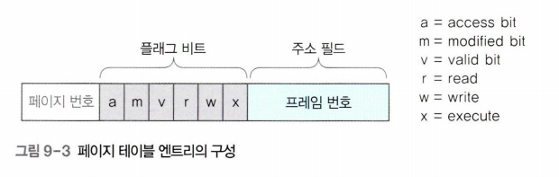

 

### 페이지 부재(page fault)
- 프로세스가 페이지를 요청했을 때 해당 페이지가 메모리에 없고 스왑 영역에 존재하여 해당 페이지가 메모리의 없는 상황을 메모리 부재(page fault)라고 함
- 가상 메모리의 테이지 테이블에는 페이지의 위치를 찾기 위해 유효 비트를 사용하는데 유효비트가 0이라면 메모리에 존재하고 1일 경우 스왑 영역에 존재. 주소 필드에 해당 위치들이 저장됨 
- 페이지 부재가 발생하면 프로세스가 해당 페이지를 사용할 수 있도록 스왑영역에서 물리 메모리로 옮겨야 함
- 해당 상황에서 스왑인, 스왑 아웃을 통해 스왑 영역으로 가져오거나 내보내는 것을 결정하는 알고리즘을 페이지 교체 알고리즘(page replacement algorithm)이라고 하며 페이지 교체 알고리즘에 의해 스왑 영역으로 보낼 페이지를 대상 페이지(victim page)라고 함
    - 메모리가 비어있다면 스왑인을 통해 페이지를 바로 가져오면 되지만 메모리가 꽉 차있다면 메모리 내의 페이지를 스왑아웃을 통해 내보내고 스왑인을 진행해야 한다
- 페이지를 교체하였을 경우 PTE에도 업데이트가 필요하며 진행 사항은 아래의 사진과 같음

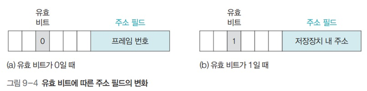

 

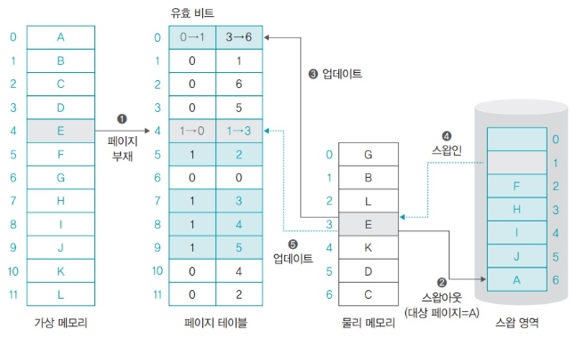

 

### 지역성(locality)
- 메모리가 꽉 차서 어떤 페이지를 스왑 영역으로 보낼 경우 앞으로 사용하지 않을 페이지를 쫓아내는 것이 좋은데 페이지 교체 알고리즘이 쫓아낼 페이지를 찾을 때 지역성(locality)를 바탕으로 함
- 지역성은 공간의 지역성, 시간의 지역성, 순차적 지역성으로 구성되며 많은 곳에서 사용됨. 주로 캐시가 지역성 이론을 대표하는 대표적인 장치로 캐시 적중률을 높이기 위해 사용
- 공간의 지역성 : 현재 위치에서 가까운 데이터에 접근할 확률이 먼 거리에 있는 데이터에 접근할 확률보다 높다는 것
- 시간의 지역성 : 현재를 기준으로 가장 가까운 시간에 접근한 데이터가 더 먼 시간에 접근한 데이터보다 사용될 확률이 높다는 것
- 순차적 지역성 : 여러 작업이 순서대로 진행되는 경향이 있다는 것을 의미. 순차적 지역성을 공간의 지역성의 특별한 경우로 보고 해당 지역성을 사용하지 않는 경우도 많음

 

## 2. 페이지 교체 알고리즘(page replacement algorithm)
- 페이지 부재가 발생했을 경우 메모리의 페이지를 스왑 영역으로 내보낼 때 스왑영역으로 보낼 페이지를 결정하는 알고리즘
- 페이지 교체 알고리즘의 성능 평가 기준은 페이지를 요청한 후 실제로 작업에 들어갈 때까지의 평균 대기 시간을 측정하거나 페이지 부재 횟수를 체크, 전체 작업에 걸리는 시간을 비교할 수 있으나 해당 책에서는 페이지 부재 횟수와 페이지 성공 횟수로 비교하였음
- 페이지 교체 알고리즘은 성능 뿐 아니라 유지 비용도 고려해야함. 성능이 뛰어나더라도 계산이 많이 필요하거나 메모리를 많이 차지한다면 좋은 알고리즘이 아님
- 페이지 교체 알고리즘의 종류는 다음과 같음

 

|종류|알고리즘|특징|
|:---:|:---:|:---------:|
|간단한 알고리즘|무작위|무작위로 대상 페이지를 선정하여 스왑 영역으로 보냄|
|간단한 알고리즘|FIFO|처음 메모리에 올라온 페이지를 스왑 영역으로 보냄|
|이론적 알고리즘|최적|미래의 접근 패턴을 보고 대상 페이지를 선정하여 스왑영역으로 보냄|
|최적 근접 알고리즘|LRU|시간적으로 멀리 떨어진 페이지를 스왑 영역으로 보냄|
|최적 근접 알고리즘|LFU|사용 빈도가 적은 페이지를 스왑 영역으로 보냄|
|최적 근접 알고리즘|NUR|최근에 사용한 적이 없는 페이지를 스왑 영역으로 보냄|
|최적 근접 알고리즘|FIFO변형|FIFO 알고리즘을 변형하여 성능을 높임|

 

### 무작위 페이지 교체 알고리즘(random page replacement algorithm)
- 페이지 교체 알고리즘 중 가장 간단한 구현 방식으로 쫓아낼 대상 페이지를 특별한 로직 없이 무작위로 선정
- 지역성을 전혀 고려하지 않아 알고리즘의 성능이 좋지 않아 거의 사용되지 않음

 

### FIFO 페이지 교체 알고리즘(First In First page replacement algorithm)
- 시간상으로 메모리에 가장 먼저 들어온 페이지를 대상 페이지로 선정하여 스왑 영역으로 쫓아냄
- FIFO 페이지 교체 알고리즘은 큐로 구현하여 메모리의 맨 위의 있는 페이지는 가장 오래된 페이지이고 새로운 페이지는 항상 맨 아래에 삽입되고 나머지 페이지들이 위쪽으로 이동하며 새로운 페이지가 아래쪽의 남은 공간에 들어옴
- 시간의 지역성을 고려하였으나 자주 사용되는 페이지가 스왑 영역으로 옮겨지기도 하여 성능이 떨어짐

 

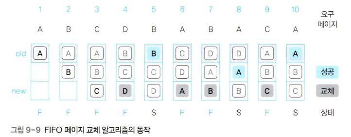

 

### 최적 페이지 교체 알고리즘(optimal page replacement algorithm)
- 앞으로 사용하지 않을 페이지를 스왑영역으로 옮김. 페이지 교체 선정 시점부터 가장 멀리 있는 페이지를 대상 페이지로 선정
- 해당 알고리즘은 미래의 메모리 접근 패턴을 보고 대상 페이지를 결정하기 때문에 성능이 가장 좋으나 미래의 접근 패턴을 안다는 것이 불가능하여 실제로 구현할 수 없음
- 그렇기 때문에 최적 페이지 알고리즘보다 미래의 접근 패턴을 추정하는 최적 근접 알고리즘을 주로 사용한다

 

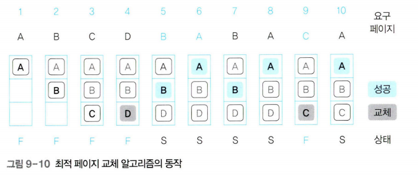

 

### LRU 페이지 교체 알고리즘(Least Recently page replacement algorithm)
- 최근 최소 사용 페이지 교체 알고리즘으로도 불리며 메모리에 올라온 후 가장 오랫동안 사용되지 않은 페이지를 스왑 영역으로 옮김
- 가장 오래된 페이지를 대상 페이지로 선정하는데 카운터나 참조 비트를 이용하는 방법으로 구현한다
- 주의할 점은 메모리 접근 패턴을 변경하면 FIFO 만큼 느려지기도 하고 최적 페이지 만큼 좋아지기도 함
- 페이지 접근 시간을 기록하여 구현할 수도 있지만 카운터를 사용하여 구현할 수 있음. 그러나 두 방법 모두 추가적인 메모리 공간을 사용하여 많은 비트를 사용해야 함
- 참조 비트 시프트(reference bit shift)방식은 각 페이지에 일정 크기의 참조 비트를 만들어 접근할 때마다 1로 바꾸고 주기적으로 오른쪽으로 한칸씩 shift 함. 1B긴 하지만 여전히 작지 않은 공간을 사용하여 공간을 낭비할 수 있음
- 자주 사용되던 페이지가 최근에 실행되지 않아 나갈 수도 있음

 

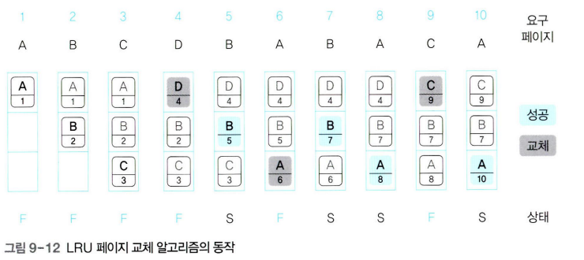

 

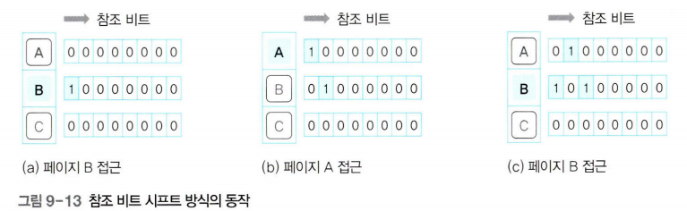

 

### LFU 페이지 교체 알고리즘(Least Frequently Used page replacement algorithm)
- 최소 빈도 사용 알고리즘이라고도 하며 페이지가 몇 번 사용되었는지를 기준으로 대상 페이지를 선정
- 사용 빈도를 통해 대상 페이지를 선정하며 LRU, LFU 페이지 교체 알고리즘은 둘다 FIFO 보다 성능이 우수
- LRU와 마찬가지로 페이지 접근 횟수(빈도)를 표시하는데 추가 공간이 필요하므로 메모리가 낭비됨
- 가장 최근에 들어온 페이지가 나갈 수도 있음

 

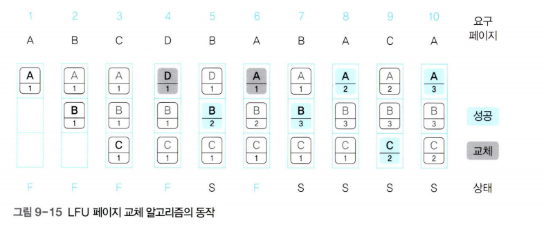

 

### NUR 페이지 교체 알고리즘(Not Used page replacement algorithm)
- LRU, LFU 페이지 교체 알고리즘과 성능이 거의 비슷하면서도 불필요한 공간 낭비를 해결한 알고리즘으로 최근 미사용 페이지 교체 알고리즘이라고도 불림
- 접근한 페이지 횟수가 크게 차이나지 않으면 정확한 값을 측정할 필요가 없어 추가 비트를 2개만 사용하여 미래를 추정하는 방법
- NUR 페이지 교체 알고리즘에서는 페이지마다 참조 비트와 변경 비트를 가지므로 페이지마다 추가되는 메모리 공간이 2비트 뿐임
- 참조 비트는 PTE의 접근 비트를, 변경 비트는 PTE의 변경 비트를 가리킴. 초기값은 0이며 다음과 같은 경우 1이됨
    - 참조 비트 : 페이지에 접근하면 1이 됨
    - 변경 비트 : 페이지가 변경되면 1이 됨
- 모든 페이지의 초기 상태는 (0,0)이며 접근이 발생하면 (1,0), 변경이 발생하면 (0,1), 둘다 발생하면 (1,1)이 됨
- 우선 참조 비트가 0인 비트가 대상 페이지로 선정되고 이후 변경 비트가 0인 비트가 대상 페이지로 선정됨 (참조 비트 우선 확인 -> 이후 대상 비트 확인)
- 흔한 경우는 아니지만 모든 페이지의 비트가 (1,1)이라면 모든 페이지 비트를 (0,0)로 초기화 함
- 다른 알고리즘과 유사한 성능을 내고 쉽게 구현되며 2bit만 추가되어 가장 많이 사용되고 있음

 

 

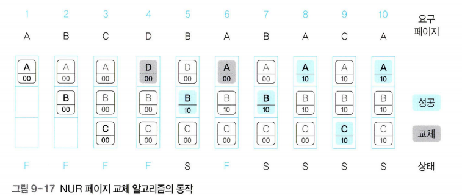

 

### FIFO 변형 알고리즘
- 메모리에 올라온 순서만 고려하고 자주 사용하는 페이지를 고려하지 않은 FIFO를 변형한 방법으로 2차 기회 페이지 알고리즘과 시계 알고리즘이 존재

 

#### 2차 기회 페이지 교체 알고리즘(second chance FIFO replacement algorithm)
- FIFO와 동일하게 큐를 사용하지만 특정 페이지에 접근하여 페이지 부재 없이 성공할 경우 해당 페이지를 큐의 맨 뒤로 이동하여 대상 페이지에서 제외. 즉 성공한 페이지를 큐 맨 뒤로 옮김으로 기회를 한번 더 주는 알고리즘
    - FIFO의 경우 페이지 교체 성공이어도 큐의 위치를 변경하지 않으나 해당 알고리즘은 다시 큐에 삽입
- 그러나 위의 알고리즘보다 성능이 약간 낮고 큐를 유지하는데 비용이 들고 페이지가 성공했을 때 값을 이동시키는 작업이 추가되는 것이 단점

 

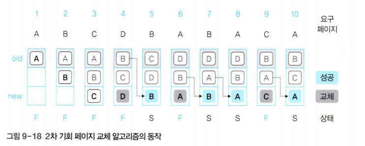

 

#### 시계 알고리즘(clock algorithm)
- 2차 기회 페이지 교체 알고리즘과 유사한데 원형 큐를 사용하는 것이 가장 큰 차이점
- 대상 페이지를 가르키는 포인터를 사용하고 해당 포인터가 시계 방향으로 돌기 때문에 시계 알고리즘이라 불림
- 참조 비트를 사용하고 포인터가 돌면서 대상 페이지를 가르키는데 메모리에 있는 페이지를 성공적으로 참조하면 초기값 0에서 1로 변경하고 1이라면 대상 포인트를 포인터가 가르켜도 0으로 바꿔놓고 다음 페이지로 포인터를 가르킨다
- 각 페이지당 참조 비트를 하나만 추가하면 되지만 알고리즘이 복잡하고 계산량이 많다는 것이 단점

 

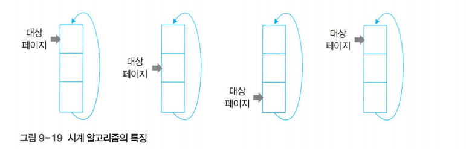

 

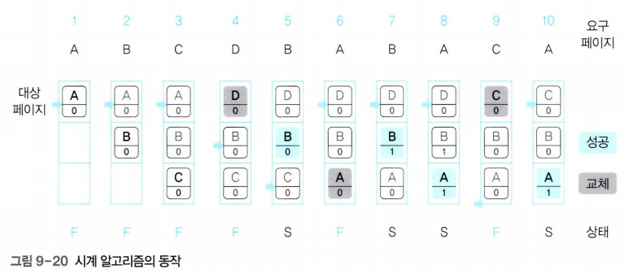

 

## 3. 스레싱과 프레임 할당
- 메모리가 꽉 차고나서 스왑 영역으로 옮기는 횟수가 잦아지면 속도가 느려지고 하드디스크의 입출력이 너무 많아져서 잦은 페이지 부재로 작업이 멈춘 것 같은 상태를 스레싱(threshing)이라고 함
- 물리 메모리가 크다면 프로세스를 더 많이 할당할 수 있기 때문에 성능이 좋아짐
- 스레싱은 크기가 메모리의 크기가 일정할 경우 멀티 프로그램 수와 밀접한 관계가 있으며 동시에 실행하는 프로그램의 수를 멀티프로그래밍 정도(degree of multiprogramming)이라 하며 멀티프로그래밍 정도가 너무 높으면 스레싱 발생
- 스레싱이 발생하여 CPU거가 작업할 수 없는 상태에 이르게되는데 이러한 시점을 스레싱 발생 지점(threshing point)라고 함
- 물리 메모리를 늘리면 작업속도가 빨라지지만 충분히 늘렸다면 그 이상 늘려도 작업속도에 영향을 끼치지 않음

 

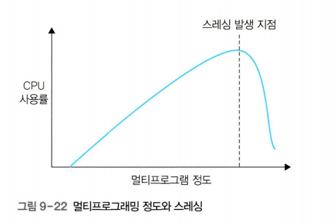

 

### 스레싱 프레임 할당
- 스레싱은 각 프로세스에 프레임을 할당하는 문제와도 연관됨
- 실행 중인 여러 프로세스에 프레임을 얼마나 나누어주느냐에 따라 시스템의 성능이 달라짐
- 어떤 프로세스에 너무 적은 프레임을 할당하면 페이지 부재가 빈번히 일어나고, 너무 많은 프레임을 할당하면 메모리를 낭비해 시스템의 성능이 낮아짐
- 이러한 프레임 할당하는 방식은 크게 정적할당과 동적 할당이 있음

 

### 정적 할당(static allocation)
- 프로세스 실행 초기에 프레임을 나누어준 후 그 크기를 고정하는 것으로 균등 할당 방식과 비례 할당 방식이 있음

 

#### 균등 할당(equal allocation)
- 프로세스의 크기와 상관없이 사용 가능한 프레임을 모든 프로세스에 동일하게 할당
- 그러나 프로세스마다 사용하는 프레임이 달라 페이지 부재가 빈번하거나 성능이 감소 될 수 있음

 

### 비례 할당(proportional allocation)
- 프로세스의 크기에 비례하여 프레임을 할당하는 방식
- 비율에 따라 6, 3, 9개의 프레임이 필요하고 12개의 프레임이 있다면 비율에 따라 4, 2, 6개의 프레임을 할당하는 방법
- 그러나 프로세스 실행 중 필요로 하는 프레임을 유동적으로 반영하지 못하여 프로그램 크기가 작아도 동영상 같이 더 큰 메모리를 필요로 할경우 유동적으로 반영하지 못함
- 또한 사용하지 않을 메모리를 처음부터 미리 확보하여 공간을 낭비함. 요구 페이징 방식에서는 아무리 큰 프로세스라도 처음부터 메모리에 모두 올리지 않는데 당장 필요없는 프레임을 미리 할당해놓기 때문에 메모리가 낭비됨

 

### 동적 할당(dynamic allocation)
- 프로세스 실행 중에 변하는 요청을 수용하기 위해 동적으로 할당하는 방법
- 작업집합 모델을 사용하는 방식과 페이지 부재 빈도를 사용하는 방법이 있음

 

#### 작업집합 모델(work set model)
- 지역성 이론을 바탕으로 하며 가장 최근에 접근한 프레임이 이후에도 또 참조될 가능성이 높다는 가정에서 출발
- 최근 일정 시간동안 참조된 페이지들을 집합으로 만들고 해당 집합에 있는 페이지들을 물리 메모리에 유지하여 프레세스의 실행을 도움
- 작업 집합 모델에서 메모리에 유지할 페이지의 크기를 작업집합 크기라고 하며 작업 집합에 포함되는 페이지 범위를 작업집합 윈도우 라고함
- 하지만 충분한 페이지를 할당하지 않으면 메모리에 유지하기 힘들고 어떤 프레임을 물리 메모리에 유지해야 하는지는 알 수 있지만 프로세스에 프레임을 얼마나 할당해야 하는지 알 수 없어 스레싱 문제를 해결하지 못한다

 

#### 페이지 부재 빈도(page fault frequency)
- 페이지 부재 횟수를 기록하여 비율을 계산하고 페이지 푸채 비율의 상항선과 하한선을 설정하고 상한선을 초과하면 할당한 프레임이 적다는 것을 의미하고 하한선 밑으로 내려가면 메모리가 낭비된다는 의미로 할당한 프레임을 회수함
- 프로세스가 처음 실행 될때는 예측이 어려우므로 프로세스를 실행하면서 적정 페이지 할당량을 조절한다

 

### 연습 문제

1. 다음과 같이 주어져있을 경우 시계 알고리즘 정답을 단어와 숫자를 말해주세요

 

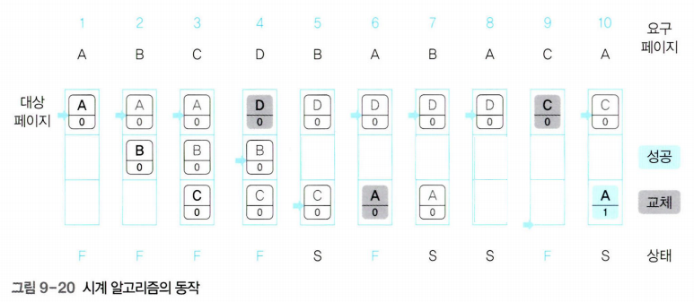

 

2. FIFO 페이지 교체 알고리즘과 2차 기회 페이지 교체 알고리즘의 공통점과 차이점
- 

 

3. 물리 메모리크기와 스레싱과의 관계 및 스레싱 해결 방안
- 
