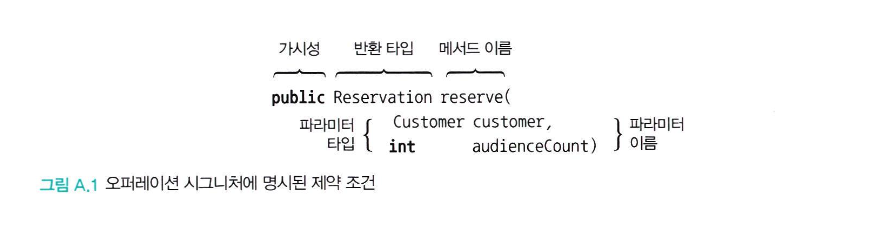
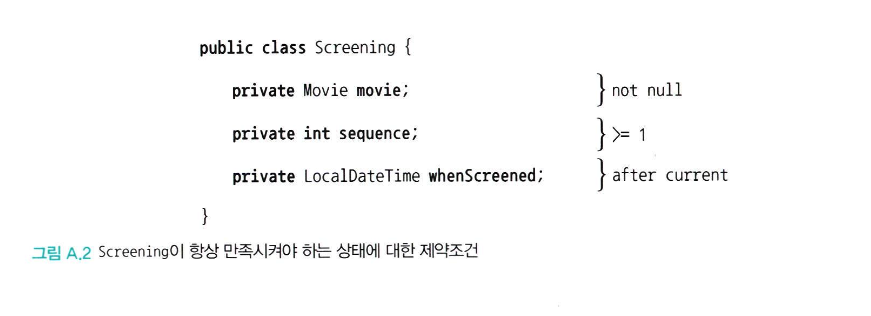

# 부록 A : 계약에 의한 설계

## 1. 협력과 계약

### 계약에 의한 설계가 나온 이유 (Design By Contract, DBC)
- 인터페이스만으로 명령으로 발생하는 부수효과를 명확하게 표현하기 한계가 있음
- 시그니처만으로는 구현체로 인한 부수효과를 알기 어려우며 이는 문서화만으로는 한계가 존재
    - 간단한 메서드 구현이라면 직접 확인이 쉬우나 구현이 복잡하고 부수효과를 가진 다수의 메서드를 호출하는 경우 코드 분석을 통한 실행 결과 예측이 어려움
- 인터페이스만으로는 객체의 행동에 관한 다양한 관점을 전달하기 어려워 이 시점에서는 **계약에 의한 설계** 에 대해 생각해볼 수 있음
- 계약의 의한 설계란 소프트웨어 설계 방법 중 하나로 **명확한 계약(Contract)** 를 통해 코드의 안전성과 명확성을 높이는 방법
- 이 개념의 핵심은 소프트웨어 구성 요소(클래스, 메서드) 간의 계약을 명확히 정의하는 것
    - 계약 당사자는 계약으로부터 이익을 기대하고 이익을 얻기 위해 의무를 이행
    - 계약 당사자의 이익과 의무는 계약서에 문서화함
    - 대강 하청 업체가 돈을 받기위해 의무를 다한다 생각하면 편할 듯함
- 이 약속은 메서드가 호출되기 전 반드시 지켜야 하는 조건(전제 조건), 메서드가 끝난 후 보장해야하는 조건(사후조건), 클래스 인스턴스가 항상 유지해야하는 불변 조건(불변식) 으로 구성됨

<br>

### Code Contracts
- .NET Framework 에서 지원되는 라이브러리로 현재는 공식 지원이 중단되었고, Data Annotations 및 Guard Clauses 사용이 권장됨
- 그러나 해당 책에서는 해당 예시를 통해 제약 조건을 명시적으로 표현하기 위한 방법으로 Code Contracts를 사용
- 우선 다시 계약이란 이익과 의무를 가지며 계약을 문서화해야하며 한쪽의 의무가 반대쪽의 권리가 됨
    - 인테리어 전문가를 빗대어 설명하는데 인테리어 전문가가 계약을 이행하는 구체적인 방식에 대해 간섭하지는 않지만 리모델링 결과가 만족스럽다면 해당 계약이 정상적으로 이행한 것으로 간주 가능
- 이에 대해 Code Contracts는 다음과 같이 조건을 구성함
    - 자바의 경우는 주로 AssertJ로 전제조건 및 사후조건 테스트, @Validated 로 간단한 전제조건 검증(주로 입력값), Guava 를 사용한 전제 조건을 명시하여 사용하고 사후조건이나 불변식은 직접 구현 등으로 사용

|메서드|설명|
|:---:|:---:|
|Contract.Requires(bool condition)|메서드의 전제조건을 명시|
|Contract.Ensures(bool condition)|메서드의 사후조건을 명시|
|Contract.Invariant(bool condition)|클래스의 불변식을 명시|
|Contract.Assert(bool condition)|디버그용 단언문으로 런타임에 확인|
|Contract.Assume(bool condition)|컴파일러에게 힌트를 제공하여 정적 분석기를 돕기 위해 사용|

<br>

### 계약에 의한 설계를 지원하는 자바 라이브러리 비교

| **라이브러리**         | **전제조건 (Precondition)** | **사후조건 (Postcondition)** | **불변식 (Invariant)** | **주요 사용 위치**       | **예외 종류**             | **특징**                       |
|----------------------|---------------------------|-----------------------------|-----------------------|------------------------|--------------------------|---------------------------------|
| **Spring JSR 380**    | ✅ 어노테이션으로 지원       | ❌ 직접 구현 필요             | ❌ 직접 구현 필요       | Controller, Service    | ConstraintViolationException | **Spring의 필수 유효성 검증 방식** |
| **Guava (Preconditions)**| ✅ 명확하고 직관적        | ❌ 직접 구현 필요             | ❌ 직접 구현 필요       | Service, DAO          | IllegalArgumentException    | **가장 많이 사용되는 조건 검증**  |
| **Apache Commons Validate**| ✅ 간단한 조건 검증      | ❌ 직접 구현 필요             | ❌ 직접 구현 필요       | Service, DAO          | IllegalArgumentException    | **가벼운 유틸리티, Guava 대안**   |
| **Lombok (@NonNull)**  | ✅ null 검증만 가능         | ❌ 불가능                     | ❌ 불가능               | Service, Controller   | NullPointerException       | **간단한 null 체크용 어노테이션** |
| **AssertJ**            | ✅ 테스트 전용 조건 검증     | ✅ 사후조건 테스트 가능       | ✅ 불변식 테스트 가능   | 테스트 코드           | AssertionError            | **테스트 코드에서만 사용**       |

<br>

## 2. 계약에 의한 설계

### 계약에 의한 설계
- 버트란드 마이어가 제시한 계약의 개념은 사람들의 계약과 유사하며 계약은 협력에 참여하는 두 객체 사이의 의무와 이익을 문서화한 것
    - 협력에 참여한느 각 객체는 계약으로부터 이익을 기대하고 이익을 얻기위해 의무를 의행
    - 협력에 참여하는 각 객체의 이익과 의무는 객체의 인터페이스 상에 문서화 됨
- 계약에 의한 설계 개념은 "인터페이스에 대해 프로그래밍하라"는 원칙을 확장한 것으로 오퍼레이션의 시그니처를 구성하는 다양한 요소들을 이용해 협력에 참여하는 객체들이 지켜야하는 제약조건을 명시할 수 있음



- 의도를 드러내는 인터페이스를 만들면 오퍼레이션의 시그니처 만으로도 어느정도 까지는 클라이언트와 서버가 협력을 위해 수행해야하는 제약조건을 명시할 수 있음
- 계약은 여기서 추가적으로 협력하는 클라이언트는 정상적인 상태를 가진 객체와 협력해야하므로 조건을 만족해야한다



- 서버는 자신이 처리할 수 있는 범위의 값들을 클라이언트가 전달할 것이라 기대하고 클라이언트는 자신이 원하는 값을 서버가 반환할 것이라고 예상, 또한 클라이언트는 메시지 전송 전과 후의 서버의 상태가 정상일 것이라고 기대
- 이 세가지 기대가 계약에 의한 설계를 구성하는 세 가지 요소에 대응하게 됨. 이 요소들은 각각 사전조건, 사후조건, 불변식이라고 부름
- 이러한 세가지 요소는 실행 절차를 기술할 필요없이 상태 변경만을 명시하기 때문에 코드를 이해하고 분석하기 쉬워짐

<br>

### 사전조건 (precondition)
- 메서드가 호출되기 위해 만족돼야 하는 조건으로 메서드의 요구사항을 명시함
- 사전조건이 만족되지 않을 경우 메서드가 실행돼서는 안 되며 사전조건을 만족시키는 것은 메서드를 실행하는 클라이언트의 의무
    - 사전 조건을 만족하지 못해서 메서드가 실행되지 않을 경우 클라이언트에 버그가 있다는 것을 의미하며 사전조건이 만족되지 않으면 서버는 메서드를 실행할 의무가 없음

```c#
public Reservation Reserve(Customer customer, int audienceCount)
{
    Contract.Requires(customer != null); // 전제조건 1: customer 인스턴스는 null이 아니어야 한다
    Contract.Requires(audienceCount >= 1); // 전제조건 2: audienceCount는 1 이상이어야 한다

     // 새로운 Reservation 객체를 생성하여 반환 (고객 정보, 예약 정보, 요금 계산 결과, 인원 수 포함)
    return new Reservation(customer, this, calculateFee(audienceCount), audienceCount);
}
```

<br>

```java
// dto
@Getter
@AllArgsConstructor
public class DepositRequest {
    @NotNull(message = "Account ID cannot be null")
    private Long accountId;

    @Min(value = 1, message = "Amount must be at least 1")
    private int amount;
}

// controller
@RestController
public class BankAccountController {
    @PostMapping("/deposit")
    public String deposit(@RequestBody @Validated DepositRequest request) {
        // 전제조건을 만족한 경우에만 메서드가 호출
        return "Successfully deposited " + request.getAmount() + " to account " + request.getAccountId();
    }
}
```

<br>

### 사후조건 (postcondition)
- 메서드가 실행된 후에 만족돼야 하는 조건으로 클라이언트가 사전조건을 만족시켰다면 메서드는 사후에 명시된 조건을 만족시켜야 함
    - 사후 조건은 메서드의 실행 결과가 올바른지를 검사하고 실행 후에 객체가 유효한 상태로 남아있는지를 검증
    - 자바에서 사후조건을 직접적으로 코드에 명시적으로 작성하는 방법은 따로 없어 직접 구현하거나 테스트 코드를 통해 사실상 사후조건을 검증하는 역할을 함
- 만약 클라이언트가 사전조건을 만족시켰는데도 사후조건을 만족시키지 못한 경우에는 클라이언트에게 예외를 던져야 함
- 사후조건을 만족시키는 것은 서버의 의무이며 주로 다음과 같은 세 가지 용도로 사용됨
    - 인스턴스 변수의 상태가 올바른지 서술하기 위해
    - 메서드에 전달된 파라미터의 값이 올바르게 변경됬는지 서술하기 위해
    - 반환값이 올바른지를 서술하기 위해
- 또한 다음과 같은 이유로 사전조건보다 사후조건을 정의하는 것이 어려울 수 있음
    - 한 메서드 안에 return 문이 여러번 나올 경우 : 모든 return 마다 검증하는 코드를 추가해야하나 계약에 의한 설계를 지원하는 라이브러리는 대부분 사후조건을 한번만 기술할 수 있게 함
    - 실행 전과 실행 후의 값을 비교해야 하는 경우 : 실행 전의 값이 메서드 실행으로 다른 값으로 변경됬을 수 있기 때문에 두 값을 비교하기 어려울 수 있음

```c#
public Reservation Reserve(Customer customer, int audienceCount)
{
    Contract.Requires(customer != null); // 전제조건 1: customer 인스턴스는 null이 아니어야 한다
    Contract.Requires(audienceCount >= 1); // 전제조건 2: audienceCount는 1 이상이어야 한다

    // 사후조건: 메서드의 반환값(Reservation 객체)은 null이 아니어야 하고 메서드가 정상적으로 완료됬다면 반드시 Reservation 객체를 반환해야 함
    Contract.Ensures(Contract.Result<Reservation>() != null);   

     // 새로운 Reservation 객체를 생성하여 반환 (고객 정보, 예약 정보, 요금 계산 결과, 인원 수 포함)
    return new Reservation(customer, this, calculateFee(audienceCount), audienceCount);
}
```

<br>

```java
public class BankAccount {
    private int balance;

    public BankAccount(int initialBalance) {
        if (initialBalance < 0) {
            throw new IllegalArgumentException("Initial balance must be non-negative");
        }
        this.balance = initialBalance;
    }

    public void deposit(int amount) {
        // 사전조건 검증
        if (amount <= 0) {
            throw new IllegalArgumentException("Deposit amount must be positive");
        }
        
        // 메서드 동작
        int oldBalance = this.balance;
        this.balance += amount;

        // 사후조건 검증: 잔액이 이전 잔액보다 반드시 커야 한다.
        if (this.balance <= oldBalance) {
            throw new IllegalStateException("Postcondition failed: balance should have increased");
        }
    }
}
```

<br>

### 불변식 (invariant)
- 항상 참이라고 보장되는 서버의 조건으로 사전조건과 사후조건은 각 메서드마다 달라지는데 반해 불변식은 인스턴스 생명주기 전반에 걸쳐 지켜져야 하는 규칙을 명세
- 불변식은 다음과 같은 두가지 특성을 가짐
    - 불변식은 클래스의 모든 인스턴스가 생성된 후에 만족해야 함. 이것은 클래스에 정의된 모든 생성자는 불변식을 준수해야 한다는 것을 의미
    - 메서드가 실행되는 도중에는 불변식을 만족시키지 못할 수도 있지만 메서드를 실행하기 전이나 종료된 후에 불변식은 항상 참이어야 함
- 불변식은 객체의 일관성을 유지하기 위해서는 생성자 실행 후, 메서드 실행 전, 메서드 실행 후에 호출돼야 함. 이를 통해 객체의 생애주기 동안 항상 유지됨

```c#
public class Screening
{
    private Movie movie;
    private int sequence;
    private DateTime whenScreened;

    [ContractInvariantMethod]
    private void Invariant() {
        Contract.Invariant(movie != null);
        Contract.Invariant(sequence >= 1);
        Contract.Invariant(whenScreened > DateTime.Now);
    }
}
```

<br>

```java
public class BankAccount {
    private int balance;

    public BankAccount(int initialBalance) {
        // 사전조건: 초기 잔액은 음수가 될 수 없음
        if (initialBalance < 0) {
            throw new IllegalArgumentException("Initial balance must be non-negative");
        }
        this.balance = initialBalance;

        // 불변식 검증 (생성자 실행 후 1회만 호출)
        assertInvariant();
    }

    public void deposit(int amount) {
        // 사전조건: 입금할 금액은 0보다 커야 함
        if (amount <= 0) {
            throw new IllegalArgumentException("Deposit amount must be positive");
        }

        // 메서드 실행 전 불변식 검증
        assertInvariant();
        
        // 메서드의 동작
        this.balance += amount;

        // 메서드 실행 후 불변식 검증
        assertInvariant();
    }

    // 불변식 검증 메서드
    private void assertInvariant() {
        if (balance < 0) {
            throw new IllegalStateException("Invariant failed: balance must be non-negative");
        }
    }

    public int getBalance() {
        return balance;
    }
}
```

<br>

## 3. 계약에 의한 설계와 서브타이핑
- 계약에 의한 설계와 리스코프 치환 원칙이 만나는 지점으로 사전조건과 사후조건이 있음
- 리스코프 치환 원칙은 슈퍼타입의 인스턴스와 협력하는 클라이언트의 관점에서 서브타입의 인스턴스가 슈퍼타입을 대체하더라도 협력에 지장이 없어야 한다는 것을 의미
- 즉, 서브타입이 리스코프 치환 원칙을 만족시키기 위해서는 클라이언트와 슈퍼타입 간에 체결된 계약을 준수해야 함
- 리스코프 치환 원칙의 규칙을 두 가지 종류로 세분화할 때 첫 번째 규칙은 계약 규칙이고, 두 번째 규칙은 가변성 규칙임

<br>

### 계약 규칙 (contract rules)
- 계약 규칙은 슈퍼타입과 서브 타입 사이의 사전조건, 사후조건, 불변식에 대해 서술할 수 있는 제약에 관한 규칙
- 서브타입이 슈퍼타입을 상속할 때 계약의 일관성을 유지하기 위해 준수해야 하는 규칙으로 이 규칙이 깨지면 리스코프 치환 원칙이 위반되어 다형성이 제대로 작동하지 않을 수 있음
- 해당 규칙은 다음과 같음
    - 서브타입에 더 강력한 사전조건을 정의할 수 없음
    - 서브타입에 더 완화된 사후조건을 정의할 수 없음
    - 슈퍼타입의 불변식은 서브타입에서도 반드시 유지돼야 함

<br>

### 가변성 규칙 (variance rules)
- 가변성 규칙은 파라미터와 리턴 타입의 변형과 관련된 규칙
- 서브 타입의 메서드와 슈퍼타입의 메서드 간에 반환 타입, 매개변수, 예외의 변화와 관련된 규칙
- 해당 규칙은 다음과 같음
    - 서브타입의 메서드 파라미터는 반공변성을 가져야 함
    - 서브타입의 리턴 타입은 공변성을 가져야 함
    - 서브타입은 슈퍼타입이 발생시키는 예외와 다른 타입의 예외를 발생시켜서는 안됨

```
공변성 (Convariance) 
- 리턴 타입의 타입을 더 구체적인 서브타입으로 변경할 수 있는 성질
- 서브 타입이 슈퍼타입의 리턴 타입보다 더 구체적인 타입을 반환할 수 있음

반공변성 (Contravariance)
- 매개변수의 타입을 더 일반적인 슈퍼타입으로 변경할 수 있다는 성질
- 서브타입이 슈퍼타입의 매개변수보다 더 넓은 타입을 받을 수 있도록 허용하는 것
```