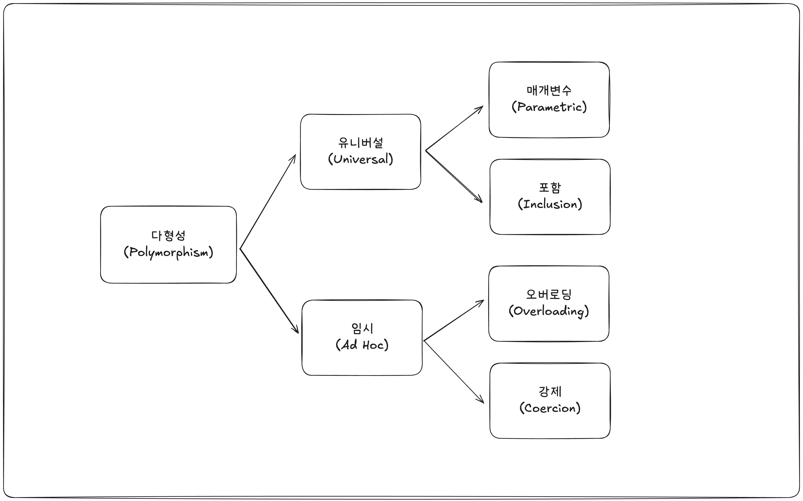
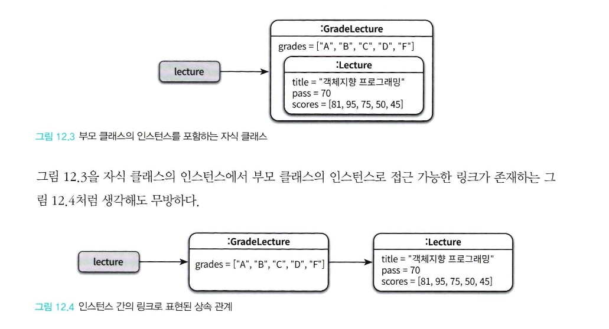
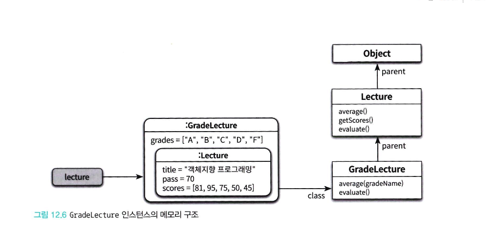
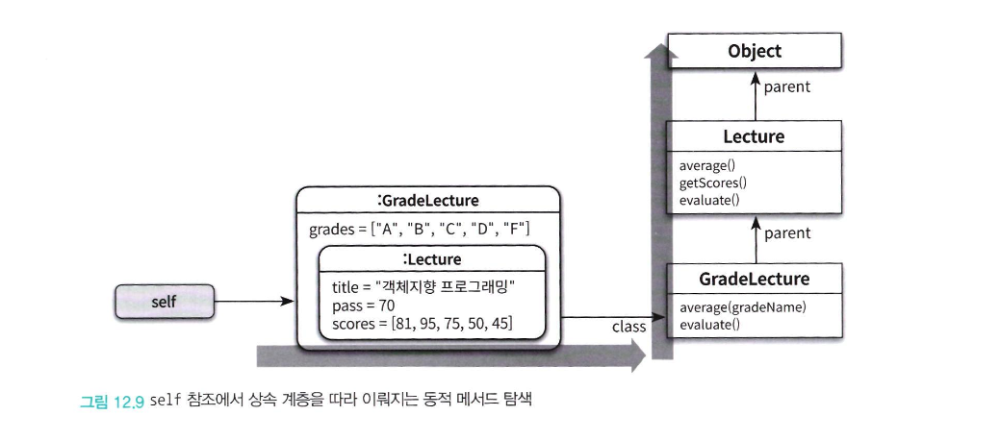

# CHAPTER12. 다형성



## 1. 다형성 (Polymorphism)
- 다형성(Polymorphism)이라는 단어는 그리스어에서 '많은'을 의미하는 'poly'와 '형태'를 의미하는 'morph'의 합성어로 '많은 형태를 가질 수 있는 능력'을 의미
- 상속을 사용하려는 이유가 단지 코드를 재사용하기 위해서라면 좋은 방법이 아님
    - 상속이 객체지향 패러다임 초기에는 타입 계층과 다형성을 구현할 수 있는 거의 유일한 방법이었으나 현재는 아님
- 클라이언트 관점에서 인스턴스들을 동일하게 행동하는 그룹으로 묶기 위해서 상속을 사용하는 것이 좋음
    - 런타임 시점에서 메시지를 처리하기 적합한 메서드를 동적으로 탐색하기 위함
- 객체지향 프로그래밍에서 사용되는 다형성은 다음과 같이 유니버설(Universal) 다형성과 임시(Ad Hoc) 다형성으로 분류할 수 있음
    - 유니버설 다형성 : 여러 타입에 대해 동일한 방식으로 동작할 수 있는 다형성으로 범용적으로 사용이 가능
    - 임시 다형성 : 특정 타입에만 국한되어 동작하는 다형성으로 일반적으로 구체적인 구현이 필요
    - 즉, 정리하면 컴파일 시점의 코드를 고정적으로 실행하는 것이 임시 다형성, 런타임 시점에 유연하게 동적으로 실행하는 것이 유니버설 다형성으로 동작하는 시점과 유연성에서 차이가 있음
- 유니버설 다형성은 매개변수 다형성과 포함 다형성으로 분류됨
    - 매개변수 다형성 : 제네릭 프로그래밍과 관련이 높은데 클래스의 인스턴스 변수나 메서드의 매개변수 타입을 임의의 타입으로 선언한 후 사용하는 시점에 구체적인 타칩으로 지정하는 방식
    - 포함 다형성 : 메시지가 동일하더라도 수신한 객체의 타입에 따라 실제로 수행되는 행동이 달라지는 능력을 의미하며 서브타입(Subtype) 다형성이라고도 부름. 가장 널리 알려진 형태의 다형성으로 특별한 언급이 없으면 다형성은 포함 다형성을 의미하는 것이 일반적
- 임시 다형성은 오버로딩 다형성과 강제 다형성으로 분류됨
    - 오버로딩 다형성 : 일반적으로 하나의 클래스 안에 동일한 이름의 메서드가 존재하는 경우
    - 강제 다형성 : 언어가 지원하는 자동적인 타입 변환이나 사용자가 직접 구현한 타입 변환을 이용해 동일한 연산자를 다양한 타입에 사용할 수 있는 방식
- 오버로딩 다형성과 강제 다형성을 함께 사용하면 실제로 어떤 메서드가 호출도리지 판단하기 어려워 모호해질 수 있음
- 포함 다형성을 구현하는 가장 일반적인 방법은 상속을 사용하는 것으로 두 클래스를 상속 관꼐로 연결하고 자식 클래스에서 부모 클래스의 메서드를 오버라이딩 한 후 클라이언트는 부모 클래스만 참조하면 포함 다형성을 구현할 수 있음
    - 그렇기에 서브타입 다형성이라고 부르며 상속 외에도 서브타입 관계를 만들 수 있는 다양한 방법이 존재
    - 또한 책에서는 이러한 포함 다형성 중심적으로 다룬다고 함

<br>

### 다형성 별 예시 코드
- 아래 코드는 생성자와 미사용 변수 등의 코드를 대부분 줄이고 할인 정책과 금액으로만 구현한 기본코드임

```java
// 할인 정책 인터페이스
interface DiscountPolicy {
    double calculateDiscountAmount(Movie movie);
}

// 금액 할인 정책
class AmountDiscountPolicy implements DiscountPolicy {
    private double discountAmount;

    @Override
    public double calculateDiscountAmount(Movie movie) {
        return discountAmount;
    }
}

// 퍼센트 할인 정책
class PercentDiscountPolicy implements DiscountPolicy {
    private double percent;

    @Override
    public double calculateDiscountAmount(Movie movie) {
        return movie.getFee() * percent;
    }
}

// 영화 클래스
class Movie {
    private double fee;
    private DiscountPolicy discountPolicy;

    public Movie(double fee, DiscountPolicy discountPolicy) {
        this.fee = fee;
        this.discountPolicy = discountPolicy;
    }

    public double calculateFinalFee() {
        return fee - discountPolicy.calculateDiscountAmount(this);
    }
}
```

<br>

### 1. 매개변수 다형성 예시
- 제네릭을 사용하여 다양한 타입으로 동작하는 다형성

```java
// 할인 정책 관리자 (제네릭 사용)
class DiscountManager<T extends DiscountPolicy> {
    private T policy;

    public double applyDiscount(Movie movie) {
        return policy.calculateDiscountAmount(movie);
    }
}

// 사용 예시
public static void main(String[] args) {
    DiscountManager<AmountDiscountPolicy> amountManager =
        new DiscountManager<>(new AmountDiscountPolicy(5000));
}
```

<br>

### 2. 포함 다형성 예시
- 인터페이스와 상속을 활용해 런타임 시점에 다른 정책을 적용하는 다형성
- 포함 다형성을 위해 상속을 사용하는 가장 큰 이유는 상속이 클래스들을 계층으로 쌓아올리고 상황에 따라 적절한 메서드를 선택할 수 있는 매커니즘을 제공하기 때문

```java
public static void main(String[] args) {
    // PercentDiscountPolicy를 적용
    Movie movie = new Movie(15000, new PercentDiscountPolicy(0.2));
    System.out.println("Movie Final Fee: " + movie.calculateFinalFee());
}
```

<br>

### 3. 오버로딩 다형성
- 같은 이름의 메서드로 다양한 매개변수를 처리하는 다형성

```java
class DiscountCalculator {
    // 금액 할인 계산
    public double calculate(Movie movie, AmountDiscountPolicy policy) {
        return movie.getFee() - policy.calculateDiscountAmount(movie);
    }

    // 퍼센트 할인 계산
    public double calculate(Movie movie, PercentDiscountPolicy policy) {
        return movie.getFee() - policy.calculateDiscountAmount(movie);
    }
}

// 사용 예시
public static void main(String[] args) {
    Movie movie = new Movie("Batman", 15000, null);

    DiscountCalculator calculator = new DiscountCalculator();
    System.out.println("Amount Discount: " + calculator.calculate(movie, new AmountDiscountPolicy(3000)));
    System.out.println("Percent Discount: " + calculator.calculate(movie, new PercentDiscountPolicy(0.15)));
}
```

<br>

### 4. 강제 다형성
- 타입 변환을 활용해 동일한 연산자나 메서드를 다른 타입에 적용

```java
// 금액 할인 정책
class AmountDiscountPolicy implements DiscountPolicy {
    private double discountAmount;

    // int 값을 받아 내부에서 double로 강제 변환
    public AmountDiscountPolicy(int discountAmount) {
        this.discountAmount = (double) discountAmount;
    }

    public AmountDiscountPolicy(double discountAmount) {    // 오버로딩 다형성
        this.discountAmount = discountAmount;
    }

    // ...
}

// 퍼센트 할인 정책
class PercentDiscountPolicy implements DiscountPolicy {
    private double percent;

    // int 값을 받아 내부에서 double로 강제 변환
    public PercentDiscountPolicy(int percent) {
        this.percent = (double) percent / 100; // 퍼센트 값을 0~1 사이로 변환
    }

    public PercentDiscountPolicy(double percent) {  // 오버로딩 다형성
        this.percent = percent / 100;
    }

    // ...
}

// 영화 클래스
class Movie {
    private double fee;
    private DiscountPolicy discountPolicy;

    // ...

    // int 값을 받아 내부에서 double로 강제 변환
    public Movie(String title, int fee, DiscountPolicy discountPolicy) {
        this.fee = (double) fee; // int -> double 변환
        this.discountPolicy = discountPolicy;
    }
}
```

<br>

## 2. 상속의 양면성
- 객체지향 패러다임의 근간을 이루는 아이디어는 데이터와 행동을 객체라고 불리는 하나의 실행단위 안으로 통합하는 것
    - 즉, 객체지향 프로그래밍을 작성하기 위해서는 항상 데이터와 행동이라는 두 가지 관점을 함께 고려해야 함
- 상속 역시 부모 클래스에서 정의한 모든 데이터를 자식 클래스의 인스턴스에 자동으로 포함시킬 수 있는데 이것은 데이터 관점의 상속임
- 또한 데이터 뿐만 아니라 부모 클래스에서 정의한 일부 메서드 역시 자동으로 자식 클래스에 포함시킬 수 있는데 이것은 행동 관점의 상속임
- 이러한 상속에서 단순히 부모 클래스에서 정의한 데이터와 행동을 자식에게 자동으로 공유할 수 있는 재사용 매커니즘으로 보일 수 있지만 이 관점은 상속을 오해한 것
- 상속의 목적은 재사용이 아니라 프로그램을 구성하는 개념들을 기반으로 다형성을 가능하게 하는 타입 계층을 구축하기 위한 것
- 고민 없이 재사용하기 위해 상속을 사용하면 이해하기 어렵고 유지보수 하기 어려운 코드가 만들어질 확률이 높음
- 이번 장에서 상속의 매커니즘을 이해하는데 필요한 개념은 다음과 같다고 함
    - 업캐스팅
    - 동적 메서드 탐색
    - 동적 바인딩
    - self 참조
    - super 참조

<br>

### 상속을 이용한 강의 평가
- 해당 책에서는 수강생의 강의를 Leture 객체로 만들고 과목명, 학생들의 성적, 통과 점수를 기록하고 반환함
    - 또한 해당 점수가 외부 클래스에 의해 변경되지 않도록 Collections.unmodifiableList를 통해 반환하고 있음
    - 주로 평균 점수 계산과 통계 정보 반환 등의 기능을 제공
- 해당 Leture 객체를 상속받아 학점 변수를 추가하고 이에 관련된 기능을 추가한 GradeLecture 을 구현
    - 해당 객체의 생성자는 부모 생성자도 상속받아 <code>super</code> 키워드를 사용하였는데 해당 키워드는 자식클래스 내부에서 부모 클래스의 인스턴스 변수나 메서드에 접근하는데 사용
- GradeLecture의 메서드 중 evaluate()의 경우 학점을 추가하여 반환하고 있는데 이를 위해 <code>@Override</code> 키워드를 사용
    - 부모클래스와 자식클래스에 동일한 시그니처를 가진 메서드가 존재할 경우 자식 클래스의 메서드 우선순위가 더 높아 코드 실행시 자식 클래스의 메서드가 실행됨
    - 상속받은 메서드와 동일한 시그니처의 메서드를 재정의해서 부모 클래스의 구현을 새로운 구현으로 대체하는 것을 메서드 오버라이딩이라고 부름
- 당연히 자식 클래스에서 부모 클래스에 없는 메서드를 추가해도 상관없으며, 부모 클래스와 메서드명은 같지만 받아오는 파라미터가 일치하지 않는다면 시그니처가 다르므로 두 메서드는 공존할 수 있음
    - 이처럼 부모 클래스에서 정의한 메서드와 이름은 동일하지만 시그니처는 다른 메서드를 메서드 오버로딩이라고 함

```java
// 강의
public class Lecture {
    private String title;
    private int pass;
    private List<Integer> scores;

    public Lecture(String title, int pass, List<Integer> scores) {
        this.title = title;
        this.pass = pass;
        this.scores = Collections.unmodifiableList(scores); // 불변 리스트로 저장
    }

    public List<Integer> getScores() {
        return scores; // 불변 리스트 반환
    }

    public double average() {   // 학생 점수 평균 계산
        return scores.stream().mapToInt(Integer::intValue).average().orElse(0);
    }

    public String evaluate() {  // 강의 통계 반환
        long passCount = scores.stream().filter(score -> score >= pass).count();
        long failCount = scores.size() - passCount;

        return String.format("Pass: %d, Fail: %d", passCount, failCount);
    }
}

// 강의 점수와 통계기능을 재정의하여 학점 기능 확장
public class GradeLecture extends Lecture {
    private Map<String, Integer> grades;

    public GradeLecture(String title, int pass, List<Integer> scores, Map<String, Integer> grades) {
        super(title, pass, scores); // 부모 클래스 생성자 호출
        this.grades = grades;
    }

    public String gradeStatistics() {
        return grades.entrySet().stream()
            .map(entry -> String.format("%s: %d", entry.getKey(), entry.getValue()))
            .collect(Collectors.joining(", "));
    }

    @Override
    public String evaluate() {
        return super.evaluate() + ", " + gradeStatistics(); // 부모 클래스의 evaluate 호출
    }

    // 메서드 오버로딩: Grade 기준에 따라 평균 점수를 계산하는 메서드 (include는 성적이 등급에 포함되는지 검사하는 메서드)
    public double average(Grade grade) {
        return getScores().stream()
            .filter(grade::include)
            .mapToInt(Integer::intValue)
            .average()
            .orElse(0);
    }
}
```

<br>



### 데이터 관점의 상속
- Lecture의 인스턴스를 생성하면 시스템은 인스턴스 변수 title, pass, score를 저장할 수 있는 공간을 할당하고 생성자의 매개변수를 이용해 값을 설정한 후 생성된 인스턴스의 주소를 lecture 라는 이름의 변수에 대입함
- 이번에는 GradeLecture의 인스턴스를 생성하면 직접 정의한 인스턴스 변수 뿐만아니라 부모 클래스의 Lecture가 정의한 인스턴스 변수도 함께 포함함
    - 자식 클래스의 인스턴스는 자동으로 부모 클래스에서 정의한 인스턴스를 내부에 포함하게 되는 것
- 자식 클래스에 부모 클래스의 인스턴스가 포함되는 것으로 생각하는 것이 유용하며 자식 클래스의 인스턴스에서 부모 클래스의 인스턴스로 접근하는 링크가 존재한다고 생각해도 무방

<br>

### 행동 관점의 상속
- 행동 관점의 상속은 부모 클래스가 정의한 일부 메서드가 자식 클래스의 메서드로 포함시키는 것을 의미
    - 자식 클래스에서 정의하지 않아도 메서드 또한 부모 클래스의 메서드들이 모두 포함됨
    - 이는 런타임에 시스템이 자식 클래스의 정의되지 않은 메서드가 있을 경우 이 메서드를 부모 클래스 안에서 탐색하기 때문
    - 하지만 접근제한자에 따라 자식 클래스에서 부모 클래스의 메서드에 접근할 수 있는지의 차이가 존재. public, protected 접근 제한자만 자식 클래스에서 호출 가능 (default, private는 접근 불가)
- 즉, 자식 클래스의 인스턴스가 생성될 때 부모 클래스의 데이터의 경우 생성되는 시점에 실제로 메모리에 할당되며 메서드의 경우 인스턴스 생성시 상속은 받지만 자식 클래스의 메서드의 경우 런타임시에 동작하여 메모리(스택 메모리)에 할당됨

<br>



### 부모 클래스 메서드 탐색 방법
- 객체의 경우 서로 다른 상태를 저장할 수 있도록 인스턴스 별로 독립적인 메모리를 할당받아야 함
- 하지만 메서드의 경우 동일한 클래스의 인스턴스끼리 공유가 가능하기 때문에 클래스는 한 번만 메모리에 로드하고 인스턴스 별로 클래스를 가리키는 포인터를 갖게하는 것이 경제적
- 이를 통해 인스턴스가 여러개 생성되어도 클래스는 단 하나만 메모리에 로드됨
- 이러한 포인터를 통해 클래스의 적절한 메서드가 존재하는지 찾으며 만약 존재하지 않으면 클래스의 parent 포인터를 따라 부모 클래스를 차례대로 탐색함
- 해당 그림은 상속을 이해하기 쉽도록 표현한 개념적인 그림일 뿐이며 구체적인 구현 방법이나 메모리 구조는 언어나 플랫폼에 따라 다르니 주의

<br>

### 자식 클래스 인스턴스 동작 흐름
1. **부모 클래스 생성자 호출** : 부모 클래스의 인스턴스 변수가 메모리에 로드되고 초기화
2. **부모 클래스 메서드 준비** : 부모 클래스의 메서드가 메서드 영역에 정의되고 메모리에 할당은 되지 않은 채 런타임 호출을 위해 준비됨
3. **자식 클래스 생성자 호출** : 자식 클래스의 인스턴스 변수가 메모리에 로드되고 초기화
4. **자식 클래스 메서드 준비** : 자식 클래스의 메서드가 메서드 영역에 정의되고 메모리에 할당은 되지 않은 채 런타임 호출을 위해 준비됨
5. **인스턴스 생성 완료** : 자식 클래스의 인스턴스가 생성되어 모든 변수와 메서드가 할당됨
6. **메서드 호출** : 메서드 호출 시, 자식 클래스에서 먼저 탐색하고 없으면 부모 클래스에서 탐색 후 실행

<br>

## 3. 업캐스팅과 동적 바인딩
- Lecture을 매개변수로 통계를 계산하는 책임을 맡는 Professor 클래스를 추가
- Professor 인스턴스 생성에서 Lecture 대신 GradeLecture 의 인스턴스를 넣어도 문제 없이 실행됨
- 이처럼 코드 안에서 선언된 참조 타입과 무관하게 실제로 메시지를 수신하는 객체의 타입에 따라 실행되는 메서드가 달라질 수 있는 것은 **업캐스팅** 과 **동적 바인딩** 이라는 매커니즘이 동작하기 때문
    - 업 캐스팅 : 부모 클래스 타입으로 선언된 변수에 자식 클래스의 인스턴스를 할당하는 것
    - 동적 바인딩 : 선언된 변수의 타입이 아니라 수신하는 객체의 타입에 따라 실행되는 메서드가 결정됨. 이는 객체지향 시스템이 메시지를 처리할 적절한 메서드를 컴파일 시점이 아닌 런타임에 결정하기 때문인데 이를 동적바인딩이라고 함
- 즉, 업 캐스팅을 통해 부모 클래스를 선언하여 자식 클래스를 할당할 수 있고, 이에 따른 런타임시 오버라이딩된 메서드를 실행할 수 있는 이유는 동적 바인딩을 통해 적절한 메서드를 탐색할 수 있기 때문
- 반대로 부모 클래스의 인스턴스를 자식 클래스 타입으로 변환하는 것은 명시적인 타입 캐스팅이 필요하며 이는 **다운 캐스팅** 이라고 함
- 컴파일러 관점에서는 자식 클래스는 아무런 제약없이 부모 클래스를 대체할 수 있어 부모클래스와 협력하는 클라이언트는 다양한 자식 클래스의 인스턴스와도 협력하는 것이 가능하므로 해당 설계는 유연하며 확장이 용이함

<br>

### 동작 시점 함수 결정 방식
- 함수를 호출하는 전통적인 언어들은 호출될 함수를 컴파일 시점에 결정함 (코드 작성 시점)
    - 이처럼 컴파일 타임에 호출될 함수를 결정하는 방식을 **정적 바인딩(static binding), 초기 바인딩(early binding), 컴파일타임 바인딩(compile-time binding)** 이라 부름
- 객체 지향 언어에서는 메시지를 수신했을 때 실행될 메서드가 런타임에 결정되는데 이를 위해 해당 인스턴스가 어떤 클래스의 인스턴스 인지, 상속 계층의 어디에 위치했는지를 알아야 함
    - 이를 통해 실행될 메서드를 런타임에 결정하는 방식을 **동적 바인딩(dynamic binding), 지연 바인딩(late bining)** 이라 부름

<br>

## 4. 동적 메서드 탐색과 다형성
- 객체 지향 시스템은 자신을 생성한 클래스에서 적합한 메서드를 찾고 이후 부모 클래스에서 메서드를 탐색하다 이후 최상위 클래스에도 메서드를 발견하지 못하면 예외를 발생시키며 탐색을 중지함
- 이러한 메서지 탐색과 관련해 이해해야 하는 중요한 변수로 **self 참조(self reference)** 가 존재
- 객체가 메시지를 수신하면 컴파일러는 self 참조라는 임시 변수를 자동으로 생성한 후 메시지를 수신한 객체를 가리키도록 설정함
- 동적 메서드 탐색은 self가 가리키는 객체의 클래스에서 시작해서 상속 계층의 역방향으로 이루어지며 메서드 탐색이 종료되는 순간 self 참조는 자동으로 소멸됨
    - 시스템은 앞에서 설명한 class 포이넡와 parent 포인터와 함께 self 참조를 조합하여 메서드를 탐색함



<br>

### 동적 메서드 탐색 원리
- 지금까지의 내용을 통해 동적 메서드 탐색의 두가지 원리는 다음과 같음
    - 자동적인 메시지 위임 : 자식 클래스는 자신이 이해할 수 없는 메서드를 전송받은 경우 상속 계층을 따라 부모 클래스에게 처리를 위임. 이는 프로그래머의 개입없이 상속 계층을 따라 자동으로 이루어짐
    - 동적인 문맥 사용 : 메시지를 수신했을 때 실제로 어떤 메서드를 실행할지를 결정하는 것은 런타임에 이뤄지며 메서드를 탐색하는 경로는 self 참조를 이용해서 결정함. self 참조는 생성된 객체(수신한 객체)를 가리키며 메서드 탐색의 시작 클래스
- 즉 오버라이딩한 자식 클래스에서 같은 시그니처의 메서드가 실행되는 이유는 self 참조부터 런타임에 적절한 메서드를 탐색하여 찾기 때문
- 하지만 반대로 자식 클래스에만 존재하는 시그니처 메서드를 부모 클래스 인스턴스에 넣었을 경우 자식 클래스의 오버로딩 메서드를 호출하지 못하는데 이를 **이름 숨기기(name binding)** 이라고 부름
    - 이름 숨기기란 부모 클래스와 자식 클래스에 동일한 이름의 메서드가 존재할 때 부모 타입으로 참조된 객체는 부모 클래스의 메서드만 호출할 수 있는 현상을 의미
    - 부모 클래스의 타입으로 선언된 참조 변수는 부모 클래스에 정의된 메서드만 호출할 수 있음
    - 즉, 부모 클래스로 선언되었다면 부모 클래스와 다른 시그니처의 경우 접근이 불가능하고 재정의된 메서드만 self 참조를 따름

| **특성**                 | **오버라이딩**                                  | **오버로딩**                                       |
|--------------------------|-----------------------------------------------|--------------------------------------------------|
| **동작 시점**            | 런타임                                         | 컴파일 시점                                       |
| **탐색 기준**            | self 참조 (실제 객체의 클래스 기준)               | 참조 변수의 타입 (정적 참조 타입)                   |
| **다형성과의 관계**       | 다형성(Polymorphism)을 구현                      | 다형성과 무관, 정적 바인딩(Static Binding)에 의존  |
| **동작 방식**            | 메서드 시그니처(이름, 매개변수 타입 동일)가 대상   | 다른 시그니처(매개변수 타입/개수 다른 메서드)가 대상 |
| **메서드 탐색 방향**      | 자식 클래스 → 부모 클래스                       | 현재 참조 타입의 클래스에서만 탐색                 |
| **부모 클래스 참조에서 자식 메서드 호출** | 가능 (오버라이딩 메서드만 해당)                    | 불가능 (다른 시그니처는 참조 타입에 따라 숨겨짐)      |


<br>

### 동적인 문맥
- 동일한 코드라도 self 참조에 따라 가리키는 객체가 다르며 메서드 탐색을 위한 상속 계층의 범위가 동적으로 변하는데 있어 종종 어떤 메서드가 실행될지 어렵게 만듬
- 대표적인 경우가 자신에게 다시 메시지를 전송하는 **self 전송**
- 클래스의 메서드는 현재 클래스의 메서드를 호출하는 것이 아닌 현재 객체에게 클래스가 메시지를 전송하는 것
    - 여기서 현재 객체는 self 참조가 가리키는 객체
    - 클래스 내부에서 메서드를 호출할 때 단순히 클래스 정의된 메서드를 실행하는 것이 아니라 현재 객체(self 참조)가 메시지를 수신하는 것이 self 전송

<br>

### self 대 super
- self 참조의 가장 큰 특징은 동적으로 메시지를 수신한 객체의 클래스에 따라 메서드 탐색을 위한 문맥을 실행 시점에 결정함
- 이에 대비해 **super 참조(super reference)** 는 자식 클래스에서 부모 클래스의 구현을 재사용하는데 사용함
- super 참조는 부모 클래스의 메서드에게 메시지를 전송하는 것으로 '해당 클래스의 부모 클래스에서부터 메서드 탐색을 시작'하라는 의미
    - 이는 실행하고자 하는 메서드가 반드시 부모 클래스에 위치하지 않아도 조상 클래스 어딘가에 있기만 하면 성공적으로 탐색되도록하는 유연성을 제공함
- 이처럼 super 참조를 통해 메시지를 전송하는 것이 마치 부모 클래스의 인스턴스에게 메시지를 전송하는 것 처럼 보이기 때문에 이를 **super 전송(super send)** 라고 함
- 즉, self 참조는 메시지를 수신한 현재 객체를 기준으로 동작하며 런타임에 실제로 생성된 객체 클래스부터 탐색이 시작되어 어디서 탐색하는지 코드로 알기 어렵지만 super 참조는 컴파일 시점에 부모 클래스에서 탐색을 시작하도록 고정되어 어디서 탐색할지 명시되어 있음

| **특징**               | **self 참조 (self-send)**                                         | **super 참조 (super-send)**                                      |
|------------------------|-----------------------------------------------------------------|-----------------------------------------------------------------|
| **탐색 시작 지점**       | 메시지를 수신한 객체(즉, 런타임의 **self 참조** 기준)에서 탐색 시작 | 해당 클래스의 **부모 클래스** 에서 탐색 시작                        |
| **탐색 방향**           | **현재 객체의 클래스** 에서 상속 계층의 위쪽으로 탐색               | **부모 클래스** 에서 상속 계층의 위쪽으로 탐색                     |
| **결정 시점**           | **런타임** 에 self 참조가 가리키는 객체에 따라 결정                  | **컴파일 시점** 에 탐색이 부모 클래스에서 시작하도록 고정            |
| **동작 방식**           | 현재 객체를 기준으로 동적으로 메서드를 선택                        | 명시적으로 부모 클래스의 메서드 호출                             |
| **사용 목적**           | 다형성을 구현하여 자식 클래스의 오버라이딩 메서드를 호출 가능        | 부모 클래스의 구현을 재사용하거나 부모 메서드를 명시적으로 호출    |
| **유연성**              | self 참조가 동적이므로 실행 객체에 따라 호출 메서드가 변경 가능       | 부모 클래스부터 탐색하므로 호출 메서드가 고정됨                   |
| **주요 사용 사례**       | 오버라이딩 메서드 호출 (다형성 구현)                              | 부모 클래스의 메서드를 명시적으로 호출하거나 재사용할 때           |

<br>

## 5. 상속 대 위임
- 이전 장까지를 통해 **위임(Delegation)** 이란 한 객체가 받은 메시지(메서드 호출)를 다른 객체에 전달하여 처리하도록 맡기는 설계 기법임을 알고 있음
- 객체는 스스로 모든 작업을 처리하지 않고, 책임의 일부를 다른 객체에 위임함으로써 역할과 책임을 분리하는 것
- 그에 반해 상속은 부모-자식 관계에서 코드와 동작을 공유하는 방식으로 자식 클래스는 부모 클래스의 메서드와 속성을 직접 사용하거나 재정의(overriding)하는 것임
- 객체가 요청을 받은 최초의 객체에 다시 매시지를 전송할 필요 없이 self 참조를 전달하지 않는 경우를 **포워딩** , self 참조를 전달하는 경우는 **위임** 이라고 함
    - 포워딩 : self 참조를 전달하지 않아 메시지를 처리할 객체에 자기 자신에 대한 참조를 넘기지 않는 방식. 호출 받은 객체는 원래 호출한 객체의 상태나 문맥에 대해 알지 못하고 최초 self 참조 객체는 더 이상 관여하지 않음
    - 위임 : 객체가 받은 메시지를 self 참조를 함께 전달하여 다른 객체로 처리하도록 요청하는 방식. 메시지를 처리하는 객체가 현재 객체의 상태와 문맥에 접근할 수 있어 요청을 위임 받은 객체는 현재 객체의 일부 역할을 수행하는 것처럼 동작
    - 즉 포워딩은 단순 전달이고, 위임은 협력과 문맥 유지라는 점이 다름

| **특성**                   | **위임(Delegation)**                                           | **상속(Inheritance)**                                   |
|----------------------------|-------------------------------------------------------------|-------------------------------------------------------|
| **정의**                   | 한 객체가 메시지(메서드 호출)를 다른 객체에 전달하여 처리하도록 요청 | 한 클래스가 다른 클래스의 속성과 메서드를 물려받아 사용하는 관계 |
| **구현 방식**              | 객체 간 협력(다른 객체에 작업을 맡김)                           | 클래스 간 계층 구조(부모-자식 관계)                     |
| **결합도**                 | 느슨한 결합 (객체 간 독립적)                                   | 강한 결합 (부모-자식 클래스 간 강한 의존성)             |
| **유연성**                 | 위임 객체를 런타임에 동적으로 교체 가능                          | 상속 계층은 컴파일 시점에 고정                           |
| **코드 재사용성**          | 여러 객체가 위임 객체를 공유 가능                                | 부모 클래스의 구현을 자식 클래스에서 재사용              |
| **문맥(context) 유지 여부** | 위임된 객체는 self 참조를 통해 호출한 객체의 문맥을 유지            | 상속받은 메서드는 자식 클래스의 문맥으로 동작             |
| **동작 방식**              | 객체 간 메시지 전달을 통해 협력                                 | 부모 클래스의 속성과 메서드를 자동으로 포함              |
| **사용 사례**              | 유연한 행동 변경 및 역할 분리                                    | 기존 클래스를 확장하거나 기본 동작을 재정의할 때           |

```java
class Forwarder {
    private Service service;

    public Forwarder(Service service) {
        this.service = service;
    }

    public void performTask() {
        service.execute(); // 단순히 요청을 전달 (self 참조 없음)
    }
}

class Service {
    public void execute() {
        System.out.println("Service executed independently.");
    }
}

public class Main {
    public static void main(String[] args) {
        Service service = new Service();
        Forwarder forwarder = new Forwarder(service);
        forwarder.performTask(); // 단순히 Service에 작업을 전달
    }
}
```

<br>

```java
class Delegate {
    public void performTask(Delegator delegator) {
        System.out.println("Delegate accessing delegator's state: " + delegator.getState());
    }
}

class Delegator {
    private String state = "Delegator State";
    private Delegate delegate;

    public Delegator(Delegate delegate) {
        this.delegate = delegate;
    }

    public String getState() {
        return state;
    }

    public void performTask() {
        delegate.performTask(this); // self 참조를 전달하여 위임
    }
}

public class Main {
    public static void main(String[] args) {
        Delegate delegate = new Delegate();
        Delegator delegator = new Delegator(delegate);
        delegator.performTask(); // 위임 객체가 호출자의 상태를 사용
    }
}
```