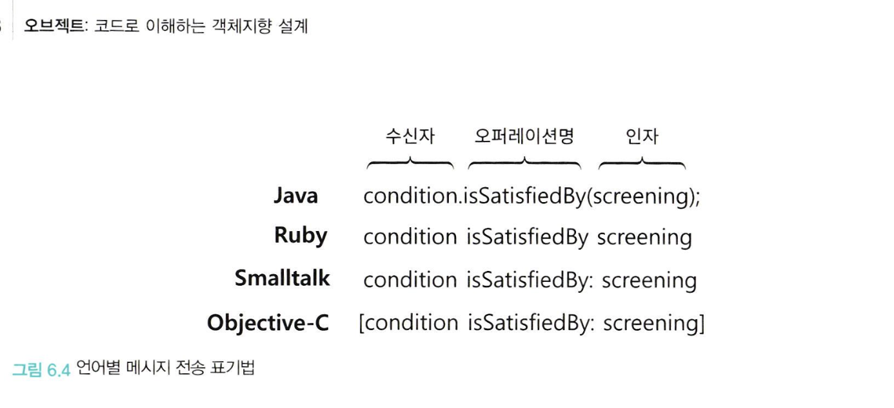
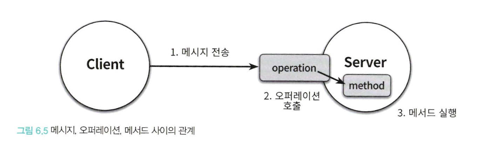

# CHAPTER6. 메시지와 인터페이스

## 1. 협력과 메시지

- 객체지향 프로그래밍에 대한 가장 흔한 오해는 애플리케이션이 클래스의 집합으로 구성된다고 생각하는 것
- 클래스는 중요하지만 도구일 뿐이며 구현 도구에 지나치게 집착하면 경직되고 유연하지 못한 설계에 이를 수 있음
- 훌륭한 객체지향 코드를 얻기 위해서는 클래스가 아니라 객체를 지향해야 하고 객체가 수행하는 책임에 초점을 맞춰야함
- 여기서 중요한 것은 책임의 주체가 되는 것은 객체가 수신할 수 있는 메시지임
- 즉, 객체지향에서 가장 중요한 재료는 클래스가 아닌 객체들 간의 메시지이며 메시지 간 동적인 흐름으로 초점을 전환하여 메시지를 통해 정의할 것
- 객체가 수신하는 메시지들이 객체의 퍼블릭 인터페이스를 구성하는데 해당 챕터에서는 훌륭한 퍼블릭 인터페이스를 얻기 위한 설계 원칙과 기법에 대해 살펴봄

### 클라이언트-서버 모델

- 협력은 어떤 객체가 다른 객체에게 무언가를 요청할 때 시작되고 메시지는 객체 사이의 협력을 가능하게 하는 매개체이며 다른 객체에 접근할 수 있는 유일한 방법
- 객체는 자신의 희망을 메시지라는 형태로 전송하고 메시지를 수신한 객체는 요청을 적절히 처리한 후 응답
- 두 객체 사이의 협력 관계를 설명하기 위해 사용하는 전통적인 메타포는 클라이언트-서버(Client-Server) 모델으로 메시지를 전송하는 객체를 클라이언트, 수신하는 객체를 서버로 부름
- 협력은 이러한 클라이언트가 서버의 서비스를 요청하는 단방향 상호작용이며, 객체는 클라이언트이자 서버일 수 있음
- 협력의 관점에서는 객체는 객체가 수신하는 메시지의 집합이거나 외부의 객체에게 전송하는 메시지의 집합으로 구성이 가능

<br>

### 메시지와 메시지 전송

- 메시지는 객체들이 협력하기 위해 사용할 수 있는 유일한 의사소통 수단
- 한 객체가 다른 객체에게 도움을 요청하는 것을 메시지 전송(message sending) 또는 메시지 패싱(message passing)이라고 부름
- 이 때 메시지를 전송하는 객체를 메시지 전송자(message sender), 메시지를 수신하는 객체는 메시지 수신자(message receiver)라고 부름
- 메시지는 오퍼레이션명 (operation name)과 인자(argument)로 구성되며 메시지 전송은 여기에 메시지 수신자를 추가한 것
  - 즉, 메시지 전송은 메시지 수신자, 오퍼레이션 명, 인자의 조합
  - 이후에 나오는 시그니처는 오퍼레이션(혹은 메서드) + 인자 목록을 합친 것



<br>

```java
public interface DiscountCondition {
    boolean isSatisfiedBy(Screening screening);  // 오퍼레이션 정의
}

// 특정 기간에 조건이 만족되는지 검사하는 구현 클래스
public class PeriodCondition implements DiscountCondition {
    private int startHour;
    private int endHour;

    public PeriodCondition(int startHour, int endHour) {
        this.startHour = startHour;
        this.endHour = endHour;
    }

    // 오퍼레이션을 구현한 메서드
    @Override
    public boolean isSatisfiedBy(Screening screening) {
        int screeningHour = screening.getHour();
        return screeningHour >= startHour && screeningHour <= endHour;
    }
}

// 특정 순서에 따라 조건이 만족되는지 검사하는 구현 클래스
public class SequenceCondition implements DiscountCondition {
    private int sequence;

    public SequenceCondition(int sequence) {
        this.sequence = sequence;
    }

    // 오퍼레이션을 구현한 메서드
    @Override
    public boolean isSatisfiedBy(Screening screening) {
        return screening.getSequence() == sequence;
    }
}

public class Screening {
    private int someProperty;
    private int hour;       // 상영 시간 (예: 15시)
    private int sequence;   // 상영 순서 (예: 2회차)

    // Constructor/Getter/Setter ...
}

public class Main {
    public static void main(String[] args) {
        DiscountCondition condition = new PeriodCondition(10, 18);
        // DiscountCondition sequenceCondition = new SequenceCondition(2);

        Screening screening = new Screening(5, 15, 2);

        // 메시지 전송
        boolean result = condition.isSatisfiedBy(screening);

        System.out.println("Condition satisfied: " + result);
    }
}

// 메시지는 결국 메서드를 호출하는 요청이고, 오퍼레이션은 메서드와 메시지를 아우르는 추상적인 개념
```

<br>

### 메시지와 메서드

- 메시지를 수신했을 때 실제로 어떤 코드가 실행되는지는 메시지 수신자의 실제 타입이 무엇인지에 달려있음
- 메시지 전송 구문에서 condition은 DiscountCondition 이라는 인터페이스로 정의되어 있지만 실제로 실행되는 코드는 인터페이스를 실체화한 클래스의 종류에 따라 달라짐
- condition이 PeriodCondition 의 인스턴스라면 해당 클래스의 isSatisfiedBy 메서드가 실행되고, SequenceCondition의 인스턴스라면 해당 클래스의 isSatisfiedBy 메서드가 실행됨
- 이처럼 수신했을 때 실제로 실행되는 함수 또는 프로시저를 메서드라고 부름
  - 실제 인스턴스에서 메시지가 전송되는 것이 메서드로 메시지를 수신했을 때 실제로 실행되는 코드
  - 메서드 이름이 같아도 실제 구현체에 따라 해당 구현 객체의 메서드가 전송됨
- 전통적인 방식의 개발자는 어떤 코드가 실행될지 정확히 알고 있는 상황에서 함수나 프로시저를 작성하므로 컴파일 시점과 실행 시점이 동일했음
- 반면 객체는 메시지와 메서드라는 두 가지 서로 다른 개념을 실행 시점에 연결해야 하기 때문에 컴파일 시점과 실행 시점이 달라질 수 있음
- 메시지 전송자는 자신이 어떤 메시지를 전송해야하는지만 알면 되고
  - 메시지 수신자가 어떤 클래스(부모 클래스나 인스턴스를 상속받은)의 인스턴스 인지, 어떤 방식으로 요청을 처리하는지 모르더라도 원활한 협력이 가능
  - 이를 통해 메시지 수신자는 메시지를 처리하기 위해 필요한 메서드를 스스로 결정할 수 있는 자율권을 누림

```
루틴(routine) : 어떤 절차를 묶어 호출 가능하도록 이름을 부여한 기능 모듈

프로시저(proceduer) : 부수효과를 발생시킬 수 있지만 값을 반환하지 않고 정해진 절차에 따라 내부의 상태를 변경하는 루틴의 한 종류

함수(function) : 부수효과를 발생하지 않으며 값을 반환하며 어떤 절차에 따라 필요한 값을 계산해서 반환하는 루틴의 한 종류
```

<br>

| 요소                                           | 역할       | 설명                                            |
| ---------------------------------------------- | ---------- | ----------------------------------------------- |
| `DiscountCondition` 인터페이스                 | 오퍼레이션 | 행동의 정의를 제공하는 인터페이스 (추상적 정의) |
| `PeriodCondition`의 `isSatisfiedBy` 메서드     | 메서드     | 인터페이스 오퍼레이션의 구체적 구현             |
| `SequenceCondition`의 `isSatisfiedBy` 메서드   | 메서드     | 인터페이스 오퍼레이션의 또 다른 구체적 구현     |
| `condition.isSatisfiedBy(screening)` 호출 구문 | 메시지     | 런타임에 객체에게 전달되는 요청                 |
| `screening` 인자                               | 인자       | 메서드 실행 시 전달되는 데이터                  |

<br>

### 퍼블릭 인터페이스와 오퍼레이션

- 객체는 안과 밖을 구분하는 뚜렷한 경계를 가지며 외부에서 볼 때 객체의 안쪽은 보이지 않는 미지의 영역
- 외부의 객체는 오직 객체가 공개하는 메시지를 통해서만 객체와 상호작용할 수 있으며 이처럼 의사소통을 위해 외부에 공개하는 메시지 집합을 퍼블릭 인터페이스라고 함
  - 객체가 협력에 참여하기 위해 외부에 수신할 수 있는 메시지의 묶음
  - 클래스의 퍼블릭 메서드들의 집합이나 메시지의 집합을 가리키는데 사용됨
  - 객체를 설계할 때 퍼블릭 인터페이스를 설계하는 것이 중요
- 프로그래밍 언어의 관점에서 퍼블릭 인터페이스에 포함된 메시지를 오퍼레이션이라고 부름
  - 오퍼레이션이란 수행 가능한 어떤 행동에 대한 추상화로 인터페이스의 각 요소가 오퍼레이션임
  - 흔히 오퍼레이션은 내부의 구현 코드를 제외하고 단순히 메시지와 관련된 시그니처를 가리키는 경우가 대부분
- 프로그래밍 언어의 관점에서 객체가 다른 객체에게 메시지를 전송하면 런타임 시스템은 메시지 전송을 오퍼레이션 호출로 해석하고 메시지를 수신한 객체의 실제 타입을 기반으로 적절한 메서드를 찾아 실행함
  - 따라서, 퍼블릭 인터페이스와 메시지의 관점에서 보면 '메서드 호출'보다는 '오퍼레이션 호출'이라는 용어가 더 적절



<br>

### 시그니처

- 오퍼레이션 (또는 메서드)의 이름과 파라미터 목록을 합쳐 시그니처(signature) 라고 부르며 오퍼레이션과 메서드가 무엇을 제공하는지를 표현
- 오퍼레이션은 실행 코드 없이 시그니처만을 정의한 것이며 메서드는 시그니처를 구현한 것
- 대부분의 언어는 시그니처의 일부로 반환 타입을 포함하지 않지만 반환 타입을 시그니처의 일부로 포함하는 언어도 존재
- 물론 자바도 시그니처의 일부로 반환 타입을 포함하지 않음
  - 자바에서의 시그니처는 메서드의 이름과 파라미터 목록만을 의미하므로 반환 타입은 시그니처에 포함되지 않음
  - 자바엣어는 메서드의 이름과 파라미터가 시그니처를 구성하고 이 시그니처를 기준으로 메서드 오버로딩을 판별함

```java
public class Example {
    public int doSomething(String input) {
        // some implementation
    }

    // 만약 인자가 다르면 메서드 + 인자가 다르므로 하나의 다른 시그니처가 되어 다른 메서드로 구분됨 (메서드 오버로딩)
    public int doSomething(int input) {
        // some implementation
    }

    public double doSomething(String input) {  // 컴파일 오류 발생
        // 다른 반환 타입이지만 시그니처는 동일함
    }
}
```

<br>

## 2. 인터페이스와 설계 품질

- 3장에서 살펴본 것 처럼 좋은 인터페이스는 최소한의 인터페이스와 추상적인 인터페이스라는 조건을 만족해야 함
- 최소한의 인터페이스는 꼭 필요한 오퍼레이션만을 인터페이스에 포함하고 추상적인 인터페이스는 어떻게 수행하는지가 아니라 무엇을 하는지를 표현함
- 최소주의를 따르면서도 추상적인 인터페이스를 설계할 수 있는 가장 좋은 방법은 책임 주도 설계 방법을 따르는 것
- 책임 주도 설계 방법은 메시지를 먼저 선택함으로써 협력과는 무관한 오퍼레이션이 인터페이스에 스며드는 것을 방지함

<br>

### 디미터 법칙 (Law of Demeter)

```java
public class ReservationAgency {
    public Reservation reserve(Screening screening, Customer customer, int audienceCount) {
        Movie movie = screening.getMovie();

        boolean discountable = false;

        for(DiscountCondition condition : movie.getDiscountConditions()) {
            if(condition.getType() == DiscountConditionType.PERIOD) {
                discountable = screening.getWhenScreened().getDayOfWeek().equals(condition.getDayOfWeek()) && condition.getStartTime().compareTo(screening.getWhenScreened().toLocalTime()) <= 0 && condition.getEndTime().compareTo(screening.getWhenScreened().toLocalTime()) >= 0;
            } else {
                discountable = condition.getSequence() == screening.getSequence();
            }

            if(discountable) {
                break;
            }
        }
    }
}
```

- 해당 예제 코드에서 ReservationAgency와 인자로 전달된 Screening 사이의 결합도가 너무 높아 Screening이 변경되었을 때 함께 변경해야하는 문제 발생
- 문제의 원인은 ReservationAgency가 Screening 뿐만 아니라 Movie 와 DiscountCondition에도 직접 접근하기 때문
- 이후 Screening 이 Movie를 포함하지 않도록 변경되거나 Movie가 DiscountCondition을 포함하지 않도록 변경 등 사소한 내부 변경 이후 ReservationAgency는 문제가 발생
- 이처럼 협력하는 객체의 내부 구조에 대한 결합으로 인해 발생하는 설계 문제를 해결하기 위해 제안된 원칙이 디미터 법칙 (Law of Demeter)
- 디미터 법칙을 간단하게 요약하면 객체의 내부 구조에 강하게 결합되지 않도록 협력 경로를 제한하라는 것
- 디미터 법칙은 "낯선 자에게 말하지 말라(don't talk to strangers)" 또는 "오직 인접한 이웃하고만 말하라(only talk to your immediate neighbors)" 로 요약이 가능
  - 자바나 C# 같이 '도트(.)를 이용해 메시지 전송을 표현하는 언어에서는 "오직 하나의 도트만 사용하라(use only one dot)" 라는 말로 요약되기도 함
- 이처럼 디미터 법칙을 따라 객체들의 협력 경로를 제한하면 결합도를 효과적으로 낮출 수 있음
- 디미터 법칙을 따르기 위해서는 클래스가 특정한 조건을 만족하는 대상에게만 메시지를 전송하도록 프로그래밍 해야함
- 모든 클래스 C와 C에 구현된 모든 메서드 M에 대해서, M이 메시지를 전송할 수 있는 모든 객체는 다음에 서술된 클래스의 인스턴스여야 함
  - 이때, M에 의해 생성된 객체나 M이 호출하는 메서드에 의해 생성된 객체, 전역 변수로 선언된 객체는 모두 M의 인자로 간주
- 클래스 내부의 메서드가 아래 조건을 만족하는 인스턴스에만 메시지를 전송하도록 프로그래밍 한다고 이해해도 무방
  - this 객체
  - 메서드의 매개변수
  - this 의 속성
  - this 의 속성인 컬렉션의 요소
  - 메서드 내에서 생성된 지역 객체

<br>

```java
class Customer {
    private Address address;
    private List<Order> orders;

    public Customer(Address address) {
        this.address = address;
        this.orders = new ArrayList<>();
    }

    // this 객체에 메시지 전송
    public void addOrder(Order order) {
        this.orders.add(order);  // 'this' 객체의 속성에 메시지 전송
    }

    // this 의 속성에 메시지 전송
    public String getCity() {
        return address.getCity();  // 'this'의 속성인 address에 메시지 전송
    }

    // this 의 속성인 컬렉션의 요소에 메시지 전송
    public void printAllOrderAmounts() {
        for (Order order : orders) {  // orders는 'this'의 속성인 컬렉션
            System.out.println(order.getAmount());  // 컬렉션 요소에 메시지 전송
        }
    }
}

class Address {
    private String city;

    public Address(String city) {
        this.city = city;
    }

    public String getCity() {
        return city;
    }
}

class Order {
    private Customer customer;
    private double amount;

    public Order(Customer customer, double amount) {
        this.customer = customer;
        this.amount = amount;
    }

    public double getAmount() {
        return amount;
    }

    // 메서드 매개변수에 메시지 전송
    public void printOrderCity(Customer customer) {
        System.out.println(customer.getCity());  // 매개변수에 메시지 전송
    }

    // 메서드 내에서 생성된 지역 객체에 메시지 전송
    public void printDiscountedAmount() {
        DiscountCalculator calculator = new DiscountCalculator();
        double discountedAmount = calculator.calculateDiscount(amount);  // 지역 객체에 메시지 전송
        System.out.println("Discounted Amount: " + discountedAmount);
    }
}

// 지역 객체 예시를 위한 클래스
class DiscountCalculator {
    public double calculateDiscount(double amount) {
        return amount * 0.9;
    }
}
```

<br>

- 디미터 법칙을 따르면 부끄럼 타는 코드(shy code)를 작성할 수 있음
- 부끄럼타는 코드는 불필요한 어떤 것도 다른 객체에게 보여주지 않으며, 다른 객체에 의존하지 않는 코드를 의미
- 디미터 법칙은 캡슐화를 다른 관점에서 표현한 것으로 디미터 법칙이 가치 있는 이유는 클래스를 캡슐화하기 위해 따라야하는 구체적인 지침을 제공하기 때문
- 메시지 전송자가 수신자 내부 구조에 대해 물어보고 반환받은 요소에 대해 연쇄적으로 메세지를 전송하는 이와 같은 코드를 기차 충돌(train wreck)이라고 부르는데 여러 대의 기차가 한 줄로 늘어서 충돌한 것처럼 보이기 때문
- 기차 충돌은 클래스의 내부 구현이 외부로 노출됐을 때 나타나는 전형적인 형태로 메시지 전송자는 메시지 수신자의 내부 정보를 자세히 알게 됨
  - 메시지 수신자의 캡슐화는 무너지고, 메시지 전송자가 메시지 수신자의 내부 구현에 강하게 결합됨
- 디미터 법칙은 객체가 자기 자신을 책임지는 자율적인 존재여야 하는 사실을 강조하여 응집도가 높은 객체가 만들어짐
- 하지만 무비판적으로 디미터 법칙을 수용하면 퍼블릭 인터페이스 관점에서 객체의 응집도가 낮아질 수 있어 주의가 필요

<br>

```java
public class ReservationAgency {
    public Reservation reserve(Screening screening, Customer customer, int audienceCount) {
        Money fee = screening.calculateFee(audienceCount);

        return new Reservation(customer, screening, fee, audienceCount);
    }
}
```

<br>

### 묻지 말고 시켜라 (Tell, Don't Ask)

- ReservationAgency 는 Screening 내부에 Movie 에 접근하는 대신 Screening에게 직접 요금을 계산하도록 요청
  - 요금을 계산하는데 필요한 정보를 잘 알고 있는 Screening에게 요금을 계산할 책임을 할당한 것
- 디미터 법칙은 훌륭한 메시지는 객체의 상태에 관해 묻지 말고 원하는 것을 시켜야 한다는 사실을 강조하는데 "묻지 말고 시켜라"는 이런 스타일의 메시지 작성을 장려하는 원칙을 가리키는 용어
- 메시지 전송자는 메시지 수신자의 상태를 기반으로 결정을 내린 후 메시지 수신자의 상태를 바꿔서는 안되고 구현 로직은 메시지 수신자가 담당해야 할 책임임
  - 객체의 외부에서 해당 객체의 상태를 기반으로 결정을 내리는 것은 객체의 캡슐화를 위반
  - '절차적인 코드는 정보를 얻은 후에 결정한다. 객체지향 코드는 객체에게 그것을 하도록 시킨다.'
- 객체지향의 기본은 함께 변경될 확률이 높은 정보와 행동을 하나의 단위로 통합 하는 것이므로 묻지 말고 시켜라 원칙을 따르면 객체의 정보를 이용하는 행동을 외부가 아닌 내부에 위치시켜 자연스럽게 정보와 행동을 동일한 클래스 안에 두게됨
- 묻지 말고 시켜라 원칙과 디미터 법칙은 훌륭한 인터페이스를 제공하기 위해 포함해야 하는 오퍼레이션에 대한 힌트를 제공
  - 내부의 상태를 이용해 어떤 결정을 내리는 로직이 객체 외부에 존재한다면 해당 객체가 책임져야 하는 어떤 행동이 객체 외부로 누수된 것
- 하지만 단순하게 객체에게 묻지 않고 시킨다고 무든 문제가 해결되는 것은 아니며 객체가 어떻게 작업을 수행하는지를 노출해서는 안되고 객체가 '어떻게 하는지'가 아니라 '무엇을 하는지' 서술해야 함

<br>

### 의도를 드러내는 인터페이스

```java
public class PeriodCondition {
    public boolean isSatisfiedByPeriod(Screening screening) { // ...
    }
}

public class SequenceCondition {
    public boolean isSatisfiedBySequence(Screening screening) { // ...
    }
}
```

- 해당 코드의 문제는 다음과 같음
- 메서드에 대해 제대로 커뮤니케이션하지 못함. 클라이언트 관점에서는 두 메서드 모두 할인 조건을 판단하는 동일한 작업을 수행하는데 메서드의 이름이 달라 두 메서드의 내부 구현을 정확하게 이해하지 못했다면 동일한 작업을 수행한다는 사실을 알기 어려움
- 더 큰 문제는 메서드 수준에서 캡슐화를 위반함. 이 메서드들은 클라이언트로 하여금 협력하는 객체의 종류를 알도록 강요함
  - 기존 인터페이스에서 해당 메서드를 직접 명시해서 사용해야 함
  - 해당 코드를 변경하여 구현체가 변경된다면 사용하는 메서드도 변경해야함
  - 즉, 책임을 수행하는 방법을 드러내는 메서드를 사용한 설계는 변경에 취약할 수 밖에 없음
- 그렇기 때문에 메서드의 이름을 짓는 방법으로는 '어떻게'가 아니라 '무엇'을 하는지를 드러내는 것이 좋음
  - 무엇을 하는지를 드러내는 메서드의 이름을 짓기 위해서는 객체가 협력 안에서 수행해야 하는 책임에 관해 고민해야 함
  - 이것은 외부의 객체가 메시지를 전송하는 목적을 먼저 생각하돌고 만들며, 결과적으로 협력하는 클라이언트의 의도에 부합하도록 메서드의 이름을 짓게됨
- 이제 무엇을 하는지를 드러내도록 메서드의 이름을 변경한 코드는 다음과 같음
  - 동일한 목적을 가진다는 것을 메서드의 이름을 통해 명확하게 표현
  - 클라이언트의 입장에서 두 메서드는 동일한 메서지를 서로 다른 방법으로 처리하기 때문에 대체 가능
  - 물론 자바 같은 정적 타이핑 언어에서 단순이 메서드의 이름이 같다고 동일한 메서드를 처리하는 것이 아니므로 클라이언트가 두 메서드를 가진 객체를 동일한 타입으로 간주할 수 있도록 동일한 타입의 계층으로 인터페이스를 정의하고 인터페이스에 isStatisfiedBy 오퍼레이션을 정의하는 것

```java
public class PeriodCondition implements DiscountCondition {
    public boolean isSatisfiedBy(Screening screening) { // ...
    }
}

public class SequenceCondition implements DiscountCondition {
    public boolean isSatisfiedBy(Screening screening) { // ...
    }
}

public interface DiscountCondition {
    boolean isSatisfiedBy(Screening screening);
}
```

- 해당 코드처럼 '무엇을 하느냐'에 초점을 맞추면 클라이언트 관점에서 동일한 작업을 수행하는 메서드들의 하나의 타입 계층으로 묶을 수 있는 가능성이 커지고 다양한 타입의 객체가 참여할 수 있는 유연한 협력을 얻게 되는 것
- 이처럼 무엇을 하느냐에 따라 메서드의 이름을 짓는 패턴을 '의도를 드러내는 선택자(Intention Revealing Selector)'라고 부름
  - 켄트 벡은 메서드의 의도를 드러낼 수 있는 이름을 붙이기 위해 다음과 같이 조언
  - 하나의 구현을 가진 메시지의 이름을 일반화하도록 도와주는 간단한 훈련 방법은 매우 다른 두 번째 구현을 상상하고 해당 메서드에 동일한 이름을 붙인다고 생각해보기
  - 그러면 아마도 순간에 자신이 할 수 있는 한 가장 추상적인 이름을 메서드에 붙일 것임
- <도메인 주도 설계> 에서 에릭 에반스는 켄트 벡의 의도를 드러내는 선택자를 인터페이스 레벨로 확장한 '의도를 드러내는 인터페이스'를 제시하였음
  - 구현과 관련된 모든 정보를 캡슐화하고 객체의 퍼블릭 인터페이스에는 협력과 관련된 의도만을 표현해야 한다는 것
  - 이렇게 하면 클라이언트 개발자가 내부를 이해해야 할 필요성이 줄어들고 퍼블릭 인터페이스에는 관계와 규칙을 시행하는 방법이 아닌 이벤트와 규칙 그 자체만을 명시함

<br>

### 함께 모으기

|              원칙              |                                                                                                                                      설명                                                                                                                                      |
| :----------------------------: | :----------------------------------------------------------------------------------------------------------------------------------------------------------------------------------------------------------------------------------------------------------------------------: |
|        **디미터 법칙**         |    객체 간의 결합도를 낮추기 위해 **객체가 직접 접근 가능한 인접 객체에게만 메시지를 전송**하도록 제한하는 원칙. "낯선 자와는 대화하지 말라" 또는 "오직 한 개의 도트만 사용하라"는 방식으로 요약되며, 불필요한 연쇄적 접근을 방지하여 코드의 유연성과 유지보수성을 높인다.     |
|      **묻지 말고 시켜라**      |      **객체의 상태를 묻지 말고 필요한 행동을 지시하라**는 원칙. 객체가 자신의 상태에 기반해 행동을 수행하도록 하여 외부가 객체 내부의 상태를 알지 못하게 하며, 객체의 자율성을 높이고 캡슐화를 강화한다. 객체지향의 핵심 개념으로서 결합도 감소와 응집도 향상에 기여한다.      |
| **의도를 드러내는 인터페이스** | 메서드와 인터페이스의 이름을 **'어떻게'가 아닌 '무엇을 하는지'에 초점**을 맞추어 명명하는 방식. 클라이언트 관점에서의 의도를 명확히 드러내어 코드의 가독성을 높이고, 객체가 수행하는 책임을 명확히 표현한다. 이를 통해 유연하고 유지보수하기 쉬운 인터페이스를 설계할 수 있다. |

<br>

```java
// 기존 디미터 법칙을 위반한 코드
// 근본적으로 디미터 법칙을 위반하는 설계는 인터페이스와 구현의 분리 원칙을 위반함
public class Theater {
    private TicketSeller ticketSeller;

    public Theater(TicketSeller ticketSeller) {
        this.ticketSeller = ticketSeller;
    }

    public void enter(Audience audience) {
        if (audience.getBag().hasInvitation()) {
            Ticket ticket = ticketSeller.getTicketOffice().getTicket();
            audience.getBag().setTicket(ticket);
        } else {
            Ticket ticket = ticketSeller.getTicketOffice().getTicket();
            audience.getBag().minusAmount(ticket.getFee());
            ticketSeller.getTicketOffice().plusAmount(ticket.getFee());
            audience.getBag().setTicket(ticket);
        }
    }
}

```

<details>
<summary>코드 문제 사항</summary>

### 디미터 법칙 위반

- 현재 디미터 법칙을 위반하고 있음. 위반하고 있는 사항은 아래와 같음
- 디미터 법칙을 위반한 코드는 일반적으로 프로그램에 노출되는 객체 사이의 관계가 많아질수록 결합도가 높아지기 때문에 객체의 구조는 다양한 요구사항에 변경되기 쉽기 때문에 요구사항 변경에 취약해짐
- 또한 디미터 법칙을 위반한 코드는 사용하기 어려운데 클라이언트 객체의 개발자는 Audience의 퍼블릭 인터페이스뿐만 아니라 Audience의 내부 구조까지 속속들이 알고 있어야 함

```java

/*
    - Theater가 audience와 ticketSeller 내부에 포함된 객체에도 직접 접근하고 있음
    - 이 코드에서 Theater는 Audience 뿐만 아니라 Audience 내부에 포함된 Bag에게도 메시지를 전송하여 결과적으로 퍼블릭 인터페이스 뿐만 아니라 내부 구조에 대해서도 결합됨
*/

Ticket ticket = ticketSeller.getTicketOffice().getTicket();
audience.getBag().minusAmount(ticket.getFee());
```

<br>

### 묻지 말고 시켜라

- Theater는 TicketSeller와 Audience의 내부 구조에 관해 묻지 않고 원하는 작업을 시켜야 함
- Theater가 TicketSeller에게 시키고 싶은 일은 Audience가 Ticket을 가지도록 만드는 것

```java
/*
    - 현재 Theater가 자기스스로 객체의 내부 값들을 가져와서 구현하고 있음
    - Audience에서 Bag 을가져와서 원하는 일을 시키지 않고 Theater에서 Bag의 메서드를 통해 Bag 한테 까지 묻고있음
    - 이로 인해 시키고 있지 않고 디미터 법칙을 위반하고 있음
    - 이에 대해 책임을 Audience 스스로 책임을 가지도록 해야함
*/
public void enter(Audience audience) {
        if (audience.getBag().hasInvitation()) {
            Ticket ticket = ticketSeller.getTicketOffice().getTicket();
            audience.getBag().setTicket(ticket);
        } else {
            Ticket ticket = ticketSeller.getTicketOffice().getTicket();
            audience.getBag().minusAmount(ticket.getFee());
            ticketSeller.getTicketOffice().plusAmount(ticket.getFee());
            audience.getBag().setTicket(ticket);
        }
    }
```

<br>

- 책에서의 위의 코드를 묻지 말고 시켜 수정한 코드는 다음과 같음

```java
public class Theater {
    public void enter(Audience audience) {
        ticketSeller.setTicket(audience);
    }
}

public class TicketSeller {
    public void setTicket(Audience audience) {
        ticketOffice.plusAmount(
            audience.setTicket(ticketOffice.getTicket()));
    }
}

public class Audience {
    public Long setTicket(Ticket ticket) {
        return bag.setTicket(ticket);
    }
}

public class Bag {
    public Long setTicket(Ticket ticket) {
        if(hasInvitation()) {
            this.ticket = ticket;
            return 0L;
        } else {
            this.ticket = ticket;
            minusAmount(ticket.getFee());
            return ticket.getFee();
        }
    }

    public boolean hasInvitation() {
        return invitation != null;
    }

    private void minusAmount(Long amount) {
        this.amount -= amount;
    }
}
```

### 인터페이스에 의도를 드러내자

- 현재 인터페이스는 클라이언트의 의도를 명확하게 드러내지 못하고 있음
- setTicket 메서드가 Theater, TicketSeller, Audience, Bag 에 모두 쓰이고 있는데 개발자는 의도가 다름을 알고 있지만 퍼블릭 인터페이스를 해석하고 사용해야 하는 개발자를 혼란스럽게 만들 확률이 높음
- 각각의 객체 입장에서 setTicket 이라는 명칭은 협력하는 클라이언트의 의도를 명확하게 드러내지 못함
- 각각의 객체의 의도는 다음과 같음
  - Theater : Audience 에게 티켓을 판매하는 것
  - TicketSeller : Audience 가 티켓을 사도록 만드는 것
  - Audience : Bag에게 티켓을 보관하도록 만드는 것
- 각각의 의도를 퍼블릭 인터페이스를 통해 명확하게 드러내는 것이 좋음

```java
/*
    - 해당 수정으로 의도를 드러내는 인터페이스 원칙을 지켜 코드의 목적을 명확하게 커뮤니케이션 할 수 있게 함
*/
public class TicketSeller {
    public void sellTo(Audience audience) {}
}

public class Audience {
    public Long buy(Ticket ticket) {}
}

public class Bag {
    public Long hold(Ticket ticket) {}
}
```

</details>

<br>

## 3. 원칙의 함정

- 디미터 법칙과 묻지 말고 시켜라 스타일은 객체의 퍼블릭 인터페이스를 깔끔하고 유연하게 만들 수 있지만 이는 절대적인 법칙이 아님
- 설계는 트레이드오프의 산물이며 적절하게 트레이드오프할 수 있는 능력이 중요한 기준

<br>

### 디미터 법칙은 하나의 도트(.)를 강제하는 규칙이 아님

- 디미터 법칙의 오해로 "오직 하나의 도트만을 사용하라"로 요약되기도 하는데 아래 코드는 디미터 법칙을 위반한다고 생각할 수 있음

```java
IntStream.of(1, 15, 20, 3, 9).fileter(x -> x > 10).distinct().count();
```

- 하지만 해당 스트림의 각각의 메서드는 모두 IntStream이라는 동일한 클래스의 인스턴스를 반환하므로 디미터 법칙을 위반하지 않음
- 디미터 법칙은 결합도와 관련된 것으로 결합도의 문제가 되는 것은 객체 내부의 구조가 외부로 노출되는 경우로 한정함
- 즉, 해당 코드는 IntStream 에서 다른 IntStream으로 변할 뿐 객체를 둘러싸고 있는 캡슐은 그대로 유지됨
- 또한 이 메서드들은 객체의 내부에 대한 어떤 내용도 묻지 않고 객체를 다른 객체로 변환하는 작업을 수행하라고 시킬 뿐으로 묻지 말고 시켜라 원칙을 위반하지 않음
  - 개인적으로 생각하기에 스트림은 기존 객체의 상태를 변화시키지 않는 함수형 프로그래밍을 따르고 있기 때문에 디미터 법칙을 위반하지 않는다고 생각함
  - 또한 묻지 말고 시켜라 원칙은 외부에 자신의 상태를 묻는 것이 아니라 내부에서 내부 정보를 묻지 않고 특정 작업에 대해 필터링 및 변환 작업을 직접 수행하라고 지시함

<br>

### 결합도와 응집도의 충돌

- 항상 묻지 말고 시켜라와 디미터 법칙을 준수하는 것이 항상 긍정적인 결과로만 귀결되는 것은 아님
- 모든 상황에서 맹목적으로 다른 객체에게 위임 메서드를 추가하면 같은 인터페이스 안에 어울리지 않는 오퍼레이션들이 공존하게 됨
- 결과적으로 객체는 상관없는 책임들을 한꺼번에 떠안게 되기 때문에 결과적으로 응집도가 낮아짐
- 또한 클래스는 하나의 변경 원인만을 가져야 하는데 서로 상관없는 책임들이 함께 뭉쳐있는 클래스는 낮은 응집도로 작은 변경에도 쉽게 무너질 수 있음
  - 즉, 무작위로 디미터 법칙과 묻지 말고 시켜라 원칙을 무작정 따르면 안된다
  - 개인적으로 책임이 있는 객체에서 더 이상 위임하지 말고 직접 처리해야한다는(하나의 명확한 책임 보유) 의미로 해석됨
- 또한 가끔은 묻는 것 외에는 다른 방법이 존재하지 않는 경우도 존재함. 컬렉션에 포함된 객체들을 처리하는 유일한 방법은 객체에게 물어보는 것
- 결론은 객체에게 시키는 것이 항상 가능한 것은 아니고 가끔씩은 물어봐야 함

```java
// 영화들을 관리하는 일급 컬렉션을 보유하고 있는 객체 외에 이를 위임할 수 있는 객체가 존재하지 않음
for(Movie each : movies) {
    total += each.getFee();
}
```

<br>

### 명령-쿼리 분리 원칙

- 가끔씩 필요에 따라 물어야 하는 사실에 납득했다면 명령-쿼리 분리(Command-Query Separation) 원칙을 알아두면 도움이 된다고 한다
- 위에도 적어두었지만 어떤 절차를 묶어 호출 가능하도록 이름을 부여한 기능 모듈은 루틴(routine) 이라고 부르며 루틴은 다시 프로시저와 함수로 구분됨
  - 프로시저 : 부수효과를 발생시킬 수 있지만 값을 반환할 수 없음
  - 함수 : 값을 반환할 수 있지만 부수효과를 발생시킬 수 없음
- 명령(Command)과 쿼리(Query)는 객체와 인터페이스 측면에서 프로시저와 함수를 부르는 또 다른 이름임
  - 객체의 상태를 수정하는 오퍼레이션이 명령
  - 객체와 관련된 정보를 반환하는 오퍼레이션이 쿼리
- 명령-쿼리 분리 원칙의 요지는 부수효과를 발생시키는 명령이거나 부수효과를 발생시키지 않는 쿼리 중 하나여야 함
- 해당 원칙에 따르면 객체는 블랙박스이며 객체의 인터페이스는 객체의 관찰 가능한 상태를 보는 일련의 디스플레이와 객체의 상태를 변경하기 위해 누를 수 있는 버튼의 집합
- 이런 스타일의 인터페이스를 사용함으로써 객체의 캡슐화와 다양한 문맥에서의 재사용성을 보장할 수있고 해당 원칙에 따라 작성된 객체의 인터페이스를 **명령-쿼리 인터페이스(Command-Query Interface)** 라고 함

<br>

### 반복 일정의 명령과 쿼리 분리하기

- 해당 책에서 일정 관리 소프트웨어 개발 중 "이벤트"와 "반복 일정"에 관해 버그가 발생함
- 2019-05-08 수요일 10:30 ~ 2019-05-08 수요일 11:00 까지 회의가 잡혀있다면 이 회의는 이벤트가 되고 반복 일정은 일주일 단위로 돌아오는 특정 시간 간격에 발생하는 사건 전체를 포괄적으로 지칭
- 반복 일정을 만족하는 특정 일자와 시간에 발생하는 사건이 바로 이벤트로 구현되어 있음
- 해당 책에서 2019-05-08 10:30 ~ 11:00 까지 Event 인스턴스를 생성하여 수요일의 반복 일정의 조건을 만족하여 isSatisfed 메서드는 true를 반환
- 이후 2019-05-09 10:30 ~ 11:00 Event 인스턴스는 목요일이므로 수요일이라는 반복 일정의 조건을 만족시키지 못해 isSatisfied 메서드는 false를 반환하였음
- 여기까지는 정상 동작이었으나 다시 한 번 isSatisfied 메서드를 호출하면 true를 반환하였고 해당 코드는 다음과 같음

```java
public class Event {
    public boolean isSatisfied(RecurringSchedule chedule) {
        if(from.getDayOfWeek() != schedule.getDayOfWeek()) ||
            !from.toLocalTime().equals(schedule.getFrom()) ||
            !duration.equals(schedule.getDuration) {
                reschedule(schedule);

                return false;
            }

        return true;
    }

    private void reschedule(RecurringSchedule schedule) {
        from = LocalDateTime.of(from.toLocalDate().plusDays(dayDistance(schedule))),
            schedule.getFrom());

        duration = schedule.getDuration;
    }

    private long daysDistance(RecurringSchedule schedule) {
        return schedule.getDayOfWeek().getValue() - from.getDayOfWeek().getValue();
    }
}
```

- isSatisfied 메서드는 먼저 인자로 전달된 RecurringSchedule 의 요일, 시작 시간, 소요 시간이 현재 Event의 값과 동일한지 판단
- 이 메서드는 이 값중 하나라도 같지 않다면 false를 반환하지만 false를 반환하기 전에 reschedule 메서드를 호출하고 있는데 해당 메서드는 Event 객체의 상태를 수정하고 있음
- reschedule 메서드는 Event 일정이 조건에 만족하지 않으면 false를 반환하기전 Event의 조건을 만족시키도록 변경하고 있음
- 이를 찾기 어려웠던 이유는 isSatisfied 가 명령과 쿼리의 두 가지 역할을 동시에 수행하고 있었기 때문
- 보기에는 말도 안되는 코드지만 처음 구현 이후 기능을 추가하는 과정에서 누군가 Event 가 RecurringSchedule 의 조건이 맞지 않을 경우 Event 의 상태를 수정해야 한다는 요구사항이 추가되어 해당 코드를 추가했다고 함
- 이를 통해 명령과 쿼리가 뒤섞이면 실행 결과를 예측하기 어려워질 수 있음
- 이를 분리하여 해당 메서드가 쿼리임을 나타내고 부수효과에 대한 부담이 없어짐

```java
public class Event {
    public boolean isSatisfied(RecurringSchedule schedule) {
        if (from.getDayOfWeek() != schedule.getDayOfWeek() ||
            !from.toLocalTime().equals(schedule.getFrom()) ||
            !duration.equals(schedule.getDuration())) {
            return false;
        }
        return true;
    }

    // 명령과 쿼리를 분리하고 이를 호출하기 위해 내부에서 사용되던 private를 public 으로 변경
    public void reschedule(RecurringSchedule schedule) {
        from = LocalDateTime.of(from.toLocalDate().plusDays(daysDistance(schedule)), schedule.getFrom());
        duration = schedule.getDuration();
    }
}
```

<br>

### 명령-쿼리 분리와 참조 투명성

- 지금까지 확인한 것처럼 명령과 쿼리로 엄격하게 분리하면 객체의 부수효과를 제어하기 수월해지고 쿼리는 객체의 상태를 변경하지 않으므로 반복적으로 호출되어도 상관이 없음
- 명령이 개입하지 않는 한 쿼리의 값은 변경되지 않으므로 쿼리의 결과를 예측하기 쉬워지고 쿼리의 순서를 자유롭게 변경해도됨
- 명령과 쿼리를 분리함으로써 틀 안에서 **참조 투명성(referential transparency)** 의 장점을 제한적이나마 누릴 수 있게 됨
- 참조 투명성을 잘 활용하면 버그가 적고, 디버깅이 용이 하며, 쿼리의 순서에 따라 실행 결과가 변하지 않는 코드를 작성할 수 있음
- 또한 컴퓨터의 세계와 수학의 세계를 나누는 가장 큰 특징은 부수효과(side effect)의 존재 유무로 수학의 경우 값을 초기화한 후 값을 변경하는 것이 불가능 하나 프로그램에서는 대입문을 통해 값 변경이 가능하기 때문
    - 즉, 부수효과로 인해 결과값이 매번 다를 수 있음
- 이런 부수효과를 이야기 할때의 개념이 참조 투명성으로 이는 "어떤 표현식 e가 있을때 e의 값으로 나타나는 모든 위치를 교체하더라도 결과가 달라지지 않는 특성"을 의미함
- 수학에서 함수는 동일한 입력에 대해 항상 동일한 값을 반환하는데 이는 참조 투명성을 만족시키는 이상적인 예로, 이처럼 어떤 값이 변하지 않는 성질을 **불변성(immutability)** 라고 함
- 객체지향 패러다임이 객체의 상태 변경이라는 부수효과를 기반으로 하여 참조 투명성은 예외에 가까우나 해당 혜택을 누리면 변경 전 같은 결과가 나오는 혜택을 누릴 수 있음
