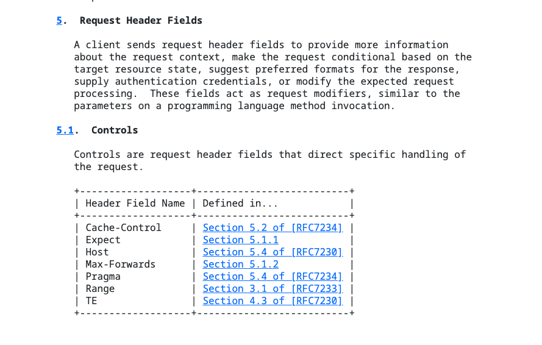
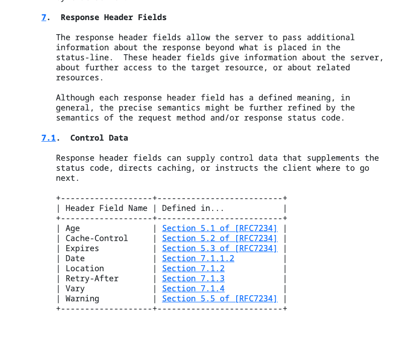
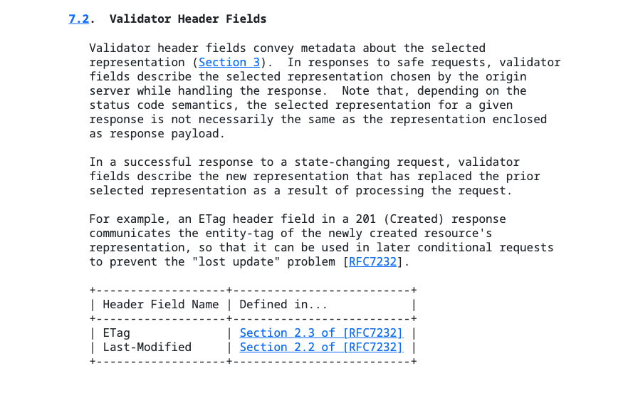

# 3. HTTP 메시지

### 정리 예정
- 현재 금주 경기신용보증재단 필기시험으로 인해 스터디에 참여하지 못했고 독서 후 질의 문제와 답변만 작성을 진행하였음
- 이후 가능하다면 시험 이후 정리를 최대한 진행해보겠습니다..

<br>

## 질의 문제

### 1. HTTP 메시지에서 사용되는 'CRLF'는 무엇이고 메시지에서 어떻게 사용하는지?

<br>

<details>
<summary>정답</summary>

- HTTP 프로토콜에서  헤더(header)와 시작줄(start line)에 CRLF (Carriage Return + Line Feed)를 사용하여 줄바꿈을 표현
    - Carriage Return (CR): 표준 텍스트 에디터에서 라인의 처음으로 이동하는 제어 문자입니다. ASCII 코드에서는 13번에 해당하는 문자
    - Line Feed (LF): 새로운 줄로 이동하여 텍스트를 다음 라인에 출력하는 제어 문자입니다. ASCII 코드에서는 10번에 해당하는 문자
- 새로운 줄을 시작하려고 할때 줄바꿈 문자로 사용하는 문자로 대부분의 윈도우 기반의 시스템에서 사용하고 유닉스 기반 시스템에서는 줄바꿈 문자로 LF만 사용하는 경우도 있음

<br>

- 줄바꿈을 위해 시작점 + CRLF / 헤더 + CRLF / CRLF / 본문 으로 사용됨
    - 시작줄 이후 처음 CRLF를 사용하면 다음줄부터 헤더를 의미
    - 헤더 한줄마다 CRLF를 사용함
    - CRLF만 있는 줄을 사용하여 본문을 구분
    - 본문 내부에서도 CRLF을 사용됨
- 예시는 다음과 같음
```http
GET /index.html HTTP/1.1 CRLF
Host: example.com CRLF
User-Agent: Mozilla/5.0 (Windows NT 10.0; Win64; x64) AppleWebKit/537.36 (KHTML, like Gecko) Chrome/88.0.4324.182 Safari/537.36 CRLF
Accept: text/html,application/xhtml+xml,application/xml;q=0.9,image/avif,image/webp,image/apng,*/*;q=0.8,application/signed-exchange;v=b3;q=0.9 CRLF
CRLF
<!-- 본문 -->
```

</details>

<br>

### 2. 해당 예시들은 각각 헤더 2종류씩이며 어떤 헤더들인지 맞추고 왜 특정 헤더라고 생각했는지 이야기하기 ( 일반 헤더 제외 )

```
a. Accept: application/json, text/html
b. Server: Apache/2.4.41 (Ubuntu), nginx/1.18.0
c. Last-Modified: Sat, 02 Apr 2024 10:15:30 GMT
d. Cookie: session_id=abc123; user_pref=dark_mode
e. ETag: "abc123"
f. Set-Cookie: session_id=def456; Max-Age=3600; Path=/; Secure; HttpOnly
```
- 일반적으로 요청 헤더와 응답 헤더로 분류하는 것이 일반 헤더를 대신하여 사용되는 경향이 있음
- 일반헤더라는 용어 대신 요청 헤더와 응답 헤더로 분류된다 하여 해당 문제에서 일반 헤더는 제외하였음

<details>
<summary>각 기능 힌트</summary>

```
a. 요청에 필요한 서버의 행동을 열거할 수 있게 해줌. (보내도 되는 미디어 종류)
b. 서버 애플리케이션의 이름과 버전
c. 가장 최근 이 엔티티가 변경된 일시
d. 클라이언트가 서버에게 토큰을 전달할 때 사용
e. 엔터티의 버전을 나타내는 태그를 지정합니다.
f. 서버가 클라이언트를 인증할 수 있도록 클라이언트 측에 토큰을 설정하기 위해 사용됨

```

</details>

<br>

<details>
<summary>정답</summary>

- 요청 헤더 : a, d
- 응답 헤더 : b, f
- 엔티티 헤더 : c, e

</details>

<br>

### 참고 자료
- 2번 문제의 참고 자료므로 이야기 후 확인

<details>





<summary>참고 자료</summary>
</details>

<br>

### 참고
- https://developer.mozilla.org/ko/docs/Web/HTTP/Headers
- https://chat.openai.com/c/fc5b5c38-464a-4218-88a5-dc0c28da1276
- ChatGPT