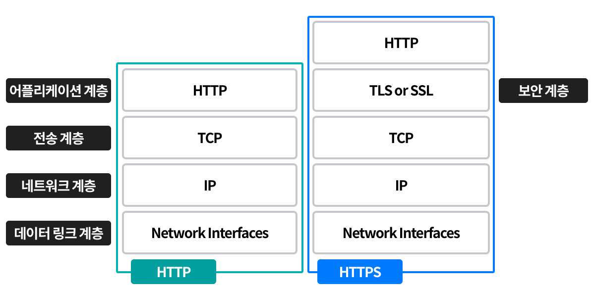

# 4. 커넥션 관리

## 1. TCP 커넥션
- 모든 HTTP 통신은 TCP/IP로 이루어지고 모든 클라이언트 애플리케이션은 서버 애플리케이션으로 TCP/IP 커넥션을 맺을 수 있음
- 커넥션이 맺여지면 클라이언트와 서버 간에 주고받는 메시지들은 손실 혹은 손상되거나 순서가 바뀌지 않고 안전하게 전달됨

 

### 브라우저 요청 시점 TCP 커넥션
1. 브라우저가 www.joes-hardware.com라는 호스트명 추출
2. 브라우저가 이 호스트 명에 대한 IP 주소를 찾음
    - www.joes-hardware.com -> 202.43.78.3
3. 브라우저가 포트 번호(80)을 얻음
4. 브라우저가 202.43.78.3의 80포트로 TCP 커넥션 생성
5. 브라우저가 서버로 HTTP GET 요청 메시지를 보냄
6. 브라우저가 서버에서 온 HTTP 응답 메시지를 읽음
7. 브라우저가 커넥션을 끊음

 

### TCP 스트림은 세그먼트로 나뉘어 IP 패킷을 통해 전송

- HTTP은 프로토콜 스택에서 최상위 계층
- HTTP에 HTTPS는 TLS 혹은 SSL이라 불리기도 하며 HTTP와 TCP 사이 암호화 계층임
- HTTP가 메시지를 전송하고자 할때 현재 연결되어 있는 TCP 커넥션을 통해 메시지 데이터의 내용을 순서대로 보냄
- TCP는 세그먼트라는 단위로 데이터 스트림을 잘게 나누고 세그먼트를 IP패킷에 넣어 전달하며 이 모든 것은 TCP/IP 소프트웨어에 의해 처리되어 HTTP 프로그래머에게 보이지 않음
    - 각 TCP 세그먼트는 하나의 IP주소에서 다른 IP 주소로 IP 패킷에 담겨 전달
    - HTTP가 TCP/IP보다 상위 레이어이기 때문에 보이지 않음
- 각 IP 패킷은 다음을 포함함
    - IP 패킷 헤더 (보통 20바이트)
    - TCP 세그먼트 헤더 (보통 20바이트)
    - TCP 데이터 조각 (0 혹은 그 이상의 바이트)

 

 

### TCP 커넥션 유지
- 컴퓨터는 항상 TCP 커넥션을 여러개 가지고 있으며 TCP는 포트 번호를 통해 이런 여러 개의 커넥션을 유지
- TCP 커넥션은 4가지 값으로 식별함
    - 발신지 IP주소
    - 발신지 포트
    - 수신지 IP주소
    - 수신지 포트

 

### TCP 소켓 프로그래밍
- 운영체제는 TCP 커넥션의 생성과 관련된 여러 가지 기능을 제공하는데 이는 소켓 API를 활용
- 소켓 API는 TCP 종단 데이터 구조를 생성하고, 원격 서버의 TCP 종단에 그 종단 데이터 구조를 연결하여 데이터 스트림을 읽고 쓸 수 있음
- TCP API는 기본적인 네트워크 프로토콜의 핸드셰이킹, TCP데이터 스트림, IP패킷 간의 분할 및 재조립에 대한 모든 내용을 외부로부터 숨긴다

 

## 2. TCP의 성능에 대한 고려
### HTTP 트랜잭션 지연
- 클라이언트나 서버가 너무 많은 데이터를 내려받거나 복잡하고 동적인 자원들을 실행하는 것이 아니라면 HTTP 지연은 주로 TCP 네트워크 지연 때문에 발생
1. 클라이언트는 URI에서 웹 서버의 IP 주소와 포트 번호를 알아내야함
    - DNS 캐시가 없을 경우 DNS를 통하여 IP 주소로 변환하는 과정이 필요
    - 현재는 인터넷 인프라의 발전으로 순식간에 끝난다고 함
2. 클라이언트는 TCP 커넥션 요청을 서버에게 보내고, 서버가 커넥션 허가 응답을 회신하기를 기다림
    - 커넥션 설정 시간은 새로운 TCP 커넥션에서 항상 발생함
    - 해당 과정도 최근에는 빠르게 처리되지만 HTTP 트랜잭션이 많아질수록 소요시간은 크게 증가
3. 커넥션이 맺어지면 클라이언트는 HTTP 요청을 TCP 파이프를 통해 전송하는데 요청 메시지가 서버에 의해 처리되는데 까지 시간이 소요
4. 웹 서버가 HTTP 응답을 보내는 것 역시 시간소모

 

### 성능 관련 중요 요소
- TCP 커넥션의 핸드셰이크 설정
- TCP 편승(piggyback) 확인 응답(acknowledgment)을 위한 확인 응답 지연 알고리즘
- 인터넷의 혼잡을 제어하기 위한 TCP의 느린 시작 slow-start
- 데이터를 한데 모아 한 번에 전송하기 위한 네이글(nagle) 알고리즘
- TIME_WAIT 지연과 포트 고갈

 

### TCP 핸드셰이크 지연 (3 handshake)
- 어떤 데이터를 전송하든, 새로운 TCP 커넥션을 열때 TCP 소프트웨어는 커넥션을 맺기 위한 조건을 맞추기 위해 연속으로 IP 패킷을 교환함
- 작은 크기의 데이터 전송에 커넥션이 사용된다면 이런 커넥션을 위한 패킷 교환은 HTTP 성능을 크게 저하함
1. 클라이언트는 새로운 TCP 커넥션을 생성하기 위해 작은 TCP 패킷을 서버에게 보냄
    - 해당 패킷은 SYN(synchronize sequence numbers)라는 특별한 flag를 가진다.
    - 커넥션 생성 요청을 의미
2. 서버가 그 커넥션을 받으면 몇 가지 커넥션 매개변수를 산출하고 커넥션 요청이 받아들여졌음을 의미하기위해 SYN + ACK(acknowledgment) flag를 포함한 TCP 패킷을 클라이언트에게 보냄
3. 마지막으로 클라이언트는 커넥션이 잘 맺어졌음을 알리기 위해서 서버에게 다시 확인응답 신호(ACK)을 데이터와 함께 전송

 

- 이러한 패킷들을 실제 개발자들은 보지 못함
- 크기가 작은 HTTP 트랜잭션은 50% 이상의 시간을 TCP를 구성하는 데 사용하게 됨
- 이후 해당 TCP 구성으로 인한 지연을 제거하기 위해 이미 존재하는 커넥션을 재활용하는 방법을 이야기함

 

### 확인 응답 지연
- 인터넷 자체가 패킷 전송을 완벽히 보장하지 않아 TCP는 성공적인 데이터 전송을 보장하기 위해 자체적인 확인 체계를 가짐
- 확인 응답은 크기가 작아 TCP는 같은 방향으로 송출된는 데이터 패킷에 확인응답을 '편승(piggyback)'시키고 편승 경우를 늘리기 위해 많은 TCP 스택은 확인응답 지연 알고리즘을 구현
- 확인응답 지연은 특정 시간 동안 버퍼에 저장해두고 확인응답을 편승시키기 위한 송출 데이터 패킷을 찾음
- 하지만 HTTP 동작 방식은 요청과 응답으로만 이루어져 있어 편승할 기회를 감소시키고 해당 방향으로 송출될 패킷이 많지 않아 확인응답 지연 알고리즘으로 인한 지연이 자주 발생하게 됨

 

### TCP 느린시작(slow start)
- TCP는 한번에 전송할 수 있는 패킷의 수를 제한함
- 1개로 시작해서 확인 응답을 받을 때마다 2개씩 늘어나므로 새로운 커넥션보다 이미 어느 정도 데이터를 주고 받은 커넥션이 빠름
    - 이를 책에서는 시간이 지날수록 TCP 커넥션이 '튜닝'된다고 함

 

### 네이클(Nagle)알고리즘과 TCP_NODELAY
- 여러 플래그와 헤더를 포함하기 때문에 TCP 세그먼트는 무거운데 작은 크기의 데이터를 포함한 많은 수의 패킷을 전송하면 네트워크 성능이 크게 떨어짐
- 스트리밍 상황에서 크기가 작은 데이터를 보내는 다수의 세그먼트를 하나의 덩어리로 합치는 알고리즘이 네이글 알고리즘
- 네이글 알고리즘은 세그먼트가 최대 크기가 되지 않으면 전송을 하지 않지만 다만 다른 모든 패킷이 확인응답을 받았을 경우는 전송을 허용함
    - 버퍼를 통해 데이터를 쌓아두고 전송
- 하지만 해당 알고리즘은 크기가 작은 HTTP 메시지는 패킷 최대 크기를 못 채우기 때문에 앞으로 오지 않을 추가적인 데이터를 계속 기다리게 될 수도 있는 문제가 발생
- 또한 확인 응답 지연과 같이 사용하면 형편없이 동작함. 네이글 알고리즘은 확인 응답이 도착할 때까지 데이터 전송을 멈추는데 확인 응답 지연 알고리즘은 확인 응답을 100~200 밀리초 지연시킨다

 

### TIME_WAIT의 누적과 포트 고갈
- TCP 커넥션을 끊으면, 종단에서는 커넥션의 IP 주소와 포트 번호를 메모리의 작은 제어영역(control block)에 기록해두는데 이를 커넥션 종료 지연이라고 함
- 이 정보는 같은 주소와 포트 번호를 사용하는 새로운 TCP 커넥션이 일정 시간 동안 생성되지 않게 하기 위한 것으로, 이 시간을 TIME_WAIT 이라고 함
- 같은 커넥션을 사용하지 않게하는 이유는 해당 커넥션이 제대로 종료되기 전에 사용할 경우 이전 커넥션의 지연 패킷이 새로운 커넥션에 삽입되는 문제가 발생하기 때문
    - 요즘은 빠른 라우터 때문에 커넥션이 닫힌후 지연 패킷이 오는 경우가 거의 없어졌으며 TIME_WAIT를 2분보다 짦게 수정하는 운영체제들도 존재
- 포트 고갈 문제를 겪지 않더라도 커넥션을 너무 많이 맺거나 대기 상태로 있는 제어 블록이 너무 많아지는 상황은 주의해야 함

 

## 3. HTTP 커넥션 관리
### 흔히 잘못 이해하는 Connection 헤더
- HTTP Connection 헤더 필드는 커넥션 토큰을 쉼표로 구분하여 가지고 있으며, 그 값들은 다른 커넥션에 전달되지 않음
- 커넥션 헤더에는 다음 세 가지 종류의 토큰이 전달될 수 있음
    - HTTP 헤더 필드 명 (hop-by-hop, 홉별 헤더 명) : 이 커넥션에만 해당되는 헤더들을 나열. 여기 적힌 헤더들은 모두 다른 곳으로 전달하는 시점에는 삭제되어야 함
    - 임시적인 토큰 값 : 커넥션에 대한 비표준 옵션을 의미
    - close 값 : 이 트랜잭션이 끝나면 커넥션이 끊길 것이라는 뜻

 

### 순차적인 트랜잭션 처리에 의한 지연
- 커넥션을 모두 순차적으로 처리하면 TCP 성능이 매우 안좋아질 수 있음
- 해당 순차적인 트랜잭션 처리가 아닌 HTTP 성ㄴ으을 향상 시킬 수 있는 기술 네가지는 다음과 같음
    - 병렬(parallel) 커넥션 : 여러 개의 TCP 커넥션을 통한 동시 HTTP 요청
    - 지속(persistent) 커넥션 : 커넥션을 맺고 끊는 데서 발생하는 지연을 제거하기 위한 TCP 커넥션 재활용
    - 파이프라인(pipelined) 커넥션 : 공유 TCP 커넥션을 통한 병렬 HTTP 요청
    - 다중(multiplexed) 커넥션 : 요청과 응답들에 대한 중재 (실험적 기술)

 

### 병렬 커넥션
- TCP 커넥션 상의 트랜잭션을 통하여 병렬로 내려받을 수 있음
- 클라이언트의 인터넷 대역폭을 하나의 커넥션이 다 써버리는 것이 아니라면 병렬로 처리하여 남는 대역폭을 사용할 수 있음
    - 각각의 트랜잭션이 각각 별도의 커넥션에서 동시에 처리됨
    - 대역폭이란 네트워크에서 전송할 수 있는 데이터의 양을 나타내는 매개변수
- 하지만 네트워크 대역폭이 좁을 때 대부분의 시간을 데이터를 전송하는데만 쓰는데 해당 객체를 병렬로 내려받으면 해당 대역폭에서 제한된 대역폭 내에서 객체를 전송받는 것은 느리기 때문에 성능상의 장점은 거의 없어짐
- 다수의 커넥션은 메모리를 많이 소모하고, 자체적인 성능 문제를 발생시킨다. 따라서 복잡한 웹페이지는 수십 개에서 수백 개의 객체를 포함하기는 하지만, 그렇다고 해서 브라우저가 수백 개의 커넥션을 허용하지 않음
- 서버는 다른 사용자의 요청도 처리를 해야하고 대역폭의 한계도 있어 많은 커넥션을 병렬로 처리할 수는 없음
    - 브라우저는 실제로 병렬 커넥션을 사용하지만 적은 수(대부분 4개)의 병렬 커넥션 만을 허용
- 또한 서버는 특정 클라이언트로부터 과도한 수의 커넥션이 맺어졌을 경우, 그것을 임의로 끊어버릴 수 있음

 

### 지속 커넥션
- 보통 클라이언트는 웹페이지 내의 여러 데이터를 가져오기 위해 같은 서버에 여러 번 요청을 하게 되는 경우가 많다. 이 속성을 사이트 지역성(site locality)라고 부름
- HTTP/1.1을 지원하는 기기는 처리가 완료된 후에도 TCP 커넥션을 유지하여 앞으로 있을 HTTP 요청에 재사용함
- 커넥션을 맺기 위한 사전 작업과 지연을 줄여주고, 튜닝된 커넥션을 유지하며, 커넥션 수를 줄여주어 지속 커넥션은 병렬 커넥션의 단점을 보완함
- 병렬 커넥션은 지속 커넥션과 함께 사용될 때에 가장 효과적임
- 지속 커넥션은 HTTP 1.0과 1.1버전에서의 두가지 타입이 존재
    - HTTP/1.0+ : keep-alive 커넥션
    - HTTP/1.1 : persistent 커넥션

 

### Keep-Alive 커넥션 동작
- Keep-Alive 커넥션을 구현한 클라이언트는 커넥션을 유지하기 위해 요청에 Connection:Keep-Alive 헤더를 포함시킴
- 이 헤더를 포함한 요청은 커넥션을 유지하기를 바라는 요청일 뿐이며, 서버가 그걸 무조건 따를 필요는 없음
    - 서버가 응답에 Connection:Keep-Alive를 포함하지 않았다면 서버가 커넥션을 끊을 것이라 추정할 수 있음
- 서버는 언제든 현재의 keep-alive 커넥션을 끊을 수 있고, keep-alive 커넥션에서 처리되는 트랜잭션 수를 제한할 수도 있음
    - timeout 파라미터 : 커넥션이 얼마간 유지될건지 (동작 보장 X)
    - max 파라미터 : 커넥션이 몇개의 HTTP 트랙잭션을 처리할 때까지 유지될 건지 (동작 보장 X)
    - 디버깅을 주목적으로 하는 임의의 속성. 이름=값 형식

 

### Keep-Alive 커넥션 제한과 규칙
- keep-alive는 HTTP/1.0의 디폴트값이 아니다. 사용하기 위해서는 반드시 Connection: Keep-Alive 요청 헤더를 보내야함
    - HTTP는 1.1은 기본값으로 커넥션을 끊는다면 close를 헤더에 추가해야함
- 커넥션을 계속 유지하기 위해서도 Connection: Keep-Alive 요청 헤더를 모든 메시지에 포함해야함
- 엔티티 본문이 정확한 Content-Length 값과 멀티파트 미디어 형식(multipart media type)을 가지거나, 청크 전송 인코딩(chunked transfer encoding)으로 인코딩되어야함
    - 메시지의 시작과 끝을 정확히 알아야 메시지의 시작과 끝점을 알 수 있음
- 프록시와 게이트웨이는 메시지를 전달하거나 캐시에 넣기 전에 Connection 헤더에 명시된 모든 헤더 필드와 Connection 헤더를 제거해야함
- keep-alive 커넥션은 Connection 헤더를 인식하지 못하는 프록시 서버와는 맺어지면 안됨
- 클라이언트는 응답 전체를 모두 받기 전에 커넥션이 끊어진 경우, 요청을 다시 보낼 수 있게 준비되어 있어야 함

 

### Keep-Alive와 멍청한 프락시
- 커넥션을 유지하기 위해 헤더를 전송하였으나 프락시는 이를 이해하지 못하고 해당 헤더를 그냥 전송함
- 이후 프락시는 커넥션이 끊기기만을 기다리지만 서버는 넘어온 헤더를 통해 커넥션을 유지시킴
- 클라이언트가 응답 메시지를 받은 후 커넥션이 유지되어있는 것으로 알고 전송하지만 다음 요청을 보내면 프락시는 같은 커넥션상에서 다른 요청이 오는 경우는 예상하지 못하기 때문에 요청을 무시하고, 브라우저는 아무런 응답 없이 로드 중이라는 표시만 띄우다가 타임아웃 발생

 

### Proxy-Connection
- 해당 멍청한 프락시 문제를 해결하기 위해 프락시에서 Proxy-Connection헤더를 받으면 커넥션 헤더로 변경하고 커넥션을 유지하는 차선책을 제시
- 해당 헤더를 통하여 프락시도 커넥션을 인지하고 커넥션 헤더로 변경하여 전송
- 하지만 현재는 Connection 헤더가 대신하여 사용하지 않는다고 함

 

### 파이프라인 커넥션
- HTTP/1.1은 하나의 지속 커넥션을 통해 요청을 파이프라이닝 할 수 있음
- 여러 개의 요청은 응답이 도착하기 전까지 큐에 쌓이고 해당 요청들을 모았다가 전송하여 대기 시간이 긴 네트워크 상황에서 왕복 지연시간을 줄여줌

 

### 파이프라인 커넥션 제약사항
- HTTP 클라이언트는 커넥션이 지속 커넥션인지 확인하기 전까지는 파이프라인을 이어서는 안됨
- HTTP 응답은 요청 순서와 같게 와야 한다. 이걸 순서에 맞게 정렬시킬 방법은 없음
- HTTP 클라이언트는 언제 연결이 끊어지더라도 완료되지 않은 요청이 파이프라인에 있으면 언제든 다시 요청을 보낼 준비가 되어 있어야 함
- POST 요청과 같이 반복해서 보낼 경우 문제가 생기는 요청(비멱등한 요청)은 파이프라인을 통해 보내면 안됨
    - 에러가 발생하면 파이프라인을 통한 요청 중 어떤 것이 서버에서 처리되었는지 클라이언트는 알 수 없고, POST 같은 비멱등 요청을 재차 보내면 문제가 생길 수 있기 때문

 

### 커넥션 끊기
- 커넥션 관리, 커넥션을 언제 끊는가에 대한 명확한 기준은 없고 이 이슈는 미묘하고 관련된 문서도 별로 없음

 

### 마음대로 커넥션 끊기
- 어떠한 HTTP 클라이언트, 서버, 혹은 프록시든 언제든 TCP 전송 커넥션을 끊을 수 있음
- 하지만 이렇게 커넥션을 끊은 후 클아이언트가 새롭게 요청을 보낸다면 문제가 생김

 

### Content-Length와 Truncation
- 각 HTTP 응답은 본문의 정확한 크기 값을 가지는 Content-Length 헤더를 가지고 있어야 함
- 클라이언트나 프록시가 커넥션이 끊어졌다는 HTTP 응답을 받은 후, 실제 전달된 엔티티의 길이와 Content-Length가 일치하지 않거나, Content-Length 자체가 존재하지 않으면 수신자는 데이터의 정확한 길이를 서버에게 물어봐야함

 

### 우아한 커넥션 끊기
- TCP 커넥션은 양방향으로 입력 큐와 출력 큐가 각각 하나씩 양쪽 끝에 존재
- 해당 큐를 끊어 전체 끊기와 절반 끊기가 존재
- 보통은 출력 채널을 먼저 끊는 것이 안전하며, 이걸 우아한 커넥션 끊기라고함
    - 클라이언트는 모든 데이터를 버퍼로부터 읽고 나서 데이터 전송이 끝남과 동시에 서버가 커넥션을 끊었다는 사실을 알아 문제가 발생하지 않음
- 만약 서버가 입력 채널을 먼저 끊어버리고, 클라이언트가 이미 끊긴 입력 채널에 데이터를 전송하면, 서버의 운영체제는 'connection reset by peer'라는 메세지를 클라이언트에 보내고 문제가 발생

 

## 질의 문제

### 1. TCP 핸드셰이크에서 SYN, SYN+ACK, ACK 각각의 역할

 

정답

#### SYN
    - 클라이언트가 서버에게 TCP 커넥션을 맺고자 함을 알리는데 사용
    - 클라이언트는 서버에게 SYN 패킷을 보내고, 서버로부터SYN+ACK 패킷을 기다림

#### SYN + ACK
    - 서버는 클라이언트의 SYN 패킷을 받으면 커넥션 요청을 확인하였음을 알리기위해 클라이언트에게 SYN+ACK 패킷을 보냄
    - 클라이언트가 SYN 패킷을 제대로 받았음을 알리는 것과 함께 서버도 클라이언트에게 TCP 커넥션을 맺고자 함을 알리는 것

#### ACK
    - 클라이언트는 서버의 SYN+ACK 패킷을 받으면 클라이언트도 서버에게 다시 확인응답 신호를 보내기위해 ACK 패킷을 서버에게 보냄
    - 해당 ACK 패킷은 데이터와 함께 전송이 가능

 

### 2. 네이글 알고리즘과 확인응답 지연 알고리즘이 HTTP 트랜잭션에 미치는 영향

 

정답

#### 네이글 알고리즘
    - 작은 크기의 데이터를 전송할 때 발생하는 TCP 성능 문제를 해결하기 위한 알고리즘
    - 작은 데이터를 버퍼를 통하여 한 번에 전송함으로써 네트워크 성능을 향상시키지만 HTTP의 특성상 작은 크기의 요청/응답이 많이 발생하는 경우에는 전송 지연을 유발할 수 있음
    - 크기가 작은 HTTP 메시지는 패킷 최대 크기를 채우는데 오래 걸리기 때문에 앞으로 오지 않을 추가적인 데이터를 기다려야 할수 있음    

#### 확인 응답 지연 알고리즘
    - TCP에서 데이터를 전송할 때 확인 응답을 기다리는데, 이에 편승하여 함께 전송할 데이터 패킷을 찾지 못하는 동안 발생하는 대기시간이 소요됨
    - 하지만 HTTP에서는 요청과 응답이 번갈아가며 이루어지므로 확인 응답을 편승시키기 어려워서 확인 응답 지연 알고리즘이 오히려 HTTP 트랜잭션을 지연시킴

 

### 3. 멍청한 프락시에서 커넥션 헤더의 Keep-Alive를 사용하면 생기는 문제

 

정답

- 프락시에서 해당 keep-alive 커넥션 헤더를 이해하지 못하고 헤더를 그대로 넘겨버려 이후 커넥션을 통해 데이터 전달이 이루어지지 않음

#### 클라이언트측 문제
    - 프락시로부터 keep-alive 응답을 받았아 요청을 전송하려하지만 프락시는 서버와 커넥션이 끊어지기를 기다리며 클라이언트의 요청을 전달하지 않음
    - 클라이언트는 프락시로부터 응답을 받은 후 서버로 요청을 전송하는데 지연이 발생할 수 있음

#### 서버측 문제
    - 서버는 keep-alive 요청을 받았기 때문에 처리가 완료되었지만 이후에도 커넥션을 사용하기 위해 끊지 않고 대기
    - 불필요한 커넥션을 유지하게 되어 자원의 낭비가 발생할 수 있음

