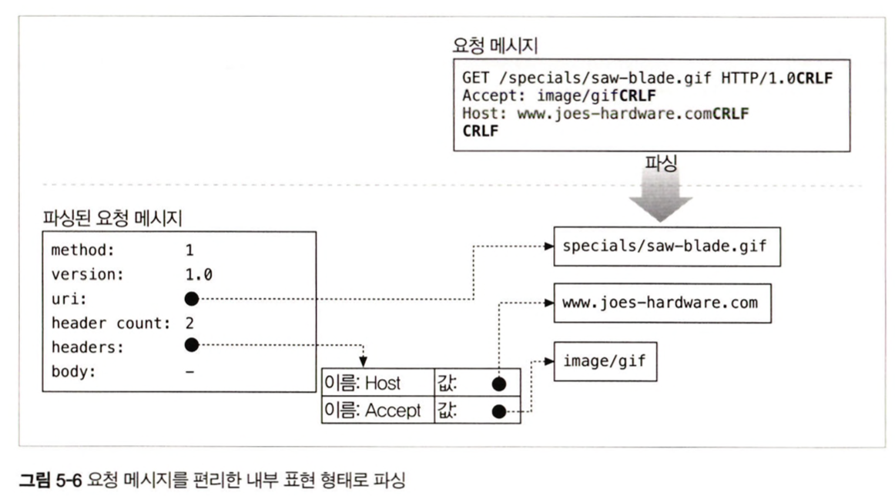
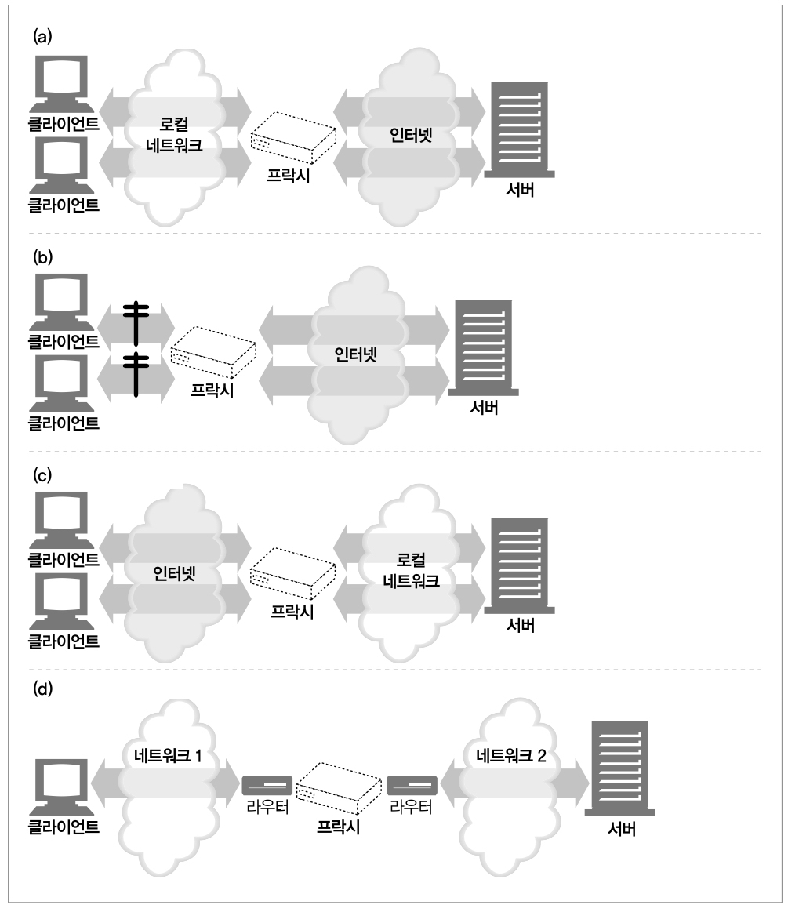

# 5. 웹서버, 6. 프락시

 

## 5 웹서버
- '웹 서버'라는 용어는 웹 서버 소프트웨어와 웹페이지 제공에 특화된 장비 양쪽을 다 가리킨다

 

### 웹 서버 구현
- 웹 서버의 역할
    - HTTP 프로토콜을 구현
    - 웹 리소스를 관리
    - 웹 서버 관리 기능을 제공
- 운영체제의 역할
    - 컴퓨터 시스템의 하드웨어를 관리
    - TCP/IP 네트워크 지원
    - 웹 리소스를 유지하기 위한 파일 시스템 관리
    - 현재 연산 활동 제어를 위한 프로세스 관리
- TCP 커넥션 관리에 대한 책임은 웹 서버와 운영체제가 나눠 갖음
- [웹 서버 순위](https://ko.hostadvice.com/marketshare/server/)

 

### 웹 서버가 하는일
1. 커넥션을 맺음
2. 요청을 받음
3. 요청을 처리
4. 리소스에 접근
5. 응답을 생성
6. 응답을 전송
7. 트랜잭션을 로그로 남김

 

### 새 커넥션 다루기
- 클라이언트가 웹 서버에 TCP 커넥션을 요청하면 웹 서버는 그 커넥션을 맺고 TCP 커넥션에서 IP를 추출하여 커넥션 맞은편에 어떤 클라이언트가 있는지 확인
- 일단 새 커넥션이 맺어지고 받아들여지면 서버는 새 커넥션을 커넥션 목록에 추가하고 커넥션에서 오가는 데이터를 지켜보기 위한 준비를 진행
- 하지만 웹서버는 웹 서버는 어떤 커넥션이든 마음대로 거절하거나 즉시 닫을 수 있음

 

### 클라이언트 호스트 명 식별 (Reverse DNS)
- 대부분 웹 서버는 역방향 DNS를 통해 클라이언트의 IP 주소를 호스트 명으로 변환하고, 이를 접근 제어와 로깅에 이용할 수 있음
- 호스트 명 룩업(hostname lookup)은 꽤 많은 시간이 걸리므로 대부분의 대용량 웹 서버는 호스트 명 분석을 꺼두거나 특정 콘텐츠에 대해서만 켜놓음
- 또한 ident를 사용하여 클라이언트 사용자 알아내기라는 파트가 있으나 보안상의 이유로 거의 사용되지 않으며, 대신에 다른 인증 방법과 함께 HTTPS와 같은 보안 프로토콜이 주로 사용된다고 함
    - 많은 경우에서는 개인 정보 보호 및 보안 상의 이유로 사용되지 않거나 가명화되어 사용될 수 있다고 함

 

### 요청 메시지의 수신 및 메시지의 내부 표현
- 웹 서버는 파싱해서 이해 가능한 수준의 분량을 확보할 때까지 데이터를 네트워크로부터 읽어서 메시지 일부분을 메모리에 임시로 저장할 필요가 있음
- 파싱된 요청메시지를 쉽게 다룰 수 있도록 내부의 자료구조에 저장
- 해당 자료구조에는 요청 메시지의 각 조각에 대한 포인터와 길이를 담을 수 있고 헤더는 속도가 빠른 룩업 테이블에 저장하여 headers에서 참조함

 

 

### 커넥션 입출력 아키텍처
- 요청은 언제라도 도착할 수 있기 때문에 웹 서버들은 항상 새 요청을 주시하는데 웹 서버 아키텍처에 따라 요청을 처리하는 방식이 달라짐
- 단일 스레드 웹 서버
    - 한 번에 요청을 하나씩 처리
    - 구현은 간단하지만 처리 도중에는 다른 모든 커넥션이 기다리고 있어야함
- 멀티 프로세스와 멀티스레드 웹 서버
    - 여러 요청을 동시 처리하기 위해 여러 개의 프로세스 혹은 고효율 스레드를 할당
    - 스레드/프로세스는 필요할 때마다 만들어질 수도 있고 미리 만들어질 수도 있음
    - 스레드/프로세스가 너무 많으면 메모리나 시스템 리소스를 소비하기 때문에 보통 최대 개수를 제한
- 다중 I/O 서버
    - 이 아키텍처에서는, 모든 커넥션이 동시에 그 활동을 감시당하고 있음
    - 어떤 커넥션의 상태가 바뀌면 그 커넥션에 대한 처리가 수행되고 처리가 완료되면 커넥션은 열린 커넥션 목록으로 돌아감
        - 데이터를 사용할 수 있게 되거나 에러가 발생
    - 이렇게 처리했을 때 장점은 실제 데이터 처리가 일어나지 않는 커넥션에게 쓸데없이 차례가 돌아가서 리소스를 낭비하지 않게됨
- 다중 멀티스레드 웹 서버
    - CPU 여러 개의 이점을 살리기 위해 멀티쓰레드와 다중화를 결합한 방법
    - 여러 개의 스레드는 각각 열려있는 커넥션을 감시하고 각 커넥션에 대해 조금씩 작업을 수행함

 

 

### 리소스의 매핑과 접근
- 리소스 매핑의 가장 단순한 형태는 요청 URI를 웹 서버의 파일 이름으로 사용하는 것
- 웹 서버의 특별한 폴더를 웹 콘텐츠를 통해 예약해두는데, 이 폴더를 docroot이라고 부름
- 웹 서버 내부 설정에서 문서 루트를 설정 가능
- 대부분의 성숙한 웹 서버는 루트 위의 파일을 보려고 하는 URI를 허용하지 않음
    - URI에 ../ 같은 키워드를 사용하는 등

 

#### 가상 호스팅된 docroot
- 가상 호스팅 웹 서버는 각 사이트에 그들만의 분리된 문서 루트를 주는 방법으로 하나의 웹 서버에서 여러 개의 웹 사이트를 호스팅함
- 웹 서버는 URI나 Host 헤더에서 얻은 IP 주소나 호스트 명을 이용해서 올바른 문서 루트를 식별을 진행

 

### 디렉터리 목록
- 요청 경로가 파일이 아닌 디렉터리를 가리키는 경우
- 대부분의 웹 서버는 요청한 URL에 대응되는 디렉터리 안에서 index.html 혹은 htm으로 이름 붙은 파일을 찾음
- 아파치 웹 서버의 경우, DirectoryIndex 설정 지시자를 사용해서 기본 디렉터리 파일로 사용될 파일 이름의 집합을 설정할 수 있음
    - 우선순위대로 나열
- 사용자가 디렉터리 URI를 요청했을 때 기본 색인 파일이 없고 디렉터리 색인 기능이 꺼져 있지 않다면, 많은 웹 서버는 자동으로 해당 디렉터리 내 파일들을 크기, 변경일 및 해당 파일에 대한 링크와 함께 열거한 HTML 파일을 반환함

 

### 동적 콘텐츠 리소스 매핑
- 웹 서버는 URI를 동적 리소스에 매핑할 수도 있음
    - 요청에 맞게 콘텐츠를 생성하는 프로그램에 URI를 매핑
- 웹 서버 중 웹 애플리케이션 서버(WAS)라고 불리는 것들은 거의 이런 식으로 웹 서버를 복잡한 백엔드 애플리케이션과 연결하는 일을 함

 

### 응답 MIME 타입 결정하기
- 웹 서버는 응답 본문의 MIME 타입을 결정해야하는 책임이 있음
- 응답 Entity는 다음을 포함
    - 응답 본문의 MIME 타입을 서술하는 Content-Type 헤더
    - 응답 본문의 길이를 서술하는 Content-Length 헤더
    - 실제 응답 본문의 내용
- 서버가 MIME 타입 결정을 위해 파일의 확장자를 읽고, 확장자별 MIME 타입이 담겨 있는 파일을 탐색하여 MIME 타입을 결정지음

 

#### 매직 타이핑 (Magic typing)
- 파일 내용을 검사해서 알려진 패턴에 대한 테이블(매직 파일)에 해당하는 패턴이 있는지 찾아보는 방식
- 느리긴 하지만 파일이 표준 확장자 없이 이름 지어진 경우 사용하기 편리

 

#### 유형 명시 (Explicit typing)
- 파일 확장자나 내용에 관계없이 어떤 MIME 타입을 갖도록 웹 서버가 지정하는 방식

 

#### 유형 협상 (Type negotiation)
- 어떤 웹 서버는 한 리소스가 어려 종류의 문서 형식에 속하도록 설정할 수 있음
- 이때 웹 서버가 사용자와의 협상 과정을 통해 사용하기 가장 좋은 형식(대응하는 MIME 타입)을 판별할 것인지의 여부도 설정 가능
- 또한 웹 서버는 특정 파일이 특정 MIME 타입을 갖게끔 설정할 수 있음

 

### 리다이렉션
- 웹서버는 종종 요청을 수행하기 위해 브라우저가 다른 곳을 가도록 리다이렉트할 수 있음
- 리다이렉션 코드는 3XX 상태 코드로 지칭되며 다음의 경우 유용
    - 영구히 리소스가 옮겨진 경우
    - 임시로 리소스가 옮겨진 경우
    - URL 증강
    - 부하 균형
    - 친밀한 다른 서버가 존재할 경우
    - 디렉터리 이름 정규화

 

### 응답 보내기
- 비지속적인 커넥션
    - 모든 메시지를 전송 후 서버 쪽에서 커넥션을 닫음
- 지속 커넥션
    - 서버가 Content-Length 헤더를 바르게 계산하기 위해 특별한 주의를 필요로 하는 경우 / 클라이언트가 응답이 언제 끝나는지 알 수 없는 경우 커넥션을 열린 상태로 유지

 

## 질의 문제

### 1. Via 헤더와 TRACE 메서드의 각각의 용도

 

정답

- Via 헤더와 TRACE 메서드는 둘다 추적 관련 기능을 가지고 있으나 용도와 구현방식에 차이가 존재

#### Via 헤더
- HTTP 요청이나 응답이 프록시를 통과했음을 확인하기 위해 사용하며 Via 헤더에 경유한 프록시들을 기록
    - Via 헤더는 프로토콜 버전, 이름, 노드 이름, 노드 코멘트를 작성할 수 있음
- HTTP 헤더의 일부로 요청이나 응답에 포함되어 클라이언트와 서버 간의 통신 중 프록시 서버를 거쳤는지 여부와 정보를 담기위한 헤더

#### TRACE 메서드
- 웹 서버에 대한 디버깅 목적으로 사용되어 서버는 해당 요청을 다시 되돌려보내어 클라이언트가 요청이 어떻게 변경이 되었는지 확인하기 위한 메서드
- TRACE 메서드는 HTTP 프로토콜의 일부이며 요청의 목적
- 프록시에 대한 추적이 아닌 요청에 대한 디버깅 목적으로 사용되는 메서드

 

### 2. 어떻게 사용할지에 대한 프락시 배치 방법의 종류는?

 

 

a. 로컬 네트워크와 인터넷을 연결하는 사이 로컬 네트워크 출구에 위치
b. ISP(Internet Service Provider) 접근 지점에 위치
c. 네트워크 끝인 웹 서버 바로 앞에 위치
d. 네트워크 사이의 인터넷 피어링 교환 지점에 위치

<b>

정답

#### a. (개인 LAN) 출구 프락시
- 내부 네트워크에서 외부로 나가는 트래픽을 중개하고 제어하는 데 사용
    - 내부 네트워크와 외부 인터넷 간의 경계에 위치하며, 주로 회사 밖의 방화벽 뒤에 배치
- 인터넷 액세스와 관련된 트래픽을 관리하고 모니터링하는 데 사용
    - 회사 밖의 방화벽 혹은 인터넷 요금 절약 및 트래픽 성능 개선을 위해 사용
    - 부적절한 콘텐츠를 브라우징 하는 것을 막기 위해 필터링 용도로도 사용
    - 내부 네트워크에서 외부로 나가는 트래픽 관리

#### b. (ISP) 접근(입구) 프락시
- 외부에서 내부로 들어오는 트래픽을 중개하고 보호하며 고객으로부터의 모든 요청을 종합적으로 처리
- 주로 웹 서버의 부하 분산, 보안 검사 및 인증, 캐싱 등의 기능을 수행
    - 내부 네트워크를 보호하고 외부로부터 접근을 제어
- 사용자들의 다운로드 속도를 개선하고 인터넷 대역폭 비용을 줄이기 위해 캐시 프락시를 사용해 많이 사용하는 문서의 사본 저장

#### c. 대리 프락시
- 웹 서버로 향하는 모든 요청을 처리하고 필요할 때만 웹 서베에게 자원을 요청
- 웹 서버에 보안 기능을 추가하거나 서버 캐시용도로 사용하여 성능 개선
- 대리 프락시는 웹 서버의 이름과 IP 주소로 스스로를 가장하기 때문에 모든 요청은 서버가 아닌 프락시로 가게됨

#### d. 네트워크 교환 프락시
- 네트워크 레벨에서 트래픽을 중개하고 제어하는 데 사용
- 주로 네트워크 레벨에서의 보안 검사, 필터링, 캐싱 등의 기능을 수행
    - 캐시를 이용해 인터넷 혼잡을 완화하고 트래픽을 감시

