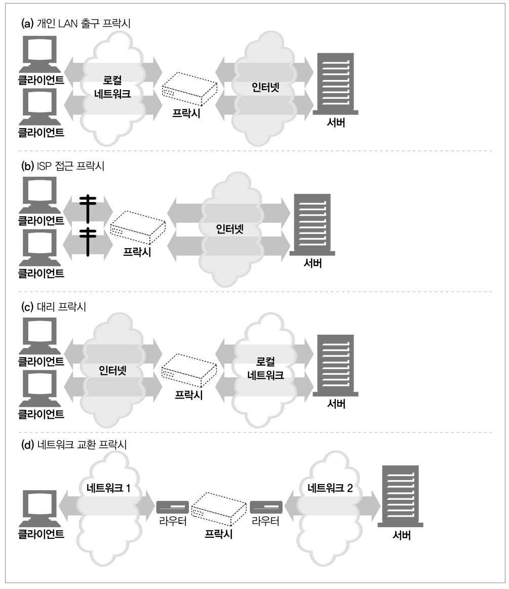
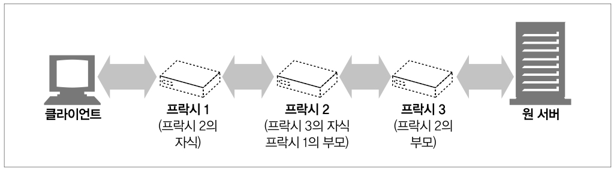
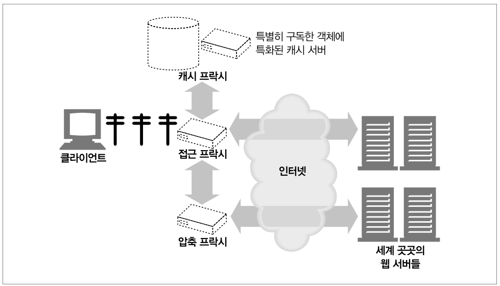

# 5. 웹서버, 6. 프락시

<br>

## 5 웹서버
- '웹 서버'라는 용어는 웹 서버 소프트웨어와 웹페이지 제공에 특화된 장비 양쪽을 다 가리킨다

<br>

### 웹 서버 구현
- 웹 서버의 역할
    - HTTP 프로토콜을 구현
    - 웹 리소스를 관리
    - 웹 서버 관리 기능을 제공
- 운영체제의 역할
    - 컴퓨터 시스템의 하드웨어를 관리
    - TCP/IP 네트워크 지원
    - 웹 리소스를 유지하기 위한 파일 시스템 관리
    - 현재 연산 활동 제어를 위한 프로세스 관리
- TCP 커넥션 관리에 대한 책임은 웹 서버와 운영체제가 나눠 갖음
- [웹 서버 순위](https://ko.hostadvice.com/marketshare/server/)

<br>

### 웹 서버가 하는일
1. 커넥션을 맺음
2. 요청을 받음
3. 요청을 처리
4. 리소스에 접근
5. 응답을 생성
6. 응답을 전송
7. 트랜잭션을 로그로 남김

<br>

### 새 커넥션 다루기
- 클라이언트가 웹 서버에 TCP 커넥션을 요청하면 웹 서버는 그 커넥션을 맺고 TCP 커넥션에서 IP를 추출하여 커넥션 맞은편에 어떤 클라이언트가 있는지 확인
- 일단 새 커넥션이 맺어지고 받아들여지면 서버는 새 커넥션을 커넥션 목록에 추가하고 커넥션에서 오가는 데이터를 지켜보기 위한 준비를 진행
- 하지만 웹서버는 웹 서버는 어떤 커넥션이든 마음대로 거절하거나 즉시 닫을 수 있음

<br>

### 클라이언트 호스트 명 식별 (Reverse DNS)
- 대부분 웹 서버는 역방향 DNS를 통해 클라이언트의 IP 주소를 호스트 명으로 변환하고, 이를 접근 제어와 로깅에 이용할 수 있음
- 호스트 명 룩업(hostname lookup)은 꽤 많은 시간이 걸리므로 대부분의 대용량 웹 서버는 호스트 명 분석을 꺼두거나 특정 콘텐츠에 대해서만 켜놓음
- 또한 ident를 사용하여 클라이언트 사용자 알아내기라는 파트가 있으나 보안상의 이유로 거의 사용되지 않으며, 대신에 다른 인증 방법과 함께 HTTPS와 같은 보안 프로토콜이 주로 사용된다고 함
    - 많은 경우에서는 개인 정보 보호 및 보안 상의 이유로 사용되지 않거나 가명화되어 사용될 수 있다고 함

<br>

### 요청 메시지의 수신 및 메시지의 내부 표현
- 웹 서버는 파싱해서 이해 가능한 수준의 분량을 확보할 때까지 데이터를 네트워크로부터 읽어서 메시지 일부분을 메모리에 임시로 저장할 필요가 있음
- 파싱된 요청메시지를 쉽게 다룰 수 있도록 내부의 자료구조에 저장
- 해당 자료구조에는 요청 메시지의 각 조각에 대한 포인터와 길이를 담을 수 있고 헤더는 속도가 빠른 룩업 테이블에 저장하여 headers에서 참조함

<br>


<br>

### 커넥션 입출력 아키텍처
- 요청은 언제라도 도착할 수 있기 때문에 웹 서버들은 항상 새 요청을 주시하는데 웹 서버 아키텍처에 따라 요청을 처리하는 방식이 달라짐
- 단일 스레드 웹 서버
    - 한 번에 요청을 하나씩 처리
    - 구현은 간단하지만 처리 도중에는 다른 모든 커넥션이 기다리고 있어야함
- 멀티 프로세스와 멀티스레드 웹 서버
    - 여러 요청을 동시 처리하기 위해 여러 개의 프로세스 혹은 고효율 스레드를 할당
    - 스레드/프로세스는 필요할 때마다 만들어질 수도 있고 미리 만들어질 수도 있음
    - 스레드/프로세스가 너무 많으면 메모리나 시스템 리소스를 소비하기 때문에 보통 최대 개수를 제한
- 다중 I/O 서버
    - 이 아키텍처에서는, 모든 커넥션이 동시에 그 활동을 감시당하고 있음
    - 어떤 커넥션의 상태가 바뀌면 그 커넥션에 대한 처리가 수행되고 처리가 완료되면 커넥션은 열린 커넥션 목록으로 돌아감
        - 데이터를 사용할 수 있게 되거나 에러가 발생
    - 이렇게 처리했을 때 장점은 실제 데이터 처리가 일어나지 않는 커넥션에게 쓸데없이 차례가 돌아가서 리소스를 낭비하지 않게됨
- 다중 멀티스레드 웹 서버
    - CPU 여러 개의 이점을 살리기 위해 멀티쓰레드와 다중화를 결합한 방법
    - 여러 개의 스레드는 각각 열려있는 커넥션을 감시하고 각 커넥션에 대해 조금씩 작업을 수행함

<br>


<br>

### 리소스의 매핑과 접근
- 리소스 매핑의 가장 단순한 형태는 요청 URI를 웹 서버의 파일 이름으로 사용하는 것
- 웹 서버의 특별한 폴더를 웹 콘텐츠를 통해 예약해두는데, 이 폴더를 docroot이라고 부름
- 웹 서버 내부 설정에서 문서 루트를 설정 가능
- 대부분의 성숙한 웹 서버는 루트 위의 파일을 보려고 하는 URI를 허용하지 않음
    - URI에 ../ 같은 키워드를 사용하는 등

<br>

#### 가상 호스팅된 docroot
- 가상 호스팅 웹 서버는 각 사이트에 그들만의 분리된 문서 루트를 주는 방법으로 하나의 웹 서버에서 여러 개의 웹 사이트를 호스팅함
- 웹 서버는 URI나 Host 헤더에서 얻은 IP 주소나 호스트 명을 이용해서 올바른 문서 루트를 식별을 진행

<br>

### 디렉터리 목록
- 요청 경로가 파일이 아닌 디렉터리를 가리키는 경우
- 대부분의 웹 서버는 요청한 URL에 대응되는 디렉터리 안에서 index.html 혹은 htm으로 이름 붙은 파일을 찾음
- 아파치 웹 서버의 경우, DirectoryIndex 설정 지시자를 사용해서 기본 디렉터리 파일로 사용될 파일 이름의 집합을 설정할 수 있음
    - 우선순위대로 나열
- 사용자가 디렉터리 URI를 요청했을 때 기본 색인 파일이 없고 디렉터리 색인 기능이 꺼져 있지 않다면, 많은 웹 서버는 자동으로 해당 디렉터리 내 파일들을 크기, 변경일 및 해당 파일에 대한 링크와 함께 열거한 HTML 파일을 반환함

<br>

### 동적 콘텐츠 리소스 매핑
- 웹 서버는 URI를 동적 리소스에 매핑할 수도 있음
    - 요청에 맞게 콘텐츠를 생성하는 프로그램에 URI를 매핑
- 웹 서버 중 웹 애플리케이션 서버(WAS)라고 불리는 것들은 거의 이런 식으로 웹 서버를 복잡한 백엔드 애플리케이션과 연결하는 일을 함

<br>

### 응답 MIME 타입 결정하기
- 웹 서버는 응답 본문의 MIME 타입을 결정해야하는 책임이 있음
- 응답 Entity는 다음을 포함
    - 응답 본문의 MIME 타입을 서술하는 Content-Type 헤더
    - 응답 본문의 길이를 서술하는 Content-Length 헤더
    - 실제 응답 본문의 내용
- 서버가 MIME 타입 결정을 위해 파일의 확장자를 읽고, 확장자별 MIME 타입이 담겨 있는 파일을 탐색하여 MIME 타입을 결정지음

<br>

#### 매직 타이핑 (Magic typing)
- 파일 내용을 검사해서 알려진 패턴에 대한 테이블(매직 파일)에 해당하는 패턴이 있는지 찾아보는 방식
- 느리긴 하지만 파일이 표준 확장자 없이 이름 지어진 경우 사용하기 편리

<br>

#### 유형 명시 (Explicit typing)
- 파일 확장자나 내용에 관계없이 어떤 MIME 타입을 갖도록 웹 서버가 지정하는 방식

<br>

#### 유형 협상 (Type negotiation)
- 어떤 웹 서버는 한 리소스가 어려 종류의 문서 형식에 속하도록 설정할 수 있음
- 이때 웹 서버가 사용자와의 협상 과정을 통해 사용하기 가장 좋은 형식(대응하는 MIME 타입)을 판별할 것인지의 여부도 설정 가능
- 또한 웹 서버는 특정 파일이 특정 MIME 타입을 갖게끔 설정할 수 있음

<br>

### 리다이렉션
- 웹서버는 종종 요청을 수행하기 위해 브라우저가 다른 곳을 가도록 리다이렉트할 수 있음
- 리다이렉션 코드는 3XX 상태 코드로 지칭되며 다음의 경우 유용
    - 영구히 리소스가 옮겨진 경우
    - 임시로 리소스가 옮겨진 경우
    - URL 증강
    - 부하 균형
    - 친밀한 다른 서버가 존재할 경우
    - 디렉터리 이름 정규화

<br>

### 응답 보내기
- 웹서버는 여러 클라이언트에 대한 많은 커넥션을 가질 수있는데 그런 커넥션을 추적해야하며 지속적인 커넥션은 주의해서 다루어야함
- 비지속적인 커넥션
    - 모든 메시지를 전송 후 서버 쪽에서 커넥션을 닫음
- 지속 커넥션
    - 서버가 Content-Length 헤더를 바르게 계산하기 위해 특별한 주의를 필요로 하는 경우 / 클라이언트가 응답이 언제 끝나는지 알 수 없는 경우 커넥션을 열린 상태로 유지

<br>

### 로깅
- 트랜잭션이 완료되었을 때 웹 서버는 트랜잭션이 어떻게 수행되었는지 로그를 로그를 로그파일에 기록함

<br>

## 6. 프락시
- 프락시는 클라이언트와 서버 사이에 위치하여 그들 사이의 HTTP 메시지를 정리하는 중개인처럼 동작
- 웹 프락시가 있다면 클라이언트는 HTTP 서버와 직접 메시지를 보내는 대신 자신의 입장에서 서버와 대화해주는 프락시와 연결

<br>

### 개인 프락시와 공유 프락시
- 프락시 서버는 하나의 클라이언트가 독점적으로 사용할 수도 있고, 여러 클라이언트가 공유할 수도 있음
    - 하나의 클라이언트만을 위한 프락시를 개인 프락시
    - 여러 클라이언트가 함께 사용하는 프락시는 공용 프락시
- 대부분의 프락시는 공용이며 공유된 프락시로 중앙 집중형 프락시를 관리하는게 비용 효율이 높고 쉬움
- 개인 전용 프락시는 흔하지는 않지만 클라이언트 컴퓨터에서 직접 실행되는 형태로 브라우저 보조 제품을은 브라우저 기능 확장이나 성능 개선, 광고 운영 등을 위해 작은 프락시를 사용자의 컴퓨터에서 실행

<br>

### 프락시와 게이트웨이
- 프락시는 같은 프로토콜을 사용하는 둘 이상의 애플리케이션을 연결하고 사이에서 중개자 역할을 하는 서버
- 게이트웨이는 서로 다른 프로토콜을 사용하는 둘 이상을 연결하고 사이에서 중개자 역할을 하는 서버
- 브라우저와 서버는 다른 버전의 HTTP를 구현하기 때문에, 프락시는 때때로 약간의 프로토콜 변환을 하기도해서 둘의 차이는 모호하다고 함
    - 상용 프락시 서버는 SSL 보안 프로토콜, SOCKS 방화벽, FTP 접근, 그리고 웹 기반 애플리케이션을 지원하기 위해 게이트웨이 기능을 구현

<br>

### 프락시 사용 이유
- 어린이 필터
    - 성인 콘텐츠를 차단하는 등의 필터링
- 문서 접근 제어자
    - 웹 리소스에 대해 단일한 접근 제어 전략을 구사하고 감사 추적을 위해 사용
- 보안 방화벽
    - 조직안에 들어오거나 나가는 응용 레벨 프로토콜의 흐름을 네트워크의 한 지점에서 통제하는 보안기능
- 웹 캐시
    - 자주 들르는 문서의 로컬 사본을 관리하고 해당 문서에 대한 요청이 오면 빠르게 제공하는 캐시
- 대리 프락시(Surrogate)
    - 웹 서버 요청을 받지만 웹 서버와는 달리 요청 받은 콘텐츠의 위치를 찾아내기 위해 다른 서버와 커뮤니케이션을 시작하는 대리 또는 리버스 프락시
    - 공용 콘텐츠에 대한 느린 웹서버의 성능을 개선하기 위해 사용될 수 있는데 이런식으로 사용하는 대리 프락시를 흔히 서버 가속기라고 부름
- 콘텐츠 라우터
    - 트래픽 조건과 콘텐츠의 종류에 따라 요청을 특정 웹 서버로 유도
    - 부하분산을 위한 로드 밸런싱
- 트랜스코더
    - 콘텐츠를 클라이언트에게 전달하기 전에 본문 포맷을 수정할 수 있음
    - GIF -> JPG, 색 강도 조절, 텍스트 파일 압축, 텍스트 변환등의 트랜스코딩
- 익명화 프락시
    - HTTP 메시지에서 신원을 식별할 수 있는 특성(클라이언트 IP 주소, From 헤더, Referer 헤더, 쿠키, URI 세션 아이디)들을 적극적으로 제거하는 익명화
    - 메시지를 다음과 같이 변경
        - User-Agent 헤더에서 사용자의 컴퓨터와 OS의 종류를 제거
        - 사용자의 이메일 주소를 보호하기 위해 From 헤더 제거
        - 어떤 사이트를 거쳐서 방문했는지 알기 어렵게 하기 위해 Referer 헤더 제거
        - 프로필과 신원 정보를 없애기 위해 Cookie 헤더 제거

<br>

### 배치 위치에 따른 프락시
- 어떻게 프락시가 네트워크에 배치되는가, 어떻게 프락시의 연쇄가 계층을 이루는가, 어떻게 트래픽이 올바르게 프락시를 찾아가는가에 따라 예시는 다음과 같음

<br>



- 출구 프락시
    - 로컬 네트워크와 더 큰 인터넷 사이를 오가는 트래픽을 제어하기 위해 프락시를 로컬 네트워크의 출구에 위치
    - 회사 밖의 악의적인 해커들을 막는 방화벽을 제공하기 위해, 혹은 인터넷 요금을 절약하고 인터넷 트래픽의 성능을 개선하기 위해 회사에서 출구 프락시를 사용할 수 있음
    - 초등학교에서는 조숙한 학생들이 부적절한 콘텐츠를 브라우징하는 것을 막기 위해 필터링 출구 프락시를 사용할 수 있음
- 접근 (입구) 프락시
    - 고객으로부터의 모든 요청을 종합적으로 처리하기 위해 프락시는 ISP(Internet Service Provider) 접근 지점에 위치하기도함
    - ISP는 사용자들의 다운로드 속도를 개선하고(특히 고속 접속 사용자들을 위해) 인터넷 대역폭 비용을 줄이기 위해 캐시 프락시를 사용해 많이 찾는 문서들의 사본을 저장
- 대리 (리버스) 프락시
    - 대리 프락시는 네트워크의 가장 끝에 있는 웹 서버들의 바로 앞에 위치하여 웹 서버로 향하는 모든 요청을 처리하고 필요할 때만 웹 서버에게 자원을 요청할 수 있음
    - 웹 서버에 보안 기능을 추가하거나 빠른 웹 서버 캐시를 느린 웹 서버의 앞에 놓음으로써 성능을 개선할 수도 있음
    - 대리 프락시는 일반적으로 웹 서버의 이름과 IP 주소로 스스로를 가장하기 때문에, 모든 요청은 서버가 아닌 이 프락시로 가게됨
- 네트워크 교환 프락시
    - 캐시를 이용해 인터넷 교차로의 혼잡을 완화하고 트래픽 흐름을 감시하기 위해, 충분한 처리 능력을 갖춘 프락시가 네트워크 사이의 인터넷 피어링 교환 지점들에 놓일 수 있음

<br>

### 프락시 계층
- 프락시들은 프락시 계층이라고 불리는 연쇄를 구성할 수 있음
- 프락시 계층에서, 메시지는 최종적으로 원 서버에 도착할 때까지 프락시와 프락시를 거쳐 이동함(그 후 다시 같은 프락시들을 역순으로 거쳐 클라이언트로 돌아옴)
- 프락시 계층에서 프락시 서버들은 부모와 자식의 관계를 갖는다. 다음번 인바운드 프락시(서버에 가까운 쪽)를 부모라고 부르고 다음번 아웃바운드 프락시(클라이언트 가까운 쪽)는 자식이라고 부름
- 프락시 서버들은 부모와 자식의 관계를 갖고, 네트워크 통신은 주로 다운스트림 방향으로 흐름

<br>



<br>

```
인바운드
- 인바운드 네트워크 트래픽은 외부에서 내부로 향하는 데이터를 가르킴
- 웹 서버로의 HTTP 요청이나 이메일 서버로의 이메일 수신은 인바운드 트래픽에 해당

아웃바운드
- 아웃바운드 네트워크 트래픽은 내부에서 외부로 향하는 데이터를 가르킴
- 사용자가 웹 브라우저를 통해 웹페이지를 요청하거나 내부 이메일 서버에서 외부로 이메일을 보내는 것은 아웃바운드 트래픽에 해당

업스트림
- 데이터의 원본 또는 출발지
- 데이터 전달 흐름 중 위의 시점으로 이해하는 것이 좋을 것 같음

다운스트림
- 네트워크는 데이터의 목적지
- 네트워크 통신은 거의 다운스트림 방향으로 흐름
```

<br>

### 프록시 계층 콘텐츠 라우팅
- 프락시 계층은 정적임. 프락시 1은 언제나 메시지를 프락시 2로 보내고, 프락시 2는 언제나 메시지를 프락시 3으로 보냄
- 그러나 계층이 반드시 정적이어야 하는 것은 아니다. 프락시 서버는 여러 가지 판단 근거에 의해 메시지를 다양하고 유동적인 프락시 서버와 원 서버들의 집합에게 보낼 수 있음
- 아래 그림에서, 접근 프락시는 상황에 맞게 부모 프락시나 원 서버에게 라우팅함
    - 요청된 객체가 콘텐츠 분산을 위해 돈을 지불한 웹 서버에 속한 경우, 프락시는 요청을 가까운 캐시 서버에게 보내 캐시된 객체를 반환하거나 그럴 수 없을 때는 서버에서 가져오게 할 수 있음
    - 요청이 특정 종류의 이미지에 대한 것인 경우, 접근 프락시는 그 요청을 특화된 압축 프락시에게 보내어 그 프락시가 이미지를 가져와 압축하게 하여 느린 모뎀으로 접속했더라도 빠르게 클라이언트가 다운로드할 수 있게함

<br>



- 부하 균형
    - 자식 프락시는 부하를 분산하기 위해 현재 부모들의 작업량 수준에 근거하여 부모 프락시를 고름
- 지리적 인접성에 근거한 라우팅
    - 자식 프락시는 원 서버의 지역을 담당하는 부모를 선택할 수도 있음
- 프로토콜/타입 라우팅
    - 어떤 자식 프락시는 URI에 근거하여 다른 부모나 원 서버로 라우팅 할 수 있다. 어떤 특정 종류의 URI를 갖고 있는 요청의 경우, 특별한 프락시 서버로 보내져 특별한 프로토콜로 처리될 수도 있음
- 유료 서비스 가입자를 위한 라우팅
    - 웹서비스 운영자가 빠른 서비스를 위해 추가금을 지불했다면, 그들의 URI는 대형 캐시나 성능 개선을 위한 압축 엔진으로 라우팅 될 수 있음
- 동적 부모 라우팅 로직은 제품(설정 파일, 스크립트 언어, 동적으로 실행 가능한 플러그인 등)마다 다르게 구현함

<br>

### 클라이언트가 프락시를 찾는 방법
1. 클라이언트를 수정
    - 많은 웹 브라우저들은 수동 혹은 자동 프락시 설정을 지원
2. 네트워크를 수정
    - HTTP 트래픽을 지켜보고 가로채어(인터셉트 프락시) 클라이언트 모르게 트래픽을 프락시로 보내는 스위칭 장치와 라우팅 장치를 필요로 함
3. DNS 이름 공간 수정
    - 웹 서버 앞에 위치하는 대리 프락시는 웹 서버의 이름과 IP 주소를 자신이 직접 사용
4. 웹 서버를 수정
    - HTTP 리다이렉션 명령을 클라이언트에게 돌려줌으로써 클라이언트의 요청을 프락시로 리다이렉트 하도록 설정할 수 있음

<br>

### 인터셉트(대리) 프락시는 부분 URI
- 클라이언트는 자신이 프락시와 대화하고 있음을 알고 있지 않을 수 있는데 몇몇 프락시는 클라이언트에게는 보이지 않을 수 있기 때문
- 대리 프락시는 원 서버의 호스트 명과 아이피 주소를 사용해 원 서버를 대신하는 프락시 서버
- 네트워크 흐름에서 클라이언트에서 서버로 가는 트래픽을 가로채 캐시된 응답을 돌려주는 등의 일을 하기에, 부분 URI를 얻게됨

<br>

### 전송 중 URI 변경
- 아주 사소하고 무해해 보이는 URI 변경이라도 다운스트림 서버와 상호운용성 문제를 야기할 수 있음
- 프락시 서버는 가능한 관대해야 하며, 특히 인터셉트 프락시가 URI를 전달할 때 절대 경로를 고쳐 쓰는 것을 금지함
- 오직 빈 경로를 '/'로 교체하는 것만이 유일한 예외

<br>

### URI 클라이언트 자동확장과 호스트명 분석
- 브라우저는 요청 URI를 상황에 따라 다르게 분석을 진행함
    - 프락시가 없다면 URI에 대응하는 IP 주소를 찾음
    - 호스트명이 발견되면 그에 대응하는 IP 주소들을 연결해 성공할 때까지 시도
- 호스트 명까지 발견을 못했다면 자동화된 호스트명의 확장을 제공
    - www.접두사를 붙이고, .com 접미사를 붙임
    - 해석 불가능한 URI를 서드파티 사이트로 넘기기도 하며, 오타 교정을 시도하고 사용자가 의도했을 URI를 제시함
    - 대부분 DNS는 사용자가 호스트 명의 앞부분만 입력하면 자동으로 도메인을 검색하도록 설정되어 있음

<br>

### 메시지 추적
- 이제 클라이언트에서 서버로 흘러가는 요청이 둘 이상의 프락시를 지나는 일은 흔한 일이며 프락시를 넘나드는 메시지의 흐름을 추적하고 문제점을 찾아내는 것도 필요한 일이 됨
- 이에 사용하는 방법은 Via 헤더와 TRACE 메서드

<br>

### Via 헤더
- HTTP 헤더의 일부로 요청이나 응답에 포함되어 클라이언트와 서버 간의 통신 중 중간 노드(프락시 혹은 게이트웨이) 거쳤는지 여부와 정보를 담기위한 헤더
- 메시지가 중간 노드(프락시나 게이트웨이)를 지날때마다 해당 정보가 Via목록의 끝에 반드시 추가되어야함
- 메시지의 전달을 추적하고, 메시지 루프를 진단하고, 요청을 보내고 그에 대한 응답을 돌려주는 과정에 관여하는 모든 메시지 발송자들의 프로토콜을 다루는 능력을 알아보기 위해 사용됨

<br>

### TRACE 메서드
- TRACE 메서드는 요청 메시지를 프락시의 연쇄를 따라가면서 어떤 프락시를 지나가고 어떻게 각 프락시가 요청 메시지를 수정하는지 관찰/추적할 수 있도록 함
- TRACE 메서드는 HTTP 프로토콜의 일부이며 요청의 목적으로 클라이언트가 요청이 어떻게 변경되었는지 확인하는 메서드

<br>

### 프락시 상호 운용성
- 클라이언트, 서버, 프락시는 HTTP 명세의 여러 버전에 대해 여러 벤더에 의해 만들어짐
- 프락시 서버가 넘어오는 헤더 필드들을 모두 이해할수는 없으므로 지원하지 않는 헤더와 메서드를 다룸
    - 이해할 수 없는 헤더 필드는 반드시 그대로 전달
    - 같은 이름의 헤더 필드가 여러 개 있다면 그들의 상대적인 순서를 반드시 유지함
    - 어떤 메서드와 친숙하지 않다면, 가능한 한 그 메시지를 다음 홉으로 전달하려 시도해야 함
- OPTIONS
    - 서버의 특정 리소스가 어떤 기능을 지원하는지(메서드) 클라이언트가 알아볼 수 있게 함
    - OPTIONS * HTTP/1.1 : 서버 전체의 능력에 대해 물음
- Allow 헤더
    - 지원되는 메서드들이나 서버가 지원하는 모든 메서드(요청 URI가 *인 경우)를 열거
    - 클라이언트는 원 서버와 대화하는 다른 경로를 갖고 있을 수도 있기 때문에 프락시는 Allow 헤더 필드를 수정할 수 없음

<br>


<br>

## 질의 문제

### 1. Via 헤더와 TRACE 메서드의 각각의 용도

<br>

<details>
<summary>정답</summary>

- Via 헤더와 TRACE 메서드는 둘다 추적 관련 기능을 가지고 있으나 용도와 구현방식에 차이가 존재

#### Via 헤더
- HTTP 요청이나 응답이 프록시를 통과했음을 확인하기 위해 사용하며 Via 헤더에 경유한 프록시들을 기록
    - Via 헤더는 프로토콜 버전, 이름, 노드 이름, 노드 코멘트를 작성할 수 있음
- HTTP 헤더의 일부로 요청이나 응답에 포함되어 클라이언트와 서버 간의 통신 중 프록시 서버를 거쳤는지 여부와 정보를 담기위한 헤더

#### TRACE 메서드
- 웹 서버에 대한 디버깅 목적으로 사용되어 서버는 해당 요청을 다시 되돌려보내어 클라이언트가 요청이 어떻게 변경이 되었는지 확인하기 위한 메서드
- TRACE 메서드는 HTTP 프로토콜의 일부이며 요청의 목적
- 프록시에 대한 추적이 아닌 요청에 대한 디버깅 목적으로 사용되는 메서드

</details>

<br>

### 2. 어떻게 사용할지에 대한 프락시 배치 방법의 종류는?

<br>


<br>

a. 로컬 네트워크와 인터넷을 연결하는 사이 로컬 네트워크 출구에 위치

b. ISP(Internet Service Provider) 접근 지점에 위치

c. 네트워크 끝인 웹 서버 바로 앞에 위치

d. 네트워크 사이의 인터넷 피어링 교환 지점에 위치

<b>

<details>
<summary>정답</summary>

#### a. (개인 LAN) 출구 프락시
- 내부 네트워크에서 외부로 나가는 트래픽을 중개하고 제어하는 데 사용
    - 내부 네트워크와 외부 인터넷 간의 경계에 위치하며, 주로 회사 밖의 방화벽 뒤에 배치
- 인터넷 액세스와 관련된 트래픽을 관리하고 모니터링하는 데 사용
    - 회사 밖의 방화벽 혹은 인터넷 요금 절약 및 트래픽 성능 개선을 위해 사용
    - 부적절한 콘텐츠를 브라우징 하는 것을 막기 위해 필터링 용도로도 사용
    - 내부 네트워크에서 외부로 나가는 트래픽 관리

#### b. (ISP) 접근(입구) 프락시
- 외부에서 내부로 들어오는 트래픽을 중개하고 보호하며 고객으로부터의 모든 요청을 종합적으로 처리
- 주로 웹 서버의 부하 분산, 보안 검사 및 인증, 캐싱 등의 기능을 수행
    - 내부 네트워크를 보호하고 외부로부터 접근을 제어
- 사용자들의 다운로드 속도를 개선하고 인터넷 대역폭 비용을 줄이기 위해 캐시 프락시를 사용해 많이 사용하는 문서의 사본 저장

#### c. 대리 프락시
- 웹 서버로 향하는 모든 요청을 처리하고 필요할 때만 웹 서버에게 자원을 요청
- 웹 서버에 보안 기능을 추가하거나 서버 캐시용도로 사용하여 성능 개선
- 대리 프락시는 웹 서버의 이름과 IP 주소로 스스로를 가장하기 때문에 모든 요청은 서버가 아닌 프락시로 가게됨

#### d. 네트워크 교환 프락시
- 네트워크 레벨에서 트래픽을 중개하고 제어하는 데 사용
- 주로 네트워크 레벨에서의 보안 검사, 필터링, 캐싱 등의 기능을 수행
    - 캐시를 이용해 인터넷 혼잡을 완화하고 트래픽을 감시

</details>