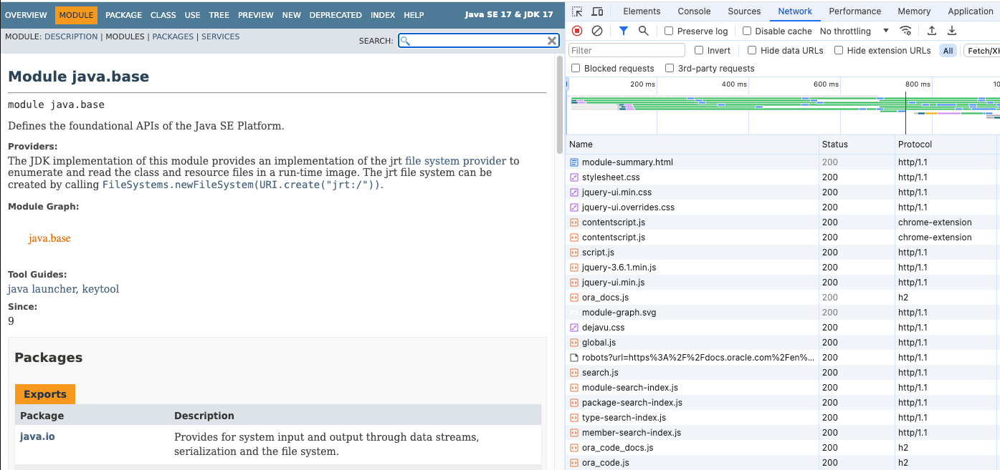
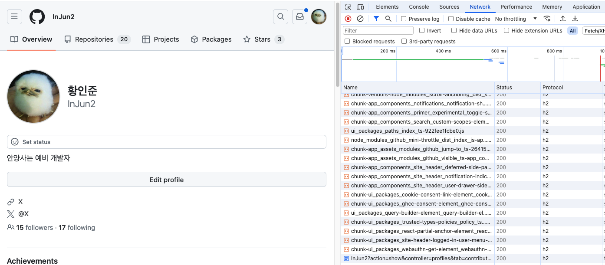
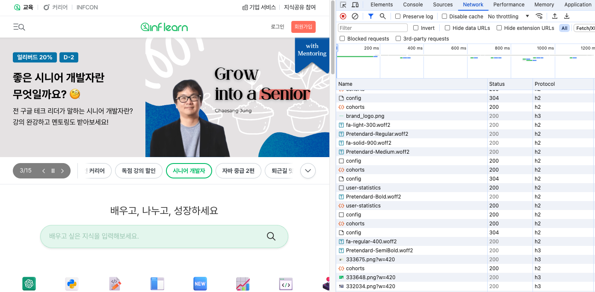
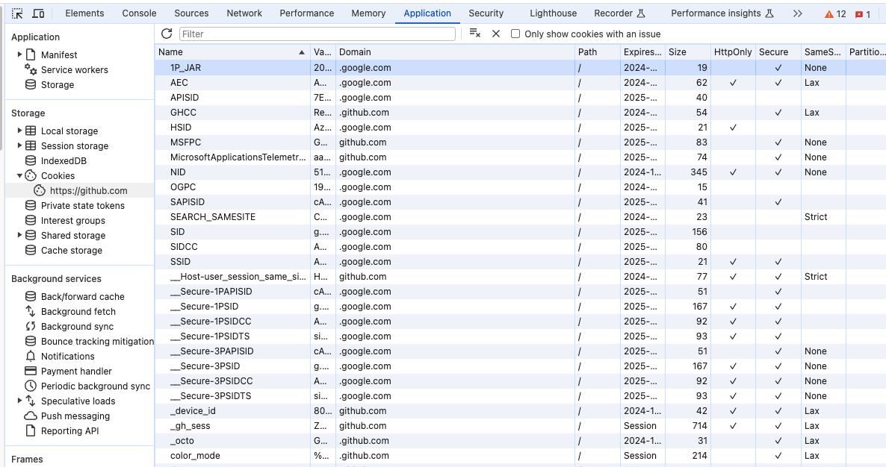

# 10. HTTP/2.0, 11. 클라이언트 식별과 쿠키, 12. 기본 인증

<br>

## 10. HTTP/2.0
### 궁금한 내용
- 현재는 3.0 버전까지 사용하는 것으로 알고있는데 현재는 대부분 2.0을 사용하고 있는 것이 맞는지
- HTTP/2.0을 사용한다면 서버와 클라이언트는 어떻게 사용할 수 있는지

<br>

## 11. 클라이언트 식별과 쿠키
### 궁금한 내용
- 지난 프로젝트에서 LocalStorage 에 Jwt 토큰을 저장해두고 사용했는데 쿠키에 저장하고 사용하는 것이 더 옳은지
    - 특정 헤더명을 생성하여 Jwt 전송/수신
- 현재 쿠키를 사용할때 Verson1는 사용하지 않는지
- 쿠키 캐시에서 보수적인 캐시가 Set-Cookie 텍스트가 아닌 이미지만 캐시하는 이유?
- 특정 홈페이지에 들어가면 쿠키를 허용하시겠습니까? 라는 문구가 나오는데 이를 허용하여야 브라우저에 쿠키를 저장하는 건지?

<br>

## 12. 기본 인증
### 궁금한 내용
- Http Basic authorization 은 현재 주로 사용하고 있는지
    - base-64 인코딩/디코딩이 default 인지

<br>

## 찾아본 내용

<br>

### 현재 주요 시용 HTTP 버전
- 톰캣의 기본 설정은 1.1로 지정이 되어 있지만 대부분 2.0을 사용하는 추세인 것 같음

<br>





<br>

### HTTP/2.0 버전을 사용하는 방법
- Apache Tomcat 기본 설정은 HTTP/1.1 이 기본 값
- SpringBoot 에서는 application.yml 설정을 변경해주면됨
```yml
server:
    http2:
        enabled: true
```

<br>

- GPT를 통한 브라우저에서 HTTP/2.0 요청 방법은 다음과 같음
```
Google Chrome
- Chrome에서는 HTTP/2.0을 기본적으로 지원합니다. 따라서 별도의 설정 변경이 필요하지 않습니다. 하지만 필요한 경우 chrome://flags 페이지에서 "Enable HTTP/2.0" 또는 "Experimental QUIC protocol" 등의 옵션을 활성화할 수 있습니다.

Mozilla Firefox
- Firefox에서도 HTTP/2.0을 기본적으로 지원합니다. 설정 변경이 필요하지 않으며, 특별한 경우에는 about:config 페이지에서 network.http.spdy.enabled.http2.enabled 옵션을 확인할 수 있습니다.

Microsoft Edge
- Edge에서도 HTTP/2.0을 기본적으로 지원합니다. 따라서 별도의 설정 변경이 필요하지 않습니다.

HTTP 요청 헤더에서 사용하는 경우
- 일부 경우에는 클라이언트에서 HTTP 요청 헤더를 수정하여 HTTP/2.0을 사용하도록 지정할 수 있습니다. 이는 개발자가 직접 HTTP 요청을 보내는 경우에 사용될 수 있습니다
- 예를 들어, cURL을 사용하는 경우 -H "Connection: upgrade, HTTP2-Settings"와 같은 헤더를 추가하여 HTTP/2.0을 요청할 수 있습니다.
```

<br>

### 개발자 모드 쿠키 확인


<br>

### 웹 토큰 보관장소 LocalStorage vs Cookie
- LocalStorage 보다 Cookie에 토큰을 저장하여 Js를 통해 사용하지 못하도록 하는 것이 좋음
- 백엔드 위주 시점에서 보면 엑세스 토큰과 리프레시 토큰을 처리하기 위해 선택적으로 상황에 맞춰 사용할 수 있다고 함

<br>

### 현재 사용 쿠키 버전은 Cookie Version0 이 맞는지?
- 현재 Cookie Version 0은 RFC 2109, Version 1은 RFC 2965 이지만 현재는 RFC 6265를 사용한다고 함
- 쿠키 보안, 개인 정보 보호 및 기능성 향상을 통해 RFC 6265가 표준

<br>

### 쿠키 캐시에서 보수적인 캐시가 Set-Cookie 텍스트가 아닌 이미지만 캐시하는 이유?
- 텍스트는 주로 요청마다 처리해야하고 이미지는 정적 데이터로 변경이 거의 없고 반복적으로 요청되는 경향이 있어 캐시하는 것이 좋을 것
    - Set-Cookie 설정을 통하여 지정이 가능하긴함
- 쿠키는 사용자별로 동적으로 생성되며, 사용자에 따라 변경될 수 있으므로 캐시하기가 적절하지 않을 수 있음
    - 텍스트는 사용자의 정보가 포함될 수도 있을 것이고 요청과 응답마다 바뀔 수 있음

<br>

### 특정 사이트에서 쿠키를 허용 여부를 묻는 이유
- 해당 홈페이지에서 쿠키를 사용하여 사용자 경험을 개선하거나 서비스를 제공하기 위해 여부를 묻는 것
- 주로 다음과 같은 서비스를 수행
    - 쿠키 수집 및 저장 : 사용자의 브라우저에 쿠키를 저장하여 브라우저 세션 동안 혹은 지속적으로 저장될 수 있음
    - 개인화 및 사용자 추적 : 쿠키의 사용자의 선호도와 행동을 기록하여 개인화된 경험을 제공하고 행동을 추적
    - 로그인 유지 : 쿠키를 통해 로그인 상태를 유지하는데 사용될 수 있음. 이후 브라우저를 당아도 로그인 상태 유지 가능
    - 분석 및 통계 수집 : 사용자 활동을 분석하고 통계를 수집하는데 사용되어 해당 통계로 서비스를 개선할 수 있음

<br>

### Http Basic authorization 은 현재 주로 사용하는지?
- 해당 인증 방법은 사용자 이름과 비밀번호를 Base64로 인코딩/디코딩 하여 사용하는 일반적인 방법인데 이는 안전하지 않아 사용하지 않음
- Http Basic authorization은 간단하고 쉽게 구현할 수 있어 일부 서비스에서는 사용할 수도 있음
    - 임시적인 인증이 필요한 경우
- 현재는 OAuth, JWT, OAuth 2.0 등의 방법을 주로 사용

<br>

## 연습문제

<br>

### Q1. Http/1.1과 Http/2.0의 차이는 무엇인가요?

<details>
<summary>정답</summary>

### 공통점
- 같은 HTTP 메시지를 사용
- TCP 프로토콜 아래에서 데이터 전송
    - 상태 코드나 메서드, 헤더와 본문 동일
- HTTP 캐시나 인증, 보안 기능 동일하게 지원

<br>

#### HTTP/1.1
- TCP 커넥션 하나에 한 번의 요청과 응답을 개별적으로 처리
- HTTP 메시지를 텍스트 기반으로 전송

<br>

#### HTTTP/2.0
- TCP 커넥션 하나에 여러 요청과 응답을 동시에 다중화하여 처리
    - 회전 지연 회피로 병목 현상을 줄이고 응답 속도 향상
    - 하나의 TCP 연결에서 여러 요청을 동시에 처리
- 이진 프레임으로 단일 TCP 연결에서 여러 개의 스트림으로 데이터를 전송
    - 스트림에 대해 흐름제어와 우선순위 부여 기능도 제공
- 서버 푸시 기능을 지원하여 클라이언트의 추가 요청없이 필요할 수 있는 리소스를 클라이언트에게 미리 보낼 수 있음
    - 웹 페이지 로딩 시간을 단축하고 성능을 향상시킴
- 헤더 필드를 효율적으로 압축하여 불필요한 데이터 전송을 최소화

<br>

</details>

<br>

### Q2. 현재 Set-Cookie2 헤더를 사용하지 않는 이유는 무엇인가요?

<details>
<summary>정답</summary>

- 기존 Cookie Version1 (RFC 2965)에서 여러 쿠키 속성들을 사용하기 위해 만들어졌으나 현재는 RFC 6265로 대체되고 해당 버전은 폐기 되었음
    - Set-Cookie2 헤더는 이제 사용되지 않는 표준
    - Cookie Version0은 RFC 2109 인데 해당 버전의 쿠키는 보안 및 개인 정보 보호 측면에서 덜 안전하고 기능이 제한적이라고 함
- Set-Cookie2는 복잡한 쿠키 관리 시스템을 가지고 있었고 이는 오버엔지니어링 되었다고 판단되어 쿠키 관리를 더 간소화하고 효율적으로 구현
    - FRC 6265는 기존과 같이 Set-Cookie 속성을 이용
- RFC 6265는 쿠키 보안 및 개인 정보에 대해 더 많은 지침을 제공하여 더 안전한 쿠키 관리를 도와줌
    - Secure, HttpOnly 플래그를 사용하고 SameSite 속성을 사용해서 CSRF 공격을 방지한다고 함
    - 쿠키 만료 날짜와 시간을 정확하게 지정할 수 있으며 쿠키 도메인 및 경로에 대한 제한 설정을 할 수 있음
- RFC 6265는 HTTP 쿠키의 확장성을 고려하여 설계되어 기존의 구조를 활용하여 확장이 가능

<br>

</details>