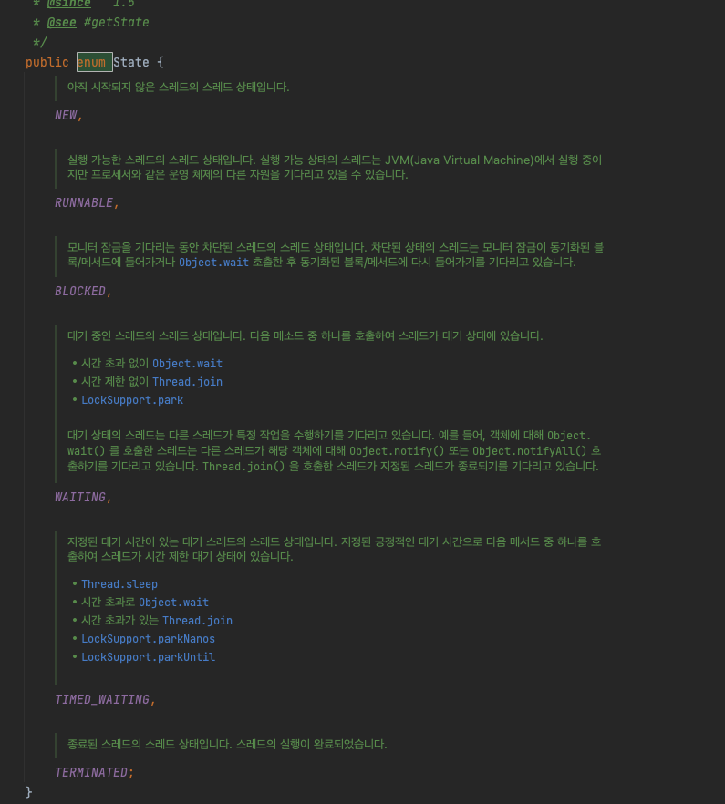

# 3 Week ( 5 ~ 6 챕터)

## 5. 구성 단위

<br>

## 부족하게 알고있는 내용

### Thread State
- 책에서는 스레드가 블록되면 동작이 멈춘 블록된 상태로 BLOCKED, WAITING, TIME_WAITING을 가진다고 함
- [스레드의 상태](https://docs.oracle.com/javase%2F7%2Fdocs%2Fapi%2F%2F/java/lang/Thread.State.html)는 다음과 같음
    - NEW : 아직 시작되지 않은 스레드 상태
    - RUNNABLE : JVM에서 실행 중인 스레드 상태
    - BLOCKED : 모니터 락을 기다리며 차단된 스레드 상태
    - WAITING : 다른 스레드가 특정 작업을 수행하기를 무한정 기다리는 스레드 상태 (특정 이벤트를 기다리는 상태)
    - TIMED_WAITING : 지정된 대기 시간까지 다른 스레드가 작업을 수행하기를 기다리는 스레드 상태 (특정 시간동안 일시정지하는 상태)
    - TERMINATED : 종료된 스레드 상태

<br>



<br>

### 동기화 클래스
- 상태 정보를 사용해 스레드 간의 작업 흐름을 조절할 수 있도록 만들어진 모든 클래스
- 아래 클래스는 모두 java.util.concurrent 패키지에 구현체가 존재
- 블로킹 큐(Blocking Queue)
    - 스레드 간에 데이터를 안전하게 전달하기 위한 자료구조로 큐의 크기가 정해져 있음
    - 큐가 가득차거나 비어있는 상태에서 데이터를 추가하거나 제거하려고 하면 해당 작업 블록
    - 구현체 : LinkedBlockingQueue, ArrayBlockingQueue
- 세마포어(Semaphore)
    - 공유된 자원에 대한 접근을 제어하기 위한 동기화 기법
    - 특정 개수의 스레드가 동시에 접근할 수 있는 권한을 가지고 있음
    - 구현체 : Semaphore
- 배리어(Barrier)
    - 여러 스레드가 동시에 특정 지점에서 모이기를 기다리는 동기화 기법
    - 주로 작업이 여러 단계로 나누어져 있을 때, 각 단계가 완료될 때마다 모든 스레드가 함께 다음 단계로 진행하기를 기다림
    - 구현체 : CyclicBarrier
- 래치(Latch)
    - 특정 조건이 충족될 때까지 다른 스레드를 대기시키는 동기화 기법
    - 일종의 카운트다운 메커니즘이며, 초기값이 설정되고 해당 값이 0이 될 때까지 기다리게됨
    - 구현체 : CountDownLatch

<br>

### concurrent 패키지
- Java에서 다중 스레드 환경에서의 프로그래밍을 지원하기 위한 유틸리티 클래스와 인터페이스를 제공
    - Executor 및 ExecutorService 인터페이스
    - ScheduledExecutorService 인터페이스
    - Future 및 FutureTask 클래스
    - ConcurrentMap 인터페이스 및 ConcurrentHashMap 클래스
    - BlockingQueue 인터페이스 및 해당 구현체들
    - Semaphore, CyclicBarrier, CountDownLatch 클래스

<br>

### Runnable
- 반환 타입이 없이 run() 메서드를 사용하여 스레드를 실행하기 위해 사용하는 인터페이스
    - [참조](https://docs.oracle.com/javase/8/docs/api/java/lang/Runnable.html)
- 자바 8이후로 함수형 인터페이스 사용가능
- 하위 인터페이스
    - RunnableFuture
    - RunnableScheduledFuture
- 구현 클래스
    - FutureTask 
    - Thread
    - TimerTask


<br>

### Callable
- 결과를 반환하고 예외를 발생시킬 수 있는 스레드를 실행할 수 있는 인터페이스
    - [참조](https://docs.oracle.com/javase/8/docs/api/java/util/concurrent/Callable.html)
- 람다식 또는 메서드 참조로 스레드를 실행할 수 있음
- 예외를 발생시키는 call() 메서드만을 가지고 있음

<br>


<br>

### Future
- 비동기에서 계산의 결과를 나타내는 인터페이스
    - [참조](https://docs.oracle.com/javase/8/docs/api/java/util/concurrent/Future.html)
- 계산이 완료되었는지 확인하고, 완료될 때까지 기다리고 계산결과를 검색하는 메서드가 제공됨
- 결과는 get 계산이 완료된 경우에만 메서드를 사용하여 검색할 수 있으며 필요한 경우 준비될때까지 차단되며 계산이 완료되었다면 계산을 취소할 수 없음

<br>

```java
// 이 작업의 실행을 취소하려고 시도
boolean cancel(boolean mayInterruptIfRunning);

// 작업이 정상적으로 완료되기 전에 취소된 경우 true 반환
boolean isCancelled();

// 작업이 완료되면 true 반환
boolean isDone();

// 필요한 경우 계산이 완료될 때까지 기다린 다음 결과를 검색
/*
    발생 예외
    CancellationException – 계산이 취소된 경우
    ExecutionException - 계산에서 예외가 발생한 경우
    InterruptedException – 현재 스레드가 대기하는 동안 중단된 경우
*/
V get() throws InterruptedException, ExecutionException;

// 위와 동일하나 최대 주어진 시간 동안 기다린다음 결과를 검색
/*
    발생 예외, 위의 예외는 모두 여전히 발생
    TimeoutException - 대기 시간이 초과된 경우
*/
V get(long timeout, TimeUnit unit)
        throws InterruptedException, ExecutionException, TimeoutException;
```

<br>

### FutureTask
- Runnable과 Future을 상속받은 RuuableFuture 인터페이스를 상속받은 구현체 클래스로 비동기적으로 스레드를 실행하며 작업의 결과를 제공하고 작업 상태를 추적할 수 있음
    - Runnable과 Future은 서로 관련이 없음
    - [참조](https://docs.oracle.com/javase/8/docs/api/java/util/concurrent/FutureTask.html)
- 생성자로 Callable 이나 혹은 Runnable과 초기 결과값을 가진 변수를 입력으로 받음
    - 반환 값이 필요없다면 입력 result에 null을 입력할 수 있음
- 이후 작업이 완료됬다면 result를 반환할 수 있음

<br>

```java
// 해당 클래스는 Runnable, Future 메서드를 모두 상속받아 해당 기능 구현
boolean cancel(boolean mayInterruptIfRunning);
boolean isCancelled();
boolean isDone();
V get() throws InterruptedException, ExecutionException;
V get(long timeout, TimeUnit unit)
        throws InterruptedException, ExecutionException, TimeoutException;
void run();
```

<br>


<br>


<br>

### ConcurrentHashMap 캐싱
- 했던 일을 반복하지 않게하기 위해서 캐시기능을 구현하지만 병렬 처리 환경일 경우 여러 문제가 발생
- 우선 입력에 대한 결과를 저장하는 메모이제이션 기법을 사용하여 캐시를 구현이 되어있음
- HashMap을 사용하고 접근에 동기화 하는 방법은 병렬성이 좋지 않음
- 또한 같은 입력에 대해 동시에 여러 스레드가 접근하면 서로 스레드가 접근한지 모르고 각자 계산 진행 문제 발생 가능성 있음
- 또한 스레드의 상태를 확인하는 복합 연산에서 여러 스레드가 같이 확인되어 각각 계산되는 문제 발생 가능성 있음

<br>

```java
public class Memoizer<A, V> implements Computable<A, V>{
    // HashMap에 접근하는 방법을 동기화하는 것은 병렬성이 좋지 않아 병렬 처리로 하는 이유가 없음. 동기화를 제공하는 자료구조 ConcurrentHashMap 사용
    // 또한 캐시를 두 스레드에서 확인했을 때 같은 입력에 대해 둘다 계산을 처리할 수 있음. 해당 처리를 방지하기 위해 계산 상태를 추적해주는 Future 사용
    private final Map<A, Future<V>> cache = new ConcurrentHashMap<A, Future<V>>();
    private final Computable<A, V> c;

    public Memoizer(Computable<A, V> c){
        this.c = c;
    }
           
    public V compute(A arg) throws InterruptedException{
        while(true){
            Future<V> f = cache.get(arg);
            if(f == null){
                Callable<V> eval = new Callable<V>(){
                    public V call() throws InterruptedException{
                        return c.compute(arg);
                    }
                };
                FutureTask<V> ft = new FutureTask<V>(eval);
                // 위의 Future 인스턴스 if문을 동시에 접근한다면 두 스레드는 각자 계산된 값이 없다고 판단해 새로운 연산을 시작할 수 있음
                // 해당 상황을 방지하기 위해 ConcurrentHashMap에서 지원하는 단일 연산 메서드 putIfAbsent()를 사용
                f = cache.putIfAbsent(arg,ft);
                if( f == null){f = ft; ft.run(); }
            }
                                
            try{
                return f.get();
            }catch(CancellationException e){
                cache.remove(arg, f);
            }catch(ExecutionException e){
                throw launderThrowable(e.getCause());
            }
        }
    }
}
```

<br>

### 1부 요약
1. 상태가 바뀔 수 있단 말이다!
    - 병렬성과 관련된 모든 문제점은 변경 가능한 변수에 접근하려는 시도를 적절하게 조율하는 것으로 해결할 수 있다. 변경 가능성이 낮으면 낮을수록 스레드 안전성을 확보하기가 쉽다.
2. 변경 가능한 값이 아닌 변수는 모두 final로 선언하라.
3. 불변 객체는 항상 그 자체로 스레드 안전하다.
    - 불변 객체는 병렬 프로그램을 엄청나게 간편하게 작성할 수 있도록 해준다. 불변 객체는 간결하면서 안전하고, 락이나 방어적 복사 과정을 거치지 않고도 얼마든지 공유해 사용할 수 있다.
4. 캡슐화하면 복잡도를 쉽게 제어할 수 있다.
    - 데이터를 객체 내부에 캡슐화하면 값이 변경되는 자유도를 쉽게 제어할 수 있다. 객체 내부에서 동기화하는 기법을 캡슐화하면 동기화 정책을 손쉽게 적용할 수 있다.
5. 변경 가능한 객체는 항상 락으로 막아줘야 한다.
6. 불변 조건 내부에 들어가는 모든 변수는 동일한 락으로 막아줘야 한다.
7. 복합 연산을 처리하는 동안에는 항상 락을 확보하고 있어야 한다.
8. 여러 스레드에서 변경 가능한 변수의 값을 사용하도록 되어 있으면서 적절한 동기화 기법이 적용되지 않은 프로그램은 올바른 결과를 내놓지 못한다.
9. 동기화할 필요가 없는 부분에 대해서는 일부러 머리를 써서 고민할 필요가 없다. (동기화할 필요가 없다고 추측한 결론에 의존해서는 안된다)
10. 설계 단계부터 스레드 안전성을 염두에 두고 있어야 한다. 아니면 최소한 결과물로 작성된 클래스가 스레드에 안전하지 않다고 반드시 문서로 남겨야 한다.
11. 프로그램 내부의 동기화 정책에 대한 문서를 남겨야 한다.

<br>

## 6. 작업 실행
- 작업이란 추상적, 명확하게 구분된 업무 단위
- 애플리케이션 요구 사항을 작업 단위로 분할하면 프로그램 구조 간결, 트랜잭션 범위 지정으로 오류 효과적 대응, 작업 실행의 병렬성 극대화가 가능

<br>

### 스레드에서 작업 실행
- 병렬성 보장을 위해 완전히 독립적인 동작을 작업의 범위로 지정해야 함
- 작업 스케줄링, 부하 분산(load balancing)을 하려면 작업 단위를 충분히 작게 구성

<br>

### 작업마다 스레드를 직접 생성
- 작업 요청마다 스레드를 생성하는 것은 다음과 같음
    - 작업 처리하는 기능이 메인 스레드와 분리되어 서버의 응답속도 증가
    - 동시에 여러 작업을 병렬로 처리할 수 있어 서버의 처리속도 증가
    - 프로그램이 동시에 동작할 가능성이 높지만 스레드 안전성이 필요함
    - 요청이 들어오는 속도보다 요청을 빨리 처리해야 함

<br>

### 스레드를 많이 생성할 때의 문제점
- 스레드 라이프 사이클 문제
    - 스레드를 생성하고 제거하는 과정도 자원 소모
    - 작업 부하보다 스레드 생성 부하가 더 클 수 있음
- 자원 낭비
    - 실행 중인 스레드는 메모리를 소모
    - CPU 개수는 한계가 있기에 대부분의 스레드는 대기(idle) 상태가 됨
    - 대기 상태 스레드가 증가하여 메모리가 많이 소모됨
    - CPU를 사용하기 위해 스레드간 경쟁도 자원 소모
- 해당 문제점들 때문에 애플리케이션이 만들 수 있는 스레드 수 제한해야 함
- 제한된 스레드만으로 동작할 때 너무 많은 요청이 들어오는 상황에도 멈추지 않는지 테스트 필요

<br>

### Executor
- 자바 클래스 라이브러리에서 작업을 실행하고자 할때 Thread보다 Executor가 추상화가 잘 되어 있으며 사용하기 좋음
- 아주 다양한 여러 가지 종류의 작업 실행 정책을 지원하는 유연하고 강력한 비동기적 작업 실행 프레임워크의 근간인 인터페이스
- 프로듀서-컨슈머 패턴에 기반하며 해당 패턴을 가장 쉽게 구현할 수 있는 방법이 Exector 프레임워크를 사용하는 것
- 실행 정책은 다음과 같음
    - 작업을 어느 스레드에서 실행할 것인지?
    - 작업을 어떤 순서로 실행할 것인지? (FIFO, LIFO, 우선순위)
    - 몇 개까지 병렬 실행할 것이지?
    - 큐에 최대 몇 개까지 대기할 수 있게할 것 인지?
    - 시스템에 부하가 많이 걸려 작업을 거절해야 하는경우 어떤 작업을 희생하고 작업을 요청한 프로그램에 어떻게 알릴 것인지?
    - 작업 실행 직전, 직후에 어떤 동작이 있어야하는지?

<br>

### Executor 인터페이스
- 제출된 작업을 실행하는 인터페이스
    - [참조](https://docs.oracle.com/javase/8/docs/api/java/util/concurrent/Executor.html)
- Executor 클래스는 execute() 메서드 하나를 가짐

```java
// new Thread(new RunnableTask()).start() 대신 해당 방법으로 사용
Executor executor = anExecutor();
executor.execute(new RunnableTask1());

// Executor 메서드, 미래의 특정 시점에 주어진 명령을 실행
void execute(Runnable command);
```

<br>


<br>

### Executors 클래스
- 스레드 풀, 스레드 팩토리 등을 생성하고 반환하는 정적 팩토리 메서드를 제공
    - [참조](https://docs.oracle.com/javase/8/docs/api/java/util/concurrent/Executors.html)
- Executor , ExecutorService , ScheduledExecutorService , ThreadFactory 및 Callable 클래스에 대한 팩토리 및 유틸리티 메서드

<br>

```
newFixedThreadPool(int nThreads): 지정된 수의 스레드를 가진 고정 크기의 스레드 풀을 생성합니다.
newCachedThreadPool(): 필요에 따라 스레드를 동적으로 생성하는 캐시형 스레드 풀을 생성합니다.
newSingleThreadExecutor(): 단일 스레드로 구성된 스레드 풀을 생성합니다.
newScheduledThreadPool(int corePoolSize): 지정된 수의 스레드를 가진 스케줄링 기능이 있는 스레드 풀을 생성합니다.
newSingleThreadScheduledExecutor(): 단일 스레드로 구성된 스케줄링 기능이 있는 스레드 풀을 생성합니다.
defaultThreadFactory(): 기본 ThreadFactory를 반환합니다.
callable(Runnable task, T result): Runnable을 Callable로 변환하는 래퍼를 생성합니다.
callable(Callable<T> task): 주어진 Callable 객체를 반환합니다.
```

<br>

### ExecutorService
- 스레드풀을 관리하거나 작업을 처리하는 인터페이스
- 애플리케이션에서 스레드 생성 및 관리, 작업 스케줄링, 처리 등을 할 수 있음
    - [참조](https://docs.oracle.com/javase/8/docs/api/java/util/concurrent/ExecutorService.html)

<br>

### Thread Pool
- 작업을 처리할 수 있는 동일한 스레드를 풀 형태로 관리
- 작업 큐와 굉장히 밀접한 관련이 있음
- 장점은 다음과 같음
    - 이전 사용 스레드 재사용하여 새로운 스레드를 생성할 필요가 없어 필요한 시스템 자원 감소
    - 스레드가 이미 만들어진 상태로 대기하므로 작업 실행시 딜레이가 적어 전체적인 반응속도 증가
    - 크기가 적절하다면 하드웨어 프로세서가 쉬지 않고 동작 가능
    - 하드웨어는 쉬지 않고 동작하는 동시에, 메모리 전부 소모의 경우나 스레드 자원 경쟁 가능성이 줄어듬
- Executors가 기본 제공하는 스레드 풀은 다음과 같음
    - newFixedThreadPool : 처리될 작업이 등록되면 그에 따라 실제 작업할 스레드를 하나씩 생성. 스레드 최대 개수 제한
    - newCachedThreadPool : 스레드 개수를 제한하지 않고 쉬는 스레드를 종료
    - newSingleThreadExecutor : 단일 스레드로 동작하는 Executor. 작업이 반드시 큐에 지정된 순서 순차적 처리 보장
    - newScheduledThreadPool : 일정 시간 이후 실행, 주기적 작업 실행

<br>

### Executor 동작 주기
- JVM은 모든 스레드가 종료되기 전에 종료하지 않고 대기하기 때문에 Executor를 제대로 종료시키지 않으면 JVM 자체가 종료되지 않고 대기하기도 함
- 애플리케이션을 종료하는 방법으로 안전한 종료, 강제적인 종료 방법이 있음
    - 안전한 종료(graceful) : 작업을 새로 등록하지 못하게하고 시작된 모든 작업을 끝날때 까지 기다림
    - 강제적인 종료(abrupt) : 플러그를 빼서 전원을 바로나가게하여 작업을 종료
- ExecutorService 에는 동작 주기 관리 인터페이스 제공함
    - shutdown : 안전한 종료, 새로운 작업 등록하지 않고, 대기 중인 작업 종료까지 기다림
    - shutdownNow : 강제 종료, 현재 진행 중인 작업 가능한 취소, 대기 중인 작업 실행 하지 않음
    - awaitTermination : 종료 상태까지 대기
    - isTerminated : 종료 상태에 들어갔는지 확인하는 메서드

<br>

### Timer 클래스
- 등록된 작업 실행을 스레드를 하나씩 생성하여 실행
- 특정 작업이 오래 실행되면 등록된 다른 TimerTask 작업이 지연되어 예정된 시간에 실행되지 않을 수 있음
- TimerTask가 도중에 예상치 못한 예외를 던져버리는 경우 예측하지 못한 상태로 넘어가고 Timer 스레드가 멈춰버릴 수 있음
    - 해당 상황 발생시 새로운 스레드를 생성해주지도 않음
    - 해당 Timer에 등록되어 있던 모든 작업이 취소된 상황이라 간주해야하며 실행되지 않고 새로운 작업을 등록할 수도 없음
- Timer 대신 ScheduledThreadPoolExecutor를 사용하라고 함
    - 지연 작업과 주기적 작업마다 여러 개의 스레드를 할당하여 실행 예정 시간을 벗어나지 않음
    - 오류에 대해 훨씬 안정적으로 처리가 가능
- 특별한 스케줄링 방법을 지원하는 스케줄링 서비스를 구현해야 한다면 BlockingQueue를 구현하면서 ScheduledThreadPoolExecutor와 비슷한 기능을 제공하는 DelayQueue를 사용하는 것을 추천
    - DelayQueue는 큐 내부에 여러 개의 Delayed 객체로 작업을 관리하며 각각의 Delayed 객체는 저마다의 시각을 가지고 있음
    - Delayed 내부의 시각이 만료된 객체만 take() 메서드로 가져갈 수 있음
    - DelayQueue에서 뽑아내는 객체는 객체마다 지정되어 있던 시각 순서로 정렬되어 뽑아짐

<br>

### Timer -> ScheduledThreadPoolExecutor
```java
private void replyLetterTimeTask(Long letterId) {
    Timer timer = new Timer();
    TimerTask timerTask = new TimerTask() {
        @Override
        public void run() {
            Letter letter = letterRepository.findById(letterId).get();
            if (LetterState.RECEIVE_WAITING.equals(letter.getState())) {
                letter.updateLetterState(LetterState.EXPIRATION);
                saveLetter(letter);
                log.info("letter Id : " + letter.getId() + " , 해당 답변은 만료되었습니다");
            }
        }
    };
    timer.schedule(timerTask, 1000 * 60 * 30);
}
```

<br>

```java
public class ReplyLetterScheduler {
    private final ScheduledThreadPoolExecutor executor = new ScheduledThreadPoolExecutor(10);

    public void replyLetterTimeTask(Long letterId) {
        long delayMillis = TimeUnit.MINUTES.toMillis(30);
        executor.schedule(() -> executeTask(letterId), delayMillis, TimeUnit.MILLISECONDS);
    }

    private void executeTask(Long letterId) {
        Letter letter = letterRepository.findById(letterId).get();
        if (LetterState.RECEIVE_WAITING.equals(letter.getState())) {
            letter.updateLetterState(LetterState.EXPIRATION);
            saveLetter(letter);
            log.info("Letter Id : " + letter.getId() + " , 해당 답변은 만료되었습니다");
        }
    }
}
```

<br>

- 근데 생각해보니 유사하게 내부적으로 큐를 사용하고 요청이 들어오면 해당 서비스에서 편지의 상태를 변경하고 편지의 Entity와 현재 시간을 저장
- 이후 스케줄링을 통해 1분마다 해당 큐에서 30분 이후인 Entity가 나오기 전까지 편지를 만료로 바꿔도 될 것 같음