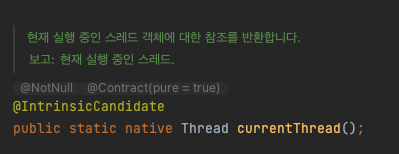
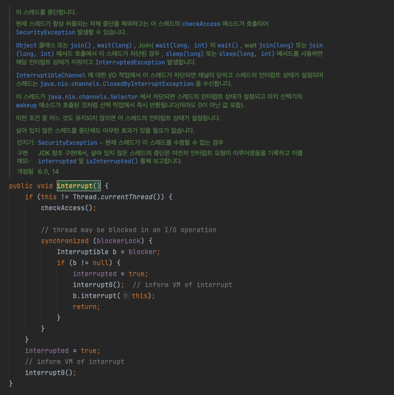
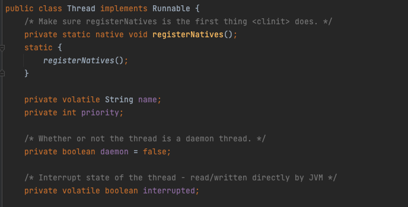
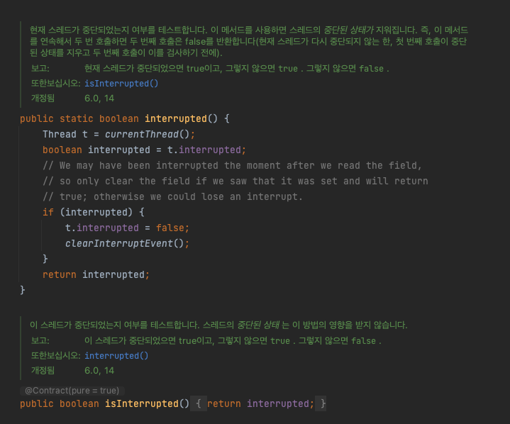
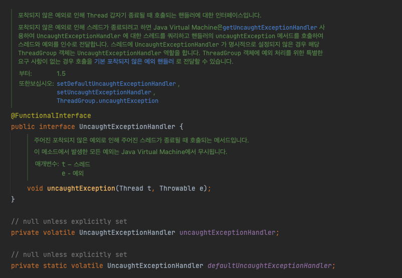
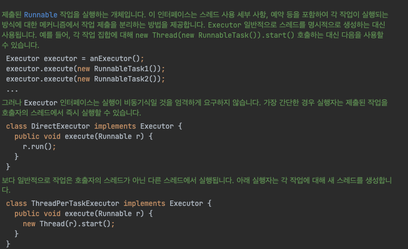
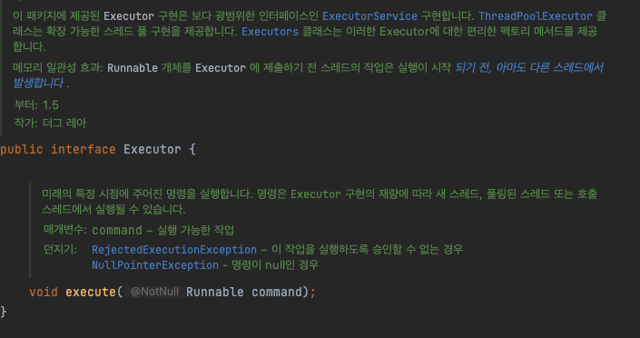
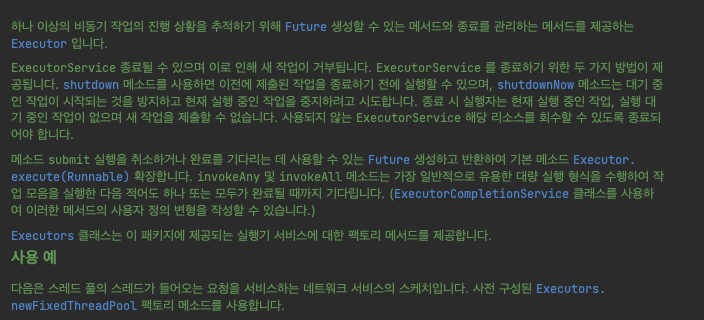
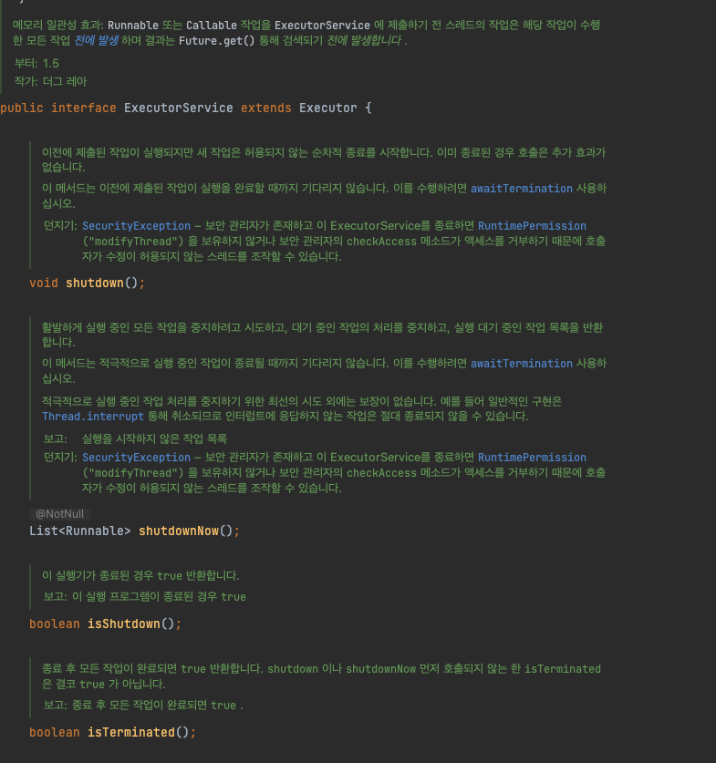

# 4 Week ( 7 챕터 )

## 7. 중단 및 종료

<br>

## 1. 작업 중단
- 작업이나 스레드를 시작시키기는 쉽지만 언제 멈출지는 작업이 끝까지 실행되어 봐야 알 수 있음
- 자바에서는 강제로 멈출 수 있는 방법이 없어 인터럽트를 이용해 특정 스레드에게 작업을 멈춰 달라고 요청함
- 실행 중인 작업을 취소하고자 하는 경우
    - 사용자가 취소하기를 요청한 경우 : 취소 버튼을 누른경우
    - 시간이 제한된 작업 : 일정 시간 내에서만 동작을 해야하고 그 시간이 지나면 작업은 모두 취소됨
    - 어플리케이션 이벤트 : 특정 작업 결과로 원하는 값을 얻으면 나머지는 모두 종료
    - 오류 : 특정 작업에서 오류가 발생하면 다른 작업도 모두 취소해야함. 하지만 이후 오류 상황을 정리하고 계속 실행할 수 있도록 기록하는 작업이 필요할 수 있음
    - 종료 : 어플리케이션이 종료 할때는 현재 처리하는 중이었던 작업에 대한 내용들이 마무리 하는 절차가 필요
- 작업 스레드와 취소 요청한 스레드가 함께 작업을 멈추는 협력적인 방법을 사용해야 함
    - 협력적인 방법 중 가장 기본적인 형태는 취소 요청 플러그를 사용하고 확인하는 방법

<br>

### 이전 내용 정리
- [Runnable, Callable, Future](https://github.com/InJun2/TIL/blob/main/BookStudy/자바카페/병렬프로그래밍/Week3.md)
- 블로킹 메서드
    - InterruptedException이 발생할 수 있는 메서드
        - I/O 작업이 끝나기를 기다리는 경우
        - 락을 확보하기 위해 기다리는 경우
        - Thread.sleep() 끝나기를 기다리는 경우
        - 다른 스레드가 작업 중인 내용의 결과를 확인하기 위해 기다리는 경우
    - 블록당해있는 스레드에서 인터럽트가 발생하였을 때 InterrupedException이 발생
- 블로킹큐에 추가되어있는 작업들은 현재 생성할 수 있는 스레드가 없어 대기하는데 해당 상태가 스레드가 BLOCK 되어 있음

<br>

### 인터럽트
- 기본적인 취소 정책(취소 플래그)을 사용하는 작업 내부에서 BlockingQueue.put 과 같은 블로킹 메소드를 호출하는 부분이 있다면 큰 문제가 발생할 수 있음
- 작업 내부에서 취소 요청이 들어 왔는지를 확인하지 못하는 경우도 생길 수 있으며, 작업이 영원히 멈추지 않을 수도 있음
- 컨슈머가 가져가는 것보다 프로듀서가 소수를 찾아내는 속도가 더 빠르다면 큐는 곧 가득 찰 것이며 큐의 put 메소드는 블록될 것
- 실제 상황에서는 작업을 중단하고자 하는 부분이 아닌 다른 부분에 인터럽트를 사용한다면 오류가 발생하기 쉬울 수 밖에 없으며, 애플리케이션 규모가 커질수록 관리하기도 어려워짐
- 모든 스레드는 boolean 값인 인터럽트 상태를 가지고 있음
- Thread.sleep 이나 Object.wait 메소드와 같은 블로킹 메소드는 인터럽트 상태를 확인하고 있다가 인터럽트가 걸리면 즉시 리턴됨
    - 블록되어 있는 스레드를 종료하기 위해 InterruptedException를 사용
    - 대기하다 인터럽트가 걸리면 인터럽트 상태를 해제하고 InterruptedException을 던짐
- 특정 스레드의 interrupt 메소드를 호출한다 해도 해당 스레드가 처리하던 작업을 멈추지는 않음
    - 해당 스레드에게 인터럽트 요청이 있었다는 메세지를 전달할 뿐임
- 직접 작성한 스레드가 인터럽트 요청에 빠르게 반응하도록 하려면 인터럽트를 사용해 작업을 취소 할 수 있도록 준비해야하고 다양한 자바 라이브러리 클래스에서 제공하는 인터럽트 관련 기능을 충분히 지원해야 함
    - 작업 취소 기능을 구현하고자 할 때에는 인터럽트가 가장 적절한 방법이라 할 수 있음

```java
public class Thread {
	public void interrupt() // 인터럽트 상태 true로 변경
	public boolean isInterrupted() // 인터럽트 상태 true 인지 확인
	public static boolean interrupted() // 인터럽트 상태 해지

    ...
}
```

<br>



<br>



<br>



<br>



<br>

### 인터럽트 정책
- 일반적으로 가장 범용적인 인터럽트 정책은 스레드 수준이나 서비스 수준에서 작업 중단 기능을 제공하는 것
- 작업(task)과 스레드(thread)가 인터럽트 상황에서 서로 어떻게 동작해야 하는지를 명확히 구분이 필요
- 작업은 그 작업을 소유하는 스레드에서 실행되지 않고, 스레드 풀과 같이 실행만 전담하는 스레드를 빌려 사용하게 됨
    - 대부분의 블로킹 메소드에서 인터럽트가 걸렸을 때 InterruptedException을 던지도록 되어 있는 이유
    - 실제로 작업을 실행하는 스레드를 갖고 있지 않은 프로그램은 작업을 실행하는 스레드의 인터럽트 상태를 그대로 유지해 스레드를 소유하는 프로그램이 인터럽트 상태에 직접 대응할 수 있도록 해야함
- 작업 실행 도중에 인터럽트가 걸렸다면 인터럽트 상황을 작업 중단이라는 의미로 해석할 수도 있고 아니면 인터럽트에 대응해 뭔가 작업을 처리할 수도 있는데, 작업을 실행중인 스레드의 인터럽트 상태는 그대로 유지시켜야 함
    - 일반적인 방법은 InterruptedException을 던지는 것
    - Thread.currentThread().interrupt(); 과 같은 코드를 실행해 스레드의 인터럽트 상태를 유지
- 스레드에는 해당 스레드를 소유하는 클래스에만 인터럽트를 걸어야함
    - 스레드를 소유하는 클래스는 shutdown과 같은 메소드에서 적절한 작업 중단 방법과 함께 스레드 인터럽트 정책을 확립해 내부적으로 적용하고 있기 때문
- 각 스레드는 각자의 인터럽트 정책을 갖고 있으므로 해당 스레드에서 인터럽트 요청을 받았을 때 어떻게 동작할지를 정확하게 알고 있지 않는 경우에는 함부로 인터럽트를 걸어선 안됨

<br>

### 인터럽트에 대한 대응
- 발생한 예외를 호출 스택의 상위 메소드로 전달함
    - 이 방법을 사용하는 메소드 역시 인터럽트를 걸 수 있는 블로킹 메소드가 됨

```java
BlockingQueue<Task> queue;
...
public Task getNextTask() throws InterruptedException {
	return queue.take();
}
```

- 호출 스택의 상단에 위치한 메소드가 직접 처리할 수 있도록 인터럽트 상태를 유지함

```java
public Task getNextTask(BlockingQueue<Task> queue) {
	boolean interrupted = false;
	try {
		while(true) {
			try {
				return queue.take();
			} catch (InterruptedException e) {
				interrupted = true;
				// 그냥 넘어가고 재시도
			}
		}
	} finally {
		if(interrupted)
			Thread.currentThread().interrupt();
	}
}
```

- catch 블록에서 InterruptedException을 잡고나서 예외를 먹어버리는 일은 없어야 함
- 대부분의 프로그램 코드는 자신이 어느 스레드에서 동작할지 모르기 때문에 인터럽트 상태를 최대한 그대로 유지해야 함
- 스레드의 인터럽트 처리 정책을 정확하게 구현하는 작업만이 인터럽트 요청을 삼겨버릴 수 있으므로 일반적인 용도로 작성된 작업이나 라이브러리 메소드는 인터럽트 요청을 그냥 삼켜버려서는 안됨

<br>

### Future 사용 작업 중단
- ExecutorService.submit 메소드를 실행하면 등록한 작업을 나타내는 Future 인스턴스를 리턴받음
- Future에는 cancel 메소드가 있고, mayInterruptIfRunning이라는 불린 값을 하나 넘겨 받으며, 취소 요청에 따른 작업 중단 시도가 성공인지를 알려주는 결과 값을 리턴받을 수 있음
    - true 설정 시 작업이 이미 실행 중인 경우에 해당 스레드에 인터럽트 신호가 전달되어 실행 중인 작업을 중단시키려고 시도하는데 작업이 이미 완료되었거나 시작되지 않았다면 인터럽트 발생하지 않음
    - false 설정 시 작업이 이미 실행 중이더라도 해당 작업을 중단시키지 않고, 대기열에서 대기하고 있는 작업만 취소됨
    - 인터럽트에 대응하도록 만들어지지 않은 작업에서는 항상 false를 넘겨줘야함
- 작업을 중단하려 할 때에는 항상 스레드에 직접 인터럽트를 거는 대신 Future의 cancel 메소드를 사용해야 함

```java
    /*
        작업이 이미 시작된 경우 mayInterruptIfRunning 매개변수는 작업을 중지하기 위해 이 작업을 실행하는 스레드를 중단해야 하는지 여부를 결정
        mayInterruptIfRunning – 이 작업을 실행하는 스레드가 중단되어야 하면 true 이고, 그렇지 않으면 false. 그렇지 않으면 진행 중인 작업을 완료할 수 있음
     */
    boolean cancel(boolean mayInterruptIfRunning);
```

<br>

### 인터럽트에 응답하지 않는 블로킹 작업 다루기
- 여러 블로킹 메소드는 대부분 인터럽트가 발생하는 즉시 멈추면서 InterruptedException을 띄우도록 되어 있으며, 작업 중단 요청에 적절하게 대응하는 작업을 쉽게 구현할 수 있음
- 모든 블로킹 메소드가 인터럽트에 대응되어 있지는 않으며 예시는 다음과 같음
- java.io 패키지의 동기적 소켓 I/O
    - 가장 대표적인 블로킹 I/O의 예는 소켓에서 데이터를 읽어오거나 데이터를 쓰는 부분
    - InputStream의 read(), OutputStream write() 인터럽트에 반응하지 않도록 되어있음
    - 해당 스트림이 연결된 소켓을 직접 닫으면 대기중이던 read(),write()가 중단되며 SocketException이 발생함
- java.nio 패키지의 동기적 I/O
    - InterruptibleChannel에서 대기하고 있는 스레드에 인터럽트를 걸면 ClosedByInterruptException이 발생하면서 해당 채널이 닫힘
    - InterruptibleChannel을 닫으면 해당 채널로 작업을 실행하던 스레드에서 AsynchronousCloseException이 발생함
- Selector를 사용한 비동기적 I/O
    - 스레드가 Selector 클래스의 select 메소드에서 대기 중인 경우, close 메소드를 호출하면 closeSelectorException을 발생시키면서 즉시 리턴함
- 락 확보
    - Lock 인터페이스를 구현한 락 클래스의 lockInterruptibly 메소드를 사용하면 락을 확보할 때까지 대기하면서 인터럽트에도 응답하도록 구현할 수 있음

<br>

### newTaskFor 메소드로 비표준적인 중단 방법 처리
- newTaskFor 메소드도 ExecutorService의 submit 메소드와 마찬가지로 블록된 작업을 나타내는 RunnableFuture 객체를 리턴함
    - RunnableFuture은 Future와 Runnable을 모두 상속받은 인터페이스
- Future.cancel 메소드를 오버라이드하면 작업 중단 과정을 원하는 대로 변경할 수 있음

```java
public interface CancellableTask <T> extends Callable<T> {
    void cancel();

    RunnableFuture<T> newTask();
}


@ThreadSafe
public class CancellingExecutor extends ThreadPoolExecutor {
    ...
    protected <T> RunnableFuture<T> newTaskFor(Callable<T> callable) {
        if (callable instanceof CancellableTask)
            return ((CancellableTask<T>) callable).newTask();
        else
            return super.newTaskFor(callable);
    }
}

public abstract class SocketUsingTask <T> implements CancellableTask<T> {
    @GuardedBy("this") private Socket socket;

    protected synchronized void setSocket(Socket s) {
        socket = s;
    }

    public synchronized void cancel() {
        try {
            if (socket != null)
                socket.close();
        } catch (IOException ignored) {
        }
    }

    public RunnableFuture<T> newTask() {
        return new FutureTask<T>(this) {
            public boolean cancel(boolean mayInterruptIfRunning) {
                try {
                    SocketUsingTask.this.cancel();
                } finally {
                    return super.cancel(mayInterruptIfRunning);
                }
            }
        };
    }
}
```

- CancellingExecutor는 ThreadPoolExecutor 클래스를 상속받고, newTaskFor 메소드르 오버라이드해 CancellableTask에 추가된 기능 활용이 가능해짐
- SocketUsingTask 클래스는 CancellableTask를 상속받으면서 Future.cancel 메소드에서 super.cancel 메소드를 호출하고 소켓도 닫도록 구현함
    - 실행 중인 작업에 중단 요청이 있을 때, 대응하는 속도를 크게 개선할 수 있음

<br>

## 2. 스레드 기반 서비스 중단
- 스레드를 직접 소유하고 있지않는한 해당 스레드에 인터럽트를 걸거나 우선 순위를 조정하는 등의 작업을 해서는 안됨
    - 스레드를 소유하는 객체는 대부분 해당 스레드를 생성한 객체라고 볼 수 있음
- 스레드 풀에 들어 있는 모든 작업 스레드는 해당 하는 스레드 풀이 소유한다고 볼 수 있고, 개별 스레드에 인터럽트를 걸어야 하는 상황이 된다면 그 작업은 스레드를 소유한 스레드 풀에서 책임을 져야 함
- 애플리케이션은 개별 스레드를 직접 소유하고 있지 않기 떄문에 개별 스레드를 직접 조작하는 일이 없어야 함
    - 애플리케이션이 개별 스레드에 직접 액세스하는 대신 스레드 기반 서비스가 스레드의 시작부터 종료까지 모든 기능에 해당하는 메소드를 직접 제공해야 함
- 스레드 기반 서비스를 생성한 메소드보다 생성된 스레드 기반 서비스가 오래 실행될 수 있는 상황이라면, 스레드 기반 서비스에서는 항상 종료시키는 방법을 제공해야 함

<br>

### ExecutorService 종료
- ExecutorService를 종료하는 두가지 방법으로 안전하게 종료하는 shutdown(), 강제로 종료하는 shutdownNow() 메서드가 존재
- shutdownNow를 사용해 강제로 종료시키고 나면 먼저 실행중인 모든 작업을 중단하도록 한 다음 아직 시작하지 않은 작업의 목록을 결과로 리턴해줌
- 강제로 종료하는 방법은 응답이 빠르지만 실행 도중 스레드에 인터럽트를 걸어야하기 때문에 중단 과정에서 여러가지 문제 발생 가능성이 존재
- 안전하게 종료하는 방법은 종료 속도가 느리지만 큐에 등록된 모든 작업을 처리할 때까지 스레드를 종료시키지 않고 놔두기 때문에 작업을 잃을 가능성이 없어 안전

<br>

```java
public class LogService {
	private final ExecutorService exec = newSingleThreadExecutor();
	...
	public void start() { }

	public void stop() throws InterruptedException {
		try {
			exec.shutdown();
			exec.awaitTermination(TIMEOUT, UNIT);
		} finally {
			writer.close();
		}
	}
	public void log(String msg) {
		try {
			exec.execute(new WriteTask(msg));
		} catch (RejectedExecutionException ignored) { }
	}
}
```

- ExecutorService를 직접 활용하는 대신 다른 클래스의 내부에 캡슐화해서 시작과 종료 등의 기능을 연결해 호출할 수 있음
- ExecutorService를 특정 클래스 내부에 캡슐화하면 애플리케이션에서 서비스와 스레드로 이어지는 소유 관계에 한단계를 더 추가하는 셈이며, 각 단계에 해당하는 클래스는 모두 자신이 소유한 서비스나 스레드의 시작과 종료에 관련된 기능을 관리함

<br>

### 독약 (poison pill)
- 프로듀서-컨슈머 패턴으로 구성된 서비스를 종료시키도록 종용하는 다른 방법으로 독약(poison pill)이라고 불리는 방법
    - 특정 객체를 큐에 쌓도록 되어 있으며, 객체는 독약 객체를 받았다면 종료
- 프로듀서 측에서는 독약 객체를 한 번 큐에 넣고 나면 더 이상 다른 작업을 추가해서는 안됨
- 독약 객체는 프로듀서의 개수와 컨슈머의 개수를 정확히 알고 있을 때에만 사용할 수 있어 많은 수의 프로듀서와 컨슈머를 사용하는 경우 허술

<br>

### shutdownNow 메소드의 약점
- shutdownNow 메소드를 사용해 ExecutorService 를 강제로 종료시키는 경우에는 현재 실행 중인 모든 스레드의 작업을 중단시키도록 시도하고, 동록됐지만 실행은 되지 않았던 모든 작업의 목록을 리턴해줌
- 실행 시작은 했지만 아직 완료되지 않은 작업이 어떤 것인지를 알아볼 수 있는 방법은 없음
    - 개별 작업 스스로가 작업 진행 정도 등의 정보를 외부에 알려주기 전에는 서비스를 종료하라고 했을 때 실행 중이던 작업의 상태를 알아볼 수 없음

```java
public class TrackingExecutor extends AbstractExecutorService {
    private final ExecutorService exec;
    private final Set<Runnable> tasksCancelledAtShutdown =
            Collections.synchronizedSet(new HashSet<Runnable>());

    ...

    public List<Runnable> getCancelledTasks() {
        if (!exec.isTerminated())
            throw new IllegalStateException(...);
        return new ArrayList<Runnable>(tasksCancelledAtShutdown);
    }

    public void execute(final Runnable runnable) {
        exec.execute(new Runnable() {
            public void run() {
                try {
                    runnable.run();
                } finally {
                    if (isShutdown()
                            && Thread.currentThread().isInterrupted())
                        tasksCancelledAtShutdown.add(runnable);
                }
            }
        });
    }
    // ExecutorService의 다른 메소드는 모두 exec에게 위임
}
```

- ExecutorService를 내부에 캡슐화해 숨기고, execute 메소드를 정교하게 호출하면서 종료 요청이 발생한 이후에 중단된 작업을 기억해둠
- TrackingExecutor는 시작은 됐지만 정상적으로 종료되지 않은 작업이 어떤 것인지를 정확하게 알 수 있음
- 이런 기법이 제대로 동작하도록 하려면 개별 작업이 리턴될 때, 자신을 실행했던 스레드의 인터럽트 상태를 유지시켜야 함

<br>

### 비정상적인 스레드 종료 상황 처리
- 스레드를 예상치 못하게 종료시키는 가장 큰 원인은 바로 RuntimeException 으로 대부분 프로그램이 잘못 짜여져서 발생하거나 기타 회복 불가능의 문제점을 나타내는 경우가 많기 때문에 try/catch 구문으로 잡지 못하는 경우가 많음
- RuntimeException 은 호출 스택을 따라 상위로 전달되기보다는 현재 실행되는 시점에서 콘솔에 스택 호출 추적 내용을 출력하고 해당 스레드를 종료시키도록 되어 있음
- 작업 처리 스레드는 실행할 작업을 try-catch 구문 내부에서 실행해 예상치 못한 예외 상황에 대응할 수 있도록 준비하거나, try-finally 구문을 사용해 스레드가 피치 못할 사정으로 종료되는 경우에도 외부에 종료된다는 사실을 알려 프로그램의 다른 부분에서라도 대응할 수 있도록 해야 함
- RuntimeException 을 catch 구문에서 잡아 처리해야 할 상황은 그다지 많지 않은데, 몇 안 되는 상황 가운데 하나가 바로 남이 Runnable 등으로 정의해 둔 작업을 실행하는 프로그램을 작성하는 경우

<br>

```java
public void run() {
	Throwable thrown = null;
	try {
		while(!isInterrupted()) 
			runTask(getTaskFromWorkQueue());
	} catch (Throwable e) {
		thrown = e;
	} finally {
		threadExited(this, thrown);
	}
}
```

- 실행 중이던 작업에서정의도지 않은 예외 상황이 발생한다면, 결국 해당 스레드가 종료되지는 하지만 종료되기 직전에 스레드 풀에게 스스로가 종료된다는 사실을 알려주고 멈춤
- 스레드 풀은 종료된 스레드를 삭제하고 새로운 스레드를 생성해 작업을 계속할 수 있음

<br>

### 정의되지 않은 예외 처리
- Thread API는 UncaughtExceptionHandler라는 기능을 제공
- UncaughtExceptionHandler 기능을 사용하면 처리하지 못한 예외 상황으로 인해 특정 스레드가 종료되는 시점을 정확히 알 수 있음
- 처리하지 못한 예외 상황 때문에 스레드가 종료되는 경우, JVM이 애플리케이션에서 정의한 UncaughtExceptionHandler를 호출하도록 할 수 있음
- 예외 상황이 발생했을 때 UncaughtExceptionHandler가 호출되도록 하려면 반드시 execute를 통해서 작업을 실행해야 함
- submit 메소드로 작업을 등록했다면, 그 작업에서 발생하는 모든 예외 상황은 모두 해당 작업의 리턴 상태로 처리해야 함
    - Future.get 메소드에서 해당 예외가 ExecutionException에 감싸진 상태로 넘어옴

```java
public interface UncaughtExceptionHandler {
	void uncaughtException(Thread t, Throwable e);
}

public class UEHLogger implements Thread.UncaughtExceptionHandler {
    public void uncaughtException(Thread t, Throwable e) {
        Logger logger = Logger.getAnonymousLogger();
        logger.log(Level.SEVERE, "Thread terminated with exception: " + t.getName(), e);
    }
}
```

<br>

### JVM 종료
- JVM 이 종료되는 경우는 예정된 절차대로 종료되는 경우와 예기치 못하게 임의로 종료되는 경우

<br>

### 종료 훅(shutdown hook)
- 예정된 절차대로 종료되는 경우에 JVM 은 가장 먼저 등록되어 있는 모든 종료 훅(shutdown hook)을 실행시킴
- 종료 훅은 Runtime.addShutdownHook 메소드를 사용해 등록된 아직 시작되지 않은 스레드를 의미
- 하나의 JVM 에 여러개의 종료 훅을 등록할 수도 있으며, 두 개 이상의 종료 훅이 등록되어 있는 경우에 어떤 순서로 훅을 실행하는지에 대해서는 아무런 규칙이 없음
- 종료 훅이 모두 작업을 마치고 나면 JVM 은 runFinalizersOnExit 값을 확인해 true 라고 설정되어 있으면 클래스의 finalize 메소드를 모두 호출하고 종료
- JVM 은 종료 과정에서 계속해서 실행되고 있는 앱 내부의 스레드에 대해 중단 절차를 진행하거나 인터럽트를 걸지 않아 만약 종료 훅이나 finalize 메소드가 작업을 마치지 못하고 계속해서 실행된다면 종료 절차가 멈추는 셈이고 JVM 은 계속해서 대기 상태로 머무르기 때문에 결국 JVM 을 강제로 종료하는 수 밖에 없음
- JVM 을 강제로 종료시킬 때는 JVM 이 스스로 종료되는 것 이외에 종료 훅을 실행하는 등의 어떤 작업도 하지 않음
- 종료 훅은 스레드 안전하게 만들어야 하고 공유된 자료를 사용해야 하는 경우에는 반드시 적절한 동기화 기법을 적용해야 함
- 종료 훅은 어떤 서비스나 앱 자체의 여러 부분을 정리하는 목적으로 사용하기 좋음
    - 임시로 만들어 사용했던 파일을 삭제하거나, 운영체제에서 알아서 정리해주지 않는 모든 자원을 종료 훅에서 정리해야 함
    - 종료 훅에서는 애플리케이션이 종료되거나 다른 종료 훅이 종료시킬 수 있는 서비스는 사용하지 말아야 함
    - 종료 훅이 여러개 존재하는데 여러 종료 훅을 사용하기보단 모든 서비스 종료를 하나의 종료 훅을 사용해 각 서비스를 의존성에 맞춰 순서대로 정리하는 것이 좋음

<br>

### 데몬 스레드(demon thread)
- 스레드는 일반 스레드와 데몬 스레드가 존재
- JVM 이 처음 시작할 때 main 스레드를 제외하고 JVM 내부적으로 사용하기 위해 실행하는 스레드(가비지 컬렉터 스레드나 기타 여러 부수적인 스레드)는 모두 데몬 스레드
- 새로운 스레드가 생성되면 자신을 생성해 준 부모 스레드의 데몬 설정 상태를 확인해 그 값을 그대로 사용하며, 따라서 main 스레드에서 생성한 모든 스레드는 기본적으로 데몬 스레드가 아닌 일반 스레드임
    - 스레드 내부적으로 데몬 상태 존재
- 스레드 하나가 종료되면 JVM 은 남아있는 모든 스레드 가운데 일반 스레드가 있는지를 확인하고, 일반 스레드는 모두 종료되고 남아있는 스레드가 모두 데몬 스레드라면 즉시 JVM 종료 절차를 진행
    - finally 블록의 코드도 실행되지 않으며, 호출 스택도 원상 복구되지 않음
    - 데몬 스레드에 사용했던 자원을 꼭 정리해야 하는 일을 시킨다면, JVM이 종료될 때 자원을 정리하지 못할 수 있기 때문에 적절하지 않음
    - 데몬 스레드는 예고 없이 종료될 수 있기 때문에 앱 내부에서 시작시키고 종료하기에는 그다지 좋은 방법이 아님

<br>

### finalize() 메서드
- finalize 메소드는 과연 실행이 될 것인지 그리고 언제 실행될지에 대해서 아무런 보장이 없고, finalize 메소드를 정의한 클래스를 처리하는 데 상당한 성능상의 문제점이 생길 수 있음
    - finalize 메소드를 올바른 방법으로 구현하기 쉽지 않음
- 대부분의 경우에는 finalize 메소드를 사용하는 대신 try-finally 구문에서 각종 close 메소드를 적절하게 호출하는 것만으로도 finalize 메소드에서 해야 할 일을 훨씬 잘 처리할 수 있음
- finalize 메소드가 더 나을 수 있는 유일한 예는 바로 네이티브 메소드에서 확보했던 자원을 사용하는 객체 정도밖에 없음
    - finalize 메소드는 사용하지 마라

<br>

## 추가적으로 궁금했던 내용

### UncaughtExceptionHandler 사용하는 방법
- UncaughtExceptionHandler을 상속받아 구현
- Thread.setDefaultUncaughtExceptionHandler() 메서드를 통해 기본 예외 핸들러를 설정. null 이라면 기본 동작인 'ThreadGroup' 이 사용됨
    - getDefaultUncaughtExceptionHandler() ThreadGroup에서 구현되어 있음
- 그런데 해당 설정은 어디에서 설정해주어야 하는지, 지정된 스레드 그룹이 해당 핸들러를 사용하는데 스레드 그룹은 어떻게 구성되고 스레드 그룹에서 어떻게 설정을 지정해주어야 하는지?

<br>



<br>

### ExecutorService
- Executor는 Runnable 작업을 실행하는 인터페이스일 뿐
    - 작업 제출을 분리하고 실행
- ExecutorService는 이런 Executor를 확장한 인터페이스로 작업 실행과 관리를 위한 메서드 명시
    - Future 타입을 반환하며 이를 위한 메서드들이 명시되어 있음
- 작업의 상태 조회, 작업 완료 대기, 작업 취소 등의 기능
- 스레드 풀을 관리하고 작업을 스케줄링하는 등의 작업 관리 기능



<br>



<br>



<br>


