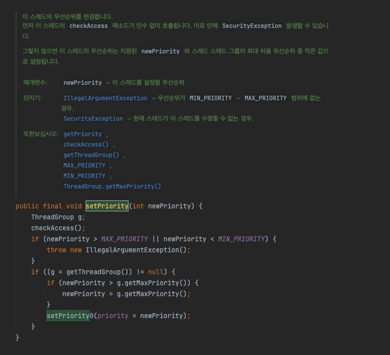

# 6 Week ( 10 챕터 ~ 11 챕터 )

## 10. 활동성을 최대로 높이기

### 궁금한 부분
- 데이터베이스 서버에서는 사이클 여부로 트랜잭션 간에 데드락이 발생했다는 사실을 알 수 있는데 현재 원 서버는 이러한 방법이 없는지?
    - 메서드 호출은 특정 객체에서의 행동을 추상화하여 알지 못하게 하므로 어려운 일이라서?
    - tryLock() 으로 지속적으로 확인하는 것은 부하가 커지므로?
- 데드락이 발생하고 나서 애플리케이션 레벨에서 해결한 방법이 따로 있는지?
    - 주로 스레드 부족 데드락인지 자원 데드락 중 어떤 경우가 빈번한지?
- 317p 10.6 예제에서 오픈 호출로 변경한 부분이 어디인지 잘 모르겠음
- 스레드 덤프 확인 방법
- 스레드 우선순위 변경 방식

<br>

### 데드락을 왜 애플리케이션 서버에서 추적하지 않는지?
- 책에서 DBMS에서 데드락을 추적하고 복구하는데 해당 시스템에서 기능을 갖추고 있고 데드락이 발생하면 데드락이 발생한 채로 시스템이 멈추도록 방치하지 않으므로 사용한다고 함
    - 메서드 호출은 특정 객체에서의 행동을 추상화하여 알지 못하게 하므로 어려운 일이라서?
    - tryLock() 이던 서버에서 스레드의 행동을 지속적으로 확인하는 것은 부하가 커지므로?
- 그렇다면 서버에서는 데드락을 최대한 방지해놓고 발생할 경우 해결하는 것이 맞는 방향

<br>

### 데드락이 발견되고 애플리케이션 레벨에서 해결한 방법이 있는지?
- 또한 주로 스레드 부족 데드락인지 자원 데드락 중 어떤 경우가 빈번한지?

<br>

### 317p 10.6 예제 코드에서 오픈 호출로 변경된 부분
- 객체의 상태를 변경하는 부분과 객체의 상태를 읽는 부분을 분리하여 동기화를 최소화
    - 공유된 상태 변수가 직접 관련된 부분에서만 락을 확보
    - 이후 락을 확보하지 않은 상태에서 메소드를 호출하는 것을 오픈 호출이라고 함
- 이전 코드

```java
// 데드락 위험
class Taxi {
    @GuardedBy("this") private Point location, destination; 
    private final Dispatcher dispatcher; 
    
    public Taxi(Dispatcher dispatcher) {
        this.dispatcher = dispatcher;
    }
    
    public synchronized Point getLocation() {
        return location;
    }
    
    public synchronized void setLocation(Point location) {
        this.location = location;
        if(location.equals(destination))
            dispatcher.notifyAvailable(this);
    }
}

class Dispatcher {
    @GuardedBy("this") private final Set<Taxi> taxis;
    @GuardedBy("this") private final Set<Taxi> availableTaxis;
    
    public Dispatcher() {
        taxis = new HashSet<Taxi>();
        availableTaxis = new HashSet<Taxi>();
    }
    
    public synchronized void notifyAvailable(Taxi taxi) {
        availableTaxis.add(taxi);
    }
    
    public synchronized Image getImage() {
        Image image = new Image();
        for(Taxi t :taxis)
            image.drawMarker(t.location);
        return image;
    }
}
```

<br>

- 변경된 코드

```java
@ThreadSafe
class Taxi {
    @GuardedBy("this") private Point location, destination;
    private final Dispatcher dispatcher;

    ...

    public synchronized Point getLocation() {
        return location;
    }

    // location 설정 부분만을 동기화하여 결과를 따로 저장하여 해당 결과로 진행
    public void setLocation(Point location) {
        boolean reachedDestination;
        synchronized (this) {
            this.location = location;
            reachedDestination = location.equals(destination);
        }
        if(reachedDestination)
            dispatcher.notifyAvailable(this);
    }
}

@ThreadSafe
class Dispatcher {
    @GuardedBy("this") private final Set<Taxi> taxis;
    @GuardedBy("this") private final Set<Taxi> availableTaxis;

    ...

    public synchronized void notifyAvailable(Taxi taxi) {
        availableTaxis.add(taxi);
    }

    // 기존 자료구조인 Set을 카피하는 부분만 동기화하고 이후에는 해당 카피 자료구조를 사용하여 자료구조 내의 데이터를 락을 확보하지 않고 진행하도록 변경
    public Image getImage() {
        Set<Taxi> copy;
        synchronized (this) {
            copy = new HashSet<Taxi>(taxis);
        }
        Image image = new Image();
        for(Taxi t :copy)
            image.drawMarker(t.location);
        return image;
    }
}
```

<br>

### 스레드 우선순위 변경
- 기본적으로 책에서는 스레드를 우선순위 변경하지 말라고함
- 하지만 변경한다면 어떻게 변경해야 하는지 또한 변경해본 경험이 있는지 궁금



<br>

```java
public static void main(String[] args) {
        Thread thread = new Thread(new MyRunnable(), "Thread");

        // 스레드 우선순위 설정 (1~10, NORM_PRIORITY = 5)
        thread.setPriority(Thread.MAX_PRIORITY); // 최대 우선순위 

        thread.start();
    }
```

<br>

## 11. 성능, 확장성

### 궁금한 부분
- 처음 설계에서 최적화의 일반적인 기준은 어떻게 잡는지?
- 주로 사용하는 성능 측정 도구
- 코틀린과 자바의 성능차이는 얼마나 차이가 나는지
    - 차이가 어느 부분에서 발생하는지
- 락 스트라이핑을 통해 ConcurrentHashMap 처럼 해시 버킷으로 분리하여 락을 사용하는데 삽입에 대해서 문제가 없는 이유는?
    - 해시 값이 같은 키가 두개가 동시에 들어온다면 충돌이 발생하는 것이 아닌지?

<br>

### 성능 최적화는 문제 발생 전 어느정도 까지 진행하는 기준이 있는지?
- 혹은 문제가 발생하는 여부 확인 전까지 유기하는게 좋은지

<br>

### 주로 사용하는 성능 측정 도구에는 무엇이 있는지?

<br>

### 코틀린과 자바의 성능차이는 얼마나 차이가 나는지
 - 차이가 어느 부분에서 발생하는지

<br>

### ConcurrentHashMap 해시 버킷에 동시에 같은 키의 데이터가 삽입될 경우에 문제가 없는 이유?
- 해시값을 특정 버킷으로 나누고 값을 조회하는 것은 나머지 연산이 다른 데이터를 조회하기에는 락을 좋게 분리할 수 있다고 생각
- 하지만 동시에 같은 키의 데이터가 삽입된다면 해시 충돌이 발생한다고 생각하는데 어떻게 진행되는지