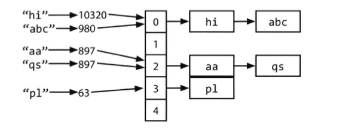

# 배열, 문자열

### 내용 정리하기 전에
- 해당 내용 정리는 코딩 인터뷰 완전 분석 책의 자료구조 파트를 정리하였음
- 자료구조에 널리 사용되는 보편적인 기법에 대해 작성되어 있음

<br>

### 배열과 문자열
- 갑자기 해시 테이블에 대한 이야기가 나와서 ChatGPT로 연관 관계를 검색해보았음
```
배열과 문자열
- 배열은 데이터를 순차적으로 나열한 자료구조로, 각 원소는 인덱스를 가지고 있습니다. 메모리 상에 연속적으로 할당되어 있어 빠른 인덱스 기반 접근이 가능합니다.
- 문자열은 문자의 배열로 간주할 수 있습니다. 문자열은 불변성(Immutable)을 가지는 경우가 많아, 새로운 문자열을 생성할 때 이전 문자열을 복사하거나 조작하는 경우가 일반적입니다.

해시테이블과 연관성
- 해시테이블은 키(key)와 값(value)을 연결지어 저장하는 자료구조입니다. 배열의 인덱스를 활용하여 효율적으로 데이터에 접근할 수 있는 특징을 가지고 있습니다.
- 해시테이블은 키에 대한 해시 함수를 사용하여 배열의 인덱스를 계산하고, 충돌을 처리하기 위한 방법을 포함하고 있습니다. 이를 통해 키에 대응하는 값을 빠르게 찾을 수 있습니다.
```

### 해시 테이블
- 해시 테이블이란 효율적인 탐색을 위한 자료구조로서 Key를 Value에 대응시킴
- 해시 테이블을 구현하는 방법은 여러 가지가 있으나 해당 책에서 간단한 해시테이블을 구현하기 위해서 연결리스트와 해시 코드 함수만 사용하였음
    - 처음에는 키의 해시코드를 계산하는데 키는 중복되지 않도록 유의할 것
    - 이후에는 hash(key) % array_length 같은 방식처럼 배열의 인덱스를 구함
    - 배열의 각 인덱스에는 키와 값으로 이루어진 연결리스트가 존재하는데 키와 값을 해당 인덱스에 저장하는데 있어 서로 다른 두개의 키가 같은 해시 코드를 가리키거나 서로 다른 두 개의 해시코드가 같은 인덱스를 가르키는 경우의 충돌을 대비해서 반드시 연결리스트를 이용한다고 함

```
해시코드란?
- 임의의 데이터를 고정된 크기의 값으로 변환하는 함수의 결과물
- 해시 코드는 일반적으로 입력 데이터의 특성을 반영하여 동일한 입력에 대해서는 항상 동일한 해시 코드를 생성하도록 설계됨
- 주어진 데이터에 대해 고유한 식별자를 생성하는 데 사용됨

해시코드 예시
- 정수형 데이터의 경우 : '250'을 예시로 들면 그대로 '250' 그대로 사용
- 문자열 데이터의 경우 : 'abs'를 예시로 들면 'a'의 아스키코드 97 + 'b'의 아스키코드 98 + 's'의 아스키코드 115의 값인 '310'이 해시코드
- 실수(부동소수점 수)의 경우 : '3.14' 인 경우 정수형인 '3'이 해시코드
- 날짜 데이터의 경우 : '년도 + 월 + 일' 처럼 날짜 데이터의 각 구성 요소를 합산하여 해시코드 생성
- 사용자 정의 객체인 경우 : 예를 들어, 사용자가 정의한 클래스 Person이 있다면, 그 클래스의 필드들의 조합을 통해 해시 코드를 생성할 수 있음 ( 직접 생성해야 함 )

자바 해시코드 메서드
- Objects.hash() 메서드를 통해 해시코드로 쉽게 변경할 수 있음
- 자바의 날짜 클래스 Data, LocalDate, LocalDateTime 등은 hashCode가 구현되어 있어 따로 구현할 필요는 없음
```

<br>

### 해시테이블에서 키에 상응하는 값 찾기
- 주어진 키로부터 해시 코드를 계산하고 이 해시 코드를 이용하여 인덱스를 계산한다
- 이후 해당 키에 상응하는 값을 연결리스트에서 탐색
- 해당 과정을 반복

<br>


- 해당 그림에서는 위의 내용처럼 연결리스트를 사용하여 하나의 노드의 값을 하나하나 탐색하기 때문에 충돌이 자주 발생한다면 최악의 경우의 수행시간은 O(N)이 되고 일반적으로 충돌을 최소화하도록 구현하므로 이 경우 탐색 시간은 O(1)임
- 해당 책에서는 연결리스트로 했지만 이진 탐색 트리 등 다른 자료구조를 사용하여 구현할 수도 있음

<br>

```java
import java.util.HashMap;
import java.util.LinkedList;
import java.util.Map;

public class ChainedHashTable<K, V> {   // 연결리스트 맵사용
    private Map<K, LinkedList<Entry<K, V>>> table;

    public ChainedHashTable() {
        table = new HashMap<>();
    }

    public void put(K key, V value) {
        LinkedList<Entry<K, V>> bucket = table.computeIfAbsent(key, k -> new LinkedList<>());

        for (Entry<K, V> entry : bucket) {
            if (entry.key.equals(key)) {
                entry.value = value;
                return;
            }
        }

        bucket.add(new Entry<>(key, value));
    }

    public V get(K key) {
        LinkedList<Entry<K, V>> bucket = table.get(key);

        if (bucket != null) {
            for (Entry<K, V> entry : bucket) {
                if (entry.key.equals(key)) {
                    return entry.value;
                }
            }
        }

        return null;
    }

    private static class Entry<K, V> {
        K key;
        V value;

        public Entry(K key, V value) {
            this.key = key;
            this.value = value;
        }
    }
}


import java.util.TreeMap;
public class TreeHashTable<K, V> {  // 트리 사용
    private TreeMap<K, V> treeMap;

    public TreeHashTable() {
        treeMap = new TreeMap<>();
    }

    public void put(K key, V value) {
        treeMap.put(key, value);
    }

    public V get(K key) {
        return treeMap.get(key);
    }
}


public class HashTableBenchmark {   // 성능 테스트
    public static void main(String[] args) {
        int dataSize = 1000000;
        int numTests = 10; // 테스트 반복 횟수

        System.out.println("---");
        System.out.println("연결 리스트");
        System.out.println("---");

        for (int i = 0; i < numTests; i++) {
            benchmarkChainedHashTable(dataSize);
        }

        System.out.println("---");
        System.out.println("이진 탐색 트리");
        System.out.println("---");

        for (int i = 0; i < numTests; i++) {
            benchmarkTreeHashTable(dataSize);
        }
    }

    private static void benchmarkChainedHashTable(int dataSize) {
        ChainedHashTable<String, Integer> chainedHashTable = new ChainedHashTable<>();
        TimeUtil.measureTime(() -> {
            for (int i = 0; i < dataSize; i++) {
                chainedHashTable.put("key" + i, i);
            }
            System.out.println("삽입 속도 : ");
        });

        TimeUtil.measureTime(() -> {
            for (int i = 0; i < dataSize; i++) {
                chainedHashTable.get("key" + i);
            }
            System.out.println("검색 속도 : ");
        });
    }

    private static void benchmarkTreeHashTable(int dataSize) {
        TreeHashTable<String, Integer> treeHashTable = new TreeHashTable<>();
        TimeUtil.measureTime(() -> {
            for (int i = 0; i < dataSize; i++) {
                treeHashTable.put("key" + i, i);
            }
            System.out.println("삽입 속도 : ");
        });

        TimeUtil.measureTime(() -> {
            for (int i = 0; i < dataSize; i++) {
                treeHashTable.get("key" + i);
            }
            System.out.println("검색 속도 : ");
        });
    }
}

/* 결과 
 ---
연결 리스트
---
삽입 속도 : 
360 m/s
검색 속도 : 
129 m/s
삽입 속도 : 
159 m/s
검색 속도 : 
90 m/s
...

---
이진 탐색 트리
---
삽입 속도 : 
467 m/s
검색 속도 : 
195 m/s
삽입 속도 : 
318 m/s
검색 속도 : 
195 m/s
...

대부분의 경우 왜 연결리스트가 더 빠르지..? 자료구조 라이브러리의 차이인지 잘 모르겠음
*/
```

<br>

### ArrayList와 가변 크기 배열
- 특정 언어 에선 배열의 크기를 자동으로 조절 할 수 있는데 (해당 경우 리스트로 주로 불림) 데이터를 덧붙일 때마다 배열 혹은 리스트의 크기가 증가함
- 자바의 경우에도 이런 동적 가변 크기 기능은 내재되어 있는 자료구조로 보통 ArrayList를 사용함

```
책에서의 ArrayList가 크기를 변화시킬 때 걸리는 시간

- ArrayList는 필요에 따라 크기를 변화시킬 수 있으면서도 0(1)의 접근 시간을 유지
- ArrayList는 크기를 동적으로 조절할 수 있으며, 원소에 대한 접근 시간이 상수 시간(O(1))에 유지됨. 
- ArrayList는 동적으로 크기를 조절하면서, 원소를 추가할 때 배열이 가득 차게 되면 일반적으로 현재 크기의 두 배로 배열을 확장함
- 크기를 두 배 늘리는 시간은 새로운 배열을 생성하고 기존 데이터를 복사하는 작업이 필요하므로 시간복잡도가 O(n)이지만, 자주 발생하는 일이 아니라서 상환 입력 시간으로 계산했을 때 여전히 O(1)이 된다.

상환 시간이 O(1)이 되는 이유
- 배열의 크기가 N인 배열이 있다고 가정
- 현재 배열의 크기가 N인 원소를 삽입하기 위해 복사해야 하는 원소의 총 개수는 지금까지 N/2 + N/4 + N/8 ... 2 + 1 처럼 N 이상이 존재할 수 없음
- 위처럼 최악의 경우 O(N)이 소요되는 삽입 연산이 존재하지만 평균적으로 N이상 넣을 수 없고 O(1)이 된다.
```

<br>

### StringBuilder
- StringBuilder 없이 문자열을 하나로 이어 붙인다고 생각했을 경우 모든 문자열의 길이는 x고 같은 n개의 문자열이 주어졌다고 가정했을 경우 문자열을 이어붙일 때마다 두 개의 문자열을 읽어들인 뒤 문자를 하나하나 새로운 문자열에 복사해야 한다. 처음에는 x개， 두 번째는 2x개， 세 번째는 3x개， n 번 째는 nx개의 문자를 복사해야 한다. 따라서 총 수행 시간은 O(x+2x+...+nx),즉 O(xn2)이 됨
- StringBuilder는 해당 문제를 해결해주는데 단순하게 가변 크기 배열을 이용해서 필요한 경우에만 문자열을 복사하게 해줘 문제를 해결해줌

<br>

```java
import java.util.Random;

public class JoinStringTest {
    public static void main(String[] args) {
        String[] words = generateRandomStrings(30000);

        TimeUtil.measureTime(() -> {
            joinWords1(words);
        });

        TimeUtil.measureTime(() -> {
            joinWords2(words);
        });
    }

    private static String joinWords1(String[] words) {
        String sentence = "";
        for (String w : words) {
            sentence = sentence + w;
        }
        return sentence;
    }

    private static String joinWords2(String[] words) {
        StringBuilder sentence = new StringBuilder();
        for (String w : words) {
            sentence.append(w);
        }
        return sentence.toString();
    }

    private static String[] generateRandomStrings(int numberOfStrings) {
        String[] stringArray = new String[numberOfStrings];

        for (int i = 0; i < numberOfStrings; i++) {
            stringArray[i] = generateRandomString();
        }

        return stringArray;
    }

    private static String generateRandomString() {
        int length = 10;
        StringBuilder randomString = new StringBuilder();

        Random random = new Random();
        String characters = "ABCDEFGHIJKLMNOPQRSTUVWXYZabcdefghijklmnopqrstuvwxyz0123456789";

        for (int i = 0; i < length; i++) {
            int index = random.nextInt(characters.length());
            char randomChar = characters.charAt(index);
            randomString.append(randomChar);
        }

        return randomString.toString();
    }
}


public class TimeUtil { // TimeUtil Class
    public static void measureTime(Runnable task) {
        long startTime = System.currentTimeMillis();
        task.run();
        long endTime = System.currentTimeMillis();
        long time = endTime - startTime;

        System.out.println(time + " m/s");
    }
}


// 결과
// String Joining : 739 m/s
// StringBuiler Joining : 3 m/s
```

<br>