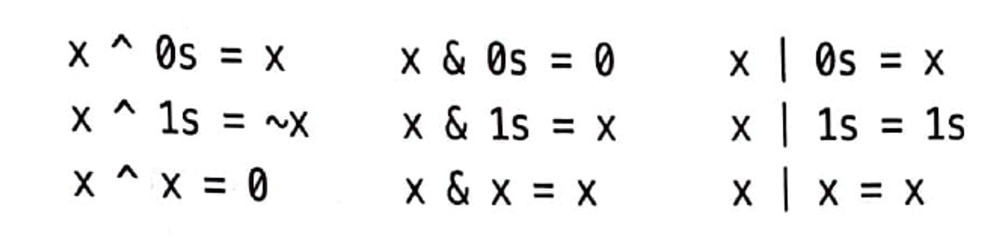
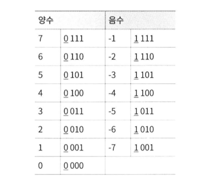
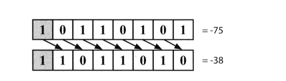
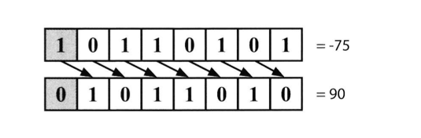

# 비트 조작

### 비트 조작이란?
- 데이터의 이진 비트(bit)를 조작하거나 변형하는 것으로 코드를 최적화 할 때 유용하게 사용되는 기법중에 하나
- 비트 조작 연산자를 사용하여 데이터를 비트 수준에서 조작함으로써 다양한 작업을 수행
    - 비트 쉬프트(Shift) : <<, >>
    - 비트 AND 연산 : &
    - 비트 OR 연산 : |
    - 비트 XOR 연산 : ^

<br>

### 비트 조작 해보기


<br>

1. 0110 + 0010 -> 0200 -> 1000
2. 0011 * 0101 -> 1100 + 0011 -> 1111
3. 0110 + 0110 -> 0110 * 0010 -> 1100
4. 0011 + 0010 -> 0101
5. 0011 * 0011 -> 0110 + 0011 -> 1001
6. 0100 * 0011 -> 1100
7. 0110 - 0011 -> 0011
8. 1101 >> 2 -> 0011
9. 1101 ^ (~1101) -> 1101 ^ 0010 -> 1111
10. 1000 - 0110 -> 0010
11. 1101 ^ 0101 -> 1000
12. 1011 & (~0 << 2) -> 1011 & (1111 << 2) -> 1011 & 1100 -> 1000

<br>

### 비트 조작에서 알아야 할 사실과 트릭들
- 비트 조작에서의 다음 표현식을 알아 두는 것이 좋음
    - 0s : 모든 비트가 0인 값
    - 1s : 모든 비트가 1인 값
- 연산들은 비트 단위로 이루어진다는 사실을 명심하고 한 비트에서 일어나는 일이 다른 비트에 어떤 영향도 미치지 않음
- 그러므로 아래의 표현식이 한 비트에 대해서 참이라면 일련의 비트들에 대해서도 참이 됨



<br>

### 2의 보수와 음수
- 컴퓨터는 일반적으로 정수를 저장할 때 2의 보수 형태로 저장
- 양수를 표현할 때는 문제가 없으나 음수를 표현할 때는 그 수의 절대값에 부호 비트(sign bit)를 1로 세팅한 뒤 2의 보수를 취한 형태로 표현
- N비트 숫자에 대한 2의 보수는 2N에 대한 보수값과 같은데 여기서 N은 부호비트를 뺀 나머지 값을 표현할 때 사용되는 비트의 개수
- 책에서는 간단히 -K를 N비트의 2진수로 표현하면 concat(l, 2N-1_K)가 된다고 함

- 4비트로 표현된 정수 -3의 경우 : 책의 방법
```
4비트중 하나는 부호를 표현한 값 -> 4비트 - 1비트 = 3비트
-3 : 절대값 3의 2^3 = 8의 보수와 -3의 보수는 같음
3은 8의 보수가 5 -> 0101
-3은 1101 이다..?
```

- 4비트로 표현된 정수 -3의 경우 : GPT의 방법
```
3의 이진수 표현 : 0011
비트를 반전 : 1100
1을 더해줌 : 1101
```

<br>



<br>

### 산술 우측 시프트 vs 논리 우측 시프트
- 우측 시프트 연산에는 두가지 종류가 있음
- 산술 우측 시프트(arithmetic right shift)는 기본적으로 2로 나눈 결과와 같음
    - 산술 우측 시프트는 비트를 오른쪽으로 옮기기는 하지만 부호비트는 바꾸지 않는다
    - 따라서 이 연산은 대략 값을 2로 나눈 효과가 있고 >> 연산과 같음
    - 모두 1로 채워지면 1s, -1이 된다고 함



<br>

- 논리 우측 시프트(logical right shift)는 우리가 일반적으로 비트를 옮길 때 보이는 것처럼 움직임
    - 비트를 우측으로 옮긴 다음 최상위 비트에 0을 넣음
    - 비트를 옮길 때 보이는 것처럼 움직임
    - \>>> 연산과 같음
    - 부호가 바뀐다
    - 논리 shift를 계속 사용하면 0이 됨



<br>

### 기본적인 비트 조작 : 비트값 확인 및 채워넣기
- 다음의 연산은 굉장히 중요하여 반드시 알고 있어야 함. 하지만 단순히 암기하는 것은 안됨

#### 비트값 확인
```java
boolean getBit(int num, int i) {
    return ((num & (1 << i)) != 0);
}
```
- 해당 메서드는 1을 i 비트만큼 시프트해서 00010000과 같은 값을 만듬
- 그다음 and 연산을 통해 num의 i번째 비트를 뺀 나머지 비트를 모두 삭제한 후 이 값을 0과 비교
- 만약 이 값이 아니라면 i번째 비트는 1이어야 하고, 0이라면 i 번째 비트는 0이어야 한다

<br>

#### 비트값 채워넣기
```java
int setBit(int num, int i) {
	return num | (1 << i);
}
```
- 특정 i 번째 위치에 1을 채워 넣음
- 1을 왼쪽으로 shift하여 00010000과 같이 만들어 or 연산을 하고 num의 i번째 비트값을 바꿈
- i번째를 제외한 나머지 비트들은 0과 OR 연산을 하게 되므로 num에 아무 영향을 끼치지 않음

<br>

#### 비트값 삭제하기
```java
int clearBit(int num, int i) {
	int mask = ~(1 << i);
	return num & mask;
}
```
- 이 메서드는 getBit를 반대로 한 것
- ~연산자를 사용하여 11101111으로 만들고 and 연산을 하여 특정 위치의 bit를 제거

<br>

#### 최상위 비트까지 모두 삭제
```java
int clearBitsMSBthroughI(int num, int i) {
    int mask = (1 << i) - 1;
    return num & mask;
}
```
- (1 << i)로 i번째 비트를 1로 세팅하고 이 값에서 1을 빼면 i 번째 밑은 모두 1로 세팅되고 그 위로는 모두 0으로 세팅 됨
- 이 mask값과 num을 AND 연산하면 하위 i개의 비트를 뺀 나머지 비트를 모두 삭제할 수 있음

<br>

#### i번째부터 0번쨰 비트까지 삭제
```java
int clearBitFromTail(int num, int i) {
	int mask = (-1 << (i+1));
	return num * mask;
}
```
- 비트가 모두 1이면 10진수로 -1, -1에 i+1 만큼 시프트 시킨 후 그 값을 & 연산

<br>

#### 비트값 바꾸기
```java
int updateBit(int num, int i, boolean bitIs1) {
	int value = bitIs1 ? 1 : 0;
	int mask = ~(1 << 1);
	return (num & mask) | (value << i);
}
```
- i번째 비트값을 바꾸고 싶다면 11101111과 같은 값을 이용해 i 번째 비트값을 삭제해야 함
- 그 뒤 우리가 바꾸고자 하는 값 v를 왼쪽으로 i번 시프트하면 i번째 비트값은 v가 될 것이고 나머지는 모두 0이 될 것
- 마지막으로 OR 연산을 이용해 i번째 비트값을 v로 바꿔줌 

<br>

### 연습 문제

#### 1. 삽입 : 두 개의 32비트 수 N과M이 주어지고，비트위치 i와 j가 주어졌을때，M을 N에 삽입하는 메서드를 구현하라. M은 N의 j번째 비트에서 시작하여 i 번째 비트에서 끝난다. j번째 비트에서 i번째 비트까지에는 M을 담기 충분한 공간이 있다고 가정한다. 다시 말해， M = 10011이라면， j와 i 사이에 적어도 다섯 비트가 있다고 가정해도 된다는 것이다. j = 3 이고 i = 2 인 경우처럼 M을 삽입할 수 없는 상황은 생기지 않는다고 봐도 된다.

#### 2. 2진수를 문자열로 : 0.72와 같이 0과 1 사이의 실수가 double 타입으로 주어 졌을 때， 그 값을 2진수 형태로 출력하는 코드를 작성하라. 길이가 32 이하인 문자열로 2진수로 정확하게 표현할 수 없다면 ERROR를 출력하라.

#### 3. 비트뒤집기 : 어떤 정수가 주어졌을 때 여러분은 이 정수의 비트 하나를 0에 서 1로 바꿀 수 있다. 이때 1이 연속으로나올수 있는가장 긴 길이를 구하는 코드를 작성하라.

#### 4. 다음 숫자 : 양의 정수가 하나 주어졌다. 이 숫자를 2진수로 표기했을 때 1비트의 개수가 같은 숫자 중에서 가장 작은 수와 가장 큰 수를 구하라

#### 5. 디버거 : 다음 코드가 하는 일을 설명하라 (( n & (n-1)) == 0)

#### 6. 변환 : 정수 A와 B를 2진수로 표현했을 때， A를 B로 바꾸기 위해 뒤집어야 하는 비트의 개수를 구하는 함수를 작성하라.

#### 7. 쌍끼리 맞바꾸기 : 명령어를 가능한 한 적게 사용해서 주어진 정수의 짝수 번째 비트의 값과 홀수 번째 비트의 값을 바꾸는 프로그램을 작성하라 (예:0 번째 비트와 1번째 비트를 바꾸고， 2번째 비트와 3번째 비트를 바꾸는 식 으로)

#### 8. 선 그리기 : 흑백 모니터 화면은 하나의 바이트 배열에 저장되는데， 인접한 픽셀 여덟 개를 한 바이트에 묶어서 저장한다. 화면의 폭은 w이며，W는 8로 나누어 떨어진다 (따라서 어떤 바이트도 두 행에 걸치지 않는다). 물론， 화면 높이는 배열 길이와 화변 폭을 통해 유도해낼수있다 이때(x1, y)에서 (x2 , y)까지 수평선을 그려주는 함수를 작성하라. 메서드 용법 (method signature)은 다음과 같다. ( drawLine(byte[] screen , int width , int xl , int x2 , int y) )

<br>

### Reference
- https://blog.yevgnenll.me/posts/about-the-bit-operation