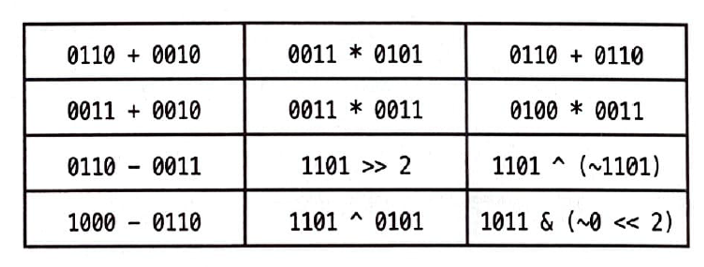

# 비트 조작

### 비트 조작이란?
- 데이터의 이진 비트(bit)를 조작하거나 변형하는 것으로 코드를 최적화 할 때 유용하게 사용되는 기법중에 하나
- 비트 조작 연산자를 사용하여 데이터를 비트 수준에서 조작함으로써 다양한 작업을 수행
    - 비트 쉬프트(Shift) : <<, >>
    - 비트 AND 연산 : &
    - 비트 OR 연산 : |
    - 비트 XOR 연산 : ^

<br>

### 비트 조작 해보기



<br>

1. 0110 + 0010 -> 0200 -> 1000
2. 0011 * 0101 -> 1100 + 0011 -> 1111
3. 0110 + 0110 -> 0110 * 0010 -> 1100
4. 0011 + 0010 -> 0101
5. 0011 * 0011 -> 0110 + 0011 -> 1001
6. 0100 * 0011 -> 1100
7. 0110 - 0011 -> 0011
8. 1101 >> 2 -> 0011
9. 1101 ^ (~1101) -> 1101 ^ 0010 -> 1111
10. 1000 - 0110 -> 0010
11. 1101 ^ 0101 -> 1000
12. 1011 & (~0 << 2) -> 1011 & (1111 << 2) -> 1011 & 1100 -> 1000

<br>

### 비트 조작에서 알아야 할 사실과 트릭들
- 비트 조작에서의 다음 표현식을 알아 두는 것이 좋음
    - 0s : 모든 비트가 0인 값
    - 1s : 모든 비트가 1인 값
- 연산들은 비트 단위로 이루어진다는 사실을 명심하고 한 비트에서 일어나는 일이 다른 비트에 어떤 영향도 미치지 않음
- 그러므로 아래의 표현식이 한 비트에 대해서 참이라면 일련의 비트들에 대해서도 참이 됨


<br>

### 2의 보수와 음수
- 컴퓨터는 일반적으로 정수를 저장할 때 2의 보수 형태로 저장
- 양수를 표현할 때는 문제가 없으나 음수를 표현할 때는 그 수의 절대값에 부호 비트(sign bit)를 1로 세팅한 뒤 2의 보수를 취한 형태로 표현
- N비트 숫자에 대한 2의 보수는 2N에 대한 보수값과 같은데 여기서 N은 부호비트를 뺀 나머지 값을 표현할 때 사용되는 비트의 개수
- 책에서는 간단히 -K를 N비트의 2진수로 표현하면 concat(l, 2N-1_K)가 된다고 함

- 4비트로 표현된 정수 -3의 경우 : 책의 방법
```
4비트중 하나는 부호를 표현한 값 -> 4비트 - 1비트 = 3비트
-3 : 절대값 3의 2^3 = 8의 보수와 -3의 보수는 같음
3은 8의 보수가 5 -> 0101
-3은 1101 이다..?
```

- 4비트로 표현된 정수 -3의 경우 : GPT의 방법
```
3의 이진수 표현 : 0011
비트를 반전 : 1100
1을 더해줌 : 1101
```

<br>


<br>

### 산술 우측 시프트 vs 논리 우측 시프트
- 우측 시프트 연산에는 두가지 종류가 있음
- 산술 우측 시프트(arithmetic right shift)는 기본적으로 2로 나눈 결과와 같음
    - 산술 우측 시프트는 비트를 오른쪽으로 옮기기는 하지만 부호비트는 바꾸지 않는다
    - 따라서 이 연산은 대략 값을 2로 나눈 효과가 있고 >> 연산과 같음
    - 모두 1로 채워지면 1s, -1이 된다고 함


<br>

- 논리 우측 시프트(logical right shift)는 우리가 일반적으로 비트를 옮길 때 보이는 것처럼 움직임
    - 


<br>

### Reference
- https://blog.yevgnenll.me/posts/about-the-bit-operation