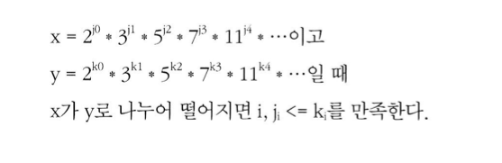
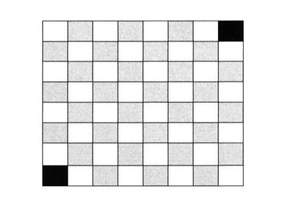

# 수학 및 논리 퍼즐

### 논리 퍼즐
- 퍼즐 혹은 수수께끼 문제는 정의가 모호하지만 수학 혹은 컴퓨터 과학에 기초해서 만들어졌기 때문에 대부분 논리적인 추론으로 찾을 수 있어 꽤 공정하다
- 해당 파트는 이러한 문제를 푸는데 필요한 기본적인 방법들에 대해 정리되어 있음

<br>

### 소수
- 나눌 수 있는 수가 1과 자신밖에 없는 수로 모든 자연수는 소수의 곱으로 나타낼 수 있음
```
84 = 2^2 * 3^1 * 5^0 * 7^1 * 11*0 ...
```
- 가분성(divisibility) 위의 규칙에 따르면 어떤 수 x로 y를 나눌 수 있으려면 x를 소수의 곱으로 분할하였을 때 나열되는 모든 소수는 y를 소수의 곱으로 분할하였을 때 나열되는 모든 소수들의 부분집합이여야 함
    - 즉 x/y 를 만족하려면 모든 i에 다해서 jᵢ <= kᵢ를 만족해야하며 따라서 x와 y의 최대 공약수를 의미



<br>

### 소수 판별
- 어떤 수 n이 소수인지 여부를 판별하는 가장 단순한 방법은 2에서 n-l까지 루프를 돌면서 나누어지는 경우가 있는지 확인해 보는 것
    - 해당 예시코드는 루프를 n이 아닌 n의 제곱근까지만 돌게하는 코드
    - 제곱근까지만 검사해보면 충분한 이유는 n을 나누는 모든 숫자 a는 그에 대한 보수 b(a*b = n)가 반드시 존재하기 때문에 만일 a > √n 이라면 b < √n이다(√n^2 = n이므로). 따라서 n이 소수인지를 알아보기 위해 a까지 검사할 필요는 없다. b에서 이미 검사했기 때문
    - 즉, 두 수 중 하나는 n의 제곱근 이하이기 때문에, 루프를 제곱근까지만 돌려도 충분
    - 우리가 원하는 것은 n이 다른 소수로 나뉘는지 확인하는 것 뿐으로 이게 바로 에라토스테네스의 체가 등장한 이유
```java
boolean primeSlightlyBetter(int n) {
    if (n < 2) {
        return false;
    }
    int sqrt = (int) Math.sqrt(n);
    for (int i = 2; i <= sqrt; i++) {
        if (n % i == 0) {
            return false;
        }
    }
    return true;
}
```

<br>

### 에라토스테네스의 체
- 소수 목록을 만드는 굉장히 효율적인 방법으로 이 알고리즘은 소수가 아닌 수들은 반드시 다른 소수로 나누어진다는 사실에 기반해서 동작
- 처음 주어진 리스트는 1부터 max까지의 모든 수로 구성되어 있고 처음에는 2로 나누어지는 모든 수를 리스트에서 없앰
- 그 후 다음 소수, 즉 아직 지워지지 않은 수 중 가장 작은 수를 찾아 나누어지는 수를 모두 리스트에서 제거하면 2에서 max까지 구간 내에 있는 모든 소수들의 리스트가 만들어짐
- 아래 코드는 해당 알고리즘이지만 배열에 홀수만 저장하는 방법 처럼 몇가지 개선을 진행할 수 있음

```java
boolean[] sieveOfEratosthenes(int max) {
    boolean[] flags new boolean[max + 1];
    int count 0;
    
    init(flags); // 0과 1번 인댁스를 제외한 모든 원소값을 true로 초기화한다
    int prime = 2;
    
    while (prime <= Math.sqrt(max)) { 
        /* prime의 배수들을 지워나간다.*/
        crossOff(flags, prime);
        
        /* 그다음 true로 세팅된 인텍스를 찾는다. */ 
        prime = getNextPrime(flags, prime);
    }

    return flags;
}

void crossOff(boolean[] flags , int prime) {
/* prime의 배수들을 제거해나간다. k < prime인 k에 대한 k * prime은
* 이전 루프에서 이미 제거되었올 것이므로 prime * prime부터 시작한다. */
    for (int i = prime * prime; i < flags.length; i += prime) {
        flags[i] = false;
    } 
}

int getNextPrime(boolean[] flags , int prime) {
    int next prime + 1;
    
    while (next < flags. length && !flags[next]) {
        next++;
    }

    return next;
}
```

<br>

### 확률
- 확률은 까다롭게 느껴진 만한 주제이긴 하나 기본적으로 논리적인 추론이 가능한 몇 가지 법칙에 기반함
- 두 사건 A와 B를 나타내는 다음의 벤 다이어그램을 보자. 두 원이 점유하고 있는 영역은 각각의 상대적 확률을 나타내는 것이고 겹치는 부분은 |A and B|의 사건을 나타냄
- 1부터 10까지의 수 중 하나를 뽑는다고 할때 5이하이면서 짝수인 수를 뽑을 확률은 1~5 까지의 수를 뽑을 확률은 50%, 이중에 짝수를 뽑을 확률은 40퍼 이므로 (2/5)*(1/2) 임
    - B|A의 경우 A가 발생한 경우의 B가 발생할 확률으로 A가 발생헀을 때의 조건부 확률을 의미
    - P(A∩B) = P(B|A) P(A), P(A∩B) = P(A|B) P(B)
    - 반대로 표현한다면 P(A|B) = P(B|A) P(A)/P(B)
    - 위의 수식을 베이즈 정리라고 부름
- 합집합의 경우는 P(A∪B) = P(A) +P(B) - P(A∩B)로 두 경우를 더하고 중복 적용되는 교집합을 빼서 구함
- 해당 경우에서 독립사건과 상호 배타적인 사건의 확률을 구하는 특수 규칙들을 쉽게 구할 수 있음

<br>

### 특수 규칙
- 독립과 상호 배타의 개념은 다른 개념이며 독립적이면서 상호 배타적인 것은 불가능함
- 상호 배타성은 한 사건이 발생하면 다른 사건이 발생할 수 없다는 관계가 존재하고 독립성은 한 사건의 발생 여부가 다른 사건에 아무런 영향을 끼치지 않은 상태이므로 두 사건의 확률이 전부 0이 아니라면 상호 배타성과 독립성을 동시에 만족시킬수는 없음
- 두 사건 중 하나의 확률이 0이라면, 두 사건은 독립적이면서 상호 배타적임
#### 독립성
- A와 B가 독립사건(한 사건의 발생과 다른 사건의 발생 사이에 아무런 관계가 없는 경우)이라면， A가 B에 아무런 영향을 끼치지 않으므로， P(B|A) = P(B)가 되고따라서 p(A∩B)= p(A) P(B)가 됨

<br>

#### 상호 배타성
- A와 B가 상호 배타적(한 사건이 일어난 경우 다른 사건은 발생할 수 없는 경우)이라면， p(A∩B)=O 이 되므로 P(A∪B)를 계산할 때 P(A∩B) 항은 제거해도 되기 때문에 P(A∪B) = P(A) + P(B)가 됨

<br>

### 수수께끼 같은 문제 접할 경우
- 면접시에는 알고리즘 문제와 같이 면접관들은 어떻게 공략해 나가는지 보는 것으로 입을 열어 말을 하는 것이 좋음
- 많은 경우에 문제를 풀다가 규칙이나 패턴을 적어두면 도움이 됨. 나중에 쉽게 기억할 수 있기 때문
    - 해당 책에 규칙에 대한 예시는 다음과 같음
```
끈이 두개 있다. 각끈은 태우는데 정확히 한시간이 걸린다. 이 두끈을 사용해 15분을 재려면 어떻게 해야 되겠는가? 이 끈의 밀도는 균일하지 않아서， 절반의 길이를 태우는데 드는 시간이 정확히 30분이라는 보장은 없다.

규칙 1 : 태우는 데 x분이 걸리는 끈과 y분이 걸리는 끈이 주어지면， x + y 만큼의 시간을 잴수 있음
규칙 2 : 태우는 데 x분 걸리는 끈이 주어지면 ，x/2분을 잴 수 있다.
규칙 3 : 1번 끈을 태우는 데 x분 걸리고 2번 끈을 태우는 데 y분이 걸리면， 2번 끈을 태우는 시간을 (y-x)분이나 (y-x/2)분으로 바꿀 수 있다.

결과
1. 1번끈은 양쪽에 불을 붙이고， 2번끈은 한쪽에만 불을 붙인다.
2. 1번끈이 다 타들어가면 30분이 지난것 이다. 따라서 2번끈이 다 타기위해 남은 시간은 30분이다.
3. 그시점에，2번끈의다른쪽에도불을붙인다.
4. 그러면 정확히 15분 뒤에，2번끈도 완전히 다 타버릴 것이다.
```

<br>

### 최악의 경우
- 대부분의 수수께끼 종류의 문제 중 많은 수가 최악의 경우를 최소화하는 것과 연관이 있음
- 어떤 행동을 최소화하는 문제일 수도 있고 지정된 횟수 안에 처리해야 하는 문제일 수도 있음
- 그럴 때는 최악의 상황을 '균형 맞추도록'하면 도움이 됨
    - 해당 책에 예시는 다음과 같음

```
나인볼(nine balls) 문제는 아주 고전적인 면접 문제다. 공이 아홉 개 있다. 이 가운데 여닮 개는 무게가 같고， 하나는 좀 더 무겁다. 여러분에게 저울이 하나 주어지는데， 이 저울로는 왼쪽에 둔 공들이 무거운지, 아니면 오른쪽에 둔 공들이 무거운 지밖에 알아낼 수가 없다. 이 저울을 딱 두 번만 사용해서 가장 무거운 공을 찾아내라.

먼저 떠올릴 수 있는 접근법 : 아홉 번째 공은 제쳐 둔 채, 나머지 공을 네 개씩 두 그룹으로 나누는 것이다. 만약 이 두 그룹의 무게가 같다면, 제쳐 뒀던 공이 가장 무거운 공이다. 그게 아니라면 더 무거웠던 그룹을 택해 반복한다. 그런데 이렇게 하면 최악의 경우 저울을 세 번사용해야하므로 낭패

이것이 ‘최악의 경우’가 균형 잡히지 않은 사례다. 제쳐 둔 공이 무거운 놈인지 알 아내는 데에는 한 번이면 족하지만 남은 공들에서 무거운 공을 찾아내는 데에는 세 번이 걸린다. 만일 우리가 처음에 제쳐 놓는 공의 개수를 늘려 잡아 일종의 페널티 를 주게 되면 ， 다른그룹에 주어지는 부담을 좀 줄일 수 있다. 이것이 바로 ‘최악의 경우에 균형을 가져다 주는’ 방법의 사례

공들을 세 개씩 세 그룹으로 나눠 보면, 저울을 한 번만 사용해서 어떤 그룹에 무거운 공이 있는지 알아낼 수 있다. 이것을 규칙으로 정형화해 보면 이렇다.N개의 공이 주어지고 N이 3으로 나눌 수 있는 값이면， 저울을 한 번 써서 무거운 공이 속한 그룹을 알아낼 수 있음

이제 남은 세 개의 공을 같은 방법으로 달아 보면 된다. 공 하나는 제쳐 놓고, 남은 두 개의 공을 저울 양쪽에 하나씩 올려 놓는다. 저울이 기운다면 기운 쪽의 공이 무거운 공이고 아니라면 남은 공이 가장 무거운 공일 것
```

<br>

### 알고리즘적 접근법
- 문제를 풀다가 막혔다면 알고리즘 문제를 푸는 접근법 가운에 하나를 적용해보자
- 수수께끼처럼 보이는 문제 중 상당수는 기술적인 측면을 제기한 알고리즘 문제인 경우가 많음
- 초기 사례로부터 확장법 그리고 스스로 풀어보기가 특히 유용하게 쓰일 수 있음

<br>

### 연습 문제
#### 1. 무거운 알약: 약병 20개가 있다. 이 중 19개에는 1.0그램짜리 알약들이 들어있고, 하나에는 1.1그램짜리 알약이 들어있다. 정확한 저울 하나가 주어 졌을 때， 무거운 약병을 찾으려면 어떻게 해야 할까? 저울은 딱 한 번만 쓸수있다.
```
- 까다로운 제약 조건이 주어졌을 때 그 자체가 실마리가 되기도 하는데 저울을 한번만 쓸 수 있다는 제약조건이 그러함

- 저울을 한 번만 쓸 수 있기 때문에 여러 알약의 무게를 한 번에 측정해야 하므로 적어도 19개의 약병을 한 번에 저울에 달아야 함

- 알약 무더기의 예상 무게를 알고 있기 때문에 약병1에서 약1개, 약병2에서 2개, 약병3에서 3개 .. 를 모두 꺼내는 방식을 모든 약병에 반복하고 꺼낸 알약의 개수를 확인

- 모든 알약의 무게가 1그램이라면 1 + 2 + 3 ... + 20 으로 210 그램이 찍힐 것인데 여기서 남는 무게를 0.1로 나누면 무거운 알약이 들어있는 약병의 번호를 알 수 있을 것
```
- 정답 : (전체 무게 - 210그램)  / 0 .1그램

<br>

#### 2. 농구: 농구 골대가 하나있는데 다음 두 게임 중 하나를 해 볼 수 있다. 슛을 넣을 확률이 p라고 했을 때 p가 어떤 값일 때 첫 번째 게임을， 혹은 두 번째 게임을 선택하겠는가?
- 게임 1: 슛을 한 번 쏴서 골대에 넣어야 한다.
- 게임 2: 슛을 세 번 쏴서 두 번 골대에 넣어야한다.

```
- 개인적으로 생각한 방법은 기존 방법대로 게임 1의 경우 넣을 확률은 p, 게임 2의 경우는 세번을 쏴서 넣지 못할 확률은 세 번 다 못 맞추는 경우와 한번을
 맞추는 경우를 구하고 빼면 되므로 1 - (1 - p)³ - 3p(1 - p)²를 구하면 되는데 해당 확률을 비교한다고 생각했는데 다시 생각해보니
한번 맞출 경우도 계산해야 하기 때문에 해당 경우는 1 - (-p³ + 3p² - 3p + 1) - (3p³ -6p² + 3p) -> -2p³ + 3p² 라는 값이 나오고 이후 비교는 아래와 동일

- 책에서는 게임 1이 이길 확률은 마찬가지로 p, 게임 2는 세 번 중 두 번 골을 넣을 확률과 세 번 모두 골을 넣을 확률의 합으로 n을 쐈을 때
k번 넣을 확률을 s(k,n)이라고 했을 때 s(2,3) + s(3,3) 이라고 함

- P(1, 2에 성공， 3에 실패) + P(1, 3에 성공， 2에 실패) + P(1에 실패， 2, 3에 성공) =
 p * p * (1 - p) + p * (1 - p) * p + (1 - p) * p * p = 3(1 - p)p² = 3p² - 3p³,
해당 값에서 모두 골을 넣은 확률을 더하면 3p² - 2p³ 이라는 값이 됨

- 이제 비교의 경우 비교를 하기위해 p > 3p² - 2p³ 라고 봤을 때 양변을 p로 나누면 1 > 3p - 2p²,
 2p² - 3p + 1 > 0, (2p - 1)(p - 1) > 0 으로 해당 p가 두 값 모두 음수이거나 양수여야 함.
그러나 p는 1을 넘길 수 없어 p - 1은 양수가 될 수 없기 때문에 두 항이 모두 음수라는 것을 알 수 있음

- 따라서 p < 0.5라는 결과가 나오므로 0 < p < 0.5 라면 게임 1을 선택해야 하고, 0.5 < p  < 1이라면 게임 2를 선택해야 한다.
 만약 p가 0, 0.5, 1이라면 p1 = p2 이므로 아무거나 선택해도 상관 없음
```

- 정답 : 0, 0.5, 1 일 경우 무엇을 선택해도 같으며 0.5보다 낮을 경우 첫 번째 게임을, 0.5보다 클 경우는 두 번째 게임을 선택하면 됨 

<br>

#### 3. 도미노: 8x8 크기의 체스판이 있는데，대각선 반대 방향끝에 있는 셀(cell) 두 개가 떨어져 나갔다. 하나의 도미노로 정확히 두 개의 정사각형을 덮을 수 있을 때， 31개의 도미노로 보드 전체를 덮을 수 있겠는가? 여러분의 답이 옳다는 것을 중명하라(예를 들거나， 왜 불가능한지를 보이면 된다).

```
- 64개에서 셀 2개가 없으므로 2개를 덮을 수 있는 31개의 도미노는 62칸으로 전부 모자름 없이 덮는다면 덮을 수 있음

- 그러나 체스판에 32개의 검은색 사각형과 32개의 흰색 사각형이 있다고 가정했을 때 대각선 반대 방향 끝 셀 두개가 없다면 두 색깔 중 하나의 사각형의 개수가 30개가 될 것

- 그러나 도미노를 놓을 때마다 하나의 흰색 사각형과 검정 사각형만을 채울 수 있으므로 채울 수 없음
```



- 정답 : 불가능하다

<br>

#### 4. 삼각형 위의 개미: 개미 세 마리가 삼각형의 각 꼭짓점에 있다. 개미 세 마리가 삼각형 모서리를 따라 걷기 시작했을 때, 두 마리 혹은 세 마리 전부가 충돌할 확률은 얼마인가? 각 개미는 자신이 움직일 방향을 임의로 선택할 수 있는데, 같은 확률로 두 방향 중 하나를 선택한다. 또한 그들은 같은 속도로 걷는다. 이 문제를 확장해서 n개의 개미가 n각형 위에 있을 때 그들이 충돌 할 확률을 구하라.

```
- 두 개미가 충돌하기 위해서는 움직이는 방향이 서로를 향해야 함. 따라서 개미가 충돌하지 않으려면 모두 같은 방향으로 움직여야 함

- 이 확률을 이용해서 서로 충돌할 확률을 구하는데 충돌하지 않을 확률은 시계 방향의 (1/2)³와 반시계 방향의 (1/2)³ 이므로 더하면 1/4

- 이들이 충돌할 확률은 개미가 같은 방향으로 움직이지 않는 것으로 1 - 1/4 이며 즉 3/4라는 결과가 나옴

- n 각형으로 일반화 하더라도 여전히 충돌을 피할 방법은 두가지로 일반화 해보면 1 - (1/2)ⁿ⁻¹ 이 됨
```

- 정답 : 3/4

<br>