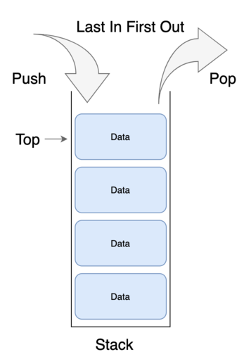
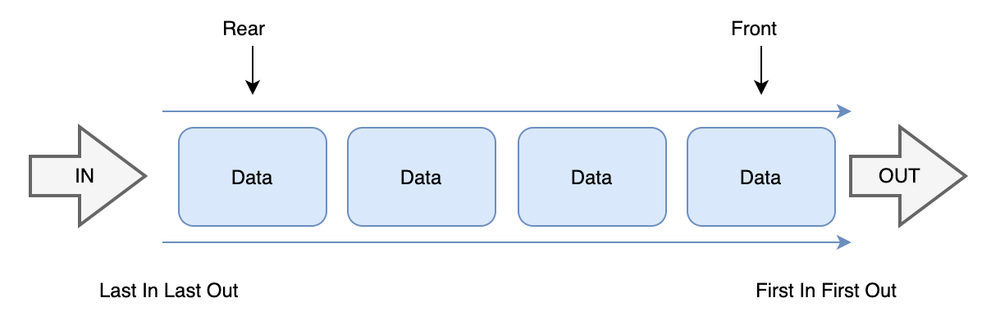

# 스택과 큐

### 내용 정리하기 전에
- 해당 내용 정리는 코딩 인터뷰 완전 분석 책의 자료구조 파트를 정리하였음
- 큐와 스택 모두 연결리스트로 구현할 수 있음
    - 스택은 같은 방향에서 아이템을 추가하고 삭제한다는 조건하에 연결리스트로 구현할 수 있음
    - 큐는 연결리스트의 반대 반향에서 항목을 추가하거나 제거하도록 구현한다면 근본적으로 큐와 같음
- 자료구조에 널리 사용되는 보편적인 기법에 대해 작성되어 있음

<br>



<br>

### 스택이란?
- 스택 자료구조란 말 그대로 데이터를 쌓아 올린다(stack)의 의미로 LIFO(Last-In-First-Out: 후입선출)에 따라 자료를 배열
- 스택은 배열과 달리 상수 시간에 i번째 항목에 접근할 수 없지만 데이터를 추가하거나 삭제하는 연산은 상수 시간에 가능함
    - 삽입 삭제는 모두 Top에서 일어나기 때문에 상수 시간이 소요되어 O(1)의 시간 복잡도를 가짐
- 접시를 쌓아 두었다가 사용할 때와 마찬가지로 가장 최근에 스택에 추가한 항목이 가장 먼저 제거될 항목으로 스택의 연산으로는 다음과 같음
    - pop() : 스택에서 가장 위에 있는 항목을 제거
    - push(item) : item 하나를 스택의 가장 윗 부분에 추가
    - peek() : 스택에 가장 위에 있는 항목을 반환 (제거 X)
    - isEmpty() : 스택이 비어있을 때에 true를 반환
- 스택이 유용한 경우는 재귀 알고리즘을 사용할 때로 재귀적으로 함수를 호출해야할 때 임시 데이터를 스택에 넣어주고 재귀 함수를 빠져 나와 퇴각 검색(backtrack)을 할때 스택에 넣어두었던 임시 데이터를 빼주는 행위를 직관적으로 가능하게함
    - 스택은 또한 재귀 알고리즘을 반복적 형태(iterative)를 통해서 구현할 수 있게 해줌

<br>

```java
public class StackNode<T> {
    T data;
    StackNode<T> next;

    public StackNode(T data) {
        this.data = data;
    }
}

public class StackEx<T> {
    private StackNode<T> top;

    public T pop() {
        if (top == null) {
            throw new EmptyStackException();
        }

        T item = top.data;
        top = top.next;

        return item;
    }

    public void push(T item) {
        StackNode<T> t = new StackNode(item);
        t.next = top;
        top = t;
    }

    public T peek() {
        if (top == null) {
            throw new EmptyStackException();
        }

        return top.data;
    }

    public boolean isEmpty() {
        return top == null;
    }

    public int search(T item) {
        int position = 1;
        StackNode<T> current = top;

        while(current != null) {
            if (current.data.equals(item)) {
                return position;
            }

            current = current.next;
            position++;
        }

        return -1;
    }
}

```

<br>



<br>

### 큐란?
- 큐는 FIFO(First-In-First-Out: 선입선출)에 따라 자료를 배열
- 큐는 매표소의 사람들이 움직이는 형터 채럼 큐에 저장되는 항목들을 큐에 추가되는 순서대로 제거하고 큐의 연산으로는 다음과 같음
    - add(item) : item을 리스트의 끝부분에 추가한다
    - remove() : 리스트의 첫 번째 항목을 제거
    - peek() : 큐에서 가장 위에 있는 항목을 반환
    - isEmpty() : 큐가 비어 있을 때에 true를 반환
- 큐는 BFS(Breadth-First Search : 너비 우선 탐색)을 하거나 캐시를 구현하는 경우에 종종 사용됨
    - 노드를 하나 처리할 때마다 해당 노드와 인접한 너드들을 큐에 다시 저장함으로써 노드에 접근한 순서대로 처리할 수 있게 함

<br>

```java
public class QueueNode<T> {
    T data;
    QueueNode next;

    public QueueNode(T data) {
        this.data = data;
    }
}

public class QueueEx<T> {
    private QueueNode<T> first;
    private QueueNode<T> last;

    public boolean add(T item) {   // 큐가 가득찼다면 false 추가했다면 true 반환하는 offer()
        QueueNode t = new QueueNode(item);
        if (last != null) {
            last.next = t;
        }
        last = t;

        if(first == null) {
            first = last;
        }
        return true;
    }

    public T remove() { // null 도 반환한다면 poll()
        if(first == null) {
            throw new NoSuchElementException();
        }

        T data = first.data;
        first = first.next;
        if(first == null) {
            last = null;
        }

        return data;
    }

    public T element() { // null 도 반환한다면 peek()
        if(first == null) {
            throw new NoSuchElementException();
        }

        return first.data;
    }

    public boolean isEmpty() {
        return first == null;
    }

    public int size() {
        int count = 0;
        QueueNode<T> current = first;

        while (current != null) {
            count++;
            current = current.next;
        }

        return count;
    }

    public void clear() {
        first = null;
        last = null;
    }
}

```

<br>

## 연습 문제

<br>

### 3-1. 한개로 세개 : 배열 한 개로 스택 세개를 어떻게 구현할지 설명하라

<br>

### 3-2. 스택 Min:기본적인 push와 pop 기능이 구현된 스택에서 최솟값을 반환하는 min 함수를 추가하려고 한다. 어떻게 설계할 수 있겠는가? push, pop, min 연산은 모두 0(1) 시간에 동작해야 한다.

<br>

### 3-3. 접시무더기: 접시 무더기를 생각해보자 접시를 너무 높이 쌓으면 무너져내릴 것이다. 따라서 현실에서는 접시를 쌓다가 무더기가 어느 정도 높아지면 새로운 무더기를 만든다. 이것을 흉내내는 자료구조 SetOfStacks를 구현해보라. SetOfStacks는 여러 개의 스택으로 구성되어있으며, 이 전 스택이 지정된 용량을 초과하는 경우 새로운 스택을 생성해야 한다. SetOfStacks.push()와 SetOfStacks.pop()은 스택 이 하나인 경우와 동일하게 동작해야 한다(다시 말해， pop()은 정확히 하나의 스택이 있을 때와 통일한 값을반환해야한다).

<br>

### 3-4. 스태으로 큐: 스택 두 개로 큐 하나를 구현한 MyQueue 클래스를 구현하라.

<br>

### 3-5. 스택 정렬: 가장 작은 값이 위로 오도록 스택을 정렬하는 프로그램을 작성하라. 추가적으로 하나 정도의 스택은 사용해도 괜찮지만， 스택에 보관된 요소를 배열 퉁의 다른 자료구조로 복사할 수는 없다. 스택은 push,pop,peek,isEmpty의 네 가지 연산을 제공해야 한다.

<br>

### 3-6. 동물 보호소: 먼저 들어온 동물이 먼저 나가는 동물 보호소(animal shelter)가 있다고 하자. 이 보호소는 개와 고양이만 수용한다. 사람들은 보호소에서 가장 오래된 동물부터 입양할 수 있는데， 개와 고양이 중 어떤 동물을 데려갈지 선택할 수 있다. 하지만 특정한 동물을 지정해 데려갈 수는 없다. 이 시스템을 자료구조로 구현하라. 이 자료구조는 enqueue,dequeueAny,dequeueDog,dequeueCat의 연산을 제공해야 한다. 기본적으로 탑재되어 있는 LinkedList 자료구조를 사용해도 좋다.

<br>

### Reference
- https://yoongrammer.tistory.com/45S