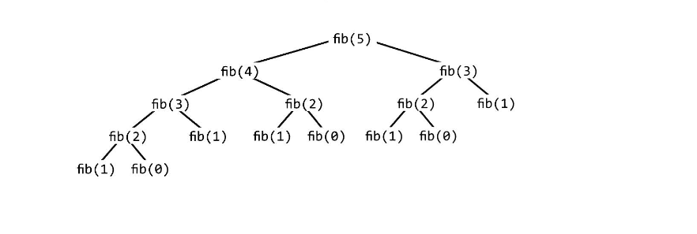
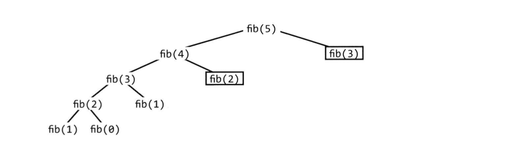

# 재귀와 동적 프로그래밍

### 재귀
- 재귀란 자신을 정의할 때 자기자신을 재참조하는 것으로 자기 자신을 계속 호출하는 함수로 반복 연산에 자주 사용됨
- 재귀와 관련된 문제들은 많지만 주어진 문제가 재귀인지 확인하는 좋은 방법은 해당 문제를 작은 크기의 문제로 만들 수 있는지 보는 것
- 함수가 호출될 때 스택 메모리를 사용하게 되어 쌓이면 메모리를 많이 차지하게 되어 성능이 좋지 않아 질 수 있음. 메모리가 부족해지면 stack overflow 발생

<br>

### 재귀 접근법
- 재귀적 해법은 부분문제(subproblem)에 대한 해법을 통해 완성되므로 단순히 f(n-1)에 대한 해답에 무언가를 더하거나, 제거하거나, 아니면 그 해답을 변경하여 f(n)을 계산해 내거나 데이터를 반으로 나눠 각각에 대해 문제를 푼 후 이 둘을 병합하기도 함
- 주어진 부분문제로 나누는 방법으로 여러가지가 있는데 가장 흔하게 사용되는 세가지 방법으로는 상향식(bottom-up), 하향식(top-down), 반반(half-and-half)이 있음

#### 상향식 접근법
- 가장 직관적인 경우가 많은데 이 접근법은 우선 간단한 경우들에 대한 풀이법을 발견하는 것으로부터 시작
- 리스트를 예로 들어보면 처음에는 원소하나를 갖는 리스트로부터 시작하지만 다음에는 원소 두 개가 들어있는 리스트에 대한 풀이법을 찾고 그 다음은 세개 원소를 갖는 리스트에 대한 풀이법을 찾음
- 이 접근법의 핵심은 이전에 풀었던 사례를 확장하여 다음 풀이를 찾는다는 점

#### 하향식 접근법
- 덜 명확해 복잡해 보일 수 있으나 가끔은 이 방법에 대해 생각해 보기에 가장 좋은 방법이기도 함
- 이러한 문제들은 어떻게 하면 N에 대한 문제를 부분 문제로 나눌 수 있을지 생각해봐야하고 나뉜 부분 문제의 경우가 서로 겹치지 않도록 주의한다

#### 반반 접근법
- 상향식 접근법과 하향식 접근법 외 데이터를 절반으로 나누는 방법으로 종종 유용함
- 이진 탐색은 반반 접근법을 이용한 탐색 방법으로 정렬된 배열에서 특정 원소를 찾을 때 가장 먼저 왼쪽 절반과 오른쪽 절반 중 어디를 봐야한지 확인하고 이와 같은 방식으로 절반씩 재귀적으로 탐색해나감
- 병합 정렬 또한 반반 접근법을 이용한 정렬방법으로 배열 절반을 각각 정렬한 뒤 이들을 하나로 병합함

<br>

### 재귀적 해법 vs 순환적 해법
- 재귀적 알고리즘을 사용하면 공간 효율성이 나빠질 수 있음. 재귀 호출이 한 번 발생할 때마다 스택에 새로운 층을 추가해야 함
    - 이는 재귀의 깊이가 n일 때 O(n) 만큼의 메모리를 사용하게 된다는 것을 의미
- 공간 효율성의 이유로 재귀적 알고리즘을 순환적 알고리즘으로 구현하는 것이 나을 수 있고 모든 재귀적 알고리즘은 순환적 알고리즘으로 구현될 수는 있지만 순환적으로 구현된 코드는 때로 훨씬 더 복잡
- 재귀적으로 작성하기 전 순환적으로 작성하면 얼마나 더 어려울지 자문해보고 두 방법 사이 타협점에 대해 면접관과 상의

<br>

### 동적계획법 vs 메모이제이션
- 동적 프로그래밍은 거의 대부분 재귀적 알고리즘과 반복적으로 호출되는 부분문제를 찾아내는 것이 관건. 이를 찾은 뒤에는 나중을 위해 현재 결과를 캐시에 저장해 놓으면 됨
- 혹은 재귀 호출의 패턴을 유심히 살펴본 뒤 순환적 형태로 구현할 수 있지만 여전히 결과를 '캐시'에 저장해야함
    - 이 책에서는 상향식, 하향식 모두 동적 프로그래밍으로 불러서 설명한다고 명시되어 있음
- 동적 프로그래밍을 설명하는 가장 간단한 예시는 n번째 피보나치 수를 찾는 것. 이런 문제를 풀 때는 일반적인 재귀로 구현한뒤 캐시 부분을 나중에 추가하는 것이 좋음

<br>

#### 피보나치 수 재귀
```java
int fibonacci(int i) {
    if(i == 0) {
        return 0;
    }

    if(i == 1) {
        return 1;
    }

    return fibonacci(i - 1) + fibonacci(i - 2);
}
```



<br>

- 각 호출에 소요되는 시간이 O(1)이므로 트리의 전체 노드의 개수와 수행시간은 같으므로 총 호출 시간이 됨
    - 노드마다 자식 노드를 2개씩 가지고 있으므로 이를 n번 반복하면 대략 2^n 개의 노드를 갖게 됨
    - 해당 함수의 수행시간은 대강 O(2^n)이지만 실제로는 오른쪽 부분 트리가 왼쪽 부분트리보다 항상 작기 때문에 실제 수행시간은 O(1.6^n) 정도에 가깝다고 함

<br>

#### 하향식 동적 프로그래밍 (메모이제이션)
- 재귀 트리에서 중복되는 노드가 많은데 이러한 것들을 다시 계산할 필요가 없음
- fib이 탐색할 경우의 수가 O(n)이므로 함수를 O(n)번 이상 호출하면 안되고 결과를 캐시에 저장하고 저장된 값을 사용하면 됨. 이것을 메모이제이션이라고 함

```java
int fibonacci(int n) {  // n번 반복할 만큼 배열 생성
    return fibonacci(n, new int[n + 1]);
}

int fibonacci(int i, int[] memo) {
    if (i == 0 || i == 1) { // 0 이나 1일 경우 반환
        return i;
    }

    if(memo[i] == 0) {  // 해당 인덱스의 배열이 저장되어 있지 않아 값을 구함
        memo[i] = fibonacci(i - 1, memo) + fibonacci(i - 2, memo);
    }

    return memo[i]; // 값 반환
}
```



- 이 트리의 개수는 대략 깊이 n까지 곧장 내려가고 각 노드의 자식 노드는 한개이므로 모든 노드의 개수는 대략 2n개가 됨
    - 따라서 수행시간은 O(n)
- 아래로 길게 늘어진 트리가 아니라 옆으로 넓게 확장된 트리의 경우 깊이 우선이 아닌 너비 우선과 같은 모양이되는데 때로는 이런 모양의 트리는 캐시값을 반환하거 어느 노드에서 가지를 확장해 나갈지 결정하면 됨
    - 동적 프로그래밍 문제의 수행시간을 구하는데 어려움을 겪는다면 트리 모양을 옆으로 확장해보면 좋음

<br>

#### 상향식 동적 프로그램
- 위의 설명한 방식으로 접근후 상향식으로도 할 수 있음
- 위와 마찬가지로 재귀적인 메모이제이션으로 접근하되 뒤집어서 생각하면됨. 초기사례부터 계산하기 시작해 특정 fib(n)까지 계산

```java
int fibonacci(int n) {
    if (n == 0) {
        return 0;
    } else if (n == 1) {
        return 1;
    }

    int[] memo = new int[n];
    memo[0] = 0;
    memo[1] = 1;

    for(int i = 2; i < n; i ++) {
        memo[i] = memo[i - 1] + memo[i - 2];
    }

    return memo[n - 1] + memo[n - 2];
}
```


<br>

- 위의 코드는 배열을 애초에 한번씩 만 사용하므로 변수를 사용하도록 바꾸어도 됨
- 이 과정을 이해해야 어려운 문제를 더 쉽게 만들 수 있을 것

```java
int fibonacci(int n) {
    if (n == 0) {
        return 0;
    }

    int a = 0;
    int b = 1;
    for (int i = 2; i < n; i++) {
        int c = a + b;
        a = b;
        b = c;
    }

    return a + b;
}
```