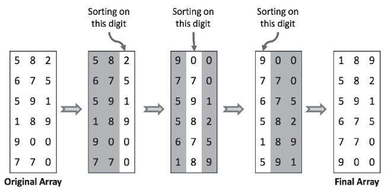

# 정렬과 탐색

### 정렬 및 탐색
- 많은 정렬, 탐색 문제는 잘 알려진 알고리즘들을 변용하여 출제됨. 그러므로 여러 정렬 알고리즘을 알고 어떤 상황에서 어떤 알고리즘이 어울릴지 살펴두는 것이 좋음 
- Person 이라는 큰 배열이 주어지고 해당 객체를 나이순으로 정렬한다고 가정할 때 중요한 힌트는 다음과 같음
    - 배열의 크기가 크므로, 효율성이 중요
    - 나이순으로 정렬하는 것이므로 그 값의 범위가 좁다는 것을 알 수 있음
    - 이러한 힌트를 통해 버킷 정렬 혹은 기수 정렬이 어울린다는 것을 알 수 있음

<br>

## 널리 사용되는 정렬 알고리즘
- 자주 사용되는 정렬 알고리즘을 알아두면 문제풀이 능력이 크게 향상시킬 수 있음
- 해당 책에서는 병합 정렬, 퀵 정렬, 버킷 정렬과 관련된 문제가 가장 많이 출제 됨

<br>

### 버블 정렬(bubble sort)
- 평균 및 최악 실행 시간 : O(n^2), 메모리 : O(1)
- 버블 정렬은 배열의 첫 원소부터 순차적으로 진행하며, 현재 원소가 그 다음 원소의 값보다 크면 두 원소를 바꾸는 작업을 반복함
- 이런 식으로 배열을 계속 살펴보면서 완전히 정렬된 상태가 될 때까지 반복

```java
public static void bubbleSort(int[] arr) {
    for (int i = 0; i < arr.length - 1; i++) {
        for (int j = 1; j < arr.length - i; j++) {
            if (arr[j - 1] > arr[j]) {
                int temp = arr[j - 1];
                arr[j - 1] = arr[j];
                arr[j] = temp;
            }
        }
    }
}
```

<br>

### 선택 정렬(selection sort)
- 평균 및 최악 실행 시간 : O(n^2), 메모리 O(1)
- 배열을 선형 탐색(linear scan)하며 가장 작은 원소를 배열 맨 앞으로 보내고 그 다음 작은 수를 계속 선택하여 앞으로 보내는 작업을 모든 원소가 정렬될 때 까지 반복
- 심플하지만 비효율적인 정렬 알고리즘

```java
public static void selectionSort(int[] arr) {
    for (int i = 0; i < arr.length; i++) {
        int minIndex = i;

        for (int j = i + 1; j < arr.length; j++) {
            if (arr[minIndex] > arr[j])
                minIndex = j;
        }

        int tmp = arr[i];
        arr[i] = arr[minIndex];
        arr[minIndex] = tmp;
    }
}
```

<br>

### 병합 정렬(merge sort)
- 평균 및 최악 실행 시간 : O(nlog n), 메모리 : 상황에 따라 다름
- 병합 정렬은 배열을 절반씩 나누어 각각을 정렬한 다음 이 둘을 합하여 다시 정렬하는 방법
- 나눈 절반을 정렬할 때도 같은 알고리즘이 사용되어 재귀를 통해 반복되다 결국에는 원소 한 개짜리 배열 두 개를 병합하게 됨
- 이 알고리즘에서는 '병합'을 처리하는 것이 가장 복잡함
- 병합 작업을 수행하는 메서드는 병합 대상이 되는 배열의 두 부분을 임시 배열(helper)에 복사하고 왼쪽 절반 시작 지점(helperLeft)과 오른쪽 절반의 시작 지점(helperRigth)을 추적
- 그런 다음 helper를 순회 시키면서 두 배열에서 더 작은 값의 원소를 꺼내어 원래 배열에 복사해 넣음
- 두 배열에 대한 순회가 끝난 경우 다른 배열의 남은 부분을 원래 배열에 남김없이 복사해 넣고 작업을 마침
- 안정적인 정렬 알고리즘이지만 병합할때 예비 공간을 추가로 사용하여 메모리 사용량이 큼

<br>


<br>

```java
private static int[] helper; // 배열의 값을 잠시 복사해둘 공간

public static void mergeSort(int[] arr) {
    helper = new int[arr.length];
    mergeSort(arr, 0, arr.length - 1);
}

private static void mergeSort(int[] arr, int start, int end) {  // 분할 및 정복
    if (start < end) {
        int mid = (start + end) / 2;
        mergeSort(arr, start, mid);
        mergeSort(arr, mid + 1, end);
        merge(arr, start, mid, end);
    }
}

private static void merge(int[] arr, int start, int mid, int end) {     // 병합
    helper = arr.clone();   // 복사를 해두고 복사한 배열을 가지고 값을 비교해서 기존 배열 인덱스에 요소를 넣음

    int helperLeft = start;
    int helperRight = mid + 1;
    int current = start;

    while (helperLeft <= mid && helperRight <= end) {   // helperLeft가 mid를 넘어가거나, helperRight가 end를 넘어가기 전까지 반복
        if (helper[helperLeft] <= helper[helperRight]) {    // 왼쪽 배열과 오른쪽 배열 중 낮은 수를 배열에 넣음
            arr[current++] = helper[helperLeft++];
        } else {
            arr[current++] = helper[helperRight++];
        }
    }

    for (int i = 0; i <= mid - helperLeft; i++) {
        arr[current + i] = helper[helperLeft + i];
        /*
            왼쪽 배열이 비워진 경우 : 오른쪽 배열에 요소가 남아있고 helperLeft가 mid를 넘었음. 어차피 오른쪽 배열이 남아있다면 기존 배열 위치와 동일하기 때문에 별도의 처리가 필요하지 않음
            오른쪽 배열이 비워진 경우 : 왼쪽 배열에 요소가 남아있고 helperLeft가 mid를 넘지 못함. 현재 배열에 helperLeft를 더한 인덱스 값을 넣어주면 됨
        */
    }
}
```

<br>

### 퀵 정렬(quick sort)
- 실행 시간 : 평균 O(nlog n), 최악 O(n^2), 메모리 : O(log n)
- 무작위로 선정된 한 원소를 사용하여 배열을 분할하여 선정된 원소보다 작은 원소들은 앞에, 큰 원소들은 뒤로 보냄
- 배열 분할 작업은 연속된 스왑 연산을 통해 효율적으로 수행됨
- 배열과 그 부분 배열을 반복적으로 분할해 나가면 결국 배열은 정렬된 상태에 도달
- 무작위로 선정되었던, 배열 분할의 사용되는 중간값의 원소가 중간값에 가까운 값이 되리라는 보장이 없어 정렬 알고리즘이 느리게 동작할 수 있음

<br>

```java
public static void quickSort(int[] a) {
    quickSort(a, 0, a.length - 1);
}

private static void quickSort(int[] a, int left, int right) {
    if(left >= right) {
        return;
    }

    int index = partition(a, left, right);

    if(left < index - 1) {
        quickSort(a, left, index - 1);
    }

    if(index < right) {
        quickSort(a, index, right);
    }
}

private static int partition(int[] a, int left, int right) {
    int pivot = a[(left + right) / 2];

    while (left <= right) {
        while (a[left] < pivot) {
            left++;
        }

        while (a[right] > pivot) {
            right--;
        }

        if (left <= right) {
            swap(a, left, right);
            left++;
            right--;
        }
    }

    return left;
}

private static void swap(int[] a, int i, int j) {
    int temp = a[i];
    a[i] = a[j];
    a[j] = temp;
}
```

<br>

### 기수 정렬(radix sort)
- 실행 시간 : O(kn)
- 데이터가 정수처럼 유한한 비트로 구성되어 있는 경우 사용
- 각 자릿수를 순회해 나가면서 각 자리의 값에 따라 그룹을 나눔. 정수 배열이 주어졌다면 첫 번째 자릿수를 기준으로 정렬하고 각 그룹마다 두 번째 자리수를 기준으로 정렬을 수행하며 모든 자릿수에 대해 반복
- 비교 연산을 사용하는 정렬 알고리즘은 평균적으로 O(nlog n)보다 나은 성능을 보일 수 없으나 기수 정렬은 O(kn)이 됨

<br>



<br>

```java
private static final int bucketSize = 10;

public static void radixSort(int[] arr) {
    Queue<Integer>[] bucket = new LinkedList[bucketSize]; // 각 지릿수에 해당하는 큐 배열 생성
    for (int i = 0; i < bucketSize; i++) {
        bucket[i] = new LinkedList<>();
    }

    int max = getMax(arr); // 배열에서 최대값 구하기
    int maxDigit = 0;   // 최대값 자릿수 구하기
    while (max != 0) {
        max /= 10;
        maxDigit++;
    }

    int factor = 1; // 비교 자리

    //정렬할 자릿수의 크기 만큼 반복한다.
    for (int d = 0; d < maxDigit; d++) {
        for (int i = 0; i < arr.length; i++) {
            int queueIndex = (arr[i] / factor) % 10;    // arr 배열을 자리수로 나누고 해당 큐에 값 저장
            bucket[queueIndex].add(arr[i]);
        }

        int index = 0;
        for (int i = 0; i < bucketSize; i++) {  // 버켓에서 arr 배열도 값 넣기
            while (!bucket[i].isEmpty()) {
                arr[index++] = bucket[i].poll();
            }
        }

        factor *= 10;
    }
}

// 배열에서 최대값을 구하는 메서드
private static int getMax(int[] arr) {
    int max = arr[0];
    for (int i = 1; i < arr.length; i++) {
        if (arr[i] > max) {
            max = arr[i];
        }
    }
    return max;
}
```

<br>

### 탐색 알고리즘
- 일반적으로 이진 탐색이 떠오르는데 이는 공부하기 좋은 알고리즘
- 이진 탐색은 정렬된 배열에서 원소 x를 찾고자 할 때 사용하여 x를 중간에 위치한 원소와 비교한 뒤 x가 중간에 위치한 값보다 작다면 왼쪽 절반을 재탐색하고 크다면 배열의 오른쪽 절반을 재탐색하는 과정을 크기가 0이 될 때까지 반복
- 어떤 노드를 찾는 탐색 작업에는 이진 트리를 사용할 수도 있고 해시 테이블을 사용할 수도 있음. 이진 탐색에만 얽매이지 않도록 할 것

<br>

```java
int binarySearch(int[] a, int x) {  // 반복으로 구현
    int low = 0;
    int high = a.length - 1;
    int mid;

    while (low <= high) {
        mid = (low + high) / 2; 
        
        if (a[mid] < x) {   // 오른쪽 탐색
            low = mid + 1;
        } else if (a[mid] > x) {
            high = mid - 1; // 왼쪽 탐색
        } else {
            return mid;
        }
    }
    return -1;  // 에러
}

int binarySearchRecursive(int[] a, int x, int low, int high) {  // 재귀로 구현
    if (low > high) return -1; // 에러

    int mid =(low + high) / 2;
    
    if (a[mid] < x) {
        return binarySearchRecursive(a, x, mid + 1, high); 
    } else if (a[mid] > x) {
        return binarySearchRecursive(a, x, low, mid - 1);
    } else {
        return mid;
    }
}
```

<br>

## 문제 풀이

### 10-2. Anagram 묶기 : 철자 순서만 바꾼 문자열 (anagram)이 서로 인접하도록 문자열 배열을 정렬하는 메서드를 작성하라.


<br>


### 10-8. 중복찾기 : 1부터 N(<=32000)까지의 숫자로 이루어진 배열이 있다. 배열엔 중복된 숫자가 나타날 수 있고， N이 무엇인지는 알 수 없다. 사용 가능한 메모리가 4KB일 때，중복된 원소를 모두 출력하려면 어떻게 할 수 있을까?


<br>

### Reference
- https://gmlwjd9405.github.io/2018/05/08/algorithm-merge-sort.html
- https://www.ritambhara.in/radix-sort/