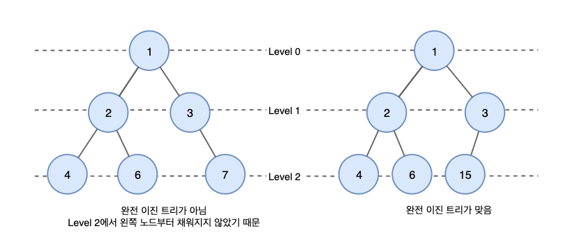
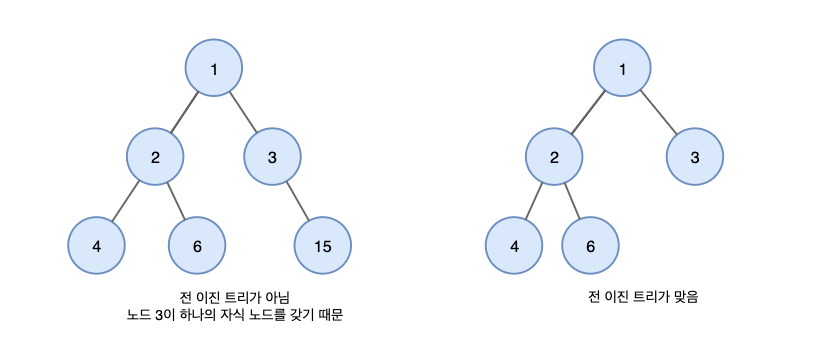
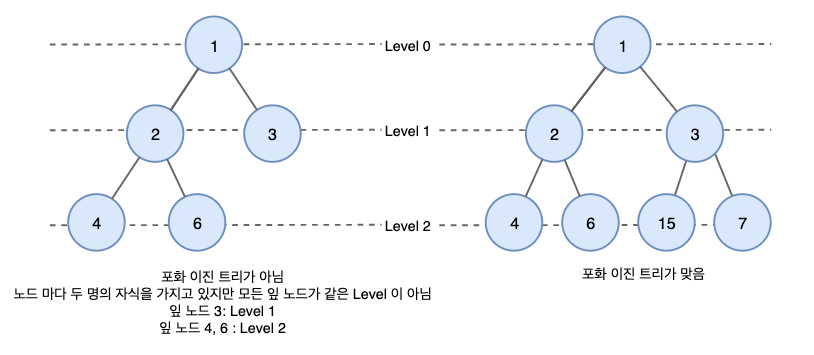
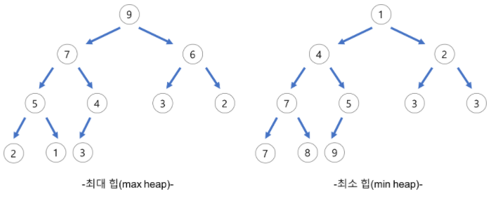
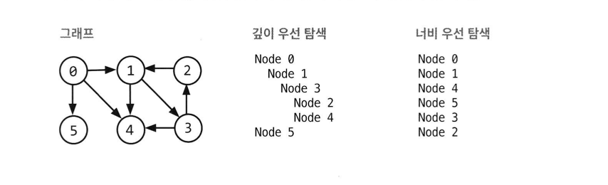

# 트리와 그래프

### 내용 정리하기 전에
- 해당 내용 정리는 코딩 인터뷰 완전 분석 책의 자료구조 파트를 정리하였음
- 자료구조에 널리 사용되는 보편적인 기법에 대해 작성되어 있음

<br>

### 트리란?
- 그래프의 일종으로 정점과 간선을 이용하여 데이터의 배치 형태를 추상화한 자료구조
- 서로 다른 두 노드를 연결하는 길이 하나뿐인 그래프를 트리라고 부름
- 일반적으로 대상 정보의 각 항목들을 계층적으로 구조화할 때 사용하는 비선형 자료구조
- 트리는 주로 저장된 데이터를 더 효과적으로 탐색'하기 위해서 사용
- 트리는 사이클이 없으며 루트노드를 제외한 모든 노드는 단 하나의 부모노드를 가짐
- 루트노드는 0개 이상의 자식 노드를 갖고 있으며 해당 개념은 자식노드들도 반복적으로 정의됨
- 자식이 없는 노드는 말단 노드라고 부름

<br>

```java
// 간단한 트리 구현
class Node {
    public String name;
    public Node[] children;
}

class Tree {
    public Node root;
}
```

<br>

### 이진트리와 이진 탐색 트리
- 이진 트리(binary tree)는 각 노드가 최대 두 개의 자식을 갖는 트리를 말함
    - 각 노드가 가질 수 있는 자식의 숫자로 이름이 지어짐 (삼진 트리, 10차 트리 등)
- 이진 탐색 트리는 모든 노드가 다음과 같은 특정 순서를 따르는 속성이 있는 이진 트리
    - 모든 왼쪽 자식들 <= n < 모든 오른쪽 자식들
- 같은 값은 처리하는 방식에 따라 이진 탐색 트리는 약간씩 정의가 달라질 수 있어 중복된 값을 가질 수 있는지, 중복된 값은 왼쪽 혹은 오른쪽 혹은 양쪽에 존재할 수 있는지 아는 것이 좋음
- 코딩테스트에서 트리 문제를 바로 이진 탐색 트리라고 가정해버리는 것은 좋지 않음

<br>

### 균형트리와 비균형 트리
- 많은 트리가 균형잡혀 있지만 모두 그런 것은 아님
- 균형 트리인지 확인하는 방법 중 하나로 O(logN) 시간에 insert와 find를 할 수 있을 정도로 균형이 잡혀있는지 확인할 수 있음
    - 꼭 완벽하게 균형 잡혀 있을 필요는 없음
- 균형 트리의 일반적인 유형으로는 레드-블랙 트리, AVL 트리 이렇게 두가지가 존재

<br>

### 이진 트리 종류
#### 1. 완전 이진 트리
- 완전 이진 트리(complete binary tree)는 트리의 모든 높이에서 노드가 꽉 차있는 이진 트리
- 마지막 단계(level)은 꽉 차지 않아도 되지만 노드가 왼쪽에서 오른쪽으로 채워져야 함

<br>



<br>

#### 2. 전 이진 트리
- 전 이진 트리(full binary tree)는 모든 노드의 자식이 없거나 정확히 두 개 있는 경우
- 자식이 하나만 있는 노드가 존재해서는 안되는 트리

<br>



<br>

#### 3. 포화 이진 트리
- 포화 이진 트리(perfect binary tree)는 전 이진 트리이면서 완전 이진 트리인 경우
- 모든 말단 노드는 같은 높이에 있어야 하며, 마지막 단계에서 노드의 개수가 최대가 되어야 함
- 포화 이진 트리는 노드의 개수가 정확히 2^k - 1 이여야 한다는 점에서 면접상황이나 실제 상황 모두 흔하게 나타나는 경우는 아님

<br>



<br>

### 이진 트리 순회
- 중위 (in-order), 전위 (pre-order), 후위 (post-order) 순회가 존재
- 가장 빈번하게 사용되는 순회 방식은 중위 순회

#### 중위 순회 (in-order traversal)
- 중위 순회는 왼쪽 가지(branch), 현재 노드, 오른쪽 가지 순서로 노드를 '방문'하고 출력하는 방법
- 해당 방식으로 순회하면 오름차순으로 방문하게 됨

```java
void inOrderTraversal(TreeNode node) {
    if (node != null) {
        inOrderTraversal(node.left);
        visit(node);
        inOrderTraversal(node.right);
    }
}
```

<br>

#### 전위 순회 (pre-order traversal)
- 전위 순회는 자식 노드보다 현재 노드를 먼저 방문하는 방법
- 전위 순회에서 가장 먼저 방문하게 될 노드는 언제나 루트 노드

```java
void preOrderTraversal(TreeNode node) {
    if (node != null) {
        visit(node);
        preOrderTraversal(node.left);
        preOrderTraversal(node.right);
    }
}
```

<br>

#### 후위 순회 (post-order traversal)
- 후위 순회는 모든 자식 노드들을 먼저 방문한 뒤 마지막에 현재 노드를 방문하는 방법

```java
void postOrderTraversal(TreeNode node) {
    if (node != null) {
        postOrderTraversal(node.left);
        postOrderTraversal(node.right);
        visit(node);
    }
}
```

<br>

### 이진 힙(최소힙과 최대힙)
- 최소힙은 오름차순으로 정렬되어 있고 최대 힙은 내림차순으로 정렬되어 있다는 점 빼고는 완전히 같아 해당 책에서는 최소힙만을 설명하고 있음
- 최소힙은 트리의 마지막 단계에서 오른쪽 부분을 뺀 나머지 부분이 가득 채워져 있다는 점에서 완전 이진 트리
- 최소힙은 각 노드의 원소가 자식들의 원소보다 작다는 특성이 있어 루트는 트리 전체에서 가장 작은 원소가 됨
- 최소힙에는 insert와 extract_min이라는 핵심 연산 두 가지 존재
- 삽입은 언제나 트리의 밑바닥부터 삽입을 시작하고 완전 트리의 속성에 위배되지 않도록 새로운 원소는 가장 오른쪽 위치로 삽입되고 그 다음 새로운 원소가 제대로 된 자리를 찾을 때까지 부모 노드와 교환해 나간다
- 최소힙에서 최소 원소를 찾는 일은 언제나 가장 위의 놓이기 때문에 쉬움
- 최소힙에서 최소 원소를 제거한다면 가장 마지막 원소와 루트를 교환하고 그 다음 최소 힙의 성질을 만조갛도록 해당 노드를 자식 노드와 교환해 나가면서 밑으로 내보냄. 해당 알고리즘은 O(log n)시간이 소요됨

<br>



<br>

### 트라이(접두사 트리)
- 트라이는 n-차 트리의 변종으로 각 노드에 문자를 저장하는 자료구조로 트리를 아래쪽으로 순회하면 단어 하나가 나오게 됨
- 트라이에서 null 노드라고 부르는 '* 노드'는 단어의 끝을 나타냄
- '* 노드'는 실제 구현으로 특별한 자식 노드로 표현 될 수 있음. TrieNode를 상속한 TerminatingTrieNode로 표현될 수 있음
- 아니면 '* 노드'의 '부모 노드' 안에 불린 플래그를 새로 정의함으로써 단어의 끝을 표현할 수 있음
- 트라이에서 각 노드는 1개에서 ALPHABET_SIZE + 1 개까지 자식을 가지고 있을 수 있음 ( 만약 '* 노드' 대신 불린 플래그를 사용했다면 0개에서 ALPHABET_SIZE 까지 )
- 유효한 단어 집합을 이용하는 많은 문제들을 트라이를 통해 최적화 할 수 있고 트라이에어 연관된 접두사를 반복적으로 검색해야 하는 상황에서는 트리의 현재 노드를 참조값으로 넘길 수도 있음
    - 해당 방식으로 하면 매번 검색할 때마다 루트에서 시작할 필요가 없고 단순히 'MANY'의 경우 'Y'가 'MAN'의 자식인지만 확인해보면 됨

<br>

### 그래프란?
- 트리는 그래프(graph)의 한 종류로 단순히 노드와 그 노드를 연결하는 간선(edge)을 하나로 모아 놓은 것과 같음
    - 트리는 사이클이 없는 하나의 연결 그래프임
- 그래프는 방향성이 있을 수도 있고 없을 수도 있음
- 그래프에서는 사이클이 있을 수도 있고 없을 수도 있는데 사이클이 없는 그래프는 '비순환 그래프'라고 부르고 사이클이 있는 그래프는 '순환 그래프'라고 부름
- 그래프는 여러 개의 고립된 부분 그래프로 구성될 수 있고 모든 정점 쌍 간에 경로가 존재하는 그래프는 '연결 그래프'라고 함

<br>

### 프로그래밍 관점에서의 그래프 표현 방법
#### 1. 인접 리스트(adjacency list)
- 그래프를 표현할 때 사용되는 가장 일반적인 방법
- 모든 정점을 인접 리스트에 저장
- 무방향 그래프에서 간선은 두 번 저장됨
- 한 번은 a 정점에 인접한 간선을 저장하고 다른 한 번은 b에 인접한 간선을 저장

```java
class Graph {
    public Node[] nodes;
}

class Node {
    public String name;
    public Node[] children;
}
// 트리에서는 특정 노드하나에서 모든 노드로 접근이 가능하여 굳이 Tree 클래스를 따로 두지 않았다고 함
```

<br>

#### 2. 인접 행렬(adjacency matrix)
- 인접 행렬은 N*N 불린 행렬로써 matrix[i][j]가 true 면 i에서 j로 간선이 있다는 의미
    - N은 노드의 개수를 의미
    - 무방향 그래프를 인접 행렬로 표현한다면 이 행렬은 대칭 행렬이 됨
- 인접 리스트를 사용한 알고리즘들, 예를 들면 너비 우선 탐색 또한 인접 행렬에서도 사용가능하나 인접 리스트와 다르게 인접한 노드를 찾기위해서는 모든 노드를 모두 순회해야 알 수 있어 조금 효율성이 떨어짐

<br>

### 그래프 탐색
- 그래프를 탐색하는 일반적인 방법으로는 깊이 우선 탐색 (depth-first search)과 너비 우선 탐색(breadth-first-search)이 있음
- 깊이 우선 탐색(DFS)은 루트노드(혹은 다른 임의의 노드)에서 시작해서 다음 분기로 넘어가기 전에 해당 분기를 완벽하게 탐색하는 방법
- 너비 우선 탐색(BFS)은 루트노드(혹은 다른 임의의 노드)에서 시작해서 인접한 노드를 먼저 탐색하는 방법
- 양방향 탐색(bidirectional search)은 출발지와 도착지 사이에 최단 경로를 찾을 때 사용되는 방법으로 기본적으로 출발지와 도착지 두 노드에서 동시에 너비 우선 탐색을 수행한 뒤 두 탐색 지점이 충돌하는 경우 경로를 찾는 방식



<br>

```java
void DfsSearch(Node root) {
    if(root null) {
        return;
    }

    visit(root);
    root.visited true;

    for each(Node n in root.adjacent) {
        if(n.visited == false) {
            DfsSearch(n) ;
        }
    }
}

void BfsSearch(Node root) {
    Queue queue = new Queue();
    root.marked = true;
    queue.enqueue(root);

    while(!queue.isEmpty()) {
        Node r = queue.dequeue();
        visit(r);
        for each(Node n in r.adjacent) {
            if (n.marksd == false) {
                n.marked = true;
                queue.enqueue(n);
            }
        }
    }
}

```

<br>

### 연습문제

#### 1. 노드 사이의 경로 : 방향 그래프가 주어졌을 때 두 노드 사이에 경로가 존재하는지 확인하는 알고리즘을 작성하라

<br>

#### 2. 최소 트리 : 오름차순으로 정렬된 배열이 있다. 이 배열 안에 들어 있는 원소는 정수이며 중복된 값이 없다고 했을 때 높이가 최소가 되는 이진 탐색 트리를 만드는 알고리즘을 작성학라

<br>

#### 3. 깊이의 리스트 : 이진 트리가 주어졌을 때 같은 깊이에 있는 노드를 연결리스트로 연결해 주는 알고리즘을 설계하라. 즉, 트리의 깊이가 D라면 D개의 연결리스트를 만들어야 한다

<br>

#### 4. 균형 확인 : 이진 트리가 균형 잡혀있는지 확인하는 함수를 작성하라. 이 문제에서 균형 잡힌 트리란 모든 노드에 대해서 왼쪽 부분 트리의 높이와 오른쪽 부분 트리의 높이의 차이가 최대 하나인 트리를 의미

<br>

#### 5. BST 검증 : 주어진 이진 트리가 이진 탐색 트리인지 확인하는 함수를 작성하라

<br>

#### 6. 후속자 : 이진 탐색 트리에서 주어진 노드의 '다음' 노드(중위 후속자)를 찾는 알고리즘을 작성하라. 각 노드에는 부모 노드를 가리키는 링크가 존재한다고 가정하자

<br>

#### 7. 순서 정하기 : 프로젝트의 리스트와 프로젝트들 간의 종속 관계(즉, 프로젝트 쌍이 리스트로 주어지면 각 프로젝트 쌍에서 두 번째 프로젝트가 첫 번째 프로젝트에 종속되어 있다는 뜻)가 주어졌을 때, 프로젝트를 수행해 나가는 순서를 찾으라. 유효한 순서가 존재하지 않으면 에러를 반환한다.

<br>

#### 8. 첫 번째 공통 조상 : 이진 트리에서 노드 두 개가 주어졌을 때 이 두 노드의 첫 번째 공통 조상을 찾는 알고리즘을 설계하고 그 코드를 작성하라. 자료구조 내에 추가로 노드를 저장해 두면 안된다. 반드시 이진 탐색 트리일 필요는 없다

<br>

#### 9. BST 수열 : 배열의 원소를 왼쪽에서부터 차례로 트리에 삽입함으로써 이진 탐색 트리를 생성할 수 있다. 이진 탐색 트리 안에서 원소가 중복되지 않는다고 할 때, 해당 트리를 만들어 낼 수 있는 모든 가능한 배열을 출력하라.

<br>

#### 10. 하위 트리 확인 : 두 개의 커다란 이진 트리 T1과 T2가 있다고 하자. T1이 T2보다 훨씬 크다고 했을 때, T2가 T1의 하위 트리인지 판별하는 알고리즘을 만들라. T1 안에 있는 노드 n의 하위 트리가 T2와 동일하면, T2는 T1의 하위 트리다. 다시 말해, T1에서 노드 n의 아래쪽을 끊어 냈을 때 그 결과가 T2와 동일해야 한다.

<br>

#### 11. 임의의 노드 : 이진 트리 클래스를 바닥부터 구현하려고 한다. 노드의 삽입, 검색, 삭제 뿐만 아니라 임의의 노드를 반환하는 getRandomNode() 메서드도 구현한다. 모든 노드를 같은 확률로 선택해주는 getRandomNode 메서드를 설계하고 구현하라. 또한 나머지 메서드는 어떻게 구현할지 설명하라

<br>

#### 12. 합의 경로 : 각 노드의 값이 정수인 이진 트리가 있다. 이때 정수의 합이 특정 값이 되도록 하는 경로의 개수를 세려고 한다. 경로가 꼭 루트에서 시작해서 말단 노드에서 끝날 필요는 없지만 반드시 아래로 내려가야 한다. 즉, 부모 노드에서 자식 노드로만 움직일 수 있다. 알고리즘을 어떻게 설계할 것 인가?

<br>

### Reference
- https://velog.io/@kimdukbae/자료구조-트리-Tree
- https://yoongrammer.tistory.com/69