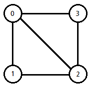
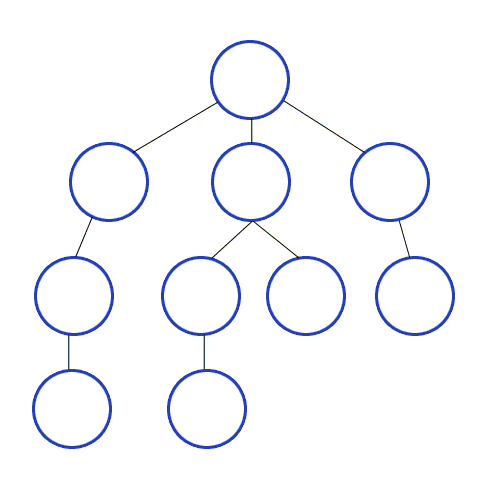
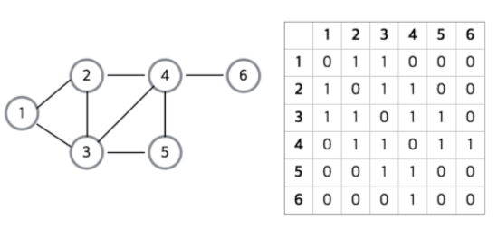
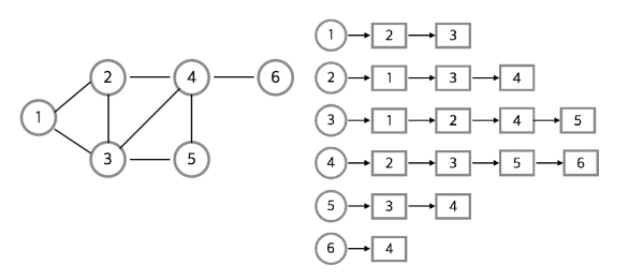

# 그래프 탐색 알고리즘 DFS, BFS

### 그래프
- 정점(Vertex)와 간선(Edge)로 이루어진 자료구조
- 정점간의 관계를 표현하는 조직도
- 트리도 그래프의 일종

<br>



### 그래프에 관련된 용어
- 정점(Vertex) : 노드(node) 라고도 하며 정점에는 데이터가 저장된다. (0, 1, 2, 3)
- 간선(Edge) : 정점(노드)를 연결하는 선으로 link, branch 라고도 부른다.
- 인접 정점(adjacent Vertex) : 간선에 의해 직접 연결된 정점 (0과 2은 인접정점)
- 단순 경로(simple path) : 경로 중에서 반복되는 정점이 없는 경우. 한붓그리기와 같이 같은 간선을 지나가지 않는 경로 ( 0->3->2->1 은 단순경로 )
- 차수(degree) : 무방향 그래프에서 하나의 정점에 인접한 정점의 수 (0의 차수는 3)
- 진출 차수(in-degree) : 방향 그래프에서 외부로 향하는 간선의 수
- 진입 차수(out-degree) : 방향 그래프에서 외부에서 들어오는 간선의 수
- 경로 길이(path length) : 경로를 구성하는데 사용된 간선의 수
- 사이클(cycle) : 단순 경로의 시작 정점과 종료 정점이 동일한 경우

<br>

### 그래프 탐색 알고리즘이란?
- 어떤 한 그래프에서 한 그래프와 해당 그래프의 시작 정점이 주어졌을 때 시작 점에서 간선을 타고 이동할 수 있는 정점들을 모두 찾아야 하는 문제
    - 하나의 시작점 Node에서 연결된 Node들을 모두 찾는 것
- 그래프 탐색 알고리즘에는 너비 우선 탐색(BFS), 깊이 우선 탐색(DFS)가 있음

<br>


### 깊이 우선 탐색 (Depth-First Search, DFS)
- 그래프에서 깊은 부분을 우선적으로 탐색하는 알고리즘
- 그래프의 시작점에서 다음 브랜치로 넘어가기전에 해당 브랜치를 모두 탐색
- DFS는 스택 자료구조(혹은 재귀 함수)를 이용하며 동작과정은 다음과 같음
    1. 탐색 시작 노드를 스택에 삽입하고 방문처리를 함
    2. 스택의 최상단 노드에 방문하지 않는 인접한 노드가 하나라도 있으면 그 노드를 스택에 넣고 방문 처리함. 방문하지 않는 인접 노드가 없으면 스택에서 최상단 노드를 꺼냄
    3. 더이상 2번의 과정을 수행할 수 없을때까지 반복
    ```
    스택 자료구조 
        - 먼저 들어온 데이터가 나중에 나가는 선입후출의 자료구조
        - 입구와 출구가 동일한 형태로 스택을 시각화할 수 있음
        - 파이썬-리스트 형식으로 표현 가능
    
    방문 처리
        - 스택에 한번 삽입되어 처리된 노드가 다시 삽입되지 않게 체크하는 것을 의미
        - 방문처리를 함으로써 각 노드를 한 번씩만 처리할 수 있음
    ```

<br>



### 너비 우선 탐색 (Breadth First Search, BFS)
- 그래프에서 가까운 노드부터 우선적으로 탐색하는 알고리즘
- BFS는 간선의 비용이 모두 동일할 때 최단거리를 찾기위해 사용할 수 있는 방법
    - 시작점에서 모든 점까지의 최단 거리 = 필요한 최소 간선(Edge) 개수로 표현이 가능
- 수행하는데 있어 O(N)의 시간이 소요됨
- 일반적인 경우 실제 수행 시간은 DFS보다 좋은 편임
- 최단 거리 / 최소 시간의 경우 주로 BFS를 사용
- BFS는 큐 자료구조를 이용하며, 구체적인 동작 과정은 다음과 같음
    1. 탐색 시작 노드를 큐에 삽입하고 방문 처리를 함
    2. 큐에서 노드를 꺼낸 뒤에 해당 노드의 인접 노드 중에서 방문하지 않은 노드를 모두 큐에 삽입하고 방문 처리함
    3. 더이상 2번의 과정을 수행할 수 없을때까지 반복
    ```
    큐 자료구조
        - 먼저 들어온 데이터가 먼저나가는 선입선출의 자료구조
        - 큐는 입구와 출구가 모두 뚫려있는 터널과 같은 형태로 시각화 할 수 있음
        - 리스트로도 구현이 가능하지만 시간 복잡도가 더 높음
        - 큐를 사용하는 이유는 먼저 탐색되는 위치를 먼저 빼내서 인접한 점들을 본다는 요구사항 때문에 큐를 사용
    ```
<br>

### 그래프 탐색 표현 방법 2가지


#### 1. 인접 행렬(Adjaceny Matrix)
- 2차원 배열로 그래프의 연결 관계를 표현하는 방식
- 2차원 배열에 각 노드가 연결된 형태를 기록하는 방식
    - 연결된 그래프를 인접행렬로 표현할 때 파이썬에서는 2차원 리스트로 구현할 수 있음
    - 연결 되어있지 않은 노드끼리는 무한의 비용이라고 작성함
    - 인접리스트에 비해 구현이 쉽다
    - 정보를 얻는 조회속도가 빠름

<br>



#### 2. 인접 리스트(Adjacency List)
- 리스트로 그래프의 연결 관계를 표현하는 방식
- 모든 노드에 연결된 노드에 대한 정보를 차례대로 연결하여 저장
    - C++이나 자바는 별도로 연결 리스트 기능을 위한 라이브러리를 제공

<br>

#### 두 방식의 차이
- 메모리 측면으로 인접 리스트 방식이 더욱 메모리 공간의 낭비가 적음
- 인접 행렬 방식은 모든 관계를 저장하므로 노드 개수가 많을수록 메모리가 불필요하게 낭비됨
- 인접 리스트 방식은 연결된 정보만을 저장하기 때문에 메모리를 효율적으로 사용
- 이와 같은 속성 때문에 인접 리스트 방식은 인접 행렬 방식에 비해 특정한 두 노드가 연결되어 있는지에 대한 정보를 얻는 속도가 느림
    - 인접 리스트 방식에서는 연결된 데이터를 하나씩 확인해야 하기 떄문

<br>

<div style="text-align: right">22-10-03</div>

-------

## Reference
- https://bdbest.tistory.com/112
- https://velog.io/@annie1004619/그래프-탐색-알고리즘-DFSBFS