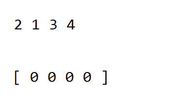

# 알고리즘 - 정렬

<br>

## 정렬 알고리즘 ( Sorting Algorithm )
- 정렬 (Sorting)이란 데이터를 특정한 기준에 따라서 비교하여 재배열하는 것을 의미한다
- 일반적으로 문제 상황에 따라서 적절한 정렬 알고리즘이 공식처럼 사용된다.
- 정렬 알고리즘으로 데이터를 정렬하면 이진 탐색이 가능해짐 (정렬 알고리즘은 이진 탐색의 전처리 과정이기도 함 )
- 대표 정렬 알고리즘 : 선택 정렬, 삽입 정렬, 퀵 정렬, 병합 정렬, 계수 정렬

<br>

### 정렬을 사용하는 이유
- 실제 컴퓨터 분야에서 사용하는 데이터의 경우 숫자의 순서나 어휘의 순서대로 정렬한 다음 사용해야 되는 경우가 거의 항상 발생하는데 이걸 얼마나 효과적으로 해결할 수 있느냐가 정렬 문제의 핵심
- 정렬 알고리즘이 중요한 이유는 데이터가 정렬되어 있으면 이진탐색이라는 강력한 알고리즘을 사용할 수 있기 때문

<br>


<br>

#### 1) 선택 정렬 ( Selection Sort )
>- 처리되지 않은 데이터 중에서 가장 작은 데이터를 선택해 맨 앞에 있는 데이터와 바꾸는 것을 반복. 즉, 정렬되지 않은 데이터 중에서 가장 작은 데이터를 선택해 맨 앞에 있는 데이터와 바꾸고, 그 다음 작은 데이터를 선택해 앞에서 2번째 데이터와 바꾸는 과정 반복.
>- 전체 연산횟수는 N + ( N-1 ) + ( N-2 ) .... 으로 빅오 표기법으로 O(N^2)

```java
int []arr = {7, 5, 9, 0, 3, 1, 6, 2, 4, 8};
        
for(int i=0; i < arr.length; i++){
	int minIndex = i; 
	for(int j=i+1 ; j < arr.length; j++){
		if(arr[minIndex] > arr[j])
			minIndex = j;
		}
            
	int tmp = arr[i];		
	arr[i] = arr[minIndex];
	arr[minIndex] = tmp;
}
```

<br>


<br>

#### 2) 삽입 정렬 ( Insertion Sort )
>- 데이터를 하나씩 확인하며 각 데이터를 적절한 위치에 삽입
>- 선택 정렬에 비해 실행 시간 측면에서 더 효율적이며 필요할 때만 위치를 바꾸므로 데이터가 거의 정렬되어 있을 때 효과적.
>- 또한 삽입 정렬은 특정한 데이터가 적절한 위치에 들어가기 이전에 그 앞까지의 데이터는 이미 정렬되어 있다고 가정한다. 정렬되어 있는 데이터 리스트에서 적절한 위치를 찾은 후 그 위치에 삽입
>- 삽입 정렬이 이루어진 원소는 항상 정렬된 상태이다. 
>- 시간 복잡도는 O(N^2) 이지만 최상의 경우 O(N)의 시간 복잡도를 지님. ( 거의 정렬되어 있을 경우 퀵 정렬 알고리즘보다 강력 )

```java 
int []arr = {7, 5, 9, 0, 3, 1, 6, 2, 4, 8};
        
	for(int i=1; i < arr.length; i++){
		for(int j=i ; j >= 1; j--){
                
			if(arr[j] < arr[j-1]){  
				int tmp = arr[j];
				arr[j] = arr[j-1];
				arr[j-1] = tmp;
			}else break; 
		}
	}
```

<br>


<br>

#### 3) 퀵 정렬 ( Quick Sort )
>- 기준 데이터(pivot)를 설정하고 그 기준보다 큰 데이터와 작은 데이터의 위치를 바꾸는 정렬 방법. 
>- 일반적인 상황에서 가장 많이 사용되는 정렬 알고리즘 중 하나로병합 정렬과 더불어 대부분의 프로그래밍 언어의 정렬 라이브러리의 근간이 됨 
>- 데이터를 비교하면서 찾기 때문에 비교정렬이며 데이터외에 추가적인 공간을 필요로하지 않아 제자리정렬이라고도한다.
>- 하나의 피벗을 두고 두 개의 부분리스트를 만들 때 서로 떨어진 원소끼리 교환이 일어나기 때문에 불안정정렬 알고리즘이기도 하다.
>- 가장 기본적인 퀵 정렬은 첫 번째 데이터를 기준 데이터(pivot)로 설정. 어디서 pivot을 선택할지 정해야함 
>- 시간 복잡도는 평균의 경우 O(NlogN)이고, 최악의 경우 O(N^2)의 시간 복잡도를 가짐.
>- 데이터가 많을수록 퀵 정렬은 선택, 삽입 정렬에 비해 압도적으로 빠르게 동작.
>- 동작 순서
>>1. 피벗을 하나 선택한다.
>>2. 피벗을 기준으로 양쪽에서 피벗보다 큰 값, 혹은 작은 값을 찾는다. 왼쪽에서부터는 피벗보다 큰 값을 찾고, 오른쪽에서부터는 피벗보다 작은 값을 찾는다.
>>3. 양 방향에서 찾은 두 원소를 교환한다.
>>4. 왼쪽에서 탐색하는 위치와 오른쪽에서 탐색하는 위치가 엇갈리지 않을 때 까지 2번으로 돌아가 위 과정을 반복한다.
>>5. 엇갈린 기점을 기준으로 두 개의 부분리스트로 나누어 1번으로 돌아가 해당 부분리스트의 길이가 1이 아닐 때 까지 1번 과정을 반복한다. (Divide : 분할)
>>6. 인접한 부분리스트끼리 합친다. (Conqure : 정복)
```java
public class QuickSort {
	public static void sort(int[] a) {
		m_pivot_sort(a, 0, a.length - 1);
	}

	private static void m_pivot_sort(int[] a, int lo, int hi) {
		if(lo >= hi) {
			return;
		}
		
		int pivot = partition(a, lo, hi);	
		
		m_pivot_sort(a, lo, pivot);
		m_pivot_sort(a, pivot + 1, hi);
	}

	private static int partition(int[] a, int left, int right) {
		int pivot = a[(left + right) / 2];

		while (left <= right) {
			while (a[left] < pivot) {
				left++;
			}
			while (a[right] > pivot) {
				right--;
			}
			if (left <= right) {
				swap(a, left, right);
				left++;
				right--;
			}
		}
		return left;
	}

	private static void swap(int[] a, int i, int j) {
		int temp = a[i];
		a[i] = a[j];
		a[j] = temp;
	}
}
```
<br>


<br>

#### 4) 병합 정렬 (Merge Sort)
>- 정렬되지 않은 전체 데이터를 하나의 단위로 분할한 후에 분할한 데이터들을 다시 병합하며 정렬하는 방식.
>- 데이터를 분할(divide)하고 둘 씩 크기를 비교하여 정렬을한다 (conquer). 마지막으로 이를 합치는데(merge) 이 과정을 합칠 리스트가 없을 때까지 반복하면 된다.
>- 시간 복잡도는 O(NlogN)으로 최악, 평균, 최선의 시간 복잡도가 동일하다.

```java
public class MergeSort{
	public static int[] tmp; // 배열의 값을 잠시 복사해둘 공간
	public static void main(String[] args) throws IOException {
		int[] arr = { 3, 1, 7, 4, 5, 6, 8, 2 };
		mergeSort(arr);
	}
 	public static void mergeSort(int[] arr) {
		tmp = new int[arr.length];
		mergeSort(arr, 0, arr.length - 1);
	}
 	private static void mergeSort(int[] arr, int start, int end) {
		if(start < end) {
			int mid = (start + end) / 2;
			mergeSort(arr, start, mid);
			mergeSort(arr, mid+1, end);
			merge(arr, start, mid, end);
		}
	}
 	private static void merge(int[] arr, int start, int mid, int end) {
		tmp = arr.clone();
		
		int part1 = start;
		int part2 = mid + 1;
		int index = start;
		
		while(part1 <= mid && part2 <= end) {
			if(tmp[part1] <= tmp[part2]) {
				arr[index++] = tmp[part1++];
			} else {
				arr[index++] = tmp[part2++];
			}
		}
		
		for(int i=0; i<=mid-part1; i++) {
			arr[index+i] = tmp[part1+i];
		}
	}
}
```

<br>




<br>

#### 5) 계수 정렬 (Counting Sort)
>- 데이터 값이 몇 번 나왔는지를 세주는 알고리즘
>- 계수 정렬은 특정한 조건이 부합할 때만 사용할 수 있지만, 매우 빠르게 동작하는 정렬 알고리즘. ( 특정한 조건은 데이터의 크기 범위가 제한되어 정수 형태로 표현할 수 있을 때 )
>- 일반적으로 가장 큰 데이터와 가장 작은 데이터의 차이가 1,000,000을 넘지 않을 때 효과적으로 사용할 수 있음 ( 메모리 사이즈를 넘으면 안됨 )
>- 데이터는 양수여야 함.
>- 계수정렬은 동일한 값을 가지는 데이터가 여러개 등장할 때 효과적으로 사용
>- 시간 복잡도는 데이터의 개수가 N, 데이터 중 최댓 값이 K 때 최악의 경우에도 O(N+K)를 보장
>- 계수 정렬은 때에 따라서 심각한 비효율성 초래. 데이터가 0과 999,999로 2개가 존재할 경우에도 리스트의 크기를 100만개가 되도록 선언해야함.

```java
public class CountingSort {
    public static void main(String[] args) {
        Integer[] a = {1, 0, 3, 1, 3, 1};

        a = sort(a);

        System.out.println(Arrays.toString(a));
    }

    public static Integer[] sort(Integer[] a) {
        int max = Collections.max(Arrays.asList(a));
        Integer[] aux = new Integer[a.length];
        Integer[] c = new Integer[max+1];
        Arrays.fill(c, 0);

        for (int i=0; i<a.length; i++) {
            c[a[i]] += 1;
        }

        for (int i=1; i<c.length; i++) {
            c[i] += c[i-1];
        }

        for (int i=a.length-1; i>=0; i--) {
            aux[--c[a[i]]] = a[i];
        }

        return aux;
    }
}
```

<br>


### 6) 버블 정렬 ( Bubble Sort )
>- 선택정렬과 유사한 알고리즘으로 서로 인접한 두 원소의 대소를 비교하고 조건에 맞지 않는다면 자리를 교환하며 정렬하는 알고리즘
>- 위의 비교를 반복하여 해당 정렬이 1회전 수행할 때마다 선택된 데이터가 정렬되므로 정렬에서 제외되는 데이터가 하나씩 늘어난다.
>- 시간 복잡도는 n(n-1)/2로 O(n^2)이다. 공간 복잡도는 주어진 배열안에서 교환을 통해 정렬이 수행되므로 O(n)이라고 한다.
>- 정렬 중에서 구현하기 쉽고 소스코드가 직관적이며 정렬배열 안에서 교환하는 방식이므로 다른 메모리 공간을 필요로 하지 않는다 ( 제자리 정렬 (in-place-sorting)).
>- 안정 정렬이다.
>- 효율이 좋지 않아 잘 사용되지 않고 정렬 돼있지 않은 원소가 정렬됬을 때의 자리로 가기 위해서 교환 연산이 많이 일어나게 됨.


```java
public static void bubbleSort(int[] arr) {
    for(int i=0; i<arr.length-1; i++) {
        for(int j=1; j<arr.length-i; j++) {
            if(arr[j-1] > arr[j]) {
                int temp = arr[j-1];
                arr[j-1]= arr[j];
                arr[j] = temp;
            }
        }
    }
}
```


<br>

<div style="text-align: right">22-06-24</div>

-------

## Reference
- https://velog.io/@kimdukbae/정렬-알고리즘-Sorting-Algorithm#선택-정렬-selection-sort
- https://st-lab.tistory.com/250
- https://todaycode.tistory.com/54
- https://yaboong.github.io/algorithms/2018/03/20/counting-sort/