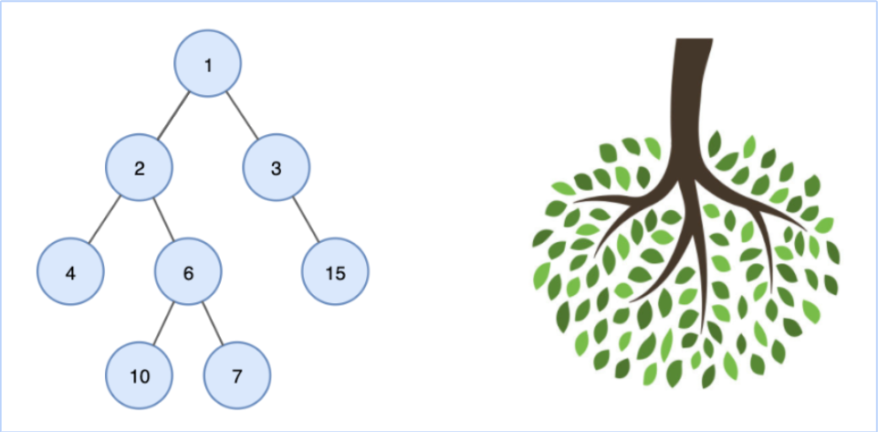
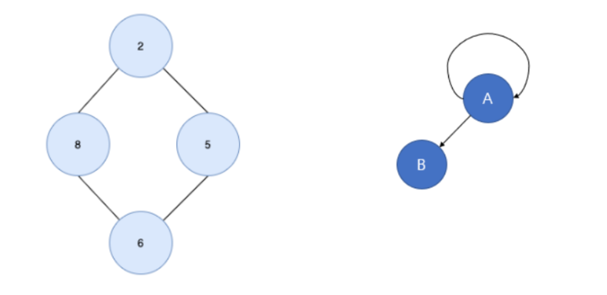
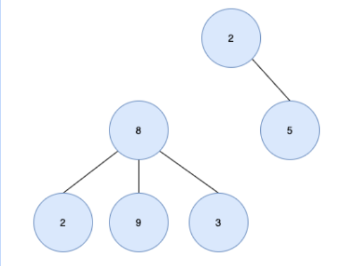
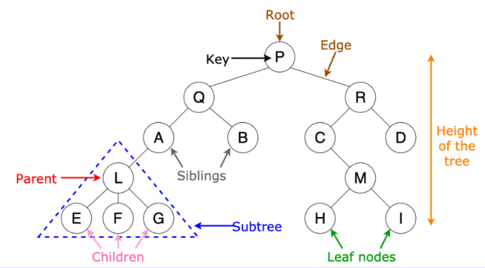
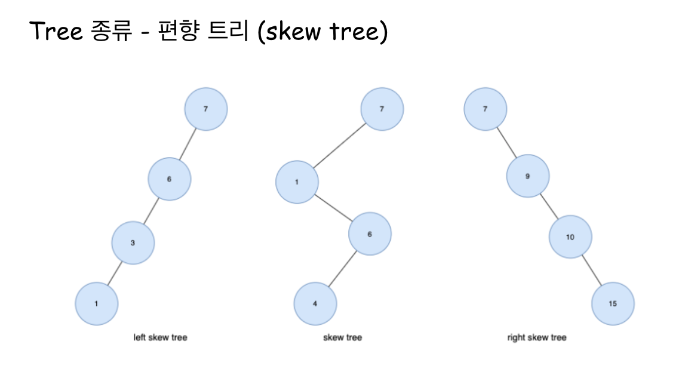
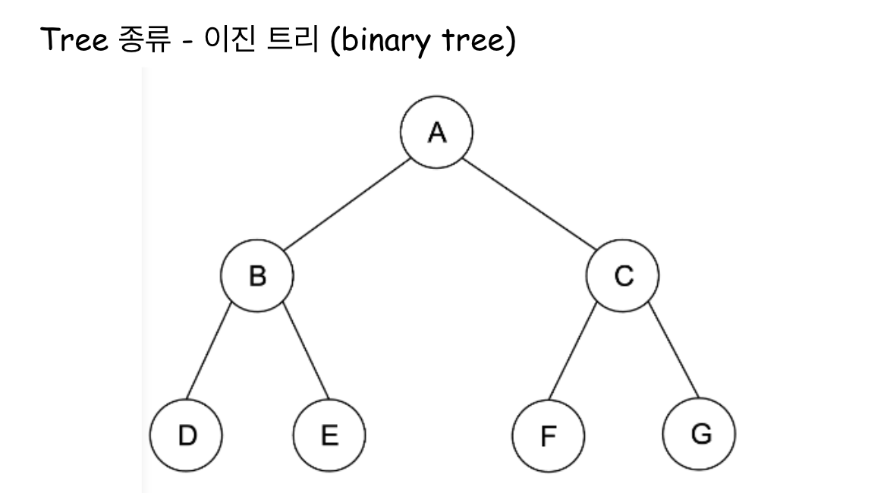
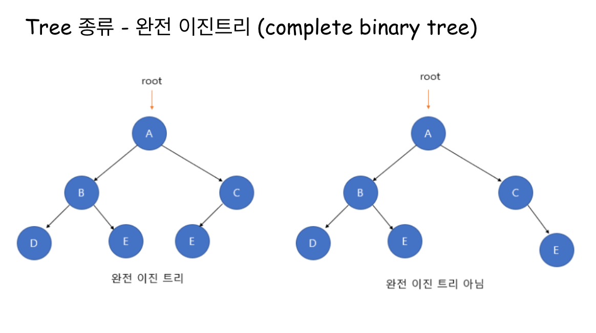
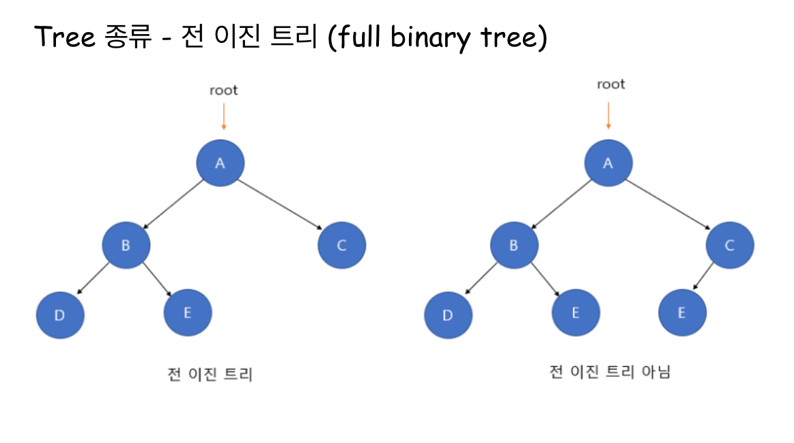
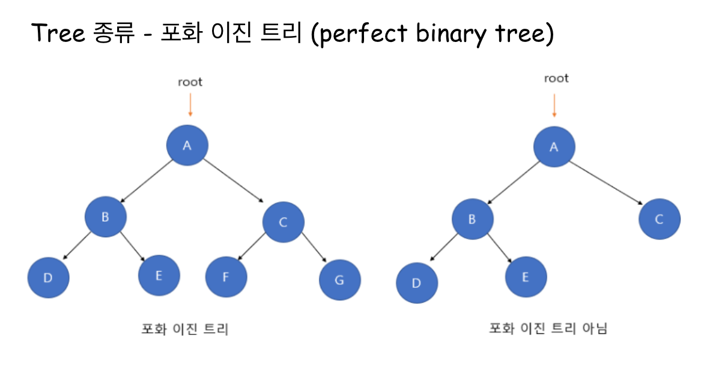
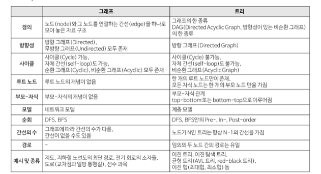

# Tree

### Tree
- 나무를 뒤집어 놓은 모양과 유사
- 그래프의 한 종류로 '최소 연결 트리' 라고도 불림
- 하나의 루트 노드와 0개 이상의 하위 트리로 구성
- 계층 모델으로 DAG(Directed Acyclic Graphs, 방향성이 있는 비순환 그래프)의 한 종류
    - 사이클이 없음
    - 데이터를 순차적으로 저장하지 않아 비선형 자료구조
    - 트리 내의 다른 하위 트리가 존재하는 재귀적 자료구조
- 노드가 N개인 트리는 항상 N-1개의 간선(edge)을 가짐
- 루트에서 어떤 노드로 가는 경로는 유일
- 한 개의 루트 노드만이 존재하며 모든 자식 노드는 한 개의 부모 노드만을 가짐 

 

### 트리가 아닌 경우
- 위에 설명에 맞게 사이클이 존재하지 않아야 함
- 루트 노드는 하나여야 함

 

### 트리 구조
- 루트 노드(root node): 부모가 없는 노드, 트리는 하나의 루트 노드만을 가진다.
- 단말 노드(leaf node): 자식이 없는 노드, ‘말단 노드’ 또는 ‘잎 노드’라고도 부른다.
- 내부(internal) 노드: 단말 노드가 아닌 노드
- 간선(edge): 노드를 연결하는 선 (link, branch 라고도 부름)
- 부모 노드(parent node): 자식 노드를 가진 노드
- 자식 노드(child node): 부모 노드의 하위 노드
- 형제 노드(sibling node): 같은 부모를 가지는 노드

#### 단위
- 차수(degree): 하위 트리 개수 / 간선 수 (degree) = 각 노드가 지닌 가지의 수
    - 트리의 차수(degree of tree): 트리의 최대 차수
- 레벨(level): 트리의 특정 깊이를 가지는 노드의 집합
    - width : 레벨에 있는 노드 수
    - breadth : 리프 노드의 수
- 크기(size): 자신을 포함한 모든 자손 노드의 개수
- 깊이(depth): 루트에서 어떤 노드에 도달하기 위해 거쳐야 하는 간선의 수
- 경로(path): 한 노드에서 다른 한 노드에 이르는 길 사이에 놓여있는 노드들의 순서
    - path length : 해당 경로에 있는 총 노드 수
- 높이(height): 루트 노드에서 가장 깊숙히 있는 노드의 깊이
- order : 부모 노드가 가질 수 있는 최대 자식의 수, 그래프에서 명시되어 있는 것이 아닌 최대 설정 값

 

## 트리의 종류

### 편향 트리 (Skew Tree)
- 모든 노드들이 자식을 하나만 가진 트리
- 왼쪽 방향으로 자식을 하나씩만 가지면 left skew tree, 오른쪽 방향으로 하나씩만 가지면 right skew tree 라고 함
- 성능면에서는 매우 좋지 않음

 

### 이진 트리 (Binary Tree)
- 각 노드의 차수가 2개 이하인 트리

 

#### 완전 이진 트리 (Complete Binary Tree)
- 트리의 모든 높이에서 노드가 꽉 차있는 이진 트리, 마지막 레벨을 제외하고 완전히 채워져 있음
- 마지막 레벨은 꽉 차있지 않아도 되지만, 노드가 왼쪽에서 오른쪽으로 채워져야 함
- 완전 이진 트리는 배열을 사용해 효율적으로 표현 가능

 

#### 전 이진 트리 (Full Binary Tree)
- 모든 노드가 0개 또는 2개의 자식 노드를 갖는 트리

 

#### 포화 이진 트리 (Perfect Binary Tree)
- 전 이진 트리이면서 완전 이진트리인 경우 -> 모든 노드의 자식노드가 2개인 트리
- 모든 말단 노드는 같은 높이에 있어야 하며, 마지막 단계에서 노드의 개수가 최대가 되어야 함
- 모든 내부 노드가 두 개의 자식 노드를 가짐
- 모든 말단 노드가 동일한 깊이 또는 레벨을 가짐
- 노드의 개수는 2^(k-1)개 여야 함(k:트리의 높이)

 

#### 이진 트리 순회 (Binary Tree Traversal)
- 중위 순회(in-order-tranversal) : 왼쪽 가지 -> 현재 노드 -> 오른쪽 가지
- 전위 순회(pre-order-tranversal) : 현재 노드 -> 왼쪽 가지 -> 오른쪽 가지
- 후위 순회(post-order-tranversal) : 왼쪽 가지 -> 오른쪽 가지 -> 현재 노드

 

### 이진 탐색 트리 (Binary Search Tree, BST)
- 이진 탐색과 연결리스트를 결합한 자료구조의 일종으로 이진탐색의 효율적 탐색 능력을 유지하고 빈번한 자료 입력과 삭제를 가능케 함
- 모든 노드가 특정 순서를 따르는 속성이 있는 이진 트리
- 이진 탐색 트리를 순회할 때는 중위 순회(inorder)방식을 사용
- 모든 왼쪽 자식들 <= n < 모든 오른쪽 자식들
    - 각 노드의 왼쪽 서브트리에는 해당 노드의 값보다 작은 값을 지닌 노드들로 이루어져 있음
    - 각 노드의 오른쪽 서브트리에는 해당 노드의 값보다 큰 값을 지닌 노드들로 이루어져 있음
    - 중복된 노드가 없어야 함
    - 왼쪽 서브트리, 오른쪽 서브트리 또한 이진탐색트리
    - 그러다 보니 이진탐색트리는 균형 잡힌 트리가 아닐경우 입력되는 값의 순서에 따라 한쪽으로 노드들이 몰리게 될 수 있음
- 이진탐색트리의 핵심 연산은 검색, 삽입, 삭제이고 이밖에 연산은 다음과 같음
    - 검색 (retreive)
    - 삽입 (insert)
    - 삭제 (delete)
    - 이진탐색트리 생성 (create)
    - 이진탐색트리 삭제 (destroy)
    - 이진탐색트리가 비어있는지 확인 (isEmpty)
    - 트리순회 (tree traverse)

 

### M원 탐색 트리(M-Way Search Tree)
- 최대 m개의 서브 트리를 갖는 탐색 트리
- 트리의 각 노드가 여러개의 데이터를 가질 수 있고, 하위 트리 수를 임의로 설정가능
    - 트리의 높이문제와, 균형 비용문제를 해결
- 이진 탐색 트리의 확장된 형태로 높이를 줄이기 위해 사용

 

### 균형 트리(Balanced Tree, B-Tree)
- 탐색 성능을 높이기 위해서 높이 균형을 유지하는 트리
- 이진 트리와는 다르게 하나에 노드에 많은 정보를 가질 수 있음
     - 하나의 노드에 여러 정보를 담으면서 차수라는 개념이 등장하고 하나의 노드에 담은 자료수가 M개이면 M차 B-Tree라고 부름
    - 이진 트리보다 훨씬 많은 데이터를 더 효율적으로 저장소에 담을 수 있음
- 데이터베이스에서 index로 사용되는 트리 자료구조의 일종
- B-트리의 조건은 다음과 같음
    - 모든 단말노드는 동일한 높이를 갖는다.
    - root node가 아닌 노드들은 적어도 M/2개의 자식 노드를 가지고 있음 (최대 M개)
    - 노드안의 데이터는 정렬되어 있어야 함
    - 자료는 중복되지 않음
    - 모든 leaf node는 같은 레벨에 있음
- 모든 leaf node가 같은 level로 유지되도록 자동으로 밸런스를 맞춰줌

 

#### B*Tree
- 구조를 유지하기 위해 추가적인 연산이 수행되거나 새로운 노드가 생성되는 B-Tree의 단점을 보완
    - 노드의 추가적인 생성과 추가적인 연산의 최소화를 위해 B-Tree에서 몇가지 규칙이 추가된 트리
- 가장 대표적인 차이점은 M/2개의 키값을 가져야 했던 기존 노드의 자식 노드 수 최소 제약조건이 2M/3개로 늘어났고, 노드가 가득 차면 분열 대신 이웃한 형제 노드로 재배치
- B*Tree의 조건은 다음과 같음
    - 각 노드의 자료는 정렬되어 있음
    - 자료는 중복되지 않음
    - 모든 leaf node는 같은 레벨에 있음
    - root node는 자신이 leaf node가 되지 않는 이상 적어도 2개 이상의 자식 노드를 가짐
    - root node가 아닌 노드들은 적어도 2[(M-2)/3]+1개의 자식 노드를 가지고 있음 (최대 M개)

 

#### B+Tree
- 탐색을 위해 노드를 찾아서 이동하는 B-Tree의 단점을 보완
    - 같은 레벨의 모든 키값들이 정렬되어 있고, 같은 레벨의 형제 노드는 연결리스트 형태로 이어져 있음
    - 같은 레벨의 형제 노드는 모두 연결되어 있어 키값이 중복 되지 않음
- 특정 값을 찾아야 하는 경우 leaf node에 모든 자료들이 존재하고, 그 자료들이 연결리스트로 연결되어 있어 탐색에 매우 유리
- leaf 노드가 아닌 자료는 인덱스 노드라고 부르고, leaf 노드 자료는 데이터 노드라고 부름
    - 인덱스 노드에 Value 값에는 다음 노드를 가리킬 수 있는 포인터 주소 존재
    - 데이터 노드에 Value 값에는 데이터가 존재
    - 인덱스 노드와 데이터 노드에서 키값은 중복될 수 있고, 데이터 검색을 위해서는 반드시 leaf 노드까지 내려가야 함
- 오늘날 데이터베이스에서 가장 중요한 것은 검색속도로 대부분의 데이터베이스 시스템은 B+트리 구조를 사용
- B+Tree의 조건은 다음과 같음
    - 데이터 노드의 자료는 정렬되어 있음
    - 데이터 노드에서는 데이터가 중복되지 않음
    - 모든 leaf node는 같은 레벨에 있음
    - leaf node가 아닌 node의 키값의 수는 그 노드의 서브트리 수보다 하나가 적음
    - 모든 leaf node는 연결리스트로 연결되어 있음

 

### 균형 이진 탐색 트리 (Balanced Binary Search Tree)
- 이진탐색트리 + 균형트리
- 이진탐색트리는 높이가 커짐에 따라 검색에 불리해지고 특정 노드를 탐색하는데 오랜시간이 걸릴 수도 있어 해당 내용을 보완
- 오른쪽의 서브트리의 높이와 왼쪽 서브 트리의 높이 차이가 1 이하인 이진 트리
- 이러한 높이 차이를 균형인수(BF, Balance Factor)이라고 함
- 노드의 삽입과 삭제가 일어나는 경우에 자동으로 그 높이를 작게 유지
- 대표적인 균형이진탐색트리는 AVL 트리, 레드-블랙 트리가 존재

 

### 그래프 VS 트리

22-09-16

-------

## Reference
- https://docs.google.com/presentation/d/13K_0YQ_FcXNM1Zo7l-VVIlcRTrit6rIdzm3hnsgRLuk/edit#slide=id.g158367717dc_0_247 (스터디원의 발표자료 )
- https://gmlwjd9405.github.io/2018/08/12/data-structure-tree.html
- https://yoongrammer.tistory.com/68
- https://ssocoit.tistory.com/217