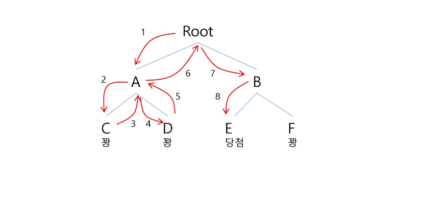

# Backtracking

### 백트래킹이란?
- 퇴각 검색
- 모든 조합을 시도해서 문제의 해를 찾는 방법
- 해를 얻을 때까지 모든 가능성을 시도
- 모든 가능성은 하나의 트리처럼 구성할 수 있으며, 가지(선택지) 중에 해결책이 있음
- 여러 가지(선택지)들이 존재하는 상황에서 하나의 가지를 선택함
- 선택이 이루어지면 새로운 선택지들의 집합이 생성됨
- 이런 선택을 반복하면서 최종 상태에 도달함
- 보통 재귀 함수로 구현

<br>

```
backtrack (node v)
    IF promising (v) == false then return;
    IF  there is a solution at v
        write the solution
    ELSE
        FOR each child u of v
        backtrack(u)
```

<br>

### 상태 공간 트리 (state space tree)
- 문제 해결 과정의 중간 상태를 노드로 표현한 트리
- 백트래킹에서 사용되는 상태 공간 트리의 경우 리프노드에 자신까지 이르는 모든 노드들이 선택된 조합이 들어있음
- 백트래킹은 해당 리프노드에 도달하면 뒤로 돌아가서 다른 노드로 돌아가서 다른 노드를 탐색



<br>

### N-QUEEN 문제
- 퀸은 팔방으로 직진하여 다른 말을 잡을 수 있는데 이러한 퀸을 안잡히게 여러개 배치하는 문제
- 그러나 해당 문제를 상태 공간 트리로 백트래킹을 사용한다해도 모든 경우의 수를 하나하나 조회하는 것은 불필요
    - 같은 행 혹은 열, 대각선의 경우 해당 위치에서 연산할 필요가 없기 떄문
- 해당 문제가 발생하여 백트래킹은 노드의 유망성을 검사한다

<br>

### 백트래킹 가지치기
- 어떤 노드의 유망성을 점검한 후에 유망(promising)하지 않다고 결정되면 그 노드의 부모로 되돌아가(backtracking) 다음 자식 노드로 감
- 유망(promising)하다 라는 것은 어떤 노드를 방문하였을 때 그 노드를 포함한 경로가 해답이 될 수 있으면 유망하다고 함
- 가지치기(pruning)란 이러한 유망하지 않은 노드가 포함되는 경로는 더 이상 고려하지 않는 것
- 가지치기를 할 때 주의할 점은 기저파트 보다 먼저 실행해야한다면 함수 호출마다 해당 경우를 판단해야 하므로 함수 호출 수 만큼 실행됨
    - 즉, 가지치기의 경우가 적을 경우 굳이 가지치기 하는 것 자체가 오버헤드가 될 수 있음
    - 물론 유도 파트에서 가지치기도 가능. 현재 선택에서 유망성을 체크할 경우 유도 파트에 가지치기 적용
<br>

### 백트래킹 절차
1. 상태 공간 트리의 깊이 우선 검색(DFS)을 실시
2. 각 노드가 유망한지를 점검
3. 만일 그 노드가 유망하지 않으면, 그 노드의 부모 노드로 돌아가서 다른 노드로의 검색을 계속함

<br>

### 백트래킹과 완전탐색(DFS)과의 차이
- 어떤 노드에서 출발하는 경로가 해결책으로 이어질 것 같지 않으면 더 이상 그 경로를 따라가지 않음으로써 시도 횟수를 줄임 (Pruning : 가지치기)
    - 하지만 유망하지 않은 경우가 답이 될 가능성이 없어야하므로 가지치기를 할 때 주의 필요
- 완전 탐색이 모든 경로를 추적하는데 비해 백트래킹은 불필요한 경로를 조기에 차단
- 완전 탐색을 가하기에는 경우의 수가 너무나 많음
    - 예를 들어 N! 경우의 수를 가진 문제에 대해 완전 탐색을 가하면 시간 초과로 처리 불가능할 수 있음
- 백트래킹 알고리즘을 적용하면 일반적으로 경우의 수가 줄어들지만 이 역시 최악의 경우에는 여전히 지수함수 시간 (Exponenital Time)을 요하므로 처리 불가능할 수 있음