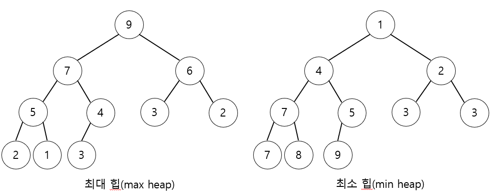
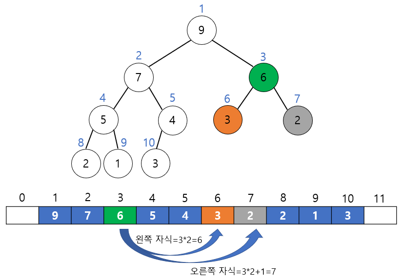
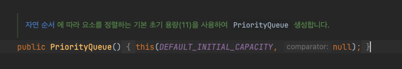
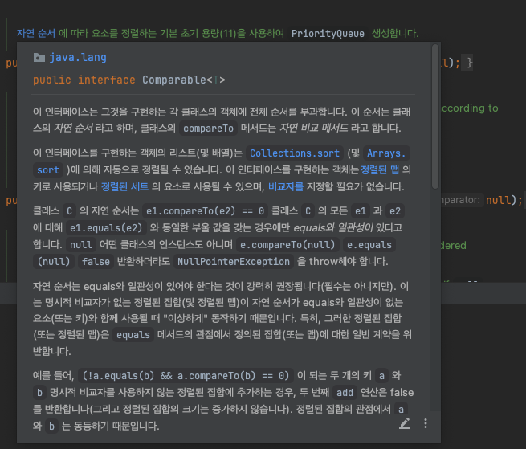
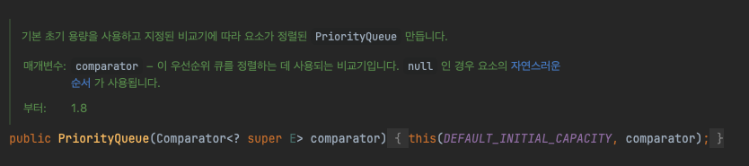

# Priority Queue (우선순위 큐)

### 우선순위 큐?
- 큐(Queue)는 먼저 들어오는 데이터가 먼저 나가는 FIFO 형식의 자료구조
- 우선순위 큐(Priority Queue)는 우선 순위가 높은 데이터가 먼저 나가는 형태의 자료구조
- 우선순위 큐는 일반적으로 힙(Heap)을 이용하여 구현함

<br>

### Heap?
- 완전 이진 트리 형태의 자료구조
    - 마지막 레벨을 제외한 모든 레벨이 모두 채워져 있고 레벨은 왼쪽부터 채워져 있는 트리
- 이진 탐색 트리(BST)와 달리 중복된 값이 허용
- 최대 힙과 최소 힙이 존재
    - 최대 힙(Max Heap) : 부모 노드의 키 값이 자식 노드보다 큰 경우
    - 최소 힙(Min Heap) : 부모 노드의 키 값이 자식 노드보다 작은 경우



<br>

### 배열로 힙을 표현할 때
- 왼쪽 자식 노드의 인덱스 = 부모 노드의 인덱스 * 2
- 오른쪽 자식 노드의 인덱스 = 부모 노드의 인덱스 * 2 + 1
- 부모노드의 인덱스 = 자식 노드의 인덱스 / 2
    - 힙은 완전 이진 트리 형태이므로 왼쪽 자식 노드는 부모 노드의 인덱스의 2배가 됨



<br>

### 삽입 연산
- 힙에 삽입을 하기 위해서는 힙 트리의 성질을 만족시키면서 새로운 요소를 추가해야함
- 최악의 경우 새로 추가된 노드가 루트 노드까지 비교하므로 시간 복잡도는 O(logN)
1. 우선 완전이진트리의 마지막 노드에 이어서 새로운 노드를 추가하고 추가된 새로운 노드를 부모의 노드와 비교하여 교환
    - 최소 힙인 경우 부모 노드보다 작은 경우 위치를 교환, 최대 힙인 경우 부모 노드보다 클 경우 위치를 교환
2. 정상적인 힙 트리가 될 때까지 부모 노드와 교환할 필요가 없을 때까지 반복

<br>

### 삭제 연산
- 힙 트리에서 루트노드가 가장 우선순위가 높으므로 루트 노드를 삭제해야험
- 삭제 연산 또한 최악의 경우 루트노트부터 가장 아래까지 내려가야 하므로 시간복잡도가 O(logN)
1. 루트 노드를 삭제
2. 루트 노드가 삭제된 빈자리에 완전이진트리의 마지막 노드를 가져옴
3. 루트 자리에 위치한 새로운 노드를 자식 노드와 비교하여 교환
    - 최대 힙인 경우 자식노드 중 더 큰 값과 교환, 최소 힙인 경우 더 작은 값과 교환
4. 더 이상 자식노드와 교환할 필요가 없을 때까지 반복

<br>

### 삽입 연산, 삭제 연산
- 힙은 완전 이진 트리여야 하므로 삽입되는 새로운 노드는 항상 가장 마지막 자리에 추가
- 힙에서의 삭제 연산은 루트 노드에서 이루어지는 이유는 루트 노드가 최소 힙에서는 최소 값, 최대 힙에서는 최대 값을 보장하므로

<br>

### 자바에서의 우선순위 큐
- 자바에서는 우선순위 큐를 java.util 패키지의 PriorityQueue<E> 제네릭 클래스로 지원
    - 기존 Queue 인터페이스 처럼 add() 메서드로 삽입하고 poll() 메서드로 최대 우선순위 값을 뽑아낼 수 있음
- PriorityQueue는 기본적으로 Comparable 인터페이스를 구현하므로 기본 정렬은 자연적인 순서(오름차순)을 따름
- PriorityQueue 생성자에서 Comparator를 제공하여 정렬 순서를 변경할 수 있음

<br>



<br>



<br>



<br>

```java
PriorityQueue<Integer> pq = new PriorityQueue<>();
pq.add(4);
pq.add(2);
pq.add(6);
pq.add(1);

System.out.println(pq.poll());  // 1
System.out.println(pq.poll());  // 2
System.out.println(pq.poll());  // 4
System.out.println(pq.poll());  // 6

// Comparator를 사용한 내림차순 정렬
PriorityQueue<Integer> pq = new PriorityQueue<>((a, b) -> b - a);
pq.add(4);
pq.add(2);
pq.add(6);
pq.add(1);

System.out.println(pq.poll());  // 6
System.out.println(pq.poll());  // 4
System.out.println(pq.poll());  // 2
System.out.println(pq.poll());  // 1
```


<br>

### Reference
- https://velog.io/@yun8565/우선순위-큐-Priority-Queue
- https://suyeon96.tistory.com/31
- 취업과 이직을 위한 프로그래머스 코딩 테스트 문제 풀이 전략 : 자바 편