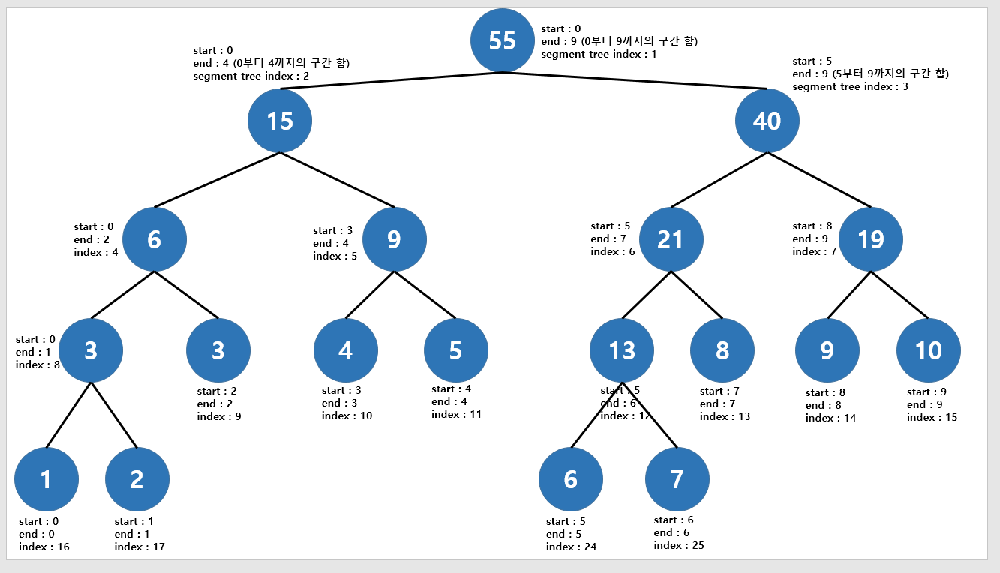

# Segment Tree

### Segment Tree
- 여러 개의 데이터가 존재할 때 특정 구간의 합(최솟값, 최댓값, 곱 등)을 구하는데 사용하는 자료구조
- 트리 종류 중에 하나로 이진 트리의 형태이며 특정 구간의 합을 가장 빠르게 구할 수 있다는 장점이 있음(O(logN))
- 기존 세그먼트 트리는 노드의 개수가 2의 제곱수 중 크고 가까운 수에서 *2 를 하여 트리를 구성하는데 보통 대신 *4를 하여 세그먼트 트리를 구성한다고 함
    - 만약 배열의 크기가 2의 제곱 형태라면 완전 이진 트리가 됨
- 리프 노드는 배열의 개별 원소를 나타냄
- 내부 노드는 두 자식 노드의 값을 계산한 값을 저장함

<br>


<br>



<br>

### 배열의 길이
- 트리의 높이는 Root Node에서 가장 긴 경로를 뜻하여 해당 그래프는 3
- 배열의 길이가 8일 때 8 > 4 > 2 > 1, 로 높이는 배열의 길이를 2^h 형태의 지수 (log8 = log2^3 = 3)
- 세그 먼트 트리는 완전 이진 트리이므로 첫번째 레벨은 1, 두번 째 레벨 노드 개수는 2 ... 늘어나는데 h 번까지의 노드 수의 합은 2^0 + 2^1 ... + 2^h 까지 이므로 기하급수적 수열의 합을 더한 전체 노드의 개수는 2^(h+1) - 1
    - 이를 수식화 하면 높이 h = logN
    - 배열의 크기 2(h + 1) - 1

<br>

### 구현해야하는 사항
- 원본 배열을 재귀를 사용하여 이진 트리인 세그먼트 트리를 초기화
- 저장된 세그먼트 트리의 값을 계산하며 저장하기
- 이후 값이 변경된다면 해당 노드의 값을 업데이트하고 상위 노드의 값을 업데이트하기

<br>

### 세부 구현 사항 고민하기
- 세그먼트 트리는 start, end, value, 자식 노드를 기록할 세그먼트가 필요?
    - 이후 블로그의 구현 방식은 자식 노드 배열, 트리의 크기만 내부 값으로 사용
- 세그먼트 트리 초기화 시 노드의 크기 n * 4 로 트리 크기 할당
- 재귀는 배열의 크기를 /2 하여 start ~ arr.length/2, arr.length/2 +1 ~ end 까지로 재귀로 분할 메서드 구현
    - 위의 배열의 길이 공식을 통해 배열의 높이를 안다면 리프 노드 부터 위로 세그먼트 트리를 초기화 할 수 있을 것 같으나 공식이 어려울 것 같아 포기..
    - 놓치고 있던 부분은 노드를 담기 위해 n * 4 를 했으나 자식 노드로 내려 갈 때 마다 자식 노드의 인덱스가 각각 (n * 2) + 1, (n * 2) + 2 가 된다는 부분
- 리프 노드부터 계산하여 계산하는 메서드 구현
    - 노드를 초기화 할 때 각 노드별로 자식 노드들의 총 합을 넣어 뒀을 때 만약 start가 2고, end 가 6인 애매한 경우에는 어떻게 계산해야하는지..?
    - 리프노드의 인덱스는 start = end 일 때의 값임
- 특정 인덱스의 노드 변경 시 해당 노드 변경 이후 상위 노드 값 변경

<br>

### 세그먼트 트리 구형
- 해당 구현 사항은 기본적으로 진행 후 구현하지 못해 블로그를 참조

```java
public class SegmentTree {
    private int[] tree;     // 각 원소가 담길 트리
    private int n;          // 리프 노드에 들어갈 배열의 개수

    public SegmentTree(int[] arr) {
        n = arr.length;
        tree = new int[4 * n];
        buildTree(arr, 0, n - 1, 0);
    }

    private void buildTree(int[] arr, int start, int end, int node) {
        if (start == end) {
            tree[node] = arr[start];    // 리프 노드가 될 때 까지 반복
        } else {
            int mid = (start + end) / 2;
            buildTree(arr, start, mid, 2 * node + 1);    // 자식 노드는 부모 노드의 인덱스의 * 2 +1 부터 시작 되므로
            buildTree(arr, mid + 1, end, 2 * node + 2);
            tree[node] = tree[2 * node + 1] + tree[2 * node + 2];    // 리프 노드가 아니면 자식 노드 합 담기
        }
    }

    private int query(int qs, int qe) {
        return queryUtil(0, n - 1, qs, qe, 0);
    }

    private int queryUtil(int start, int end, int qs, int qe, int node) {
        // 찾으려 하는 노드의 범위가 낮은 노드 인덱스가 start 보다 작거나 같고, 큰 노드 인덱스가 end 보다 크거나 같다면 구하고자 하는 범위이므로 해당 노드의 값을 반환
        if (qs <= start && qe >= end) {
            return tree[node];
        }

        // 범위 바깥인 경우
        if (end < qs || start > qe) {
            return 0;
        }

        // 이후 이진 분할 반북하여 찾고자 하는 범위가 일치할 때 까지 반복하고 포함되는 값만 가져오기 위함
        int mid = (start + end) / 2;
        return queryUtil(start, mid, qs, qe, 2 * node + 1) +
                queryUtil(mid + 1, end, qs, qe, 2 * node + 2);
    }

    public void update(int index, int value) {
        updateUtil(0, n - 1, index, value, 0);
    }

    private void updateUtil(int start, int end, int idx, int value, int node) {
        if (start == end) {     // 값 변경
            tree[node] = value;
        } else {
            int mid = (start + end) / 2;
            if (idx <= mid) {   // 바꾸려는 index 가 mid 보다 작거나 같다면 왼쪽만 탐색
                updateUtil(start, mid, idx, value, 2 * node + 1);
            } else {        // 바꾸려는 index 가 mid 보다 크다면 오른쪽만 탐색
                updateUtil(mid + 1, end, idx, value, 2 * node + 2);
            }
            tree[node] = tree[2 * node + 1] + tree[2 * node + 2];
        }
    }

    public static void main(String[] args) {
        int[] arr = {1, 3, 5, 7, 9, 11}; // arr 인덱스 범위 [0~5]
        SegmentTree segTree = new SegmentTree(arr);

        System.out.println(segTree.query(1, 3)); // 출력: 15

        segTree.update(1, 10);  // start index 1의 값을 10으로 변경
        System.out.println(segTree.query(1, 3)); // 출력: 22
    }
}
```

-------

## Reference
- https://velog.io/@kimdukbae/자료구조-세그먼트-트리-Segment-Tree
- https://cano721.tistory.com/38