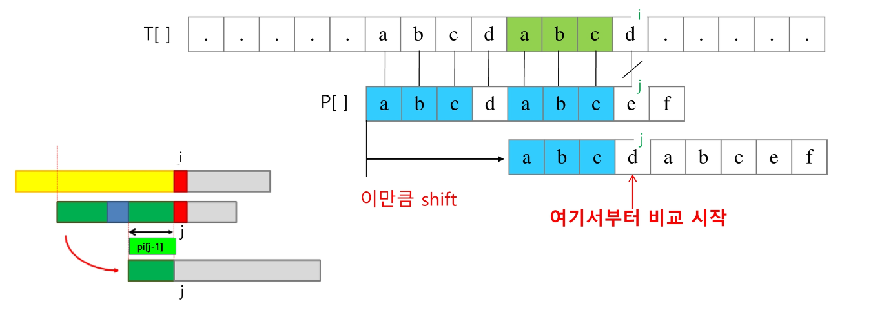
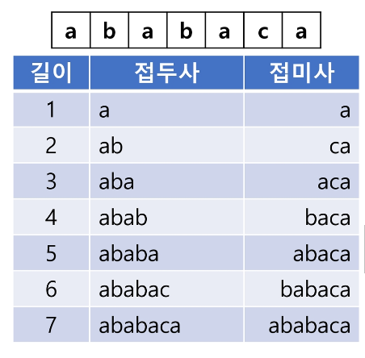
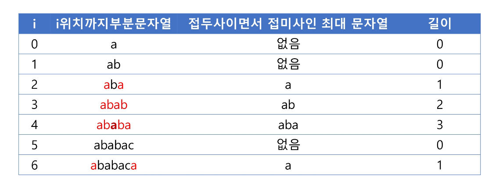
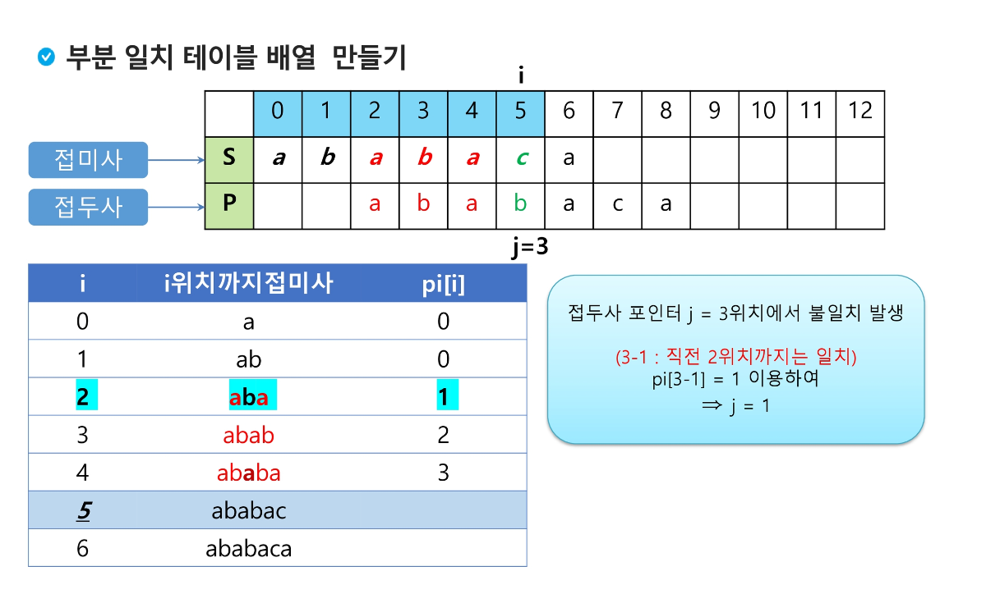

# String Pattern Matching

### 문자열 패턴 매칭
-  주어진 본문 문자열(텍스트) 내에서 특정 패턴 문자열(검색하고자 하는 문자열)을 찾는 문제
- 이 과정에서 본문 문자열의 특정 위치에서 패턴 문자열이 일치하는지 확인하는 알고리즘들이 사용됨
- 텍스트 편집기에서 특정 단어 검색, DNA 서열 분석, 데이터 검색 시스템, 웹 검색 엔진 등이 모두 문자열 패턴 매칭 알고리즘을 기반으로 동작함

 

### 문자열 패턴 매칭 알고리즘
- 고지식한 패턴 검색 알고리즘 (Brute Force)
    - 본문 문자열을 모두 확인하여 검사할 문자열인지 확인
- 라빈-카프 알고리즘 (Rabin-Karp)
    - 패턴과 본문의 부분 문자열의 해시값을 계산해서 비교
    - 일치하는 해시값이 나오면 그 위치에서 문자열을 다시 비교해 최종 확인
    - 해시충돌이 발생할 수 있고 시간 복잡도 최악은 O(M * N)
- 보이어-무어 알고리즘 (Boyer-Moore)
    - 패턴 문자열의 끝에서 부터 본문을 역방향으로 비교하여 불일치 할 경우 한 번에 많은 문자를 건너뛰는 방식으로 본문의 탐색위치를 조정
    - 본문의 포운터를 변경하여 확인하는 방법으로 "Bad Character Rule"과 "Good Suffix Rule"을 사용해 건너뛰기를 최적화 한다고 함
    - 시간 복잡도 최악은 O(M * N)
- KMP 알고리즘 (Knuth-Morris-Pratt)
    - 패턴 내에서 부분적인 일치를 활용하여 불필요한 비교를 건너 뜀
    - 패턴의 접두사와 접미사가 일치하는 부분을 이용해 효율적으로 이동
    - 시간 복잡도는 O(M + N)

 

### KMP 알고리즘 (Knuth-Morris-Pratt)
- 불일치가 발생한 텍스트 문자열의 앞 부분에 어떤 문자가 있는지를 미리 알고 있으므로, 불일치가 발생한 앞 부분에 대해서 다시 비교하지 않고 매칭을 수행
- 패턴을 전 처리하여 **부분 일치 테이블** 배열 (LPS or pi) pi[k]을 구해서 잘못된 시작을 최소화 함
    - pi[k] : 처음부터 k 인덱스 까지를 끝으로 하는 부분 문자열에서 접두사와 접미사가 일치하는 최대 길이
    - 접두사이자 접미사인 단어가 거의 없는 경우 사용하면 좋지 않은 알고리즘
    - 들어갈 수 있는 단어의 종류가 제한적이라면 사용하기 좋은 알고리즘임
- 패턴을 이용하여 부분 일치 테이블 배열을 작성이 우선
    - 매칭이 실패했을 때 패턴 포인터가 돌아갈 곳을 계산
- 패턴의 0번째 인덱스를 제외한 각 인덱스마다 맨 앞부터 해당 인덱스까지의 부분 문자열 중 접두사와 접미사가 일치하는 최대 길이로 계산하여 작성

 

#### 부분 일치 테이블 생성 원리
- 맨 앞부터 해당 인덱스까지의 길이가 2이상인 부분 문자열 중 접두사이면서 접미사인 최대 문자열을 지정
- 패턴 문자열의 포인터를 이동시키면서 뒤에 일치하는 최대 부분 문자열 저장하여 해당 문자열을 부분 일치 테이블로 사용

 

 

