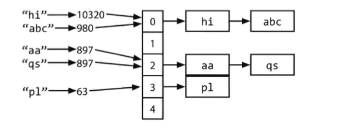

# 배열, 문자열 / 연결리스트

### 내용 정리하기 전에
- 해당 내용 정리는 코딩 인터뷰 완전 분석 책의 자료구조 파트를 정리하였음
- 자료구조에 널리 사용되는 보편적인 기법에 대해 작성되어 있음

<br>

## 데이터 구조로 만든 자료구조

### 해시 테이블
- 해시 테이블이란 효율적인 탐색을 위한 자료구조로서 Key를 Value에 대응시킴
- 해시 테이블을 구현하는 방법은 여러 가지가 있으나 해당 책에서 간단한 해시테이블을 구현하기 위해서 연결리스트와 해시 코드 함수만 사용하였음
    - 처음에는 키의 해시코드를 계산하는데 키는 중복되지 않도록 유의할 것
    - 이후에는 hash(key) % array_length 같은 방식처럼 배열의 인덱스를 구함
    - 배열의 각 인덱스에는 키와 값으로 이루어진 연결리스트가 존재하는데 키와 값을 해당 인덱스에 저장하는데 있어 서로 다른 두개의 키가 같은 해시 코드를 가리키거나 서로 다른 두 개의 해시코드가 같은 인덱스를 가르키는 경우의 충돌을 대비해서 반드시 연결리스트를 이용한다고 함

```
해시코드란?
- 임의의 데이터를 고정된 크기의 값으로 변환하는 함수의 결과물
- 해시 코드는 일반적으로 입력 데이터의 특성을 반영하여 동일한 입력에 대해서는 항상 동일한 해시 코드를 생성하도록 설계됨
- 주어진 데이터에 대해 고유한 식별자를 생성하는 데 사용됨

해시코드 예시
- 정수형 데이터의 경우 : '250'을 예시로 들면 그대로 '250' 그대로 사용
- 문자열 데이터의 경우 : 'abs'를 예시로 들면 'a'의 아스키코드 97 + 'b'의 아스키코드 98 + 's'의 아스키코드 115의 값인 '310'이 해시코드
- 실수(부동소수점 수)의 경우 : '3.14' 인 경우 정수형인 '3'이 해시코드
- 날짜 데이터의 경우 : '년도 + 월 + 일' 처럼 날짜 데이터의 각 구성 요소를 합산하여 해시코드 생성
- 사용자 정의 객체인 경우 : 예를 들어, 사용자가 정의한 클래스 Person이 있다면, 그 클래스의 필드들의 조합을 통해 해시 코드를 생성할 수 있음 ( 직접 생성해야 함 )

자바 해시코드 메서드
- Objects.hash() 메서드를 통해 해시코드로 쉽게 변경할 수 있음
- 자바의 날짜 클래스 Data, LocalDate, LocalDateTime 등은 hashCode가 구현되어 있어 따로 구현할 필요는 없음
```

<br>

### 해시테이블에서 키에 상응하는 값 찾기
- 주어진 키로부터 해시 코드를 계산하고 이 해시 코드를 이용하여 인덱스를 계산한다
- 이후 해당 키에 상응하는 값을 연결리스트에서 탐색
- 해당 과정을 반복

<br>


- 해당 그림에서는 위의 내용처럼 연결리스트를 사용하여 하나의 노드의 값을 하나하나 탐색하기 때문에 충돌이 자주 발생한다면 최악의 경우의 수행시간은 O(N)이 되고 일반적으로 충돌을 최소화하도록 구현하므로 이 경우 탐색 시간은 O(1)임
- 해당 책에서는 연결리스트로 했지만 이진 탐색 트리 등 다른 자료구조를 사용하여 구현할 수도 있음

<br>

### ArrayList와 가변 크기 배열
- 특정 언어 에선 배열의 크기를 자동으로 조절 할 수 있는데 (해당 경우 리스트로 주로 불림) 데이터를 덧붙일 때마다 배열 혹은 리스트의 크기가 증가함
- 자바의 경우에도 이런 동적 가변 크기 기능은 내재되어 있는 자료구조로 보통 ArrayList를 사용함

```
책에서의 ArrayList가 크기를 변화시킬 때 걸리는 시간

- ArrayList는 필요에 따라 크기를 변화시킬 수 있으면서도 0(1)의 접근 시간을 유지
- ArrayList는 크기를 동적으로 조절할 수 있으며, 원소에 대한 접근 시간이 상수 시간(O(1))에 유지됨. 
- ArrayList는 동적으로 크기를 조절하면서, 원소를 추가할 때 배열이 가득 차게 되면 일반적으로 현재 크기의 두 배로 배열을 확장함
- 크기를 두 배 늘리는 시간은 새로운 배열을 생성하고 기존 데이터를 복사하는 작업이 필요하므로 시간복잡도가 O(n)이지만, 자주 발생하는 일이 아니라서 상환 입력 시간으로 계산했을 때 여전히 O(1)이 된다.
```

<br>

### StringBuilder
- StringBuilder 없이 문자열을 하나로 이어 붙인다고 생각했을 경우 모든 문자열의 길이는 x고 같은 n개의 문자열이 주어졌다고 가정했을 경우 문자열을 이어붙일 때마다 두 개의 문자열을 읽어들인 뒤 문자를 하나하나 새로운 문자열에 복사해야 한다. 처음에는 x개， 두 번째는 2x개， 세 번째는 3x개， n 번 째는 nx개의 문자를 복사해야 한다. 따라서 총 수행 시간은 O(x+2x+...+nx),즉 O(xn2)이 됨
- StringBuilder는 해당 문제를 해결해주는데 단순하게 가변 크기 배열을 이용해서 필요한 경우에만 문자열을 복사하게 해줘 문제를 해결해줌

<br>

## 연결리스트

### 연결리스트란?
- 위에서 설명했듯이 차례로 연결된 노드를 표현해주는 자료구조
- 배열과는 달리 연결리스트에서는 특정 인텍스를 상수 시간에 접근할 수 없고 리스트에서 K번째 원소를 찾고 싶다면 처음부터 K번 루프를 돌아야함
- 연결리스트의 장점은 리스트의 시작 지점에서 아이댐을 추가하거나 삭제하는 연산을 상수 시간에 할수 있다는 점
- 기본적으로 단일 연결리스트, 이중 연결리스트, 원형 연결리스트 등이 있음

```
1. 단일 연결리스트 (Singly Linked List):
- 각 노드가 데이터와 다음 노드를 가리키는 포인터(참조)로 이루어져 있음
- 각 노드에서 다음 노드로만 이동이 가능
- 마지막 노드의 다음 노드는 보통 null이거나 특별한 값으로 표시
- 구현이 간단하고 메모리를 효율적으로 사용할 수 있움

2. 이중 연결리스트 (Doubly Linked List):
- 각 노드가 데이터와 이전 노드, 다음 노드를 가리키는 포인터(참조)로 이루어져 있음
- 양쪽 방향으로 이동이 가능
- 첫 번째 노드의 이전 노드와 마지막 노드의 다음 노드는 보통 null이거나 특별한 값으로 표시
- 양방향으로 이동이 가능하므로 특정 노드에서의 삽입 및 삭제가 더 편리

3. 원형 연결리스트 (Circular Linked List):
- 마지막 노드가 첫 번째 노드를 가리키는 형태의 연결리스트
- 단일 연결리스트나 이중 연결리스트 모두 원형으로 구현될 수 있음
- 특정 노드에서 시작하여 모든 노드를 순회하는 데 유용
```

<br>

### 간단한 단방향 연결리스트 만들기
```java
class Node {
    Node next = null;
    int data;

    public Node(int d) {
        data = d;
    }

    void appendToTail(int d) {
        Node end = new Node(d);
        Node n = this;
        while (n.next != null) {
            n = n.next;
        }
        n.next end;
    }
}
```
- 연결리스트에 접근할 때 head 노드의 주소를 참조하는 방법을 사용했으나 해당 경우 문제는 여러 객체들이 동시에 연결리스트를 참조하는 도중에 head가 바뀌면 어떤 객체는 계속 이전 head를 계속 가르키고 있을 수도 있음

<br>

### 단방향 연결리스트에서 노드 삭제
- 연결리스트에서 노드를 삭제하는 연산은 노드 n이 주어지면 이전 노드를 찾아 다음 노드를 n의 기존 다음 노드와 같도록 변경
- 리스트가 양방향 연결 리스트인 경우에는 n의 다음 가리키는 노드를 찾고 다음 노드에서 이전 노드를 n의 이전 노드와 같도록 변경
- 해당 과정에서 유의해야하는 부분은 널 포인터 검사와 필요하면 head와 tail 포인터도 갱신해야 함
    - C나 C++처 럼 메모리 관리가 필요한 언어를 사용해 구현하는 경우에는 삭제한 노드에 할당되었던 메모리가 제대로 반환되었는지 반드시 확인해야 한다.

<br>

### Runner 기법
- 부가포인터라고도 부르며 연결리스트 문제에서 많이 활용되는 기법
- 연결리스트를 순회할 때 두 개의 포인터를 동시에 사용하는 것
- 이때 한 포인터가 다른 포인터보다 앞서도록 함
    - 앞선 포인터가 따라오는 포인터보다 항상 지정된 개수만큼을 앞서도록 할 수도 있고， 아니면 따라오는 포인터를 여러 노드를 한 번에 뛰어넘도록 설정할 수도 있음

<br>

### 재귀 문제
- 연결리스트 관련 문제 가운데 상당수는 재귀 호출에 의존하는데 재귀 호출 깊이가 n이 될 경우 해당 재귀 알고리즘이 최소 O(n) 만큼의 공간을 사용한다는 사실을 기억헤라
- 모든 재귀(recursive) 알고리즘은 반복적(iterativε) 형태로도 구현될 수 있긴 하지만 반복적 형태로 구현하면 한층 복잡해질 수도 있음