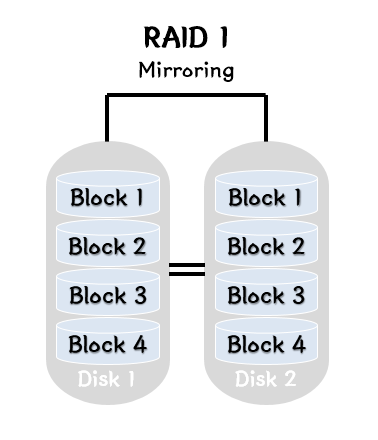
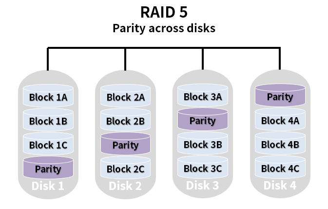

# RAID

### RAID
- 저렴한 디스크의 복수 배열 (Redunant Array of Inexpensive Disk) 혹은 독립된 디스크의 복수 배열 (Redundant Array of Independent Disk) 라고 함
- 여러 개의 저장장치를 묶어서 하나의 고용량/고성능 저장 장치 처럼 사용하는 기술 -> 상대적으로 속도가 많이 느린 하드디스크를 보완하기 위해 만든 기술
- 여러 개의 하드디스크에 일부 중복된 데이터를 나눠서 저장하는데 중복된 데이터를 나눠서 저장하는 가장 큰 이유는 데이터를 안전하게 보호하기 위함
- 데이터를 나누는 다양한 방법이 존재하며 이 방법들을 레벨이라하며 레벨에 따라 저장장치의 신뢰성을 높이거나 전체적인 성능을 향상 시키는 등의 다양한 목적을 만족 시킬 수 있음
- 최근 출시되는 RAID 컨트롤러에서 사용가능한 RAID는 RAID 0, RAID 1, RAID 5, RAID 6  

#### RAID 목적
1. 여러 개의 디스크 모듈은 하나의 대용량 디스크처럼 사용할 수 있도록 하는 것 -> 대용량의 단일 볼륨을 사용
2. 여러 개의 디스크 모듈에 데이터를 나누어서 한꺼번에 쓰고 한꺼번에 읽는 식으로 입출력 속도를 높임 -> 디스크 I/O 병렬화로 인한 성능 향상
3. 여러 개의 디스크를 모아서 하나의 디스크로 만들고 그 중 하나 혹은 그 이상의 디스크 장애가 나더라도 최소한 데이터가 사라지는 것을 방지 -> 데이터 복제로 인한 안정성

<br>

<br>

### RAID 종류

<br>


<br>

#### RAID 0 
- <code>스트라이핑</code>(striping, 분산)이라고도 부르는 방식
- RAID 0을 구성하기 위해서는 최소 2개의 디스크가 필요하며 RAID를 구성하는 모든 디스크에 데이터를 분할해서 저장
- 전체 디스크를 모두 동시에 사용하기 때문에 성능은 단일 디스크의 N배이며 용량 역시 N배
- 하나의 디스크라도 문제가 발생한 경우 전체 RAID가 깨지는 일이 발생하기 때문에 안정성은 1/N으로 줄어듬
```
스트라이핑 (Striping)
- 연속된 데이터를 여러 개의 디스크에 라운드 로빈 방식으로 기록하는 기술
- 프로세서가 하나의 디스크에서 읽는 것보다 여러개의 디스크를 더 빠르게 읽을 수 있을 때 유용
- 같은 데이터를 1개에 디스크와 4개에 디스크에 각각 보관되어 있을 때, 데이터를 읽을 경우 1개의 디스크에서 모두 읽는 것보다 동시에 4개의 디스크에서 데이터를 나눠 읽는 것이 빠름
```

<br>



<br>

#### RAID 1
- <code>미러링</code>(Mirroring, 중복)이라고도 부르는 방식
- RAID 1을 구성하기 위해서는 최소 2개의 디스크가 필요하며 RAID 1은 모든 디스크에 데이터를 복제하여 기록
- 동일한 데이터를 N개로 복제하여 각 디스크에 저장하는 방식
- 여러 개의 디스크로 RAID를 구성해도 실제 사용 가능한 용량은 단일 디스크의 용량과 동일
- RAID 1의 최대 강점은 안정성이 높지만 비용 문제로 거의 사용하지 않음
```
미러링(Mirroring)
- 다른 디스크에 데이터를 중복 저장하는 기술
- 하나의 디스크가 에러가 발생했을 때 복구 가능
```

<br>


<br>

#### RAID 5
- 블록 단위로 스트라이핑을 하고 error correction을 위해 <code>패리티</code>를 1개의 디스크에 저장
- 단 패리티 저장은 고정된 디스크에 하지 않고 매번 다른 디스크에 저장
- RAID 4의 단점을 개선, RAID 0에서 성능, 용량을 조금 줄이고 안정성을 높인 RAID 레벨
- 용량 및 성능이 단일 디스크 대비 N-1배 증가하며 최소 3개의 디스크로 구성이 가능
- 1개의 디스크 에러시 복구 가능 ( 2개 이상의 디스크 에러 시 복구 불가능 )

```
패리티 (Parity)
- 데이터의 무결성을 확인하는 오류 체크 기술
- 데이터의 장애가 발생하게 되면 저장된 패리티를 통해 데이터를 복구할 수 있음
- 데이터와 해당 데이터에 대한 패리티가 함께 저장되며 특정 디스크의 장애로 인하여 데이터를 잃어버린 경우가 발생해도 패리티를 통해 잃어버린 데이터 복구
```

<br>


<br>

#### RAID 6
- RAID 5에서 성능과 용량을 좀 더 줄이고 안정성을 좀더 높인 방식 -> 조금 더 안정성을 높여야 하는 서버 환경에서 주로 사용
- 블럭 단위로 스트라이핑을 하고 error correction을 위해 패리티를 2개의 디스크에 저장하는데 패리티 저장은 고정된 디스크에 하지 않고, 매번 다른 디스크에 저장
- 용량 및 성능이 단일 디스크 대비 N-2배 증가하며 최소 4개의 디스크로 구성이 가능
- 2개의 디스크 에러 시 복구 가능 ( 3개 이상의 디스크 에러 시 복구 불가능 )

<br>


#### Nested RAID (중첩 RAID 레벨, 하이브리드 RAID 레벨)
- 표준 레이드 레벨을 동시에 하나로 구현한 레이드 레벨
- 대표적으로 RAID 0+1, RAID 10(RAID 1+0), RAID 5+0(RAID 5+0), RAID 51(RAID 5+1), RAID 61(RAID 6+1R)

<br>


<br>

##### RAID 0+1
- RAID 0+1은 먼저 디스크를 스트라이핑(RAID 0)한 후 이를 다시 미러링(RAID 1) 하는 구성
- 레벨의 구성에 최소 4개의 디스크가 필요 
 
<br>


<br>

#### RAID 10 (RAID 1+0)
- RAID 10은 먼저 디스크를 미러링(RAID 1) 한 후 이를 다시 스트라이핑(RAID 0)하는 구성
- 레벨의 구성에 최소 4개의 디스크가 필요

<br>

### 그 외 사용하지 않는 RAID 2, 3, 4
#### RAID 2
- 현재는 사용하지 않는 RAID
- bit 단위로 스트라이핑을 하고 error correction을 위해 Hamming code를 사용
- m+1 개의 데이터 디스크와 m개의 패리티 디스크로 구성됨
- 1개의 디스크 에러시 복구 가능 ( 2개 이상의 디스크 에러 시 복구 불가능 )
- 최소 3개의 디스크로 구성 가능
#### RAID 3
- 현재는 사용하지 않는 RAID
- Byte 단위로 스트라이핑을하고 error correction을 위해 패리티 디스크를 1개 사용
- 용량 및 성능이 단일 디스크 대비 (N-1) 배 증가
- Byte 단위로 스트라이핑하여 너무 작게 쪼개져 현재는 사용하지 않음
- 1개의 디스크 에러시 복구 가능 ( 2개 이상의 디스크 에러 시 복구 불가능 )
- 최소 3개의 디스크로 구성 가능
#### RAID 4
- 현재는 거의 사용하지 않는 RAID
- Block 단위로 스트라이핑을 하고 error correction을 위해 패리티 디스크 1개를 사용
- 용량 및 성능이 단일 디스크 대비 (N-1)배 증가
- 최소 3개의 디스크로 구성 가능
- 1개의 디스크 에러 시 복구 가능 ( 2개 이상의 디스크 에러 시 복구 불가능 )
- 대부분 RAID 5 와 동일하지만 패리티 코드를 동일한 디스크에 저장하기 때문에 패리티 디스크에 사용량이 높아 해당 디스크의 수명이 줄어든다고 함
- RAID 4를 개선한 것이 RAID 5

<br>


<div style="text-align: right">22-07-27</div>

-------

## Reference
- https://www.dknyou.com/blog/?q=YToxOntzOjEyOiJrZXl3b3JkX3R5cGUiO3M6MzoiYWxsIjt9&bmode=view&idx=7342927&t=board
- https://server-talk.tistory.com/97
- https://harryp.tistory.com/806