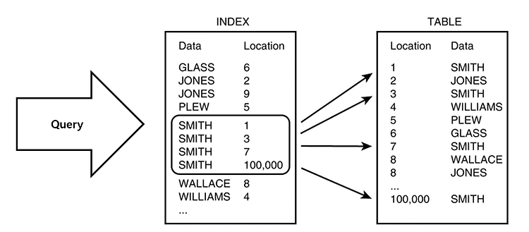
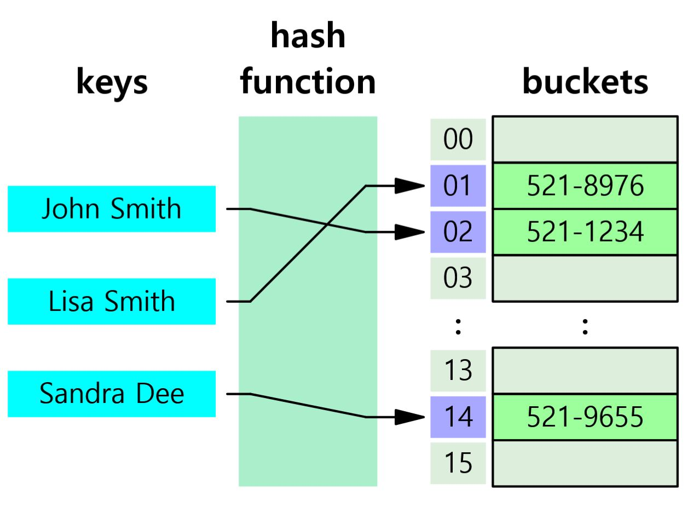
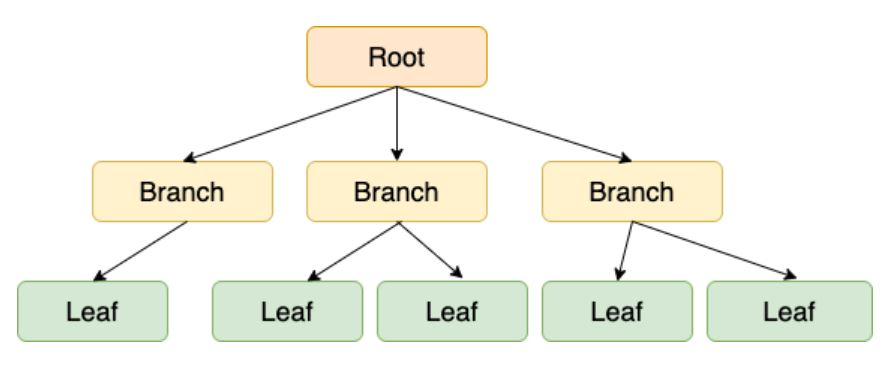
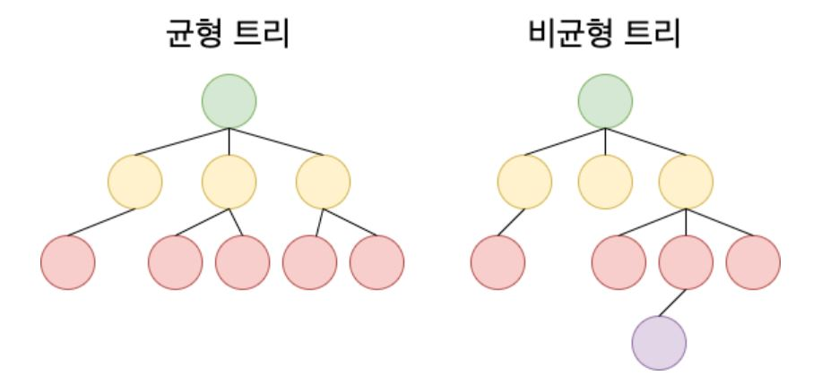

# DB Index


<br>

### DB Index?
- 인덱스(Index)란 추가적인 쓰기 작업과 저장공간을 활용하여 데이터베이스 테이블의 검색 속도를 향상시키기 위한 자료구조
        - 컬럼의 값과 레코드가 저장된 주소를 키와 값의 쌍으로 인덱스를 만들어 둠
- 인덱스를 저장하는데 필요한 디스크 공간은 보통 테이블을 저장하는데 필요한 디스크 공간보다 작음
        - 인덱스는 키-필드를 가지고 있기 때문
        - MYI(MySQL Index) 파일에 인덱스 저장
- DB는 데이터 양(row)에 따라 실행 결과 속도가 차이가 나는데 데이터 양이 늘어날 수록 실행속도는 느려지고 JOIN, sub query 사용에 데이터 양이 증가하는데 이에 Index를 적재적소에 사용하면 쿼리의 성능을 높일 수 있음
- 예시로는 우리가 책에서 원하는 내용을 찾을 때 책을 전부 찾는 것이 아닌 책의 색인을 보고 해당 페이지를 찾을 수 있는데 index는 여기서 색인과 같다고 함
- Index는 생성 시 데이터를 오름차순으로 정렬하기 때문에 정렬된 주소체계
- 옵티마이저가 가장 효율적인 방법으로 SQL을 수행할 최적의 처리 경로를 설정해주는 DBMS의 핵심 엔진으로 컴퓨터의 두뇌가 CPU가 한다면 DBMS의 두뇌는 옵티마이저라고 함

<br>

### 클러스터형 인덱스 (Clustered Index)
- 특정 나열된 데이터들을 일정 기준으로 정렬해 주는 인덱스
- 클러스터형 인덱스 생성 시 데이터 페이지 전체가 다시 정렬
        - 이미 대용량의 데이터가 입력된 상태라면 클러스터형 인덱스 생성시 심각한 부하 바생
- 테이블당 하나만 생성 가능하며 어느 열에 클러스터형 인덱스를 생성하는지에 따라 시스템의 성능이 달라짐
- 보조 인덱스보다 검색속도는 더 빠르지만 입력/수정/삭제는 더 느림
- MySQL의 경우 Primary Key가 있다면 Primary Key를 클러스터형 인덱스로, 없다면 Unique 하면서 Not Null인 컬럼을, 그것도 없다면 임의로 보이지 않는 컬럼을 만들어 클러스터형 인덱스로 지정

<br>

### 보조 인덱스 (Secondary or Non-Clustered Index)
- 임의의 컬럼에나 부여 가능한 Index
- 보조 인덱스 생성시 데이터 페이지는 그냥 둔 상태에서 별도의 페이지에 인덱스를 구성
- 보조 인덱스는 해당 데이터를 검색할 수 있는 주소값인 데이터가 위치하는 주소값(RID)에 저장됨
- 클러스터형 인덱스보다 검색 속도는 느리지만 데이터의 입력/수정/삭제 시 성능 부하가 적음
        - 데이터 수정 시 전체 데이터의 재정렬이 필요하지 않아 성능 부하가 적음
- 보조 인덱스는 테이블당 여러 개 생성 가능

<br>

### Index 사용 예시
```sql
-- CREATE
CREATE INDEX [인덱스명] ON [테이블명](컬럼1, 컬럼2, 컬럼3.......) [ASC | DESC]
CREATE INDEX EX_INDEX ON CUSTOMERS(NAME,ADDRESS); 
CREATE[UNIQUE] INDEX EX_INDEX ON CUSTOMERS(NAME,ADDRESS); -- 컬럼 중복 X

-- SELECT
SELECT * FROM USER_INDEXES WHERE TABLE_NAME = 'CUSTOMERS';
SELECT * FROM ALL_IND_COLUMNS WHERE TABLE_NAME = 'CUSTOMERS';

-- DELETE
DROP INDEX [인덱스 명]
DROP INDEX EX_INDEX;

-- UPDATE
DROP INDEX [기존 인덱스 명] TO [바뀔 인덱스 명]
ALTER INDEX EX_INDEX RENAME TO EX_INDEX_NEW

-- REBUILD
ALTER INDEX [인덱스명] REBUILD;
ALTER INDEX EX_INDEX REBUILD;

-- TABLE INDEX 정보 확인
SHOW INDEX FROM 테이블명
```

<br>



<br>

### Index 장점
- 위에도 적어놨듯이 가장 큰 특징은 데이터들이 정렬되어 있다는 것. Index의 장점은 모두 데이터들이 정렬되었다는 장점을 관통하는 내용임
        - 인덱스는 논리적 테이블로 해당 테이블에 데이터들이 정렬되어 있음. 해당 정렬된 테이블에서 조회하고 조회에 성공했다면 해당 논리 테이블의 포인터를 통해 실제 데이터에 접근
- 전반적인 시스템의 부하를 줄이고 테이블 조회 속도와 그에 따른 성능 향상
#### 1. 조건 검색 WHERE 절의 효율성 
        - 테이블을 만들고 데이터가 쌓이게 되면 테이블의 row는 내부적으로 순서가 없이 뒤죽박죽으로 저장되게 됨. 
        - 위의 상태에서 WHERE 절은 특정 조건에 맞는 데이터를 찾아낼 때도 처음부터 끝까지 검색조건과 맞는지 비교하는데 이것을 풀 테이블 스캔(Full Table Scan) 줄여서 풀 스캔(Full Scan)이라고함
        - 그러나 인덱스 테이블 스캔(Index Table Scan) 시 인덱스 테이블은 데이터들이 정렬되어 저장되어 있기 때문에 해당 조건(WHERE)에 맞는 데이터들을 빠르게 찾아낼 수 있음. 이것이 인덱스를 사용하는 가장 큰 이유
#### 2. 정렬 ORDER BY 절의 효율성
        - 인덱스를 사용하면 ORDER BY에 의한 정렬(Sort)과정을 피힐 수 있음. ORDER BY는 굉장히 부하가 많이 걸리는 작업
        - 정렬과 동시에 1차적으로 메모리에서 정렬이 이루어지고 메모리보다 큰 작업이 필요하다면 디스크I/O도 추가적으로 발생하기 때문
        - 인덱스를 사용하면 위의 자원소모 없이 정렬이 되어 있기 때문에 가져오기만 하면 됨
#### 3. MIN, MAX의 효율적 처리
        - 마찬가지로 데이터 정렬으로 얻는 장점으로 MIN값과 MAX값을 레코드의 시작 값과 끝 값 한건 씩만 가져오면 되기 때문에 Full Table Scan으로 테이블을 모두 뒤져서 작업하는 것보다 훨씬 효율적으로 찾을 수 있음

<br>

### Index 단점
- 인덱스의 가장 큰 문제도 정렬. 정렬된 상태를 계속 유지시켜줘야 한다는 점에서 레코드 내에 데이터 값이 바뀌는 부분이라면 악영향을 끼침
        -
- 인덱스를 관리하기 위해서는 추가 작업이 필요함. 인덱스를 잘못 사용할 경우 오히려 성능이 저하되는 역효과 발생
#### 1. 인덱스는 DML에 취약
        - INSERT, UPDATE, DELETE를 통해 데이터가 추가되거나 값이 바뀐다면 인덱스 테이블 내에 있는 값들을 다시 정렬 해야함
        - 인덱스 테이블, 원본 테이블 두 군데의 데이터 수정 작업을 진행해야 함
        - 그렇기 때문에 DML이 빈번한 테이블보다 검색을 위주로 하는 테이블에 인덱스를 생성하는 것이 좋음
#### 2. 인덱스 스캔이 무조건 옳은 것은 아님
        - 인덱스를 사용하는 경우는 인덱스가 테이블 전체 데이터 중에서 20% 이하의 데이터를 처리하는 경우에만 효율적이고 그 이상의 데이터를 처리할 땐 사용하지 않는 것이 좋다고 함
        - 직관적인 예시로는 1개의 데이터가 들어있는 테이블과 100만개의 데이터가 들어있는 테이블이 있다고 한다면 100만개의 데이터가 있는 테이블은 인덱스 스캔이 1개의 데이터가 있는 테이블은 풀스캔이 빠름
#### 3. 속도 향상 목적으로 지나친 인덱스 생성은 좋지 않음
        - 인덱스를 관리하기 위해서는 데이터베이스의 약 10%에 해당하는 저장공간이 추가로 필요
        - 속도 향상에 비해 단점들의 COST를 비교해서 인덱스를 만들지를 정해야 함

>#### Index 남발하지 않아야 하는 이유
>- 데이터베이스 서버에 성능 문제 발생시 가장 빨리 생각하는 해결책이 인덱스 추가 생성
>- 문제가 발생 시 마다 인덱스를 생성하면 인덱스가 쌓여가기 때문에 하나의 쿼리문을 빠르게 만들수는 있으나 전체적인 데이터베이스의 성능 부하를 초래
>- 많은 인덱스가 쌓일 경우 DML 부하가 발생하여 전체적인 데이터베이스 성능 저하
>- 인덱스 생성은 그렇기 때문에 좀 더 효율적으로 짜는 방향으로 가야하고 인덱스 생성은 마지막 수단으로 강구해야 한다

<br>

### Index 관리
- 인덱스를 사용하는 경우에 항상 최신의 데이터를 정렬된 상태로 유지해야 하므로 인덱스가 적용된 컬럼에 INSERT, UPDATE, DELETE가 수행될 때 마다 계속 정렬해야하고 그에 따른 부하 발생
- 이를 최소화하기 위해 인덱스는 '데이터 삭제'라는 개념에서 '인덱스를 사용하지 않는다'라는 작업으로 이를 대신한다고 함
- 인덱스 파일은 생성 후 DML이 반복되면 성능이 저하되는데 생성된 인덱스는 트리구조를 가지고 오랫동안 반복 시 한쪽이 무거워져 전체적으로 트리의 깊이가 깊어지기 때문에 인덱스의 검색속도가 떨어지므로 주기적으로 리빌딜 작업을 거치는 것이 좋음
>- INSERT : 새로운 데이터에 대한 인덱스를 추가
>- DELETE : 삭제하는 데이터의 인덱스를 사용하지 않는다는 작업을 진행
>- UPDATE : 기존의 인덱스를 사용하지 않음 처리하고 갱신된 데이터에 대해 인덱스를 추가

<br>

### Index 생성 전략
- 인덱스를 생성할 때는 검색 범위를 최소화하도록 해야함
        - 만약 인덱스를 통해 검색 결과가 너무 많다면 인덱스의 효과가 떨어지고 MySQL 옵티마이저가 풀 테이블 스캔으로 동작할 수도 있음 (풀 테이블 스캔보다 20% 가량 이하에서 인덱스 레인지 스캔 조회)
- 인덱스는 특정 컬럼을 기준으로 생성하고 기준이 된 컬럼으로 정렬이 된 인덱스 테이블이 생성되는데 이 기준 컬럼은 최대한 중복이 되지않는 값이 좋음
        - 가장 최선은 PK로 인덱스를 생성
- 중복값이 없는 인덱스 테이블이 최적의 효율을 발생시키고, 반대로 모든 값이 같은 컬럼의 인덱스 컬럼이 된다면 인덱스로써의 가치가 없다고 함
- 외래키를 설정한 열에는 자동으로 외래키 인덱스가 생성됨
>1. WHERE 조건절에 자주 등장하는 컬럼
>2. 항상 = 으로 비교되는 컬럼
>3. 중복되는 데이터가 최소한인 컬럼 (분포도가 좋은 컬럼 )
>4. ORDER BY 절에서 자주 사용되는 컬럼
>5. JOIN 조건으로 자주 사용되는 컬럼
>6. DML이 자주 발생하지 않는 컬럼

<br>

### 인덱스 구조
- B TREE 인덱스 중 가장 많이 사용하는 것은 B+Tree와 B*Tree
- 주 인덱스 유형은 해시테이블, B TREE (Balanced Tree)
- 인덱스가 B 트리 구조를 사용하는 것으로 해당 논리적 테이블은 B 트리를 통해 정렬되어 있으며 리프노드에 해당 데이터의 실제 위치를 가리키는 포인터를 포함하여 해당 데이터에 접근이 가능하게 함
        - 중간 노드는 리프 노드의 인덱스 키를 찾기 위한 노드들의 포인터를 가지고 있어 해당 트리 경로를 따라 적절한 리프노드를 찾는데 사용됨
        - 중간노드와 리프 노드 정렬된 상태로 유지됨

<br>


#### 1. 해시 테이블 ( Hash Table )
- Key-Value 형태로 데이터를 저장하는 자료 구조
        - RDB는 해당 해시테이블로 인덱스를 구성하지 않고 주로 B 트리를 사용
        - NoSQL의 경우 정확하고 빠른 데이터 탐색을 위해 해시 테이블을 사용
- 내부적으로 배열 (버킷)을 이용하여 데이터를 저장하기 때문에 빠른 검색 속도 제공
- 해시 함수(Hash Function)을 이용하여 Key를 사용해 index를 계산하는 계산식으로 적절한 index를 찾아 Key 충돌을 줄여 빠른 속도를 유지할 수 있고 Key 충돌 있는 경우는 부가적인 처리 필요
- 데이터 탐색시 해시 함수를 통해 Key에 해당하는 index값을 구함
- index를 이용하여 배열에 저장된 value에 접근하기 때문에 해시 테이블의 평균 시간복잡도는 O(1)

<br>




#### 2. B-Tree ( Balanced Tree )
- 트리를 구성하는 아이템을 노드라고 하는데 B-Tree는 자식 노드의 개수가 2개 이상인 트리를 말함
- 가장 상단을 구성하는 루트노드(root node), 중간에 위치한 브랜치 노드(branch node), 마지막에 위치한 리프 노드(leaf node)로 구성
- 트리의 차수에 따라 노드 내 최대 Key-Value 수가 달라짐 -> Key-Value수 2개는 2차 B-Tree, 3개일 경우는 3차 B-Tree...
- 균형 트리(Balanced Tree)로 루트 노드에서 리프 노드까지의 거리가 모두 동일
- DML에 따라 시간이 지나면서 데이터의 균형이 깨지면서 성능이 악화됨


<br>

#### 3. B+Tree 
- B-Tree의 확장 개념으로 B-Tree와 다르게 브랜치 노드는 Value에 대한 정보가 존재하지 않고 단순히 Key 값만 존재
- 리프 노드(leaf node)에서만 Value를 관리
- 리프 노드들은 LinkedList 구조로 서로를 참조하고 있기 때문에 B-Tree보다 노드 순회가 쉬움
- 리프 노드가 아닌 자료는 인덱스 노드(포인터 주소 존재)라고 부르고 리프 노드 자료는 데이터 노드(데이터 존재)라고 부름
- 모든 리프노드는 같은 레벨에 존재
- 브랜치 노드에 Value가 없어서 B-Tree보다 차지하는 메모리가 적지만 Value를 찾기위해 리프 노드 까지 이동해아 함
- 브랜치 노드와 리프 노드에 모두 Key가 존재하므로 Key 중복이 발생
- 리프 노드에 데이터가 없으면 디스크에서 탐색 진행 

<br>

#### 4. B*Tree
- 노드의 추가적인 생성과 추가적인 연산의 최소화를 위해 생성
- B-Tree는 최소 M/2개의 키값을 가졌던 기존 노드의 자식 노드 수 최소 조건이 2M/3개로 늘어남
- 노드가 가득차면 분열 대신 이웃한 형제 노드로 재배치 ( 재배치 불가능 시점에서 분열 )
- 각 노드의 자료는 정렬되어 있으나 자료는 중복되지 않음
- 모든 리프노드는 같은 레벨에 존재
- root node가 아닌 노드들은 적어도 2[(M-2)/3]+1개의 자식 노드를 가지고 있음 (최대 M개)


<br>

추가해야 하는 내용 B트리 내용 + 카디널리티 + 인덱스 탐색 방법 + 인덱스 메타 데이터 (myi) https://solbel.tistory.com/739

<div style="text-align: right">22-07-08</div>

-------

<br>

## Ssafy Wizards CS Study

### 1. 일반적으로 인덱스는 수정이 잦은 테이블에선 사용하지 않기를 권하는 이유
- 인덱스는 기본적으로 정렬된 상태를 계속 유지하므로 수정이 잦다면 해당 정렬이 여러번 발생하여 성능이 좋지 않음
- 테이블의 데이터를 삽입(insert), 업데이트(update), 삭제(delete)할 때마다 인덱스도 함께 수정되어야 하며, 이러한 작업은 인덱스 구조를 다시 정렬하고 균형을 유지해야 하는데 유지하는 비용이 더 클 수 있음

<br>

### 2. ORDER BY/GROUP BY 연산의 동작 과정을 인덱스의 존재 여부와 연관지어서 설명
- 해당 키워드들은 SQL 쿼리에서 데이터를 정렬하거나 그룹화할 때 사용되어 데이터의 순서를 조정하거나 그룹을 생성하는데 인덱스가 있다면 성능이 크게 향상됨
- ORDER BY의 경우에는 이미 정렬되어 있는 인덱스를 사용하여 추가적인 정렬이 필요하지 않아 결과를 빠르게 반환하여 쿼리의 성능을 크게 향상 시킴
- GROUP BY의 경우에도 마찬가지로 인덱스는 이미 정렬되어 있는 상태이므로 인덱스를 따라가면서 순차적으로 데이터를 그룹화할 수 있어 마찬가지로 추가적인 정렬 없이 그룹핑이 가능하여 성능이 크게 향상됨
- 인덱스가 존재하지 않는다면 두 키워드 모두 전체 테이블 스캔을 통해 데이터를 메모리로 불러온 후 메모리 내에서 정렬과 그룹화를 수행해야 하여 많은 메모리와 CPU 자원을 필요로 하게됨

<br>

### 3. 기본키는 인덱스라고 할 수 있을까요? 그렇지 않다면, 인덱스와 기본키의 차이
- 기본키와 인덱스는 다른 목적을 가지고 있으며 인덱스로 사용하면 좋지만 인덱스라고 할 수는 없음
        - 기본키는 식별을 위한 고유한 식별자
        - 인덱스는 특정 열 또는 열의 조합에 대해 데이터를 빠르게 검색하기 위해 사용하기 위한 것
        - 인덱스는 조회를 위한 정렬되어 있는 데이터로 해당 데이터가 적을 수록 좋으므로 기본키를 통한 인덱스 조회는 성능이 좋을 뿐이고 다른 개념임
- 기본키는 자동으로 인덱스가 생성되지만 인덱스 자체가 기본키는 아님

<br>

### 4. 외래키와 인덱스의 차이
- 위와 마찬가지로 외래키는 한 테이블의 열이 다른 테이블의 기본키를 참조하기 위한 키일 뿐으로 연관 관계를 정의하기 위한 키이며 인덱스는 빠른 조회 최적화를 위한 추가적인 데이터 
- 외래키는 다른 데이터의 키를 참조하기 위한 키이며 인덱스는 특정 속성에 대해 조회 성능을 높이기 위한 정렬 데이터로 목적과 기능이 다름

<br>

### 5. 인덱스가 데이터의 물리적 저장에 미치는 영향과 데이터가 저장되는 방식
- 대부분의 경우 인덱스는 데이터에 빠르게 접근하는 데 사용되며 물리적으로 데이터를 저장하는 방식 자체에 직접적인 영향을 주지 않음
        - 인덱스를 통해 조회하고 해당 포인터를 통해 실제 데이터에 접근하는데 사용될 뿐이며 저장되는 데에는 영향을 끼치지 않음
- 예외적으로 클러스터드 인덱스의 경우 데이터의 물리적 저장 순서에 영향을 줌
        - 클러스터드 인덱스가 적용된 경우 데이터는 인덱스 순서에 따라 물리적 저장소에 정렬되어 저장되므로 해당 인덱스는 물리적 저장에 영향을 끼침

<br>

### 6. RDB와 NoSQL (ex. Redis, MongoDB 등) 인덱스 차이
- RDB는 인덱스 구조가 B 트리로 구성되어 있어 해당 정렬되어 있는 인덱스 테이블을 통해 데이터에 접근
        - 해당 구조는 범위 검색, 정렬, 그룹화 등에 대해 효율적이며 데이터가 정렬된 인덱스 테이블을 통해 빠르게 데이터에 접근할 수 있음
- NoSQL은 데이터베이스의 설계 목적에 따라 다양한 인덱스 구조를 사용할 수 있음
        - MongoDB는 B 트리 기반 인덱스를 사용하지만 추가적인 다양한 인덱스를 지원함
        - Redis는 키-값의 해시테이블 기반 구조로 되어 있어 해당 해시값을 통해 빠른 데이터 접근

<br>

## Ssafy Wizards CS Study2

### 1. 가끔은 인덱스를 타는 쿼리임에도 Table Full Scan 방식으로 동작하는 경우가 있습니다. 왜 그럴까요?
- 인덱스를 타는 조회는 논리 테이블인 인덱스 테이블을 확인하고 해당 포인터에 따라 랜덤으로 위치한 물리 데이터를 찾는데(랜덤 엑세스) 테이블의 모든 행을 순차적으로 읽는 풀 테이블 스캔보다 느릴 수 있음
- 일반적으로 인덱스 스캔이 주로 풀 테이블 스캔의 20%~30% 이상이면 자동으로 풀 테이블 스캔으로 변경하여 진행됨
        - 해당 기준은 데이터베이스의 쿼리 옵티마이저는 인덱스를 사용할지, 아니면 테이블 풀 스캔을 사용할지를 결정할 때 비용 기반 최적화를 수행함

<br>

### 2. COUNT (개수를 세는 쿼리) 는 어떻게 동작하나요? COUNT(1), COUNT(*), COUNT(column) 의 동작 과정

#### 1. COUNT(*)
- 테이블의 모든 행을 세는 함수
- NULL 포함 테이블의 모든 행을 셈
- 모든 행을 세는 작업이므로 인덱스가 영향을 끼치지 않음
- 하지만 클러스터드 인덱스가 있다면 해당 인덱스를 활용하여 테이블 스캔을 더 효율적으로 수행할 수 있음

#### 2. COUNT(1)
- 이 쿼리는 각 행에 대해 숫자 1을 반환한 후 그 개수를 세는 방식으로 COUNT(*)과 거의 동일한 함수
        - 모든 행을 세지만, 상수 1을 사용하여 상수 1이 반환된 개수를 세는데 최종적으로 모든 행의 개수를 반환 하는 것
- NULL 포함 COUNT(*)와 유사하게 모든 행을 셈
- 모든 행을 세는 작업이므로 인덱스가 영향을 끼치지 않음
- 하지만 클러스터드 인덱스가 있다면 해당 인덱스를 활용하여 테이블 스캔을 더 효율적으로 수행할 수 있음

#### 3. COUNT(column)
- 특정 컬럼의 NULL이 아닌 값의 개수를 세는 함수
- 지정된 컬럼에서 NULL이 아닌 값의 개수만을 셈
- 특정 컬럼의 NULL이 아닌 값의 개수를 세는 작업이므로, 해당 컬럼에 인덱스가 있는 경우 성능이 크게 향상될 수 있음

<br>

## Reference
- https://coding-factory.tistory.com/746
- https://coding-factory.tistory.com/419
- https://mangkyu.tistory.com/96
- https://junhyunny.github.io/information/data-structure/db-index-data-structure/
- https://ssocoit.tistory.com/217
- https://velog.io/@emplam27/자료구조-그림으로-알아보는-B-Tree
- https://yurimkoo.github.io/db/2020/03/14/db-index.html
- https://goodteacher.tistory.com/690