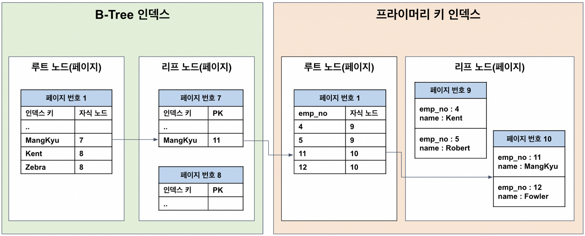

# Lock

### 시작하기 전에 트랜잭션이란
- 트랜잭션이란 데이터베이스의 상태를 변화시키기 위해 수행하는 작업 단위
- 트랜잭션은 데이터베이스 작업의 ACID를 보장하는 단위

<br>

#### 원자성 (Atomicity)
- 트랜잭션이 DB에 모두 반영되거나 혹은 반영되지 않아야 함
- 트랜잭션이 중간에 실패하면 그동안 수행된 모든 작업이 취소되고, 데이터베이스는 트랜잭션 이전의 상태로 복구됨
#### 일관성 (Consistency)
- 트랜잭션의 작업 처리 결과는 항상 일관성 있어야 함
- 데이터베이스의 제약 조건이나 규칙이 트랜잭션 전후에 모두 유효해야함
#### 독립성 (Isonlation)
- 동시에 실행되는 트랜잭션들은 서로 간섭하지 않아야함
    - 둘 이상의 트랜잭션이 동시에 병행 실행되고 있을 때, 어떤 트랜잭션도 다른 트랜잭션 연산에 끼어들 수 없음
    - 트랜잭션 메소드 안에 트랜잭션이 들어가면 둘다 실행됨
- 한 트랜잭션이 완료되기 전에 다른 트랜잭션의 결과를 볼 수 없도록 격리되어야 하며, 동시에 실행되더라도 순차적으로 실행된 것과 동일한 결과를 가져야함
#### 지속성 (Durability)
- 트랜잭션이 성공적으로 완료되었으면, 결과는 영구적으로 반영되어야 함
- 시스템 장애가 발생하더라도 그 결과는 보존되어야 함

<br>

#### transaction isolation level
- 트랜잭션 격리 수준에 따라 락의 사용이 결정됨
    - [트랜잭션 격리 수준 정리 링크](https://github.com/InJun2/TIL/blob/main/CS-topic/DB/transaction-isolation-level.md)
- Repeatable Read 이상의 격리 수준에서는 읽기 작업 시 Read-Lock을 사용하여, 트랜잭션이 데이터를 여러 번 읽더라도 일관된 데이터를 읽을 수 있도록 함
- Read Committed 격리 수준에서는 쓰기 작업 시 Write-Lock을 사용하여, 다른 트랜잭션이 데이터를 읽거나 수정하지 못하게 함
- 락의 범위는 데이터베이스 엔진에 따라 다름
    - 일부 데이터베이스 시스템은 행 단위로 락을 걸 수 있는 반면, 다른 시스템은 페이지 또는 테이블 단위로 락을 걸 수도 있음

<br>

| **DBMS**       | **Read Uncommitted** | **Read Committed** | **Repeatable Read** | **Serializable** | **기본 격리 수준**        |
|----------------|----------------------|--------------------|---------------------|------------------|---------------------------|
| **Oracle**     | ✘                    | ✔                  | ✘                   | ✔                | Read Committed            |
| **MySQL**      | ✔                    | ✔                  | ✔                   | ✔                | Repeatable Read           |
| **PostgreSQL** | ✘                    | ✔                  | ✔*                  | ✔                | Read Committed            |

>- PostgreSQL의 Repeatable Read는 Serializable과 유사하게 동작하여 다르게 표시하였음

<br>

### 트랜잭션과 Lock 과의 관계
- 트랜잭션의 데이터 일관성을 보장하는 정도는 트랜잭션 격리수준에 따라 구성이됨
- 그런데 이러한 동시에 여러 트랜잭션이 접근하였을때 트랜잭션 격리수준에 맞는 데이터 일관성을 보장하는 방법 중 하나가 락일 뿐
    - 트랜잭션 격리 수준은 여러 트랜잭션에 대해 각 트랜잭션들을 어떻게 처리할지에 대한 전략
    - 동시성 제어 방법 중 하나가 락 ( Lock ⊂ 트랜잭션 격리 수준 )

<br>

### 병행 제어 ( Concurrency Controll )
- Concurrency Controll 이란 데이터 베이스 시스템 또는 다중 사용자 환경에서 여러 트랜잭션이 동시에 실행될 때의 데이터의 일관성 유지 및 무결성 보장을 위한 매커니즘
- 여러 사용자가 동일한 데이터에 접근하고 수정하는 상황에서 데이터가 정확하고 일관성있게 유지될 수 있도록 함
- 해당 병행 제어를 하기 위해 트랜잭션을 통한 DB 락, 라이브러리 락을 사용함

<br>

### 락 전략

#### 낙관적 락 (Optimistic Lock)
- 데이터에 대한 충돌이 거의 발생하지 않을 것이라고 가정하는 방식으로 애플리케이션 락이라고도 부름
    - 비관적 락 보다 성능이 중요한 경우 애플리케이션 레벨에서 사용
    - 애플리케이션 내에서 버전을 통해서 락을 구현하고 관리할 수 있어서
- 트랜잭션이 데이터를 읽고 난 후, 다른 트랜잭션이 해당 데이터를 변경하지 않았다고 가정하고 작업을 진행
    - 낙관적 락은 사실 실제적인 락을 거는 것이 아닌 변경 여부를 감지하는 메커니즘
- 커밋하기 전에 데이터가 변경되었는지를 확인하여, 변경이 발생했다면 트랜잭션을 롤백하거나 재시도
- 데이터 충돌이 거의 발생하지 않는 경우에 적합하고 주로 버전 관리(Version Control) 시스템에서 사용
    - MySQL 에서는 직접적으로 지원하지 않지만 'version' 필드를 사용하여 구현할 수 있다고 함
    - JPA 에서도 @Version 어노테이션을 통해 버전 필드를 추가하여 낙관적 락을 구현할 수 있음

```sql
-- 1. 데이터 조회
SELECT id, name, version
FROM my_table
WHERE id = 1;

-- 2. 데이터 수정 시 버전 검증 후 업데이트
UPDATE my_table
SET name = 'new_name', version = version + 1
WHERE id = 1 AND version = 5;

-- 3. 만약 업데이트가 실패했다면(버전이 맞지 않다면) 롤백 또는 재시도
```

```java
@Entity
public class Product {
    @Id
    @GeneratedValue(strategy = GenerationType.IDENTITY)
    private Long id;

    private String name;

    @Version
    private int version; // 버전 필드
}
```

<br>

#### 비관적 락 (Pessimistic Lock)
- 비관적 락은 데이터에 대한 충돌이 발생할 가능성이 높다고 가정하는 방식으로 데이터베이스 트랜잭션 Lock 이라고도 부름
- 데이터를 읽는 순간 다른 트랜잭션이 해당 데이터에 접근하지 못하도록 락을 걸어 충돌을 방지
    - 즉 실제적으로 락을 거는 것이 비관적 락이고 아래의 배타 락, 공유 락이 비관적 락 안에 포함되는 개념 ( 배타/공유 락 ⊂ 비관적 락 )
- 다른 트랜잭션이 락이 해제되기를 기다려야 하므로, 동시성 처리가 제한될 수 있음
- 데이터 충돌이 자주 일어나고, 데이터 일관성이 중요한 시스템에서 사용됨
- 데이터베이스의 경우, 테이블 락 또는 레코드 락을 사용하여 비관적 락을 구현
    - MySQL 에서 비관적 락은 'SELECT ... FOR UPDATE' 또는 'LOCK IN SHARE MODE'를 사용하여 구현
    - JPA 에서는 @Lock 어노테이션을 통해 비관적 락을 구현할 수 있음

```java
@Lock(LockModeType.PESSIMISTIC_WRITE)
@Query("SELECT p FROM Product p WHERE p.id = :id")
Optional<Product> findProductForUpdate(@Param("id") Long id);

/*
1. LockModeType.PESSIMISTIC_READ : 데이터 읽기 시에 공유 락을 설정. 른 트랜잭션이 동일한 데이터를 읽을 수 있지만, 수정할 수 없음
2. LockModeType.PESSIMISTIC_WRITE : 데이터 읽기와 동시에 쓰기 락을 설정. 다른 트랜잭션이 동일한 데이터를 읽거나 수정하지 못하게 함
3. LockModeType.PESSIMISTIC_FORCE_INCREMENT : 쓰기 락을 걸면서, 버전 필드(@Version으로 지정된 필드)를 강제로 증가. 주로 동시에 여러 트랜잭션이 발생할 때, 버전 관리를 강화하기 위해 사용
*/
```

<br>

### 비관적 락의 배타 락과 공유 락

#### write-lock (exclusive lock)
- 배타 락은 특정 리소스(예: 데이터베이스 행 또는 테이블)에 대해 독점적인 접근 권한을 부여하는 락임
    - 데이터베이스 시스템에서 배타 락은 UPDATE, DELETE 등의 쓰기 연산에서 사용되며, 다른 트랜잭션이 해당 데이터에 접근하지 못하도록 막음
- read/write 할 때 사용되어 다른 트랜잭션이 같은 데이터를 read/write 하는 것을 허용하지 않음
    - 읽기, 쓰기 모두 허용하지 않음
- 이 락이 걸리면 읽기와 쓰기 모두 허용되지 않음
- MySQL 에서 'UPDATE', 'DELETE' 명령어는 자동으로 배타 락을 걸어주며 특정 상황에서는 위와 같이 FOR UPDATE 처럼 배타 락을 걸 수 있음
    - 해당 키워드로 'SELECT' 도 배타 락을 걸 수 있음

```sql
-- 1. 특정 행에 대해 배타 락을 걸어 읽기
SELECT * FROM my_table
WHERE id = 1
FOR UPDATE;

-- 2. 이 락이 걸려 있는 동안 다른 트랜잭션은 이 행을 읽거나 수정할 수 없음
```

#### read-lock (shared lock)
- 공유 락은 특정 리소스(예: 데이터베이스 행 또는 테이블)에 대해 여러 트랜잭션이 동시에 접근할 수 있도록 하는 락임
- 여러 트랜잭션이 동시에 읽기 작업을 수행할 수 있지만, 쓰기 작업을 수행하려면 공유 락이 해제되어야 함
- read 할 때 사용되며 다른 트랜잭션이 같은 데이터를 read 하는 것을 허용
    - 읽기는 허용, 쓰기는 차단하여 변경을 막음
- 이 락이 걸린 상태에서 다른 트랜잭션도 동일한 데이터를 읽을 수 있음
- 데이터베이스 시스템에서 SELECT 쿼리에 의해 데이터가 읽히는 동안 공유 락이 걸릴 수 있으며, 그동안 다른 트랜잭션이 해당 데이터를 쓰지 못하게 함
- MySQL 는 'SELECT ... LOCK IN SHARE MODE'를 사용하여 공유락을 걸 수 있음

```sql
-- 1. 특정 행에 대해 공유 락을 걸어 읽기
SELECT * FROM my_table
WHERE id = 1
LOCK IN SHARE MODE;

-- 2. 이 락이 걸린 상태에서 다른 트랜잭션은 이 행을 읽을 수 있지만, 수정할 수는 없음
-- 만약 다른 트랜잭션이 이 행을 수정하려고 하면 락이 해제될 때까지 기다려야 함
```

<br>

### MVCC (Multiversion concurrency control)
- MVCC는 commit 된 데이터만 읽으므로 다른 트랜잭션이 값을 변경하던 중 커밋을 하지 않았다면 다른 트랜잭션은 변경 전 값을 읽음
    - MVCC는 데이터베이스에서 트랜잭션이 데이터를 읽을 때, 데이터의 과거 버전을 읽도록 하여 락을 걸지 않고도 데이터의 일관성을 유지
    - 각 트랜잭션은 독립적으로 트랜잭션이 시작된 시점의 데이터를 스탭샷으로 생성하고 읽음
- 데이터를 읽을 때 특정 시점을 기준으로 가장 최근의 commit된 데이터를 읽음
    - 데이터의 이전 버전을 유지하여 트랜잭션이 요청한 시점의 데이터를 정확하게 반환가능. 데이터의 일관성 유지
    - consistent read (일관된 읽기) : 트랜잭션이 시작된 이후에 다른 트랜잭션이 데이터를 변경하고 커밋하더라도, 현재 트랜잭션은 이를 보지 않고 트랜잭션이 시작될 때의 데이터를 계속 읽음
- 데이터 변화(write) 이력을 관리
- read와 write는 서로를 block 하지 않음
    - 읽기 작업은 데이터의 기존 버전을 참조하고, 쓰기 작업은 새로운 버전을 생성하므로, 트랜잭션 간의 락 경쟁이 줄어듬
    - MVCC는 락을 사용하지 않고 데이터의 일관성을 보장하는 방법
- MySQL InnoDB와 postgreSQL 에서 사용됨
- 모든 트랜잭션이 완료될 때까지 여러 버전을 유지해야하므로 추가적인 스토리지가 필요할 수 있고 데이터베이스가 오래된 데이터 버전을 정리하는 Garbage Collection 메커니즘 필요
- MVCC와 낙관적 락의 차이점은 다음과 같음
    - 낙관적 락은 애플리케이션 수준에서 동작하고 MVCC는 데이터베이스의 트랜잭션 수준에서 동작
    - 낙관적 락은 커밋 시점에 충돌을 감지하여 롤백하거나 재시도하지만 MVCC는 충돌을 회피하기 위해 처음부터 다른 트랜잭션이 영향을 미치지 않도록 각 트랜잭션이 독립된 데이터를 읽음

<br>

### MySQL 에서의 범위별 락

1. 글로벌 락 (Global Lock)
- 데이터베이스 서버 전체를 잠그기 위해 사용
- 데이터베이스 백업 시 일관된 상태를 유지하기 위해 사용될 수 있음
- 모든 데이터베이스와 모든 테이블을 읽기 전용 모드로 전환하여 서버 전체에 걸쳐 새로운 쓰기 작업이 불가능해짐

<br>

2. 테이블 락 (Table Lock)
- 특정 테이블에 대한 읽기 또는 쓰기 작업을 제어하기 위해 사용
- 임의로 사용하면 안되며 MySQL 내부적으로 잠금을 동작
    - DDL은 사용하면 안되며 DML은 임의로 사용이 가능함
- 데이터 이동이나 특정 테이블에 대한 원자적 작업 수행 시 사용
- 특정 테이블에만 적용되어 읽기 잠금은 다른 세션이 해당 테이블을 읽을 수 있게 하지만, 쓰기 잠금은 모든 세션에서 해당 테이블에 대한 읽기 및 쓰기를 차단

<br>




<br>

3. 레코드 락 (Record Lock)
- 특정 행에 대한 쓰기 작업을 제어하기 위해 사용됩
    - 레코드를 잠그는 것이 아니라 인덱스를 잠그고 인덱스가 없다면 클러스터드 인덱스를 만들어 잠금을 진행
- 트랜잭션이 특정 행을 업데이트하거나 삭제할 때, 해당 행에 대한 다른 트랜잭션의 접근을 제어하기 위해 사용
- 단일 행에 적용되어 다른 트랜잭션이 같은 행을 수정하지 못하게 함
- 규모가 좁아 높은 동시성을 지원하며, 충돌 가능성을 줄이기 위해 세밀한 잠금을 제공함

<br>

```
레코드 락은 MySQL 스토리지 엔진에서 사용하는 잠금 메커니즘
- 인덱스를 기반으로 작동하며, 인덱스를 통해 특정 레코드에 대한 잠금을 설정하여 다른 트랜잭션이 이 레코드를 동시에 수정하거나 삭제하지 못하도록 함
- 레코드 락은 특정 행을 잠그는 것이 아니라, 그 행을 식별하는 인덱스 엔트리를 잠금
- 클러스터드 인덱스는 테이블의 실제 데이터(물리 테이블)가 인덱스 순서에 따라 저장되는 인덱스로 InnoDB 에서는 자동으로 Primary Key가 클러스터드 인덱스를 생성하고 주로 해당 인덱스가 잠기는 것 (논리 테이블 인덱스도 잠글 수 있음)
- 만약 테이블에 명시적인 Primary Key가 없으면, InnoDB는 내부적으로 암시적인 Primary Key(예: 내부적인 순차 번호)를 생성하여 클러스터드 인덱스로 사용함

인덱스 사용 없이 특정 레코드를 변경/삭제 하면 발생하는 문제
- 인덱스 잠금은 검색을 수행한 인덱스를 잠그고나서 테이블의 레코드를 잠그는 방식으로 구현되어 있음 (자동 인덱스 잠금)
- 수정/삭제도 해당 레코드에 대해 접근하므로 인덱스로 접근을 시도함
- Update, Delete 문장이 실행될 때 테이블에 적절히 사용할 수 있는 인덱스가 없으면 불필요하게 많은 레코드나 모든 레코드를 잠글 수도 있음 (풀 테이블 스캔)
- 우선 레코드를 찾기위해 인덱스를 찾는데 InnoDB는 이러한 인덱스를 먼저 잠그고 레코드를 잠그며 이후 동작함
- 그런데 인덱스가 존재하지 않거나 적절하지 않다면 레코드를 찾기 위한 모든 레코드를 차례대로 스캔하기 때문에 해당 경우에서 스캔되는 레코드에 대해서도 잠금을 획득해야하므로 해당 테이블에 잠금이 발생함
```

<br>

4. 네임드 락 (Named Lock)
- 사용자가 정의한 임의의 리소스에 대한 잠금을 제공하기 위해 사용
- 분산 환경에서 특정 리소스를 보호하거나 사용자 정의 동기화 메커니즘을 구현할 때 사용됨
- 사용자 정의 잠금 이름에 대해 적용되어 같은 이름의 잠금에 대해서만 영향을 끼침
- 다른 잠금 메커니즘과 독립적으로 작동하며, 특정 리소스나 작업을 보호하기 위해 유연하게 사용할 수 있음

```sql
-- 1. 네임드 락을 획득 시도
-- 'my_lock'이라는 이름의 네임드 락을 얻는다. 만약 다른 세션에서 동일한 이름의 락을 이미 가지고 있다면, 이 쿼리는 해당 락이 해제될 때까지 대기한다.
-- 10초 동안 락을 획득하지 못한다면 쿼리가 실패함
SELECT GET_LOCK('my_lock', 10);

-- 2. 락을 획득한 후 원하는 작업 수행
-- 락이 성공적으로 획득되었을 때만 작업을 수행한다.
-- 여기서는 예를 들어, 특정 테이블에 데이터를 삽입하는 작업을 수행할 수 있다.
INSERT INTO my_table (name, value) VALUES ('example', 123);

-- 3. 작업이 완료되면 네임드 락 해제
-- 'my_lock'이라는 이름의 락을 해제한다. 다른 세션이 이 락을 사용할 수 있게 된다.
SELECT RELEASE_LOCK('my_lock');
```

<br>

5. 메타 데이터 락 (Metadata Lock)
- 테이블의 구조나 메타데이터를 변경할 때 데이터의 일관성을 보장하기 위해 사용
- 테이블 구조 변경(예: ALTER TABLE), 인덱스 추가, 테이블 삭제 등의 작업 시 사용됨
- 특정 테이블의 메타데이터에 대해 적용되어 메타데이터가 변경되는 동안 다른 세션이 해당 테이블에 접근하지 못하게 함
- MySQL 내부적으로 관리되는 잠금으로, 테이블의 스키마 변경 작업을 보호함
    - 일반적으로 사용자가 직접 제어하지는 않음

<br>

#### 기타 락
- 갭 락과 넥스트 키 락은 둘다 팬텀 리드와 같은 문제를 방지하기 위해 사용됨
- 갭 락과 넥스트 키 락의 동작 방식은 SQL 쿼리에서 사용하는 락 모드에 따라 다르고 InnoDB 스토리지 엔진의 특정한 동작 방식에 의해 결정되며 SQL 쿼리에서 명시적으로 지정되는 것은 아님
    - 갭 락과 넥스트 키락 모두 일반적으로 FOR UPDATE나 LOCK IN SHARE MODE와 같은 SQL 구문이 실행될 때 사용되며 InnoDB에 의해 결정됨
    - 기본적으로는 넥스트 키 락을 사용하며 주로 트랜잭션의 격리 수준이 REPEATABLE READ이면서, 범위 기반 검색 쿼리가 실행될 때 자동으로 갭락이 적용됨

<br>


<br>

6. 갭 락 (Gap Lock)
- 인덱스 레코드 사이의 간격에 대한 잠금
- InnoDB에서 다른 트랜잭션이 아직 존재하지 않는 레코드 간의 간격 (gap)을 잠그는 락으로 주로 범위 기반의 검색 쿼리에서 사용
    - 즉, 해당 사이를 잠궈두어 트랜잭션 중 새로운 레코드의 삽입을 제한하여 팬텀리드를 방지함
- 갭 락은 주로 트랜잭션의 격리 수준이 REPEATABLE READ이면서, 범위 기반 검색 쿼리가 실행될 때 자동으로 적용됨
- 다른 트랜잭션이 해당 범위에 새로운 레코드를 삽입하지 못하도록 함
- 팬텀 읽기를 방지하기 위한 잠금

<br>


7. 넥스트 키 락 (Next-Key Lock)
- 레코드와 인접한 간격을 잠그는 락으로 갭락과 레코드 락을 결합한 잠금 메커니즘
    - 레코드 락은 인덱스에서 특정 레코드 자체를 잠그는 것이고, 갭 락은 인덱스 사이의 간격(갭)을 잠그는 것
- 갭 락을 보완하기 위해 사용되는 락으로, 범위 기반의 검색 쿼리에서 범위의 끝에 해당하는 키 다음에 오는 레코드를 잠그는 락으로 갭락보다 정밀한 잠금을 제공
    - 갭 락이 보호하지 못하는 트랜잭션의 범위 끝 다음의 키 값에 해당하는 레코드에 대한 접근을 제한하기 위해 사용
    - 인덱스에서 트랜잭션이 접근하려는 키 값 다음에 오는 레코드를 잠그는 것임
- 트랜잭션 간의 격리 수준을 유지하면서 다른 트랜잭션이 레코드를 삽입하거나 수정하는 것을 방지
- 넥스트 키 락은 InnoDB가 기본적으로 사용하는 잠금 메커니즘
- 팬텀 읽기를 방지하기 위한 잠금

```
현재 테이블에 10, 20, 30인 인덱스가 존재하고 해당 기준에서의 갭 락과 넥스트 키 락

- 현재 갭 락의 기준이 10 ~ 30 일 때 트랜잭션 진행 중 해당 사이에 들어오는 인덱스 삽입을 막음
- 하지만 기존에 있던 10, 20, 30 인덱스들을 수정을 막지 못함
- 넥스트 키 락의 기준이 10 ~ 30 일 때는 갭 락의 기능과 함께 기존 인덱스의 수정도 막을 수 있음
```

<br>

### 분산 락 ( Distributed Lock )
- 분산 시스템에서 여러 프로세스나 노드가 공유 자원에 동시에 접근하지 않도록 보장하는 메커니즘
- 낙관적 락과 비관적 락은 트랜잭션 레벨에서 병행 제어의 전략 중 하나인 것이고, 분산락은 여러 서버나 노드가 있는 환경에서의 병행 제어 전략이다. 이 락들은 모두 데이터 무결성과 동시성 제어를 위해 사용됨
    - 즉, 분산 락과 낙관적 락, 비관적 락은 모두 동시성 제어와 데이터 무결성을 목표로 하지만, 적용되는 범위와 환경이 다름
    - 낙관적 락, 비관적 락 : 트랜젝션 레벨에서 데이터 베이스의 병행 제어를 위해 사용됨
    - 분산 락 : 분산 시스템에서 자원에 대한 동시성 제어와 데이터 무결성을 위해 사용됨
- 주로 분산 데이터베이스, 분산 캐시, 분산 파일 시스템 등에서 사용됨

<br>

| **락 전략**       | **적용 환경**                  | **특징**                                                      | **사용 예시**                                                  |
|-------------------|--------------------------------|---------------------------------------------------------------|--------------------------------------------------------------|
| **낙관적 락**      | 단일 시스템                    | - 충돌 가능성이 낮은 경우 적합<br>- 락을 사용하지 않고 충돌을 감지  | - 웹 애플리케이션에서 주로 읽기 작업이 많을 때<br>- 버전 관리 시스템에서 파일 충돌 방지  |
| **비관적 락**      | 단일 시스템                    | - 충돌 가능성이 높은 경우 적합<br>- 데이터를 읽는 즉시 락을 걸어 충돌 방지 | - 은행 시스템에서 계좌 잔액 갱신<br>- 재고 관리 시스템에서 재고 수량 갱신              |
| **분산 락**        | 분산 시스템                    | - 여러 노드가 자원에 접근할 때 동시성 제어<br>- 데이터 일관성 보장     | - 마이크로서비스 아키텍처에서 분산 캐시 접근<br>- 분산 데이터베이스에서 데이터 일관성 유지  |


<br>

### 스프링에서의 특정 객체에 거는 락과 DB 락의 차이
- 둘다 동시성 제어를 위해 사용되지만 그 목적과 작동 방식이 다름

#### 1. 스프링에서의 특정 객체, 스레드 락
- 멀티스레딩 환경에서 동일한 객체에 대해 여러 스레드가 동시에 접근하는 것을 방지하여 데이터 일관성을 유지하고 동시성 문제를 해결
- 주로 애플리케이션 내에서 메모리 상태를 보호하는 데 사용됨
- 주로 Synchronized, ReentrantLock, ConcurrentAPI 를 사용하여 락을 사용

#### 2. DB에서의 락
- 데이터베이스에서 동시성 제어를 통해 여러 트랜잭션이 동시에 동일한 데이터를 읽거나 쓰는 경우 데이터의 일관성을 유지하고 경쟁 조건을 방지
- 주로 트랜잭션 처리 중 데이터베이스 상태를 보호하는 데 사용
- 주로 낙관적 락, 비관적 락을 통해 사용

| **특징**          | **스프링에서의 특정 객체 락**                    | **DB 락**                                            |
|-------------------|-------------------------------------------------|-----------------------------------------------------|
| **목적**          | 멀티스레딩 환경에서 객체의 동시 접근 방지         | 트랜잭션 간 데이터베이스의 동시 접근 방지             |
| **사용 방법**     | `synchronized`, `ReentrantLock`                  | 낙관적 락 (`@Version`), 비관적 락 (`@Lock`)           |
| **스코프**        | 애플리케이션 내부의 특정 객체 및 메모리 상태     | 데이터베이스 테이블, 행 등                           |
| **락의 범위**     | JVM 내에서만 유효                                 | 데이터베이스 전체에 걸쳐 유효                         |
| **멀티 노드 환경**| 별도 구현 필요                                    | 데이터베이스에서 자동 관리                           |

<br>

### 분산 환경에서 데이터베이스에 접근할 때 서버에서 애플리케이션 락을 사용하는게 좋은지 데이터베이스 락을 거는게 좋은지 판단 기준

#### 1, 데이터베이스 락
- 강력한 일관성을 보장해야 하는 경우에 적합. 트랜잭션의 격리 수준을 통해 일관성을 엄격히 관리
- 데이터가 중요한 경우(예: 금융 거래, 재고 관리) 사용
- 모든 데이터베이스 접근에 대해 일관된 락 관리가 필요할 때 사용
- 데이터베이스 자체에서 자동으로 트랜잭션 관리와 락 관리가 이루어지므로, 추가적인 중앙 관리 도구가 필요하지 않음
- 성능에 영향을 줄 수 있음. 트랜잭션이 증가하면 데이터베이스 락은 병목 현상을 유발할 수 있음

<br>

#### 2. 애플리케이션 락
- 특정 애플리케이션 내에서만 일관성을 유지하면 되는 경우에 사용
    - 애플리케이션 내 특정 리소스(객체, 메서드, 스레드 등)에 대한 접근 제어에 적합
    - 애플리케이션 락은 고성능 시스템에서 데이터베이스 락의 병목 현상을 방지하고, 분산 환경에서 데이터 일관성을 보장하기 위해 사용됨
- 분산 환경에서 확장성을 유지하면서도 성능을 최적화할 수 있음. 애플리케이션 락은 일반적으로 데이터베이스 락보다 가벼움
- 애플리케이션 레벨에서의 동기화가 필요할 때 유용하지만, 분산 환경에서는 여러 인스턴스 간의 동기화 문제가 발생할 수 있지만 중앙 집중식 락 관리 솔루션을 사용하여 확장성을 유지하면서 락을 관리할 수 있음
- 분산 환경에서는 락의 범위가 애플리케이션 인스턴스 내로 한정되므로, 데이터베이스 수준의 일관성을 보장하기 어려움

<br>

#### 정리
- 중앙 집중식 데이터베이스를 사용하는 경우 데이터베이스 락, 성능과 확장성이 필요한 경우 애플리케이션 락
- 여러 데이터베이스 서버를 사용하는 분산 데이터베이스 환경에서는 중앙에서 락을 관리해주는 애플리케이션 락이 필수적

<br>

## 개인적인 궁금증
### 1. 그렇다면 단일 서버 스프링 환경에서 분산락을 사용하는 이유는?
- 애플리케이션이 분산 환경으로 확장될 가능성이 있거나, 여러 인스턴스에서 동일한 자원에 접근해야 하는 경우가 생길 수 있다면, 분산락을 사용한는 것이 좋음
- 단일 서버더라도 분산락을 사용하는 이유는 여러 스레드가 동시에 자원에 접근해서 데이터 충돌이 빈번할 경우 사용
- Redis는 메모리 기반 데이터베이스로, 락을 설정하고 해제하는 작업이 매우 빠르게 수행되므로 락 작업이 자주 발생해도 시스템 성능에 큰 영향을 미치지 않음
    - 레디스도 애플리케이션 서버와 별도로 운영되는 다른 데이터베이스와 같으며 그저 디스크가 아닌 메모리에 저장하여 용량은 적지만 속도를 높이고 키-값 데이터베이스의 특징을 가짐 
- 락이 무한정 지속하는 것을 방지하기 위한 TTL (Time to Live)을 설정 할 수 있어 서버가 락을 획득하고 특정 시간 내에 작업을 완료하지 못하면 락이 자동으로 해제됨
- Redis는 중앙 집중식으로 락 상태를 관리하며, 모든 서버는 Redis를 통해 락을 요청하고 해제하므로 하나의 중앙화된 락 관리 시스템을 통해 다중 서버 간의 동시성을 유지할 수 있음
    - Redis를 사용하면 락 상태를 중앙에서 관리할 수 있어, 각 스레드가 자원에 접근하기 전에 Redis를 통해 락을 확인해야 하므로 여러 스레드에서 일관적인 데이터 일관성을 유지할 수 있음
    - 분산 환경에서는 모든 서버가 자원에 접근하기 전에 Redis를 통해 락을 획득하려고 시도하고 락을 획득한 서버만 자원에 접근할 수 있음
- 레디스는 기본적으로 동시성 제어를 자동으로 처리하지 않아 동시에 같은 키에 접근하면 데이터 충돌이 발생함. 이를 해결하기 위한 락 구현 방법은 두가지가 존재
    - Redis나 ZooKeeper를 사용한 락은 분산락이면서도 단일 서버 내 여러 스레드 간 동시성 문제도 해결할 수 있음 
    - SETNX 사용 락 : 'SETNX' (SET if Not Exists) 명령어를 사용하여 키가 존재하지 않을 때만 값을 설정하며 이를 통해 락을 획득할 수 있음. 락을 해제할 때는 'DEL' 명령어를 사용하여 락 키를 삭제함
    - Redlock 알고리즘 : Redlock은 다중 Redis 인스턴스를 사용해 특정 시간 동안 다수의 인스턴스에서 동시에 락을 획득함으로써, 더욱 견고한 락 메커니즘을 제공

<br>

#### Java Lettuce 'SETNX'

```java
import io.lettuce.core.RedisClient;
import io.lettuce.core.api.StatefulRedisConnection;
import io.lettuce.core.api.sync.RedisCommands;

/*
- acquireLock 함수는 주어진 시간 동안 SETNX 명령어를 사용해 락을 시도하며, 락을 획득하면 TTL(만료 시간)을 설정
- releaseLock 함수는 DEL 명령어를 사용해 락을 해제
- 이 예시에서 Lettuce를 사용해 Redis와 연결하고, 동기식 명령(sync())을 사용해 Redis 명령어를 실행
- 해당 'SETNX'는 Redis의 기본 제공 명령어로 키가 존재하지 않을 때만 값을 설정하는 방식으로 락을 구현하고 Redisson은 Redis를 사용하는 Java 라이브러리로 Redis의 락 기능을 더 쉽고 강력하게 사용하게 함
- Redisson은 분산 락, 블로킹 락, 공정 락, 읽기/쓰기 락 등 다양한 락 기능을 제공하며, 이러한 기능들은 모두 Redis를 기반으로 동작
*/
public class RedisLockExample {

    // RedisCommands는 Lettuce에서 동기 방식으로 Redis 명령어를 실행하기 위한 인터페이스
    // 이 인터페이스로 Redis 서버에 대한 다양한 명령어를 제공하며 Redis와 상호작용할 수 있음
    private final RedisCommands<String, String> commands;   
    private static final int LOCK_EXPIRE_TIME = 10;  // 락의 만료 시간(초)
    private static final int ACQUIRE_TIMEOUT = 10;   // 락을 획득하려는 최대 시도 시간(초)

    public RedisLockExample(String redisUri) {
        RedisClient redisClient = RedisClient.create(redisUri);
        StatefulRedisConnection<String, String> connection = redisClient.connect();
        this.commands = connection.sync();  // Lettuce는 동기 방식의 API(sync()), 비동기 방식의 API(async()), 반응형 API(reactive())를 제공함
    }

    // 락을 획득하는 함수
    public boolean acquireLock(String lockName) {
        String lockKey = "lock:" + lockName;
        long endTime = System.currentTimeMillis() + (ACQUIRE_TIMEOUT * 1000);

        while (System.currentTimeMillis() < endTime) {
            if (commands.setnx(lockKey, "1")) {
                // 락 획득 성공, 만료 시간 설정
                commands.expire(lockKey, LOCK_EXPIRE_TIME);
                return true;
            }

            // 락이 이미 설정되어 있지만, 만료 시간이 없는 경우 만료 시간 설정
            if (commands.ttl(lockKey) == -1) {
                commands.expire(lockKey, LOCK_EXPIRE_TIME);
            }

            try {
                // 잠시 대기 후 다시 시도
                Thread.sleep(10);
            } catch (InterruptedException e) {
                Thread.currentThread().interrupt();
            }
        }

        return false;  // 락 획득 실패
    }

    // 락을 해제하는 함수
    public void releaseLock(String lockName) {
        String lockKey = "lock:" + lockName;
        commands.del(lockKey);
    }

    public static void main(String[] args) {
        RedisLockExample redisLock = new RedisLockExample("redis://localhost:6379");

        if (redisLock.acquireLock("my_resource_lock")) {
            try {
                // 자원에 접근하는 작업 수행
                System.out.println("자원에 접근하여 작업을 수행합니다.");
            } finally {
                redisLock.releaseLock("my_resource_lock");
                System.out.println("락을 해제했습니다.");
            }
        } else {
            System.out.println("락을 획득하지 못했습니다.");
        }
    }
}
```

<br>

#### Redisson 라이브러리
- Redisson은 Lettuce 방식과는 다르게 스핀락 방식이 아니라 pub/sub 방식을 사용

```java
import org.redisson.Redisson;
import org.redisson.api.RLock;
import org.redisson.api.RedissonClient;
import org.redisson.config.Config;

public class RedissonExample {
    public static void main(String[] args) {
        // Redisson 설정
        Config config = new Config();
        config.useSingleServer().setAddress("redis://localhost:6379");

        // Redisson 클라이언트 생성
        RedissonClient redisson = Redisson.create(config);

        // 분산 락 획득
        RLock lock = redisson.getLock("my_resource_lock");
        lock.lock();  // 락 획득

        try {
            // 자원에 접근하는 작업 수행
            System.out.println("자원에 접근하여 작업을 수행합니다.");
        } finally {
            lock.unlock();  // 락 해제
            System.out.println("락을 해제했습니다.");
        }

        // Redisson 클라이언트 종료
        redisson.shutdown();
    }
}
```

<br>

#### Redlock

```java
import io.lettuce.core.RedisClient;
import io.lettuce.core.api.StatefulRedisConnection;
import io.lettuce.core.api.sync.RedisCommands;
import java.util.Arrays;
import java.util.List;
import java.util.UUID;

/*
- Redlock 알고리즘은 Redis 클러스터에서 다수의 노드에 락을 설정하고, 과반수 이상의 노드에서 락을 성공적으로 획득했을 때만 자원에 접근할 수 있도록 함
- acquireLock 함수는 주어진 시간 동안 여러 Redis 노드에 대해 락을 시도하며, 과반수 이상에서 락을 획득하면 성공으로 간주
- releaseLock 함수는 모든 Redis 노드에서 락을 해제
*/
public class RedisRedlockExample {

    private final List<RedisCommands<String, String>> redisNodes;
    private static final int LOCK_EXPIRE_TIME = 10;  // 락의 만료 시간(초)
    private static final int ACQUIRE_TIMEOUT = 10;   // 락을 획득하려는 최대 시도 시간(초)

    public RedisRedlockExample(List<String> redisUris) {
        RedisClient redisClient = RedisClient.create();
        redisNodes = redisUris.stream()
                .map(redisClient::connect)
                .map(StatefulRedisConnection::sync)
                .toList();
    }

    // Redlock 방식으로 락을 획득하는 함수
    public boolean acquireLock(String lockName) {
        String lockKey = "lock:" + lockName;
        String lockValue = UUID.randomUUID().toString();
        long endTime = System.currentTimeMillis() + (ACQUIRE_TIMEOUT * 1000);
        int lockCount = 0;

        while (System.currentTimeMillis() < endTime) {
            for (RedisCommands<String, String> commands : redisNodes) {
                if (commands.setnx(lockKey, lockValue)) {
                    commands.expire(lockKey, LOCK_EXPIRE_TIME);
                    lockCount++;
                }
            }

            // Majority of nodes have successfully locked
            if (lockCount >= (redisNodes.size() / 2) + 1) {
                return true;
            }

            // If not successful, sleep briefly and retry
            try {
                Thread.sleep(10);
            } catch (InterruptedException e) {
                Thread.currentThread().interrupt();
            }
        }

        // Lock acquisition failed, clean up
        for (RedisCommands<String, String> commands : redisNodes) {
            if (commands.get(lockKey).equals(lockValue)) {
                commands.del(lockKey);
            }
        }

        return false;
    }

    // Redlock 방식으로 락을 해제하는 함수
    public void releaseLock(String lockName) {
        String lockKey = "lock:" + lockName;

        for (RedisCommands<String, String> commands : redisNodes) {
            commands.del(lockKey);
        }
    }

    public static void main(String[] args) {
        List<String> redisUris = Arrays.asList("redis://localhost:6379", "redis://localhost:6380", "redis://localhost:6381");
        RedisRedlockExample redisLock = new RedisRedlockExample(redisUris);

        if (redisLock.acquireLock("my_resource_lock")) {
            try {
                // 자원에 접근하는 작업 수행
                System.out.println("자원에 접근하여 작업을 수행합니다.");
            } finally {
                redisLock.releaseLock("my_resource_lock");
                System.out.println("락을 해제했습니다.");
            }
        } else {
            System.out.println("락을 획득하지 못했습니다.");
        }
    }
}
```

<br>

### 2. Redis 클라이언트 종류
- Jedis
    - Java용 Redis 클라이언트 라이브러리로, Redis 명령어를 동기 방식으로 쉽게 실행할 수 있음
    - 간단하고 경량화된 API를 제공하며, Java 환경에서 Redis와의 통신을 쉽게 처리할 수 있음
- Lettuce
    - Java용 비동기 및 동기 클라이언트 라이브러리로, Redis 명령어를 동기적, 비동기적, 그리고 반응형 방식으로 실행할 수 있음
    - 고성능과 확장성을 제공하며, Redis 클러스터 환경에서도 효과적으로 동작
- Redisson
    - Java용 Redis 클라이언트 라이브러리로, 복잡한 데이터 구조, 분산 락, 그리고 다양한 고급 기능을 쉽게 사용할 수 있도록 도와줌
    - 하지만 Lettuce나 Jedis와는 다르게 독립적인 Redis 클라이언트 라이브러리로, Jedis나 Lettuce 위에서 동작하지 않음
    - Redisson은 Lettuce 방식과는 다르게 스핀락 방식이 아니라 pub/sub 방식을 사용하기 때문에 Redis에 가는부하를 최대한 줄일 수 있음
    - Redisson은 Redis의 다양한 기능을 추상화하여 쉽게 사용할 수 있는 API를 제공
- StackExchange.Redis
    - .NET용 Redis 클라이언트 라이브러리로, 성능과 안정성이 뛰어남
- Node-redis
    - Node.js용 Redis 클라이언트 라이브러리로, Node.js 환경에서 Redis와의 비동기 통신을 처리할 수 있음

<br>

### 3. MongoDB vs Redis
- MongoDB와 Redis는 모두 NoSQL 데이터베이스이지만 특징이 다름

#### MongoDB
- 문서 지향 데이터베이스로, JSON과 유사한 BSON 형식으로 데이터를 저장
- 관계형 데이터베이스의 대체로 사용되며, 대규모의 비정형 데이터를 저장하고 조회하는 데 적합
- 복잡한 쿼리, 인덱스, 집계 작업을 지원하며, 데이터의 구조화된 저장과 검색에 강점

<br>

#### Redis
- 키-값 저장소로, 데이터를 메모리에 저장하여 매우 빠른 성능을 제공
- 주로 캐싱, 세션 관리, 실시간 데이터 분석 등에 사용되며, 단순한 데이터 구조를 고속으로 처리하는 데 적합
- 다양한 데이터 구조(리스트, 셋, 해시 등)를 지원하지만, MongoDB처럼 복잡한 쿼리나 데이터 모델링에는 적합하지 않음

<br>

| **특징/DBMS**       | **Redis**                                 | **MongoDB**                         |
|---------------------|-------------------------------------------|-------------------------------------|
| **데이터베이스 유형** | NoSQL (인메모리 데이터베이스)              | NoSQL (문서 지향 데이터베이스)       |
| **데이터 저장 방식** | 메모리 기반 (디스크에 스냅샷 저장 가능)     | 디스크 기반                          |
| **주요 특징**       | - 매우 빠른 성능<br> - 실시간 데이터 처리   | - 유연한 스키마<br> - JSON 유사 데이터 저장 |
| **용량**             | 주로 작은 용량 (메모리 제한)                | 대용량 데이터 처리 가능               |
| **속도**             | 매우 빠름 (메모리 기반)                     | 빠름 (인덱스 최적화 가능)             |
| **확장성**           | 수평적 확장 지원 (클러스터링 가능)          | 수평적 확장 지원 (샤딩 가능)          |
| **사용 사례**       | - 캐싱<br> - 세션 관리<br> - 실시간 분석    | - 빅데이터 처리<br> - 분석 플랫폼    |

<br>

### 4. MySQL vs PostgreSQL
- MySQL과 PostgreSQL은 대표적인 오픈 소스 관계형 데이터베이스 관리 시스템(RDBMS)

#### MySQL
- 널리 사용되는 RDBMS로, 성능 최적화와 쉬운 설정을 중점으로 설계
- 복잡한 트랜잭션 및 격리 수준 지원에서 PostgreSQL보다는 약할 수 있지만, 대규모 읽기 중심의 작업에 적합

#### PostgreSQL
- 고급 기능과 표준 준수에 중점을 둔 RDBMS로, 복잡한 쿼리, 트랜잭션 처리, 그리고 데이터 무결성 보장이 필요한 애플리케이션에 적합
- 확장 가능하고 플러그인 지원이 강력하며, 다양한 데이터 타입과 인덱스를 지원
- JSON 데이터 타입 지원, 트랜잭션 격리 수준 등이 뛰어나며, 복잡한 데이터 처리에 강점이 있음

<br>

| **특징/DBMS**       | **MySQL**                           | **PostgreSQL**                      |
|---------------------|-------------------------------------|-------------------------------------|
| **데이터베이스 유형** | RDBMS                               | RDBMS                               |
| **데이터 저장 방식** | 디스크 기반                           | 디스크 기반                           |
| **주요 특징**       | - 높은 읽기 성능<br> - 쉬운 설정과 사용 | - 고급 트랜잭션 관리<br> - 표준 준수     |
| **용량**             | 대용량 데이터 저장 가능                  | 대용량 데이터 저장 가능                  |
| **속도**             | 빠름                                  | 상대적으로 느림 (복잡한 쿼리 처리 가능)   |
| **사용 사례**       | - 웹 애플리케이션<br> - CMS 등         | - 금융 시스템<br> - 복잡한 트랜잭션 관리  |

<br>

## Ssafy Wizards CS Study

### 1. Optimistic Lock/Pessimistic Lock에 대해 설명해 주세요.

#### 낙관적 락 (Optimistic Lock)
- 데이터에 대한 충돌이 거의 발생하지 않을 것이라고 가정하는 방식으로 애플리케이션 락이라고도 부름
    - 비관적 락 보다 성능이 중요한 경우 애플리케이션 레벨에서 사용
    - 애플리케이션 내에서 버전을 통해서 락을 구현하고 관리할 수 있어서
- 트랜잭션이 데이터를 읽고 난 후, 다른 트랜잭션이 해당 데이터를 변경하지 않았다고 가정하고 작업을 진행
    - 낙관적 락은 사실 실제적인 락을 거는 것이 아닌 변경 여부를 감지하는 메커니즘
- 커밋하기 전에 데이터가 변경되었는지를 확인하여, 변경이 발생했다면 트랜잭션을 롤백하거나 재시도
- 데이터 충돌이 거의 발생하지 않는 경우에 적합하고 주로 버전 관리(Version Control) 시스템에서 사용

<br>

#### 비관적 락 (Pessimistic Lock)
- 비관적 락은 데이터에 대한 충돌이 발생할 가능성이 높다고 가정하는 방식으로 데이터베이스 트랜잭션 Lock 이라고도 부름
- 데이터를 읽는 순간 다른 트랜잭션이 해당 데이터에 접근하지 못하도록 락을 걸어 충돌을 방지
    - 즉 실제적으로 락을 거는 것이 비관적 락이고 아래의 배타 락, 공유 락이 비관적 락 안에 포함되는 개념 ( 배타/공유 락 ⊂ 비관적 락 )
- 다른 트랜잭션이 락이 해제되기를 기다려야 하므로, 동시성 처리가 제한될 수 있음
- 데이터 충돌이 자주 일어나고, 데이터 일관성이 중요한 시스템에서 사용됨
- 데이터베이스의 경우, 테이블 락 또는 레코드 락을 사용하여 비관적 락을 구현

<br>

### 2. 물리적인 Lock을 건다면, 만약 이를 수행중인 요청에 문제가 생겨 비정상 종료되면 Lock이 절대 해제되지 않는 문제가 생길 수도 있을 것 같습니다. DB는 이를 위한 해결책이 있나요? 없다면, 우리가 이 문제를 해결할 수 없을까요?
- 데드락이 발생할 수도 있는데 대부분의 현대적인 DBMS는 데드락을 자동으로 감지하는 기능을 제공함
- 데드락이 감지되면, DBMS는 일반적으로 가장 적은 리소스를 사용한 트랜잭션 또는 가장 오래된 트랜잭션을 롤백하여 데드락을 해소
- DBMS에서 락에 대한 타임아웃을 설정할 수 있음. 일정 시간이 지나면 트랜잭션이 자동으로 롤백되며, 이에 따라 락이 해제
- 트랜잭션이 비정상적으로 종료되거나 클라이언트와의 연결이 끊어진 경우, DBMS는 해당 트랜잭션을 자동으로 롤백하고 이 과정에서 모든 락이 해제됨

<br>

### Reference
- https://www.youtube.com/watch?v=0PScmeO3Fig
- https://www.youtube.com/watch?v=EBBS_giQ4AM
- https://minwoo-it-factory.tistory.com/entry/Lock-정리낙관적-락과-비관적-락-분산락-데드락-및-활용까지
- https://keylog.tistory.com/entry/동시성-이슈-해결방법-Synchronized-DB-Lock-Redis-Lock
- https://velog.io/@hyojhand/named-lock-distributed-lock-with-redis
- https://6161990src.tistory.com/146
- https://mangkyu.tistory.com/298
- https://velog.io/@kylekim2123/MySQL의-잠금Lock에-관하여
- https://cl8d.tistory.com/109
