# 정규화 (Normalization)

### 정규화란?
- 정규화는 이상현상이 있는 릴레이션을 분해하여 이상현상을 없애는 과정
- 데이터의 중복을 줄이고 데이터 무결성을 개선하기 위해 정규화를 사용함
- 이상현상이 존재하는 릴레이션을 분해하여 여러 개의 릴레이션을 생성하게 됨
- 이를 단계별로 구분하여 정규형이 높아질수록 이상현상은 줄어들게 됨
- 정규화는 1NF, 2NF, 3NF, BCNF, 4NF, 5NF가 존재
- 보통 정규화는 속도나 용량 문제에서 3NF 혹은 BCNF 까지만 하는 경우가 많다고 함
```
릴레이션(relation)
- 주로 테이블과 같은 의미로 사용되며 데이터의 집합을 의미
- 튜플과 속성으로 구성되어 있음

이상 현상(Anomaly)
- 삽입 이상(Insertion Anomaly) : 튜플 삽입 시 특정 속성에 해당하는 값이 없어 NULL을 입력해야 하는 현상
- 삭제 이상(Deletion Anomaly) : 튜플 삭제 시 같이 저장된 다른 정보까지 연쇄적으로 삭제되는 현상
- 갱신 이상(Update Anomaly) : 튜플 갱신 시 중복된 데이터의 일부만 갱신되어 일어나는 데이터 불일치 현상 

함수 종속성(Functional Dependency)
- DB에서 속성들간 종속 관계
- 테이블 필드의 종속 관계를 알아야 불필요한 데이터 중복을 줄이고 더욱 논리적으로 만들 수 있게 함
- 데이터 베이스 정규화에 필요한 개념
- Y가 X에 함수 종속적이다라는 것을 표기할 시 X -> Y로 표기되며, 해당 경우 X를 결정자 Y를 종속자라고 부름
```

<br>

### 정규화의 장점
- 데이터베이스 변경 시 이상현상을 제거할 수 있음
- 정규화된 데이터베이스 구조에서는 새로운 데이터 형의 추가로 인한 확장 시, 그 구조를 변경하지 않아도 되거나 일부만 변경해도 됨
- 데이터베이스와 연동된 응용 프로그램에 최소한의 영향만을 미치게 되어 응용프로그램의 생명을 연장시킴

<br>

### 정규화의 단점
- 릴레이션의 분해로 인해 릴레이션 간의 JOIN 연산이 많아짐
- 질의에 대한 응답시간이 느려질수도 있음. 데이터의 중복 속성을 제거하고 결정자에 의해 동일한 의미의 일반 속성이 하나의 테이블로 집약되므로 한 테이블의 데이터 용량이 최소화되는 효과가 있음
- 데이터를 처리할 때 속도가 빨라질 수도 있고 느려질 수도 있음
- 만약 조인이 많이 발생하여 성능저하가 나타나면 반정규화(De-normalization)을 적용해야함

<br>

### 정규화 암기
- 정보처리기사 암기를 위해서 정규화는 두부이걸다줘 라고 암기하는 방법이 있음
- 1정규형 - 도메인이 원자값
- 2정규형 - 부분 종속성 제거
- 3정규형 - 이행적 함수 종속 제거
- BCNF - 결정자이면서 후보키가 아닌 것 제거
- 4정규형 - 다치 종속 제거
- 5정규형 - 조인 종속성 제거

<br>

### 제 1 정규형 (1NF)
- 각 컬럼이 원자 값을 갖도록 테이블을 분해하면 1정규형을 만족함
- 1 정규형은 다음과 같은 규칙들을 만족해야함
    - 각 컬럼이 하나의 속성만을 가져야 함
    - 하나의 컬럼은 같은 종류나 타입의 값을 가져야 함
    - 각 컬럼이 유일한 이름을 가져야 함
    - 컬럼의 순서가 상관 없어야 함

<br>

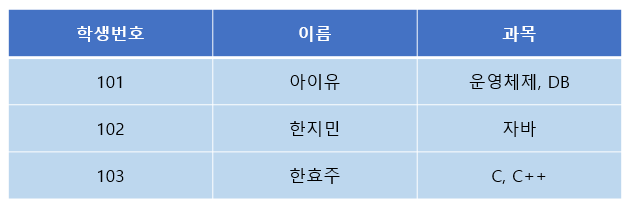
- 1NF 적용 전

<br>

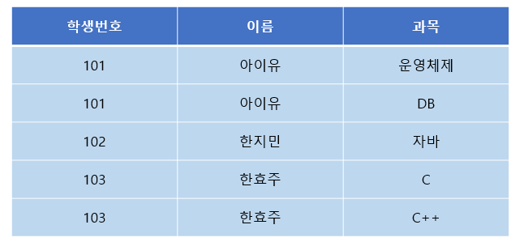
- 1NF 적용 후

<br>

### 제 2 정규형 (2NF)
- 제 2 정규형은 다음과 같은 규칙을 만족해야 함
    - 제 1정규형을 만족
    - 모든 컬럼이 부분적 종속(Partial Dependency)이 없어야 함 == 모든 컬럼이 완전 함수 종속을 만족해야 함

```
부분 함수 종속 (Partial Functional Dependency)
- 릴레이션에서 종속자가 기본키가 아닌 다른 속성에 종속되거나, 기본키를 구성하는 여러 속성들의 부분집합 중 일부분에만 종속되어 있음

완전 함수 종속 (Full Functional Dependency)
- 종속자가 기본키에만 종속되며, 기본키가 여러 속성으로 구성되어 있을경우 기본키를 구성하는 모든 속성이 포함된 기본키의 부분집합에 종속되어 있음
```
<br>

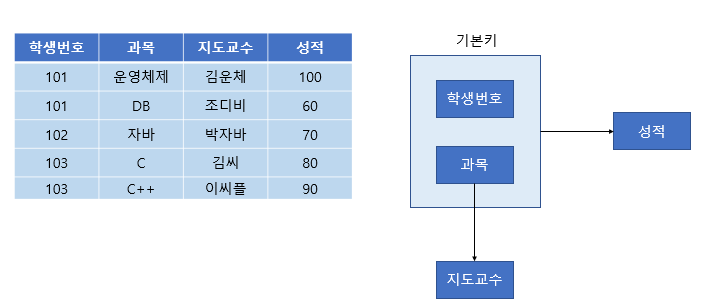
- 2NF 적용 전
- 성적의 특정 값을 알기 위해서는 학생 번호 + 과목이 있어야 하는데 특정 과목의 지됴교수는 과목명만 알면 지도 교수가 누군지 알 수 있음
- 지도 교수 컬럼은 (학생번호, 과목)에 종속되지 않고 (과목)에만 종속되는 부분적 종속임

<br>

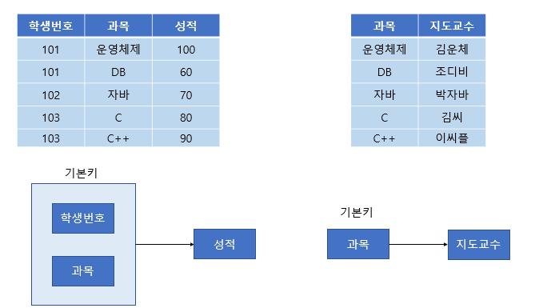
- 2NF 적용 후

<br>

### 제 3 정규형 (3NF)
- 제 3정규형은 다음과 같은 규칙을 만족해야함
    - 제 2 정규형을 만족해야함
    - 기본키를 제외한 속성들간의 이행 종속성 (Transitive Dependency)이 없어야 함
```
이행 종속
- A->B, B->C 일 때 A->C 성립하는 것
```

<br>

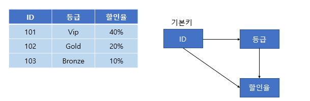
- 3NF 적용 전
- ID를 알면 등급을 알 수 있는데 여기서 이행 종속성이 존재 -> 3정규형을 만족하지 않음

<br>

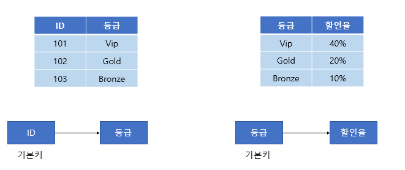
- 3NF 적용 후

<br>

### 보이스-코드 정규형 (BCNF, Boyce-CoddNarmal Form)
- 강화된 3정규형으로 모든 결정자가 후보키인 정규형
- BCNF는 다음과 같은 규칙을 만족해야함
    - 3정규형을 만족해야 함
    - 모든 결정자가 후보키 집합에 속해야함

<br>

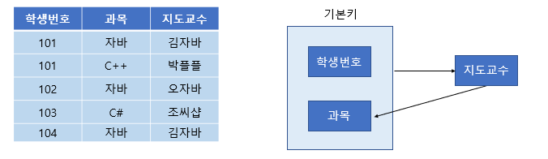
- BCNF 적용 전
- (학생번호, 과목)이 기본키로 지도 교수를 알 수 있음
- 하지만 같은 과목을 다른 교수가 가르칠 숟도 있어서 과목->지도교수 종속은 성립하지 않음
- 지도교수->과목 종속이 성립. 이처럼 후보키 집합이 아닌 컬럼이 결정자가 되어버린 상황을 BCNF를 만족하지 않는다고 함

<br>

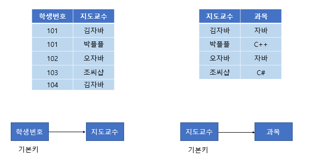
- BCNF 적용 후

<br>

### 제 4 정규형 (4NF)
- 제 4정규형은 다음과 같은 조건을 만족해야함
    - BCNF을 만족해야함
    - 다치 종속성이 없어야함
```
다치 종속(Multi Valued Dependency)
- 특정 속성값에 따라 선택적인 속성
- 하나의 결정자가 다른 속성에서 여러 종속자를 결정할 때 다치 종속한다고 함
- 다치 종속은 이중화살표로 표기 ->>
- 두 개의 독립된 속성이 1:N 관계로 대응하는 관계
- A,B,C 세 개의 속성을 가진 릴레이션에서 어떤 복합 속성(A,C)에 대응하는 B값의 집합이 A 종속되고 C값에는 무관할 때 다치 종속이 존재
```
<br>

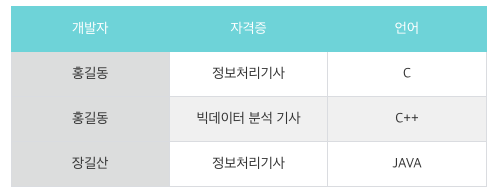
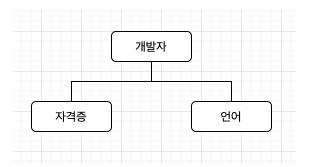
- 4NF 적용 전

<br>

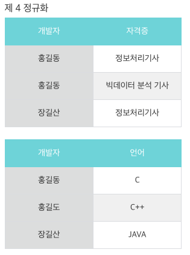
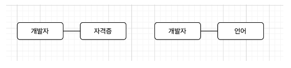
- 4NF 적용 후

<br>

### 제 5 정규형 (5NF)
- 제 5정규형은 다음과 같은 조건을 만족해야함
    - 4정규형을 만족해야함
    - 조인 종속성이 존재
```
조인 종속(Join Dependency)
- 하나의 릴레이션을 여러개의 릴레이션으로 분해하였다가, 다시 조인했을 때 데이터 손실이 없음
```

<br>

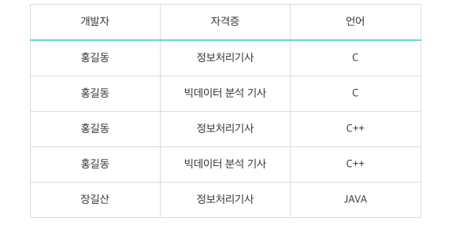
- 5NF 적용 전

<br>


- 5NF 적용 후

<br>

<div style="text-align: right">22-09-08</div>

-------

## Reference
- https://code-lab1.tistory.com/48
- https://geol2.tistory.com/203
- https://m.blog.naver.com/cmw1728/221270636239