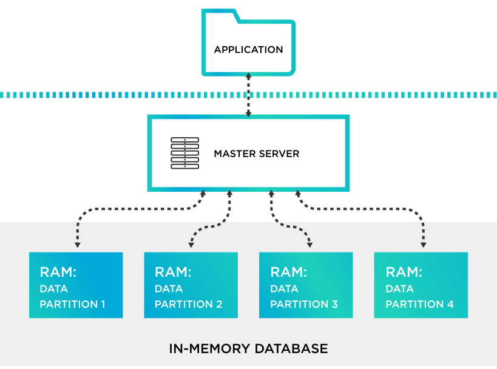
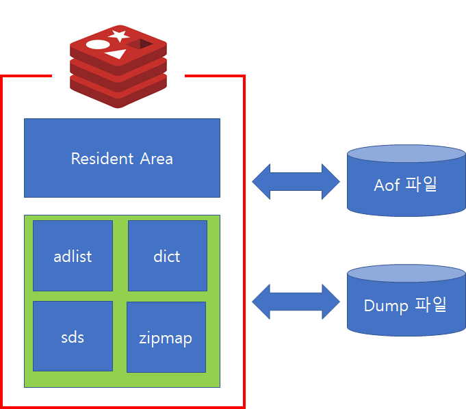
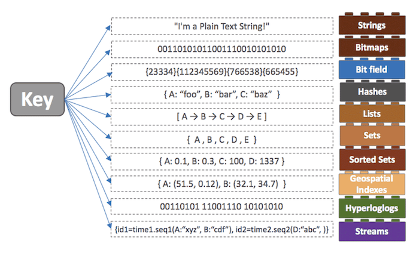
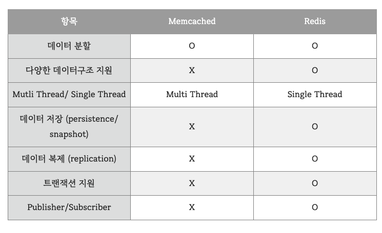

# Redis

### Redis (Remote Dictionary server)
- 빠른 오픈 소스 <code>인 메모리</code> 키 값 데이터 구조 스토어
- Key-Value 구도의 비정형 데이터를 저장하고 관리하기 위한 오픈 소스 기반의 비관계형 데이터 베이스 관리 시스템(DBMS)
- 여러 서버에서 같은 데이터를 공유할 때 주로 사용
- 보통 데이터 베이스는 하드 디스크나 SSD에 저장하는데 Redis는 메모리(RAM)에 저장해서 디스크 스캐닝이 필요없어 매우 빠른 장점이 존재
- 캐싱도 가능하여 실시간 채팅에 적합하며 세션 공유를 위해 세션 클러스트링에도 활용
- 다양한 자료 구조를 지원
- 싱글 스레드 방식으로 인해 연산을 원자적으로 수행이 가능 -> 싱글 스레드기 때문에 시간 복잡도 고려
- In-memory 특성 상 메모리 파편화, 가상 메모리등의 이해가 필요
- 읽기 성능 증대를 위한 서버측 리플리케이션 지원, 쓰기 성능 증대를 위한 클라이언트 측 샤딩 지원
- RAM의 휘발성을 막기위해 snapshot, AOF(Append Only File)의 백업 과정 존재

<br>



```
데이터 스토어
- 데이터 베이스같은 저장소 뿐만아니라 단순 파일, 이메일 등의 많은 유형의 데이터를 포함하는 광범위한 용어로 해당 데이터들을 영속적으로 저장하고 관리하기 위한 저장소

세션 클러스터링
- WAS가 2대 이상 설치되어있을 경우 세션을 공유하여 대체된 WAS에도 동일한 세션을 관리하는 것을 의미
- 샤딩을 이용한 수평 확장(scale out)가능

인 메모리 데이터베이스
- 컴퓨터에 주 메모리에 모든 조직 또는 개인의 데이터를 저장
- 인메모리 데이터베이스에 대한 데이터 분석은 보조 기억 장치를 사용하는 기존 데이터베이스에 비해 빠름
- 사물 인터넷(IoT)의 출현과 클라우드 기반 솔루션 성장에 따라 실시간으로 데이터 처리해야할 필요했기 때문에 실시간 데이터를 처리하기 위한 고성능 데이터베이스 솔루션
- 메모리 크기가 작아 캐시용으로 주로 사용됨
- 메모리에 저장하기 때문에 휘발성의 성격을 가짐
```

<br>

#### Redis 특징
- 영속성을 지원하는 인 메모리 데이터 저장소 ( RAM의 휘발성을 막기위해 Snapshot, AOF 사용 )
- 다양한 자료구조 지원
- 싱글 스레드 방식으로 인해 연산을 원자적으로 수행을 가능
- 읽기 성능 증대를 위한 서버 측 리플리케이션 지원
    - 리플리케이션(Replication) : 동일한 데이터를 다중 노드에 중복하여 저장하는 것으로 서버측 복제로 레디스가 실행중인 서버가 충돌하는 경우 장애 조치 처리와 함께 더 높은 읽기 성능을 지원하기 위함
    - 레디스는 복제를 위해 마스터와 슬레이브 복제 개념을 사용하고 마스터는 복제를 위한 원본 데이터 역할이며, 슬레이브는 마스터 노드에 데이터 복제 요청을 하고 데이터를 수신하여 동기화함
- 쓰기 성능 증대를 위한 클라이언트 측 샤딩(Sharding) 지원
    - 샤딩(Sharding) : 다른 용어로 파티셔닝이라고 부름. 데이터를 특정 조건에 따라 나누어 저장하는 것으로 같은 테이블의 스키마를 가진 데이터를 다수의 데이터베이스에 분산하여 저장하는 방법으로 더 많은 데이터를 Redis에 저장할 수 있음
        - 수직 샤딩 : 관계형 데이터베이스의 테이블에 해당하는 정보를 노드별로 분할하는 방식
        - 범위 지정 샤딩 : 키를 특정 범위 기준으로 분할하여 저장하는 방식
        - 해시 기반 샤딩 : 키를 해시 함수에 대입해 결과값을 특정 연산을 가해 데이터의 위치를 결정하는 방법을 말하는데 일관된 해싱이라고도 함
- 다양한 서비스에서 사용되며 검증된 기술

```
Snapshot
- 특정 지점을 설정하고 디스크에 백업, 순간적으로 메모리에 있는 내용 전체를 디스크에 옮겨 담는 방식
- 특정 시점의 메모리 내용을 복사하여 파일에 기록하는 방법으로 RDBMS Full Backup에 해당
- 정기적 혹은 비정기적으로 저장이 필요할 시점에 데이터 저장이 가능
- AOF에 비해 부하가 적으며 LZF압축을 통해 파일압축이 가능하고 또한 덤프파일 그대로 메모리에 복원하므로 AOF에 비해 빠르지만 덤프파일을 기록한 시점 이후 데이터는 저장되지 않으므로 복구시에 데이터 유실이 발생할 수 있음

AOF(Append Only File)
- 모든 write/update 연산 자체를 모두 log 파일로 기록하고, 서버가 셧다운되면 재실행해서 다시 만들어 놓는 것
- AOF는 전달된 명령을 파일에 기록하는 방법으로 RDBMS의 Redo 매커니즘과 유사(이미 커밋한 내용을 재반영하는 복구)
- AOF는 데이터 유실이 발생하지 않지만 매 명령어마다 File과의 동기화가 필요하기 때문에 처리속도가 현격히 줄어듬
- 이를 해소하기 위한 File Sync 옵션(appendfsync)이 존재하며, 해당 옵션에 따라 Sync 주기를 조절할 수 있으나 그만큼 데이터 유실이 발생할 수 있음

샤드(shard)
- 두 개의 노드를 사용하여 분할 저장하였을 때 각 노드를 샤드라고 부름
- 만약 각 샤드가 복제를 사용하여 여러 개의 노드로 구성되어도 하나의 샤드로 취급
```

<br>


#### Redis 구조
- Redis는 인 메모리 데이터 구조 저장소로 모두 메모리에 상주
- 위 그림에서 Resident Area는 명령어를 통해 실제 데이터가 저장 및 작업이 실행되는 공간
- 위 그림에서 초록색 영역은 내부적으로 서버 상태를 저장하고 관리하기 위한 메모리 공간으로 사용되며 Data Structure 영역으로 불림
- Redis를 Persistence 저장소로 활용하기 위해 Disk에 저장하여 데이터 유실이 생기지 않도록 해야하는데 이를 위해 AOF(Append Only File)기능과 RDB(Snapshot)기능이 존재


<br>



#### Redis Value
- 다양한 구조체 지원 -> Key가 될 수 있는 데이터 구조체가 다양
    - String (text, binary data) - 512MB 까지 저장이 가능
    - set (String 집합)
    - sorted set (set을 정렬해둔 상태)
    - Hash
    - List (양방향 연결 리스트)
    - Bit arrays(bitMaps) (bit array를 다를 수 있는 자료구조)
    - HyperLogLogs (HyperLogLog는 집합의 원소의 개수를 추정하는 방법, Set 개선된 방법)
    - Streams
- 레디스가 다른 인메모리 데이터베이스와의 가장 큰 차이점으로 다양한 자료구조의 제공은 개발의 편의성 및 난이도에 도움됨

<br>

#### Redis를 사용하면 좋은 경우
- 운영중인 웹 서버에서 키-값 형태의 데이터 타입을 처리해야하고, I/O가 빈번히 발생하여 다른 저장 방식을 사용하면 효율이 떨어지는 경우
- 유튜브처럼 어마어마한 I/O를 발생시키는 데이터를 처리할 때 레디스를 사용해 데이터를 캐싱 처리하고 일정한 주기에 따라 RDS에 업데이트를 한다면 RDS에 가해지는 부담을 크게 줄이고 성능은 크게 향상할 수 있음
- 가장 많이 사용되는 경우는 사용자의 세션 관리로 사용자의 세션을 유지하고 불러오고 여러 활동들을 추적하는데에 매우 효과적으로 사용할 수 있음. 또한 매우 빠르게 동작한다는 점을 이용해 메시지 큐잉에도 사용할 수 있음
- 그밖에도 API 캐싱에 강력하게 사용할 수 있음. 라우트로 들어온 요청에 대해 요청 값을 캐싱해두면 동일 요청에 대해 캐싱된 데이터를 리턴하는 방식

<br>

#### Redis 키
- 레디스는 하나의 키-값 데이터에 여러 키가 존재하는데 레디스의 스키마는 RDS의 로우의 숫자와 비슷하게 동작하지 않음
- 레디스는 O(1)의 수행시간을 가지고 키가 많거나 적거나 동일한 시간이 사용됨

<br>

#### Memory 관리
- 메모리 파편화
    - 메모리를 할당 받고 해제하는 과정에서 공간이 비어지게 되는데 공간을 많이 차지하는 프로세스가 들어오면 중간중간 비어있는 메모리 공간 때문에 할당가능한 부분이 줄어듬 -> 실제 사용하는 메모리보다 많이 사용하고 있다고 판단하고 프로세스가 죽는 경우가 생김 . Redis를 사용할 시 이런 메모리 공간을 여유롭게 사용해야함
- 가상메모리 Swap
    - 실제로 프로세스를 메모리에 올릴때 일부만 올려서 메모리에서 사용하는데 그렇기 때문에 디스크와 메모리 간에 주고받는 시간 발생. 싱글 쓰레드에서는 속도가 중요하기 때문에 해당 Swap 지식이 필요함
- Replication - Fork
    - 리플리케이션을 이용하여 데이터가 유실되는 것을 방지하기 위해 서버를 복제. 복사가 일어날 때 메모리가 가득차있다면 복제가 일어나지 않고 서버가 죽는 현상 발생할 수 도있음. Redis는 메모리를 여유롭게 사용해야함

<br>

#### Redis maxmemory
- Redis 서비스 운영시 메모리의 한계는 maxmemory 값으로 설정이 가능
- maxmemory 수치까지 메모리가 다 차는 경우, Redis는 maxmemory policy에 따라서 추가 메모리를 확보할 수 있음
- maxmemory-policy 설정값
    - noeviction : 기존 데이터를 삭제하지 않음. 메모리가 꽉 찬 경우에는 OOM(Out Of Memory) 오류 반환하고 새로운 데이터는 버리게 됨
    - allkeys-lru : LRU(Least Recently Used)라는 페이지 교체 알고리즘을 통해 데이터를 삭제하여 공간 확보
    - volatile-lru : expire set을 가진 것 중 LRU로 삭제하여 메모리 공간 확보
    - allkeys-random : 랜덤으로 데이터를 삭제하여 공간 확보
    - volatile-random : expire set을 가진 것 중 랜덤으로 데이터를 삭제하여 공간 확보
    - volatile-ttl : expire set을 가진 것 중 TTL(Time To Live) 값이 짧은 것부터 삭제
    - allkeys-lfu : 가장 적게 액세스한 키를 제거하여 공간 확보
    - volatile-lfu : expire set을 가진 것 중 가장 적게 액세스한 키부터 제거하여 공간 확보

<br>

#### Redis Single Thread
- 싱글 스레드 방식이어서 연산을 하나씩 처리 
    - 빠르게 처리해야 하므로 시간 복잡도에 신경써야함
- 레디스는 싱글 스레드를 사용하여 연산을 원자적으로 처리하여 Race Condition(경쟁상태: 둘 이상의 입력 또는 조작의 타이밍이나 순서 등이 결과 값에 영향을 줄 수 있는 상태)이 거의 발생하지 않음
- 서버하나에 여러 개의 서버를 띄우는 것이 가능 (Master-Slave 형식으로 구성하여 데이터 분실 위험을 없앰)

<br>



### VS Memcached?
#### Redis와의 공통점
    - 모두 Key-Value 모델에 기반을 둔 NoSQL 솔루션이며 인 메모리 데이터 저장소로 두 솔루션 모두 캐시 레이어로서 동작
    - 빠른 응답 시간. 속도는 거의 유사
    - 문법적으로 사용하기 쉽고 개발코드 양이 적음
    - 데이터 파티셔닝을 통해 데이터를 여러 노드에 분산하여 저장 가능
    - 다양한 프로그래밍 언어 지원

<br>

#### Redis와의 차이점
- 멀티스레드를 지원하기 때문에 멀티프로세스코어를 사용할 수 있음
- Memcached는 Redis의 비해 제공 용량이 적음
- Memcached의 확장성은 Scale up을 통해서 얻을 수 있는 반면, Redis는 Scale out을 통해 얻을 수 있음
    - scale up : 동일 서버 하드웨어에 컴퓨팅 자원을 추가해 성능 향상(기존 서버 향상)
    - scale out : 동일 사양의 규격화한 서버 하드웨어의 개수를 늘림으로써 성능 향상(서버 추가 확장)
- Data Eviction(데이터 쫒아내기) 전략. 캐시도 유한한 리소스를 지니므로 결국 메모리에 자리잡은 자원을 쫒아내야 함. Memcached의 경우 LRU(Least Recently Used) 알고리즘만을 채택하고 있고 Redis의 방법은 위의 maxmemory로 설정 가능
- Redis는 다양한 데이터 타입 지원. Redis는 여러 자료 구조 제공 및 최대 512MB의 key와 512MB의 value 까지 지원. Memcached는 별도의 데이터 타입 없이, 문자열을 저장하여 최대 250B key와 1MB value를 지원
- Persistance : 데이터를 저장할 수 있는지의 여부로 Redis는 AOF 기반으로 데이터를 저장할 수 있는 기능이 있는데 비해, Memcached는 들고 있는 데이터를 저장할 수 있는 기능이 없음. 따라서 Memcached는 캐시로서의 기능만 수행할 수 있지만 Redis는 캐시로도 쓰일 수 있고 Data Store로도 사용할 수 있음
- Redis는 트랜잭션 지원함. WATCH / MULTI / EXEC 등의 명령어를 기반으로 optimistic lock 기반 트랜잭션을 지원
    - MULTI : 트랜잭션 시작
    - DISCARD : 트랜잭션 취소
    - EXEC : 트랜잭션 커밋
    - WATCH : 특정 key의 변경 여부 감시
    - UNWATCH : watch 취소
- Pub / Sub 지원 
    - 일반적인 데이터베이스와는 다르게 Redis는 메세징 솔루션으로 Pub/Sub 지원
    - 메시지들을 queue로 관리하지 않고(메시지를 보관하지 않음) Publish 명령으로 보내고, Subscribe 명령으로 받음. publish 하는 시점 기준으로 미리 subscribe 등록 대기 중인 클라이언트들을 대상으로만 메시지를 전달
    - 통로는 채널(channel)을 이용하는데 SET KEY VALUE에서 사용하는 KEY와 같은 것
- 인 메모리 데이터 저장소로 Redis와 다르게 종료시 메모리의 데이터가 휘발성으로 영속성을 지원하지 않음
- Redis가 다양한 용도에 효과적으로 사용할 수 있도록 많은 특징을 가지고 있다면 Memcached는 명료하고 단순함을 위해 개발
- Redis가 더욱 많은 기능을 제공하므로 대부분의 기능을 커버가능

<br>

<div style="text-align: right">22-07-20</div>
<div style="text-align: right">+ 추가정리 : 22-10-06</div>

-------

## Reference
- https://steady-coding.tistory.com/586
- https://github.com/gyoogle/tech-interview-for-developer/blob/master/Computer%20Science/Database/Redis.md
- https://www.tibco.com/ko/reference-center/what-is-an-in-memory-database
- https://liebe97.tistory.com/37
- https://chrisjune-13837.medium.com/redis-vs-memcached-10e796ddd717
- https://luran.me/359
- [유튜브 : 디디의 Redis 10분 테코톡](https://www.youtube.com/watch?v=Gimv7hroM8A)
- https://brunch.co.kr/@skykamja24/575
- https://meetup.toast.com/posts/224
- https://cla9.tistory.com/101