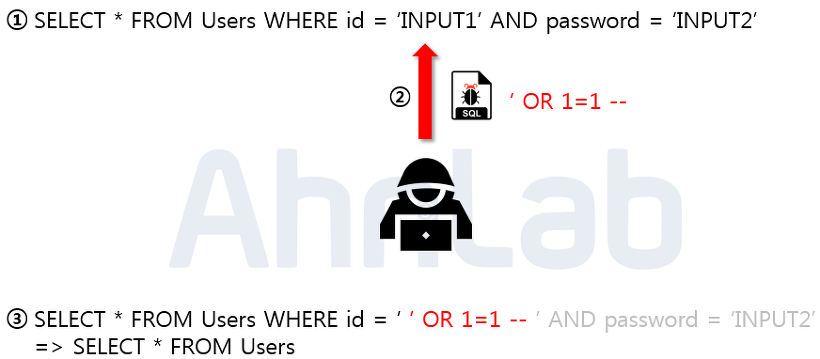
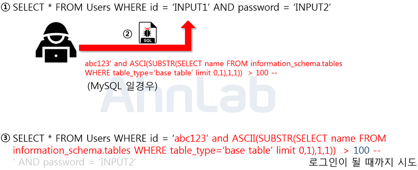
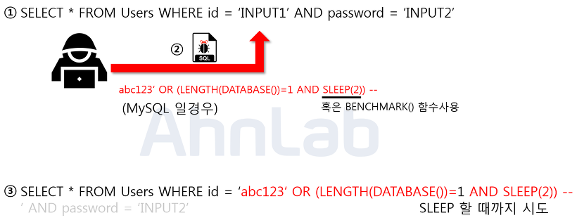

# SQL Injection

### SQL Injection
- 웹 사이트의 보안상 허점을 이용해 특정 SQL 쿼리문을 전송하여 공격자가 원하는 데이터베이스의 중요한 정보를 가져오는 해킹 기법
- 대부분 클라이언트가 입력한 데이터를 필터링하지 못하는 경우에 발생
- 공격의 쉬운 난이도에 비해 피해가 상당하기 때문에 보안 위협 1 순위로 불릴만큼 중요한 기법

<br>

## 공격 종류 및 방법

<br>



### 1. 논리적 에러를 이용한 SQL Injection (Error based SQL Injection)
- SQL Injection에서 가장 많이 쓰이고, 대중적인 공격 기법
- 논리적 에러는 부당한 논리를 의미
- 위의 사진에서 보이는 쿼리문은 일반적으로 로그인 시 많이 사용되는 SQL 구문으로 악의적인 사용자가 ' OR 1-1 -- 이라는 구문을 이용해 WHRER 절을 모두 참으로 만들고 --를 통해 주석처리하여 구문을 수정시킴
- 위의 수정된 구문은 결론적으로 Users 테이블에 있는 모든 정보를 조회하게 됨으로써 가장 먼저 만들어진 계정으로 로그인에 성공하게 됨. 보통 처음 만드는 계정은 관리자 계정으로 관리자 계정을 탈취하면 권한을 이용해 또 다른 2차 피해를 발생시킬 수 있게 됨
- 입력값에 검증이 없어 발생

<br>


### 2. Union 명령어를 이용한 SQL Injection(Union based SQL Injection)
- 두 개의 쿼리문에 대한 결과를 통합해서 하나의 테이블로 보여주게 하는 키워드인 Union을 이용하여 인젝션에 성공하면 원하는 쿼리문을 실행할 수 있게함
- 기존 SELECT 문의 출력에 공격자가 원하는 데이터를 합쳐서 악의적인 사용자가 원하는 결과 출력 가능
- 위의 사진에서 보이는 쿼리문은 Board에서 게시글을 검색하는 쿼리문인데 입력값을 title과 contents 컬럼의 데이터랑 비교한 뒤 비슷한 글자가 있는 게시글을 출력하는데 입력값으로 Union 키워드와 함께 컬럼 수를 맞춰서 SELECT 구문을 넣어주게 되면 두 쿼리문이 합쳐져서 하나의 테이블로 보여지게 되어 인젝션이 성공하게 되면 사용자의 개인정보가 게시글과 함께 화면에 보여지게 됨
- 해당 공격도 입력값에 대한 검증이 없어서 발생

<br>

### 3. 보이지않는 SQL Injection (Blind SQL Injection)

<br>



#### 3-1. Boolean based SQL
- 데이터베이스로부터 특정한 값이나 데이터를 전달받지 않고, 단순히 참과 거짓의 정보만 알 수 있을 때 사용
- 로그인 폼에 SQL Injection이 가능하다고 가정 했을 때, 서버가 응답하는 로그인 성공과 로그인 실패 메시지를 이용하여 DB의 테이블 정보 등을 추출해 낼 수 있음
- 위의 그림은 해당 구문을 통해 하나의 테이블만 조회하고 SUBSTR 함수로 첫 글자만, 그리고 마지막으로 ASCII 를 통해서 값을 변환해주고 참이 될때까지 뒤의 100이라는 숫자를 변경해가면서 비교하고 공격자는 이 프로세스 과정을 통하여 단기간 내에 테이블 명을 알아낼 수 있음

<br>


- 마찬가지로 서버로부터 특정한 응답 대신에 참 혹은 거짓의 응답을 통해서 데이터베이스의 정보를 유츄하는 기법
- 사용되는 함수는 MYSQL 기준으로 SLEEP과 BENCHMARK
- 위의 그림은 현재 사용하고 있는 데이터베이스의 길이를 알아내는 방법
- 로그인 폼에 주입이 되었으며 임의로 계정을 생성하고 악의적인 사용자가 abc123’ OR (LENGTH(DATABASE())=1 AND SLEEP(2)) –- 이라는 구문 주입. 여기서 LENGTH 함수는 문자열의 길이를 반환하고, DATABASE 함수는 데이터베이스의 이름을 반환함
- 주입된 구문에서 LENGTH(DATABASE()) = 1 가 참이면 SLEEP(2) 가 동작하고, 거짓이면 동작하지 않아 이를 통해서 숫자 1 부분을 조작하여 데이터베이스의 길이를 알아 낼 수 았음
- 만약에 SLEEP 이라는 단어가 치환처리 되어있다면, 또 다른 방법으로 BENCHMARK 나 WAIT 함수를 사용 할 수 있음

<br>

### 4. 다량의 SQL Injection 공격(Mass SQL Injection)
- 기존 SQL Injection과 달리 한번의 공격으로 다량의 데이터베이스가 조작되어 큰 피해를 입히는 것
- 보통 MS-SQL을 사용하는 ASP 기반 웹 애플리케이션에서 많이 사용되며 쿼리문은 HEX 인코딩 방식으로 인코딩하여 공격
- 보통 데이터베이스 값을 변조하여 데이터베이스에 악성스크립트를 삽입하고, 사용자들이 변조된 사이트에 접속 시 좀비 PC로 감염되게 함

<br>

## 대응 방안

<br>

### 1. 입력 값에 대한 검증
- SQL Injection 에서 사용되는 기법과 키워드는 매우 많기 때문에 사용자의 입력 값에 대한 검증이 필요한데 서버 단에서 화이트리스트 기반으로 검증해야 함
- 블랙리스트 기반으로 검증하게 되면 수 많은 차단리스트를 등록해야 하고, 하나라도 빠지면 공격에 성공하게 되기 때문
- 공백으로 치환하는 방법도 많이 쓰이는데 해당 방법도 취약한 방법
    - 공격자가 SESELECTLECT 라고 입력 시 중간의 SELECT가 공백으로 치환이 되면 SELECT 라는 키워드가 완성되게 됨. 공백 대신 공격 키워드와는 의미 없는 단어로 치환되어야 함
```
블랙 리스트 방식
- SQL 쿼리의 구조를 변경시키는 문자나 키워드, 특수문자를 제한하는 방식
- SQL의 예약어인 UNION, GROUP BY와 COUNT() 등의 함수명, 세미콜론(;)이나 주석(--) 등의 특수문자들을 블랙리스트로 미리 정의하고, 블랙리스트로 지정되어 있는 문자나 키워드가 외부 입력값 안에 존재하면 공백 등으로 치환하는 방식으로 방어
- 하지만 정교하게 입력값을 검증하지 않는다면 블랙 리스트 방식의 검증을 우회할 수도 있으니 주의해야 함. 예를 들어 외부 입력값에 SESELECTLECT라는 표현이 있을 때 중간의 SELECT가 공백으로 치환되면 그 좌우에 있는 문자들이 합쳐져서 다시SELECT라는 키워드로 완성됨

화이트 리스트 방식
- 허용된 문자를 제외하고는 모두 허용하지 않는 방식으로, 금지된 문자 외에는 모두 허용하는 블랙 리스트 방식보다 보안성 측면에서는 훨씬 더 강력한 방법
- 웹 애플리케이션의 기능에 따라 알맞게 화이트 리스트를 작성해야 하는 번거로움이 존재
- 그러한 번거로움을 극복하기 위해, 그리고 유지보수의 편리함을 증진시키기 위해 개별 문자를 일일이 하나씩 모두 정의하는 것보다 정규식 등을 이용해서 화이트 리스트를 범주화/패턴화시키는 편이 좋음
```

<br>

### 2. Prepared Statement 구문사용
- Prepared Statement 구문을 사용하게 되면, 사용자의 입력 값이 데이터베이스의 파라미터로 들어가기 전에 DBMS가 미리 컴파일 하여 실행하지 않고 대기
- 이후 사용자의 입력 값을 문자열로 인식하게 하여 공격 쿼리가 들어간다고 하더라도, 사용자의 입력은 이미 의미 없는 단순 문자열이기 때문에 전체 쿼리문도 공격자의 의도대로 작동하지 않음

<br>

### 3. Error Message 노출 금지
- 공격자가 SQL Injection을 수행하기 위해서는 데이터 베이스의 정보(테이블명, 컬럼명 등)가 필요
- 데이터베이스 에러 발생 시 따로 처리를 해주지 않았다면 에러가 발생한 쿼리문과 함께 에러에 관한 내용을 반환
- 여기서 테이블명 및 컬럼명 그리고 쿼리문이 노출이 될 수 있기 때문에, 데이터 베이스에 대한 오류 발생 시 사용자에게 보여줄 수 있는 페이지를 제작 혹은 메시지박스를 띄우도록 하여야 함

<br>

### 4. 웹 방화벽 사용
- 웹 공격 방어에 특화되어 있는 웹 방화벽을 사용하는 것도 하나의 방법
- 웹 방화벽은 소프트웨어형, 하드웨어 형, 프록시 형 이렇게 세가지 종류로 나눌 수 있음
    - 소프트웨어 형은 서버 내에 직접 설치
    - 하드웨어 형은 네트워크 상에서 서버 앞 단에 직접 하드웨어 장비로 구성
    - 프록시 형은 DNS 서버 주소를 웹 방화벽으로 바꾸고 서버로 가는 트래픽이 웹 방화벽을 먼저 거치도록 함

<br>

<div style="text-align: right">22-08-30</div>

-------

## Reference
- https://m.blog.naver.com/lstarrlodyl/221837243294
- https://noirstar.tistory.com/264