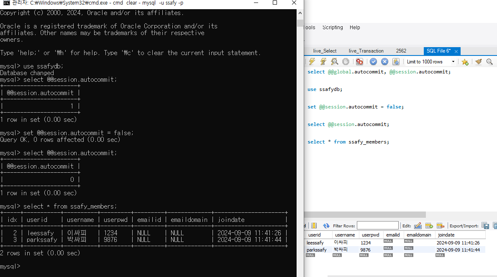
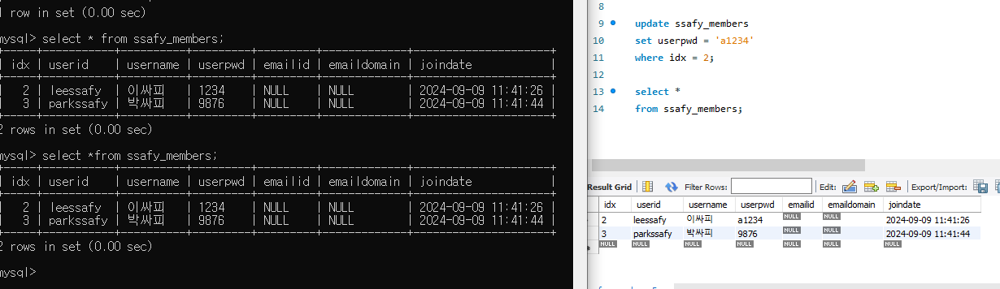
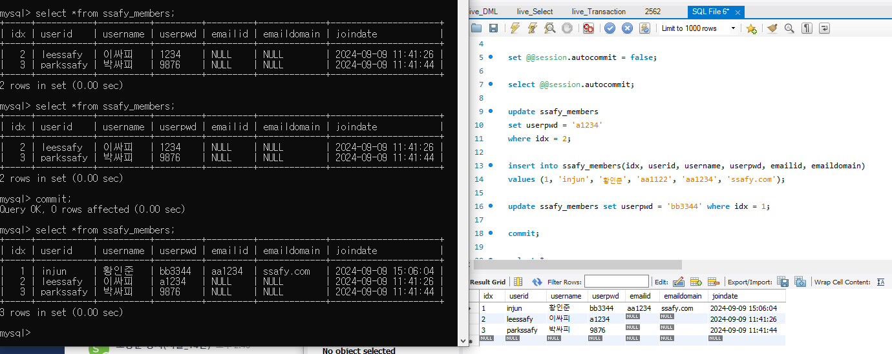
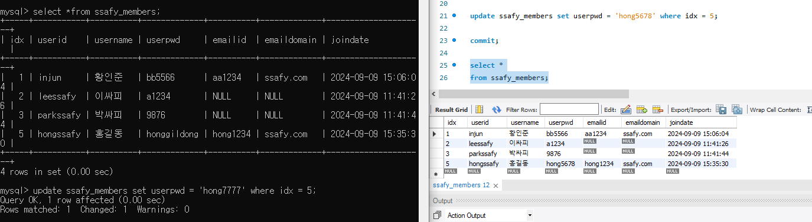

# Transaction

### 트랜잭션 (Transaction)
- 트랜잭션이란 데이터베이스의 상태를 변화시키기 위해 수행하는 작업 단위
- 작업단위란 사용자가 특정 기능 수행을 위해 SQL 작업을 묶은 단위
- 질의어(SELECT, INSERT, DELETE, UPDATE)를 이용하여 데이터베이스를 접근하는 것을 의미
- 주요 예시에는 송금 서비스가 있음. A가 B에게 돈을 보냈을 때 A가 돈을 보내는 것은 성공했지만 B가 돈을 받는데 성공하지 못하였다면 서비스에 문제가 발생. 해당 상황처럼 하나의 연관된 작업들(송금 과정이 하나의 작업 단위)을 묶은 것이 작업단위, 즉 트랜잭션으로 해당 작업 중 문제가 발생하면 해당 작업이 일어나기 전으로 돌아가야 함
- 트랜잭션이 성공적으로 마무리되었다면 commit 을 호출하여 수정 사항을 DB에 영구적으로 반영하고 중간에 오류가 발생 했다면 rollback을 호출해서 트랜잭션 내부의 모든 작업을 원상복귀시킴

<br>

### 트랜잭션 특징 (ACID)
>#### 원자성 (Atomicity)
>- 트랜잭션이 DB에 모두 반영되거나 혹은 반영되지 않아야 함
>- 트랜잭션이 중간에 실패하면 그동안 수행된 모든 작업이 취소되고, 데이터베이스는 트랜잭션 이전의 상태로 복구됨
>#### 일관성 (Consistency)
>- 트랜잭션의 작업 처리 결과는 항상 일관성 있어야 함
>- 데이터베이스의 제약 조건이나 규칙이 트랜잭션 전후에 모두 유효해야함
>#### 독립성 (Isonlation)
>- 동시에 실행되는 트랜잭션들은 서로 간섭하지 않아야함
>    - 둘 이상의 트랜잭션이 동시에 병행 실행되고 있을 때, 어떤 트랜잭션도 다른 트랜잭션 연산에 끼어들 수 없음
>    - 트랜잭션 메소드 안에 트랜잭션이 들어가면 둘다 실행됨
>- 한 트랜잭션이 완료되기 전에 다른 트랜잭션의 결과를 볼 수 없도록 격리되어야 하며, 동시에 실행되더라도 순차적으로 실행된 것과 동일한 결과를 가져야함
>#### 지속성 (Durability)
>- 트랜잭션이 성공적으로 완료되었으면, 결과는 영구적으로 반영되어야 함
>- 시스템 장애가 발생하더라도 그 결과는 보존되어야 함

<br>

### 트랜잭션 연산
> #### Commit
>- 하나의 트랜잭션이 성공적으로 끝났고, DB가 일관성 있는 상태일 때 이를 알려주기 위해 사용하는 연산
> #### Rollback
>- 하나의 트랜잭션 처리가 비정상적으로 종료되어 트랜잭션 원자성이 깨진 경우
>- transaction이 정상적으로 종료되지 않았을 때, last consistent state Transaction의 시작상태로 되돌아감

<br>


### 트랜잭션의 상태
1. Active
    - 트랜잭션이 현재 실행 중인 상태
2. Failed
    - 트랜잭션이 실행되다 오류가 발생해서 중단된 상태
3. Aborted
    - 트랜잭션이 비정상 종료되어 Rollback이 수행된 상태
4. Partially Committed
    - 트랜잭션의 연산이 마지막까지 실행되고 Commit이 되기 직전 상태
5. Committed
    - 트랜잭션이 성공적으로 종료되어 Commit 연산을 실행한 후의 상태

<br>

### 회복 기법
- 데이터베이스는 모순이 없는 일관된 상태로 유지되어야 함
- 장애가 발생 시 회복 기능을 제공해 관리되어 지는데 여기서 회복이란 데이터베이스를 장애가 발생하기 전의 일관된 상태로 복귀시키는 것을 의미
- 회복 기법에는 크게 4가지가 존재하고 데이터베이스 관리 시스템에 있는 회복 관리자가 담당 -> 회복 관리자는 장애 발생을 탐지하고 장애가 탐지되면 데이터베이스로 복구하는 기능 제공

>#### Immediate update (즉시 갱신)
>- 로그 기반 회복 기법
>- 트랜잭션 수행 도중 변경하면 변경 정보를 로그 파일에 저장하고, 트랜잭션이 부분 완료되기 전이라도 모든 변경 내용을 즉시 데이터베이스에 반영하는 기법
>- 로그 파일을 참조하여 REDO, UNDO 연산 모두 실행
>#### Deferred updates (지연 갱신)
>- 로그 기반 회복 기법
>- 트랜잭션이 부분 완료 상태에 이르기까지 발생한 모든 변경 내용을 로그 파일에만 저장하고 데이터베이스에는 커밋이 발생할 때까지 저장하는 기법. 회복 과정에서 UNDO가 필요 없음
>- 이를 통해 트랜잭션의 원자성 보장
>#### Checkpoint recovery
>- 이전은 신경쓰지 않고 Checkpoint 이후만 즉시 갱신 혹은 지연 갱신을 수행
>- 가장 최근 Checkpoint 지점을 찾아 그 시점 이후의 로그만을 회복 대상으로 함
>#### Media recovery
>- 디스크와 같이 비 휘발성 저장 장치의 내용이 손상되는 장애가 발생했을 시에 회복을 위한 기법으로 백업, 미러링 등을 이용해 복구
```
데이터베이스의 장애
1. 트랜잭션 장애
2. 시스템 장애
    - 하드웨어 결함
3. 미디어 장애
    - 디스크 장치 결함
```

<br>

### 주 사용 연산
>1. #### UNDO 
>- 로그를 이용해 지금까지 실행된 모든 변경 연산을 취소하여 데이터베이스를 원래의 상태로 복구 -> 변경 중이었거나 이미 변경된 내용만 신뢰성을 잃은 경우 주로 사용
>
>2. #### REDO
>- 이미 commit한 트랜잭션의 수정을 재반영하는 복구 작업
>- 가장 최근에 저장한 데이터베이스 복사본을 가져온 후 로그를 이용해 복사본이 만들어진 이후에 실행된 모든 변경 연산을 재실행하여 장애가 발생하기 직전의 상태로 복구 -> 전반적으로 손상된 경우에 주로 사용
>- Buffer 관리 정책에 영향을 받음

<br>

### 트랜잭션의 격리 수준

- READ_UNCOMMITTED : 트랜잭션의 격리 수준으로 커밋되지 않아도 노출됨. 성능을 극대화 할 때 주로 사용
- READ_COMMMITED : 트랜잭션의 격리 수준으로 커밋되지 않으면 노출되지 않음. 있는 시점에 따라서 데이터가 변경될 수 있음
- REPEATABLE_READ : 읽은 Row 수정 반영 되지 않음. 트랜직션 시작 시점의 스냅샷을 저장해두고 종료시 까지 해당 스냅샷을 이용함. 그렇기 때문에 다른 트랜잭션이 값을 변경했어도 해당 트랜잭션이 끝나기 전까지는 저장해둔 스냅 샷의 정보를 확인함
- SERIALZABLE : 트랜잭션이 끝나기 전까지는 다른 트랜잭션이 실행되지 않는다. 트랜잭션은 순차적으로 진행한다. 극단적으로 안정한 작업이 필요할 때 주로 사용

<br>

### 트랜잭션 전파 타입
- REQUIRED : 전파의 기본 속성, 트랜잭션이 있으면 참여하고 없으면 새로 시작
- MANDATORY : 트랜잭션이 있으면 참여하고 없으면 예외 발생
- REQUIRED_NEW : 항상 새로운 트랜잭션을 시작, 진행중인 트랜잭션이 있다면 트랜잭션 잠시 보류
- SUPPORT : 이미 트랜잭션이 있으면 참여, 그렇지 않으면 트랜잭션 없이 진행
- NESTED : 이미 진행 중인 트랜잭션이 있다면 중첩 트랜잭션 시작, 부모 트랜잭션 커밋, 롤백엔 영향을 받으나 자신의 커밋, 롤백은 부모 트랜잭션에 영향을 주지 못함
- NEVER : 트랜잭션을 사용하지 않게 함, 트랜잭션이 존재하면 예외를 발생
- NOT_SUPPORTED : 트랜잭션을 사용하지 않게 함, 트랜잭션이 있다면 보류함

<br>

## Ssafy Wizards CS Study

### 트랜잭션이란?
- 데이터베이스나 시스템에서 수행되는 작업의 논리적 단위를 의미
- 트랜잭션은 여러 단계의 작업이 하나의 단위로 수행되어야 할 때 사용되며, 모든 작업이 성공적으로 완료되거나, 그렇지 않으면 아무 일도 일어나지 않은 것처럼 원래 상태로 되돌리는 것을 보장함

<br>

### 트랜잭션 ACID

#### 원자성 (Atomicity)
- 트랜잭션이 DB에 모두 반영되거나 혹은 반영되지 않아야 함
- 트랜잭션이 중간에 실패하면 그동안 수행된 모든 작업이 취소되고, 데이터베이스는 트랜잭션 이전의 상태로 복구됨
#### 일관성 (Consistency)
- 트랜잭션의 작업 처리 결과는 항상 일관성 있어야 함
- 데이터베이스의 제약 조건이나 규칙이 트랜잭션 전후에 모두 유효해야함
#### 독립성 (Isonlation)
- 동시에 실행되는 트랜잭션들은 서로 간섭하지 않아야함
    - 둘 이상의 트랜잭션이 동시에 병행 실행되고 있을 때, 어떤 트랜잭션도 다른 트랜잭션 연산에 끼어들 수 없음
    - 트랜잭션 메소드 안에 트랜잭션이 들어가면 둘다 실행됨
- 한 트랜잭션이 완료되기 전에 다른 트랜잭션의 결과를 볼 수 없도록 격리되어야 하며, 동시에 실행되더라도 순차적으로 실행된 것과 동일한 결과를 가져야함
#### 지속성 (Durability)
- 트랜잭션이 성공적으로 완료되었으면, 결과는 영구적으로 반영되어야 함
- 시스템 장애가 발생하더라도 그 결과는 보존되어야 함

<br>

### 1. ACID 원칙 중, Durability를 DBMS가 보장하는 방법
- Durability(지속성)는 트랜잭션이 성공적으로 완료된 후 그 결과가 영구적으로 저장되어야 하고, 시스템 장애나 예기치 않은 문제가 발생하더라도 데이터가 손실되지 않도록 보장하는 것을 의미
- 데이터베이스 관리 시스템(DBMS)은 여러 가지 방법을 통해 이 Durability를 보장함

#### 1. Write-Ahead Logging (WAL)
- 변경 사항을 데이터베이스에 적용하기 전에 로그에 기록
- 장애 발생 시 로그를 통해 복구 가능

#### 2. 트랜잭션 로그의 커밋
- 트랜잭션 완료 시 커밋 로그에 기록
- 장애 시 커밋 로그로 데이터 복구

#### 3. 데이터베이스 스냅샷
- 주기적으로 데이터베이스 상태를 저장
- 장애 시 스냅샷을 통해 데이터 복구

#### 4. 멀티플 데이터베이스 복제
- 데이터를 여러 서버에 복제
- 장애 시 다른 서버에서 데이터 사용 가능

#### 5. 플러시(Flush) 메커니즘
- 트랜잭션 완료 시 데이터와 로그를 디스크에 저장
- 플러시 후에 트랜잭션 완료가 확인됨

#### 6. 백업 및 복구 시스템
- 정기적으로 데이터베이스 백업 수행
- 장애 시 백업과 로그를 사용해 복구

<br>

### 2. 읽기에는 트랜잭션을 걸지 않아도 되는지
- 일반적으로 읽기 작업(SELECT 쿼리 등)에는 트랜잭션을 걸지 않아도 되는 경우가 많으나 특정 상황에서는 읽기 작업에도 트랜잭션을 사용하는 것이 중요

#### 트랜잭션을 걸지 않아도 되는 경우
- 단순 읽기 작업
    - 데이터베이스에서 데이터를 조회하기만 하고, 그 데이터를 읽는 동안 다른 트랜잭션이 데이터를 변경해도 상관없다면 트랜잭션이 필요 하지 않음
- 읽기 일관성이 필요하지 않은 경우
    - 여러 쿼리를 순차적으로 실행하더라도, 그 결과의 일관성이 절대적으로 중요하지 않다면 트랜잭션 없이도 문제가 발생하지 않음

#### 트랜잭션을 걸어야 하는 경우
- 읽기 일관성이 중요한 경우
    -  여러 테이블이나 데이터베이스 상태를 조회하는 동안, 다른 트랜잭션이 데이터베이스를 변경하는 것을 방지해야 하는 경우
    - 예를 들어, 금융 애플리케이션에서 잔액을 계산할 때 중간에 다른 트랜잭션이 데이터를 변경하는 것을 방지하고 싶다면 트랜잭션이 필요
- 반복 읽기 시 일관성 유지
    - 동일한 트랜잭션 내에서 여러 번 데이터를 읽을 때, 모든 읽기 작업이 동일한 데이터 상태를 참조해야 한다면 트랜잭션을 사용하여 일관성을 유지해야 함
- Serializable Isolation Level 사용 시
    - 가장 높은 격리 수준인 Serializable을 사용하면 모든 읽기 작업도 트랜잭션의 보호를 받게 되며, 다른 트랜잭션이 데이터에 영향을 미치지 못하게 함

<br>

### MySQL 트랜잭션 실습
- 해당 트랜잭션 확인을 위해 workbench와 cmd를 통해 트랜잭션 실습 진행
- MySQL\MySQL Server 8.0\bin 디렉토리 위치에서 cmd 실행하여 mysql 트랜잭션 확인 예정
- cmd 에서 아래 명령어를 사용하여 autocommit 되지 않도록 설정

```sql
-- 트랜잭션 확인용 DB 접속
use ssafydb;

-- autocommit 설정 확인
select @@session.autocommit;

-- autocommit 되지 않도록 설정 변경
set @@session.autocommit = false;
```



<br>



- ide 에서 특정 row에 업데이트를 진행하고 commit 하지 않았을 때 cmd에 해당 조회는 조회되지 않고 row 수정을 위한 접근이 불가능
- ide 에서 락을 가지고 있는 채 cmd에서 업데이트 요청시 락을 얻지 못하고 타임 아웃 발생

```sql
mysql> update ssafy_members set userpwd = 'bb7788' where idx = 2;
ERROR 1205 (HY000): Lock wait timeout exceeded; try restarting transaction
```

<br>



- ide 수정 사항을 커밋하고 이후 cmd 에서 커밋을 진행하면 변경 사항이 적용되어 조회 가능
- 변경한 쪽에서 커밋하고 다른 쪽에서 데이터 조회를 하지 못하는 이유는 트랜잭션 격리 수준에 의해 발생하는 문제
    - IDE 에서 커밋을 하기 전에는 UNDO에 저장되어 있다가 commit시 데이터 변경사항이 적용되고 cmd에서도 commit 전에는 MySQL은 기본적으로 REPEATABLE READ 격리 수준이므로 변경 전 기존 읽었던 데이터 값을 읽게됨
    - 한쪽에서 커밋을 수행하면, 그 세션의 변경 사항이 데이터베이스에 저장되지만, 다른 세션에서는 아직 이전 커밋의 스냅샷을 통해 데이터에 접근하므로 해당 변경 사항을 자동으로 즉시 조회할 수 없을 수 있음
    - 트랜잭션 격리 수준이나 세션별 캐시에 따라 달라지며, READ COMMITTED 같은 격리 수준에서는 다른 세션에서 커밋된 내용을 즉시 조회할 수 있음

<br>



- 추가적으로 ide에서 update 진행하고 commit을 했을 때 값이 변경되었고 cmd는 아직 commit 하지 않아 데이터를 조회해도 이전 값을 조회하지만 ide에서는 락을 반환하였기 때문에 cmd 에서 해당 row에 변경이 가능함
    - 물론 아직 cmd에서 commit을 하지 않아 작업을 반영하지 않았기 때문에 ide 에서는 기존 ide 에서 변경했던 데이터를 읽게 됨

<br>

<div style="text-align: right">22-07-22</div>

-------

## Reference
- https://gyoogle.dev/blog/computer-science/data-base/Transaction.html
- https://devjem.tistory.com/27
- https://brunch.co.kr/@skeks463/27
- https://goodteacher.tistory.com/688