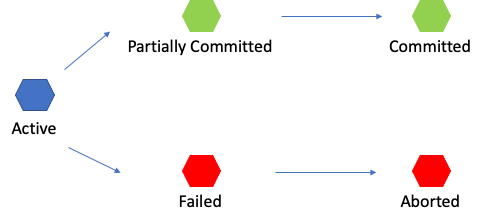

# Transaction

### 트랜잭션 (Transaction)
- 트랜잭션이란 데이터베이스의 상태를 변화시키기 위해 수행하는 작업 단위
- 작업단위란 사용자가 특정 기능 수행을 위해 SQL 작업을 묶은 단위
- 질의어(SELECT, INSERT, DELETE, UPDATE)를 이용하여 데이터베이스를 접근하는 것을 의미
- 주요 예시에는 송금 서비스가 있음. A가 B에게 돈을 보냈을 때 A가 돈을 보내는 것은 성공했지만 B가 돈을 받는데 성공하지 못하였다면 서비스에 문제가 발생. 해당 상황처럼 하나의 연관된 작업들(송금 과정이 하나의 작업 단위)을 묶은 것이 작업단위, 즉 트랜잭션으로 해당 작업 중 문제가 발생하면 해당 작업이 일어나기 전으로 돌아가야 함
- 트랜잭션이 성공적으로 마무리되었다면 commit 을 호출하여 수정 사항을 DB에 영구적으로 반영하고 중간에 오류가 발생 했다면 rollback을 호출해서 트랜잭션 내부의 모든 작업을 원상복귀시킴


<br>

### 트랜잭션 특징 (ACID)
> #### 원자성 (Atomicity)
>- 트랜잭션이 DB에 모두 반영되거나 혹은 반영되지 않아야 함
>
> #### 일관성 (Consistency)
>- 트랜잭션의 작업 처리 결과는 항상 이관성 있어야 함
>
> #### 독립성 (Isonlation)
>- 둘 이상의 트랜잭션이 동시에 병행 실행되고 있을 때, 어떤 트랜잭션도 다른 트랜잭션 연산에 끼어들 수 없음
>
> #### 지속성 (Durability)
>- 트랜잭션이 성공적으로 완료되었으면, 결과는 영구적으로 반영되어야 함

<br>

### 트랜잭션 연산
> #### Commit
>- 하나의 트랜잭션이 성공적으로 끝났고, DB가 일관성 있는 상태일 때 이를 알려주기 위해 사용하는 연산
> #### Rollback
>- 하나의 트랜잭션 처리가 비정상적으로 종료되어 트랜잭션 원자성이 깨진 경우
>- transaction이 정상적으로 종료되지 않았을 때, last consistent state Transaction의 시작상태로 되돌아감

<br>


### 트랜잭션의 상태
1. Active
    - 트랜잭션이 현재 실행 중인 상태
2. Failed
    - 트랜잭션이 실행되다 오류가 발생해서 중단된 상태
3. Aborted
    - 트랜잭션이 비정상 종료되어 Rollback이 수행된 상태
4. Partially Committed
    - 트랜잭션의 연산이 마지막까지 실행되고 Commit이 되기 직전 상태
5. Committed
    - 트랜잭션이 성공적으로 종료되어 Commit 연산을 실행한 후의 상태

<br>

### 회복 기법
- 데이터베이스는 모순이 없는 일관된 상태로 유지되어야 함
- 장애가 발생 시 회복 기능을 제공해 관리되어 지는데 여기서 회복이란 데이터베이스를 장애가 발생하기 전의 일관된 상태로 복귀시키는 것을 의미
- 회복 기법에는 크게 4가지가 존재하고 데이터베이스 관리 시스템에 있는 회복 관리자가 담당 -> 회복 관리자는 장애 발생을 탐지하고 장애가 탐지되면 데이터베이스로 복구하는 기능 제공

>#### Immediate update (즉시 갱신)
>- 로그 기반 회복 기법
>- 트랜잭션 수행 도중 변경하면 변경 정보를 로그 파일에 저장하고, 트랜잭션이 부분 완료되기 전이라도 모든 변경 내용을 즉시 데이터베이스에 반영하는 기법
>- 로그 파일을 참조하여 REDO, UNDO 연산 모두 실행
>#### Deferred updates (지연 갱신)
>- 로그 기반 회복 기법
>- 트랜잭션이 부분 완료 상태에 이르기까지 발생한 모든 변경 내용을 로그 파일에만 저장하고 데이터베이스에는 커밋이 발생할 때까지 저장하는 기법. 회복 과정에서 UNDO가 필요 없음
>- 이를 통해 트랜잭션의 원자성 보장
>#### Checkpoint recovery
>- 이전은 신경쓰지 않고 Checkpoint 이후만 즉시 갱신 혹은 지연 갱신을 수행
>- 가장 최근 Checkpoint 지점을 찾아 그 시점 이후의 로그만을 회복 대상으로 함
>#### Media recovery
>- 디스크와 같이 비 휘발성 저장 장치의 내용이 손상되는 장애가 발생했을 시에 회복을 위한 기법으로 백업, 미러링 등을 이용해 복구
```
데이터베이스의 장애
1. 트랜잭션 장애
2. 시스템 장애
    - 하드웨어 결함
3. 미디어 장애
    - 디스크 장치 결함
```

<br>

### 주 사용 연산
>1. #### UNDO 
>- 로그를 이용해 지금까지 실행된 모든 변경 연산을 취소하여 데이터베이스를 원래의 상태로 복구 -> 변경 중이었거나 이미 변경된 내용만 신뢰성을 잃은 경우 주로 사용
>
>2. #### REDO
>- 이미 commit한 트랜잭션의 수정을 재반영하는 복구 작업
>- 가장 최근에 저장한 데이터베이스 복사본을 가져온 후 로그를 이용해 복사본이 만들어진 이후에 실행된 모든 변경 연산을 재실행하여 장애가 발생하기 직전의 상태로 복구 -> 전반적으로 손상된 경우에 주로 사용
>- Buffer 관리 정책에 영향을 받음

<br>

<div style="text-align: right">22-07-22</div>

-------

## Reference
- https://gyoogle.dev/blog/computer-science/data-base/Transaction.html
- https://devjem.tistory.com/27
- https://brunch.co.kr/@skeks463/27