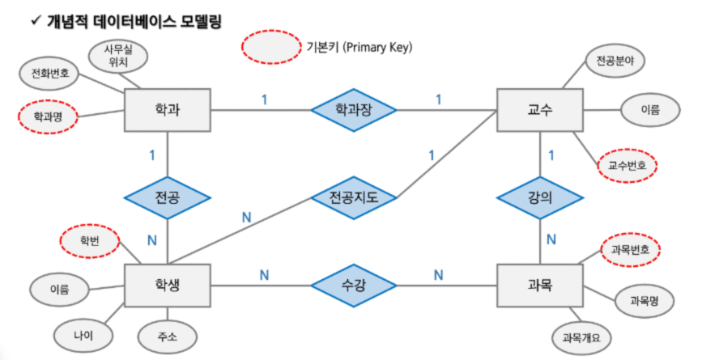

# Database Modelling

### 데이터베이스 모델링
- 정보화 시스템을 구축하기 위해 어떤 데이터가 존재하는지 또는 업무에 필요한 정보는 무엇인지 분석하는 방법
- 관계형 데이터베이스는 이 '표'의 개념을 사용해서 데이터를 구성하는 방법을 사용

<br>

### 데이터베이스 모델링 과정
#### 1. 요구사항 수집 및 분석
- 현실 세계의 대상 및 사용자의 요구 등을 정리 및 분석
    - 사용자 식별
    - 데이터베이스 용도 식별
    - 사용자 요구사항 수집 및 명세

<br>

#### 2. 개념적 모델링
- 중요 개념을 구분
    - 핵심 개체(독립 개체) 도출
    - ERD 작성

<br>

#### 3. 논리적 모델링
- 각 개념을 구체화
    - ERD : RDBMS에 맞게 mapping
    - 상세 속성 정의
    - 정규화 등

<br>

#### 4. 물리적 모델링
- 데이터베이스 생성 계획에 따라 개체, 인덱스 등을 생성
    - DB 개체 정의
    - 테이블 및 인덱스 등 설계

<br>

### 개념적 데이터베이스 모델링
- 업무분석 단계에서 얻어진 내용을 토대로 우선 Entity를 추출하고 Entity내에 속성(Attribute)을 구성하며 Entity 간의 관계를 정의해서 ER-Diagram을 정의하는 단계
1. 사용자 부문의 처리현상을 분석
2. 중요 실체와 관계를 파악하여 ERD를 작성
3. 실체에 대한 상세 정의
4. 식별자를 정의하고 식별자 업무규칙을 정함
5. 실체별로 속성을 상세화
6. 필요한 속성 및 영역을 상세 정의
7. 속성에 대한 업무 규칙을 정의
8. 각 단계를 마친 후 사용자와 함께 모델을 검토

<br>

### 개념적 데이터베이스 모델링 요소
#### 개체 (Entity)
- 사용자와 관계가 있는 주요 객체로써 업무 수행을 위해 데이터로 관리되어져야 하는 사람, 사물, 장소, 사건 등을 개체라고 함
- Entity를 찾는 방법은 다음과 같음
    - 영속성으로 존재하는 것
    - 새로 식별이 가능한 데이터 요소를 가짐
    - Entity는 반드시 Attribute를 가져야함
    - 명사적 표현

#### 속성 (Attribute)
- 저장할 필요가 있는 실체에 관한 정보
- 개체(Entity)의 성질, 분류, 수량, 상태, 특성 등을 나타내는 세부사항
- 개체에 포함되는 속성의 숫자는 10개 내외로 하는 것이 바람직함
- 최종 DB 모델링 단계를 통해 테이블 컬럼으로 활용
- 속성의 유형은 다음과 같음
    - 기초속성 : 원래 갖고 있는 속성으로 현업에서 기본적으로 사용되는 속성
    - 추출속성 : 기초 속성으로부터 계산(가공)에 의해 얻어질 수 있는 속성
    - 설계속성 : 실제로 존재하지 않으나 시스템의 효율성을 도모하기 위해 설계자가 임의로 부여하는 속성

#### 식별자
- 한 개체(Entity) 내에서 인스턴스를 유일하게 구분할 수 있는 단일 속성 또는 속성 그룹
- 식별자는 다음과 같이 분류됨
    - 후보키 (Candidate Key) : 개체내에서 각각의 인스턴스를 구분할 수 있는 속성으로 기본키가 될 수 있는 후보 속성
    - 기본키 (Primary Key) : 개체에서 각 인스턴스를 유일하게 식별하는데 가장 적합한 Key, 기본키 설정 시 고려할 사항으로 해당 실체를 대표할 수 있을 것, 업무적으로 활용도가 높을 것, 길이가 짧을 것 등이 있음
    - 대체키 (Alternate Key) : 후보키 중에서 기본키로 선정되지 않은 속성
    - 복합키 (Composite Key) : 하나의 속성으로 기본키가 될 수 없는 경우 둘 이상의 컬럼을 묶어서 식별자로 정의하는 경우
    - 대리키 (Surrogate Key) : 식별자가 너무 길거나 여러 개의 속성으로 구성되어 있는 경우에 인위적으로 추가할 식별자

#### 관계 (Relationship)
- 두 Entity 간의 업무적인 연관성 또는 관련 사실
- 각 Entity 간에 특정한 존재여부를 결정
- 현재의 관계 뿐만아니라 장래에 사용될 경우도 고려해야 함
- E-R Diagram 으로 관계를 설정하는 순서는 다음과 같음
    1. 관계가 있는 두 실체를 실선으로 연결하고 관계를 부여
    2. 관계 차수를 표현
    3. 선택성을 표시

```
관계가 있는 실체를 실선으로 연결하고 관계는 마름모로 표현

차수성 (cardinality)
- 한 실체의 하나의 인스턴스가 다른 실체의 몇 개의 인스턴스와 관련될 수 있는가를 정의
- 경우에 따라 발생 횟수를 조사
- 양쪽 방향 모두 조사

차수성의 종류
- 1:1 (일대일) : 두 실체의 레코드가 서로 하나씩 대응
- 1:N (일대다) : 부모 실체의 하나의 레코드가 자식 실체의 여러 레코드에 대응
- N:N (다대다) : 양 쪽 실체 간에 여러 개의 레코드와 관계를 맺을 수 있는 경우

선택성 (optionality)
- 선택적(optional)인지 반드시(mandatory)인지를 표시
- 일반적이고 상식적인 선에서 먼저 판단
- 항상 그 관계를 만족해야만 하는지 파악
- 관계가 만족되지 않는 경우를 찾아보고 하나라도 만족되지 않는 경우가 있으면 optional로 표시
- 양쪽 방향 모두 조사
```



<br>

### 논리적 데이터베이스 모델링
- 개념적 데이터베이스 모델링 단계에서 정의된 ER-Diagram을 Mapping Rule을 적용하여 관계형 데이터베이스 이론에 입각한 스키마를 설계하는 단계와 이를 이용하여 필요하다면 정규화하는 단계로 구성

#### 기본키 (Primary Key)
- 후보키 중에서 선택한 주 키
- 널(Null)의 값을 가질 수 없음 (Not Null)
- 동일한 값이 중복해서 저장될 수 없음 (Unique)

#### 참조키, 아웃키 (Foreign Key)
- 관계를 맺는 두 엔티티에서 서로 참조하는 릴레이션의 attribute로 지정되는 키

<br>

#### 논리적 데이터베이스 모델링 매핑 
- 개념적 데이터베이스 모델링에서 도출된 개체 타입과 관계 타입의 테이블 정의
    - 단순 엔티티 : 테이블
    - 속성 : 컬럼
    - 식별자 : 기본키
    - 관계 : 참조키, 테이블

<br>

### 논리적 데이터베이스 모델링 정규화
- Attribute 간에 존재하는 함수적 종속성을 분석해서 관계형 스키마를 더 좋은 구조로 정제해 나가는 일련의 과정
- 데이터의 중복을 제거하고 속성들을 본래의 제자리에 위치 시키는 것
    1. 제 1 정규화
    2. 제 2 정규화
    3. 제 3 정규화

#### 제 1 정규화
- 반복되는 그룹 속성을 제거한 뒤 기본 테이블의 기본키를 추가해 새로운 테이블을 생성하고 기존의 테이블과 1:N 관계를 형성하는 과정
- 반복되는 그룹 속성이란 같은 성격과 내용의 컬럼이 연속적으로 나타나는 컬럼을 말함
- 제 1 정규화 전 테이블은 부수적인 데이터를 저장하기 위해 기본 데이터가 중복됨

- 정규화 전 예시

| 학생ID | 이름   | 수강과목1  | 수강과목2  | 수강과목3  |
|--------|--------|------------|------------|------------|
| 1      | 김철수 | 수학       | 영어       | 과학       |
| 2      | 이영희 | 국어       | 수학       | 영어       |

- 정규화 후 예시

학생 테이블:
| 학생ID | 이름   |
|--------|--------|
| 1      | 김철수 |
| 2      | 이영희 |

수강 과목 테이블:
| 학생ID | 수강과목 |
|--------|----------|
| 1      | 수학     |
| 1      | 영어     |
| 1      | 과학     |
| 2      | 국어     |
| 2      | 수학     |
| 2      | 영어     |


<br>

#### 제 2 정규화
- 복합키(Composite Primary Key)에 전체적으로 의존하지 않는 속성 제거
- 제 2 정규화의 대상이 되는 테이블은 키가 여러 컬럼으로 구성된 경우
- 복합키의 일부분에 의해 종속되는 것을 부분적 함수 종속 관계라 하며 이를 제거하는 작업

- 정규화 전 예시

주문 테이블:
| 주문ID | 상품ID | 상품명   | 가격   | 수량   |
|--------|--------|----------|--------|--------|
| 1      | 1001   | 노트북   | 1,500  | 2      |
| 2      | 1002   | 스마트폰 | 800    | 1      |
| 3      | 1001   | 노트북   | 1,500  | 3      |

- 정규화 후 예시

주문 테이블:
| 주문ID | 상품ID | 수량   |
|--------|--------|--------|
| 1      | 1001   | 2      |
| 2      | 1002   | 1      |
| 3      | 1001   | 3      |

상품 테이블:
| 상품ID | 상품명   | 가격   |
|--------|----------|--------|
| 1001   | 노트북   | 1,500  |
| 1002   | 스마트폰 | 800    |


<br>

#### 제 3 정규화
- 기본키에 의존하지 않고 일반 컬럼에 의존하는 컬럼들을 제거
- 이행적 함수 종속관계를 갖는 컬럼을 제거하는 과정
- 주문테이블에서 키가 아닌 모든 컬럼은 기본키인 주문 코드에 종속적인지 검증한다

- 정규화 전 예시

직원 테이블:
| 직원ID | 부서ID | 부서명   | 부서장   |
|--------|--------|----------|----------|
| 1      | 101    | 영업부   | 김영수   |
| 2      | 102    | 인사부   | 박미정   |
| 3      | 101    | 영업부   | 김영수   |

- 정규화 후 예시

직원 테이블:
| 직원ID | 부서ID |
|--------|--------|
| 1      | 101    |
| 2      | 102    |
| 3      | 101    |

부서 테이블:
| 부서ID | 부서명   | 부서장   |
|--------|----------|----------|
| 101    | 영업부   | 김영수   |
| 102    | 인사부   | 박미정   |

<br>

### 물리적 데이터베이스 모델링
- 논리적 데이터베이스 모델링 단계에서 얻어진 데이터베이스 스키마를 좀 더 효율적으로 구현하기 위한 작업
- DBMS 특성에 맞게 실제 데이터베이스 내의 개체들을 정의하는 단계
- 데이터 사용량 분석과 업무 프로세스 분석을 통해서 보다 효율적인 데이터베이스가 될 수 있도록 효과적인 인덱스를 정의하고 상황에 따른 역정규화 작업을 수행
    - Index, Trigger, 역정규화

#### 역 정규화 (DeNomalization)
- 시스템 성능을 고려하여 기존 설계를 재구성하는 것
- 정규화에 위배되는 행위
- 테이블의 재구성

#### 역 정규화 방법
- 데이터 중복 (컬럼 역정규화)
    - 조인 프로세스가 많아 시스템의 성능 저하를 가져오는 경우
    - 조인 프로세스를 줄이기 위해 해당 컬럼을 중복함으로써 성능을 향상시키기 위한 방법
- 파생 컬럼의 생성
    - 기본적으로 테이블에 없는 컬럼을 숫자 연산이나 데이터 조작 등을 통해 조회할 때 새로운 정보를 보여주는 경우
    - 판매테이블의 판매금액 컬럼이나 성적 테이블의 총점과 평균
- 테이블 분리
    - 컬럼 기준으로 분리 (컬럼 수)
    - 레코드 기준으로 분리 (레코드 양)
- 요약 테이블 생성 (Summary Table)
    - 조회의 프로세스를 줄이기 위해 요약된 정보만을 저장하는 테이블을 만드는 것
- 테이블 통합
    - 분리된 두 테이블이 시스템 성능에 영향을 끼칠 경우 고려