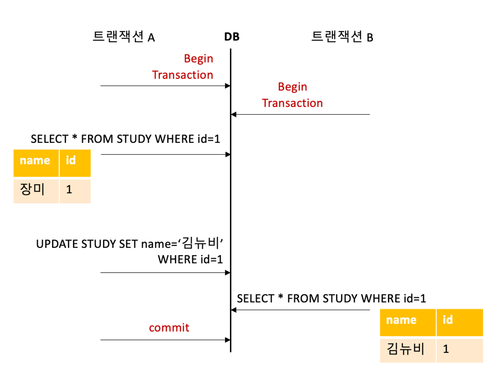
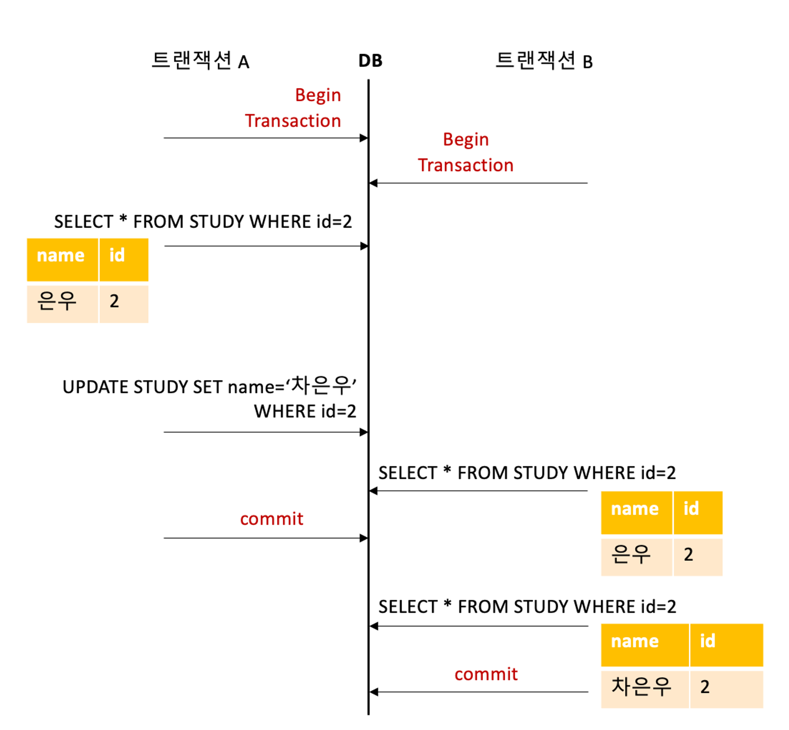
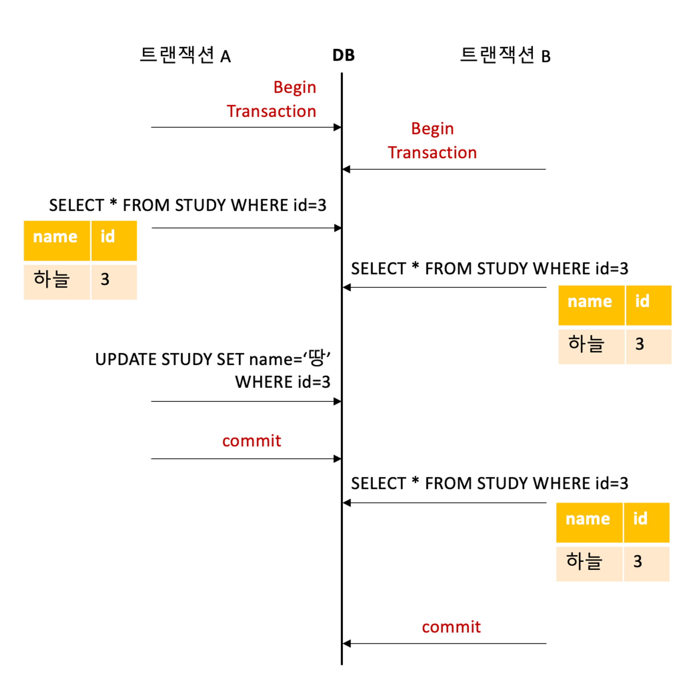
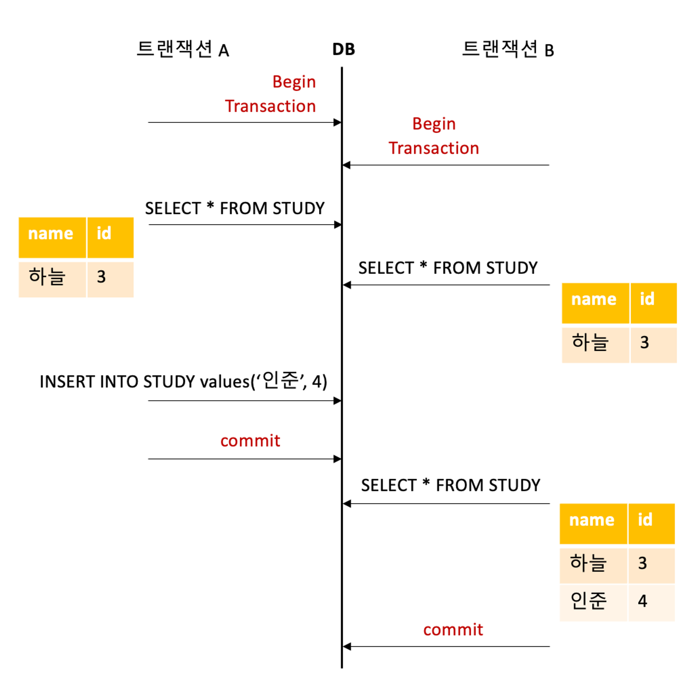

# Transaction Isolation Level

### Transaction Isolation Level (트랜잭션 격리 수준)
- 동시에 여러 트랜잭션이 처리될 때, 특정 트랜잭션이 다른 트랜잭션에서 변경하거나 조회하는 데이터를 볼 수 있도록 허용할지 말지 결정하는 것
- 여러 트랜잭션이 동시에 실행될 때 발생할 수 있는 데이터 일관성 문제를 해결하는 역할을 함

 

#### 1. read uncommitted
- 커밋 전의 트랜잭션 데이터 변경 내용을 다른 트랜잭션이 읽을 수 있도록 허용
- 트랜잭션 A가 아직 커밋되지 않은 상태에서 트랜잭션 B가 DB를 조회하면, 변경된 트랜잭션 A의 값을 볼 수 있게됨
- 트랜잭션 A가 일을 다 수행하지 않고 commit 되기 전이므로 롤백될 수도 있는데 롤백 전 무효가 된 데이터를 읽을 수 있는 Dirty Read 발생

 

#### 2. read committed
- read하는 시간을 기준으로 그 전에 commit된 데이터를 읽음
    - 트랜잭션 시작 이후 데이터를 읽을 시점에 commit 되어 있는 데이터를 읽음
    - 커밋된 데이터를 읽으므로 Dirty Read를 방지
- 다른 트랜잭션이 커밋한 변경 사항을 즉시 반영하여 읽을 수 있음
- 동일한 트랜잭션에서 동일한 데이터를 여러번 읽을 때 처음 읽을 때와 이후 읽은 데이터가 다른 Non-repeatable Read(반복 불가능한 읽기)가 발생할 수 있음
    - 다른 트랜잭션에서 작업을 처리하여 해당 데이터가 중간에 커밋되었을 경우

 

 

#### 3. repeatable read
- 트랜잭션 시작 시간을 기준으로 그 전에 commit된 데이터를 읽음
    - 읽기를 진행하기 전 트랜잭션의 시작 시간이 기준
    - 트랜잭션 벙위 내에서 조회한 내용이 항상 동일함을 보장
- 트랜잭션이 시작된 이후, 다른 트랜잭션이 커밋한 변경 사항을 반영하지 않음
    - 처음 읽은 데이터를 트랜잭션이 끝날 때 까지 동일하게 읽을 수 있음
- 트랜잭션 내에서 동일한 데이터를 여러 번 읽더라도 같은 결과를 보장하여 Non-repeatable Read(반복 불가능한 읽기)를 방지
- 트랜잭션 동안 새로운 행이 삽입되거나 삭제되는 Phantom Read는 여전히 발생할 수 있음
    - 즉, 팬텀 리드란 트랜잭션이 실행되는 동안 발생할 수 있는 일관성 문제 중 하나로 한 트랜잭션이 같은 쿼리를 두 번 이상 실행했을 때, 이 쿼리 사이에 새로운 행을 삽입하거나 삭제하여 결과 집합에 "유령" 같은 행이 추가되거나 사라지는 현상을 의미
    - 팬텀 리드는 read uncommitted, read committed, repeatable read 모두 발생할 수 있음

 

#### 4. serializable
- 한 트랜잭션에서 사용하는 데이터는 다른 트랜잭션에서 접근할 수 없음
- 트랜잭션의 ACID 성질이 엄격하게 지켜지나 성능은 가장 떨어지는 방법
- 단순한 SELECT 문만으로도 트랜잭션이 커밋될 때까지 모든 데이터에 잠금(Lock)이 설정되어 다른 트랜잭션에서 해당 데이터 접근을 제한

 

### 트랜잭션 격리 수준 설정 기준
- 데이터 일관성 요구
    - 높은 일관성 필요 시 Repeatable Read 혹은 Serializable 등의 높은 격리 수준
    - 금융 애플리케이션에서는 높은 수준의 일관성이 요구되므로 Serializable 수준이 적합
- 성능 요구
    - 성능 우선 시 낮은 격리 수준(Read Uncommitted, Read Committed)
    - 고성능이 중요한 웹 애플리케이션에서는 Read Committed가 일반적으로 선택됨
- 데이터베이스 락의 경우 트랜잭션 격리 수준을 구현하는 기법 중 하나로, 트랜잭션이 데이터에 접근하는 동안 다른 트랜잭션이 해당 데이터에 동시에 접근하는 것을 제어함
    - 즉, 데이터베이스 락은 트랜잭션 격리 수준에 맞춰 사용되는 동시성 제어 기법
    - 공유 락(Shared Lock): 여러 트랜잭션이 동시에 읽기 가능. 데이터 수정 불가
    - 배타 락(Exclusive Lock): 트랜잭션이 데이터를 읽거나 쓸 수 없도록 제한. 데이터 수정 가능

 

## Ssafy Wizards CS Study

### 1. 모든 DBMS가 4개의 레벨을 모두 구현하는지
- 모든 DBMS가 트랜잭션 격리 수준의 4가지 레벨을 모두 구현하는 것은 아니며 DBMS 마다 지원하는 격리 수준이 다르고, 격리 수준을 구현하는 방법도 다를 수 있음

#### 1. Oracle
- 지원하는 격리 수준: Read Committed, Serializable
- Read Uncommitted와 Repeatable Read는 명시적으로 지원하지 않지만, 기본적으로 Read Committed를 사용하고 필요에 따라 Serializable을 선택할 수 있음

#### 2. MySQL
- 지원하는 격리 수준: Read Uncommitted, Read Committed, Repeatable Read, Serializable
- MySQL은 4가지 격리 수준을 모두 지원하며, 기본적으로 Repeatable Read를 사용

#### 3. PostgreSQL
- 지원하는 격리 수준: Read Committed, Repeatable Read, Serializable
- PostgreSQL은 Read Uncommitted를 명시적으로 지원하지 않으며, 기본적으로 Read Committed를 사용하고, Repeatable Read는 Serializable과 유사하게 동작함

#### 4. SQL Server:
- 지원하는 격리 수준: Read Uncommitted, Read Committed, Repeatable Read, Serializable
- 4가지 격리 수준을 모두 지원하며, 기본적으로 Read Committed를 사용함

 

### 2. 만약 MySQL을 사용하고 있다면, (InnoDB 기준) Undo 영역과 Redo 영역
- InnoDB 는 MySQL 8.0 이후 기본 스토리지 엔진으로 Undo 영역과 Redo 영역을 제공
- Undo 영역과 Redo 영역은 트랜잭션 처리와 데이터 무결성 보장을 위해 중요한 역할을 하는 두 가지 핵심적인 저장 영역
- 이 두 영역은 데이터베이스가 트랜잭션을 관리하고 장애 발생 시 데이터를 복구하는 데 사용

#### 1. Undo 영역
- Undo 영역은 트랜잭션의 롤백을 지원하기 위해 트랜잭션이 수행하는 동안 데이터의 이전 상태(변경 전의 데이터)를 저장하는 영역
    - InnoDB는 트랜잭션이 커밋될 때마다 변경 내용을 Redo 로그에 기록하는데, 이 로그는 Redo 로그 버퍼에 먼저 저장됨
    - 이 버퍼는 메모리에 위치하며, 로그를 즉시 디스크에 기록하지 않고, 일정 크기나 시간이 경과한 후에 디스크로 플러시(flush)하여 한꺼번에 디스크에 기록하여 디스크 I/O를 줄이고 성능을 최적화할 수 있음
    - 위의 리두 로그의 지연 플러시(Delayed Flush)는 디스크에 기록하는 타이밍을 조절해 성능을 높일 수 있지만 이 경우 장애가 발생하면 일부 커밋된 트랜잭션의 로그가 유실될 위험이 있어 버퍼를 너무 오래 유지하면 좋지 않음
- 트랜잭션이 실패하거나 롤백될 때, Undo 영역에 저장된 이전 데이터를 사용하여 데이터베이스를 트랜잭션이 시작되기 전의 상태로 복원가능하게 함
- 트랜잭션이 커밋되면 Undo 데이터는 더 이상 필요하지 않게 되므로 제거됨
    - 하지만 가장 상위 트랜잭션이 종료되지 않고 계속 활성화되어 있다면 해당 언두로그를 계속 보존하므로 저장 공간이 계속 증가하게 되는데 MySQL8.0 에서는 언두 로그를 돌아가면서 순차적으로 사용해 디스크 공간을 줄이는 것이 가능
    - 또한 MySQL 서버가 필요한 시점에 사용 공간을 자동으로 줄여주기도 함
- InnoDB의 MVCC(Multi-Version Concurrency Control) 메커니즘에 의해, 현재 진행 중인 트랜잭션과 다른 트랜잭션이 동시에 데이터에 접근할 때, Undo 영역에 있는 데이터를 사용하여 일관된 읽기(consistent read)를 제공

#### 2. Redo 영역
- Redo 영역은 데이터베이스의 지속성(Durability)을 보장하기 위해, 트랜잭션이 변경한 데이터를 기록하는 로그 영역
    - 이 로그는 예상치 못한 시스템 장애가 발생했을 때, 데이터베이스를 복구하는 데 사용됨
    - 비 정상적으로 종료되었을 때 커밋됬지만 데이터 파일에 기록되지 않은 데이터와 롤백됬지만 데이터 파일에 이미 기록된 데이터를 방지
    - Undo 로그는 관련 트랜잭션들이 모두 커밋되거나 롤백될 때까지 삭제되지 않고, 일정 기간 동안 보관되고 있다가 InnoDB의 백그라운드 작업에 의해 지연되어 삭제됨
- 시스템 충돌이나 장애 발생 시 Redo 로그를 사용해 커밋된 트랜잭션의 변경 사항을 재적용함으로써 데이터 손실을 방지
    - Redo 로그는 쓰기 비용이 낮은 자료구조를 가짐
- 트랜잭션이 커밋될 때, 관련 변경 사항은 디스크에 기록되기 전에 먼저 Redo 로그에 저장됨. 이를 통해 장애 발생 시에도 커밋된 데이터는 복구할 수 있음
- 트랜잭션이 변경한 데이터가 메모리에서 실제 데이터 파일로 기록되기 전에, InnoDB는 먼저 그 변경 내용을 Redo 로그에 기록하므로 시스템 장애가 발생한 경우, Redo 로그를 사용하여 마지막으로 커밋된 트랜잭션의 상태로 데이터베이스를 복구할 수 있음

 

### 3. 스토리지 엔진
- 데이터베이스 관리 시스템(DBMS) 내에서 데이터를 실제로 저장하고, 조회하고, 수정하는 방식을 관리하는 핵심 구성 요소
- 데이터베이스의 테이블, 인덱스, 트랜잭션 처리, 락킹 메커니즘 등과 같은 기능들을 구현하는 역할을 수행
- 스토리지 엔진의 주요 기능은 다음과 같음
    - 데이터 저장 및 조회: 데이터를 파일 시스템에 저장하고 검색
    - 인덱싱: 데이터를 빠르게 검색하기 위한 인덱스 관리
    - 트랜잭션 관리: 트랜잭션의 ACID 속성 보장
    - 락킹 및 동시성 제어: 트랜잭션 간 충돌 방지 및 동시성 관리
    - 복제 및 백업 지원: 데이터베이스 복제, 백업, 복구 기능 제공

 

#### MySQL 주요 스토리지 엔진 차이

| 기능                        | InnoDB                      | MyISAM                      | Memory (Heap)               | CSV                         |
|-----------------------------|-----------------------------|-----------------------------|-----------------------------|-----------------------------|
| **데이터 저장 및 조회**     | 디스크 기반 저장, ACID 보장 | 디스크 기반 저장, 빠른 읽기 | 메모리 기반 저장, 고속 접근 | CSV 파일 기반 저장          |
| **인덱싱**                  | B-Tree 인덱스, 풀텍스트 인덱스 | B-Tree 인덱스, 풀텍스트 인덱스 | 해시 인덱스, B-Tree 인덱스    | 인덱스 지원하지 않음        |
| **트랜잭션 관리**           | 지원 (ACID 보장)            | 지원하지 않음               | 지원하지 않음               | 지원하지 않음               |
| **락킹 및 동시성 제어**     | 레코드 수준 락              | 테이블 수준 락              | 테이블 수준 락              | 지원하지 않음               |
| **복제 및 백업 지원**       | 지원 (데이터 무결성 유지)   | 지원 (빠른 백업)            | 비영구적 데이터, 재시작 시 초기화 | 데이터 교환 용이            |

 

#### MySQl 엔진
- MySQL 서버는 MySQL 엔진(SQL 레이어)과 스토리지 엔진으로 구성됨
- MySQL 엔진의 역할은 다음과 같음

| 기능                        | MySQL 엔진 구성 요소        | 설명                                                      |
|-----------------------------|-----------------------------|-----------------------------------------------------------|
| **커넥션 핸들러**           | MySQL 엔진                | 클라이언트 연결을 처리하고, 쿼리 실행 요청을 관리  |
| **캐시 버퍼**               | MySQL 엔진                | 쿼리 결과, 인덱스, 데이터 페이지 등을 캐싱하여 성능을 향상시킴 |
| **옵티마이저**              | MySQL 엔진               | 쿼리 실행 계획을 생성하고, 최적화된 방법으로 쿼리를 실행 |
| **SQL파서**                    | MySQL 엔진               | SQL 문법을 분석하여 쿼리를 이해하고 실행 계획을 준비 |
| **SQL인터페이스**              | MySQL 엔진               | 사용자와 MySQL 서버 간의 통신을 관리하며, SQL 명령을 받아들임 |
| **데이터 저장 및 조회**     | 스토리지 레이어        | 데이터를 파일 시스템에 저장하고, 조회하는 기능을 담당 |
| **트랜잭션 관리**           | 스토리지 레이어        | 트랜잭션의 ACID 특성을 관리하고, 데이터 무결성을 보장 |
| **락킹 및 동시성 제어**     | 스토리지 레이어        | 데이터에 대한 접근 제어와 트랜잭션 간의 충돌을 관리 |
| **인덱싱**                  | 스토리지 레이어        | 데이터를 빠르게 검색할 수 있도록 인덱스를 관리     |
| **복제 및 백업 지원**       | 스토리지 레이어        | 데이터의 복제와 백업을 통해 고가용성과 데이터 보호를 지원 |

### Reference
- https://unequaled-peach-7e5.notion.site/DB-8987ed9cf61b4492971483ec2bcdae78