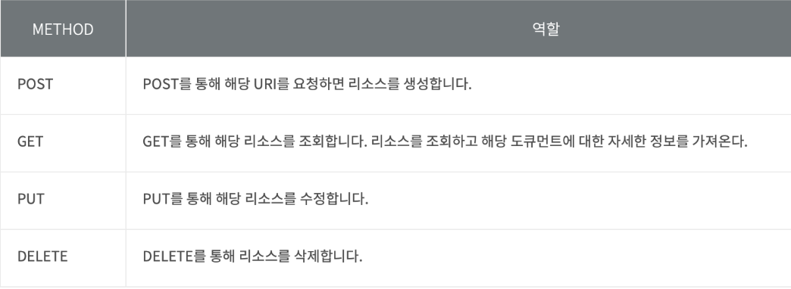
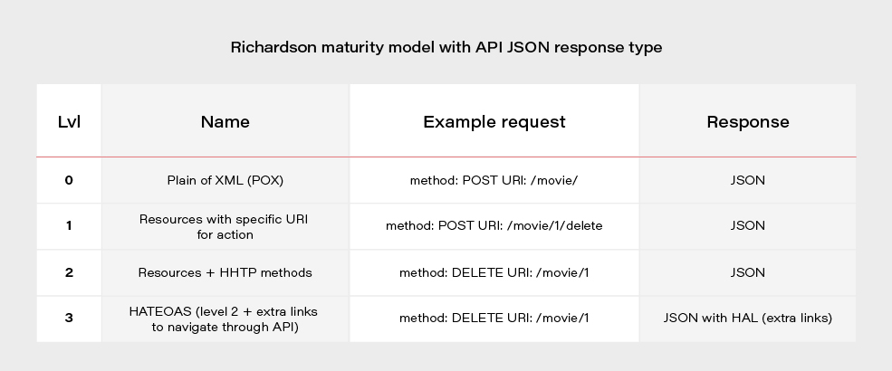

# REST API

### REST API란?
- REST API에서 REST는 Representational State Transfer 의 약자로 소프트웨어 프로그램 아키텐처의 한 형식입니다.
- 즉, 자원을 이름 (자원의 표현)으로 구분하여 해당 자원의 상태(정보)를 주고 받는 모든 것을 의미
- 월드 와이드 웹 (WWW)과 같은 분산 하이퍼미디어 시스템을 위한 소프트웨어 개발 아키텍처의 한 형식
- REST는 기본적으로 웹의 기존 기술과 HTTP 프로토콜을 그대로 활용하기 때문에 웹의 장점을 최대한 활용할 수 있는 아키텍처 스타일이다.

<br>

### REST 개념
- HTTP URI를 통해 자원을 명시하고, HTTP Method (POST, GET, PUT, DELETE)를 통해 해당 자원에 대한 CRUD OPERATION을 적용하는 것을 의미한다.
- 즉, REST는 자원 기반의 구조 (ROA: Resource Oriented Architecture) 설계의 중심에 Resource가 있고 HTTP Method를 통해 Resource를 처리하도록 설계된 아키텍처를 의미
- 웹의 모든 자원에 고유한 ID인 HTTP URI를 부여

<br>

### REST API의 등장
- 웹의 장점을 최대한 활용할 수 있는 Architecture로써 REST 발표
- 최근 서비스/애플리케이션의 개발 흐름은 멀티 플랫폼, 멀티 디바이스 시대로 넘어와 있는데 단순히 하나의 브라우저만 지원하면 되었던 이전과는 달리, 최근의 서버 프로그램은 여러 웹 브라우저는 물론이며 아이폰, 안드로이드 애플리케이션과의 통신에 대응할 수 있어야 함
- 따라서 플랫폼에 맞추어 새로운 서버를 만드는 수고를 들이지 않기 위해 범용적으로 사용성을 보장하는 서버 디자인이 필요하게 됨

<br>

### RESTAPI 만드는 이유
- RESTful APIs 개발하는 가장 큰 이유는 Client Side를 정형화된 플랫폼이 아닌 모바일, PC, 어플리케이션 등 플랫폼에 제약을 두지 않는 것을 목표로 하였기 때문
- 2010년 이전만 해도 Server Side에서 데이터를 전달해주는 Client 프로그램의 대상은 PC 브라우저로 그 대상이 명확했음. 그렇다 보니 JSP ASP PHP 등을 이용한 웹페이지를 구성
- 이후 스마트 기기들이 등장하면서 TV, 스마트폰, 테블릿 등 Client 프로그램이 다양화되고 그에 맞춰 Server를 일일이 만다는 것이 꽤 비효율적인 일이 되어버렸음
- 이런 과정에서 개발자들은 Client Side를 전혀 고려하지 않고 메시지 기반, XML, JSON과 같은 Client에서 바로 객체로 치환가능한 형태의 데이터 통신을 지향하게 되면서 Server와 Client의 역할을 분리하게 되었음
- 이러한 변화를 통해 필요해진 것은 HTTP 표준 규약을 지키면서 API를 만드는 것

#### ❗유의사항
- 이 REST API를 개발하다보면 HTTP의 Response 규약을 지키지 않고 본인들이 만들어낸 JSON 컨벤션으로 응답하는 경우를 많이 확인 할 수 있는데 그것은 옳지 않은 개발 방향
- Client Side가 정형화 되어있지 않은 환경에서 개발 속도를 저하하는 가장 큰 이유는 표준을 지키지 않았기 때문

<br>

### REST의 특징
>1. Uniform ( 유니폼 인터페이스 ) : URI로 지정한 리소스에 대한 조작을 통일되고 한정적인 인터페이스로 수행하는 아키텍처 스타일을 말함. HTTP 표준에만 따른다면 모든 플랫폼에서 사용이 가능하며 URI로 지정한 리소스에 대한 조작 가능. 즉, 특정 언어나 기술에 종속되지 않는다
>
>2. Stateless ( 무상태성 ) : REST는 무상태성 성격을 갖습니다. 다시 말해 작업을 위한 상태정보를 따로 저장하고 관리하지 않음. 세션 정보나 쿠키정보를 별도로 저장하고 관리하지 않기 때문에 API서버는 들어오는 요청만을 단순히 처리하면 됨. 그렇게 서비스의 자유도가 높아지고 서버에서 불필요한 정보를 관리하지 않음으로써 구현이 단순해짐
>3. Cacheable ( 캐시가능 ) : REST의 가장 큰 특징중 하나는 HTTP라는 기존 웹표준을 그대로 사용하기 때문에, 기존 웹에서 사용하는 인프라 그대로 사용 가능하여 HTTP가 가진 캐싱 기능이 적용 가능하고 HTTP 프로토콜 표준에서 사용하는 Last-Modified태그나 E-Tag를 이용하면 캐싱 구현이 가능. 캐시사용을 통해 응답시간이 빨라지고 REST Server 트랜잭션이 발생하지 않기 때문에 전체 응답시간, 성능, 서버의 자원 이용률을 향상 시킬 수 있음.
>4. Self-descriptiveness ( 자체 표현 구조 ) : REST의 또 다른 큰 특징 중 하나는 REST API 메시지만 보고도 이를 쉽게 이해 할 수 있는 자체 표현 구조로 되어있는 것. 직관적임.
>5. Client-Server 구조 : REST 서버는 API 제공, 클라이언트는 사용자 인증이나 컨텍스트 ( 세션, 로그인 정보 )등을 직접 관리하는 구조로 각각의 역할이 확실히 구분되기 때문에 클라이언트와 서버에서 개발해야 할 내용이 명확해지고 서로간 의존성이 줄어들게 됨
>6. 계층형 구조 : REST 서버는 다중 계층으로 구성될 수 있으며 보안, 로드 밸런싱, 암호화 계층을 추가해 구조상의 유연성을 둘 수 있고, PROXY, 게이트웨이 같은 네트워크 기반의 중간매체를 사용할 수 있게 함.

<br>

### REST의 구성
- 자원 (Resource) - URI
- 행위 (Verb) - Http Method
- 표현 (Representations) 

>#### 1. 자원 (Resource) URI
>- 모든 자원에 고유한 ID가 존재하고, 이 자원은 Server에 존재
>- 자원을 구분하는 ID는 /orders/order_id/1와 같은 HTTP URI
>#### 2. 행위 (Verb) - HTTP Method
>- HTTP 프로토콜의 Method를 사용한다
>- HTTP 프로토콜은 GET, POST, PUT, DELETE와 같은 메서드 제공
>#### 3. 표현 ( Representation of Resource )
>- Client가 자원의 상태(정보)에 대한 조작을 요청하면 Server는 이에 적절한 응답(Representation)을 보낸다
>- REST에서 하나의 자원은 JSON, XML, TEXT, RSS 등 여러 형태의 Representation으로 나타낼 수 있다.
>- 현재는 JSON으로 주고 받는 것이 대부분

<br>

### REST API 디자인 가이드 ( REST 중심 규칙 )
>#### 1. URI는 정보의 자원을 표현해야 한다
>- URI 는 자원을 표현하는데 중점이 되어야 함
>```http
>GET : members/delete/1
>```
>- 위는 REST를 제대로 적용하지 않은 URI로 delete 같은 행위에 대한 표현이 들어가는 것은 옳지 않음, 리소스명은 동사보다는 명사 사용해야 함 
>
> 
>#### 2. 자원에 대한 행위는 HTTP Method(GET, POST, PUT, DELETE)로 표현

<br>

### REST API 세부 규칙
>1. 슬래시 구분자 (/)는 계층 관계를 나타내는데 사용한다
>
>2. URI 마지막 문자로 슬래시 (/)를 포함하지 않는다.
>       - 즉 URI에 포함되는 모든 글자는 리소스의 유일한 식별자로 사용되어야 하며 URI가 다르다는 것은 리소스가 다르다는 것
>       - 역으로 리소스가 다르면 URI도 달라져야 함.
>3. 하이픈 (-)은 URI 가독성을 높이는데 사용한다
>       - 의도치 않게 긴 리소스명을 사용해야할 경우 (-)를 사용
>4. 언더바(_)는 사용하지 않는다
>5. URI 경로에는 소문자가 적합
>6. 파일 확장자는 URI에 포함하지 않음
>       - REST API는 메시지 바디 내용의 포맷을 나타내기 위한 파일 확장자를 URI안에 포함시키지 않는다
>       - 대신 Accept Header를 사용 
>```http
>GET : http://restapi.exam.com/orders/2/Accept: image/jpg 
>``` 
>7. 리소스 간에 연관 관계가 있는 경우
        - /리소스명/리소스ID/관계가 있는 다른 리소스 명
>```http
>GET : /users/2/orders
>```

<br>

### REST의 설계 목표
>1. 컴포넌트들간의 유용한 (쉽게 확장가능한) 상호 연동성 확보
>2. 범용 인터페이스
>3. 각 컴포넌트들의 독립적인 배포
>4. 지연 감소, 보안강화, 레거시 시스템을 <code>인캡슐레이션</code> 하는 중간 컴포넌트로의 역할
>
>```
>인캡슐레이션 : 데이터에 헤더가 추가되는 과정. 즉, OS Lv7 -> Lv1로 내려가는 과정을 뜻하며 간단하게 말하면 PC에서 다른 PC로 데이터를 전송할 때 데이터를 패키지화 하는 과정
>```
>
>>1. 상호 연동성 확보
>>      - 상호 연동성은 “서로 상이한 컴포넌트”들을 쉽게 연결할 수 있는 성질을 의미. 두 개 이상의 컴포넌트들을 결합함으로써, 작업을 더 효율적으로 수행하도록 하는데 목적
>>      - REST는 HTTP와 URI 기반인데 HTTP와 URI 모두 표준이며 직관적이고 사용이 간단하며 어디에서든 동일하게 작동하는 것을 보장할 수 있음
>>2. 범용 인터페이스
>>      - 상호 연동성과 비슷한 개념으로 REST 모델을 위한 HTTP와 URI는 표준으로 어디서든지 사용가능한 범용 인터페이스를 제공
>>3. 각 컴포넌트들의 독립적인 배포
>>      - 각 컴포넌트들과의 독립적인 배포의 의미는 다른 컴포넌트들과 독립적으로 개발을 할 수 있다는 것을 의미
>>      - 규격에 맞추어 개발이 되었다면 다른 컴포넌트가 추가되어도 연동에 걱정할 것이 없음
>>4. 컴포넌트를 중계하는 역할
>>      - 클라이언트는 엔드 서버에 직접 연결할 필요 없이 서비스를 이용 가능. 그 이유는 REST 서버가 클라이언트와 엔드서버 중간에서 중계 역할을 할 수 있기 때문
>>      - 이러한 중계 서버로 이용하면 로드 밸런싱, 공유 메모리 등을 이용해서 확장성/ 성능을 향상 시킬 수 있으며 보안 정책을 적용하기도 용이

<br>

## RESTful API

### RESTful API 이란?
- RSETful은 REST를 REST 답게 쓰기 위한 방법으로 공식적으로 발표한 것은 아님
- HTTP와 URI 기반으로 자원에 접근할 수 있도록 제공하는 애플리 케이션 개발 인터페이스. 기본적으로 개발자는 HTTP 메소드와 URI 만으로 인터넷에 자료를 CRUD할 수 있음
- REST API를 제공하는 웹 서비스를 RESTful 하다고 할 수 있음

<br>

### RESTful API 개발 원칙
>1. 자원을 식별할 수 있어야 한다
>       - URI 만으로 내가 어떤 자원을 제어하려고 하는지 알 수 있어야 함. 자원을 제어하기 위해서, 자원의 위치는 물론 자원의 종류까지 알 수 있어야 함
>       - Server가 제공하는 정보는 JSON이나 XML 형태로 HTTP body에 포함되어 전송
>2. 행위는 명시적이어야 함
>       - REST는 아키텍쳐 혹은 방법론과 비슷. 해당 방식을 강제하지는 않으나 REST 아키텍쳐를 부합하지 않으면 REST를 따른다고 할 수 없음
>3. 자기 서술적이여야 한다
>       - 데이터에 대한 메타정보만 가지고도 어떤 종류의 데이터인지, 데이터를 위해서 어떤 어플리케이션을 실행해야 하는지를 알 수 있어야 함
>       - 즉, 데이터 처리를 위한 정보를 얻기 위해서 데이터 원본을 읽어야 한다면 자기 서술적이지 못함.
>4. HATEOAS ( Hypermedia as the Engine of Application State )
>       - 클라이언트 요청에 대해 응답을 할 때, 추가적인 정보를 제공하는 링크를 포함할 수 있어야 함
>       - REST는 독립적으로 컴포넌트들을 손쉽게 연결하기 위한 목적으로도 사용됨. 따라서 서로 다른 컴포넌트들을 유연하게 연결하기 위해선, 느슨한 연결을 만들어줄 것이 필요
>       - 해당 상황에 사용하는 것이 링크로 서버는 클라이언트 응용 애플리케이션에 하이퍼링크를 제공
>       - 클라이언트는 이 하이퍼링크를 통해서 전체 네트워크와 연결되며 HATEOAS는 서버가 독립적으로 진화할 수 있도록 서버와 서버, 서버와 클라이언트를 분리할 수 있게됨
>


<br>

### REST의 단점
- REST는 point-to-point 통신 모델을 기본으로 함. 따라서 서버와 클라이언트가 연결을 맺고 상호작용해야하는 어플리케이션의 개발에는 적당하지 않음
- REST는 URI, HTTP 이용한 아키텍처링 방법에 대한 내용만을 담고 있음. 보안과 통신규약 정책 같은 것은 전혀 다루지 않음. 따라서 개발자는 통신과 정책에 대한 설계와 구현을 도맡아서 진행해야 함.
- HTTP에 상당히 의존적. REST는 설계 원리이기 때문에 HTTP와는 상관없이 다른 프로토콜에서도 구현할 수 있기는 하지만 자연스러운 개발이 힘듬. 하지만 REST를 사용하는 이유가 대부분의 서비스가 웹으로 통합되는 상황이기에 큰 단점이 아니게 됨
- CRUD 4가지 메소드만 제공. 대부분의 일들을 처리할 수 있지만, 4가지 메소드 만으로 처리하기엔 모호한 표현이 있음

<br>

<div style="text-align: right">22-06-28</div>

-------

## Reference
- https://velog.io/@somday/RESTful-API-이란
- https://meetup.toast.com/posts/92
- https://joomn11.tistory.com/26