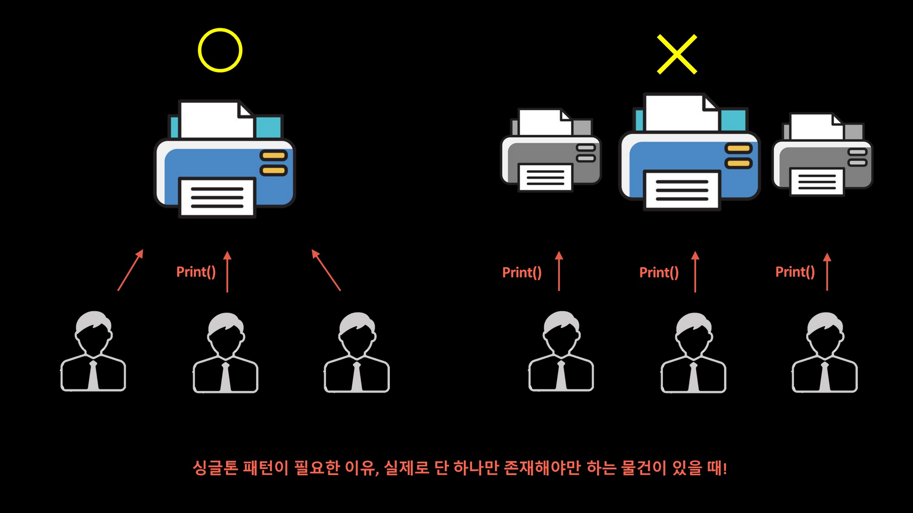

# Singleton Pattern

### Sington
- 객체의 인스턴스를 오직 1개만 생성하고 생성된 객체를 호출하는 패턴
    - 프로그램 내에서 하나의 객체만 존재해야 함
    - 프로그램 내에서 여러 부분에서 해당 객체를 공유하여 사용해야 함
- 최초 한번만 메모리를 할당하고 해당 메모리에 인스턴스를 만들어 사용하는 디자인 패턴
    - GoF 디자인패턴의 생성패턴
    - 하나의 고정된 메모리 영역을 사용하여 추후 해당 객체에 접근할 때 메모리 낭비를 방지
    - 미리 생성해둔 객체활용해 속도 이점 존재
    - 싱글톤 인스턴스가 전역으로 사용되는 인스턴스기 때문에 다른 클래스의 인스턴스들이 접근하여 사용 가능해 데이터 공유가 쉬움
- 싱글톤 패턴을 사용할 때 상태를 가진 객체를 Singleton으로 만들면 안됨 -> 상태가 공유된다는 것은 매우 위험한 일이기 때문에 무상태 객체 혹은 설계상 유일해야 하는 시스템 컴포넌트를 Singleton으로 만들어야 함
    - 여러 객체가 필요없고 객체를 구별한 피요가 없는 경우, 즉 수정 가능한 멤버 변수가 없고 기능만 있는 경우 이런 객체를 stateless한 객체라고 함

```java
// 늦은 초기화(lazy initialization) -> 아래 문제점 존재
public class Singleton {

    private static Singleton instance;
	
    private Singleton () {} //생성자를 private로
	
    public static Singleton getInstance() {
        if (instance == null){
            instance = new Singleton();
        }    
        
        return instance;
    }
}

// 이른 초기화
public class Singleton{
    private static final Singleton instance = new Singleton();

    private Singleton(){
        // 외부에서 생성이 불가능하도록 private
    }

    public static Singleton getInstance(){
        return instance;
    }
    // 해당 객체를 리턴받아 두개의 객체를 생성하고 주소값을 확인해보면 같은 주소값을 출력함
}
```

<br>


#### 싱글톤 패턴이 필요한 이유
- 위처럼 예를들어 사무실에 1대있는 프린터를 여러명이 사용하는 경우를 예시
- 가장 정상적인 프린터 사용방법은 1대만 존재하는 프린터를 여러 사람이 함께 공유하며 사용
- 프린터는 1대 이기 때문에 프린터를 사용하는 사람들이 각자 생성해서 사용하는 것은 불가능
- 사용자 정보를 처음에만 로딩해주는 UserManager 가 있다고 가정한다면, 매번 이 인스턴스를 생성하는 것은 자원 낭비 또는 인스턴스가 꼬이는 일이 생길 수 있음
- 또한 DB Connection Pool 같은 객체가 있을 때 한번만 연결한 후 끊는 것이 더 효율적


<br>

### Multi-Thread 싱글톤 문제
- 여러개의 인스턴스 생성
    - 멀티스레드 환경에서 인스턴스가 없을 때 동시에 생성하게 만들어 둔다면 각각 새로운 인스턴스 생성됨 -> 위의 늦은 초기화만 해당됨
- 변수 값의 일관성 실패
    - 여러개의 스레드에서 다른 전역변수의 값을 동시에 변경한다면 일관되지 않은 값이 생길 수 있음

<br>

#### Multi-Thread 싱글톤 해결방안 
- 정적 변수에서 인스턴스 생성
    - 위의 예시코드 처럼 static 변수로 singleton 인스턴스를 생성하는 방법으로 해결 가능
    - 초기에 인스턴스를 생성하면 멀티스레드 환경에서도 다른 객체들은 getInstance 를 통해 하나의 인스턴스를 공유할 수 있음
- synchronzied 사용
    - synchronzied 를 사용하여 동시성 문제를 해결하는 방법
    - 늦은 초기화에서 synchronzied를 사용하여 이후 호출될 때는 인스턴스가 이미 생성되어 있기 때문에 해당 synchronzied 블록에 접근 하지 않음 
    - 그러나 Thread-safe를 보장하기 위해 성능 저하가 발생함
```java
public class Singleton {

    private static Singleton instance;
	
    private Singleton () {} //생성자를 private로

    public static Singleton getInstance() {
        if (instance == null) {
            //synchroized를 활용하여 여러 인스턴스를 생성하는 것을 방지
            synchronized (Singleton.class) {
                if (instance == null)
                    instance = new Singleton();
                }
            }
        return instance;
    }
}
```

<br>

#### 싱글톤은 SOLID를 위반?
- Singleton을 사용하는 경우 대부분 인터페이스가 아닌 구현 클래스의 객체를 미리 생성해놓고 정적 메소드를 이용하여 구현하게 됨 
- 위의 설명은 SOLID 원칙을 위반할 수 있는 가능성이 있으며 동시에 Singleton을 사용하는 곳과 Singleton Class 사이에 의존성이 생기게 됨. 이는 결합도를 높이는 행위로, 수정 및 단위테스트의 어려움이 생기게 됨
- 싱글톤 패턴은 전역 상태로 이용할 수 있지만 이것은 장점이자 단점일 수도 있음. 자바에서 싱글톤의 문제점은 다음과 같아 안티패턴으로도 많이 불림
    - private 생성자를 갖고 있어 상속이 불가능
    - 테스트하기 힘듬 -> 리펙토링의 영향도는 프로그램 전체가 됨
    - 서버 환경에서는 싱글톤이 1개만 생성됨을 보장하지 못함
    - 전역 상태를 만들 수 있기 때문에 바람직하지 못함
- 위의 문제는 스프링 프레임워크를 통해 직접 객체들을 싱글톤으로 관리하면 자바 클래스에 불필요한 코드를 제거하여 객체를 재사용함과 동시에 객체지향적인 개발을 할수 있게함 -> 스프링 싱글톤을 이용하면 모든 단점들을 극복이 가능


<br>


<div style="text-align: right">22-08-15</div>

-------

## Reference
- https://tecoble.techcourse.co.kr/post/2020-11-07-singleton/
- https://velog.io/@seongwon97/싱글톤Singleton-패턴이란
- https://coding-factory.tistory.com/709
- https://velog.io/@sms8377/Structure-싱글톤-패턴과-문제점