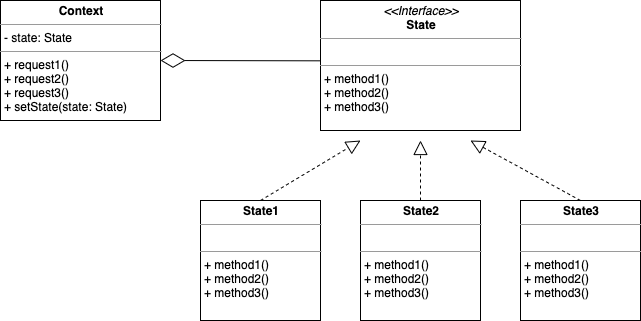

# State Pattern



### State Pattern
- 어떤 행위를 수행할 때 상태에 행위를 수행하도록 위임
- 시스템의 각 상태를 클래스로 분리해 표현 -> 상태를 객체화 하여 상태가 행동을 할 수 있도록 위임하는 패턴
- 상태 클래스를 인터페이스로 캡슐화하고, 각 클래스에서 수행하는 행위들을 메서드로 구현
- 외부로부터 캡슐화하기 위해 인터페이스를 생성하여 시스템의 각 상태를 나타나는 클래스로 실체화
    - State 
        - 시스템의 모든 상태에 공통의 인터페이스를 제공
        - 따라서 이 인터페이스를 실체화한 어떤 상태 클래스도 기존 상태 클래스를 대신해 교체해서 사용할 수 있음
    - State1, State2, State3
        - Context 객체가 요청한 작업을 자신의 방식으로 실제 실행
        - 대부분의 경우 다음 상태를 결정해 상태 변경을 Context 객체에 요청하는 역할도 수행
    - Context 
        - State를 이용하는 역할을 수행
        - 현재 시스템의 상태를 나타내는 상태 변수 (state)와 실제 시스템의 상태를 구성하는 여러 가지 변수가 있음
        - 상태 클래스에서 상태 변경을 요청해 상태를 바꿀 수 있도록 하는 메서드(setState)가 제공됨
        - Context 요소를 구현한 클래스의 request 메서드는 실제 행위를 실행하는 대신 해당 상태 객체에 행위 실행을 위임

<br>

#### 상태(state)
- 객체가 시스템에 존재하는 동안, 즉 객체의 라이프 타임동안 객체가 가질 수 있는 어떤 조건이나 상황
- 객체가 어떤 상태에 있는 동안 어떤 액티비티 등을 수행하거나 특정 이벤트 발생을 기다리는 것
- 시작 상태 : 객체가 시작하는 처음 상태
    - 시작 상태에서의 진입은 객체를 새로 생성하는 이벤트만 명시하거나 아예 어떤 것도 명시하지 않아야 함
- 상태 진입 : 객체의 한 상태에서 다른 상태로 이동하는 것
    - 특정 이벤트가 발생한 후 명세된 조건을 만적한 경우 이루어짐

<br>

#### 상태 패턴을 적용하지 않은 엘리베이터 예제
- 해당 코드가 좋지 않은 이유는 상태가 여러개가 있다면 코드는 굉장히 길어지기 때문에, 상태에 따라 하고자 하는 행위를 파악하기 쉽지 않기 때문
- 또한 pushUpButton, pushDownButton, pushStopButton 에서 같은 분기문이 적용된다면 기능이 변경될 때 마다 일일이 다 찾아가서 수정을 진행해야함
```java
// 엘리베이터 예제
public class NonElevator {
    public static final String up = "UP";
    public static final String down = "DOWN";
    public static final String stop = "STOP";
    private String curState = "";

    public NonElevator() {
        this.curState = stop;
    }

    public void setState(String state) {
        this.curState = state;
    }

    public void pushUpButton() {
        if (curState.equals(up)) {
            System.out.println("동작 없음");
        } else {
            System.out.println("올라감");
            curState = up;
        }
    }

    public void pushDownButton() {
        if (curState.equals(down)) {
            System.out.println("동작 없음");
        } else {
            System.out.println("내려감");
            curState = down;
        }
    }

    public void pushStopButton() {
        if (curState.equals(stop)) {
            System.out.println("동작 없음");
        } else {
            System.out.println("멈춤");
            curState = stop;
        }
    }
}
```

<br>

#### 상태 패턴을 적용한 엘리베이터 예제
- 상태에 따라 행위를 다르게 해야하는 경우 사용
- 상태를 캡슐화한 인터페이스를 선언하고 해당 인터페이스를 구현한 각 상태 클래스들을 정의하여 사용
```java
// 엘리베이터는 상태 인터페이스의 메서드를 호출하여 변경된 행위를 수행
public interface ElevatorState {
    public void pushUpButton();
    public void pushDownButton();
    public void pushStopButton();
}

// 해당하는 상태에서 버튼을 눌렀을 때 행동이 변화하도록 구현
// 엘리베이터는 수시로 상태가 변화하기 때문에 싱글톤으로 구현 (매번 인스턴스를 생성하지 않아 메모리 낭비를 줄임)
public class UpState implements ElevatorState {
    private static UpState upState;

    private UpState() {}

    public static UpState getInstance() {
        if (upState == null) {
            upState = new UpState();
        }
        return upState;
    }

    @Override
    public void pushUpButton() {
        System.out.println("동작 없음");
    }

    @Override
    public void pushDownButton() {
        System.out.println("내려감");
    }

    @Override
    public void pushStopButton() {
        System.out.println("멈춤");
    }
}

public class DownState implements ElevatorState {
    private static DownState downState;

    private DownState() {}

    public static DownState getInstance() {
        if (downState == null) {
            downState = new DownState();
        }
        return downState;
    }

    @Override
    public void pushUpButton() {
        System.out.println("올라감");
    }

    @Override
    public void pushDownButton() {
        System.out.println("동작 없음");
    }

    @Override
    public void pushStopButton() {
        System.out.println("멈춤");
    }
}

public class StopState implements ElevatorState {

    private static StopState stopState;

    private StopState() {}

    public static StopState getInstance() {
        if (stopState == null) {
            stopState = new StopState();
        }
        return stopState;
    }

    @Override
    public void pushUpButton() {
        System.out.println("올라감");
    }

    @Override
    public void pushDownButton() {
        System.out.println("내려감");
    }

    @Override
    public void pushStopButton() {
        System.out.println("동작 없음");
    }
}

```

<br>

#### 상태 패턴에서 상태를 변경하는 주체
- 상태 패턴을 적용할 때 고려할 문제는 Context의 상태 변경을 누가 하는가에 대한 것
- 상태 변경을 하는 주체는 Context나 상태 객체 둘 중 하나가 되는데 Context일 경우는 다음과 같음
    - Context가 상태 변경의 주체가 되었으므로 각 State 객체들은 상태를 변경할 책임이 없어져서 코드가 더 간결해짐
    - 상태 개수가 많고 상태 변경 규칙이 자주 바뀐다면 Context의 상태 변경 코드가 복잡해짐
    - Context 상태 코드가 복잡해지면 State도 원치 않은 메소드가 생겨날 수 있음
    - Context가 상태 변경의 주체가 될 때는 상태 개수와 상태 변경 규칙을 유심히 살펴봐야 함
- 반대로 상태 객체에서 Context의 상태를 변경할 경우
    - 상태 변경 규칙이 클래스에 분산되어 있어 상태 구현 클래스가 많아질수록 상태 변경 규칙을 파악하기 어려워짐
    - 한 상태 클래스에서 다른 상태 클래스에 대한 의존도가 발생하기도 함
- 두 가지 방식 모두 장단점이 명확하므로 잘 구분해서 사용하는 것이 중요

<br>

<div style="text-align: right">22-08-21</div>

-------

## Reference
- https://velog.io/@y_dragonrise/디자인-패턴-상태-패턴State-Pattern
- https://velog.io/@jinmin2216/디자인-패턴-스테이트상태-패턴-State-Pattern
- https://steady-coding.tistory.com/387