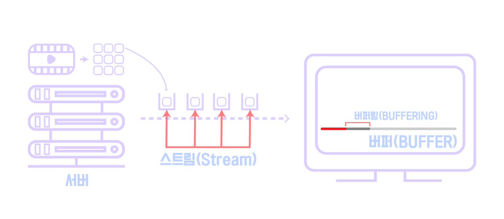
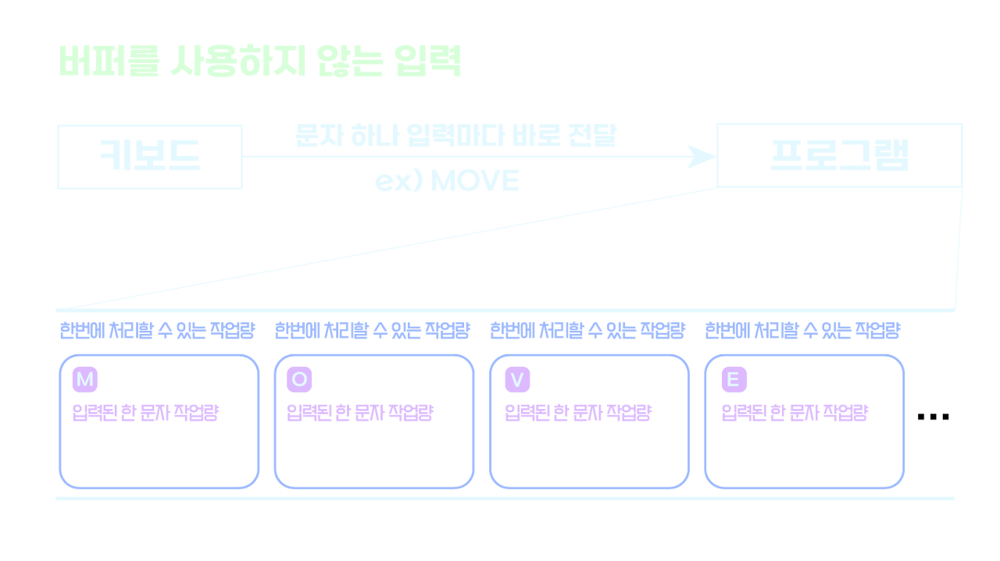
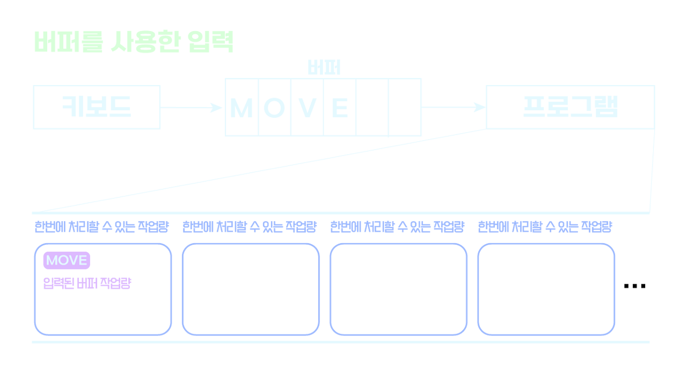

# Buffer

### 버퍼(Buffer)
- 하나의 장치에서 다른 장치로 데이터를 전송할 경우에 양자간의 데이터의 전송 속도나 처리 속도의 차를 보상하여 양호하게 결합할 목적으로 사용하는 기억영역
- 두개의 장치에서 데이터 전송 속도나 처리 속도의 차이를 완화하는 목적으로 사용하는 기억장치

 

### 유튜브에서의 버퍼 동작 예시
- 유튜브를 볼 때 먼저 도착한 영상 조각의 파일을 스트림이라고 했는데 버퍼는 서버로부터 보내지는 스트림을 순서대로 차곡차곡 쌓는 임시 데이터 공간임
- 유튜브를 볼 때 도착한 스트림까지가 회색 부분으로 사용자가 시청할 수 있는 최소한의 크기가 만들어지면 그걸 화면에 뿌려질 수 있도록 출력장치에 순차적으로 전달하여 사용자로 하여금 영상을 빠르게 볼 수 있도록 만들어 주는 것
- 버퍼링은 버퍼를 담는 과정

 

### 입력에서의 버퍼 동작
- 우선 처음 사진인 버퍼를 사용하지 않는 입력일 경우로 버퍼가 없는경우 M,O,V,E를 각각 작성하고 프로그램으로 해당 입력이 전달되는데 진한 파란 네모칸이 프로그램의 하나의 작업이고 네모의 크기가 한번에 처리할 수 있는 작업량이라고 가정하면 버퍼를 이용하지 않는 경우에는 키보드를 한번씩 클릭할 때 마다 각각의 문자가 프로그램으로 바로 전달이 되므로 각각 하나의 작업으로 잡히게 됨
- 해당 경우 일반적으로 프로그램이 한번의 처리할 수 있는 작업량보다 입력된 하나의 문자를 처리하는 작업량의 크기는 매우 작아 나머지 만큼의 작업량이 기회비용이 되어 날아가버려 속도면이나 효율성 측면이나 떨어지는 것을 알 수 있음
- 두번째 사진을 보면 버퍼가 있는 경우의 입력으로 특정 문자나 행동이 들어올때까지 버퍼가 사용자가 입력한 문자 M,O,V,E를 차례대로 저장하고 버퍼의 끝을 알리는 동작이 입력되면 지금까지 버퍼에 저장해두었던 문자를 프로그램으로 보냄
- 마찬가지로 파란 네모칸이 한번에 처리할 수 있는 작업칸으로 아직도 MOVE라는 단어도 프로그램이 한번에 처리할 수 있는 작업량에 비해 매우 작지만 사용자가 입력한 문자 전체를 한번에 처리하므로 날라가는 기회비용이 적어 속도나 효율적인 측면에서 버퍼를 사용하는 것이 좋음

 

### 결국 버퍼란?
-  버퍼란 처리 속도 차이가 나는 두개의 장치 사이에서 두 장치의 속도 차이를 완화하기 위한 것
- 처리 속도가 느린 장치에서 처리 속도가 빠른 장치로 이동할 때에는(처리 속도가 빠르다는 것은 결국 한번에 처리할 수 있는 양이 많다는 것과 같음) 버퍼에 빠른 장치가 처리할 수 있는 만큼 모았다가 전달하여 효율적으로 데이터를 처리하게 하며 반대의 경우에는 데이터를 잘게 쪼개 처리한 뒤 버퍼에 모은 식으로 하여 두 장치를 효율적으로 연결하는 것

 

22-12-01

-------

## Reference
- https://ontheway.tistory.com/52?category=1232424
- https://onlyfor-me-blog.tistory.com/368