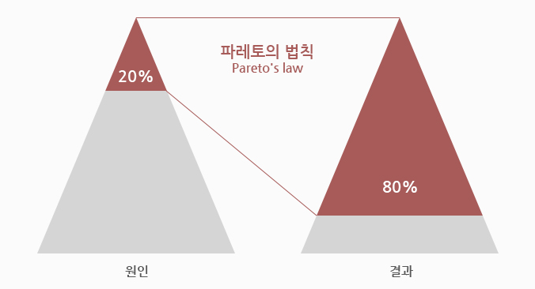
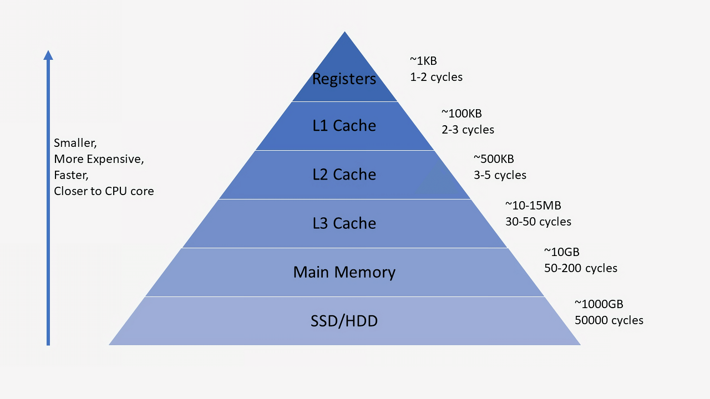

# Cache

### 캐시(Cache)
- 컴퓨터 과학에서 자주 사용하는 데이터나 값을 미리 복사해 놓는 임시 장소로 CPU 칩 내부나 바로 옆에 탑재하는 메모리
- CPU의 처리속도가 급격히 증가했지만 메모리 접근 속도는 늘어나지 않았고 메모리보다는 빠르고 CPU보다는 느린 cache를 메모리와 CPU사이에 위치시켜 CPU 데이터 접근 시간을 줄임
- 결과가 나올때마다 메모리에 저장하는 것보다 cache에 저장해두었다가 한번에 메모리를 최신화하는 것이 효율적
- 나중에 요청할 결과를 미리 저장해둔 후 빠르게 서비스해주는 것으로 미리 결과를 저장하고 나중에 요청을 한다면 그 요청에 대해 DB또는 API를 참조하지 않고도 캐시를 접근하여 요청을 처리 가능

 

### 파레토 법칙
- 캐시가 동작 할 수 있는 철학
- 80퍼센트의 결과는 20퍼센트의 원인으로 발생한다는 법칙
- 이것이 캐시가 효율적일 수 있는 이유로 모든 결과를 캐싱할 필요는 없으며 서비스할 경우 많이 사용되는 20%만 캐싱한다면 전체적으로 영향을 주어 효율을 극대화 함

#### 캐시의 장점
- 캐시에 데이터를 미리 복사해 놓으면, 계산이나 접근 시간 없이 더 빠른 속도로 데이터에 접근할 수 있음
- 접근 시간에 비해 원래 데이터에 접근하는 시간이 더 오래 걸리는 경우, 혹은 값을 다시 계산하는 시간을 절약하려고 할때 사용

#### 캐시의 단점
- 메모리 저장공간은 속도가 빠를수록 용량이 작고 가격이 높아 가격이 비싸다

 

### 캐시의 동작 방식
1. 데이터 요청이 들어오면 먼저 캐시에서 데이터 탐색
2. 캐시가 없거나(cache miss), 오래된(expiration) 경우 원본 데이터가 저장된 곳에서 데이터 조회 후 캐시에도 데이터를 복사/갱신
3. 캐시에 데이터가 있으면(cache hit) 캐시의 저장된 데이터를 제공 -> 데이터가 없을경우 필요 로직 실행
4. 오래된 데이터는 삭제(eviction) 

 

### 캐시 사용 구조
-  캐시를 어떻게 사용하나에 따라서 look aside cache(Lazy Loading)와 write back으로 나뉨
- loock aside cache는 캐시를 한번 접근하여 데이터가 있는지 판단 후, 있다면 캐시의 데이터를 사용하며 없다면 실제 DB 또는 API를 호출하는 로직으로 구현. 대부분의 캐시를 사용한 개발이 해당 프로세스를 이용
- write back은 캐시를 다르게 이용하는 방법으로 DB는 접근 횟수가 적을수록 전체 시스템의 퍼포먼스가 좋아지는데 데이터를 쓰거나 많은 데이터를 읽게 되면 DB에서 Disk를 접근하게 됨. 이렇게 되면 어플리케이션의 속도 저하가 일어날 수 있어 write back은 데이터를 cache에 모으고 일정한 주기 또는 일정한 크기가 되면 한번에 처리하는 방식
>- look aside cache (Lazy Loading)
>
>       1. Cache에 Data 존재 유무 확인
>       2. Data가 있다면 cache의 Data 사용
>       3. Data가 없다면 cache의 실제 DB Data 사용
>       4. DB에서 가져온 Data를 Cache에 저장
>- write back
>
>       1. Data를 Cache에 저장
>       2. Cache에 있는 Data를 일정 기간 동안 Check
>       3. 모여있는 Data를 DB에 저장
>       4. Cache에 있는 Data 삭제

 

### 캐시의 지역성
- 캐시가 효율적으로 동작하려면 캐시의 적중률(Hit-rate)를 극대화 해야함
- 캐시에 저장할 데이터가 지역성(Locality)를 가져야 함
- 지역성이란 데이터의 접근이 시간적, 공강적으로 가깝게 일어나는 것을 의미
- 지역성의 전제조건은 프로그램이 모든 코드나 데이터를 균등하게 Access하지 않는다는 특성을 기본으로 함
- 즉 지역성이란 기억장치 내의 정보를 균일하게 Access하는 것이 아니라 어느 한 순간에 특정 부분을 집중적으로 참조하는 특성임
> 지역성(Locality)의 종류
>1. 시간적 지역성
>       - 특정 데이터가 한번 접근되었을 경우, 가까운 미래에 또 다시 데이터에 접근할 가능성이 높은 것
>       - 메모리 상의 같은 주소에 여러 차례 읽기 쓰기를 수행할 경우 상대적으로 작은 크기의 캐시를 사용하여 효율성을 꾀할 수 있음
>2. 공간적 지역성
>       - 특정 데이터와 가까운 주소가 순서대로 접근되었을 경우
>       - CPU 캐시나 디스크 캐시의 경우 한 메모리 주소에 접근할 때 그 주소뿐 아니라 해당 블록을 전부 캐시에 가져오게 됨
>       - 이때 메모리 주소를 오름차순이나 내림차순으로 접근시 캐시에 이미 저장된 같은 블록의 데이터를 접근하게 되므로 캐시의 효율성 크게 향상
>3. 순차 지역성
>       - 공간 지역성과 함께 사용되어 데이터가 순차적으로 엑세스되는 경향을 보이고 프로그램 내의 명령어가 순차적으로 구성됨

 

### 캐시 메모리의 매핑 프로세스(Mapping Process)
- 매핑 프로세스는 CPU로부터 캐시 메모리로 데이터를 전송하는 방법으로 3가지 방법 존재
>- #### 직접 매핑(direct Mapping)
>       - 주기억장치의 블록들이 지정된 한 개의 캐시 라인으로 만 사상될 수 있는 매핑 방법
>       - 간단하고 구현하는 비용이 적게드는 장점이 있는 반면 적중률이 낮아질 수 있는 단점이 있음
>- #### 어소시에이티브 매핑(Associative Mapping)
>       - 직접 매핑 방식의 단점을 보완한 방식
>       - 모든 태그들을 병렬로 검사하기 때문에 복잡하고 비용이 높다는 단점이 있어 거의 사용하지 않음
>- #### 세트-어소시에이티브 매핑(Set-Associative Mapping)
>       - 직접 매핑과 연관 매핑의 장점만을 취한 방식

 

22-07-09

-------

## Reference
- https://yanacoding.tistory.com/entry/CS-캐시Cache란
- https://chelseashin.tistory.com/43
- https://velog.io/@tyjk8997/캐시와-궁금한점