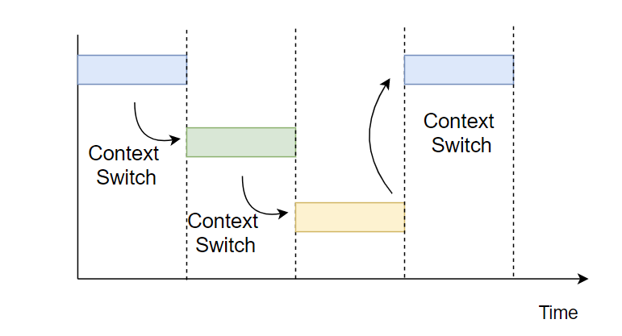
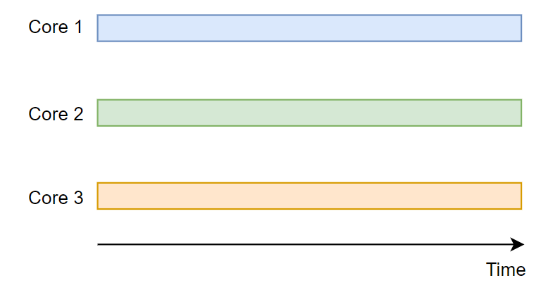

# Concurrency(동시성) vs Parallelism(병렬처리)

### Concurrency, Parallelism 간단 정리
 

### Concurrency(동시성)
- 동시성은 빠르게 전환하며 여러 작업을 수행하여 동시에 여러 작업이 실행되는 것 처럼 보이는 것.
- 한개의 코어에서도 여러 작업을 Concurrent 하게 실행할 수 있고, 작업 간에는 context switch 가 일어남 
- 싱글코어에서 멀티 쓰레드를 동작시키기 위한 방식
- Concurrnet 하게 실행되는 실행되는 Task들은 운영체제의 스케줄링 정책에 의해 실행되며 서로 복잡하게 엉켜 있음
- 이렇게 엉켜있는지 생각하는 것이 어려우니 동시에 실행된다고 생각하는 것이 Concurrency. 그렇기 때문에 Task가 동시에 수행될 때 생길 수 있는 문제점, 대표적으로 동기화 문제가 발생 가능

 

### 병렬처리(Parallelism)
- 여러 코어에서 여러 작업을 동시에 수항하는 것으로 코어가 하나밖에 없다면 병렬적으로 프로그램 실행이 불가능.
- CPU는 싱글코어의 성능을 올리는데 한계를 느끼고 멀티코어 체제로 넘어가 여러 코어에서 여러 작업을 동시에 수행하면서 성능을 올리려 함 
- 멀티코어에서 멀티 쓰레드를 동작 시키기 위한 방식
- 코어가 N배가 된다고 해도 모든 작업을 병렬적으로 수행하기는 어려우니  N배의 성능향상을 기대하긴 어렵지만 성능이 향상됨(암달의 법칙). 그러나 여러 작업을 동시에 수행하니 <code>racd condition(경쟁 상태)</code> 혹은 동기화 문제 발생 가능해짐.

>race condition (경쟁 상태)
>- 둘 이상의 입력 또는 조작의 타이밍이나 순서 등이 결과값에 영향을 줄 수 있는 상태. 
>- 동시 접근 시 자료의 일관성을 해치는 결과가 나타남
>- 발생하는 경우
>1. 커널 작업을 수행하는 중에 인터럽트 발생
>2. 프로세스가 시스템콜을 하여 커널모드로 진입하여 작업을 수행하는 도중 문맥 교환이 일어날 때
>3. 멀티 프로세서 환경에서 공유 메모리 내의 커널 데이터에 접근할 때

 

> 동기화 문제
>- 동기화 문제는 여러 작업이 동시에 공유된 자원에 접근하려 할 때 발생
>- 작업을 실행할떄 공유 자원에 접근하는 것을 동시라고 하기 때문에 멀티코어는 물론 concurrent하게 동작하는 task 사이에서도 동기화 문제 발생

 

### 동시성과 병렬성의 구분, 차이점 정리
- [참고사이트](https://vagabond95.me/posts/concurrency_vs_parallelism/)에서 보면 
둘을 구분하는 방법은 각 작업이 진행되는 시간의 관점에서 비교해야한다고 한다
- 동시성과 병렬성은 모두 먼저 시작된 작업이 task가 끝나지 않아도 또 다른 task를 시작할 수 있음 ( 동시성 : concurrently )
- 그러나 동시성은 적절하게 시간을 나눠 자원을 공유하고 있으므로 물리적으로 정확히 같은 시간대에 동시에 수행되는 것은 아님 -> 병렬성은 만족하지 않음
- 병렬성은 같은 시간대에 각 task가 동시에 수행되므로 병렬성을 만족함
> CS 내에서의 concurrently, simultanceously
>- concurrently : 2개 이상의 ask (= 코드, 알고리즘 등) 를 수행할 때, 각 task 는 다른 task 의 수행시점에 상관없이 수행이 가능하다는 의미 (sequencial 의 반의어이다.) 즉, N 개의 task 의 실행 시간이 타임라인 상에서 겹칠 수 있음
>- simultaneously : 우리가 일반적으로 사용하는 ’동시에’ 라는 단어의 맥락과 일치하는데 동작시간에 여러 쓰레드가 한 시점에 모두 동작하고 있을 수 있음.

 

|Concurrency|Parallelism|
|:---:|:---:|
|동시에 실행되는 것처럼 보이는 것|실제로 동시에 실행되는 것|
|논리적인 개념|물리적인 개념|
|동시성 만족|동시성 만족|
|병렬성 불만족|병렬성 만족|
|싱글코어, 멀티코어에서 가능|멀티코어에서만 가능|

 

22-07-01

 

## Reference
- https://spacebike.tistory.com/22
- https://vagabond95.me/posts/concurrency_vs_parallelism/
- https://github.com/gyoogle/tech-interview-for-developer/blob/master/Computer%20Science/Operating%20System/Race%20Condition.md